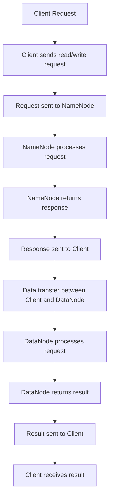

                 

关键词：HDFS，分布式文件系统，数据存储，大数据处理，MapReduce，Hadoop

> 摘要：本文将深入解析Hadoop分布式文件系统（HDFS）的原理、架构和代码实例，帮助读者理解HDFS的工作机制、性能优化方法及其在大数据处理中的应用。

## 1. 背景介绍

在当今大数据时代，数据的存储和处理需求日益增长。传统的文件系统由于在处理大规模数据时存在性能瓶颈，无法满足海量数据的存储和计算需求。为了解决这一问题，Hadoop分布式文件系统（HDFS）应运而生。HDFS是Hadoop生态系统中的核心组件，它提供了一个高可靠、高吞吐量的分布式文件存储系统，能够处理大规模数据集。

## 2. 核心概念与联系

### 2.1 HDFS架构


HDFS由两个核心组件组成：NameNode和DataNode。

- **NameNode**：作为主节点，负责管理文件系统的命名空间和客户端请求。它维护了一个全局的文件系统元数据，包括文件目录结构、文件块映射信息等。
- **DataNode**：作为数据节点，负责存储实际的数据块。每个数据节点负责存储它所拥有的数据块的副本，并响应来自NameNode的命令。

### 2.2 HDFS数据模型

HDFS将数据分割成固定大小的数据块（默认为128MB或256MB），并将这些数据块分布在多个DataNode上。数据块的副本数量可以通过配置参数`dfs.replication`来设置，通常为3个副本，以提高数据的可靠性和容错能力。

### 2.3 Mermaid流程图



## 3. 核心算法原理 & 具体操作步骤

### 3.1 算法原理概述

HDFS的核心算法是基于GFS（Google文件系统）的，它主要包括数据块的分割、数据块的存储策略、数据块的读写操作等。

### 3.2 算法步骤详解

#### 3.2.1 数据块的分割

当Client向HDFS写入数据时，数据会被分割成固定大小的数据块。这个过程中，主要涉及到以下步骤：

1. Client将数据分割成块。
2. NameNode记录每个块的元数据，包括块的位置和状态。
3. DataNode存储数据块。

#### 3.2.2 数据块的存储策略

HDFS采用数据块副本策略来提高数据的可靠性和容错能力。具体策略如下：

1. 当Client写入数据时，NameNode会决定将数据块存储在哪些DataNode上。
2. DataNode接收数据块，并存储在本地磁盘上。
3. NameNode记录数据块的副本位置。

#### 3.2.3 数据块的读写操作

当Client读取数据时，HDFS会按照以下步骤进行操作：

1. Client发送读请求到NameNode。
2. NameNode返回数据块的位置给Client。
3. Client从DataNode读取数据块。
4. DataNode响应Client的读取请求。

### 3.3 算法优缺点

#### 优点

- **高可靠性**：通过数据块副本策略，提高了数据的可靠性。
- **高吞吐量**：分布式存储和计算，能够处理大规模数据集。
- **高扩展性**：可以通过添加DataNode来扩展存储容量。

#### 缺点

- **单点故障**：NameNode是单点故障的潜在风险。
- **数据访问延迟**：由于数据块分散存储，可能会导致访问延迟。

### 3.4 算法应用领域

HDFS广泛应用于大数据处理领域，如搜索引擎、天气预报、社交网络分析等。它为大数据处理提供了强大的存储和计算能力。

## 4. 数学模型和公式 & 详细讲解 & 举例说明

### 4.1 数学模型构建

HDFS的数学模型主要包括数据块的分割策略、副本放置策略和数据传输速率。

### 4.2 公式推导过程

假设HDFS的数据块大小为`B`，数据块的副本数量为`R`，数据传输速率为`R_speed`。

数据块的分割公式为：

$$
\text{Block Count} = \frac{\text{Data Size}}{B}
$$

副本放置策略的公式为：

$$
\text{Replica Count} = R
$$

数据传输速率的公式为：

$$
\text{Transfer Speed} = R_speed \times \frac{B}{\text{Read/Write Duration}}
$$

### 4.3 案例分析与讲解

假设我们有一个1TB的数据集，数据块大小为128MB，副本数量为3。数据传输速率为100MB/s。

数据块的分割结果为：

$$
\text{Block Count} = \frac{1TB}{128MB} = 7812.5
$$

由于数据块是整数分割，我们将其向上取整为7813个数据块。

副本放置策略为：

$$
\text{Replica Count} = 3
$$

数据传输速率为：

$$
\text{Transfer Speed} = 100MB/s \times \frac{128MB}{\text{Read/Write Duration}}
$$

假设我们的读写操作需要2秒，则数据传输速率为：

$$
\text{Transfer Speed} = 100MB/s \times \frac{128MB}{2s} = 6400MB/s = 6.4GB/s
$$

这意味着我们可以以6.4GB/s的速率从HDFS中读取或写入数据。

## 5. 项目实践：代码实例和详细解释说明

### 5.1 开发环境搭建

为了演示HDFS的使用，我们需要搭建一个Hadoop环境。这里我们使用Apache Hadoop的Docker镜像来简化环境搭建过程。

首先，从Docker Hub下载Hadoop镜像：

```bash
docker pull hadoop:3.3.1
```

然后，启动一个Hadoop容器：

```bash
docker run -it -p 50070:50070 -p 8088:8088 --name hadoop hadoop:3.3.1 /bin/bash
```

容器启动后，我们可以通过浏览器访问NameNode Web界面（http://localhost:50070/）和ResourceManager Web界面（http://localhost:8088/）来监控Hadoop集群状态。

### 5.2 源代码详细实现

以下是一个简单的HDFS文件上传的Java代码实例：

```java
import org.apache.hadoop.conf.Configuration;
import org.apache.hadoop.fs.FileSystem;
import org.apache.hadoop.fs.Path;
import org.apache.hadoop.io.IOUtils;

public class HDFSFileUpload {
    public static void main(String[] args) throws Exception {
        Configuration conf = new Configuration();
        FileSystem fs = FileSystem.get(conf);

        Path localPath = new Path("example.txt");
        Path hdfsPath = new Path("/example.txt");

        fs.copyFromLocalFile(false, localPath, hdfsPath);
        IOUtils.closeStream(fs.open(hdfsPath));
        System.out.println("File uploaded to HDFS successfully!");
    }
}
```

### 5.3 代码解读与分析

这个简单的Java代码实现了将本地文件上传到HDFS的功能。以下是代码的详细解读：

1. **配置Hadoop环境**：创建一个Hadoop配置对象`conf`。
2. **获取文件系统实例**：使用配置对象`conf`获取`FileSystem`实例。
3. **指定本地文件路径**：创建本地文件路径对象`localPath`。
4. **指定HDFS文件路径**：创建HDFS文件路径对象`hdfsPath`。
5. **上传文件到HDFS**：调用`fs.copyFromLocalFile`方法将本地文件上传到HDFS。
6. **关闭文件系统**：关闭文件系统资源。

### 5.4 运行结果展示

假设我们已经将上述代码保存为`HDFSFileUpload.java`，并在Hadoop容器内。我们可以使用以下命令来编译并运行代码：

```bash
javac HDFSFileUpload.java
docker exec -it hadoop java HDFSFileUpload
```

运行成功后，我们在HDFS的Web界面（http://localhost:50070/）可以看到刚刚上传的`example.txt`文件。

## 6. 实际应用场景

HDFS在大数据处理领域有着广泛的应用。以下是一些实际应用场景：

- **大数据存储**：HDFS是大数据存储的基石，适用于大规模数据的存储和管理。
- **日志处理**：互联网公司通常使用HDFS存储和分析海量日志数据。
- **数据仓库**：HDFS与数据仓库结合，可以处理大规模的在线分析和报告。

## 7. 工具和资源推荐

### 7.1 学习资源推荐

- **《Hadoop权威指南》**：详细介绍了Hadoop及其相关技术的使用。
- **Apache Hadoop官网**：提供最新的文档和教程。

### 7.2 开发工具推荐

- **IntelliJ IDEA**：支持Hadoop插件，提供方便的Hadoop开发环境。
- **Eclipse**：同样支持Hadoop插件，适合Java开发者。

### 7.3 相关论文推荐

- **"The Google File System"**：GFS的原型论文，详细介绍了GFS的设计和实现。
- **"MapReduce: Simplified Data Processing on Large Clusters"**：介绍了MapReduce算法，是Hadoop的核心。

## 8. 总结：未来发展趋势与挑战

### 8.1 研究成果总结

HDFS作为大数据存储的基石，已经在大数据处理领域取得了显著的成果。然而，随着数据规模的不断扩大和数据处理需求的增长，HDFS面临着许多挑战。

### 8.2 未来发展趋势

- **优化性能**：针对单点故障和数据访问延迟等问题，未来HDFS将更加注重性能优化。
- **支持更多数据类型**：HDFS将支持更多的数据类型，如图形数据、时空数据等。
- **集成与扩展**：HDFS与其他大数据处理框架（如Spark）的集成和扩展将是未来的一个重要方向。

### 8.3 面临的挑战

- **单点故障**：如何保证HDFS的高可用性是一个重要挑战。
- **数据迁移**：随着数据规模的不断扩大，如何高效地进行数据迁移是一个难题。

### 8.4 研究展望

未来，HDFS将继续在大数据处理领域发挥重要作用。通过技术创新和优化，HDFS有望解决当前面临的问题，为大数据处理提供更高效、更可靠、更安全的解决方案。

## 9. 附录：常见问题与解答

### Q: HDFS的最大文件大小是多少？

A: HDFS支持的最大文件大小是2^63-1字节，即9,223,372,036,854,775,807字节。

### Q: 如何解决HDFS的单点故障问题？

A: 可以通过部署HDFS的高可用性（HA）集群来解决单点故障问题。在HA集群中，可以有两个NameNode，当一个NameNode发生故障时，另一个NameNode可以接管其工作。

### Q: HDFS的数据块副本是如何分布的？

A: HDFS的数据块副本默认有三个副本，这些副本会被放置在不同的DataNode上。具体分布策略可以通过配置参数进行调整。

---

作者：禅与计算机程序设计艺术 / Zen and the Art of Computer Programming


