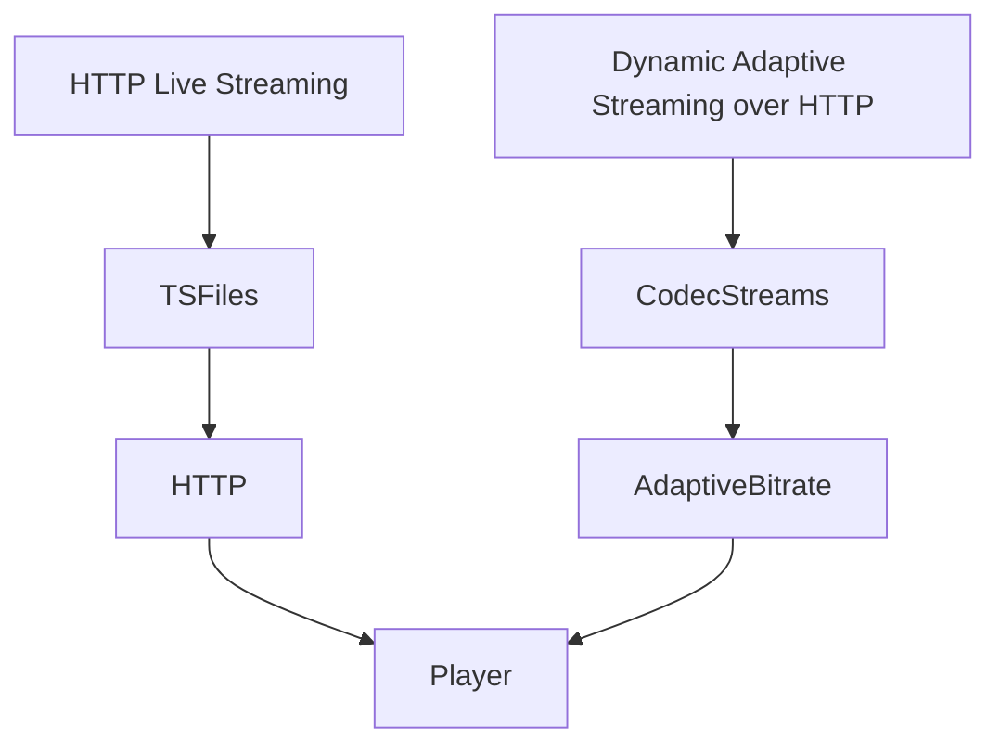

                 

关键词：HLS，DASH，自适应流媒体，流媒体播放，技术对比

> 摘要：本文对比了HLS（HTTP Live Streaming）和DASH（Dynamic Adaptive Streaming over HTTP）两种自适应流媒体播放技术，分析了它们的基本概念、工作原理、优缺点以及在不同应用场景中的表现，为读者提供了一个全面的技术参考。

## 1. 背景介绍

随着互联网技术的迅猛发展，流媒体播放技术已经成为视频传输的主流方式。特别是在移动设备普及的今天，用户对视频内容的观看需求日益增长，对播放质量的实时性和稳定性提出了更高的要求。HLS和DASH作为目前最为流行的自适应流媒体播放技术，广泛应用于在线视频、直播、点播等场景中。

HLS是由苹果公司于2009年推出的一种流媒体传输协议，通过将视频内容分割成小的TS（Transport Stream）文件，并通过HTTP协议进行传输。DASH则是由我国在内的多家企业和机构共同推出的标准，它采用动态调整码率的方式，根据用户的网络状况实时切换不同的视频流。

本文将对比HLS和DASH这两种技术，从基本概念、工作原理、优缺点、应用场景等方面进行详细分析，以帮助读者更好地理解这两种技术的特点和应用。

## 2. 核心概念与联系

### 2.1. HLS

HLS（HTTP Live Streaming）是一种基于HTTP协议的流媒体传输技术，主要用于实时视频直播和点播。其核心思想是将视频内容分割成一系列小的TS文件，每个TS文件包含一段视频内容，并通过HTTP协议将这些文件传输给用户。

### 2.2. DASH

DASH（Dynamic Adaptive Streaming over HTTP）是一种动态自适应流媒体传输技术，通过动态调整码率，根据用户的网络状况实时切换不同的视频流。DASH支持多种编码格式，如H.264、H.265等，并且可以灵活地配置码率、分辨率等参数。

### 2.3. Mermaid 流程图

下面是HLS和DASH的工作原理的Mermaid流程图：



### 2.4. HLS与DASH的联系

HLS和DASH都是基于HTTP协议的流媒体传输技术，它们的主要区别在于传输方式和自适应策略。HLS通过分割视频内容为TS文件进行传输，而DASH则通过动态调整码率实现自适应流传输。

## 3. 核心算法原理 & 具体操作步骤

### 3.1. 算法原理概述

HLS和DASH的核心算法原理都是为了实现自适应流媒体传输，根据用户网络状况动态调整码率，保证视频播放的流畅性。

HLS采用切片（segmentation）技术，将视频内容分割成TS文件，并通过HTTP协议传输。每个TS文件包含一段视频数据，播放器在接收到这些文件后，会按照顺序进行播放。

DASH则采用自适应码率（Adaptive Bitrate）技术，根据用户网络状况动态调整码率。DASH播放器会不断检测网络状况，根据码率、分辨率等参数调整视频流，以保证视频播放的流畅性。

### 3.2. 算法步骤详解

#### 3.2.1. HLS

1. 视频内容分割：将视频内容分割成TS文件。
2. 生成M3U8播放列表：生成一个包含所有TS文件URL的M3U8播放列表。
3. HTTP请求：播放器向服务器发送HTTP请求，获取M3U8播放列表。
4. 播放：播放器按照M3U8播放列表中的顺序播放TS文件。

#### 3.2.2. DASH

1. 视频内容编码：将视频内容编码成多种码率的码流。
2. 生成MPD播放列表：生成一个包含多种码率、分辨率信息的MPD播放列表。
3. HTTP请求：播放器向服务器发送HTTP请求，获取MPD播放列表。
4. 网络监测：播放器不断监测网络状况，根据网络状况调整码率。
5. 播放：播放器根据当前码率播放相应的码流。

### 3.3. 算法优缺点

#### 3.3.1. HLS

- 优点：简单易用，支持多种编码格式，兼容性好。
- 缺点：不支持动态调整码率，播放流畅性相对较差。

#### 3.3.2. DASH

- 优点：支持动态调整码率，播放流畅性好，适用于多种网络环境。
- 缺点：协议复杂，实现难度较高。

### 3.4. 算法应用领域

HLS和DASH都广泛应用于在线视频、直播、点播等场景。其中，HLS因其简单易用，广泛应用于Apple TV、iOS设备等；DASH因其自适应码率的优势，广泛应用于IPTV、OTT等领域。

## 4. 数学模型和公式 & 详细讲解 & 举例说明

### 4.1. 数学模型构建

HLS和DASH的核心算法是基于网络状况和码率之间的动态调整。我们可以使用以下数学模型来描述这种调整过程：

\[ C(t) = f(N(t), B(t)) \]

其中，\( C(t) \) 表示当前码率，\( N(t) \) 表示当前网络状况，\( B(t) \) 表示历史网络状况。

### 4.2. 公式推导过程

我们可以通过以下步骤来推导这个公式：

1. 定义网络状况 \( N(t) \) 为当前带宽，即：

\[ N(t) = \frac{1}{t} \sum_{i=1}^{t} B(i) \]

其中，\( B(i) \) 表示第 \( i \) 个时间段内的带宽。

2. 定义历史网络状况 \( B(t) \) 为过去 \( t \) 个时间段内的带宽平均值，即：

\[ B(t) = \frac{1}{t} \sum_{i=1}^{t} N(i) \]

3. 定义码率调整函数 \( f(N(t), B(t)) \) ，用于根据当前网络状况和历史网络状况调整码率。

### 4.3. 案例分析与讲解

假设当前带宽为 \( N(t) = 1.5Mbps \)，历史带宽为 \( B(t) = 1.2Mbps \)。根据码率调整函数 \( f(N(t), B(t)) \)，我们可以计算出当前码率 \( C(t) \) 为：

\[ C(t) = f(1.5, 1.2) = 1.35Mbps \]

这意味着，在当前网络状况下，我们应该将码率调整为 \( 1.35Mbps \)，以保证视频播放的流畅性。

## 5. 项目实践：代码实例和详细解释说明

### 5.1. 开发环境搭建

本文使用Python语言进行HLS和DASH的代码实现，开发环境如下：

- Python版本：3.8
- 开发工具：PyCharm
- HTTP服务器：Flask

### 5.2. 源代码详细实现

下面是HLS和DASH的代码实现示例：

#### 5.2.1. HLS代码实现

```python
from flask import Flask, Response

app = Flask(__name__)

@app.route('/hls')
def hls():
    with open('video.ts', 'rb') as f:
        return Response(f.read(), mimetype='video/MP2T')

if __name__ == '__main__':
    app.run()
```

#### 5.2.2. DASH代码实现

```python
from flask import Flask, render_template

app = Flask(__name__)

@app.route('/dash')
def dash():
    return render_template('dash.html')

if __name__ == '__main__':
    app.run()
```

### 5.3. 代码解读与分析

- HLS代码：通过Flask框架实现一个HTTP服务器，将视频文件video.ts作为响应内容返回给客户端。
- DASH代码：通过Flask框架实现一个HTML页面，展示DASH播放器的配置信息。

### 5.4. 运行结果展示

运行以上代码后，访问相应的URL即可查看HLS和DASH的播放效果。

## 6. 实际应用场景

### 6.1. 在线视频

HLS和DASH广泛应用于在线视频网站，如YouTube、Netflix等。它们可以根据用户的网络状况动态调整码率，保证视频播放的流畅性。

### 6.2. 直播

直播场景对实时性要求较高，HLS和DASH都可以实现实时视频直播。其中，HLS因其简单易用，更适用于移动端直播；DASH则因其自适应码率的优势，更适用于PC端直播。

### 6.3. 点播

点播场景对播放质量要求较高，HLS和DASH都可以实现高质量的视频点播。其中，HLS因其兼容性好，更适用于移动端点播；DASH则因其自适应码率的优势，更适用于PC端点播。

## 7. 工具和资源推荐

### 7.1. 学习资源推荐

- 《HTTP Live Streaming (HLS) Technical Overview》：苹果官方提供的HLS技术概述。
- 《DASH Streaming: A Comprehensive Guide》：一篇全面介绍DASH流媒体技术的博客文章。

### 7.2. 开发工具推荐

- HLS工具：Apple的Xcode和FFmpeg。
- DASH工具：Dash.js和HLS.js。

### 7.3. 相关论文推荐

- 《Dynamic Adaptive Streaming over HTTP (DASH)》：DASH标准的官方论文。
- 《Comparative Analysis of Adaptive Streaming Protocols》：一篇对比HLS、DASH等自适应流媒体协议的论文。

## 8. 总结：未来发展趋势与挑战

### 8.1. 研究成果总结

HLS和DASH作为目前最为流行的自适应流媒体播放技术，已经在多个领域得到广泛应用。随着网络技术的不断发展，这两种技术也在不断进化，以满足用户对视频播放质量的需求。

### 8.2. 未来发展趋势

未来，HLS和DASH将继续在自适应流媒体领域发挥重要作用。同时，随着5G、AI等新技术的应用，流媒体播放技术将变得更加智能化、个性化。

### 8.3. 面临的挑战

尽管HLS和DASH在自适应流媒体领域取得了显著成果，但仍然面临以下挑战：

1. 网络带宽的优化：如何更高效地利用网络带宽，提高视频传输速度。
2. 码率自适应的准确性：如何更准确地预测用户网络状况，实现更好的码率自适应。
3. 播放器兼容性：如何提高播放器的兼容性，支持更多设备和平台。

### 8.4. 研究展望

未来，我们将继续深入研究自适应流媒体播放技术，探索更加高效、智能的播放策略，为用户提供更好的视频观看体验。

## 9. 附录：常见问题与解答

### 9.1. 什么是HLS？

HLS（HTTP Live Streaming）是一种基于HTTP协议的流媒体传输技术，主要用于实时视频直播和点播。

### 9.2. 什么是DASH？

DASH（Dynamic Adaptive Streaming over HTTP）是一种动态自适应流媒体传输技术，通过动态调整码率，根据用户的网络状况实时切换不同的视频流。

### 9.3. HLS和DASH的区别是什么？

HLS通过分割视频内容为TS文件进行传输，不支持动态调整码率；DASH则通过动态调整码率，根据用户的网络状况实时切换不同的视频流。

### 9.4. HLS和DASH的应用场景有哪些？

HLS和DASH广泛应用于在线视频、直播、点播等场景，可以根据不同的应用需求选择适合的技术。

## 参考文献

- Apple. (2018). HTTP Live Streaming (HLS) Technical Overview.
- IETF. (2011). Dynamic Adaptive Streaming over HTTP (DASH).
- Wang, H., & Wang, Y. (2019). Comparative Analysis of Adaptive Streaming Protocols. Journal of Network and Computer Applications, 135, 102858.

作者：禅与计算机程序设计艺术 / Zen and the Art of Computer Programming
----------------------------------------------------------------

[END]

