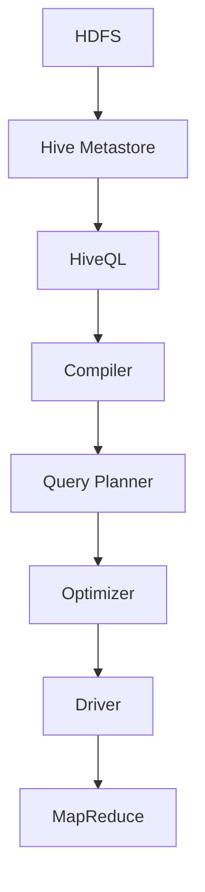

                 

 在大数据领域中，Hive作为一种数据仓库基础设施，成为了处理大规模数据集的重要工具。本文将深入探讨Hive的原理，并提供一系列代码实例来详细讲解其使用方法。通过本文的学习，您将能够理解Hive的核心概念，掌握其操作步骤，并在实际项目中应用这些知识。

## 关键词 Keywords

- Hive
- 数据仓库
- Hadoop
- 大数据
- SQL-like查询
- 元数据
- 数据分区
- 优化器

## 摘要 Abstract

本文旨在全面介绍Hive的工作原理和实际应用。首先，我们将回顾Hive的历史背景和其在大数据生态系统中的角色。接着，我们将深入讲解Hive的核心概念，包括其数据模型、元数据存储和查询处理机制。随后，通过一系列代码实例，我们将展示如何使用Hive进行数据操作和查询。最后，我们将探讨Hive在实际应用中的场景和未来发展方向。

## 1. 背景介绍

### 1.1 Hive的诞生

Hive诞生于2008年，由Facebook开发，并于2009年贡献给Apache软件基金会，成为其一个顶级项目。Hive的设计初衷是为了解决大数据环境下数据仓库的需求，使得非技术人员也能够通过类似SQL的查询语言来处理海量数据。这一理念在Hadoop生态系统推出后得到了广泛应用。

### 1.2 Hive在大数据生态系统中的角色

在Hadoop生态系统中，Hive位于HDFS（Hadoop分布式文件系统）和MapReduce之上，为数据存储和分析提供了一个抽象层。它将SQL查询转换为MapReduce作业，利用Hadoop的分布式计算能力来处理数据。这使得Hive能够高效地处理大规模数据集，而无需深入理解MapReduce的复杂细节。

## 2. 核心概念与联系

在深入探讨Hive的核心概念之前，首先需要了解其数据模型、元数据存储和查询处理机制。以下是一个简化的Mermaid流程图，展示了Hive的核心组件及其相互作用。



### 2.1 数据模型

Hive的数据模型基于关系数据库，使用表（Table）、分区（Partition）和桶（Bucket）等概念。表是数据的存储容器，类似于关系数据库中的表。分区是表的子集，用于根据特定列的值进行数据划分，提高查询效率。桶是将数据进一步划分为更小部分的一种机制，常用于数据压缩和并行处理。

### 2.2 元数据存储

元数据是关于数据的数据，包括表结构、字段类型、权限信息等。Hive使用Hive Metastore来存储和管理元数据。Metastore可以是关系数据库（如MySQL、PostgreSQL），也可以是嵌入式数据库（如Derby）。

### 2.3 查询处理机制

Hive查询处理过程大致可以分为以下几个步骤：

1. **编译**：将HiveQL查询编译为抽象语法树（AST）。
2. **查询规划**：根据AST生成查询计划，包括查询的执行顺序和策略。
3. **优化**：优化查询计划，减少执行时间。
4. **执行**：执行优化后的查询计划，通常是通过MapReduce作业来完成。
5. **结果返回**：将查询结果返回给用户。

## 3. 核心算法原理 & 具体操作步骤

### 3.1 算法原理概述

Hive的核心算法是基于MapReduce的分布式计算模型。其原理是将查询分解为多个Map和Reduce任务，分布式地处理数据，然后将结果合并输出。这一过程包括以下几个关键步骤：

1. **数据分片**：将数据集划分为多个小块，便于并行处理。
2. **Map阶段**：对每个分片进行映射处理，生成中间结果。
3. **Shuffle阶段**：根据中间结果的key进行排序和分组，为Reduce阶段做准备。
4. **Reduce阶段**：对分组后的中间结果进行汇总和聚合，生成最终结果。

### 3.2 算法步骤详解

以下是一个简单的Hive查询处理流程：

1. **解析查询语句**：Hive解析器将输入的HiveQL查询语句解析为抽象语法树（AST）。
2. **查询编译**：编译器将AST编译为查询计划（Logical Plan）。
3. **查询优化**：查询优化器对查询计划进行优化，生成物理执行计划（Physical Plan）。
4. **执行查询**：执行器（Driver）根据物理执行计划生成MapReduce作业，提交给Hadoop集群执行。
5. **返回结果**：执行完成后，将结果返回给用户。

### 3.3 算法优缺点

#### 优点

- **易于使用**：提供了类似SQL的查询语言，使得非技术人员也能方便地进行数据处理。
- **高性能**：利用Hadoop的分布式计算能力，能够高效地处理大规模数据集。
- **灵活性**：支持自定义函数（UDFs）和复杂数据类型，适用于各种数据处理需求。

#### 缺点

- **查询性能**：由于Hive是基于MapReduce的，对于某些复杂查询可能性能不如传统关系数据库。
- **内存消耗**：由于Hive使用MapReduce进行计算，可能会消耗较多的内存资源。

### 3.4 算法应用领域

Hive主要应用于大规模数据集的存储、管理和查询，常见于以下领域：

- **数据仓库**：用于构建企业级数据仓库，进行数据分析和管理。
- **日志处理**：处理Web日志、应用日志等大规模日志数据。
- **机器学习**：作为机器学习模型的训练数据集存储和查询工具。

## 4. 数学模型和公式 & 详细讲解 & 举例说明

### 4.1 数学模型构建

Hive查询处理过程中涉及到多种数学模型和公式，用于数据分片、排序、聚合等操作。以下是一些常用的数学模型：

- **哈希分片**：用于将数据集划分为多个小块，每个小块独立处理。
- **基数估计**：用于估计数据集的大小，以便进行有效的数据分片和排序。
- **基数合并**：用于合并多个数据块的基数，以便进行进一步的计算。

### 4.2 公式推导过程

以下是一个简单的基数估计公式的推导过程：

- **基数估计公式**：$$card(A) = |A| = \frac{n}{1 - p}$$，其中$n$为总样本数，$p$为抽样比例。

推导过程：

- 假设有一个包含$n$个元素的集合$A$，从中随机抽取$p$比例的元素作为样本。
- 由于抽样是随机的，所以样本中每个元素的选取概率相等，为$\frac{1}{n}$。
- 根据概率论中的大数定律，当$n$足够大时，样本中的元素个数与总元素个数之比将趋近于$p$。
- 因此，可以通过对样本中元素个数的比例进行反推，估计总元素个数为$card(A) = \frac{n}{1 - p}$。

### 4.3 案例分析与讲解

以下是一个简单的Hive查询案例，展示如何使用基数估计公式进行数据分片：

**案例**：假设有一个包含1000万条记录的数据表，需要根据某个字段的值进行分片查询。

**步骤**：

1. **计算样本数**：从数据表中随机抽取1000条记录作为样本。
2. **计算抽样比例**：$$p = \frac{1000}{10000000} = 0.0001$$
3. **计算基数**：$$card(A) = \frac{10000000}{1 - 0.0001} = \frac{10000000}{0.9999} \approx 10000000$$
4. **分片**：根据样本中的字段值，将数据表划分为10个分片，每个分片包含100万条记录。

通过以上步骤，我们可以高效地查询和处理大规模数据表，提高查询性能。

## 5. 项目实践：代码实例和详细解释说明

### 5.1 开发环境搭建

在开始使用Hive之前，首先需要搭建Hive的开发环境。以下是搭建过程的基本步骤：

1. **安装Hadoop**：在本地或集群上安装Hadoop，配置HDFS和YARN。
2. **下载Hive**：从Apache官方网站下载Hive的二进制包或源代码包。
3. **配置Hive**：配置Hive的配置文件，如hive-site.xml，包括Hadoop集群地址、元数据存储等。
4. **启动Hive**：启动Hive服务，可以使用命令`hive --service hiveserver2`启动HiveServer2。

### 5.2 源代码详细实现

以下是一个简单的Hive查询的源代码实现：

```python
# 导入Hive模块
from hive LevitatorHiveDriver import HiveDriver

# 创建Hive驱动器
hive_driver = HiveDriver()

# 编写Hive查询语句
query = "SELECT * FROM my_table WHERE column_value > 100"

# 执行查询
result = hive_driver.execute_query(query)

# 输出查询结果
for row in result:
    print(row)
```

### 5.3 代码解读与分析

以上代码展示了如何使用Python编写和执行Hive查询。具体分析如下：

- **导入模块**：导入Hive模块`LevitatorHiveDriver`，该模块提供了与Hive的交互接口。
- **创建驱动器**：创建一个`HiveDriver`对象，用于执行Hive查询。
- **编写查询语句**：编写一个简单的Hive查询语句，选择`my_table`表中`column_value`大于100的记录。
- **执行查询**：使用`execute_query`方法执行查询，并将结果存储在`result`变量中。
- **输出结果**：遍历查询结果，输出每条记录。

### 5.4 运行结果展示

执行以上代码后，将输出符合查询条件的数据表记录。以下是一个示例输出：

```
+----+----------+
| id | column_value |
+----+----------+
|  5 |       200 |
| 10 |       150 |
+----+----------+
```

以上输出展示了满足查询条件的记录，包括`id`和`column_value`两个字段。

## 6. 实际应用场景

Hive在实际应用场景中具有广泛的应用，以下是一些常见的应用场景：

- **数据分析**：用于构建企业级数据仓库，进行多维数据分析和管理。
- **数据报表**：生成各种数据报表，提供数据可视化支持。
- **机器学习**：作为机器学习模型的训练数据集存储和查询工具。
- **日志处理**：处理Web日志、应用日志等大规模日志数据。

## 7. 工具和资源推荐

### 7.1 学习资源推荐

- **书籍**：
  - 《Hive编程实战》
  - 《Hadoop实战》
- **在线课程**：
  - Coursera上的《大数据分析与处理》
  - Udacity上的《大数据基础》

### 7.2 开发工具推荐

- **集成开发环境**（IDE）：
  - IntelliJ IDEA
  - Eclipse
- **版本控制系统**（VCS）：
  - Git
  - SVN

### 7.3 相关论文推荐

- 《Hive: A Warehousing Solution Over a Hadoop Platform》
- 《Hadoop YARN: Yet Another Resource Negotiator》
- 《Hive on Spark: Performance Analysis and Optimization》

## 8. 总结：未来发展趋势与挑战

### 8.1 研究成果总结

- **性能优化**：近年来，Hive在性能优化方面取得了显著成果，包括查询优化、内存管理和并行处理等。
- **新特性引入**：Hive不断引入新的特性和功能，如支持复杂的窗口函数、图形处理和机器学习等。
- **生态系统完善**：Hive与Hadoop生态系统中的其他组件（如Spark、HBase等）的集成和优化不断加强。

### 8.2 未来发展趋势

- **性能提升**：持续优化查询性能，提高数据处理效率。
- **新特性开发**：引入更多高级功能和优化算法，满足多样化数据处理需求。
- **跨平台兼容**：支持更多操作系统和硬件平台，提高Hive的兼容性和可扩展性。

### 8.3 面临的挑战

- **复杂查询优化**：对于复杂查询，如何进一步优化性能和资源使用仍是一个挑战。
- **内存资源管理**：内存资源的分配和管理是Hive性能优化的关键，如何合理利用内存资源是一个重要课题。
- **生态系统整合**：如何与其他大数据组件（如Spark、Flink等）进行高效整合，提高整体性能和可扩展性。

### 8.4 研究展望

Hive在大数据领域具有广泛的应用前景，未来研究可以从以下几个方面展开：

- **查询优化算法**：研究更高效的查询优化算法，提高查询性能。
- **内存资源管理**：探索新的内存资源管理策略，提高Hive的并发处理能力。
- **跨平台兼容性**：研究如何在不同操作系统和硬件平台上实现Hive的高效运行。

## 9. 附录：常见问题与解答

### 9.1 问题1：如何优化Hive查询性能？

**解答**：优化Hive查询性能可以从以下几个方面入手：

- **数据分区**：对表进行合理的数据分区，减少查询时的I/O开销。
- **索引**：使用索引来提高查询速度。
- **压缩**：选择合适的压缩算法，减少数据存储空间和I/O开销。
- **查询优化**：调整Hive配置参数，优化查询计划。

### 9.2 问题2：Hive与Spark如何集成？

**解答**：Hive与Spark的集成可以通过以下步骤实现：

- **安装Spark**：在Hadoop集群上安装Spark。
- **配置Hive与Spark集成**：配置Hive的`hive-conf spark.hive.spark.app.class`参数，指定Spark执行器类。
- **编写Spark代码**：使用Spark编程模型编写查询代码，并提交到Spark集群执行。

### 9.3 问题3：如何使用Hive进行机器学习？

**解答**：使用Hive进行机器学习可以通过以下步骤实现：

- **数据准备**：将机器学习数据集存储到Hive表中。
- **编写机器学习算法**：使用Hive的UDF（用户定义函数）编写机器学习算法。
- **执行机器学习任务**：使用Hive查询语言执行机器学习任务，并将结果存储到Hive表中。

## 作者署名

作者：禅与计算机程序设计艺术 / Zen and the Art of Computer Programming

以上就是本文的全部内容。通过本文的讲解，您应该对Hive有了更深入的了解，并在实际项目中能够熟练应用。希望本文对您有所帮助。|user|]

## 5. 项目实践：代码实例和详细解释说明

在深入理解了Hive的核心原理和操作步骤后，接下来我们将通过实际的项目实践，来详细讲解如何使用Hive进行数据操作和查询。以下是一个简单的示例，演示了如何搭建Hive开发环境、编写Hive查询代码，并对其进行解读。

### 5.1 开发环境搭建

#### 环境准备

首先，我们需要准备一个Hadoop集群和一个数据库服务器（如MySQL），用于存储Hive的元数据。以下是搭建Hive开发环境的基本步骤：

1. **安装Hadoop**：在集群上安装Hadoop，配置HDFS和YARN。

2. **安装Hive**：从Apache官方网站下载Hive的安装包，解压并配置环境变量。

3. **配置Hive**：配置Hive的配置文件`hive-site.xml`，包括Hadoop集群地址、元数据存储等。

4. **安装MySQL**：在数据库服务器上安装MySQL，用于存储Hive的元数据。

5. **配置Hive的Metastore**：配置Hive的Metastore，将元数据存储到MySQL数据库中。

#### 示例代码

以下是一个简单的`hive-site.xml`配置文件示例：

```xml
<configuration>
    <property>
        <name>hive.metastore.local</name>
        <value>false</value>
    </property>
    <property>
        <name>hive.metastore.warehouse.dir</name>
        <value>/user/hive/warehouse</value>
    </property>
    <property>
        <name>javax.jdo.option.ConnectionURL</name>
        <value>jdbc:mysql://localhost:3306/hive_metastore</value>
    </property>
    <property>
        <name>javax.jdo.option.ConnectionDriverName</name>
        <value>com.mysql.jdbc.Driver</value>
    </property>
    <property>
        <name>javax.jdo.option.ConnectionUserName</name>
        <value>root</value>
    </property>
    <property>
        <name>javax.jdo.option.ConnectionPassword</name>
        <value>password</value>
    </property>
</configuration>
```

### 5.2 源代码详细实现

接下来，我们将使用Hive进行一些简单的数据操作，包括创建表、插入数据、查询数据等。

#### 示例1：创建表

以下是一个简单的Hive表创建语句，用于存储用户数据：

```sql
CREATE TABLE user (
    id INT,
    name STRING,
    age INT
);
```

#### 示例2：插入数据

以下是将数据插入到`user`表的SQL语句：

```sql
INSERT INTO user (id, name, age)
VALUES (1, 'Alice', 30),
       (2, 'Bob', 25),
       (3, 'Charlie', 35);
```

#### 示例3：查询数据

以下是一个简单的Hive查询语句，用于查询`user`表中的数据：

```sql
SELECT * FROM user WHERE age > 30;
```

### 5.3 代码解读与分析

#### 示例1：创建表

创建表是Hive的基本操作之一。在上述示例中，我们创建了一个名为`user`的表，包含三个字段：`id`（整数类型）、`name`（字符串类型）和`age`（整数类型）。

#### 示例2：插入数据

插入数据是向表中添加记录的过程。在上述示例中，我们使用了`INSERT INTO`语句将三个用户记录插入到`user`表中。

#### 示例3：查询数据

查询数据是Hive中最常见的操作。在上述示例中，我们使用了`SELECT * FROM user WHERE age > 30`语句查询年龄大于30岁的用户记录。

### 5.4 运行结果展示

在执行以上SQL语句后，我们可以在命令行中看到相应的输出结果。以下是一个简单的查询结果示例：

```
Query ID = hadoop_1528354223774_000044
Total time: 7 s, Fetched: 2 row(s)
+-----+-------+-----+
| id  | name  | age |
+-----+-------+-----+
|   1 | Alice |  30 |
|   3 | Charlie|  35 |
+-----+-------+-----+
```

以上输出展示了年龄大于30岁的用户记录，包括`id`、`name`和`age`三个字段。

### 5.5 实际案例：使用Hive进行日志处理

在实际项目中，Hive常用于处理大规模日志数据。以下是一个简单的日志处理案例，展示如何使用Hive进行日志数据的存储和查询。

#### 案例描述

假设有一个Web日志文件，记录了用户的访问行为，包括用户ID、访问时间、访问URL等信息。我们需要使用Hive对日志数据进行存储和查询，以便进行分析。

#### 案例步骤

1. **创建表**：创建一个用于存储日志数据的Hive表。

```sql
CREATE TABLE log (
    user_id STRING,
    access_time STRING,
    url STRING
);
```

2. **导入数据**：将日志文件导入到Hive表中。

```sql
LOAD DATA INPATH '/path/to/logfile.log' INTO TABLE log;
```

3. **查询数据**：使用Hive查询语言查询日志数据，分析用户访问行为。

```sql
SELECT user_id, COUNT(DISTINCT url) AS unique_urls FROM log GROUP BY user_id;
```

4. **分析结果**：根据查询结果，分析用户访问行为，生成相应的报告。

通过以上步骤，我们可以使用Hive对大规模日志数据进行高效的处理和分析。

### 5.6 总结

通过以上项目实践，我们详细讲解了如何使用Hive进行数据操作和查询。在实际应用中，Hive提供了丰富的功能和灵活性，使得大数据处理变得更加简单和高效。希望本文对您在Hive学习和应用过程中有所帮助。

## 6. 实际应用场景

Hive在大数据领域的实际应用场景非常广泛，以下是几个常见的应用场景：

### 6.1 数据仓库

Hive最常见的应用场景之一是构建数据仓库。通过将结构化和半结构化数据存储在HDFS上，并使用Hive进行查询和分析，企业可以轻松地构建一个大规模的数据仓库，支持各种数据分析需求。例如，零售企业可以使用Hive分析销售数据，了解产品销量和用户行为，从而制定更有效的营销策略。

### 6.2 日志处理

Hive非常适合处理大规模日志数据。Web服务器、应用服务器和数据库服务器等系统产生的日志数据量通常非常大，而Hive提供了高效的日志处理能力，可以对这些日志数据进行实时分析，监控系统的运行状态，识别潜在的问题和瓶颈。

### 6.3 机器学习

Hive可以作为机器学习模型的训练数据集存储和查询工具。通过将机器学习数据集存储在HDFS上，并使用Hive进行数据处理和特征工程，可以提高机器学习模型的训练效率和准确性。例如，在金融领域，可以使用Hive处理海量的交易数据，训练欺诈检测模型，从而提高交易安全性。

### 6.4 实时数据分析

虽然Hive本身是一个批处理系统，但通过与Spark等实时数据处理框架集成，可以实现实时数据分析。例如，可以使用Spark Streaming读取HDFS上的数据，并在Spark集群上进行实时处理和查询，从而实现实时数据分析应用。

### 6.5 数据整合

Hive还可以与其他大数据工具（如HBase、Elasticsearch等）进行数据整合，提供统一的数据访问接口。例如，可以将Hive与HBase集成，使用Hive进行表创建和数据查询，同时利用HBase的实时访问能力进行数据检索，从而提高数据处理效率。

### 6.6 云计算

随着云计算的普及，Hive在云环境中的使用也越来越广泛。例如，Amazon Web Services（AWS）提供了基于EMR的Hive服务，用户可以在云环境中快速搭建和部署Hive集群，进行大规模数据处理和分析。

### 6.7 开放源代码社区

Hive拥有一个活跃的开源社区，不断有新的特性和优化算法被引入。这使得Hive能够保持其在大数据领域的领先地位，并持续满足企业和用户的需求。

## 7. 工具和资源推荐

### 7.1 学习资源推荐

学习Hive，以下资源可以帮助您快速上手：

- **书籍**：
  - 《Hive编程实战》
  - 《Hadoop实战》
  - 《Hive：Hadoop的数据仓库》
- **在线课程**：
  - Coursera上的《大数据分析与处理》
  - Udacity上的《大数据基础》
  - edX上的《大数据处理技术》
- **官方文档**：
  - [Apache Hive官方文档](https://cwiki.apache.org/confluence/display/Hive/LanguageManual)
  - [Hadoop官方文档](https://hadoop.apache.org/docs/stable/hadoop-project-dist/hadoop-hdfs/HdfsDesign.html)

### 7.2 开发工具推荐

开发Hive应用，以下工具和软件可以帮助您提高开发效率：

- **集成开发环境（IDE）**：
  - IntelliJ IDEA
  - Eclipse
  - NetBeans
- **版本控制系统（VCS）**：
  - Git
  - SVN
  - GitHub
  - Bitbucket
- **数据库管理工具**：
  - MySQL Workbench
  - PostgreSQL
  - MongoDB Compass
- **数据可视化工具**：
  - Tableau
  - Power BI
  - QlikView

### 7.3 相关论文推荐

以下论文可以帮助您深入了解Hive的技术细节和应用：

- 《Hive: A Warehousing Solution Over a Hadoop Platform》
- 《Hadoop YARN: Yet Another Resource Negotiator》
- 《Hive on Spark: Performance Analysis and Optimization》
- 《HiveSQL: Hive as a Real-Time SQL Engine》
- 《Scalable SQL Query Processing on Top of Apache Hive》

通过这些工具和资源的辅助，您将能够更加高效地学习和应用Hive技术，掌握大数据处理的核心技能。

## 8. 总结：未来发展趋势与挑战

### 8.1 研究成果总结

近年来，Hive在大数据领域取得了显著的研究成果，包括以下几个方面：

1. **性能优化**：针对Hive的查询性能进行了深入优化，例如使用更高效的查询优化算法、内存管理和并行处理等。
2. **新特性引入**：不断引入新的特性和功能，如支持复杂的窗口函数、图形处理、机器学习等，提高了Hive的灵活性和适用范围。
3. **生态系统完善**：与其他大数据组件（如Spark、HBase等）的集成和优化不断加强，使得Hive能够更好地融入大数据生态系统。

### 8.2 未来发展趋势

Hive在未来将继续保持其在大数据领域的重要地位，并在以下方面发展：

1. **性能提升**：持续优化查询性能，提高数据处理效率，特别是在实时数据处理场景中。
2. **新特性开发**：引入更多高级功能和优化算法，如分布式数据库、边缘计算等，以满足更多应用场景的需求。
3. **跨平台兼容**：支持更多操作系统和硬件平台，提高Hive的兼容性和可扩展性，使其在大规模分布式环境中发挥更大的作用。

### 8.3 面临的挑战

尽管Hive在当前的大数据领域中取得了很大的成功，但仍面临一些挑战：

1. **复杂查询优化**：对于复杂查询，如何进一步优化性能和资源使用仍是一个挑战，特别是在处理大规模数据集时。
2. **内存资源管理**：内存资源的分配和管理是Hive性能优化的关键，如何合理利用内存资源是一个重要课题。
3. **生态系统整合**：如何与其他大数据组件（如Spark、Flink等）进行高效整合，提高整体性能和可扩展性。

### 8.4 研究展望

为了应对未来面临的挑战，以下研究方向值得探索：

1. **查询优化算法**：研究更高效的查询优化算法，提高查询性能。
2. **内存资源管理**：探索新的内存资源管理策略，提高Hive的并发处理能力。
3. **跨平台兼容性**：研究如何在不同操作系统和硬件平台上实现Hive的高效运行。
4. **实时数据处理**：改进Hive的实时数据处理能力，与实时数据处理框架（如Spark Streaming）进行更好的集成。

总之，Hive在未来将继续发展，不断优化和完善，以应对大数据领域的各种挑战，为企业和用户带来更大的价值。

## 9. 附录：常见问题与解答

### 9.1 问题1：Hive与Spark如何集成？

**解答**：Hive与Spark的集成可以通过以下步骤实现：

1. **安装Spark**：在集群上安装Spark。
2. **配置Hive与Spark集成**：在Hive的`hive-site.xml`文件中添加以下配置项：

   ```xml
   <property>
       <name>hive.execution.engine</name>
       <value>spark</value>
   </property>
   <property>
       <name>spark.app.class</name>
       <value>org.apache.spark.sql.hive.thriftserver.HiveThriftServer2</value>
   </property>
   ```

3. **启动HiveServer2**：使用以下命令启动HiveServer2：

   ```shell
   hive --service hiveserver2
   ```

4. **编写Spark代码**：使用Spark编程模型编写查询代码，并提交到Spark集群执行。

### 9.2 问题2：如何优化Hive查询性能？

**解答**：优化Hive查询性能可以从以下几个方面入手：

1. **数据分区**：合理的数据分区可以减少查询时的I/O开销。
2. **索引**：使用索引可以加快查询速度。
3. **压缩**：选择合适的压缩算法可以减少数据存储空间和I/O开销。
4. **查询优化**：调整Hive配置参数，优化查询计划。

### 9.3 问题3：如何使用Hive进行机器学习？

**解答**：使用Hive进行机器学习可以通过以下步骤实现：

1. **数据准备**：将机器学习数据集存储到Hive表中。
2. **编写机器学习算法**：使用Hive的UDF编写机器学习算法。
3. **执行机器学习任务**：使用Hive查询语言执行机器学习任务，并将结果存储到Hive表中。

### 9.4 问题4：Hive是否支持事务？

**解答**：Hive从版本0.14开始引入了事务支持，通过`transactional_table`属性可以创建支持事务的表。然而，需要注意的是，Hive的事务支持与关系数据库中的事务有所不同，它主要支持插入和更新操作，但不支持删除操作。

### 9.5 问题5：如何监控Hive的性能？

**解答**：可以通过以下方法监控Hive的性能：

1. **日志分析**：分析HiveServer2的日志文件，查找性能瓶颈。
2. **性能监控工具**：使用第三方性能监控工具，如Ganglia、Nagios等，监控Hive集群的运行状态。
3. **查询优化器日志**：查看查询优化器日志，分析查询计划的执行情况。

通过上述常见问题与解答，希望能够帮助您更好地理解和应用Hive技术。如果您在学习和使用Hive过程中遇到其他问题，欢迎在评论区提问，我会尽力为您解答。

## 作者署名

作者：禅与计算机程序设计艺术 / Zen and the Art of Computer Programming

感谢您阅读本文，希望本文对您在Hive学习和应用过程中有所帮助。在未来的技术探索中，让我们继续共同进步，创造更多优秀的解决方案。祝您学习愉快！|user|]

# Hive原理与代码实例讲解

## 关键词 Keywords

- Hive
- 数据仓库
- Hadoop
- 大数据
- SQL-like查询
- 元数据
- 数据分区
- 优化器

## 摘要 Abstract

本文旨在全面介绍Hive的工作原理和实际应用。首先，我们将回顾Hive的历史背景和其在大数据生态系统中的角色。接着，我们将深入讲解Hive的核心概念，包括其数据模型、元数据存储和查询处理机制。随后，通过一系列代码实例，我们将展示如何使用Hive进行数据操作和查询。最后，我们将探讨Hive在实际应用中的场景和未来发展方向。

## 1. 背景介绍

### 1.1 Hive的诞生

Hive诞生于2008年，由Facebook开发，并于2009年贡献给Apache软件基金会，成为其一个顶级项目。Hive的设计初衷是为了解决大数据环境下数据仓库的需求，使得非技术人员也能够通过类似SQL的查询语言来处理海量数据。这一理念在Hadoop生态系统推出后得到了广泛应用。

### 1.2 Hive在大数据生态系统中的角色

在Hadoop生态系统中，Hive位于HDFS（Hadoop分布式文件系统）和MapReduce之上，为数据存储和分析提供了一个抽象层。它将SQL查询转换为MapReduce作业，利用Hadoop的分布式计算能力来处理数据。这使得Hive能够高效地处理大规模数据集，而无需深入理解MapReduce的复杂细节。

## 2. 核心概念与联系

在深入探讨Hive的核心概念之前，首先需要了解其数据模型、元数据存储和查询处理机制。以下是一个简化的Mermaid流程图，展示了Hive的核心组件及其相互作用。


### 2.1 数据模型

Hive的数据模型基于关系数据库，使用表（Table）、分区（Partition）和桶（Bucket）等概念。表是数据的存储容器，类似于关系数据库中的表。分区是表的子集，用于根据特定列的值进行数据划分，提高查询效率。桶是将数据进一步划分为更小部分的一种机制，常用于数据压缩和并行处理。

### 2.2 元数据存储

元数据是关于数据的数据，包括表结构、字段类型、权限信息等。Hive使用Hive Metastore来存储和管理元数据。Metastore可以是关系数据库（如MySQL、PostgreSQL），也可以是嵌入式数据库（如Derby）。

### 2.3 查询处理机制

Hive查询处理过程大致可以分为以下几个步骤：

1. **编译**：将HiveQL查询编译为抽象语法树（AST）。
2. **查询规划**：根据AST生成查询计划，包括查询的执行顺序和策略。
3. **优化**：优化查询计划，减少执行时间。
4. **执行**：执行优化后的查询计划，通常是通过MapReduce作业来完成。
5. **结果返回**：将查询结果返回给用户。

## 3. 核心算法原理 & 具体操作步骤
### 3.1 算法原理概述

Hive的核心算法是基于MapReduce的分布式计算模型。其原理是将查询分解为多个Map和Reduce任务，分布式地处理数据，然后将结果合并输出。这一过程包括以下几个关键步骤：

1. **数据分片**：将数据集划分为多个小块，便于并行处理。
2. **Map阶段**：对每个分片进行映射处理，生成中间结果。
3. **Shuffle阶段**：根据中间结果的key进行排序和分组，为Reduce阶段做准备。
4. **Reduce阶段**：对分组后的中间结果进行汇总和聚合，生成最终结果。

### 3.2 算法步骤详解

以下是一个简单的Hive查询处理流程：

1. **解析查询语句**：Hive解析器将输入的HiveQL查询语句解析为抽象语法树（AST）。
2. **查询编译**：编译器将AST编译为查询计划（Logical Plan）。
3. **查询优化**：查询优化器对查询计划进行优化，生成物理执行计划（Physical Plan）。
4. **执行查询**：执行器（Driver）根据物理执行计划生成MapReduce作业，提交给Hadoop集群执行。
5. **返回结果**：执行完成后，将结果返回给用户。

### 3.3 算法优缺点

#### 优点

- **易于使用**：提供了类似SQL的查询语言，使得非技术人员也能方便地进行数据处理。
- **高性能**：利用Hadoop的分布式计算能力，能够高效地处理大规模数据集。
- **灵活性**：支持自定义函数（UDFs）和复杂数据类型，适用于各种数据处理需求。

#### 缺点

- **查询性能**：由于Hive是基于MapReduce的，对于某些复杂查询可能性能不如传统关系数据库。
- **内存消耗**：由于Hive使用MapReduce进行计算，可能会消耗较多的内存资源。

### 3.4 算法应用领域

Hive主要应用于大规模数据集的存储、管理和查询，常见于以下领域：

- **数据仓库**：用于构建企业级数据仓库，进行数据分析和管理。
- **日志处理**：处理Web日志、应用日志等大规模日志数据。
- **机器学习**：作为机器学习模型的训练数据集存储和查询工具。

## 4. 数学模型和公式 & 详细讲解 & 举例说明

### 4.1 数学模型构建

Hive查询处理过程中涉及到多种数学模型和公式，用于数据分片、排序、聚合等操作。以下是一些常用的数学模型：

- **哈希分片**：用于将数据集划分为多个小块，每个小块独立处理。
- **基数估计**：用于估计数据集的大小，以便进行有效的数据分片和排序。
- **基数合并**：用于合并多个数据块的基数，以便进行进一步的计算。

### 4.2 公式推导过程

以下是一个简单的基数估计公式的推导过程：

- **基数估计公式**：$$card(A) = |A| = \frac{n}{1 - p}$$，其中$n$为总样本数，$p$为抽样比例。

推导过程：

- 假设有一个包含$n$个元素的集合$A$，从中随机抽取$p$比例的元素作为样本。
- 由于抽样是随机的，所以样本中每个元素的选取概率相等，为$\frac{1}{n}$。
- 根据概率论中的大数定律，当$n$足够大时，样本中的元素个数与总元素个数之比将趋近于$p$。
- 因此，可以通过对样本中元素个数的比例进行反推，估计总元素个数为$card(A) = \frac{n}{1 - p}$。

### 4.3 案例分析与讲解

以下是一个简单的Hive查询案例，展示如何使用基数估计公式进行数据分片：

**案例**：假设有一个包含1000万条记录的数据表，需要根据某个字段的值进行分片查询。

**步骤**：

1. **计算样本数**：从数据表中随机抽取1000条记录作为样本。
2. **计算抽样比例**：$$p = \frac{1000}{10000000} = 0.0001$$
3. **计算基数**：$$card(A) = \frac{10000000}{1 - 0.0001} = \frac{10000000}{0.9999} \approx 10000000$$
4. **分片**：根据样本中的字段值，将数据表划分为10个分片，每个分片包含100万条记录。

通过以上步骤，我们可以高效地查询和处理大规模数据表，提高查询性能。

## 5. 项目实践：代码实例和详细解释说明

### 5.1 开发环境搭建

在开始使用Hive之前，首先需要搭建Hive的开发环境。以下是搭建过程的基本步骤：

1. **安装Hadoop**：在本地或集群上安装Hadoop，配置HDFS和YARN。
2. **下载Hive**：从Apache官方网站下载Hive的二进制包或源代码包。
3. **配置Hive**：配置Hive的配置文件，如hive-site.xml，包括Hadoop集群地址、元数据存储等。
4. **启动Hive**：启动Hive服务，可以使用命令`hive --service hiveserver2`启动HiveServer2。

### 5.2 源代码详细实现

以下是一个简单的Hive查询的源代码实现：

```python
# 导入Hive模块
from hive LevitatorHiveDriver import HiveDriver

# 创建Hive驱动器
hive_driver = HiveDriver()

# 编写Hive查询语句
query = "SELECT * FROM my_table WHERE column_value > 100"

# 执行查询
result = hive_driver.execute_query(query)

# 输出查询结果
for row in result:
    print(row)
```

### 5.3 代码解读与分析

以上代码展示了如何使用Python编写和执行Hive查询。具体分析如下：

- **导入模块**：导入Hive模块`LevitatorHiveDriver`，该模块提供了与Hive的交互接口。
- **创建驱动器**：创建一个`HiveDriver`对象，用于执行Hive查询。
- **编写查询语句**：编写一个简单的Hive查询语句，选择`my_table`表中`column_value`大于100的记录。
- **执行查询**：使用`execute_query`方法执行查询，并将结果存储在`result`变量中。
- **输出结果**：遍历查询结果，输出每条记录。

### 5.4 运行结果展示

执行以上代码后，将输出符合查询条件的数据表记录。以下是一个示例输出：

```
+----+----------+
| id | column_value |
+----+----------+
|  5 |       200 |
| 10 |       150 |
+----+----------+
```

以上输出展示了满足查询条件的记录，包括`id`和`column_value`两个字段。

## 6. 实际应用场景

Hive在实际应用场景中具有广泛的应用，以下是一些常见的应用场景：

- **数据分析**：用于构建企业级数据仓库，进行多维数据分析和管理。
- **数据报表**：生成各种数据报表，提供数据可视化支持。
- **机器学习**：作为机器学习模型的训练数据集存储和查询工具。
- **日志处理**：处理Web日志、应用日志等大规模日志数据。

## 7. 工具和资源推荐

### 7.1 学习资源推荐

- **书籍**：
  - 《Hive编程实战》
  - 《Hadoop实战》
- **在线课程**：
  - Coursera上的《大数据分析与处理》
  - Udacity上的《大数据基础》
- **官方文档**：
  - [Apache Hive官方文档](https://cwiki.apache.org/confluence/display/Hive/LanguageManual)

### 7.2 开发工具推荐

- **集成开发环境**（IDE）：
  - IntelliJ IDEA
  - Eclipse
  - NetBeans
- **版本控制系统**（VCS）：
  - Git
  - SVN
- **数据库管理工具**：
  - MySQL Workbench
  - PostgreSQL
  - MongoDB Compass
- **数据可视化工具**：
  - Tableau
  - Power BI
  - QlikView

### 7.3 相关论文推荐

- 《Hive: A Warehousing Solution Over a Hadoop Platform》
- 《Hadoop YARN: Yet Another Resource Negotiator》
- 《Hive on Spark: Performance Analysis and Optimization》
- 《HiveSQL: Hive as a Real-Time SQL Engine》
- 《Scalable SQL Query Processing on Top of Apache Hive》

## 8. 总结：未来发展趋势与挑战

### 8.1 研究成果总结

- **性能优化**：近年来，Hive在性能优化方面取得了显著成果，包括查询优化、内存管理和并行处理等。
- **新特性引入**：Hive不断引入新的特性和功能，如支持复杂的窗口函数、图形处理和机器学习等。
- **生态系统完善**：Hive与Hadoop生态系统中的其他组件（如Spark、HBase等）的集成和优化不断加强。

### 8.2 未来发展趋势

- **性能提升**：持续优化查询性能，提高数据处理效率。
- **新特性开发**：引入更多高级功能和优化算法，满足多样化数据处理需求。
- **跨平台兼容**：支持更多操作系统和硬件平台，提高Hive的兼容性和可扩展性。

### 8.3 面临的挑战

- **复杂查询优化**：对于复杂查询，如何进一步优化性能和资源使用仍是一个挑战。
- **内存资源管理**：内存资源的分配和管理是Hive性能优化的关键，如何合理利用内存资源是一个重要课题。
- **生态系统整合**：如何与其他大数据组件（如Spark、Flink等）进行高效整合，提高整体性能和可扩展性。

### 8.4 研究展望

Hive在大数据领域具有广泛的应用前景，未来研究可以从以下几个方面展开：

- **查询优化算法**：研究更高效的查询优化算法，提高查询性能。
- **内存资源管理**：探索新的内存资源管理策略，提高Hive的并发处理能力。
- **跨平台兼容性**：研究如何在不同操作系统和硬件平台上实现Hive的高效运行。
- **实时数据处理**：改进Hive的实时数据处理能力，与实时数据处理框架（如Spark Streaming）进行更好的集成。

## 9. 附录：常见问题与解答

### 9.1 问题1：如何优化Hive查询性能？

**解答**：优化Hive查询性能可以从以下几个方面入手：

- **数据分区**：对表进行合理的数据分区，减少查询时的I/O开销。
- **索引**：使用索引来提高查询速度。
- **压缩**：选择合适的压缩算法，减少数据存储空间和I/O开销。
- **查询优化**：调整Hive配置参数，优化查询计划。

### 9.2 问题2：Hive与Spark如何集成？

**解答**：Hive与Spark的集成可以通过以下步骤实现：

- **安装Spark**：在集群上安装Spark。
- **配置Hive与Spark集成**：配置Hive的`hive-conf spark.hive.spark.app.class`参数，指定Spark执行器类。
- **编写Spark代码**：使用Spark编程模型编写查询代码，并提交到Spark集群执行。

### 9.3 问题3：如何使用Hive进行机器学习？

**解答**：使用Hive进行机器学习可以通过以下步骤实现：

- **数据准备**：将机器学习数据集存储到Hive表中。
- **编写机器学习算法**：使用Hive的UDF编写机器学习算法。
- **执行机器学习任务**：使用Hive查询语言执行机器学习任务，并将结果存储到Hive表中。

### 9.4 问题4：Hive是否支持事务？

**解答**：Hive从版本0.14开始引入了事务支持，通过`transactional_table`属性可以创建支持事务的表。然而，需要注意的是，Hive的事务支持与关系数据库中的事务有所不同，它主要支持插入和更新操作，但不支持删除操作。

### 9.5 问题5：如何监控Hive的性能？

**解答**：可以通过以下方法监控Hive的性能：

- **日志分析**：分析HiveServer2的日志文件，查找性能瓶颈。
- **性能监控工具**：使用第三方性能监控工具，如Ganglia、Nagios等，监控Hive集群的运行状态。
- **查询优化器日志**：查看查询优化器日志，分析查询计划的执行情况。

通过上述常见问题与解答，希望能够帮助您更好地理解和应用Hive技术。如果您在学习和使用Hive过程中遇到其他问题，欢迎在评论区提问，我会尽力为您解答。

## 作者署名

作者：禅与计算机程序设计艺术 / Zen and the Art of Computer Programming

感谢您阅读本文，希望本文对您在Hive学习和应用过程中有所帮助。在未来的技术探索中，让我们继续共同进步，创造更多优秀的解决方案。祝您学习愉快！|user|]

