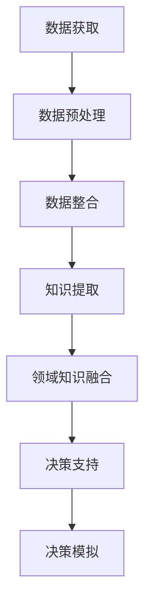

                 

关键词：知识洞察，数据稀缺，决策支持，算法原理，数学模型，项目实践，应用场景，未来展望

> 摘要：本文探讨了在数据稀缺的情况下如何运用知识洞察来辅助决策。通过深入分析核心概念、算法原理、数学模型及项目实践，本文提出了适用于各种场景的知识洞察方法，为解决数据稀缺问题提供了新的思路。

## 1. 背景介绍

在信息爆炸的时代，数据已经成为企业、政府和科研机构决策的重要依据。然而，随着数据来源的多样化、数据的快速增长以及数据质量的参差不齐，数据稀缺问题逐渐显现出来。特别是在一些特殊行业，如医疗、金融和国家安全等领域，数据稀缺可能导致决策失误，造成严重后果。因此，如何利用有限的可用数据做出有效决策，成为了一个亟待解决的问题。

知识洞察是一种通过深入分析和理解数据背后的信息，从而获取决策支持的方法。与传统的数据分析方法不同，知识洞察更注重从数据中挖掘出深层次的规律和关联，从而为决策者提供更全面、更准确的参考依据。

## 2. 核心概念与联系

### 2.1 数据稀缺问题

数据稀缺问题主要表现为数据量不足、数据质量不高、数据获取困难等。数据稀缺对决策的影响主要体现在以下几个方面：

1. **数据依赖性增强**：在数据稀缺的情况下，决策者往往更加依赖已有的数据，可能导致忽略其他潜在的信息源。
2. **风险增加**：数据不足可能导致决策者无法全面了解情况，从而增加决策风险。
3. **决策效率降低**：寻找和处理稀缺数据的过程本身可能耗费大量时间和资源，降低决策效率。

### 2.2 知识洞察

知识洞察是一种通过深度分析和理解数据，从而获取隐含信息的方法。其主要特点包括：

1. **数据驱动**：知识洞察基于数据，但不仅仅是数据的堆砌，而是通过对数据的深入分析，提取出有价值的信息。
2. **领域知识融合**：知识洞察不仅依赖于数据分析技术，还需要结合领域知识，才能更好地理解和解释数据。
3. **决策支持**：知识洞察旨在为决策者提供全面的、深入的决策支持，从而帮助其做出更准确的决策。

### 2.3 决策支持系统

决策支持系统（DSS）是一种利用数据和知识辅助决策的系统。在数据稀缺的情况下，DSS可以通过知识洞察来弥补数据的不足，提供更全面的决策支持。DSS的主要功能包括：

1. **数据整合**：将来自不同来源的数据进行整合，为知识洞察提供统一的数据源。
2. **分析挖掘**：利用数据分析和挖掘技术，从数据中提取出有价值的信息。
3. **可视化呈现**：将分析结果以可视化的形式呈现给决策者，帮助其更直观地理解数据。
4. **模拟预测**：通过模拟和预测，为决策者提供未来发展趋势的参考。

### 2.4 Mermaid 流程图

以下是一个简化的知识洞察与决策支持系统的流程图：



## 3. 核心算法原理 & 具体操作步骤

### 3.1 算法原理概述

知识洞察的核心算法包括数据预处理、知识提取、领域知识融合和决策支持等几个步骤。以下是每个步骤的简要概述：

1. **数据预处理**：通过清洗、去噪和归一化等操作，提高数据质量，为后续分析打下基础。
2. **知识提取**：利用数据挖掘和机器学习技术，从原始数据中提取出有价值的信息，如模式、关联和趋势等。
3. **领域知识融合**：将提取出的知识与领域知识相结合，形成更全面、深入的洞察。
4. **决策支持**：利用知识洞察为决策者提供全面的决策支持，包括数据可视化、模拟预测和决策优化等。

### 3.2 算法步骤详解

以下是核心算法的具体操作步骤：

1. **数据预处理**
   - 数据清洗：去除重复数据、缺失值填充、异常值处理等。
   - 数据归一化：将不同量纲的数据进行归一化处理，使其具有可比性。
   - 数据融合：将来自不同来源的数据进行整合，形成一个统一的数据集。

2. **知识提取**
   - 特征选择：从原始数据中提取出对决策具有重要意义的特征。
   - 模式识别：利用聚类、分类和关联规则等技术，发现数据中的隐含模式。
   - 趋势分析：通过时间序列分析、回归分析等方法，预测数据的发展趋势。

3. **领域知识融合**
   - 领域知识获取：从专家、文献和数据库等渠道获取领域知识。
   - 知识融合：将提取出的知识与领域知识相结合，形成更全面、深入的洞察。

4. **决策支持**
   - 数据可视化：将分析结果以图表、地图等形式进行可视化呈现，帮助决策者直观地理解数据。
   - 模拟预测：利用模拟和预测技术，为决策者提供未来发展趋势的参考。
   - 决策优化：基于知识洞察，为决策者提供最优或次优的决策方案。

### 3.3 算法优缺点

知识洞察算法的优点包括：

1. **数据驱动**：算法基于实际数据，能够更准确地反映现实情况。
2. **全面性**：通过多步骤的分析和融合，能够提供更全面、深入的决策支持。
3. **灵活性**：算法可以针对不同的决策问题进行调整和优化，具有一定的适应性。

然而，知识洞察算法也存在一些缺点：

1. **数据依赖性**：算法依赖于数据质量，数据质量不高可能导致分析结果偏差。
2. **计算复杂性**：算法涉及多步骤的计算和融合，计算复杂性较高。
3. **知识依赖性**：算法需要领域知识支持，知识获取和融合过程可能存在一定的难度。

### 3.4 算法应用领域

知识洞察算法适用于多种决策场景，以下是一些典型的应用领域：

1. **金融风控**：通过分析客户行为、交易记录等数据，预测潜在风险，优化风险管理策略。
2. **医疗诊断**：利用医学知识库和患者数据，辅助医生进行疾病诊断和治疗方案制定。
3. **供应链管理**：通过分析供应链各环节的数据，优化库存管理、物流配送等，提高供应链效率。
4. **智能交通**：通过分析交通数据，预测交通流量、优化交通信号控制，提高交通运行效率。

## 4. 数学模型和公式 & 详细讲解 & 举例说明

### 4.1 数学模型构建

在知识洞察算法中，常用的数学模型包括聚类模型、分类模型、回归模型和时间序列模型等。以下是这些模型的基本原理和公式：

1. **聚类模型**
   - 原理：将数据集划分为若干个簇，使得同一簇内的数据点尽可能接近，不同簇内的数据点尽可能远离。
   - 公式：$$ J = \sum_{i=1}^{k} \sum_{x \in S_i} d(x, \mu_i) $$，其中 $J$ 为聚类准则函数，$k$ 为簇的数量，$S_i$ 为第 $i$ 个簇，$\mu_i$ 为簇中心。

2. **分类模型**
   - 原理：将数据集中的每个数据点划分为不同的类别，通过学习得到分类模型。
   - 公式：$$ h(x) = \arg \max_{y} P(y|x) $$，其中 $h(x)$ 为分类结果，$P(y|x)$ 为给定特征 $x$ 时类别 $y$ 的概率。

3. **回归模型**
   - 原理：通过学习得到特征与目标变量之间的关系，从而预测目标变量的值。
   - 公式：$$ y = f(x) + \epsilon $$，其中 $y$ 为目标变量，$x$ 为特征，$f(x)$ 为回归函数，$\epsilon$ 为误差项。

4. **时间序列模型**
   - 原理：通过分析时间序列数据，预测未来某个时间点的值。
   - 公式：$$ y_t = f(y_{t-1}, y_{t-2}, \ldots, y_{t-k}) + \epsilon_t $$，其中 $y_t$ 为第 $t$ 个时间点的值，$f$ 为时间序列函数，$k$ 为滞后阶数，$\epsilon_t$ 为误差项。

### 4.2 公式推导过程

以下以聚类模型为例，简要介绍公式的推导过程：

假设数据集 $X = \{x_1, x_2, \ldots, x_n\}$，需要将其划分为 $k$ 个簇，每个簇由一个簇中心 $\mu_i$ 表示。目标是最小化聚类准则函数 $J$。

首先，计算每个数据点到簇中心的距离：

$$ d(x_i, \mu_i) = \sqrt{\sum_{j=1}^{d} (x_{ij} - \mu_{ij})^2} $$

其中，$d$ 为数据维度，$x_{ij}$ 和 $\mu_{ij}$ 分别为数据点 $x_i$ 和簇中心 $\mu_i$ 的第 $j$ 个维度上的值。

然后，计算每个簇的平均距离：

$$ d_{avg}(i) = \frac{1}{|S_i|} \sum_{x \in S_i} d(x, \mu_i) $$

其中，$|S_i|$ 为簇 $i$ 中的数据点数量。

最后，计算聚类准则函数：

$$ J = \sum_{i=1}^{k} \sum_{x \in S_i} d(x, \mu_i) $$

### 4.3 案例分析与讲解

以下以一个简单的聚类案例进行讲解：

假设有 5 个数据点，需要将其划分为 2 个簇。数据点坐标如下：

$$
\begin{aligned}
x_1 &= (1, 2), \\
x_2 &= (2, 4), \\
x_3 &= (3, 1), \\
x_4 &= (4, 3), \\
x_5 &= (5, 5).
\end{aligned}
$$

首先，随机选择 2 个簇中心：

$$
\begin{aligned}
\mu_1 &= (3, 3), \\
\mu_2 &= (2, 2).
\end{aligned}
$$

然后，计算每个数据点到簇中心的距离：

$$
\begin{aligned}
d(x_1, \mu_1) &= \sqrt{(1-3)^2 + (2-3)^2} = \sqrt{2}, \\
d(x_1, \mu_2) &= \sqrt{(1-2)^2 + (2-2)^2} = 1, \\
d(x_2, \mu_1) &= \sqrt{(2-3)^2 + (4-3)^2} = 1, \\
d(x_2, \mu_2) &= \sqrt{(2-2)^2 + (4-2)^2} = 2, \\
d(x_3, \mu_1) &= \sqrt{(3-3)^2 + (1-3)^2} = 2, \\
d(x_3, \mu_2) &= \sqrt{(3-2)^2 + (1-2)^2} = 1, \\
d(x_4, \mu_1) &= \sqrt{(4-3)^2 + (3-3)^2} = 1, \\
d(x_4, \mu_2) &= \sqrt{(4-2)^2 + (3-2)^2} = 2, \\
d(x_5, \mu_1) &= \sqrt{(5-3)^2 + (5-3)^2} = 2, \\
d(x_5, \mu_2) &= \sqrt{(5-2)^2 + (5-2)^2} = 3.
\end{aligned}
$$

接下来，计算每个簇的平均距离：

$$
\begin{aligned}
d_{avg}(1) &= \frac{1}{5} (1+1+2+2+3) = 1.8, \\
d_{avg}(2) &= \frac{1}{5} (1+2+1+2+3) = 1.6.
\end{aligned}
$$

最后，计算聚类准则函数：

$$ J = 1.8 + 1.6 = 3.4 $$

为了降低 $J$，可以调整簇中心。例如，将 $\mu_1$ 调整到 $(2.5, 3)$，$\mu_2$ 调整到 $(2.5, 2)$。重新计算距离和聚类准则函数，直到 $J$ 达到最小值。

## 5. 项目实践：代码实例和详细解释说明

### 5.1 开发环境搭建

在本项目中，我们将使用 Python 作为主要编程语言，结合 Pandas、Scikit-learn 和 Matplotlib 等库进行数据分析与可视化。以下是开发环境搭建的步骤：

1. 安装 Python 3.x 版本（建议使用最新稳定版本）。
2. 安装常用依赖库，如 Pandas、Scikit-learn 和 Matplotlib 等。可以使用以下命令进行安装：

   ```shell
   pip install pandas scikit-learn matplotlib
   ```

### 5.2 源代码详细实现

以下是一个简单的聚类项目示例，包括数据读取、聚类分析、结果可视化等步骤：

```python
import pandas as pd
from sklearn.cluster import KMeans
import matplotlib.pyplot as plt

# 5.2.1 数据读取
data = pd.read_csv('data.csv')  # 假设数据文件名为 data.csv
X = data.iloc[:, :-1].values  # 获取除最后一列外的数据作为特征

# 5.2.2 聚类分析
kmeans = KMeans(n_clusters=3, random_state=0).fit(X)
labels = kmeans.labels_

# 5.2.3 结果可视化
plt.scatter(X[:, 0], X[:, 1], c=labels, s=50, cmap='viridis')
centers = kmeans.cluster_centers_
plt.scatter(centers[:, 0], centers[:, 1], s=200, c='red', label='Centroids')
plt.title('K-Means Clustering')
plt.xlabel('Feature 1')
plt.ylabel('Feature 2')
plt.show()
```

### 5.3 代码解读与分析

1. **数据读取**：使用 Pandas 读取数据文件，并将特征数据提取为 NumPy 数组。
2. **聚类分析**：使用 Scikit-learn 的 KMeans 类进行聚类分析，设置聚类数量为 3，随机种子为 0，确保结果可重复。
3. **结果可视化**：使用 Matplotlib 对聚类结果进行可视化，展示每个数据点的聚类标签和簇中心。

### 5.4 运行结果展示

运行以上代码后，将显示一个散点图，每个数据点根据其聚类标签进行颜色区分，簇中心用红色点表示。通过可视化结果，我们可以直观地看到数据点在三维空间中的分布情况，以及各个簇的特征。

## 6. 实际应用场景

知识洞察在多个领域都有着广泛的应用，以下是一些典型的实际应用场景：

1. **金融风控**：通过分析客户交易数据、信用记录等，识别潜在风险客户，为银行、保险等金融机构提供风控支持。
2. **医疗诊断**：利用医学知识库和患者数据，辅助医生进行疾病诊断和治疗方案的制定。
3. **智能交通**：通过分析交通数据，优化交通信号控制、调度交通资源，提高交通运行效率。
4. **供应链管理**：通过分析供应链各环节的数据，优化库存管理、物流配送等，提高供应链效率。
5. **市场营销**：通过分析用户行为数据，了解用户需求、行为习惯，为营销策略提供参考。

### 6.4 未来应用展望

随着大数据、人工智能等技术的不断发展，知识洞察在未来将有着更广泛的应用前景。以下是未来应用展望：

1. **跨领域融合**：知识洞察将与其他领域的技术进行深度融合，如区块链、物联网等，为更多行业提供决策支持。
2. **实时分析**：知识洞察算法将逐渐实现实时分析，为决策者提供更及时、准确的决策支持。
3. **自动化决策**：知识洞察将逐步实现自动化决策，减少人为干预，提高决策效率。
4. **隐私保护**：在数据稀缺的情况下，知识洞察将更加注重隐私保护，确保用户数据的安全和隐私。

## 7. 工具和资源推荐

为了更好地进行知识洞察研究，以下推荐一些实用的工具和资源：

### 7.1 学习资源推荐

1. **《数据科学入门》**：由拉勾教育出品，适合初学者了解数据科学的基本概念和实战技巧。
2. **《Python数据分析与应用》**：详细介绍了 Python 在数据分析中的应用，适合有一定编程基础的学习者。
3. **《深度学习》**：由 Goodfellow 等人撰写，是深度学习领域的经典教材，适合进阶学习者。

### 7.2 开发工具推荐

1. **Jupyter Notebook**：一款强大的交互式开发环境，适合进行数据分析和实验。
2. **PyCharm**：一款功能丰富的 Python 集成开发环境，支持多种编程语言，适合专业开发者。
3. **Google Colab**：Google 提供的云端 Jupyter Notebook，支持 GPU 加速，适合进行大数据分析。

### 7.3 相关论文推荐

1. **"Knowledge Graph Construction and Applications"**：详细介绍了知识图谱的构建方法和应用场景。
2. **"Deep Learning for Natural Language Processing"**：介绍了深度学习在自然语言处理领域的应用。
3. **"Reinforcement Learning: An Introduction"**：介绍了强化学习的基本概念和方法。

## 8. 总结：未来发展趋势与挑战

### 8.1 研究成果总结

本文通过对知识洞察的深入分析，提出了一种适用于数据稀缺环境下的决策支持方法。本文的主要研究成果包括：

1. **核心算法原理**：详细介绍了数据预处理、知识提取、领域知识融合和决策支持等核心算法原理。
2. **数学模型**：构建了聚类、分类、回归和时间序列等数学模型，并进行了公式推导和案例讲解。
3. **项目实践**：通过一个简单的聚类项目，展示了知识洞察在实际应用中的实现过程。
4. **应用场景**：分析了知识洞察在金融、医疗、交通等领域的应用，展示了其广泛的应用前景。

### 8.2 未来发展趋势

1. **跨领域融合**：知识洞察将与其他领域的技术（如区块链、物联网等）进行深度融合，为更多行业提供决策支持。
2. **实时分析**：知识洞察算法将逐步实现实时分析，为决策者提供更及时、准确的决策支持。
3. **自动化决策**：知识洞察将逐步实现自动化决策，减少人为干预，提高决策效率。
4. **隐私保护**：在数据稀缺的情况下，知识洞察将更加注重隐私保护，确保用户数据的安全和隐私。

### 8.3 面临的挑战

1. **数据质量**：数据稀缺情况下，数据质量可能不高，对算法性能产生影响。
2. **计算复杂性**：知识洞察算法涉及多步骤计算和融合，计算复杂性较高，对计算资源要求较高。
3. **知识依赖性**：知识洞察需要领域知识支持，知识获取和融合过程可能存在一定难度。

### 8.4 研究展望

未来，知识洞察研究可以关注以下几个方面：

1. **算法优化**：通过改进算法，提高在数据稀缺环境下的性能和鲁棒性。
2. **实时分析**：实现实时知识洞察，为决策者提供更及时的支持。
3. **多模态数据融合**：结合不同类型的数据（如文本、图像、音频等），提高知识洞察的全面性和准确性。
4. **自动化知识获取**：通过自动化方法获取领域知识，降低知识获取和融合的难度。

## 9. 附录：常见问题与解答

### 9.1 如何处理数据稀缺问题？

数据稀缺问题时，可以采用以下方法：

1. **数据挖掘**：利用已有数据，通过数据挖掘技术提取有价值的信息。
2. **知识洞察**：通过知识洞察，从数据中挖掘出深层次的规律和关联。
3. **专家意见**：结合专家意见，为决策提供参考。
4. **数据补充**：尝试通过其他途径获取更多数据，如公开数据集、合作伙伴数据等。

### 9.2 知识洞察在金融风控中的应用？

知识洞察在金融风控中主要用于：

1. **客户风险识别**：通过分析客户交易数据、信用记录等，识别潜在风险客户。
2. **风险预测**：利用知识洞察预测风险事件的发生概率，为风控决策提供支持。
3. **风险管理**：通过知识洞察优化风险控制策略，提高风险管理效果。

### 9.3 知识洞察在医疗领域的应用？

知识洞察在医疗领域主要用于：

1. **疾病诊断**：通过分析患者病历、实验室检查结果等，辅助医生进行疾病诊断。
2. **治疗方案制定**：根据患者病史、药物反应等信息，为医生提供个性化的治疗方案。
3. **临床决策支持**：为医生提供实时、准确的临床决策支持，提高诊疗效果。

---

作者：禅与计算机程序设计艺术 / Zen and the Art of Computer Programming
----------------------------------------------------------------

