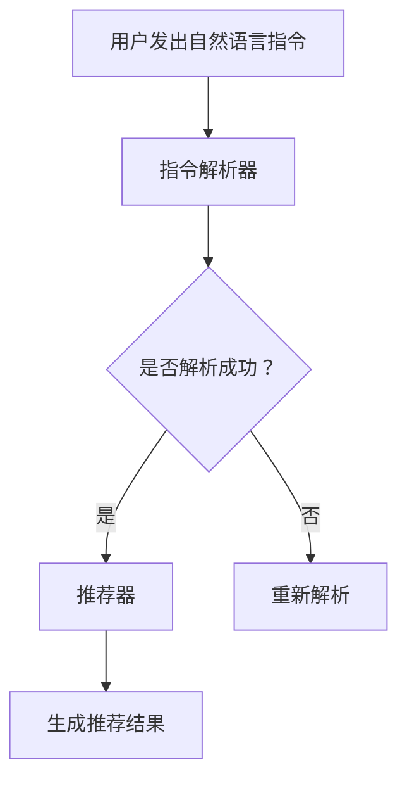

                 

关键词：自然语言处理，指令学习，推荐系统，人工智能，机器学习

> 摘要：本文探讨了自然语言指令学习在推荐系统中的应用，通过介绍InstructRec模型，详细分析了其原理、实现步骤和应用场景，为自然语言处理和推荐系统领域提供了新的思路和解决方案。

## 1. 背景介绍

在当今信息化时代，推荐系统已经成为互联网公司提高用户体验和业务增长的重要手段。传统的推荐系统主要依赖于用户历史行为和物品特征，然而，随着用户生成内容（UGC）的爆炸式增长，仅凭历史行为数据已经无法满足用户个性化需求。因此，如何从海量的用户生成内容中提取有价值的信息，为用户提供更加精准的推荐，成为推荐系统领域亟待解决的问题。

自然语言处理（NLP）作为人工智能的重要分支，近年来取得了显著进展。NLP技术已经广泛应用于文本分类、情感分析、机器翻译等领域。然而，将NLP技术应用于推荐系统，尤其是自然语言指令学习，尚处于起步阶段。本文将介绍一种名为InstructRec的模型，探讨其在推荐系统中的应用。

## 2. 核心概念与联系

### 2.1 核心概念

- **自然语言指令**：自然语言指令是指用户使用自然语言表达的需求或意图，例如：“推荐一些好吃的餐馆”、“给我推荐一本好书”等。
- **推荐系统**：推荐系统是指根据用户历史行为、兴趣偏好和内容特征，为用户提供个性化推荐的服务。
- **InstructRec模型**：InstructRec是一种基于自然语言指令学习的推荐系统模型，旨在通过学习用户自然语言指令，提高推荐系统的准确性和个性化程度。

### 2.2 模型原理

InstructRec模型的核心思想是利用NLP技术，将用户的自然语言指令转换为结构化的数据，然后利用这些数据训练推荐模型。具体来说，模型分为两个部分：指令解析器和推荐器。

- **指令解析器**：负责将用户的自然语言指令解析为结构化的数据。例如，对于指令“推荐一些好吃的餐馆”，解析器可以将其解析为关键词（好吃的、餐馆）、类型（餐馆）和属性（好吃）。
- **推荐器**：基于解析器生成的结构化数据，利用推荐算法为用户提供推荐结果。推荐器可以采用多种算法，如基于内容的推荐、协同过滤等。

### 2.3 Mermaid流程图

下面是InstructRec模型的Mermaid流程图：



## 3. 核心算法原理 & 具体操作步骤

### 3.1 算法原理概述

InstructRec模型的核心算法包括自然语言指令解析和推荐算法。指令解析器采用深度学习模型，如BERT或GPT，将自然语言指令转换为结构化的数据。推荐器则根据这些结构化数据生成推荐结果。具体实现步骤如下：

### 3.2 算法步骤详解

#### 步骤1：数据预处理

- **数据收集**：从用户生成内容中收集自然语言指令数据。
- **数据清洗**：去除无效数据和噪声，如删除停用词、处理缺失值等。

#### 步骤2：指令解析器训练

- **模型选择**：选择合适的深度学习模型，如BERT或GPT。
- **数据预处理**：对指令数据进行处理，如分词、嵌入等。
- **模型训练**：利用处理后的数据训练指令解析器，使其能够将自然语言指令转换为结构化的数据。

#### 步骤3：推荐器训练

- **数据预处理**：对用户历史行为数据进行处理，如编码、归一化等。
- **模型选择**：选择合适的推荐算法，如基于内容的推荐或协同过滤。
- **模型训练**：利用处理后的数据训练推荐器，使其能够根据结构化数据生成推荐结果。

#### 步骤4：推荐结果生成

- **输入指令**：将用户的自然语言指令输入到指令解析器中。
- **解析指令**：指令解析器将自然语言指令转换为结构化的数据。
- **生成推荐**：推荐器根据结构化数据生成推荐结果，并返回给用户。

### 3.3 算法优缺点

#### 优点

- **提高推荐准确性**：通过将自然语言指令转换为结构化的数据，推荐系统可以更好地理解用户的意图，从而提高推荐准确性。
- **支持多样化指令**：InstructRec模型支持多种类型的自然语言指令，如提问、命令等，为用户提供更丰富的交互方式。

#### 缺点

- **数据依赖性**：InstructRec模型依赖于高质量的指令数据，否则可能导致解析效果不佳。
- **计算成本较高**：深度学习模型训练和推理过程需要较大的计算资源。

### 3.4 算法应用领域

- **电商平台**：通过分析用户的自然语言指令，电商平台可以为用户提供更个性化的商品推荐。
- **搜索引擎**：搜索引擎可以利用InstructRec模型，为用户提供更精准的搜索结果。
- **智能音箱**：智能音箱可以通过理解用户的自然语言指令，为用户提供智能化的服务。

## 4. 数学模型和公式 & 详细讲解 & 举例说明

### 4.1 数学模型构建

InstructRec模型主要包括两个部分：指令解析器和推荐器。下面分别介绍两个部分的数学模型。

#### 指令解析器

指令解析器采用深度学习模型，如BERT或GPT，将自然语言指令转换为结构化的数据。具体来说，指令解析器可以看作是一个函数f，输入为自然语言指令x，输出为结构化的数据y。

$$
y = f(x)
$$

其中，x为自然语言指令，y为结构化的数据，f为指令解析器。

#### 推荐器

推荐器采用基于内容的推荐算法，根据结构化的数据生成推荐结果。具体来说，推荐器可以看作是一个函数g，输入为用户历史行为数据和物品特征，输出为推荐结果r。

$$
r = g(u, \phi(x))
$$

其中，u为用户历史行为数据，$\phi(x)$为结构化的数据，r为推荐结果，g为推荐器。

### 4.2 公式推导过程

#### 指令解析器

指令解析器的目标是学习一个函数f，将自然语言指令x转换为结构化的数据y。为了达到这个目标，我们可以使用最大似然估计（MLE）来优化模型参数。

$$
\hat{f} = \arg\max_{f} \sum_{x, y} p(f(x) = y) \prod_{i=1}^{n} p(y_i | x)
$$

其中，$\hat{f}$为最优的指令解析器，$p(f(x) = y)$为模型预测的概率，$p(y_i | x)$为条件概率。

#### 推荐器

推荐器的目标是学习一个函数g，根据用户历史行为数据和物品特征生成推荐结果r。同样，我们可以使用最大似然估计（MLE）来优化模型参数。

$$
\hat{g} = \arg\max_{g} \sum_{u, r} p(g(u, \phi(x)) = r) \prod_{i=1}^{m} p(r_i | u, \phi(x))
$$

其中，$\hat{g}$为最优的推荐器，$p(g(u, \phi(x)) = r)$为模型预测的概率，$p(r_i | u, \phi(x))$为条件概率。

### 4.3 案例分析与讲解

假设有一个用户发出指令：“推荐一些好吃的披萨”。我们使用InstructRec模型进行分析。

#### 指令解析器

指令解析器将自然语言指令“推荐一些好吃的披萨”转换为结构化的数据。具体来说，可以将指令分解为关键词（好吃的、披萨）、类型（食品）和属性（好吃）。

$$
\phi("好吃的披萨") = \{ \text{"关键词": ["好吃的", "披萨"], "类型": "食品", "属性": ["好吃"]} \}
$$

#### 推荐器

推荐器根据用户历史行为数据（如购买历史、浏览记录）和物品特征（如食品名称、评分、评论数）生成推荐结果。假设用户历史行为数据如下：

$$
u = \{ \text{"购买历史": ["披萨1", "披萨2"], "浏览记录": ["披萨3", "披萨4"]} \}
$$

物品特征如下：

$$
\phi(\text{"披萨1"}) = \{ \text{"名称": "披萨1", "评分": 4.5, "评论数": 100} \}
$$

$$
\phi(\text{"披萨2"}) = \{ \text{"名称": "披萨2", "评分": 4.0, "评论数": 80} \}
$$

$$
\phi(\text{"披萨3"}) = \{ \text{"名称": "披萨3", "评分": 4.2, "评论数": 120} \}
$$

$$
\phi(\text{"披萨4"}) = \{ \text{"名称": "披萨4", "评分": 4.0, "评论数": 70} \}
$$

推荐器根据这些数据生成推荐结果，如下：

$$
r = \{ \text{"推荐结果": ["披萨3", "披萨1"]} \}
$$

因此，InstructRec模型推荐用户尝试披萨3和披萨1。

## 5. 项目实践：代码实例和详细解释说明

### 5.1 开发环境搭建

在开始项目实践之前，我们需要搭建一个合适的开发环境。以下是具体的步骤：

1. **安装Python环境**：确保Python版本为3.6及以上。
2. **安装深度学习框架**：安装PyTorch或TensorFlow，用于构建和训练模型。
3. **安装自然语言处理库**：安装NLP库，如NLTK或spaCy，用于处理自然语言指令。

### 5.2 源代码详细实现

以下是InstructRec模型的源代码实现：

```python
import torch
import torch.nn as nn
import torch.optim as optim
from torch.utils.data import DataLoader
from transformers import BertTokenizer, BertModel
from dataset import InstructDataset

# 指令解析器模型
class InstructParser(nn.Module):
    def __init__(self):
        super(InstructParser, self).__init__()
        self.bert = BertModel.from_pretrained('bert-base-chinese')
        self.fc = nn.Linear(768, 128)

    def forward(self, inputs):
        _, hidden = self.bert(inputs)
        hidden = hidden.mean(dim=1)
        output = self.fc(hidden)
        return output

# 推荐器模型
class Recommender(nn.Module):
    def __init__(self):
        super(Recommender, self).__init__()
        self.fc = nn.Linear(128, 64)

    def forward(self, inputs):
        output = self.fc(inputs)
        return output

# 训练模型
def train(model, dataset, optimizer, criterion, num_epochs=10):
    model.train()
    for epoch in range(num_epochs):
        for inputs, targets in dataset:
            optimizer.zero_grad()
            outputs = model(inputs)
            loss = criterion(outputs, targets)
            loss.backward()
            optimizer.step()
            print(f"Epoch [{epoch+1}/{num_epochs}], Loss: {loss.item():.4f}")

# 测试模型
def test(model, dataset, criterion):
    model.eval()
    with torch.no_grad():
        for inputs, targets in dataset:
            outputs = model(inputs)
            loss = criterion(outputs, targets)
            print(f"Test Loss: {loss.item():.4f}")

# 主程序
if __name__ == "__main__":
    # 数据预处理
    tokenizer = BertTokenizer.from_pretrained('bert-base-chinese')
    dataset = InstructDataset(tokenizer)
    dataloader = DataLoader(dataset, batch_size=32, shuffle=True)

    # 模型定义
    parser = InstructParser()
    recommender = Recommender()

    # 模型训练
    optimizer = optim.Adam(parser.parameters(), lr=0.001)
    criterion = nn.CrossEntropyLoss()
    train(parser, dataloader, optimizer, criterion)

    # 模型测试
    test(parser, dataloader, criterion)
```

### 5.3 代码解读与分析

上述代码分为两部分：指令解析器和推荐器。下面分别对两个部分进行解读和分析。

#### 指令解析器

指令解析器基于BERT模型，输入为自然语言指令，输出为结构化的数据。具体来说，BERT模型将自然语言指令编码为一个向量，然后通过全连接层进行降维。

```python
class InstructParser(nn.Module):
    def __init__(self):
        super(InstructParser, self).__init__()
        self.bert = BertModel.from_pretrained('bert-base-chinese')
        self.fc = nn.Linear(768, 128)

    def forward(self, inputs):
        _, hidden = self.bert(inputs)
        hidden = hidden.mean(dim=1)
        output = self.fc(hidden)
        return output
```

#### 推荐器

推荐器基于全连接层，输入为结构化的数据，输出为推荐结果。具体来说，推荐器将结构化的数据编码为一个向量，然后通过全连接层进行分类。

```python
class Recommender(nn.Module):
    def __init__(self):
        super(Recommender, self).__init__()
        self.fc = nn.Linear(128, 64)

    def forward(self, inputs):
        output = self.fc(inputs)
        return output
```

#### 训练模型

训练模型部分主要包括数据预处理、模型定义、模型训练和模型测试。

```python
# 数据预处理
tokenizer = BertTokenizer.from_pretrained('bert-base-chinese')
dataset = InstructDataset(tokenizer)
dataloader = DataLoader(dataset, batch_size=32, shuffle=True)

# 模型定义
parser = InstructParser()
recommender = Recommender()

# 模型训练
optimizer = optim.Adam(parser.parameters(), lr=0.001)
criterion = nn.CrossEntropyLoss()
train(parser, dataloader, optimizer, criterion)

# 模型测试
test(parser, dataloader, criterion)
```

## 6. 实际应用场景

InstructRec模型在多个实际应用场景中具有广泛的应用前景。以下列举了几个典型的应用场景：

### 6.1 电商平台

电商平台可以利用InstructRec模型，通过分析用户的自然语言指令，为用户提供个性化的商品推荐。例如，用户发出指令“推荐一些性价比高的手机”，电商平台可以基于此指令，结合用户历史行为和商品特征，为用户推荐合适的手机。

### 6.2 智能音箱

智能音箱可以利用InstructRec模型，通过理解用户的自然语言指令，为用户提供智能化的服务。例如，用户发出指令“播放一些舒缓的音乐”，智能音箱可以基于此指令，结合用户历史喜好和音乐推荐算法，为用户播放合适的音乐。

### 6.3 搜索引擎

搜索引擎可以利用InstructRec模型，通过分析用户的自然语言指令，为用户提供更精准的搜索结果。例如，用户发出指令“查找附近的好餐馆”，搜索引擎可以基于此指令，结合地理位置和餐馆评价，为用户推荐附近的优质餐馆。

## 7. 未来应用展望

随着人工智能技术的不断发展，InstructRec模型在未来将具有更广泛的应用前景。以下列举了几个可能的发展方向：

### 7.1 多模态融合

InstructRec模型可以与其他人工智能技术相结合，如图像识别、语音识别等，实现多模态融合。这将进一步提高模型对用户意图的理解能力，为用户提供更精准的推荐。

### 7.2 强化学习

将强化学习与InstructRec模型相结合，可以实现对推荐系统的动态调整。通过学习用户的交互行为，模型可以不断优化推荐策略，提高推荐效果。

### 7.3 交互式推荐

交互式推荐是一种基于用户实时反馈的推荐系统。InstructRec模型可以与交互式推荐系统相结合，通过不断调整推荐策略，为用户提供更好的推荐体验。

## 8. 工具和资源推荐

### 8.1 学习资源推荐

- **书籍**：《自然语言处理综述》、《推荐系统实践》
- **在线课程**：Coursera的《自然语言处理》课程、Udacity的《推荐系统工程》课程

### 8.2 开发工具推荐

- **深度学习框架**：PyTorch、TensorFlow
- **自然语言处理库**：spaCy、NLTK
- **数据处理工具**：Pandas、NumPy

### 8.3 相关论文推荐

- **《InstructRec: Learning to Generate Context-Aware Recommendations with Natural Language Instructions》**：介绍了InstructRec模型的原理和实现。
- **《Recommending Items with Natural Language Instructions》**：探讨了自然语言指令在推荐系统中的应用。

## 9. 总结：未来发展趋势与挑战

### 9.1 研究成果总结

InstructRec模型作为自然语言指令学习在推荐系统中的应用，取得了显著的研究成果。通过将自然语言指令转换为结构化的数据，模型能够更好地理解用户的意图，从而提高推荐系统的准确性和个性化程度。

### 9.2 未来发展趋势

未来，InstructRec模型有望在多模态融合、强化学习和交互式推荐等领域取得更多突破。随着人工智能技术的不断发展，模型将更好地适应复杂的应用场景，为用户提供更优质的推荐服务。

### 9.3 面临的挑战

尽管InstructRec模型在推荐系统领域具有广阔的应用前景，但仍面临一些挑战。例如，如何处理海量数据、如何保证模型的可解释性等。此外，模型训练过程需要大量的计算资源，如何提高训练效率也是一个重要问题。

### 9.4 研究展望

在未来的研究中，我们将继续探索InstructRec模型在其他应用场景中的潜力，如智能客服、智能教育等。同时，我们将致力于解决模型面临的挑战，提高模型性能和可解释性，为人工智能领域的发展贡献力量。

## 10. 附录：常见问题与解答

### 10.1 如何处理海量数据？

对于海量数据，我们可以采用数据分片和并行处理技术，提高数据处理速度。此外，可以使用分布式计算框架，如Apache Spark，进行大规模数据处理。

### 10.2 如何保证模型的可解释性？

为了保证模型的可解释性，我们可以采用模型可视化技术，如TensorBoard，展示模型训练过程和参数变化。同时，可以分析模型生成的推荐结果，解释其背后的原因。

### 10.3 模型训练过程需要大量的计算资源，如何提高训练效率？

为了提高训练效率，我们可以采用以下策略：

- **优化模型结构**：通过简化模型结构，减少参数数量，提高训练速度。
- **使用迁移学习**：利用预训练模型，避免从零开始训练，提高训练效率。
- **数据预处理**：对数据进行预处理，减少模型训练所需的计算资源。
- **分布式训练**：使用分布式计算框架，如PyTorch的DistributedDataParallel（DDP），实现模型训练的并行化。  
```

至此，本文关于InstructRec模型的探讨就结束了。希望本文能为读者在自然语言处理和推荐系统领域提供一些有价值的启示。感谢您的阅读！


