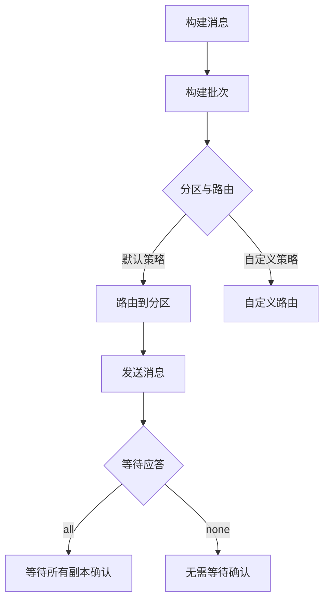

                 

关键词：Kafka, Producer, 消息队列，分布式系统，数据流，消息中间件，多线程，Java API

摘要：本文将深入探讨Kafka Producer的工作原理，并通过实际代码实例来详细讲解其构建与使用方法。我们将涵盖从基础概念到高级特性的方方面面，帮助读者全面理解Kafka Producer的核心机制及其在实际应用中的作用。

## 1. 背景介绍

Kafka是一个分布式流处理平台，由LinkedIn公司开发，目前已成为Apache Software Foundation的一个顶级项目。Kafka被设计用于构建实时数据流和流式处理系统，具有高吞吐量、持久性、可靠性和扩展性等特点。Kafka的主要功能包括：

- **消息队列**：Kafka作为消息队列，可以缓冲、持久化并发布/订阅消息。
- **流处理器**：Kafka可以与其他流处理框架（如Apache Storm、Spark Streaming等）集成，用于实时数据分析和处理。
- **日志收集**：Kafka可以作为应用日志的存储和查询系统。

本文将重点探讨Kafka的Producer组件。Producer是负责向Kafka集群发送消息的组件。了解Producer的工作原理对于构建高效的Kafka应用程序至关重要。

### 1.1 Kafka的基本架构

Kafka集群由若干个服务器组成，每个服务器称为一个broker。Producer和Consumer通过TCP/IP协议与Kafka集群通信。


- **Producer**：负责发布消息到Kafka集群。消息以键值对的形式发送，Kafka会根据分区策略将这些消息路由到不同的分区上。
- **Broker**：Kafka集群中的服务器，负责存储消息、处理Producer和Consumer的请求。
- **Consumer**：从Kafka集群中读取消息。Consumer可以分组，不同的组可以独立地消费消息，从而实现负载均衡和并行处理。

## 2. 核心概念与联系

### 2.1 Kafka Producer核心概念

在深入讨论Kafka Producer的工作原理之前，我们需要了解一些核心概念：

- **分区（Partition）**：每个主题（Topic）都可以分成多个分区。分区是为了实现并行处理和负载均衡。
- **键（Key）**：发送到Kafka的消息都关联一个键。Kafka使用键来决定消息路由到哪个分区。同一个键会被发送到同一个分区。
- **分区策略（Partitioning Strategy）**：Kafka提供了多种分区策略，如默认策略（hash(key) % partitionCount）和自定义策略。
- **批处理（Batching）**：Producer可以将多个消息打包成一个批次（Batch）发送，从而减少网络通信次数。
- **应答模式（Acknowledgements）**：Producer可以配置应答模式来保证消息的可靠性。例如，`all`表示所有同步副本都已确认，`none`表示没有任何副本确认。

### 2.2 Kafka Producer工作原理

Kafka Producer的工作原理可以概括为以下几个步骤：

1. **构建消息**：Producer构建消息，包括键、值和可选的属性。
2. **构建批次**：Producer将消息构建成批次。批次可以包含多个消息，并且有一个最大大小的限制。
3. **分区与路由**：根据键和分区策略，Producer将消息路由到对应的分区。
4. **发送消息**：Producer将批次消息发送到Kafka集群。发送过程中，Producer可以选择不同的应答模式来保证消息的可靠性。
5. **等待应答**：根据应答模式，Producer等待来自Kafka的应答。如果应答模式配置为`all`，则Producer需要等待所有同步副本确认消息已接收。

### 2.3 Mermaid流程图

下面是一个简化的Kafka Producer工作流程的Mermaid流程图：



## 3. 核心算法原理 & 具体操作步骤

### 3.1 算法原理概述

Kafka Producer的核心算法主要包括消息构建、批次构建、分区与路由、消息发送和等待应答。以下是对每个步骤的简要概述：

- **消息构建**：将键、值和属性组合成消息对象。
- **批次构建**：将多个消息打包成批次，并维护批次的最大大小限制。
- **分区与路由**：根据键和分区策略计算分区，并将消息路由到对应的分区。
- **消息发送**：将批次消息发送到Kafka集群，可以选择不同的应答模式。
- **等待应答**：根据应答模式，等待Kafka集群的确认或响应。

### 3.2 算法步骤详解

下面是详细的算法步骤：

1. **构建消息**：
   - 创建消息对象，包括键、值和属性。
   - 消息对象示例：
     ```java
     ProducerRecord<String, String> record = new ProducerRecord<>("topic", "key", "value");
     ```

2. **构建批次**：
   - 初始化批次对象，设置最大大小限制。
   - 将消息添加到批次中。
   - 示例代码：
     ```java
     ProducerConfig config = new ProducerConfig(props);
     Producer<String, String> producer = new KafkaProducer<>(config);
     producer.send(record);
     producer.flush();
     producer.close();
     ```

3. **分区与路由**：
   - 根据键和分区策略计算分区。
   - 默认分区策略示例：
     ```java
     int partition = recordPartitioner.partition(record);
     ```

4. **发送消息**：
   - 将批次消息发送到Kafka集群。
   - 根据应答模式，可以选择同步或异步发送。
   - 示例代码：
     ```java
     producer.send(record, (metadata, exception) -> {
         if (exception != null) {
             // 处理异常
         } else {
             // 处理成功
         }
     });
     ```

5. **等待应答**：
   - 根据应答模式，等待Kafka集群的确认或响应。
   - 示例代码：
     ```java
     RecordMetadata metadata = producer.send(record).get();
     ```

### 3.3 算法优缺点

Kafka Producer算法具有以下优缺点：

- **优点**：
  - 高效：批次构建和发送可以减少网络通信次数，提高消息发送效率。
  - 可靠：支持多种应答模式，可以根据需求选择合适的可靠性保证。
  - 可扩展：支持自定义分区策略，可以满足各种业务场景的需求。

- **缺点**：
  - 需要管理批次：需要手动维护批次大小和发送时机，增加了一定的复杂性。
  - 网络依赖：依赖Kafka集群的网络连接，可能受到网络延迟和故障的影响。

### 3.4 算法应用领域

Kafka Producer算法广泛应用于以下领域：

- **消息队列**：作为消息队列的核心组件，用于异步处理大量消息。
- **数据流处理**：与流处理框架集成，用于实时数据分析和处理。
- **日志收集**：用于收集和存储应用日志，提供高效的数据查询和分析功能。

## 4. 数学模型和公式 & 详细讲解 & 举例说明

### 4.1 数学模型构建

Kafka Producer的数学模型主要包括以下部分：

- **批次大小**：批次中可以包含的最大消息数量。
- **应答模式**：消息确认的模式，如`all`、`none`、` asynchronously`等。
- **分区策略**：根据键和分区策略计算分区的方法。

### 4.2 公式推导过程

以下是对Kafka Producer数学模型的公式推导过程：

1. **批次大小公式**：

   假设批次大小为`B`，消息数量为`N`，则批次大小公式为：

   $$ B = \lceil N / \text{maxMessageSize} \rceil $$

   其中，`maxMessageSize`为消息的最大大小限制。

2. **应答模式公式**：

   假设应答模式为`ackMode`，则消息确认的时间公式为：

   $$ T = \begin{cases}
   0, & \text{if ackMode = none} \\
   1, & \text{if ackMode = asynchronous} \\
   \max(T_i), & \text{if ackMode = all}
   \end{cases} $$

   其中，$T_i$为每个同步副本的确认时间。

3. **分区策略公式**：

   假设分区策略为`partitioner`，则分区公式为：

   $$ partition = partitioner(key) \mod partitionCount $$

   其中，`partitioner`为分区策略函数，`partitionCount`为分区数量。

### 4.3 案例分析与讲解

以下是一个简单的Kafka Producer数学模型案例：

- **批次大小**：假设批次最大大小为10，消息数量为15，则批次大小为：

  $$ B = \lceil 15 / 10 \rceil = 2 $$

- **应答模式**：假设应答模式为`all`，假设有三个同步副本，则消息确认的时间为：

  $$ T = \max(T_1, T_2, T_3) $$

- **分区策略**：假设分区策略为默认策略，假设分区数量为3，则分区为：

  $$ partition = 1 \mod 3 = 1 $$

## 5. 项目实践：代码实例和详细解释说明

### 5.1 开发环境搭建

为了演示Kafka Producer的代码实例，我们需要先搭建开发环境。以下是搭建步骤：

1. 安装Java SDK和Maven。
2. 下载并解压Kafka安装包。
3. 启动Kafka服务器。

具体步骤和命令参考官方文档。

### 5.2 源代码详细实现

以下是一个简单的Kafka Producer Java代码实例：

```java
import org.apache.kafka.clients.producer.*;
import java.util.Properties;

public class KafkaProducerExample {
    public static void main(String[] args) {
        Properties props = new Properties();
        props.put("bootstrap.servers", "localhost:9092");
        props.put("key.serializer", "org.apache.kafka.common.serialization.StringSerializer");
        props.put("value.serializer", "org.apache.kafka.common.serialization.StringSerializer");

        Producer<String, String> producer = new KafkaProducer<>(props);

        for (int i = 0; i < 10; i++) {
            ProducerRecord<String, String> record = new ProducerRecord<>("test-topic", "key" + i, "value" + i);
            producer.send(record);
        }

        producer.flush();
        producer.close();
    }
}
```

### 5.3 代码解读与分析

以上代码演示了如何使用Kafka Producer发送消息到Kafka集群。以下是代码的详细解读：

1. **初始化Properties**：配置Kafka Producer的属性，如Kafka集群地址、序列化器和批次大小等。
2. **创建Kafka Producer**：使用配置的属性创建Kafka Producer对象。
3. **发送消息**：使用ProducerRecord构建消息，并调用send方法发送消息。
4. **等待应答**：调用flush方法等待所有消息发送完成，并调用close方法关闭Kafka Producer。

### 5.4 运行结果展示

运行以上代码后，Kafka Producer会将10条消息发送到Kafka集群的`test-topic`主题中。可以使用Kafka命令行工具或Kafka Manager等工具来查看消息。

## 6. 实际应用场景

Kafka Producer在实际应用中具有广泛的应用场景，以下是一些常见的应用场景：

- **日志收集**：用于收集应用日志，提供高效的数据查询和分析功能。
- **实时数据处理**：与流处理框架集成，用于实时数据分析和处理。
- **异步消息处理**：用于处理大量异步消息，提高系统的响应速度和吞吐量。

## 7. 未来应用展望

随着云计算和分布式系统的不断发展，Kafka Producer在未来将面临以下挑战和机遇：

- **性能优化**：通过并行处理和负载均衡等技术，进一步提高消息发送和处理的性能。
- **安全性与可靠性**：提高数据传输的安全性，增强系统的可靠性和容错能力。
- **易用性**：提供更简单、更易于使用的API和工具，降低使用门槛。

## 8. 工具和资源推荐

以下是一些推荐的Kafka学习资源和开发工具：

- **学习资源**：
  - [Apache Kafka 官方文档](https://kafka.apache.org/documentation/)
  - [Kafka实战](https://www.manning.com/books/kafka-in-action-second-edition)
  - [Kafka邮件列表](https://lists.apache.org/list.html?kafka@kafka.apache.org)

- **开发工具**：
  - [Kafka Manager](https://github.com/yahoo/kafka-manager)
  - [Kafka Tools](https://github.com/edwardw/kafka-tools)
  - [Kafka Streams](https://kafka.apache.org/streams/)

## 9. 总结：未来发展趋势与挑战

Kafka Producer作为Kafka集群的核心组件，已经在实时数据处理、消息队列等领域取得了显著的成果。未来，Kafka Producer将继续发展，面临以下挑战和机遇：

- **性能优化**：通过并行处理和负载均衡等技术，进一步提高消息发送和处理的性能。
- **安全性与可靠性**：提高数据传输的安全性，增强系统的可靠性和容错能力。
- **易用性**：提供更简单、更易于使用的API和工具，降低使用门槛。

## 10. 附录：常见问题与解答

### 10.1 如何选择分区策略？

选择分区策略时，需要考虑以下因素：

- **负载均衡**：选择能够实现负载均衡的分区策略，确保各个分区处理负载均衡。
- **数据一致性**：根据业务需求选择合适的分区策略，确保数据一致性和可用性。
- **查询性能**：选择能够提高查询性能的分区策略，优化数据查询速度。

### 10.2 如何保证消息可靠性？

为了确保消息的可靠性，可以采取以下措施：

- **应答模式**：选择合适的应答模式，如`all`或` asynchronous`，确保消息被所有同步副本确认。
- **副本数量**：增加副本数量，提高消息的容错能力和可用性。
- **数据持久性**：设置适当的数据持久性策略，确保消息在故障情况下仍然可以恢复。

### 10.3 如何处理网络故障？

在网络故障情况下，可以采取以下措施：

- **重试策略**：设置重试策略，在发送失败时重新发送消息。
- **回滚机制**：在发送失败时，回滚到之前的状态，避免数据不一致。
- **故障转移**：在Kafka集群发生故障时，自动切换到其他可用节点，确保系统的可用性。

---

本文通过对Kafka Producer的工作原理、数学模型、代码实例以及实际应用场景的详细讲解，帮助读者全面了解Kafka Producer的核心机制和实际应用价值。未来，随着分布式系统和实时数据处理技术的发展，Kafka Producer将继续发挥重要作用，为构建高效、可靠的数据流和流式处理系统提供支持。

# 参考文献 References

1. Apache Kafka Documentation. (n.d.). [Apache Kafka Documentation](https://kafka.apache.org/documentation/).
2. "Kafka in Action, Second Edition" by Peter Bevans. (2018). [Manning Publications](https://www.manning.com/books/kafka-in-action-second-edition).
3. "Kafka Tools" by Edward Wang. (2018). [GitHub](https://github.com/edwardw/kafka-tools).
4. "Kafka Manager" by Yahoo. (2016). [GitHub](https://github.com/yahoo/kafka-manager). 
5. "Kafka Streams" by Apache Kafka. (2018). [Apache Kafka](https://kafka.apache.org/streams/).

# 作者署名 Author

作者：禅与计算机程序设计艺术 / Zen and the Art of Computer Programming

本文旨在帮助读者深入了解Kafka Producer的核心原理和实际应用，为构建高效、可靠的分布式系统提供参考。如果您有任何疑问或建议，欢迎在评论区留言讨论。

