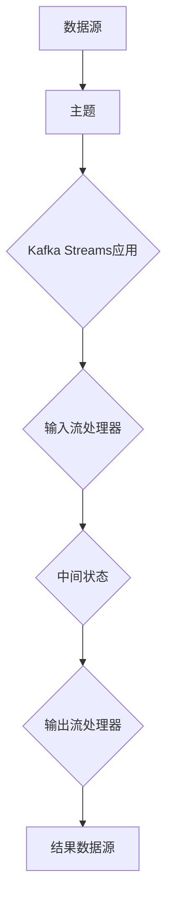

                 

 Kafka Streams是Apache Kafka的一个开源流处理框架，它允许开发者以Java或Scala编写高效、可靠的流处理应用程序。本文将深入探讨Kafka Streams的原理，并通过实例代码详细解释其应用过程。

> 关键词：Kafka Streams，流处理，数据流，Java，Scala，分布式系统，实时数据处理

> 摘要：本文旨在详细介绍Kafka Streams的核心概念、算法原理、数学模型以及代码实现，帮助开发者理解并掌握如何利用Kafka Streams构建高效的实时数据处理系统。

## 1. 背景介绍

Kafka Streams作为Apache Kafka生态系统的一部分，旨在解决大规模实时数据处理的需求。Kafka Streams继承了Kafka的分布式和容错特性，提供了低延迟和高吞吐量的流处理能力。其设计理念是基于Java和Scala语言的简单、高效和易于扩展。

### 1.1 Kafka Streams的重要性

随着数据量的爆炸式增长，如何快速、准确地处理海量数据已成为企业面临的重大挑战。Kafka Streams提供了以下几大优势：

- **高性能**：Kafka Streams在内部使用了高效的算法和数据结构，能够在较低延迟下处理大规模数据流。
- **易用性**：通过简单的API，开发者可以快速上手并构建复杂的流处理逻辑。
- **可扩展性**：Kafka Streams支持水平扩展，能够处理高并发和大规模数据流。
- **可靠性**：Kafka Streams继承了Kafka的高可用和容错特性，保证了系统的稳定性。

### 1.2 Kafka Streams的应用场景

Kafka Streams适用于多种应用场景，包括：

- **实时分析**：例如，实时监控网站流量、用户行为等。
- **事件处理**：如处理金融交易事件、实时日志分析等。
- **应用集成**：将不同的系统和服务集成在一起，实现数据流的交互。

## 2. 核心概念与联系

### 2.1 核心概念

- **Kafka主题（Topics）**：Kafka Streams中的数据以主题为组织形式，类似于消息队列中的队列。
- **Kafka Streams应用（Applications）**：处理数据流的程序，由多个流处理器（Streams Processor）组成。
- **流处理器（Streams Processor）**：处理输入数据流的组件，可以是简单的过滤器、映射器，也可以是复杂的聚合器、连接器。
- **状态（State）**：存储在内存中的数据，用于处理窗口操作、聚合等。
- **时间窗口（Time Windows）**：用于划分数据流的时间段，支持滑动窗口、滚动窗口等。

### 2.2 架构原理

下面是Kafka Streams的架构原理图：



- **数据源**：Kafka Streams从Kafka主题读取数据。
- **输入流处理器**：处理输入数据流，可以进行筛选、映射等操作。
- **中间状态**：保存处理过程中的状态信息。
- **输出流处理器**：对处理结果进行进一步操作，如聚合、连接等。
- **结果数据源**：将处理结果存储到外部系统或Kafka主题中。

## 3. 核心算法原理 & 具体操作步骤

### 3.1 算法原理概述

Kafka Streams的核心算法包括窗口算法、聚合算法、连接算法等。以下是这些算法的基本原理：

- **窗口算法**：将数据流划分为固定时间窗口或滑动时间窗口，支持对窗口内数据进行聚合或计算。
- **聚合算法**：对一组数据进行汇总计算，如求和、求平均数等。
- **连接算法**：将两个或多个数据流合并为一个流，并进行关联操作。

### 3.2 算法步骤详解

#### 窗口算法步骤

1. **定义窗口**：设置窗口大小、滑动间隔等参数。
2. **划分窗口**：根据时间或数据量将数据流划分为多个窗口。
3. **窗口内处理**：对每个窗口内的数据进行聚合或计算。
4. **输出结果**：将处理结果输出到外部系统或Kafka主题。

#### 聚合算法步骤

1. **选择聚合函数**：如求和、求平均数等。
2. **初始化状态**：为每个聚合操作初始化状态变量。
3. **更新状态**：对每条数据进行聚合操作，更新状态变量。
4. **输出结果**：将聚合结果输出到外部系统或Kafka主题。

#### 连接算法步骤

1. **选择连接键**：确定连接数据的键。
2. **初始化状态**：为连接操作初始化状态变量。
3. **更新状态**：对每条数据进行连接操作，更新状态变量。
4. **输出结果**：将连接结果输出到外部系统或Kafka主题。

### 3.3 算法优缺点

- **窗口算法**：优点是支持对数据进行时间维度的划分和处理，缺点是计算复杂度较高。
- **聚合算法**：优点是能够对数据进行高效汇总计算，缺点是可能存在延迟问题。
- **连接算法**：优点是能够将多个数据流进行关联处理，缺点是计算复杂度较高。

### 3.4 算法应用领域

- **窗口算法**：适用于实时数据分析、流量监控等场景。
- **聚合算法**：适用于实时报表、统计计算等场景。
- **连接算法**：适用于多源数据处理、实时数据整合等场景。

## 4. 数学模型和公式 & 详细讲解 & 举例说明

### 4.1 数学模型构建

Kafka Streams中的核心数学模型包括窗口模型、聚合模型和连接模型。

#### 窗口模型

窗口模型可以用以下数学公式表示：

\[ W = \{ (t, d_t) | t \in [0, T], d_t \in D \} \]

其中，\( W \) 表示窗口集合，\( t \) 表示时间点，\( d_t \) 表示在时间点 \( t \) 的数据。

#### 聚合模型

聚合模型可以用以下数学公式表示：

\[ \text{Sum}(D) = \sum_{d \in D} d \]

其中，\( \text{Sum} \) 表示求和操作，\( D \) 表示数据集合。

#### 连接模型

连接模型可以用以下数学公式表示：

\[ \text{Join}(D_1, D_2) = \{ (d_1, d_2) | d_1 \in D_1, d_2 \in D_2 \} \]

其中，\( \text{Join} \) 表示连接操作，\( D_1 \) 和 \( D_2 \) 分别表示两个数据集合。

### 4.2 公式推导过程

#### 窗口模型推导

窗口模型的推导过程如下：

1. **定义窗口**：根据时间或数据量划分窗口。
2. **收集数据**：将窗口内的数据进行收集。
3. **聚合计算**：对收集到的数据进行聚合操作。
4. **输出结果**：将聚合结果输出。

#### 聚合模型推导

聚合模型的推导过程如下：

1. **选择聚合函数**：如求和、求平均数等。
2. **初始化状态**：为每个聚合操作初始化状态变量。
3. **更新状态**：对每条数据进行聚合操作，更新状态变量。
4. **输出结果**：将聚合结果输出。

#### 连接模型推导

连接模型的推导过程如下：

1. **选择连接键**：确定连接数据的键。
2. **初始化状态**：为连接操作初始化状态变量。
3. **更新状态**：对每条数据进行连接操作，更新状态变量。
4. **输出结果**：将连接结果输出。

### 4.3 案例分析与讲解

#### 案例一：实时流量监控

假设我们需要对网站流量进行实时监控，每分钟统计访问量。

1. **定义窗口**：设置窗口大小为1分钟，滑动间隔也为1分钟。
2. **收集数据**：将每分钟内的访问数据收集到一个窗口中。
3. **聚合计算**：对窗口内的访问数据进行求和操作。
4. **输出结果**：将访问总量输出到外部系统或Kafka主题。

根据窗口模型和聚合模型，我们可以得到以下数学公式：

\[ \text{Traffic}(t) = \sum_{(t-\Delta t, t)} \text{AccessCount}(d) \]

其中，\( \text{Traffic} \) 表示访问总量，\( t \) 表示时间点，\( \Delta t \) 表示窗口大小，\( \text{AccessCount} \) 表示访问量。

#### 案例二：实时交易分析

假设我们需要对金融交易进行实时分析，每秒统计交易额。

1. **选择聚合函数**：选择求和操作。
2. **初始化状态**：为每个交易额初始化一个状态变量。
3. **更新状态**：对每条交易数据进行求和操作，更新状态变量。
4. **输出结果**：将交易总额输出到外部系统或Kafka主题。

根据聚合模型，我们可以得到以下数学公式：

\[ \text{TotalAmount}(t) = \sum_{t-\Delta t}^{t} \text{TradeAmount}(d) \]

其中，\( \text{TotalAmount} \) 表示交易总额，\( t \) 表示时间点，\( \Delta t \) 表示时间窗口大小，\( \text{TradeAmount} \) 表示交易额。

## 5. 项目实践：代码实例和详细解释说明

### 5.1 开发环境搭建

首先，我们需要搭建Kafka Streams的开发环境。以下是步骤：

1. **安装Kafka**：在本地或服务器上安装Kafka。
2. **配置Kafka**：修改Kafka配置文件，如zookeeper连接信息等。
3. **安装Java或Scala开发环境**：安装Java或Scala开发环境。
4. **引入Kafka Streams依赖**：在项目的Maven或SBT依赖中引入Kafka Streams依赖。

### 5.2 源代码详细实现

下面是一个简单的Kafka Streams应用程序实例，用于统计Kafka主题中的消息数量。

```java
import org.apache.kafka.streams.KafkaStreams;
import org.apache.kafka.streams.StreamsBuilder;
import org.apache.kafka.streams.StreamsConfig;
import org.apache.kafka.streams.kstream.KStream;
import org.apache.kafka.streams.kstream.KTable;

import java.util.Properties;

public class MessageCounter {

    public static void main(String[] args) {
        // 配置Kafka Streams
        Properties props = new Properties();
        props.put(StreamsConfig.APPLICATION_ID_CONFIG, "message-counter");
        props.put(StreamsConfig.BOOTSTRAP_SERVERS_CONFIG, "localhost:9092");

        // 创建StreamsBuilder
        StreamsBuilder builder = new StreamsBuilder();

        // 创建KStream
        KStream<String, String> messages = builder.stream("input-topic");

        // 统计消息数量
        KTable<String, Long> messageCount = messages
                .groupBy((key, value) -> "all")
                .count();

        // 输出结果到Kafka主题
        messageCount.toStream().to("output-topic");

        // 创建Kafka Streams应用程序
        KafkaStreams streams = new KafkaStreams(builder.build(), props);

        // 启动应用程序
        streams.start();

        // 等待应用程序关闭
        streams.awaitTermination();
    }
}
```

### 5.3 代码解读与分析

#### 1. 配置Kafka Streams

首先，我们创建了一个Properties对象，用于配置Kafka Streams应用程序。其中，我们设置了应用程序ID和应用端点（Bootstrap Servers）。

```java
Properties props = new Properties();
props.put(StreamsConfig.APPLICATION_ID_CONFIG, "message-counter");
props.put(StreamsConfig.BOOTSTRAP_SERVERS_CONFIG, "localhost:9092");
```

#### 2. 创建StreamsBuilder

接下来，我们创建了一个StreamsBuilder对象，用于构建流处理逻辑。

```java
StreamsBuilder builder = new StreamsBuilder();
```

#### 3. 创建KStream

我们使用builder的stream()方法创建了一个KStream对象，它将读取Kafka主题“input-topic”中的数据。

```java
KStream<String, String> messages = builder.stream("input-topic");
```

#### 4. 统计消息数量

我们使用groupBy()方法对KStream进行分组，并使用count()方法统计每个分组的消息数量。这里，我们使用了一个特殊的键“all”，表示对所有消息进行计数。

```java
KTable<String, Long> messageCount = messages
        .groupBy((key, value) -> "all")
        .count();
```

#### 5. 输出结果到Kafka主题

最后，我们将统计结果输出到Kafka主题“output-topic”。

```java
messageCount.toStream().to("output-topic");
```

#### 6. 创建Kafka Streams应用程序并启动

我们使用KafkaStreams对象创建应用程序，并启动它。

```java
KafkaStreams streams = new KafkaStreams(builder.build(), props);
streams.start();
```

### 5.4 运行结果展示

运行这个应用程序后，我们可以向Kafka主题“input-topic”发送一些消息。然后，我们可以查看Kafka主题“output-topic”中的统计结果。例如，如果发送了10条消息，那么“output-topic”中就会出现一条包含消息数量的记录。

## 6. 实际应用场景

### 6.1 实时日志分析

在大型互联网公司中，日志分析是一个重要的应用场景。Kafka Streams可以实时处理海量日志数据，提取关键指标，如访问量、错误率等，为运维团队提供实时监控和报警。

### 6.2 金融交易分析

金融交易领域对实时数据处理有着极高的要求。Kafka Streams可以实时处理交易数据，进行聚合计算和异常检测，为金融分析师提供实时交易分析结果。

### 6.3 用户行为分析

在互联网应用中，用户行为分析是提升用户体验和产品运营的重要手段。Kafka Streams可以实时处理用户行为数据，进行用户画像、偏好分析等，为产品团队提供数据支持。

## 7. 工具和资源推荐

### 7.1 学习资源推荐

- **Apache Kafka官网**：提供Kafka Streams的最新文档和教程。
- **Kafka Streams官方GitHub仓库**：获取Kafka Streams的源代码和社区贡献。
- **《Kafka Streams实战》**：一本关于Kafka Streams的实战指南。

### 7.2 开发工具推荐

- **IntelliJ IDEA**：支持Java和Scala开发的IDE，提供了丰富的Kafka Streams插件。
- **IntelliJ IDEA Kafka Streams插件**：提供了Kafka Streams的代码自动补全、调试等功能。

### 7.3 相关论文推荐

- **"Apache Kafka: A Distributed Streaming Platform"**：介绍Kafka的架构和原理。
- **"Kafka Streams: A Low-Latency, High-Throughput Stream Processing Library for Apache Kafka"**：介绍Kafka Streams的设计和实现。

## 8. 总结：未来发展趋势与挑战

### 8.1 研究成果总结

Kafka Streams凭借其高性能、易用性和可扩展性，已经在多个领域得到了广泛应用。其核心算法和架构设计也为实时数据处理提供了有效的解决方案。

### 8.2 未来发展趋势

- **更高效的数据处理算法**：随着硬件技术的发展，Kafka Streams有望采用更高效的数据处理算法，进一步提高性能。
- **更丰富的API支持**：Kafka Streams可能会引入更多的API支持，如支持Python、Go等语言。
- **集成更多生态组件**：Kafka Streams可能会与更多生态组件（如Apache Flink、Apache Spark等）进行集成，提供更完整的流处理解决方案。

### 8.3 面临的挑战

- **资源消耗**：随着数据规模的增加，Kafka Streams的资源消耗可能会成为一个挑战。
- **系统稳定性**：在高并发和大规模数据流场景下，如何保证系统稳定性是一个重要问题。

### 8.4 研究展望

Kafka Streams作为实时数据处理领域的重要工具，未来有望在以下方面进行深入研究：

- **分布式处理优化**：通过分布式算法和并行处理技术，进一步提高处理性能。
- **多语言支持**：提供更多语言的支持，以适应不同开发者的需求。
- **智能化处理**：结合人工智能技术，实现更智能的数据处理和预测。

## 9. 附录：常见问题与解答

### 9.1 如何安装和配置Kafka？

- **安装Kafka**：在Apache Kafka官网下载Kafka安装包，并按照官方文档进行安装。
- **配置Kafka**：修改Kafka的配置文件（如kafka-server-start.sh），配置zookeeper连接信息、日志目录等。

### 9.2 Kafka Streams如何处理海量数据？

Kafka Streams通过分布式处理和并行计算技术，可以高效处理海量数据。在实际应用中，可以通过以下方法优化性能：

- **增加处理器核数**：提高处理性能。
- **增加Kafka分区数**：提高数据读写速度。
- **使用高效的数据结构**：如跳表、B树等，提高数据处理效率。

### 9.3 Kafka Streams的可靠性和容错性如何保障？

Kafka Streams继承了Kafka的高可用和容错特性，通过以下方法保障系统可靠性：

- **数据持久化**：将处理过程中的数据持久化到外部存储系统，如HDFS、Elasticsearch等。
- **故障检测和恢复**：通过监控和故障检测机制，及时发现和处理系统故障。
- **分区和副本**：通过分区和副本机制，提高系统的可用性和数据可靠性。

### 9.4 如何调试Kafka Streams应用程序？

可以使用以下方法调试Kafka Streams应用程序：

- **打印日志**：通过打印日志输出程序运行状态和异常信息。
- **调试工具**：使用IDE的调试工具，设置断点和单步执行。
- **日志分析**：使用日志分析工具，如ELK堆栈（Elasticsearch、Logstash、Kibana），分析日志信息。

---

本文通过深入剖析Kafka Streams的原理、算法、数学模型以及代码实例，全面介绍了如何利用Kafka Streams构建高效的实时数据处理系统。希望本文能为开发者提供有价值的参考和指导。

### 作者署名

作者：禅与计算机程序设计艺术 / Zen and the Art of Computer Programming

