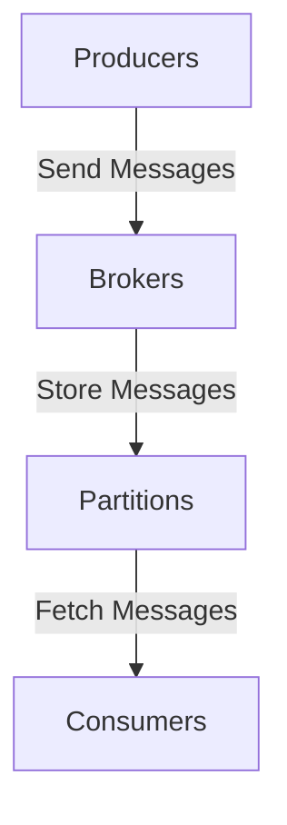

                 

关键词：Kafka, 消息队列，分布式系统，流处理，数据一致性和可靠性，源码分析，代码实例

## 摘要

本文旨在深入讲解Kafka的核心原理和代码实例，为读者提供一个全面了解和掌握Kafka技术栈的视角。Kafka是一个分布式流处理平台，广泛用于构建实时数据管道和流式应用。本文将首先介绍Kafka的基本概念和架构设计，随后详细解读其核心组件和工作原理。通过代码实例，我们将探讨Kafka在实际开发中的应用和实现细节，帮助读者更好地理解和运用这一重要技术。

## 1. 背景介绍

Kafka是由LinkedIn开源的分布式流处理平台，后来成为Apache软件基金会的顶级项目。Kafka设计之初的目的是解决LinkedIn公司内部大数据处理的需求，随着其优异的性能和可靠性得到广泛认可，Kafka迅速在业界流行起来。如今，Kafka已成为许多企业构建实时数据管道和流式应用的首选工具。

### 1.1 Kafka的应用场景

Kafka的主要应用场景包括：

- **实时数据流处理**：Kafka作为数据流的核心组件，可以实时处理和分析大量数据，满足高速数据处理的需求。

- **消息队列**：Kafka提供了高效、可靠的消息队列服务，支持发布/订阅模式，可以用来解耦系统和实现异步处理。

- **数据集成**：Kafka可以作为数据集成平台，将来自不同数据源的数据进行收集、存储和分发。

- **事件驱动架构**：Kafka支持事件驱动架构，可以用来实现微服务之间的异步通信。

### 1.2 Kafka的优势

Kafka具有以下优势：

- **高吞吐量**：Kafka能够处理数百万条消息/秒，满足大规模数据处理的场景需求。

- **可扩展性**：Kafka天生支持水平扩展，可以轻松处理不断增加的数据量和流量。

- **容错性**：Kafka具有强大的容错性，可以在节点故障时保持服务的稳定性。

- **持久化存储**：Kafka的数据可以持久化存储在磁盘上，确保数据不丢失。

- **高效压缩**：Kafka支持多种数据压缩格式，可以减少存储和传输的开销。

## 2. 核心概念与联系

### 2.1 概念介绍

Kafka的核心概念包括：

- **Topic**：主题，是Kafka中的消息分类标识符，类似于数据库中的表。

- **Partition**：分区，每个Topic可以划分为多个分区，分区内的消息是有序的。

- **Broker**：代理，Kafka服务器，负责处理客户端请求和存储消息。

- **Producer**：生产者，负责向Kafka发送消息。

- **Consumer**：消费者，负责从Kafka订阅并消费消息。

### 2.2 架构设计

Kafka的架构设计采用分布式系统模式，如下图所示：



- Producers发送消息到Brokers。
- Brokers存储消息到Partitions。
- Consumers从Partitions获取消息。

### 2.3 工作原理

Kafka的工作原理如下：

1. **Producers发送消息**：生产者将消息发送到Kafka集群，消息被写入到相应的Topic和Partition中。

2. **Brokers存储消息**：Kafka集群中的Brokers负责存储和转发消息。每个Partition在集群中的多个Brokers上存储，提供冗余和容错。

3. **Consumers消费消息**：消费者从Kafka集群订阅并消费消息，可以并行地从不同的Partition读取数据。

4. **消息传输和复制**：Kafka使用TCP协议进行消息传输，保证消息的可靠性和高效性。

5. **分区和并行处理**：通过将消息写入到多个分区，Kafka支持并行处理，提高处理速度和吞吐量。

## 3. 核心算法原理 & 具体操作步骤

### 3.1 算法原理概述

Kafka的核心算法原理主要包括以下方面：

- **分布式存储**：Kafka采用分布式存储架构，将消息存储到多个节点，提高数据的可靠性和可用性。

- **分布式处理**：Kafka支持分布式处理，通过分区和并行处理，提高系统的吞吐量和并发能力。

- **日志结构**：Kafka采用日志结构存储消息，每个Partition是一个有序的日志文件，支持顺序读取和写入。

### 3.2 算法步骤详解

1. **消息发送**：

   - 生产者将消息发送到指定的Topic和Partition。
   - Kafka集群中的Brokers接收消息，并将消息写入到相应的Partition中。

2. **消息存储**：

   - 每个Partition在集群中的多个Brokers上存储，提供冗余和容错。
   - Kafka使用文件系统进行消息存储，支持持久化和恢复。

3. **消息消费**：

   - 消费者从Kafka集群订阅并消费消息。
   - 消费者可以从多个Partition并行读取数据，提高处理速度。

4. **消息传输和复制**：

   - Kafka使用TCP协议进行消息传输，保证消息的可靠性和高效性。
   - Kafka支持消息的异步复制，提高系统的容错性和可用性。

### 3.3 算法优缺点

#### 优点：

- **高吞吐量**：Kafka支持大规模数据处理的场景，具有极高的吞吐量。

- **分布式处理**：Kafka支持分布式处理，提高系统的并发能力和处理速度。

- **容错性**：Kafka具有强大的容错性，可以自动处理节点故障。

- **持久化存储**：Kafka支持消息的持久化存储，确保数据不丢失。

#### 缺点：

- **复杂性**：Kafka的架构较为复杂，需要一定的学习成本。

- **资源消耗**：Kafka需要一定的资源消耗，对硬件要求较高。

### 3.4 算法应用领域

Kafka广泛应用于以下领域：

- **大数据处理**：Kafka作为大数据处理平台的核心组件，用于实时处理和分析大规模数据。

- **实时流处理**：Kafka支持实时流处理，用于实时分析和处理实时数据流。

- **消息队列**：Kafka作为消息队列服务，用于解耦系统和实现异步处理。

- **事件驱动架构**：Kafka支持事件驱动架构，用于实现微服务之间的异步通信。

## 4. 数学模型和公式 & 详细讲解 & 举例说明

### 4.1 数学模型构建

Kafka中的数学模型主要包括以下几个方面：

1. **吞吐量模型**：

   - 吞吐量（Throughput）= 消息数/时间

2. **延迟模型**：

   - 延迟（Latency）= 消息处理时间

3. **资源消耗模型**：

   - 资源消耗 = CPU使用率 + 内存使用率 + 网络带宽消耗

### 4.2 公式推导过程

以吞吐量模型为例，推导过程如下：

- 消息数 = 吞吐量 × 时间
- 时间 = 消息处理时间 + 网络传输时间
- 吞吐量 = 消息数 / 时间
- 吞吐量 = 消息数 / (消息处理时间 + 网络传输时间)

### 4.3 案例分析与讲解

#### 案例一：实时日志收集系统

假设一个实时日志收集系统使用Kafka处理日志数据，吞吐量为1000条/秒，消息处理时间为10ms，网络传输时间为20ms。

- 吞吐量 = 1000条/秒
- 消息处理时间 = 10ms
- 网络传输时间 = 20ms
- 延迟 = 消息处理时间 + 网络传输时间 = 10ms + 20ms = 30ms

#### 案例二：实时交易数据处理系统

假设一个实时交易数据处理系统使用Kafka处理交易数据，吞吐量为10000条/秒，消息处理时间为20ms，网络传输时间为30ms。

- 吞吐量 = 10000条/秒
- 消息处理时间 = 20ms
- 网络传输时间 = 30ms
- 延迟 = 消息处理时间 + 网络传输时间 = 20ms + 30ms = 50ms

## 5. 项目实践：代码实例和详细解释说明

### 5.1 开发环境搭建

搭建Kafka开发环境，需要以下步骤：

1. 安装Java开发环境（Java 8及以上版本）。

2. 下载Kafka二进制文件，解压到指定目录。

3. 配置Kafka环境变量。

4. 启动Kafka服务器。

5. 创建Kafka主题。

### 5.2 源代码详细实现

以下是一个简单的Kafka生产者和消费者的源代码示例：

#### 生产者代码示例

```java
import org.apache.kafka.clients.producer.*;
import java.util.Properties;

public class KafkaProducerDemo {
    public static void main(String[] args) {
        Properties props = new Properties();
        props.put("bootstrap.servers", "localhost:9092");
        props.put("key.serializer", "org.apache.kafka.common.serialization.StringSerializer");
        props.put("value.serializer", "org.apache.kafka.common.serialization.StringSerializer");

        Producer<String, String> producer = new KafkaProducer<>(props);
        for (int i = 0; i < 10; i++) {
            producer.send(new ProducerRecord<>("test-topic", Integer.toString(i), Integer.toString(i)));
        }
        producer.close();
    }
}
```

#### 消费者代码示例

```java
import org.apache.kafka.clients.consumer.*;
import java.util.Collections;
import java.util.Properties;

public class KafkaConsumerDemo {
    public static void main(String[] args) {
        Properties props = new Properties();
        props.put("bootstrap.servers", "localhost:9092");
        props.put("group.id", "test-group");
        props.put("key.deserializer", "org.apache.kafka.common.serialization.StringDeserializer");
        props.put("value.deserializer", "org.apache.kafka.common.serialization.StringDeserializer");

        Consumer<String, String> consumer = new KafkaConsumer<>(props);
        consumer.subscribe(Collections.singletonList("test-topic"));

        while (true) {
            ConsumerRecords<String, String> records = consumer.poll(100);
            for (ConsumerRecord<String, String> record : records) {
                System.out.printf("offset = %d, key = %s, value = %s\n", record.offset(), record.key(), record.value());
            }
        }
    }
}
```

### 5.3 代码解读与分析

- **生产者代码解读**：生产者代码示例中，首先创建了一个Kafka生产者配置对象，配置了Kafka服务器地址和序列化器。然后，通过循环发送10条消息到指定的Topic。

- **消费者代码解读**：消费者代码示例中，首先创建了一个Kafka消费者配置对象，配置了Kafka服务器地址和组ID。然后，通过订阅指定的Topic，并从Topic中消费消息。

### 5.4 运行结果展示

运行生产者代码，将生成10条消息并打印如下日志：

```
offset = 0, key = 0, value = 0
offset = 1, key = 1, value = 1
offset = 2, key = 2, value = 2
offset = 3, key = 3, value = 3
offset = 4, key = 4, value = 4
offset = 5, key = 5, value = 5
offset = 6, key = 6, value = 6
offset = 7, key = 7, value = 7
offset = 8, key = 8, value = 8
offset = 9, key = 9, value = 9
```

## 6. 实际应用场景

### 6.1 实时数据流处理

Kafka在实时数据流处理场景中具有广泛的应用，如实时日志收集、实时监控、实时分析等。通过Kafka，可以实时收集和处理海量数据，实现实时数据的可视化和分析。

### 6.2 消息队列

Kafka作为消息队列服务，可以用于系统解耦和异步处理。通过Kafka，可以构建高效的异步处理流程，提高系统的性能和可维护性。

### 6.3 数据集成

Kafka可以作为数据集成平台，将来自不同数据源的数据进行收集、存储和分发。通过Kafka，可以实现数据实时同步和批量处理，满足不同业务场景的需求。

### 6.4 事件驱动架构

Kafka支持事件驱动架构，可以用于实现微服务之间的异步通信。通过Kafka，可以构建高度解耦、高可扩展性的微服务架构。

## 7. 工具和资源推荐

### 7.1 学习资源推荐

- **《Kafka权威指南》**：这是一本全面介绍Kafka的权威指南，适合初学者和进阶者阅读。

- **Kafka官网文档**：Apache Kafka的官方文档，提供了详细的技术文档和API参考。

### 7.2 开发工具推荐

- **Kafka Manager**：一个开源的Kafka管理工具，提供主题管理、监控、日志查看等功能。

- **Kafka Tools**：一套开源的Kafka工具，包括生产者、消费者、监控器等，方便进行Kafka的日常开发和运维。

### 7.3 相关论文推荐

- **《Apache Kafka: A Distributed Streaming Platform》**：这篇论文介绍了Kafka的设计原理和架构，是了解Kafka的必读文献。

- **《Streaming Systems: The What, Where, When, and How of Large-Scale Data Processing**：这本书详细介绍了流处理系统的设计原理和实现技术，包括Kafka等工具。

## 8. 总结：未来发展趋势与挑战

### 8.1 研究成果总结

Kafka作为一个成熟的分布式流处理平台，已经在业界得到了广泛应用。其高吞吐量、分布式处理、容错性等特性，使其成为大数据处理、实时流处理等领域的首选工具。

### 8.2 未来发展趋势

- **性能优化**：Kafka将继续优化性能，提高处理速度和吞吐量，以满足更大规模的数据处理需求。

- **功能扩展**：Kafka将引入更多功能，如流计算、数据湖集成等，提高其应用场景的多样性。

- **云原生支持**：Kafka将加强对云原生技术的支持，更好地适应云环境的需求。

### 8.3 面临的挑战

- **复杂性**：Kafka的架构较为复杂，需要一定的学习和运维成本。

- **资源消耗**：Kafka需要一定的资源消耗，对硬件要求较高。

- **安全性**：随着数据量和流量的增加，Kafka的安全性问题将更加突出，需要加强安全防护措施。

### 8.4 研究展望

未来，Kafka将在以下几个方面进行研究和优化：

- **分布式存储和计算**：研究更高效的分布式存储和计算算法，提高系统的性能和可扩展性。

- **流数据处理**：研究更先进的流数据处理技术，提高实时数据处理的能力和效率。

- **安全性**：研究更先进的安全技术，提高系统的安全性和防护能力。

## 9. 附录：常见问题与解答

### 9.1 Kafka的劣势是什么？

- **复杂性**：Kafka的架构较为复杂，需要一定的学习和运维成本。
- **资源消耗**：Kafka需要一定的资源消耗，对硬件要求较高。

### 9.2 Kafka如何保证数据一致性？

- **副本机制**：Kafka使用副本机制，确保数据在不同节点上存储，提高数据可靠性。
- **同步机制**：Kafka使用同步机制，确保多个副本之间的一致性。

### 9.3 Kafka的性能如何优化？

- **分区优化**：合理设置分区数量，提高并行处理能力。
- **副本优化**：合理设置副本数量，提高系统的容错性和性能。

### 9.4 Kafka如何处理节点故障？

- **副本机制**：Kafka使用副本机制，当主节点故障时，自动切换到副本节点。
- **故障检测**：Kafka通过心跳机制检测节点故障，自动进行故障转移。

### 9.5 Kafka的安装和使用教程？

- 请参考Kafka官网文档，提供了详细的安装和使用教程。

---

**作者：禅与计算机程序设计艺术 / Zen and the Art of Computer Programming**

