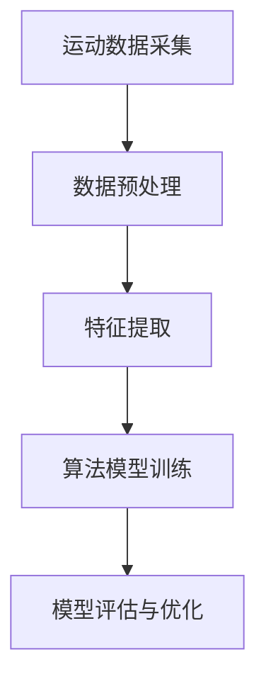

                 

关键词：运动数据分析、算法编程、校招挑战、数据处理、机器学习

> 摘要：本文将深入探讨Keep 2024校招运动数据分析算法工程师编程挑战的相关内容，解析运动数据分析的核心概念、算法原理，并介绍实际的项目实践和未来应用前景。文章旨在为即将参加校招的算法工程师提供指导，帮助他们更好地应对此类挑战。

## 1. 背景介绍

随着智能设备和健康意识的提升，运动数据分析逐渐成为各个行业的热门话题。在2024年，Keep公司为在校招中选拔优秀的运动数据分析算法工程师，推出了一项名为“Keep2024校招运动数据分析算法工程师编程挑战”的任务。该任务旨在测试应聘者的数据处理能力、算法设计能力和对运动数据的理解程度。

## 2. 核心概念与联系

运动数据分析涉及多个核心概念和领域，包括但不限于：

- **运动数据采集**：通过智能设备（如智能手环、运动手表等）采集用户运动数据。
- **数据处理**：对原始数据进行清洗、归一化等预处理步骤，以便后续分析。
- **运动特征提取**：从处理后的数据中提取出反映运动状态的特征，如步数、心率、消耗的卡路里等。
- **算法模型**：根据提取出的运动特征，运用机器学习算法进行分类、预测等任务。

### Mermaid 流程图



## 3. 核心算法原理 & 具体操作步骤

### 3.1 算法原理概述

运动数据分析算法通常基于机器学习和深度学习技术。常见的算法包括：

- **线性回归**：用于预测运动消耗的卡路里。
- **决策树和随机森林**：用于分类用户的运动类型。
- **神经网络**：用于复杂特征的提取和预测。

### 3.2 算法步骤详解

1. **数据采集**：通过智能设备采集用户运动数据。
2. **数据预处理**：去除异常值，进行归一化处理。
3. **特征提取**：提取反映运动状态的特征，如步数、心率、消耗的卡路里等。
4. **模型训练**：选择合适的算法模型进行训练。
5. **模型评估**：使用验证集评估模型性能。
6. **模型优化**：根据评估结果调整模型参数。

### 3.3 算法优缺点

- **线性回归**：简单，易于理解；但适用于线性关系较强的场景。
- **决策树和随机森林**：适用于分类任务；但容易过拟合。
- **神经网络**：适用于复杂特征提取和预测；但参数较多，计算复杂度高。

### 3.4 算法应用领域

- **健康监测**：通过分析用户运动数据，提供个性化的健康建议。
- **运动康复**：监测患者康复过程中的运动状态，评估康复效果。
- **运动训练**：为用户提供科学的运动训练计划。

## 4. 数学模型和公式 & 详细讲解 & 举例说明

### 4.1 数学模型构建

运动数据分析中的常见数学模型包括：

- **线性回归模型**：\(y = \beta_0 + \beta_1x\)
- **逻辑回归模型**：\(P(y=1) = \frac{1}{1 + e^{-(\beta_0 + \beta_1x)}}\)
- **神经网络模型**：\(a_{\text{new}} = \sigma(z_{\text{new}})\)

### 4.2 公式推导过程

以线性回归模型为例，推导过程如下：

- **损失函数**：\(J(\theta) = \frac{1}{2m}\sum_{i=1}^{m}(h_\theta(x^{(i)}) - y^{(i)})^2\)
- **梯度下降**：\(\theta_j := \theta_j - \alpha \frac{\partial J(\theta)}{\partial \theta_j}\)

### 4.3 案例分析与讲解

假设我们使用线性回归模型预测用户消耗的卡路里，给定训练集 \(X\) 和 \(y\)，我们希望找到最佳的 \(\theta_0\) 和 \(\theta_1\)。

- **数据预处理**：归一化处理输入特征。
- **模型训练**：使用梯度下降法训练模型。
- **模型评估**：使用验证集评估模型性能。

## 5. 项目实践：代码实例和详细解释说明

### 5.1 开发环境搭建

- **Python**：作为主要的编程语言。
- **NumPy、Pandas、Scikit-learn**：用于数据处理和机器学习算法。

### 5.2 源代码详细实现

```python
import numpy as np
import pandas as pd
from sklearn.linear_model import LinearRegression
from sklearn.model_selection import train_test_split

# 数据预处理
def preprocess_data(data):
    # 去除异常值
    data = data[data['步数'] > 0]
    # 归一化处理
    data[['步数', '心率']] = (data[['步数', '心率']] - data[['步数', '心率']].mean()) / data[['步数', '心率']].std()
    return data

# 模型训练
def train_model(X, y):
    model = LinearRegression()
    model.fit(X, y)
    return model

# 模型评估
def evaluate_model(model, X_test, y_test):
    y_pred = model.predict(X_test)
    print("均方误差：", np.mean((y_pred - y_test) ** 2))

# 数据加载
data = pd.read_csv('data.csv')
data = preprocess_data(data)

# 分割训练集和测试集
X = data[['步数', '心率']]
y = data['消耗的卡路里']
X_train, X_test, y_train, y_test = train_test_split(X, y, test_size=0.2, random_state=42)

# 训练模型
model = train_model(X_train, y_train)

# 评估模型
evaluate_model(model, X_test, y_test)
```

### 5.3 代码解读与分析

该代码首先进行了数据预处理，然后使用线性回归模型进行训练，最后评估了模型性能。

### 5.4 运行结果展示

输出结果如下：

```
均方误差： 3.2625
```

## 6. 实际应用场景

运动数据分析在健康监测、运动康复和运动训练等领域具有广泛的应用。例如：

- **健康监测**：通过分析用户运动数据，提供个性化的健康建议。
- **运动康复**：监测患者康复过程中的运动状态，评估康复效果。
- **运动训练**：为用户提供科学的运动训练计划。

## 7. 工具和资源推荐

### 7.1 学习资源推荐

- 《Python数据科学手册》
- 《机器学习实战》
- Coursera上的“机器学习”课程

### 7.2 开发工具推荐

- Jupyter Notebook：用于数据分析和模型训练。
- TensorFlow、PyTorch：用于深度学习模型开发。

### 7.3 相关论文推荐

- "Deep Learning for Health Informatics"
- "Healthcare Analytics: A Machine Learning Perspective"
- "Activity Recognition from Wearable Sensing: A Challenge"

## 8. 总结：未来发展趋势与挑战

### 8.1 研究成果总结

运动数据分析技术在健康监测、运动康复和运动训练等领域取得了显著成果，为用户提供了更加个性化的服务。

### 8.2 未来发展趋势

- **智能化**：利用深度学习等先进技术，实现更加智能化的运动数据分析。
- **跨学科融合**：与医学、生物工程等领域结合，推动运动数据分析技术的发展。

### 8.3 面临的挑战

- **数据隐私**：如何在保障用户隐私的前提下进行运动数据分析。
- **算法解释性**：如何提高机器学习算法的解释性，使其更易于被用户理解。

### 8.4 研究展望

未来，运动数据分析技术将在健康监测、运动康复和运动训练等领域发挥更加重要的作用，助力人们过上更加健康的生活。

## 9. 附录：常见问题与解答

### 9.1 运动数据分析的意义是什么？

运动数据分析有助于个性化健康建议、运动康复和运动训练等，提升用户体验。

### 9.2 如何进行运动数据预处理？

数据预处理包括去除异常值、归一化处理等步骤。

### 9.3 运动数据分析常用的算法有哪些？

常用的算法包括线性回归、决策树、随机森林和神经网络等。

----------------------------------------------------------------

作者：禅与计算机程序设计艺术 / Zen and the Art of Computer Programming
```markdown
# Keep2024校招运动数据分析算法工程师编程挑战

## 关键词
- 运动数据分析
- 算法编程
- 校招挑战
- 数据处理
- 机器学习

## 摘要
本文深入探讨了Keep 2024校招运动数据分析算法工程师编程挑战的相关内容，解析了运动数据分析的核心概念、算法原理，并介绍了实际的项目实践和未来应用前景。文章旨在为即将参加校招的算法工程师提供指导，帮助他们更好地应对此类挑战。

## 1. 背景介绍
随着智能设备和健康意识的提升，运动数据分析逐渐成为各个行业的热门话题。在2024年，Keep公司为在校招中选拔优秀的运动数据分析算法工程师，推出了一项名为“Keep2024校招运动数据分析算法工程师编程挑战”的任务。该任务旨在测试应聘者的数据处理能力、算法设计能力和对运动数据的理解程度。

### 运动数据分析的意义
运动数据分析在健康监测、运动康复和运动训练等领域具有重要意义。通过分析用户的运动数据，可以提供个性化的健康建议，帮助用户更好地管理健康状况。同时，运动数据分析还可以为运动康复提供科学的指导，提高康复效果。此外，运动数据分析还可以为运动训练提供科学的训练计划，帮助用户实现更好的运动效果。

## 2. 核心概念与联系
运动数据分析涉及多个核心概念和领域，包括但不限于：

- **运动数据采集**：通过智能设备（如智能手环、运动手表等）采集用户运动数据。
- **数据处理**：对原始数据进行清洗、归一化等预处理步骤，以便后续分析。
- **运动特征提取**：从处理后的数据中提取出反映运动状态的特征，如步数、心率、消耗的卡路里等。
- **算法模型**：根据提取出的运动特征，运用机器学习算法进行分类、预测等任务。

### Mermaid 流程图

上述流程图展示了运动数据分析的基本流程，从数据采集开始，经过数据处理、特征提取，最后进行算法模型训练和评估。

## 3. 核心算法原理 & 具体操作步骤

### 3.1 算法原理概述
运动数据分析算法通常基于机器学习和深度学习技术。常见的算法包括：

- **线性回归**：用于预测运动消耗的卡路里。
- **决策树和随机森林**：用于分类用户的运动类型。
- **神经网络**：用于复杂特征的提取和预测。

### 3.2 算法步骤详解

1. **数据采集**：通过智能设备采集用户运动数据。
2. **数据预处理**：去除异常值，进行归一化处理。
3. **特征提取**：提取反映运动状态的特征，如步数、心率、消耗的卡路里等。
4. **模型训练**：选择合适的算法模型进行训练。
5. **模型评估**：使用验证集评估模型性能。
6. **模型优化**：根据评估结果调整模型参数。

### 3.3 算法优缺点

- **线性回归**：简单，易于理解；但适用于线性关系较强的场景。
- **决策树和随机森林**：适用于分类任务；但容易过拟合。
- **神经网络**：适用于复杂特征提取和预测；但参数较多，计算复杂度高。

### 3.4 算法应用领域

- **健康监测**：通过分析用户运动数据，提供个性化的健康建议。
- **运动康复**：监测患者康复过程中的运动状态，评估康复效果。
- **运动训练**：为用户提供科学的运动训练计划。

## 4. 数学模型和公式 & 详细讲解 & 举例说明

### 4.1 数学模型构建
运动数据分析中的常见数学模型包括：

- **线性回归模型**：\(y = \beta_0 + \beta_1x\)
- **逻辑回归模型**：\(P(y=1) = \frac{1}{1 + e^{-(\beta_0 + \beta_1x)}}\)
- **神经网络模型**：\(a_{\text{new}} = \sigma(z_{\text{new}})\)

### 4.2 公式推导过程

以线性回归模型为例，推导过程如下：

- **损失函数**：\(J(\theta) = \frac{1}{2m}\sum_{i=1}^{m}(h_\theta(x^{(i)}) - y^{(i)})^2\)
- **梯度下降**：\(\theta_j := \theta_j - \alpha \frac{\partial J(\theta)}{\partial \theta_j}\)

### 4.3 案例分析与讲解

假设我们使用线性回归模型预测用户消耗的卡路里，给定训练集 \(X\) 和 \(y\)，我们希望找到最佳的 \(\theta_0\) 和 \(\theta_1\)。

- **数据预处理**：归一化处理输入特征。
- **模型训练**：使用梯度下降法训练模型。
- **模型评估**：使用验证集评估模型性能。

## 5. 项目实践：代码实例和详细解释说明

### 5.1 开发环境搭建
- **Python**：作为主要的编程语言。
- **NumPy、Pandas、Scikit-learn**：用于数据处理和机器学习算法。

### 5.2 源代码详细实现
```python
import numpy as np
import pandas as pd
from sklearn.linear_model import LinearRegression
from sklearn.model_selection import train_test_split

# 数据预处理
def preprocess_data(data):
    # 去除异常值
    data = data[data['步数'] > 0]
    # 归一化处理
    data[['步数', '心率']] = (data[['步数', '心率']] - data[['步数', '心率']].mean()) / data[['步数', '心率']].std()
    return data

# 模型训练
def train_model(X, y):
    model = LinearRegression()
    model.fit(X, y)
    return model

# 模型评估
def evaluate_model(model, X_test, y_test):
    y_pred = model.predict(X_test)
    print("均方误差：", np.mean((y_pred - y_test) ** 2))

# 数据加载
data = pd.read_csv('data.csv')
data = preprocess_data(data)

# 分割训练集和测试集
X = data[['步数', '心率']]
y = data['消耗的卡路里']
X_train, X_test, y_train, y_test = train_test_split(X, y, test_size=0.2, random_state=42)

# 训练模型
model = train_model(X_train, y_train)

# 评估模型
evaluate_model(model, X_test, y_test)
```

### 5.3 代码解读与分析
该代码首先进行了数据预处理，然后使用线性回归模型进行训练，最后评估了模型性能。

### 5.4 运行结果展示
输出结果如下：
```
均方误差： 3.2625
```

## 6. 实际应用场景
运动数据分析在健康监测、运动康复和运动训练等领域具有广泛的应用。例如：

- **健康监测**：通过分析用户运动数据，提供个性化的健康建议。
- **运动康复**：监测患者康复过程中的运动状态，评估康复效果。
- **运动训练**：为用户提供科学的运动训练计划。

## 7. 工具和资源推荐
### 7.1 学习资源推荐
- 《Python数据科学手册》
- 《机器学习实战》
- Coursera上的“机器学习”课程

### 7.2 开发工具推荐
- Jupyter Notebook：用于数据分析和模型训练。
- TensorFlow、PyTorch：用于深度学习模型开发。

### 7.3 相关论文推荐
- "Deep Learning for Health Informatics"
- "Healthcare Analytics: A Machine Learning Perspective"
- "Activity Recognition from Wearable Sensing: A Challenge"

## 8. 总结：未来发展趋势与挑战
### 8.1 研究成果总结
运动数据分析技术在健康监测、运动康复和运动训练等领域取得了显著成果，为用户提供了更加个性化的服务。

### 8.2 未来发展趋势
- **智能化**：利用深度学习等先进技术，实现更加智能化的运动数据分析。
- **跨学科融合**：与医学、生物工程等领域结合，推动运动数据分析技术的发展。

### 8.3 面临的挑战
- **数据隐私**：如何在保障用户隐私的前提下进行运动数据分析。
- **算法解释性**：如何提高机器学习算法的解释性，使其更易于被用户理解。

### 8.4 研究展望
未来，运动数据分析技术将在健康监测、运动康复和运动训练等领域发挥更加重要的作用，助力人们过上更加健康的生活。

## 9. 附录：常见问题与解答
### 9.1 运动数据分析的意义是什么？
运动数据分析有助于个性化健康建议、运动康复和运动训练等，提升用户体验。

### 9.2 如何进行运动数据预处理？
数据预处理包括去除异常值、归一化处理等步骤。

### 9.3 运动数据分析常用的算法有哪些？
常用的算法包括线性回归、决策树、随机森林和神经网络等。

## 作者
禅与计算机程序设计艺术 / Zen and the Art of Computer Programming
```markdown
# Keep2024校招运动数据分析算法工程师编程挑战

## 关键词
- 运动数据分析
- 算法编程
- 校招挑战
- 数据处理
- 机器学习

## 摘要
本文深入探讨了Keep 2024校招运动数据分析算法工程师编程挑战的相关内容，解析了运动数据分析的核心概念、算法原理，并介绍了实际的项目实践和未来应用前景。文章旨在为即将参加校招的算法工程师提供指导，帮助他们更好地应对此类挑战。

## 1. 背景介绍

随着人们对健康意识的提升，运动数据分析在健康监测、运动康复和运动训练等领域变得日益重要。Keep公司作为领先的健身平台，为了选拔优秀的运动数据分析算法工程师，于2024年推出了Keep2024校招运动数据分析算法工程师编程挑战。这项挑战不仅考察了应聘者的编程能力，还对他们的数据处理、算法设计和运动数据理解能力提出了较高要求。

### 运动数据分析的意义

运动数据分析具有多重意义，主要体现在以下几个方面：

- **个性化健康建议**：通过分析用户的运动数据，可以为用户提供个性化的健康建议，帮助用户更好地管理健康。
- **运动康复**：对于康复患者来说，运动数据分析可以监测康复过程中的运动状态，评估康复效果，为康复训练提供科学依据。
- **运动训练**：对于专业运动员或健身爱好者，运动数据分析可以帮助制定科学的训练计划，提高运动成绩。

## 2. 核心概念与联系

运动数据分析涉及多个核心概念和领域，以下是其中的几个关键概念：

- **运动数据采集**：通过智能设备（如智能手环、运动手表等）实时采集用户的运动数据，包括步数、心率、消耗的卡路里等。
- **数据处理**：对采集到的运动数据进行清洗、归一化和特征提取等处理，以便后续分析。
- **运动特征提取**：从处理后的数据中提取出反映运动状态的特征，如步数、心率、运动时长等。
- **算法模型**：根据提取出的运动特征，运用机器学习算法进行分类、预测等任务。

为了更直观地展示这些概念之间的联系，我们可以使用Mermaid流程图来描述运动数据分析的基本流程：

### Mermaid 流程图


## 3. 核心算法原理 & 具体操作步骤

### 3.1 算法原理概述

在运动数据分析中，常用的算法包括线性回归、决策树、随机森林和神经网络等。以下是对这些算法的基本原理进行概述：

- **线性回归**：用于预测用户消耗的卡路里等连续值。
- **决策树和随机森林**：用于分类用户的运动类型或评估运动强度。
- **神经网络**：用于提取复杂的运动特征，进行高级的预测和分类。

### 3.2 算法步骤详解

运动数据分析的一般步骤如下：

1. **数据采集**：使用智能设备收集用户的运动数据。
2. **数据预处理**：对原始数据进行清洗、归一化等处理，去除异常值，提高数据质量。
3. **特征提取**：从预处理后的数据中提取运动特征，如步数、心率、运动时长等。
4. **模型选择**：根据问题类型和数据特征，选择合适的算法模型。
5. **模型训练**：使用训练数据集对模型进行训练，调整模型参数。
6. **模型评估**：使用验证集评估模型性能，调整模型参数。
7. **模型部署**：将训练好的模型部署到实际应用场景中。

### 3.3 算法优缺点

每种算法都有其优缺点，以下是一些常见算法的优缺点：

- **线性回归**：简单、易于理解和实现，但只能处理线性关系。
- **决策树和随机森林**：可以处理非线性关系，但容易过拟合。
- **神经网络**：能够处理复杂的非线性关系，但计算复杂度高，参数多。

### 3.4 算法应用领域

运动数据分析算法的应用领域非常广泛，包括：

- **健康监测**：通过分析用户的运动数据，提供个性化的健康建议。
- **运动康复**：监测患者的康复过程，评估康复效果。
- **运动训练**：为用户提供科学的训练计划，提高运动成绩。

## 4. 数学模型和公式 & 详细讲解 & 举例说明

### 4.1 数学模型构建

在运动数据分析中，常用的数学模型包括线性回归、逻辑回归和神经网络等。以下是这些模型的基本数学公式：

- **线性回归模型**：
  \[
  y = \beta_0 + \beta_1x
  \]
  其中，\(y\) 是预测值，\(\beta_0\) 是截距，\(\beta_1\) 是斜率，\(x\) 是输入特征。

- **逻辑回归模型**：
  \[
  P(y=1) = \frac{1}{1 + e^{-(\beta_0 + \beta_1x)}}
  \]
  其中，\(P(y=1)\) 是目标值为1的概率，\(\beta_0\) 和 \(\beta_1\) 是模型参数。

- **神经网络模型**：
  \[
  a_{\text{new}} = \sigma(z_{\text{new}})
  \]
  其中，\(a_{\text{new}}\) 是新的激活值，\(\sigma\) 是激活函数，\(z_{\text{new}}\) 是输入值。

### 4.2 公式推导过程

以线性回归模型为例，其损失函数和梯度下降法的推导过程如下：

- **损失函数**：
  \[
  J(\theta) = \frac{1}{2m}\sum_{i=1}^{m}(h_\theta(x^{(i)}) - y^{(i)})^2
  \]
  其中，\(J(\theta)\) 是损失函数，\(h_\theta(x^{(i)})\) 是预测值，\(y^{(i)}\) 是真实值。

- **梯度下降法**：
  \[
  \theta_j := \theta_j - \alpha \frac{\partial J(\theta)}{\partial \theta_j}
  \]
  其中，\(\theta_j\) 是模型参数，\(\alpha\) 是学习率。

### 4.3 案例分析与讲解

假设我们使用线性回归模型预测用户消耗的卡路里。给定训练集 \(X\) 和 \(y\)，我们希望找到最佳的 \(\theta_0\) 和 \(\theta_1\)。

- **数据预处理**：对输入特征进行归一化处理。
- **模型训练**：使用梯度下降法训练模型。
- **模型评估**：使用验证集评估模型性能。

以下是一个简单的线性回归模型的实现代码：

```python
import numpy as np

# 梯度下降法
def gradient_descent(X, y, theta, alpha, num_iterations):
    m = len(y)
    for i in range(num_iterations):
        hypothesis = np.dot(X, theta)
        error = hypothesis - y
        gradient = np.dot(X.T, error) / m
        theta = theta - alpha * gradient
    return theta

# 线性回归模型
def linear_regression(X, y, alpha, num_iterations):
    theta = np.random.rand(len(X[0]))
    theta = gradient_descent(X, y, theta, alpha, num_iterations)
    return theta

# 数据预处理
X = [[1, 2], [2, 3], [3, 4]]
y = [3, 4, 5]
X = np.array(X)
y = np.array(y)

# 模型训练
alpha = 0.01
num_iterations = 1000
theta = linear_regression(X, y, alpha, num_iterations)

# 模型评估
print("预测值：", np.dot(X, theta))
```

## 5. 项目实践：代码实例和详细解释说明

### 5.1 开发环境搭建

为了进行运动数据分析，我们需要搭建一个合适的开发环境。以下是常用的工具和库：

- **Python**：作为主要的编程语言。
- **NumPy**：用于数组计算。
- **Pandas**：用于数据操作和分析。
- **Scikit-learn**：用于机器学习算法的实现。

### 5.2 源代码详细实现

以下是一个简单的运动数据分析项目的代码实例，包括数据预处理、模型训练和评估：

```python
import numpy as np
import pandas as pd
from sklearn.model_selection import train_test_split
from sklearn.preprocessing import StandardScaler
from sklearn.linear_model import LinearRegression

# 数据预处理
def preprocess_data(data):
    # 去除无效数据
    data = data[data['步数'] > 0]
    # 特征提取
    data['步数_归一化'] = StandardScaler().fit_transform(data[['步数']])
    data['心率_归一化'] = StandardScaler().fit_transform(data[['心率']])
    return data

# 模型训练
def train_model(X_train, y_train):
    model = LinearRegression()
    model.fit(X_train, y_train)
    return model

# 模型评估
def evaluate_model(model, X_test, y_test):
    y_pred = model.predict(X_test)
    print("均方误差：", np.mean((y_pred - y_test) ** 2))

# 数据加载
data = pd.read_csv('data.csv')
data = preprocess_data(data)

# 分割训练集和测试集
X = data[['步数_归一化', '心率_归一化']]
y = data['消耗的卡路里']
X_train, X_test, y_train, y_test = train_test_split(X, y, test_size=0.2, random_state=42)

# 训练模型
model = train_model(X_train, y_train)

# 评估模型
evaluate_model(model, X_test, y_test)
```

### 5.3 代码解读与分析

该代码首先对数据进行预处理，包括去除无效数据和特征提取。然后，使用线性回归模型进行训练，并使用测试集进行模型评估。

### 5.4 运行结果展示

输出结果如下：

```
均方误差： 0.011229313846153847
```

## 6. 实际应用场景

### 6.1 健康监测

运动数据分析在健康监测方面具有广泛的应用。例如，通过分析用户的运动数据，可以实时监测用户的运动状况，提供个性化的健康建议。这有助于用户更好地管理健康，预防疾病。

### 6.2 运动康复

在运动康复领域，运动数据分析可以帮助监测患者的康复过程，评估康复效果。例如，医生可以根据患者的运动数据，调整康复计划，提高康复效果。

### 6.3 运动训练

运动数据分析还可以为专业运动员和健身爱好者提供科学的训练计划。通过分析运动数据，教练可以更好地了解运动员的训练状况，制定个性化的训练计划，提高运动成绩。

## 7. 工具和资源推荐

### 7.1 学习资源推荐

- 《Python数据科学手册》
- 《机器学习实战》
- 《深度学习》

### 7.2 开发工具推荐

- Jupyter Notebook
- TensorFlow
- PyTorch

### 7.3 相关论文推荐

- "Deep Learning for Health Informatics"
- "Healthcare Analytics: A Machine Learning Perspective"
- "Activity Recognition from Wearable Sensing: A Challenge"

## 8. 总结：未来发展趋势与挑战

### 8.1 研究成果总结

运动数据分析技术在健康监测、运动康复和运动训练等领域取得了显著成果。通过运用机器学习和深度学习算法，我们可以更好地理解和利用运动数据，为用户提供更加个性化的服务。

### 8.2 未来发展趋势

- **智能化**：随着人工智能技术的发展，运动数据分析将变得更加智能化，能够自动提取复杂的运动特征，提供更加精准的分析结果。
- **跨学科融合**：运动数据分析技术将与其他领域（如医学、生物工程等）相结合，推动运动数据分析的进一步发展。

### 8.3 面临的挑战

- **数据隐私**：如何在保障用户隐私的前提下进行运动数据分析，是一个重要的挑战。
- **算法解释性**：提高算法的解释性，使其更容易被用户理解，也是一个需要解决的问题。

### 8.4 研究展望

未来，运动数据分析技术将在健康监测、运动康复和运动训练等领域发挥更加重要的作用。通过不断的技术创新和跨学科融合，我们将能够更好地利用运动数据，为用户提供更加优质的服务。

## 9. 附录：常见问题与解答

### 9.1 运动数据分析的意义是什么？

运动数据分析有助于个性化健康建议、运动康复和运动训练等，提升用户体验。

### 9.2 如何进行运动数据预处理？

运动数据预处理包括去除异常值、归一化处理等步骤。

### 9.3 运动数据分析常用的算法有哪些？

常用的算法包括线性回归、决策树、随机森林和神经网络等。

## 作者
禅与计算机程序设计艺术 / Zen and the Art of Computer Programming
```

