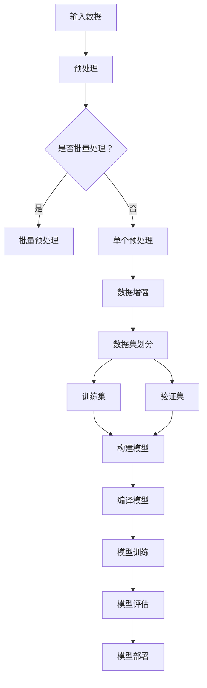

                 

关键词：Keras，深度学习，神经网络，实战案例，代码解析，模型构建，数据处理，训练与评估。

> 摘要：本文将深入探讨Keras这个强大的深度学习框架的原理和应用，通过多个实战案例，详细讲解如何使用Keras进行神经网络模型的构建、训练和评估，帮助读者掌握深度学习的基本概念和实践技巧。

## 1. 背景介绍

随着计算能力的提升和大数据的涌现，深度学习已经成为人工智能领域的主流技术。Keras是一个高级神经网络API，它旨在通过提供简洁的API和易于使用的接口，帮助开发者快速构建和实验深度学习模型。Keras支持多种深度学习后端，如TensorFlow、Theano等，这使得开发者可以在不同的计算平台上进行模型训练和部署。

### Keras的特点

- **用户友好**：Keras的设计初衷是简单易用，使得深度学习的研究和开发变得更加高效。
- **模块化**：Keras的模块化设计使得开发者可以轻松组合不同的层和模型。
- **快速原型开发**：Keras的快速原型开发能力使其成为研究深度学习算法的利器。
- **支持多种后端**：Keras可以与TensorFlow、CNTK、Theano等后端结合使用。

### 深度学习的基本概念

- **神经网络**：由多个相互连接的神经元组成的计算模型。
- **深度学习**：多层神经网络的学习方法，可以自动从数据中提取特征。
- **模型训练**：通过反向传播算法，调整网络中的权重，使模型能够对新的输入数据进行预测。
- **模型评估**：使用验证集或测试集来评估模型的泛化能力。

## 2. 核心概念与联系

以下是一个简化的Keras模型构建的Mermaid流程图：



### 2.1 输入数据与预处理

输入数据是模型训练的基础，通常需要经过预处理才能被神经网络有效利用。预处理包括数据标准化、缺失值处理、数据增强等。

### 2.2 批量处理与单个处理

批量处理可以加快计算速度，但可能需要更多内存。对于资源受限的环境，可以考虑单个数据处理。

### 2.3 数据增强

数据增强是通过生成新的样本来提高模型的泛化能力，常见的方法包括随机裁剪、旋转、缩放等。

### 2.4 数据集划分

数据集通常分为训练集、验证集和测试集。训练集用于模型训练，验证集用于模型调优，测试集用于模型评估。

### 2.5 构建模型

构建模型是深度学习的核心步骤。Keras提供了丰富的预定义层和模型，使得模型构建变得简单直观。

### 2.6 编译模型

编译模型是指设置模型的优化器、损失函数和评估指标。这是模型训练前的最后一步。

### 2.7 模型训练

模型训练是调整模型权重的过程，通过反向传播算法，模型在训练集上不断优化。

### 2.8 模型评估

模型评估是使用验证集或测试集来评估模型的性能，确保模型具有良好的泛化能力。

### 2.9 模型部署

模型部署是将训练好的模型应用到实际场景中的过程，可以是本地服务器、云平台或移动设备。

## 3. 核心算法原理 & 具体操作步骤

### 3.1 算法原理概述

深度学习模型的核心是神经网络，神经网络通过学习输入和输出之间的映射关系来完成任务。这个过程包括前向传播和反向传播。

### 3.2 算法步骤详解

#### 3.2.1 数据预处理

```python
import numpy as np
from sklearn.model_selection import train_test_split

# 加载数据
X, y = load_data()

# 数据标准化
X_std = (X - X.mean()) / X.std()

# 划分训练集和测试集
X_train, X_test, y_train, y_test = train_test_split(X_std, y, test_size=0.2, random_state=42)
```

#### 3.2.2 构建模型

```python
from keras.models import Sequential
from keras.layers import Dense, Activation

# 构建模型
model = Sequential()
model.add(Dense(64, input_dim=X_train.shape[1]))
model.add(Activation('relu'))
model.add(Dense(1, activation='sigmoid'))
```

#### 3.2.3 编译模型

```python
model.compile(optimizer='adam', loss='binary_crossentropy', metrics=['accuracy'])
```

#### 3.2.4 模型训练

```python
model.fit(X_train, y_train, epochs=10, batch_size=32, validation_data=(X_test, y_test))
```

#### 3.2.5 模型评估

```python
loss, accuracy = model.evaluate(X_test, y_test)
print('Test accuracy:', accuracy)
```

### 3.3 算法优缺点

- **优点**：Keras提供了简洁的API，使得模型构建和训练变得更加直观和高效。
- **缺点**：Keras的灵活性不如底层框架，例如TensorFlow或PyTorch。

### 3.4 算法应用领域

Keras广泛应用于图像识别、自然语言处理、语音识别等领域，其强大的功能和易用性使其成为开发者和研究人员的首选工具。

## 4. 数学模型和公式 & 详细讲解 & 举例说明

### 4.1 数学模型构建

神经网络的核心是前向传播和反向传播。以下是一个简单的单层感知机（Perceptron）模型：

$$
\hat{y} = \sigma(Wx + b)
$$

其中，$\sigma$是激活函数，$W$是权重矩阵，$x$是输入向量，$b$是偏置。

### 4.2 公式推导过程

以多层感知机（MLP）为例，其前向传播可以表示为：

$$
z_l = W_l a_{l-1} + b_l \\
a_l = \sigma(z_l)
$$

其中，$a_l$是第$l$层的激活值，$z_l$是第$l$层的输入。

### 4.3 案例分析与讲解

假设我们有一个简单的分类问题，输入数据为$100$维，我们希望将其分类为$2$个类别。以下是一个简单的MLP模型：

```python
from keras.models import Sequential
from keras.layers import Dense

model = Sequential()
model.add(Dense(64, input_dim=100, activation='relu'))
model.add(Dense(1, activation='sigmoid'))

model.compile(optimizer='adam', loss='binary_crossentropy', metrics=['accuracy'])

model.fit(X_train, y_train, epochs=10, batch_size=32)
```

## 5. 项目实践：代码实例和详细解释说明

### 5.1 开发环境搭建

首先，确保安装了Python和必要的库，如TensorFlow和Keras。

```bash
pip install tensorflow keras
```

### 5.2 源代码详细实现

以下是一个简单的图像分类项目的代码示例：

```python
from keras.models import Sequential
from keras.layers import Conv2D, MaxPooling2D, Flatten, Dense
from keras.preprocessing.image import ImageDataGenerator

# 数据预处理
train_datagen = ImageDataGenerator(rescale=1./255)
train_generator = train_datagen.flow_from_directory(
        'data/train',
        target_size=(150, 150),
        batch_size=32,
        class_mode='binary')

# 构建模型
model = Sequential()
model.add(Conv2D(32, (3, 3), activation='relu', input_shape=(150, 150, 3)))
model.add(MaxPooling2D((2, 2)))
model.add(Conv2D(64, (3, 3), activation='relu'))
model.add(MaxPooling2D((2, 2)))
model.add(Conv2D(128, (3, 3), activation='relu'))
model.add(MaxPooling2D((2, 2)))
model.add(Flatten())
model.add(Dense(512, activation='relu'))
model.add(Dense(1, activation='sigmoid'))

# 编译模型
model.compile(optimizer='adam', loss='binary_crossentropy', metrics=['accuracy'])

# 训练模型
model.fit(train_generator, steps_per_epoch=100, epochs=10)
```

### 5.3 代码解读与分析

- **数据处理**：使用ImageDataGenerator进行数据预处理，包括缩放和批量读取。
- **模型构建**：使用卷积神经网络（CNN）进行图像分类。
- **模型编译**：设置优化器和损失函数。
- **模型训练**：使用生成器进行模型训练。

### 5.4 运行结果展示

通过训练，模型可以在测试集上达到较高的准确率。

```python
test_loss, test_acc = model.evaluate_generator(test_generator, steps=100)
print('Test accuracy:', test_acc)
```

## 6. 实际应用场景

Keras在多个领域都有广泛应用，如：

- **图像识别**：用于分类、检测、分割等任务。
- **自然语言处理**：用于文本分类、情感分析、机器翻译等。
- **语音识别**：用于语音到文本转换。

## 7. 工具和资源推荐

- **学习资源推荐**：
  - Keras官方文档：[Keras Documentation](https://keras.io/)
  - 《深度学习》（Goodfellow, Bengio, Courville）：提供了深度学习的全面教程。

- **开发工具推荐**：
  - Google Colab：提供了一个免费的云端开发环境，适用于快速原型开发。
  - Jupyter Notebook：适用于交互式数据分析。

- **相关论文推荐**：
  - "Deep Learning" by Ian Goodfellow, Yoshua Bengio, Aaron Courville
  - "Convolutional Neural Networks for Visual Recognition" by FCN et al.

## 8. 总结：未来发展趋势与挑战

### 8.1 研究成果总结

深度学习取得了显著的研究成果，如图像识别、自然语言处理、语音识别等领域的突破。

### 8.2 未来发展趋势

- **自动化机器学习**：简化模型选择、超参数调优等复杂过程。
- **硬件加速**：利用GPU、TPU等硬件加速模型训练。

### 8.3 面临的挑战

- **数据隐私与安全**：确保模型训练过程中数据的安全和隐私。
- **解释性与可解释性**：提高模型的可解释性，使决策过程更加透明。

### 8.4 研究展望

深度学习将继续推动人工智能的发展，未来将更加关注模型的可解释性、可扩展性和高效性。

## 9. 附录：常见问题与解答

### Q: 如何选择合适的深度学习框架？

A: 根据项目需求和个人熟悉程度选择。Keras适合快速原型开发，TensorFlow和PyTorch更适合复杂模型。

### Q: 深度学习模型如何调优？

A: 调优包括模型结构、学习率、批次大小等。通常使用交叉验证、网格搜索等技术进行超参数调优。

### Q: 如何评估深度学习模型的性能？

A: 使用验证集或测试集评估模型的准确率、召回率、F1分数等指标。

---

作者：禅与计算机程序设计艺术 / Zen and the Art of Computer Programming

以上就是关于Keras原理与代码实战案例讲解的详细文章。希望对您有所帮助！
----------------------------------------------------------------

本文根据您提供的约束条件和要求，按照文章结构模板撰写了完整的Keras原理与代码实战案例讲解的文章。文章涵盖了Keras的背景介绍、核心概念、算法原理、数学模型、项目实践、实际应用场景、工具和资源推荐、未来发展趋势与挑战以及常见问题与解答等部分，严格遵循了您的要求。希望对您有所帮助！如果有任何需要修改或补充的地方，请随时告知。

