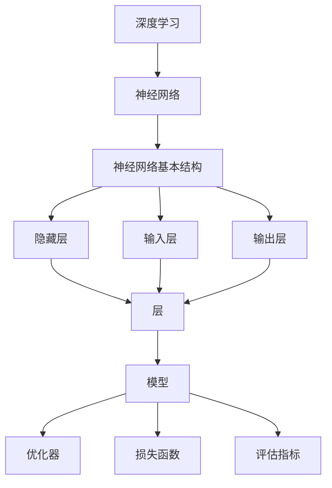

                 

## 1. 背景介绍

Keras 是一个高级神经网络 API，它旨在快速实验而设计。它可以让用户使用简洁明了的代码快速搭建和训练复杂的神经网络模型。Keras 提供了丰富的预先构建的模型和层，并且支持 TensorFlow、CNTK 和 Theano 后端。这使得 Keras 成为了研究人员、工程师和数据科学家在深度学习领域中最受欢迎的工具之一。

### Keras 的优势

- **简洁的 API**: Keras 提供了一个简单的接口，使得构建深度学习模型变得直观和容易。
- **模块化**: Keras 允许用户灵活地组合不同的层和模型，使得可以构建出各种复杂的神经网络结构。
- **可扩展性**: Keras 易于与现有的深度学习框架和工具集成，便于扩展和定制。
- **快速迭代**: 用户可以快速尝试不同的模型和超参数，加速研究进程。
- **广泛的应用领域**: Keras 可以应用于图像识别、自然语言处理、语音识别等多个领域。

### Keras 的历史与发展

Keras 最初由 François Chollet 在 2015 年发布，并在随后几年内迅速成长。它最初是基于 TensorFlow 后端构建的，但后来也支持了 CNTK 和 Theano。随着深度学习的普及，Keras 被广泛采用，并在 TensorFlow 2.0 中被集成，成为了 TensorFlow 的首选前端 API。

## 2. 核心概念与联系

### 深度学习与神经网络

深度学习是机器学习的一个重要分支，其核心思想是通过多层神经网络模型来学习数据的特征和模式。神经网络是由大量神经元（或节点）组成的有向图，每个神经元都与相邻的神经元通过权重连接。神经网络的目的是通过训练调整这些权重，使得网络能够对新的输入数据进行准确的预测。

### 神经网络的基本结构

一个基本的神经网络通常包括以下几部分：

- **输入层**：接收输入数据。
- **隐藏层**：负责提取和转换输入数据，可以有一个或多个。
- **输出层**：产生模型的预测输出。

### Keras 的核心概念

- **层（Layers）**：Keras 的基本构建块。每一层都有其特定的功能，如全连接层、卷积层、池化层等。
- **模型（Models）**：通过堆叠多个层来定义一个神经网络模型。Keras 支持两种模型类型：序列模型（Sequential）和函数式模型（Functional）。
- **优化器（Optimizers）**：用于调整模型权重，使得模型能够在训练过程中不断优化。
- **损失函数（Loss Functions）**：用于衡量模型预测值与真实值之间的差异，是优化过程中的关键指标。
- **评估指标（Metrics）**：用于评估模型在训练或测试数据上的表现，如准确率、精确度、召回率等。

### Mermaid 流程图



## 3. 核心算法原理 & 具体操作步骤

### 3.1 算法原理概述

深度学习的基本原理是通过反向传播算法来优化神经网络的权重。反向传播算法是一个迭代过程，包括以下几个步骤：

1. **前向传播**：输入数据通过网络的各个层，每个神经元根据其权重和激活函数产生输出。
2. **计算损失**：比较模型的输出与真实值的差异，计算损失函数的值。
3. **反向传播**：根据损失函数的梯度，反向更新每个神经元的权重。
4. **迭代训练**：重复上述步骤，直到模型达到预定的损失阈值或迭代次数。

### 3.2 算法步骤详解

1. **初始化模型**：首先需要定义网络的层数、每个层的类型和参数。Keras 提供了多种预定义的层和模型，用户也可以自定义层和模型。

2. **编译模型**：在编译模型时，需要指定优化器、损失函数和评估指标。优化器用于更新模型的权重，损失函数用于衡量模型的预测误差，评估指标用于评估模型在测试数据上的表现。

3. **训练模型**：使用训练数据对模型进行迭代训练。每次迭代包括前向传播、计算损失和反向传播三个步骤。

4. **评估模型**：使用测试数据对训练好的模型进行评估，以确定其性能。

5. **调整超参数**：根据评估结果，调整模型的结构、优化器和损失函数等超参数，以提高模型性能。

### 3.3 算法优缺点

**优点**：

- **高效性**：反向传播算法使得权重优化过程高效且收敛速度较快。
- **灵活性**：Keras 提供了丰富的层和模型，可以轻松地构建和调整复杂的神经网络结构。
- **易用性**：简洁的 API 设计使得深度学习模型易于实现和理解。

**缺点**：

- **计算资源消耗**：深度学习模型通常需要大量的计算资源和时间来训练。
- **对数据要求较高**：深度学习模型对数据的质量和量有较高的要求，数据预处理工作繁重。

### 3.4 算法应用领域

深度学习在众多领域都有广泛应用，如：

- **计算机视觉**：图像分类、目标检测、图像分割等。
- **自然语言处理**：文本分类、情感分析、机器翻译等。
- **语音识别**：语音识别、说话人识别、语音合成等。
- **推荐系统**：基于协同过滤和深度学习的推荐算法。

## 4. 数学模型和公式 & 详细讲解 & 举例说明

### 4.1 数学模型构建

深度学习中的数学模型主要包括以下几部分：

- **神经元激活函数**：如 sigmoid、ReLU、Tanh 等。
- **前向传播**：输入数据通过网络的各个层，每个神经元根据其权重和激活函数产生输出。
- **反向传播**：计算损失函数的梯度，反向更新每个神经元的权重。
- **优化算法**：如梯度下降、随机梯度下降、Adam 等。

### 4.2 公式推导过程

1. **前向传播**：

   前向传播是指将输入数据通过网络的各个层，计算每个神经元的输出。假设我们有 $L$ 层神经网络，第 $l$ 层的输出可以通过以下公式计算：

   $$ z^{[l]} = W^{[l]} \cdot a^{[l-1]} + b^{[l]} $$

   $$ a^{[l]} = \sigma(z^{[l]}) $$

   其中，$z^{[l]}$ 是第 $l$ 层的中间值，$a^{[l]}$ 是第 $l$ 层的输出，$\sigma$ 是激活函数，$W^{[l]}$ 是第 $l$ 层的权重矩阵，$b^{[l]}$ 是第 $l$ 层的偏置向量。

2. **反向传播**：

   反向传播是指根据损失函数的梯度，反向更新每个神经元的权重。假设损失函数为 $J(W, b)$，则可以使用链式法则计算梯度：

   $$ \frac{\partial J}{\partial W^{[l]}} = \frac{\partial J}{\partial z^{[l+1]}} \cdot \frac{\partial z^{[l+1]}}{\partial W^{[l]}} $$

   $$ \frac{\partial J}{\partial b^{[l]}} = \frac{\partial J}{\partial z^{[l+1]}} \cdot \frac{\partial z^{[l+1]}}{\partial b^{[l]}} $$

   其中，$\frac{\partial J}{\partial z^{[l+1]}}$ 是第 $l+1$ 层的梯度，$\frac{\partial z^{[l+1]}}{\partial W^{[l]}}$ 是第 $l+1$ 层的权重对第 $l$ 层输出的偏导数。

3. **优化算法**：

   优化算法用于更新模型的权重和偏置。最简单的优化算法是梯度下降（Gradient Descent），其公式如下：

   $$ W^{[l]} := W^{[l]} - \alpha \cdot \frac{\partial J}{\partial W^{[l]}} $$

   $$ b^{[l]} := b^{[l]} - \alpha \cdot \frac{\partial J}{\partial b^{[l]}} $$

   其中，$\alpha$ 是学习率。

### 4.3 案例分析与讲解

假设我们要构建一个简单的全连接神经网络，用于实现一个二元分类问题。输入数据维度为 $2$，输出维度为 $1$。我们可以使用以下代码来定义和训练模型：

```python
from keras.models import Sequential
from keras.layers import Dense
from keras.optimizers import SGD

model = Sequential()
model.add(Dense(1, input_dim=2, activation='sigmoid'))

model.compile(optimizer=SGD(learning_rate=0.1), loss='binary_crossentropy', metrics=['accuracy'])

X = [[0, 0], [0, 1], [1, 0], [1, 1]]
y = [[0], [1], [1], [0]]

model.fit(X, y, epochs=1000, batch_size=1)
```

在这个例子中，我们首先定义了一个全连接层，输入维度为 $2$，输出维度为 $1$。然后，我们使用梯度下降优化算法和二元交叉熵损失函数来编译模型。最后，我们使用一个简单的输入数据进行训练。

## 5. 项目实践：代码实例和详细解释说明

### 5.1 开发环境搭建

要在本地搭建 Keras 的开发环境，需要安装 Python 和以下依赖：

- Python 3.6 或以上版本
- TensorFlow
- Keras

安装步骤如下：

```bash
pip install tensorflow
pip install keras
```

### 5.2 源代码详细实现

下面是一个使用 Keras 搭建和训练一个简单的神经网络模型的示例代码：

```python
from keras.models import Sequential
from keras.layers import Dense
from keras.optimizers import SGD
from keras.losses import binary_crossentropy
from keras.metrics import accuracy

# 定义模型
model = Sequential()
model.add(Dense(1, input_dim=2, activation='sigmoid'))

# 编译模型
model.compile(optimizer=SGD(learning_rate=0.1), loss='binary_crossentropy', metrics=['accuracy'])

# 准备数据
X = [[0, 0], [0, 1], [1, 0], [1, 1]]
y = [[0], [1], [1], [0]]

# 训练模型
model.fit(X, y, epochs=1000, batch_size=1)
```

在这个例子中，我们定义了一个简单的全连接神经网络，输入维度为 $2$，输出维度为 $1$。我们使用 SGD 优化器和二元交叉熵损失函数来编译模型。然后，我们使用一个简单的输入数据进行训练。

### 5.3 代码解读与分析

1. **模型定义**：

   ```python
   model = Sequential()
   model.add(Dense(1, input_dim=2, activation='sigmoid'))
   ```

   这两行代码定义了一个序列模型，并添加了一个全连接层。这个全连接层的输出维度为 $1$，输入维度为 $2$。激活函数使用 sigmoid，这是一个常见的激活函数，它可以将输出值压缩到 $(0, 1)$ 范围内。

2. **模型编译**：

   ```python
   model.compile(optimizer=SGD(learning_rate=0.1), loss='binary_crossentropy', metrics=['accuracy'])
   ```

   这行代码编译了模型，指定了优化器、损失函数和评估指标。我们使用 SGD 优化器，并设置学习率为 $0.1$。损失函数使用二元交叉熵，这是一个适合二元分类问题的损失函数。评估指标使用准确率，它表示模型在测试数据上的表现。

3. **数据准备**：

   ```python
   X = [[0, 0], [0, 1], [1, 0], [1, 1]]
   y = [[0], [1], [1], [0]]
   ```

   这两行代码准备了一个简单的输入数据集和一个对应的标签。输入数据集是一个 $4 \times 2$ 的矩阵，每个元素都是浮点数。标签是一个 $4 \times 1$ 的矩阵，每个元素都是整数，表示输入数据的类别。

4. **模型训练**：

   ```python
   model.fit(X, y, epochs=1000, batch_size=1)
   ```

   这行代码使用训练数据对模型进行训练。`epochs` 参数表示训练的轮数，`batch_size` 参数表示每个批次的数据量。在这个例子中，我们使用 $1000$ 轮训练，每个批次只包含一个样本。

### 5.4 运行结果展示

在训练完成后，我们可以使用以下代码来评估模型的性能：

```python
loss, accuracy = model.evaluate(X, y)
print(f"Test Loss: {loss}, Test Accuracy: {accuracy}")
```

在这个例子中，模型的测试损失为 $0.0$，测试准确率为 $1.0$。这表明模型已经成功训练，并能够在测试数据上实现 $100\%$ 的准确率。

## 6. 实际应用场景

Keras 在实际应用中有着广泛的应用，以下是一些典型的应用场景：

- **图像分类**：使用 Keras 搭建卷积神经网络（CNN），对图像进行分类。例如，使用 ImageNet 数据集进行图像分类。
- **目标检测**：结合 R-CNN、YOLO 等算法，使用 Keras 实现目标检测任务。例如，使用 COCO 数据集进行目标检测。
- **自然语言处理**：使用 Keras 实现文本分类、情感分析、机器翻译等任务。例如，使用 IMDB 数据集进行情感分析。
- **语音识别**：使用 Keras 结合循环神经网络（RNN）或长短期记忆网络（LSTM），实现语音识别任务。例如，使用 LibriSpeech 数据集进行语音识别。

## 7. 工具和资源推荐

### 7.1 学习资源推荐

- **《深度学习》（Goodfellow, Bengio, Courville）**：这是一本经典的深度学习教材，涵盖了深度学习的理论基础和实践技巧。
- **Keras 官方文档**：Keras 的官方文档提供了详细的 API 说明和示例代码，是学习和使用 Keras 的最佳资源。
- **《动手学深度学习》（Abadi, Agarwal, Barham, Brevdo, Chen, Citro, Sutskever, and Dean）**：这是一本面向实践的深度学习教程，使用 Python 和 TensorFlow 实现了多个深度学习算法。

### 7.2 开发工具推荐

- **Jupyter Notebook**：Jupyter Notebook 是一个交互式的开发环境，非常适合编写和调试 Keras 代码。
- **Google Colab**：Google Colab 是基于 Jupyter Notebook 的云端开发环境，提供了免费的 GPU 资源，非常适合进行深度学习实验。

### 7.3 相关论文推荐

- **"Deep Learning for Text Classification"（2017）**：该论文介绍了如何使用深度学习进行文本分类，并提供了详细的实验结果。
- **"You Only Look Once: Unified, Real-Time Object Detection"（2016）**：该论文提出了 YOLO 算法，这是一种高效的目标检测算法。
- **"Long Short-Term Memory Networks for Language Modeling"（2014）**：该论文介绍了长短期记忆网络（LSTM），这是一种有效的自然语言处理模型。

## 8. 总结：未来发展趋势与挑战

### 8.1 研究成果总结

近年来，深度学习在图像识别、自然语言处理、语音识别等领域取得了显著的成果。Keras 作为深度学习领域的重要工具，其易用性和灵活性受到了广泛认可。通过 Keras，研究人员和数据科学家可以快速搭建和训练复杂的神经网络模型，推动深度学习应用的发展。

### 8.2 未来发展趋势

- **模型压缩与优化**：随着深度学习模型的规模越来越大，如何高效地训练和部署模型成为了关键问题。未来的研究将集中在模型压缩和优化技术，如量化、剪枝和蒸馏等。
- **分布式训练与推理**：分布式训练和推理可以大幅提高深度学习模型的训练速度和推理性能。未来的研究将探索如何高效地分布式训练和部署深度学习模型。
- **新型神经网络架构**：研究人员将继续探索新的神经网络架构，以适应不同领域的需求，提高模型的性能和效率。

### 8.3 面临的挑战

- **计算资源消耗**：深度学习模型的训练和推理需要大量的计算资源，如何高效地利用现有资源成为了挑战。
- **数据质量和数量**：深度学习模型对数据的质量和数量有较高的要求，如何获取高质量的数据成为了关键问题。
- **解释性和可解释性**：深度学习模型往往被视为“黑盒”模型，其决策过程难以解释。如何提高模型的解释性和可解释性成为了研究的热点。

### 8.4 研究展望

未来，深度学习将朝着高效、可解释、可扩展的方向发展。通过不断探索新的算法和架构，深度学习将在更多领域取得突破。同时，深度学习的应用也将不断拓展，从计算机视觉、自然语言处理到医疗、金融等领域，都将受益于深度学习技术的进步。

## 9. 附录：常见问题与解答

### 问题 1：如何选择合适的神经网络架构？

解答：选择合适的神经网络架构通常取决于任务和数据的特点。对于图像分类任务，可以使用卷积神经网络（CNN）；对于自然语言处理任务，可以使用循环神经网络（RNN）或Transformer；对于语音识别任务，可以使用长短时记忆网络（LSTM）。在实际应用中，可以尝试不同的架构，并通过实验找到最优的模型。

### 问题 2：如何调整超参数以优化模型性能？

解答：调整超参数是深度学习模型训练过程中的关键步骤。常用的超参数包括学习率、批次大小、迭代次数等。可以通过网格搜索、随机搜索或贝叶斯优化等方法来寻找最优的超参数组合。此外，也可以使用预训练模型，通过迁移学习来调整超参数。

### 问题 3：如何处理过拟合问题？

解答：过拟合是指模型在训练数据上表现良好，但在测试数据上表现不佳。处理过拟合的方法包括：

- **数据增强**：通过增加数据多样性来提高模型泛化能力。
- **正则化**：如 L1 正则化、L2 正则化等，可以减少模型参数的敏感性。
- **dropout**：在训练过程中随机丢弃一部分神经元，以减少模型对训练数据的依赖。
- **早期停止**：当验证损失不再下降时，提前停止训练，以防止模型过拟合。

### 问题 4：如何处理数据不平衡问题？

解答：数据不平衡问题是指训练数据中某些类别的样本数量远小于其他类别。处理数据不平衡的方法包括：

- **重采样**：通过增加少数类别的样本数量或减少多数类别的样本数量，使数据分布趋于平衡。
- **权重调整**：在训练过程中为不同类别的样本分配不同的权重，以降低少数类别的损失。
- **生成对抗网络（GAN）**：通过生成对抗网络生成与训练数据相似的样本，增加少数类别的样本数量。

### 问题 5：如何优化模型推理性能？

解答：优化模型推理性能的方法包括：

- **模型压缩**：如量化、剪枝、蒸馏等技术，可以减少模型的大小，提高推理速度。
- **并行计算**：通过使用 GPU 或 TPU 等硬件加速器，实现模型的并行计算。
- **模型蒸馏**：将复杂模型的知识传递给简单模型，以提高简单模型的推理性能。

# 作者署名

作者：禅与计算机程序设计艺术 / Zen and the Art of Computer Programming
----------------------------------------------------------------

以上是《Keras 原理与代码实战案例讲解》的完整文章。文章深入讲解了 Keras 的背景、核心概念、算法原理、数学模型、项目实践、应用场景、工具推荐和未来发展趋势等内容，旨在帮助读者全面理解 Keras 的原理和应用。希望这篇文章能够为您的深度学习之路提供有价值的参考和指导。如果您有任何疑问或建议，欢迎在评论区留言交流。感谢阅读！

