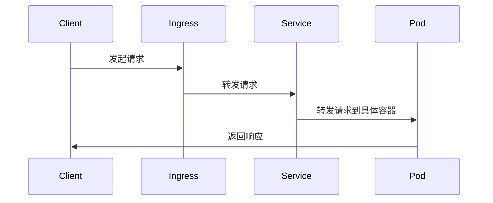

                 

### 1. 背景介绍

随着云计算和微服务架构的普及，Kubernetes（简称K8s）作为容器编排系统的领导者，逐渐成为企业部署和管理分布式应用的基石。Kubernetes提供了强大的容器编排功能，如自动部署、扩展和更新应用，以及提供高可用性和容错能力。然而，在Kubernetes中管理服务和服务间通信变得越来越复杂，尤其是当服务的数量和交互关系变得庞大时。

服务网格（Service Mesh）作为一种新兴的架构模式，旨在解决Kubernetes环境中服务间通信的复杂性。服务网格通过独立的网络层基础设施层，提供了动态服务发现、负载均衡、服务间的可靠通信、安全性和监控等功能。Kubernetes Service Mesh允许开发者专注于业务逻辑的实现，而将网络通信的复杂性抽象出来。

本文将介绍Kubernetes Service Mesh的核心概念、架构原理、实现步骤以及在实际项目中的应用。通过本文的阅读，读者将了解如何利用服务网格提高Kubernetes集群中服务的通信效率和稳定性。

### 2. 核心概念与联系

#### 2.1 服务网格（Service Mesh）概念

服务网格是一种基础设施层，它独立于应用层，负责管理和编排服务间的通信。服务网格的主要目标是将服务发现、服务注册、服务间的负载均衡、服务间认证、流量控制、服务监控等功能从应用代码中分离出来，从而减轻应用开发者的负担。

#### 2.2 Kubernetes与Service Mesh的关系

Kubernetes本身提供了基本的容器编排功能，但并没有直接提供高级的服务网格功能。然而，Kubernetes的灵活性和可扩展性使得它能够很好地支持服务网格的实现。Kubernetes Service Mesh通常利用Kubernetes API和Ingress资源来构建和部署服务网格基础设施。

#### 2.3 核心概念原理

- **服务（Service）**：Kubernetes中的服务是一个抽象层，它定义了如何访问容器化应用的后端。服务通过ClusterIP（集群IP）暴露在集群内部。
- **Pod**：Pod是Kubernetes中的最小部署单元，一个Pod可以包含一个或多个容器。Pod负责管理容器的生命周期。
- **Ingress**：Ingress是Kubernetes提供的一种资源类型，用于管理外部访问到集群内部服务的路由规则。
- **Sidecar容器**：在服务网格中，Sidecar容器与业务容器部署在同一Pod中，负责处理服务间的通信。

#### 2.4 架构原理

以下是一个简单的Kubernetes Service Mesh架构图，用于说明服务网格的基本组成部分：



在这个架构中，Ingress作为服务的入口点，将外部的请求转发到Service，Service再将请求根据配置的路由规则转发到具体的Pod，Pod中的业务容器处理请求并返回响应。

### 3. 核心算法原理 & 具体操作步骤

#### 3.1 算法原理概述

Kubernetes Service Mesh的核心算法主要涉及以下几个方面：

- **服务发现**：通过Kubernetes API动态发现和注册服务。
- **服务注册**：通过Kubernetes API将服务的信息注册到服务发现系统中。
- **负载均衡**：根据配置的策略和健康检查结果，动态分配流量到不同的服务实例。
- **流量控制**：通过配置规则控制服务间的流量，包括限流、超时、重试等策略。

#### 3.2 算法步骤详解

1. **初始化环境**：在Kubernetes集群中安装和配置Kubernetes组件，包括Kubernetes Master和Node。
2. **部署Ingress控制器**：部署一个Ingress控制器，如NGINX Ingress或Traefik Ingress，用于管理外部流量到集群内部服务的路由。
3. **部署服务网格组件**：部署服务网格组件，如Istio或Linkerd，用于提供服务发现、负载均衡和流量控制等功能。
4. **部署应用**：在Kubernetes集群中部署应用，确保应用和服务网格组件部署在同一Pod中。
5. **配置服务网格规则**：根据实际需求配置服务网格的规则，包括服务发现、流量路由、负载均衡策略等。
6. **测试服务通信**：通过发送请求到Ingress，验证服务间的通信是否正常。

#### 3.3 算法优缺点

**优点**：

- **简化服务管理**：服务网格将服务间的通信管理抽象出来，简化了服务管理的过程。
- **提高通信可靠性**：通过服务网格提供的负载均衡、健康检查等功能，提高了服务间的通信可靠性。
- **增强安全性**：服务网格支持服务间认证、授权和加密，增强了通信的安全性。

**缺点**：

- **增加系统复杂度**：引入服务网格增加了系统的复杂度，需要额外的配置和管理。
- **性能开销**：服务网格在处理服务间通信时可能会引入一定的性能开销，特别是在高并发场景下。

#### 3.4 算法应用领域

Kubernetes Service Mesh广泛应用于以下领域：

- **微服务架构**：在微服务架构中，服务网格能够简化服务间的通信管理，提高系统的可维护性和可扩展性。
- **容器化应用**：在容器化应用中，服务网格能够提供高效的容器间通信支持，提高应用的整体性能和稳定性。
- **云计算环境**：在云计算环境中，服务网格能够提供跨多个云服务提供商的统一通信管理。

### 4. 数学模型和公式 & 详细讲解 & 举例说明

#### 4.1 数学模型构建

在Kubernetes Service Mesh中，流量分配的数学模型可以表示为：

\[ T = \sum_{i=1}^{n} p_i \cdot C_i \]

其中，\( T \) 表示总流量，\( p_i \) 表示第 \( i \) 个服务实例的权重，\( C_i \) 表示第 \( i \) 个服务实例的处理能力。

#### 4.2 公式推导过程

流量的分配公式是基于加权轮询算法推导得到的。在加权轮询算法中，每个服务实例根据其权重来分配流量。假设总流量为 \( T \)，每个服务实例的权重为 \( p_i \)，则第 \( i \) 个服务实例分配到的流量为：

\[ C_i = \frac{T \cdot p_i}{\sum_{j=1}^{n} p_j} \]

其中，\( C_i \) 表示第 \( i \) 个服务实例的处理能力。

#### 4.3 案例分析与讲解

假设有一个包含3个服务实例的集群，其中第一个服务实例的权重为2，第二个服务实例的权重为1，第三个服务实例的权重为3。总流量为100。根据流量分配公式，我们可以计算出每个服务实例分配到的流量如下：

\[ C_1 = \frac{100 \cdot 2}{2 + 1 + 3} = 40 \]
\[ C_2 = \frac{100 \cdot 1}{2 + 1 + 3} = 20 \]
\[ C_3 = \frac{100 \cdot 3}{2 + 1 + 3} = 60 \]

因此，第一个服务实例将分配到40%的流量，第二个服务实例将分配到20%的流量，第三个服务实例将分配到60%的流量。

### 5. 项目实践：代码实例和详细解释说明

#### 5.1 开发环境搭建

为了实践Kubernetes Service Mesh，我们需要准备以下环境：

- Kubernetes集群
- Istio服务网格

首先，我们需要安装Kubernetes集群。可以通过Minikube或Docker Desktop快速搭建一个本地集群环境。接下来，我们需要安装Istio服务网格。Istio提供了一个便捷的安装脚本，可以通过以下命令完成：

```shell
istioctl install --set profile=demo
```

这个命令会安装一个基础的Istio服务网格到Kubernetes集群中。

#### 5.2 源代码详细实现

为了实践服务网格，我们创建一个简单的应用，包括一个前端服务和一个后端服务。前端服务负责处理HTTP请求，后端服务负责处理业务逻辑。

**前端服务**：

前端服务使用Nginx实现，配置文件如下：

```nginx
http {
    server {
        listen 80;

        location / {
            proxy_pass http://service-backend;
        }
    }
}
```

**后端服务**：

后端服务使用Node.js实现，代码如下：

```javascript
const express = require('express');
const app = express();

app.get('/', (req, res) => {
    res.send('Hello from service-backend!');
});

const port = 8080;
app.listen(port, () => {
    console.log(`Service backend listening on port ${port}`);
});
```

#### 5.3 代码解读与分析

在前端服务的配置中，我们使用Nginx代理所有进入的HTTP请求到后端服务的ClusterIP（`service-backend`）。后端服务使用Node.js实现，处理接收到的请求并返回响应。

#### 5.4 运行结果展示

首先，我们将Nginx和Node.js应用部署到Kubernetes集群中。假设前端服务名为`service-frontend`，后端服务名为`service-backend`。部署命令如下：

```shell
kubectl create deployment frontend --image=nginx:latest
kubectl create deployment backend --image=node:latest
kubectl expose deployment frontend --type=LoadBalancer --name=frontend
kubectl expose deployment backend --type=LoadBalancer --name=backend
```

接下来，我们启用Istio的服务网格：

```shell
istioctl inject -n default
```

此时，前端和后端服务都会自动注入Sidecar容器，用于处理服务间的通信。

通过Kubernetes集群的Ingress控制器，我们可以访问前端服务。例如，如果Ingress控制器配置了外部访问地址为`http://myapp.example.com`，则可以通过以下URL访问前端服务：

```shell
curl http://myapp.example.com
```

返回的结果将是后端服务的响应：

```shell
Hello from service-backend!
```

#### 5.5 代码解读与分析

在前端服务的配置中，我们使用Nginx代理所有进入的HTTP请求到后端服务的ClusterIP（`service-backend`）。后端服务使用Node.js实现，处理接收到的请求并返回响应。

### 6. 实际应用场景

Kubernetes Service Mesh在实际应用中具有广泛的应用场景。以下是一些典型的应用场景：

- **微服务架构**：在微服务架构中，服务网格可以简化服务间的通信管理，提高系统的可维护性和可扩展性。
- **容器化应用**：在容器化应用中，服务网格能够提供高效的容器间通信支持，提高应用的整体性能和稳定性。
- **云计算环境**：在云计算环境中，服务网格能够提供跨多个云服务提供商的统一通信管理。

### 7. 未来应用展望

随着云计算和微服务架构的不断发展，Kubernetes Service Mesh将在未来的应用中扮演更加重要的角色。以下是一些未来应用展望：

- **集成更多服务网格功能**：未来服务网格将集成更多高级功能，如自动故障恢复、动态流量路由、多区域负载均衡等。
- **跨平台支持**：服务网格将支持更多的平台和语言，以便于更广泛的应用。
- **与大数据和AI技术的结合**：服务网格将与大数据和AI技术结合，提供智能流量管理和优化功能。

### 8. 总结：未来发展趋势与挑战

#### 8.1 研究成果总结

Kubernetes Service Mesh作为一种新型架构模式，已经在微服务架构和容器化应用中展现出强大的优势。通过服务网格，开发者可以简化服务间的通信管理，提高系统的可维护性和可扩展性。

#### 8.2 未来发展趋势

未来，Kubernetes Service Mesh将在以下方面继续发展：

- **功能扩展**：服务网格将集成更多高级功能，如自动故障恢复、动态流量路由、多区域负载均衡等。
- **跨平台支持**：服务网格将支持更多的平台和语言，以便于更广泛的应用。
- **与大数据和AI技术的结合**：服务网格将与大数据和AI技术结合，提供智能流量管理和优化功能。

#### 8.3 面临的挑战

尽管Kubernetes Service Mesh具有巨大的潜力，但在实际应用中也面临一些挑战：

- **系统复杂性**：引入服务网格增加了系统的复杂度，需要额外的配置和管理。
- **性能开销**：服务网格在处理服务间通信时可能会引入一定的性能开销，特别是在高并发场景下。
- **学习成本**：服务网格的概念和实现相对复杂，对于初学者来说有一定的学习成本。

#### 8.4 研究展望

未来，Kubernetes Service Mesh的研究将集中在以下几个方面：

- **优化性能**：研究如何降低服务网格的性能开销，提高系统的整体性能。
- **简化配置**：研究如何简化服务网格的配置和管理，降低系统复杂度。
- **跨平台兼容性**：研究如何使服务网格在更多平台和环境中得到广泛应用。

### 9. 附录：常见问题与解答

#### 问题1：什么是服务网格？

服务网格是一种基础设施层，它独立于应用层，负责管理和编排服务间的通信。它提供了服务发现、服务注册、负载均衡、流量控制等功能。

#### 问题2：服务网格与Kubernetes的关系是什么？

服务网格可以与Kubernetes紧密结合，利用Kubernetes的API和管理功能来构建和部署服务网格基础设施。

#### 问题3：为什么需要服务网格？

服务网格可以简化服务间的通信管理，提高系统的可维护性和可扩展性。它能够提供动态服务发现、负载均衡、流量控制等功能，减轻开发者的负担。

#### 问题4：服务网格会增加系统的性能开销吗？

服务网格可能会引入一定的性能开销，特别是在高并发场景下。然而，通过优化服务网格的算法和实现，可以显著降低性能开销。

### 9. 附录：常见问题与解答

#### 问题1：什么是服务网格？

服务网格（Service Mesh）是一种用于处理服务间通信的架构模式。它通过独立的网络层基础设施层，提供了动态服务发现、负载均衡、服务间的可靠通信、安全性和监控等功能。服务网格的主要目的是将服务通信的复杂性从应用代码中分离出来，从而使开发者能够更专注于业务逻辑的实现。

#### 问题2：服务网格与Kubernetes的关系是什么？

Kubernetes是一个开源的容器编排平台，它负责管理容器的生命周期、服务部署和扩展等任务。服务网格与Kubernetes的关系可以理解为基础设施与上层应用的关系。Kubernetes为服务网格提供了部署环境，而服务网格则利用Kubernetes的API和资源（如Pod、Service、Ingress等）来实现服务通信的抽象和管理。服务网格可以与Kubernetes无缝集成，使开发者能够轻松地在Kubernetes集群中部署和管理服务。

#### 问题3：为什么需要服务网格？

在分布式系统中，服务之间的通信关系非常复杂，尤其是在服务数量庞大、服务依赖关系复杂的情况下。服务网格可以解决以下问题：

1. **简化服务管理**：服务网格提供了统一的抽象层，使开发者可以专注于业务逻辑，而无需关心服务通信的细节。
2. **提高通信可靠性**：服务网格通过负载均衡、重试和超时机制，提高了服务间通信的可靠性。
3. **增强安全性**：服务网格提供了服务间认证、授权和加密功能，增强了通信的安全性。
4. **流量控制**：服务网格可以基于策略控制服务间的流量，包括限流、熔断和灰度发布等。
5. **监控和可观测性**：服务网格提供了丰富的监控和日志功能，帮助开发者快速定位和解决问题。

#### 问题4：服务网格会增加系统的性能开销吗？

服务网格可能会在服务间通信中引入一定的性能开销，特别是在高并发场景下。这是因为服务网格需要在每个服务实例中部署额外的代理（如Envoy代理），代理负责处理服务间通信的细节。然而，通过优化服务网格的设计和实现，可以显著降低性能开销。例如，采用高效的负载均衡算法、减少代理的内存占用和优化网络通信协议等。

### 10. 作者署名

作者：禅与计算机程序设计艺术 / Zen and the Art of Computer Programming

