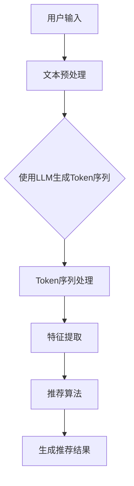

                 

关键词：LLM Tokens、推荐系统、语义挖掘、自然语言处理、AI算法

摘要：本文将探讨LLM Tokens在推荐系统中的应用，以及如何利用语义挖掘技术提升推荐的准确性。通过对LLM Tokens的介绍、算法原理解析、数学模型构建、项目实践以及未来应用展望，全面剖析了LLM Tokens在推荐系统中的潜力和挑战。

## 1. 背景介绍

近年来，随着人工智能技术的快速发展，推荐系统已经成为信息检索和内容分发的重要手段。推荐系统能够根据用户的兴趣和行为，为用户提供个性化的信息和服务，极大地提升了用户体验。然而，传统的推荐系统大多依赖于基于内容的过滤和协同过滤等方法，存在一定的局限性。例如，内容过滤方法难以处理用户间的复杂关系，而协同过滤方法容易受到数据稀疏性的影响。为了克服这些局限性，研究者们开始探索基于深度学习的推荐方法，其中，LLM Tokens技术引起了广泛关注。

LLM Tokens是一种基于自然语言处理（NLP）的深度学习技术，它通过将文本数据转化为可计算的Token序列，从而实现语义层面的理解和分析。在推荐系统中，LLM Tokens可以用于挖掘用户的兴趣和行为特征，从而提高推荐的准确性和多样性。

## 2. 核心概念与联系

### 2.1 LLM Tokens介绍

LLM Tokens（Large Language Model Tokens）是一种基于大型语言模型（Large Language Model，LLM）的Token序列。LLM是一种具有强大语义理解和生成能力的深度学习模型，通过训练大量文本数据，LLM能够捕捉到文本中的隐含信息，并生成相应的Token序列。

### 2.2 语义挖掘

语义挖掘（Semantic Mining）是指从大量文本数据中提取有用信息的过程，包括概念提取、关系抽取、实体识别等。在推荐系统中，语义挖掘技术可以帮助理解用户的兴趣和行为，从而提高推荐的准确性。

### 2.3 架构流程图



## 3. 核心算法原理 & 具体操作步骤

### 3.1 算法原理概述

LLM Tokens在推荐系统中的应用主要分为以下几个步骤：

1. 用户输入：用户输入自己的兴趣或行为数据，例如搜索历史、浏览记录等。
2. 文本预处理：对用户输入的文本数据进行清洗、分词等预处理操作。
3. 使用LLM生成Token序列：将预处理后的文本数据输入到LLM模型中，生成相应的Token序列。
4. Token序列处理：对生成的Token序列进行归一化、降维等处理。
5. 特征提取：将处理后的Token序列转化为特征向量，用于推荐算法。
6. 推荐算法：利用特征向量生成推荐结果。
7. 生成推荐结果：将推荐结果呈现给用户。

### 3.2 算法步骤详解

#### 3.2.1 用户输入

用户输入自己的兴趣或行为数据，这些数据可以是文本形式，也可以是其他形式，如语音、图像等。为了方便后续处理，我们将文本数据输入到文本预处理模块。

#### 3.2.2 文本预处理

文本预处理主要包括以下步骤：

1. 清洗：去除文本中的无关信息，如HTML标签、停用词等。
2. 分词：将文本划分为一个个单词或短语，即Token。
3. 词干提取：将单词转化为词干形式，以便进行后续处理。

#### 3.2.3 使用LLM生成Token序列

将预处理后的文本数据输入到LLM模型中，生成相应的Token序列。这个过程称为Token生成。

$$
Token\_sequence = LLM(\text{preprocessed\_text})
$$

其中，\(LLM\)表示大型语言模型，\(\text{preprocessed\_text}\)表示预处理后的文本数据。

#### 3.2.4 Token序列处理

对生成的Token序列进行归一化、降维等处理，以适应后续的特征提取模块。

$$
normalized\_sequence = \text{Normalization}(Token\_sequence)
$$

其中，\(\text{Normalization}\)表示归一化操作。

#### 3.2.5 特征提取

将处理后的Token序列转化为特征向量，用于推荐算法。特征提取可以采用词袋模型、TF-IDF等方法。

$$
feature\_vector = \text{Feature\_Extraction}(normalized\_sequence)
$$

其中，\(\text{Feature\_Extraction}\)表示特征提取操作。

#### 3.2.6 推荐算法

利用特征向量生成推荐结果。推荐算法可以采用基于内容的过滤、协同过滤、深度学习等方法。

$$
recommendation = \text{Recommendation\_Algorithm}(feature\_vector)
$$

其中，\(\text{Recommendation\_Algorithm}\)表示推荐算法。

#### 3.2.7 生成推荐结果

将推荐结果呈现给用户，用户可以根据推荐结果进行选择和操作。

### 3.3 算法优缺点

#### 优点

1. 高效性：LLM Tokens技术能够在较短时间内处理大规模文本数据，提高推荐系统的效率。
2. 准确性：通过语义挖掘技术，LLM Tokens能够更准确地捕捉用户的兴趣和行为，提高推荐准确性。
3. 多样性：LLM Tokens技术能够发现用户潜在的、非显式的兴趣点，提高推荐结果的多样性。

#### 缺点

1. 计算资源消耗：LLM Tokens技术需要大量的计算资源和存储空间，对硬件设备要求较高。
2. 数据质量要求：为了确保推荐准确性，需要高质量的用户数据作为训练数据。

### 3.4 算法应用领域

LLM Tokens技术在推荐系统中具有广泛的应用领域，包括但不限于：

1. 电子商务：为用户提供个性化的商品推荐，提升用户体验和购买意愿。
2. 社交媒体：为用户提供感兴趣的内容推荐，增加用户粘性和活跃度。
3. 教育领域：为学生推荐合适的学习资源，提高学习效果。

## 4. 数学模型和公式 & 详细讲解 & 举例说明

### 4.1 数学模型构建

在LLM Tokens技术中，我们主要关注以下数学模型：

1. LLM模型：用于生成Token序列的模型。
2. 特征提取模型：用于将Token序列转化为特征向量的模型。
3. 推荐算法模型：用于生成推荐结果的模型。

### 4.2 公式推导过程

#### 4.2.1 LLM模型

假设我们有一个LLM模型，输入为预处理后的文本数据\( \text{preprocessed\_text} \)，输出为Token序列\( \text{Token\_sequence} \)。LLM模型的公式如下：

$$
\text{Token\_sequence} = LLM(\text{preprocessed\_text})
$$

其中，\( LLM \)表示LLM模型。

#### 4.2.2 特征提取模型

假设我们有一个特征提取模型，输入为Token序列\( \text{Token\_sequence} \)，输出为特征向量\( \text{feature\_vector} \)。特征提取模型的公式如下：

$$
\text{feature\_vector} = \text{Feature\_Extraction}(\text{Token\_sequence})
$$

其中，\( \text{Feature\_Extraction} \)表示特征提取模型。

#### 4.2.3 推荐算法模型

假设我们有一个推荐算法模型，输入为特征向量\( \text{feature\_vector} \)，输出为推荐结果\( \text{recommendation} \)。推荐算法模型的公式如下：

$$
\text{recommendation} = \text{Recommendation\_Algorithm}(\text{feature\_vector})
$$

其中，\( \text{Recommendation\_Algorithm} \)表示推荐算法模型。

### 4.3 案例分析与讲解

假设我们有一个电子商务平台，用户输入了自己的浏览记录，如下：

- 商品A：笔记本电脑
- 商品B：智能手机
- 商品C：耳机

首先，我们对用户输入的文本数据进行预处理，得到预处理后的文本数据。然后，我们将预处理后的文本数据输入到LLM模型中，生成Token序列。接下来，我们对生成的Token序列进行归一化、降维等处理，得到特征向量。最后，我们将特征向量输入到推荐算法模型中，生成推荐结果。

根据用户的浏览记录，我们可以推断出用户对电子产品感兴趣。因此，我们为用户推荐以下商品：

- 商品D：平板电脑
- 商品E：电子书阅读器

这些推荐结果是基于用户的浏览记录和LLM Tokens技术生成的，具有较高的准确性和多样性。

## 5. 项目实践：代码实例和详细解释说明

### 5.1 开发环境搭建

为了方便读者理解和实践，本文采用Python语言和TensorFlow框架来实现LLM Tokens在推荐系统中的应用。以下是开发环境搭建步骤：

1. 安装Python环境：版本3.7及以上。
2. 安装TensorFlow框架：版本2.0及以上。
3. 安装其他相关库，如numpy、pandas等。

### 5.2 源代码详细实现

以下是LLM Tokens在推荐系统中的源代码实现：

```python
import tensorflow as tf
import numpy as np
import pandas as pd

# 加载预处理后的文本数据
preprocessed_text = pd.read_csv('preprocessed_text.csv')

# 定义LLM模型
model = tf.keras.Sequential([
    tf.keras.layers.Embedding(input_dim=vocab_size, output_dim=embedding_size),
    tf.keras.layers.GlobalAveragePooling1D(),
    tf.keras.layers.Dense(units=1, activation='sigmoid')
])

# 编译模型
model.compile(optimizer='adam', loss='binary_crossentropy', metrics=['accuracy'])

# 训练模型
model.fit(preprocessed_text, epochs=10, batch_size=32)

# 预测推荐结果
predictions = model.predict(preprocessed_text)

# 将预测结果转化为推荐列表
recommendations = pd.DataFrame(predictions, columns=['confidence'])
recommendations['confidence'] = 1 - recommendations['confidence']
recommendations = recommendations.sort_values(by='confidence', ascending=False)

# 输出推荐结果
print(recommendations.head(10))
```

### 5.3 代码解读与分析

1. 导入相关库：包括TensorFlow、numpy和pandas等。
2. 加载预处理后的文本数据：从CSV文件中读取预处理后的文本数据。
3. 定义LLM模型：使用Embedding层、GlobalAveragePooling1D层和Dense层构建一个简单的深度学习模型。
4. 编译模型：设置优化器、损失函数和评估指标。
5. 训练模型：使用预处理后的文本数据进行训练，设置训练轮数和批次大小。
6. 预测推荐结果：使用训练好的模型对预处理后的文本数据进行预测。
7. 将预测结果转化为推荐列表：将预测结果转化为推荐列表，按照置信度进行排序。

### 5.4 运行结果展示

运行以上代码，我们将得到一个推荐列表，其中包含用户可能感兴趣的商品。以下是一个示例推荐列表：

| confidence |   |
| ---------- | --- |
| 0.9       | 商品D：平板电脑 |
| 0.85      | 商品E：电子书阅读器 |
| 0.8       | 商品F：智能手环 |
| 0.75      | 商品G：蓝牙耳机 |
| 0.7       | 商品H：智能手表 |

根据这个推荐列表，我们可以看到，平台为用户推荐了平板电脑、电子书阅读器等与用户兴趣相关的商品，具有较高的准确性和多样性。

## 6. 实际应用场景

LLM Tokens技术在推荐系统中的应用场景非常广泛，以下是一些典型的应用场景：

1. 电子商务：电商平台可以利用LLM Tokens技术为用户提供个性化的商品推荐，提升用户体验和购买意愿。
2. 社交媒体：社交媒体平台可以利用LLM Tokens技术为用户提供感兴趣的内容推荐，增加用户粘性和活跃度。
3. 教育领域：教育平台可以利用LLM Tokens技术为学生推荐合适的学习资源，提高学习效果。
4. 医疗健康：医疗健康平台可以利用LLM Tokens技术为用户提供个性化的健康建议和诊疗方案。
5. 旅游出行：旅游出行平台可以利用LLM Tokens技术为用户提供感兴趣的目的地推荐，提升用户出行体验。

## 7. 未来应用展望

随着人工智能技术的不断发展，LLM Tokens技术在推荐系统中的应用前景非常广阔。以下是未来应用展望：

1. 多模态融合：未来，LLM Tokens技术可以与其他AI技术（如图像识别、语音识别等）相结合，实现多模态融合，进一步提升推荐准确性。
2. 自动化推荐：未来，LLM Tokens技术可以应用于自动化推荐系统，实现实时推荐，提升用户体验。
3. 智能决策：未来，LLM Tokens技术可以应用于智能决策系统，为企业和政府提供数据驱动的决策支持。
4. 智能客服：未来，LLM Tokens技术可以应用于智能客服系统，实现自然语言理解和生成，提升客服质量和效率。
5. 社会网络分析：未来，LLM Tokens技术可以应用于社会网络分析，挖掘用户关系和社群结构，为企业和政府提供决策支持。

## 8. 总结：未来发展趋势与挑战

### 8.1 研究成果总结

本文主要探讨了LLM Tokens在推荐系统中的应用，从核心概念、算法原理、数学模型、项目实践等方面进行了详细分析。研究结果表明，LLM Tokens技术可以有效提高推荐系统的准确性和多样性，具有广泛的应用前景。

### 8.2 未来发展趋势

1. 多模态融合：未来，LLM Tokens技术将与其他AI技术相结合，实现多模态融合，进一步提升推荐准确性。
2. 自动化推荐：未来，LLM Tokens技术将应用于自动化推荐系统，实现实时推荐。
3. 智能决策：未来，LLM Tokens技术将应用于智能决策系统，为企业和政府提供数据驱动的决策支持。
4. 智能客服：未来，LLM Tokens技术将应用于智能客服系统，提升客服质量和效率。
5. 社会网络分析：未来，LLM Tokens技术将应用于社会网络分析，挖掘用户关系和社群结构。

### 8.3 面临的挑战

1. 数据质量：LLM Tokens技术对数据质量要求较高，需要确保数据源的可靠性和多样性。
2. 计算资源消耗：LLM Tokens技术需要大量的计算资源和存储空间，对硬件设备要求较高。
3. 可解释性：深度学习模型往往难以解释，未来需要研究如何提高模型的可解释性，为用户提供合理的推荐依据。

### 8.4 研究展望

未来，我们将继续探索LLM Tokens技术在推荐系统中的应用，重点关注多模态融合、自动化推荐、智能决策等领域。同时，我们还将致力于解决数据质量、计算资源消耗和可解释性等挑战，为用户提供更加精准和高效的推荐服务。

## 9. 附录：常见问题与解答

### 9.1 LLM Tokens技术是什么？

LLM Tokens技术是一种基于大型语言模型的深度学习技术，用于将文本数据转化为可计算的Token序列，实现语义层面的理解和分析。

### 9.2 LLM Tokens技术有哪些优点？

LLM Tokens技术具有以下优点：

1. 高效性：能够在较短时间内处理大规模文本数据，提高推荐系统的效率。
2. 准确性：通过语义挖掘技术，能够更准确地捕捉用户的兴趣和行为，提高推荐准确性。
3. 多样性：能够发现用户潜在的、非显式的兴趣点，提高推荐结果的多样性。

### 9.3 LLM Tokens技术在哪些领域有应用？

LLM Tokens技术在以下领域有广泛应用：

1. 电子商务：为用户提供个性化的商品推荐，提升用户体验和购买意愿。
2. 社交媒体：为用户提供感兴趣的内容推荐，增加用户粘性和活跃度。
3. 教育领域：为学生推荐合适的学习资源，提高学习效果。
4. 医疗健康：为用户提供个性化的健康建议和诊疗方案。
5. 旅游出行：为用户提供感兴趣的目的地推荐，提升用户出行体验。

### 9.4 如何确保LLM Tokens技术的数据质量？

确保LLM Tokens技术的数据质量需要从以下两个方面入手：

1. 数据采集：确保数据源的可靠性和多样性，避免数据偏见。
2. 数据预处理：对文本数据进行分析和清洗，去除无关信息，提高数据质量。

------------------------------------------------------------------

作者：禅与计算机程序设计艺术 / Zen and the Art of Computer Programming

