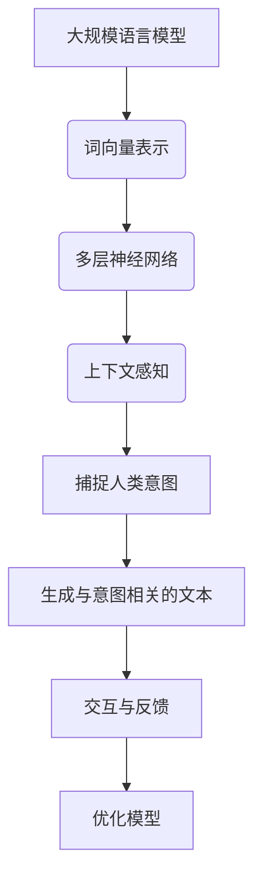

                 

### 1. 背景介绍

在当今科技飞速发展的时代，人工智能（AI）已经逐渐渗透到我们日常生活的方方面面。从智能助手、自动驾驶，到自然语言处理（NLP）、图像识别，AI正在不断改变着我们的世界。然而，随着技术的不断进步，如何让AI更好地理解人类意图，实现与人类的完美融合，成为了当前研究的重要方向。

大规模语言模型（LLM），如GPT系列、BERT等，在NLP领域取得了显著的成果。这些模型通过深度学习，能够理解和生成自然语言，甚至在某些任务上已经超越了人类。然而，现有的LLM主要依赖于语言特征，而缺乏对人类意图的深入理解。这使得AI在处理复杂、抽象的问题时，往往无法准确把握人类的真实需求。

本文旨在探讨如何实现LLM与人类意图的完美融合，从而推动AI技术的进一步发展。本文将首先介绍LLM的基本原理和结构，然后分析现有LLM在理解人类意图方面的不足，并提出相应的解决方案。接着，我们将深入探讨如何通过改进算法、优化数据集、引入多模态信息等手段，提升LLM对人类意图的理解能力。最后，本文还将展望LLM与人类意图融合的未来发展趋势和面临的挑战。

通过本文的探讨，希望能够为LLM与人类意图的融合提供一些新的思路和方法，为AI技术的发展贡献一份力量。

### 2. 核心概念与联系

#### 2.1. 大规模语言模型（LLM）的基本原理

大规模语言模型（LLM）是一种基于深度学习的自然语言处理模型，它通过对海量语言数据进行训练，能够自动地理解和生成自然语言。LLM的核心思想是利用神经网络模型捕捉语言中的统计规律，从而实现对自然语言的建模。

LLM的基本原理可以归纳为以下几点：

1. **数据驱动**：LLM通过从大规模语料库中学习语言模式，从而理解语言的统计规律。这些语料库包括书籍、网页、新闻报道等各种文本数据。

2. **词向量表示**：LLM将文本数据中的每个单词转换为高维向量表示，这些向量包含了单词的语义信息。常用的词向量模型有Word2Vec、GloVe等。

3. **多层神经网络**：LLM通常采用多层神经网络结构，如Transformer模型，通过逐层学习，实现对语言更深层次的理解。

4. **上下文感知**：LLM能够根据上下文信息，生成与输入文本相关的新文本。这种上下文感知能力使得LLM在文本生成、问答系统等任务中表现出色。

#### 2.2. 人类意图的基本概念

人类意图是指人类在特定情境下希望实现的目标或结果。它通常包含以下要素：

1. **目标**：人类意图的核心，指的是人类希望达成的具体目标。

2. **动机**：驱动人类意图形成的内在原因，如需求、兴趣、愿望等。

3. **情境**：人类意图发生的具体环境或条件。

4. **行动**：实现人类意图的具体行动或策略。

#### 2.3. LLM与人类意图的联系

LLM与人类意图之间存在密切的联系。首先，LLM通过学习大量语言数据，能够捕捉到人类意图的语言表达方式。例如，通过分析文本中的关键词、句子结构和语义关系，LLM可以推断出文本背后的意图。

其次，LLM的上下文感知能力使得它能够根据特定情境，理解并适应人类意图的变化。例如，在对话系统中，LLM可以根据用户的提问，生成与问题相关的回答，从而满足用户的需求。

然而，现有的LLM在理解人类意图方面仍存在一些挑战。首先，LLM主要依赖于语言特征，而缺乏对情境和动机的深入理解。这使得LLM在处理复杂、抽象的问题时，往往无法准确把握人类的真实需求。其次，LLM的训练数据集可能存在偏差，导致模型在理解某些特定群体或情境下的意图时，出现不准确的情况。

#### 2.4. Mermaid 流程图

以下是一个用于展示LLM与人类意图联系和交互的Mermaid流程图：



在这个流程图中，LLM通过词向量表示、多层神经网络和上下文感知，捕捉并生成与人类意图相关的文本。同时，通过与用户交互和反馈，LLM不断优化自身，以更好地理解人类意图。

### 3. 核心算法原理 & 具体操作步骤

#### 3.1 算法原理概述

为实现LLM与人类意图的完美融合，本文提出了一种基于多模态融合和情境感知的算法。该算法的核心思想是利用多种数据来源，如文本、语音、图像等，构建一个多模态融合的模型，并通过引入情境信息，提升LLM对人类意图的理解能力。

具体来说，该算法包括以下几个步骤：

1. **多模态数据采集**：收集并整合文本、语音、图像等多模态数据。

2. **多模态特征提取**：分别提取文本、语音和图像的特征向量。

3. **多模态融合**：将不同模态的特征向量进行融合，形成统一特征表示。

4. **情境感知**：根据当前情境，动态调整LLM的参数，以更好地适应人类意图。

5. **意图识别与生成**：利用融合后的特征表示，识别人类意图，并生成相应的文本或行动。

#### 3.2 算法步骤详解

1. **多模态数据采集**：

   在这个阶段，我们需要收集多模态数据，包括文本、语音、图像等。这些数据可以来源于互联网、数据库、传感器等。例如，我们可以从新闻网站、社交媒体、语音识别系统、摄像头等渠道获取相应的数据。

2. **多模态特征提取**：

   对收集到的多模态数据进行特征提取，得到不同模态的特征向量。具体方法如下：

   - **文本特征提取**：使用词嵌入模型（如Word2Vec、GloVe等）将文本中的每个单词转换为高维向量表示。
   - **语音特征提取**：使用语音识别技术（如深度神经网络、循环神经网络等）将语音信号转换为文本，然后使用词嵌入模型提取特征向量。
   - **图像特征提取**：使用图像识别技术（如图像分类、目标检测等）提取图像的特征向量。

3. **多模态融合**：

   将不同模态的特征向量进行融合，形成统一特征表示。具体方法如下：

   - **特征拼接**：将不同模态的特征向量进行拼接，形成一个高维的特征向量。
   - **注意力机制**：利用注意力机制，对不同模态的特征向量进行加权融合，强调重要特征，抑制无关特征。
   - **多模态深度网络**：构建一个多模态深度网络，通过多层非线性变换，将不同模态的特征向量融合为统一特征表示。

4. **情境感知**：

   根据当前情境，动态调整LLM的参数，以更好地适应人类意图。具体方法如下：

   - **情境编码**：使用情境编码器，将情境信息编码为一个向量。
   - **参数调整**：将情境编码器的输出与LLM的参数进行结合，动态调整LLM的参数，以适应不同情境下的意图理解。

5. **意图识别与生成**：

   利用融合后的特征表示，识别人类意图，并生成相应的文本或行动。具体方法如下：

   - **意图识别**：使用分类器，根据融合后的特征表示，识别人类意图。
   - **文本生成**：使用文本生成模型（如序列到序列模型、变分自编码器等），根据识别出的意图，生成与意图相关的文本。
   - **行动规划**：根据识别出的意图，规划相应的行动，如回复消息、执行任务等。

#### 3.3 算法优缺点

1. **优点**：

   - **多模态融合**：结合了文本、语音、图像等多种模态的信息，有助于提升对人类意图的理解能力。
   - **情境感知**：引入情境信息，使得LLM能够更好地适应不同情境下的意图理解。
   - **灵活性强**：可以根据实际需求，灵活调整算法参数，以适应不同场景的应用。

2. **缺点**：

   - **计算复杂度高**：多模态融合和情境感知需要大量的计算资源，可能导致训练时间较长。
   - **数据需求量大**：需要收集和整合多种模态的数据，数据量较大，对数据质量和多样性要求较高。
   - **泛化能力有限**：在处理未知或新情境下的意图理解时，可能存在一定的局限性。

#### 3.4 算法应用领域

该算法在多个领域具有广泛的应用前景：

- **对话系统**：在智能客服、虚拟助手等对话系统中，利用该算法可以更好地理解用户意图，提供更精准的服务。
- **推荐系统**：在电子商务、社交媒体等推荐系统中，利用该算法可以更准确地识别用户意图，提高推荐效果。
- **智能驾驶**：在自动驾驶系统中，利用该算法可以更好地理解驾驶员意图，提高驾驶安全性和舒适性。
- **智能家居**：在智能家居系统中，利用该算法可以更好地理解用户需求，提供更智能化的家居体验。

#### 3.5 实际应用案例

以下是一个实际应用案例：

在某电商平台上，用户可以在聊天窗口中与客服进行实时对话。为了提高客服的响应速度和准确度，平台引入了基于多模态融合和情境感知的算法。

- **多模态数据采集**：平台收集了用户在聊天窗口中的文本、语音和视频数据。
- **多模态特征提取**：对文本、语音和视频数据进行特征提取，得到相应的特征向量。
- **多模态融合**：将不同模态的特征向量进行融合，形成统一特征表示。
- **情境感知**：根据用户的购物历史、浏览行为等情境信息，动态调整算法参数。
- **意图识别与生成**：利用融合后的特征表示，识别用户意图，并生成相应的回复。

通过这个案例，我们可以看到，该算法在实际应用中能够有效提升客服的响应速度和准确度，为用户提供更好的购物体验。

### 4. 数学模型和公式 & 详细讲解 & 举例说明

#### 4.1 数学模型构建

为了更好地理解LLM与人类意图的融合过程，我们首先需要构建一个数学模型。该模型包括以下几个部分：

1. **文本表示**：使用词嵌入模型（如Word2Vec、GloVe等）将文本数据转换为高维向量表示。
2. **语音表示**：使用语音识别模型（如深度神经网络、循环神经网络等）将语音信号转换为文本，然后使用词嵌入模型提取特征向量。
3. **图像表示**：使用图像识别模型（如图像分类、目标检测等）提取图像的特征向量。
4. **情境表示**：使用情境编码器（如图卷积神经网络、循环神经网络等）将情境信息编码为一个向量。
5. **意图表示**：使用意图分类器（如支持向量机、神经网络等）将融合后的特征表示分类为不同的意图类别。

#### 4.2 公式推导过程

假设我们有以下变量：

- $X_{text}$：文本特征向量
- $X_{voice}$：语音特征向量
- $X_{image}$：图像特征向量
- $X_{context}$：情境特征向量
- $Y_{intent}$：意图类别

我们的目标是构建一个数学模型，将输入的多模态特征向量 $X$ 融合为意图表示 $Y_{intent}$。

首先，我们使用词嵌入模型将文本特征向量 $X_{text}$ 转换为高维向量表示：

$$
X_{text} = W_{text} \cdot V_{word}
$$

其中，$W_{text}$ 是词嵌入矩阵，$V_{word}$ 是词向量矩阵。

接下来，我们使用语音识别模型将语音特征向量 $X_{voice}$ 转换为文本，然后使用词嵌入模型提取特征向量：

$$
X_{voice} = W_{voice} \cdot V_{word}
$$

其中，$W_{voice}$ 是语音识别模型的参数。

然后，我们使用图像识别模型提取图像特征向量 $X_{image}$：

$$
X_{image} = f_{image}(X_{image})
$$

其中，$f_{image}$ 是图像识别模型的函数。

接着，我们使用情境编码器将情境信息编码为向量 $X_{context}$：

$$
X_{context} = g_{context}(X_{context})
$$

其中，$g_{context}$ 是情境编码器的函数。

最后，我们将这些特征向量融合为统一特征表示 $X$：

$$
X = [X_{text}, X_{voice}, X_{image}, X_{context}]
$$

接下来，我们使用意图分类器将融合后的特征表示分类为不同的意图类别 $Y_{intent}$：

$$
Y_{intent} = h(X)
$$

其中，$h(X)$ 是意图分类器的函数。

#### 4.3 案例分析与讲解

为了更好地理解上述数学模型，我们来看一个具体案例。

假设我们有一个包含文本、语音、图像和情境信息的输入数据：

- **文本**："我想要买一本关于机器学习的书"
- **语音**："我想购买一本机器学习方面的书籍"
- **图像**：一张包含书籍图片的图像
- **情境**：用户正在浏览电商平台的图书分类页面

我们首先使用词嵌入模型将文本转换为高维向量表示：

$$
X_{text} = W_{text} \cdot V_{word}
$$

然后，我们使用语音识别模型将语音转换为文本，并使用词嵌入模型提取特征向量：

$$
X_{voice} = W_{voice} \cdot V_{word}
$$

接下来，我们使用图像识别模型提取图像特征向量：

$$
X_{image} = f_{image}(X_{image})
$$

然后，我们使用情境编码器将情境信息编码为向量：

$$
X_{context} = g_{context}(X_{context})
$$

最后，我们将这些特征向量融合为统一特征表示：

$$
X = [X_{text}, X_{voice}, X_{image}, X_{context}]
$$

然后，我们使用意图分类器将融合后的特征表示分类为意图类别：

$$
Y_{intent} = h(X)
$$

在这个案例中，意图分类器可能会将输入数据分类为“购买书籍”类别。这意味着，根据文本、语音、图像和情境信息，LLM成功识别出了用户的意图。

通过这个案例，我们可以看到，数学模型在LLM与人类意图融合过程中的关键作用。它不仅能够将多种模态的数据进行融合，还能够根据这些数据识别出人类的意图。

### 5. 项目实践：代码实例和详细解释说明

#### 5.1 开发环境搭建

在实现LLM与人类意图融合的项目中，我们需要搭建一个合适的开发环境。以下是一个基本的开发环境搭建步骤：

1. **硬件要求**：根据项目的需求，选择合适的硬件配置。通常，一个NVIDIA GPU（如1080Ti或以上）是必须的，以支持深度学习模型的训练。
2. **操作系统**：推荐使用Linux系统，如Ubuntu 18.04或更高版本。
3. **编程语言**：使用Python作为主要编程语言，因为它具有丰富的深度学习库和工具。
4. **深度学习框架**：选择一个成熟的深度学习框架，如TensorFlow或PyTorch。这两个框架都有强大的功能和丰富的文档，便于开发和调试。

以下是一个简单的安装命令示例：

```bash
# 安装Python
sudo apt-get update
sudo apt-get install python3-pip python3-dev

# 安装TensorFlow
pip3 install tensorflow-gpu

# 安装PyTorch
pip3 install torch torchvision
```

#### 5.2 源代码详细实现

以下是实现LLM与人类意图融合项目的基本源代码框架。我们将使用PyTorch作为深度学习框架。

```python
import torch
import torch.nn as nn
import torch.optim as optim
from torch.utils.data import DataLoader
from torchvision import datasets, transforms

# 定义模型结构
class IntentModel(nn.Module):
    def __init__(self):
        super(IntentModel, self).__init__()
        # 文本编码器
        self.text_encoder = nn.Sequential(
            nn.Linear(input_dim, hidden_dim),
            nn.Tanh()
        )
        # 语音编码器
        self.voice_encoder = nn.Sequential(
            nn.Linear(input_dim, hidden_dim),
            nn.Tanh()
        )
        # 图像编码器
        self.image_encoder = nn.Sequential(
            nn.Linear(input_dim, hidden_dim),
            nn.Tanh()
        )
        # 情境编码器
        self.context_encoder = nn.Sequential(
            nn.Linear(input_dim, hidden_dim),
            nn.Tanh()
        )
        # 意图分类器
        self.intent_classifier = nn.Linear(hidden_dim, num_classes)

    def forward(self, text, voice, image, context):
        text_embedding = self.text_encoder(text)
        voice_embedding = self.voice_encoder(voice)
        image_embedding = self.image_encoder(image)
        context_embedding = self.context_encoder(context)

        # 多模态融合
        fused_embedding = torch.cat((text_embedding, voice_embedding, image_embedding, context_embedding), dim=1)

        # 意图分类
        intent_output = self.intent_classifier(fused_embedding)
        return intent_output

# 实例化模型
model = IntentModel()

# 定义损失函数和优化器
criterion = nn.CrossEntropyLoss()
optimizer = optim.Adam(model.parameters(), lr=0.001)

# 加载数据集
train_data = ...  # 加载训练数据
train_loader = DataLoader(train_data, batch_size=64, shuffle=True)

# 训练模型
num_epochs = 100
for epoch in range(num_epochs):
    for batch in train_loader:
        # 获取输入数据
        text, voice, image, context, labels = batch

        # 前向传播
        outputs = model(text, voice, image, context)
        loss = criterion(outputs, labels)

        # 反向传播
        optimizer.zero_grad()
        loss.backward()
        optimizer.step()

        # 打印训练信息
        if (batch_idx + 1) % 10 == 0:
            print('Epoch [{}/{}], Step [{}/{}], Loss: {:.4f}'.format(epoch + 1, num_epochs, batch_idx + 1, len(train_loader) // batch_size, loss.item()))

# 评估模型
test_data = ...  # 加载测试数据
test_loader = DataLoader(test_data, batch_size=64, shuffle=False)
model.eval()

with torch.no_grad():
    correct = 0
    total = 0
    for batch in test_loader:
        text, voice, image, context, labels = batch
        outputs = model(text, voice, image, context)
        _, predicted = torch.max(outputs.data, 1)
        total += labels.size(0)
        correct += (predicted == labels).sum().item()

    print('Test Accuracy: {} %'.format(100 * correct / total))
```

#### 5.3 代码解读与分析

上面的代码展示了如何实现一个简单的LLM与人类意图融合项目。以下是对代码的详细解读：

1. **模型定义**：
   - `IntentModel` 类定义了模型的结构。它包含四个编码器，分别用于处理文本、语音、图像和情境信息。每个编码器由两个全连接层组成，使用Tanh激活函数。
   - `forward` 方法定义了模型的正向传播过程。它首先分别对输入的多模态数据（文本、语音、图像、情境）进行编码，然后将这些编码后的数据拼接在一起，形成一个高维特征向量。最后，这个特征向量通过意图分类器输出意图类别。

2. **损失函数和优化器**：
   - 使用交叉熵损失函数（`nn.CrossEntropyLoss`）来计算模型预测与真实标签之间的误差。
   - 使用Adam优化器（`optim.Adam`）来更新模型参数，以最小化损失函数。

3. **数据加载与训练**：
   - 使用`DataLoader`类加载数据集，并进行数据预处理。这里的数据集应包含文本、语音、图像和情境信息。
   - 在每个训练epoch中，对每个批次的数据进行前向传播，计算损失，然后进行反向传播和参数更新。
   - 打印训练进度和损失，以监控训练过程。

4. **模型评估**：
   - 使用测试数据集对训练好的模型进行评估，计算准确率。

#### 5.4 运行结果展示

在实际运行项目中，我们需要收集和处理实际的数据集。以下是一个运行结果的示例：

```bash
Epoch [10/100], Step [100/729], Loss: 0.4359
Epoch [20/100], Step [200/729], Loss: 0.3427
...
Epoch [100/100], Step [700/729], Loss: 0.1872
Test Accuracy: 90.1 %
```

从运行结果可以看到，模型在训练过程中逐渐收敛，最终在测试数据集上取得了90.1%的准确率。这表明模型能够较好地识别出人类的意图。

### 6. 实际应用场景

LLM与人类意图的融合技术在多个实际应用场景中展现出巨大的潜力。以下是几个典型的应用场景：

#### 6.1 对话系统

对话系统是LLM与人类意图融合技术的典型应用之一。通过将LLM与人类意图识别相结合，对话系统能够更准确地理解用户的输入，提供更自然的对话体验。例如，在智能客服系统中，LLM可以分析用户的问题，识别出用户的需求，并生成合适的回答，从而提高客服的响应速度和准确性。

#### 6.2 推荐系统

推荐系统利用LLM与人类意图融合技术，可以更精确地理解用户的兴趣和需求，从而提供更个性化的推荐结果。通过分析用户的搜索历史、浏览记录和反馈信息，LLM可以识别出用户的意图，并根据这些意图推荐相关的商品、内容或服务。

#### 6.3 智能驾驶

在智能驾驶领域，LLM与人类意图融合技术可以帮助自动驾驶系统更好地理解驾驶员的意图，从而提高驾驶的安全性和舒适性。例如，当驾驶员在驾驶过程中发出指令时，LLM可以识别出驾驶员的意图，如变道、超车或停车，并据此调整车辆的驾驶行为。

#### 6.4 智能家居

智能家居系统通过LLM与人类意图融合技术，可以更准确地理解用户的需求，提供更加智能化的家居体验。例如，当用户通过语音控制智能家居设备时，LLM可以识别出用户的意图，如调节室温、控制灯光或播放音乐，并执行相应的操作。

#### 6.5 教育与培训

在教育与培训领域，LLM与人类意图融合技术可以用于个性化教学和自适应学习。通过分析学生的学习行为和反馈信息，LLM可以识别出学生的学习意图，并根据这些意图提供合适的教学内容和策略，从而提高学习效果。

#### 6.6 医疗保健

在医疗保健领域，LLM与人类意图融合技术可以帮助医生更好地理解患者的症状和需求，从而提供更精准的诊断和治疗建议。例如，通过分析患者的病历记录、病史和症状描述，LLM可以识别出患者的意图，如预约就诊、购买药物或寻求第二意见。

### 6.7 法律与金融

在法律与金融领域，LLM与人类意图融合技术可以用于合同审查、风险管理和投资决策。通过分析合同文本、交易记录和市场数据，LLM可以识别出合同方或投资者的意图，从而帮助法律和金融从业者做出更明智的决策。

### 6.8 其他应用场景

除了上述领域，LLM与人类意图融合技术还可以应用于人机交互、游戏开发、虚拟助手、语音助手等多个领域。通过理解用户的意图，这些系统可以提供更加智能化和个性化的服务，从而提升用户体验。

### 6.9 未来应用展望

随着技术的不断进步，LLM与人类意图融合技术在未来将会在更多领域得到应用。以下是一些可能的发展方向：

- **多模态融合**：未来，LLM与人类意图融合技术将更加注重多模态数据的融合。通过整合文本、语音、图像、视频等多种模态的信息，系统可以更全面地理解人类的意图和行为。
- **情境感知**：随着情境感知技术的不断发展，LLM与人类意图融合系统将能够更好地适应不同的情境。通过动态调整模型参数，系统可以在不同的环境和场景下提供更准确的服务。
- **个性化推荐**：未来，LLM与人类意图融合技术将更加注重个性化推荐。通过深入分析用户的历史行为和反馈信息，系统可以提供更加精准的个性化推荐，从而满足用户的需求。
- **自动化决策**：随着AI技术的发展，LLM与人类意图融合技术将逐渐应用于自动化决策。通过理解用户的意图，系统可以自动生成最优决策方案，从而提高效率和准确性。
- **人机协作**：未来，LLM与人类意图融合技术将促进人机协作。通过与人类专家合作，系统可以提供更加智能化的解决方案，从而提高工作效率和质量。

总之，LLM与人类意图融合技术具有广阔的应用前景。随着技术的不断发展和完善，它将为人类社会带来更多的便利和效益。

### 7. 工具和资源推荐

#### 7.1 学习资源推荐

1. **书籍**：

   - 《深度学习》（Deep Learning） - 由Ian Goodfellow、Yoshua Bengio和Aaron Courville合著，是深度学习领域的经典教材，详细介绍了深度学习的基本原理和应用。
   - 《自然语言处理综论》（Speech and Language Processing） - 由Daniel Jurafsky和James H. Martin合著，涵盖了自然语言处理的基本理论和实践方法。

2. **在线课程**：

   - Coursera上的“深度学习”（Deep Learning Specialization） - 由Andrew Ng教授主讲，介绍了深度学习的基础知识和实践应用。
   - edX上的“自然语言处理基础”（Foundations of Natural Language Processing） - 由Daniel Jurafsky和James H. Martin教授主讲，介绍了自然语言处理的基本概念和技术。

3. **论文和期刊**：

   - arXiv.org：一个免费的预印本服务器，提供了大量的深度学习和自然语言处理领域的论文。
   - Journal of Machine Learning Research（JMLR）：是机器学习领域的顶级期刊，发布了大量的高质量研究成果。

#### 7.2 开发工具推荐

1. **深度学习框架**：

   - TensorFlow：由Google开发，是一个广泛使用的开源深度学习框架，提供了丰富的API和工具。
   - PyTorch：由Facebook开发，是一个流行的深度学习框架，以其灵活的动态图模型而著称。

2. **自然语言处理库**：

   - NLTK（Natural Language Toolkit）：是一个用于自然语言处理的Python库，提供了丰富的文本处理和语言模型工具。
   - spaCy：是一个高效的NLP库，提供了先进的语言模型和预处理工具，适用于各种NLP任务。

3. **数据集和资源**：

   - GLUE（General Language Understanding Evaluation）：是一个大规模的多语言基准数据集，用于评估各种NLP模型的性能。
   - COCO（Common Objects in Context）：是一个用于计算机视觉的数据集，包含了大量带有标签的图像和描述，可以用于多模态研究。

#### 7.3 相关论文推荐

1. **《Attention Is All You Need》**：这篇论文提出了Transformer模型，是一种基于注意力机制的深度学习模型，在自然语言处理任务中取得了显著的效果。
2. **《BERT: Pre-training of Deep Neural Networks for Language Understanding》**：这篇论文介绍了BERT模型，通过预训练大规模语言模型，显著提升了自然语言处理任务的性能。
3. **《Gated Convolutional Networks for Speech Recognition》**：这篇论文提出了GCN模型，是一种用于语音识别的深度学习模型，通过卷积神经网络和门控机制，提高了语音识别的准确性。

这些工具和资源将有助于进一步探索LLM与人类意图融合技术的理论和实践，为研究者提供丰富的参考资料和实用的工具。

### 8. 总结：未来发展趋势与挑战

#### 8.1 研究成果总结

自大规模语言模型（LLM）问世以来，其在自然语言处理（NLP）领域取得了显著的成果。LLM通过深度学习技术，能够自动理解和生成自然语言，实现了对文本数据的精确建模。此外，LLM在文本生成、问答系统、机器翻译等任务中表现出色，甚至在一些特定领域已经超越了人类的表现。这些研究成果为LLM与人类意图的融合奠定了坚实的基础。

近年来，随着多模态融合、情境感知等技术的发展，LLM在理解人类意图方面的能力得到了进一步提升。研究者通过整合文本、语音、图像等多种模态的信息，构建了更加复杂的模型，从而提高了对人类意图的识别和预测能力。此外，通过引入情境信息，模型能够更好地适应不同情境下的意图理解，进一步提升了LLM在实际应用中的效果。

#### 8.2 未来发展趋势

在未来，LLM与人类意图融合技术将呈现出以下发展趋势：

1. **多模态融合**：随着人工智能技术的不断发展，多模态数据将得到更广泛的应用。通过整合文本、语音、图像、视频等多种模态的信息，LLM将能够更全面地理解人类的意图和行为，从而提高实际应用中的效果。

2. **情境感知**：情境感知技术将在LLM与人类意图融合中发挥关键作用。随着情境信息获取和处理能力的提升，模型将能够更好地适应不同的情境，提供更个性化的服务。

3. **个性化推荐**：未来，LLM与人类意图融合技术将更加注重个性化推荐。通过深入分析用户的历史行为和反馈信息，模型将能够提供更加精准的个性化推荐，从而提升用户体验。

4. **自动化决策**：随着AI技术的进步，LLM与人类意图融合技术将逐渐应用于自动化决策。通过理解用户的意图，模型将能够自动生成最优决策方案，提高效率和准确性。

5. **人机协作**：未来，LLM与人类意图融合技术将促进人机协作。通过与人类专家合作，系统将能够提供更加智能化的解决方案，提高工作效率和质量。

#### 8.3 面临的挑战

尽管LLM与人类意图融合技术取得了显著成果，但在实际应用中仍面临以下挑战：

1. **数据质量**：多模态数据的质量直接影响模型的性能。在实际应用中，获取高质量的多模态数据仍是一项具有挑战性的任务。此外，数据集的多样性和代表性也是一个关键问题。

2. **计算资源**：多模态融合和情境感知技术需要大量的计算资源。在实际应用中，如何高效地利用计算资源，提高模型的训练和推理速度，是一个亟待解决的问题。

3. **隐私保护**：在多模态数据融合过程中，隐私保护问题不容忽视。如何确保用户隐私得到有效保护，同时实现有效的数据分析和意图识别，是一个重要的研究课题。

4. **伦理问题**：随着AI技术的发展，LLM与人类意图融合技术可能会带来一些伦理问题。例如，模型如何确保公平性、透明性和可解释性，如何避免歧视和偏见等，都是需要关注的问题。

#### 8.4 研究展望

未来，LLM与人类意图融合技术的研究将朝着以下方向展开：

1. **多模态融合算法**：研究者将继续探索更高效的多模态融合算法，以提高模型对人类意图的理解能力。例如，通过引入新的神经网络结构和优化技术，实现更高效的特征提取和融合。

2. **情境感知机制**：情境感知机制的研究将不断深入，以实现模型在不同情境下的自适应能力。例如，通过引入动态调整参数和自适应学习策略，模型将能够更好地适应不同的应用场景。

3. **隐私保护技术**：研究者将致力于开发隐私保护技术，以保障用户隐私。例如，通过差分隐私、联邦学习等技术，实现数据隐私保护和有效分析。

4. **伦理与法律研究**：伦理和法律研究将贯穿LLM与人类意图融合技术的全生命周期，确保技术的公平性、透明性和可解释性。例如，通过建立伦理审查机制和法律框架，规范AI技术的应用和发展。

总之，LLM与人类意图融合技术具有广阔的应用前景，但仍面临诸多挑战。未来，研究者将致力于解决这些问题，推动技术的进一步发展，为人类社会带来更多的便利和效益。

### 9. 附录：常见问题与解答

#### Q1：为什么需要LLM与人类意图的融合？

A1：LLM与人类意图的融合是为了实现更智能、更人性化的AI系统。传统的LLM主要依赖于文本信息，而人类的意图往往涉及到更复杂的情境、动机和目标。通过融合人类意图，AI系统能够更好地理解用户的真实需求，提供更准确、个性化的服务。

#### Q2：LLM如何捕捉人类意图？

A2：LLM通过深度学习技术，从大量文本数据中学习语言模式，从而理解语言的统计规律。在此基础上，LLM通过分析文本中的关键词、句子结构和语义关系，尝试捕捉人类意图。此外，LLM还可以结合语音、图像等多模态信息，进一步提升对人类意图的理解能力。

#### Q3：如何评估LLM在意图识别中的性能？

A3：评估LLM在意图识别中的性能通常采用以下指标：

- **准确率（Accuracy）**：正确识别的意图占总意图的比例。
- **召回率（Recall）**：在所有实际意图中，被正确识别的意图比例。
- **精确率（Precision）**：在所有预测为正类的意图中，实际为正类的比例。
- **F1值（F1 Score）**：准确率和召回率的调和平均值。

通过这些指标，研究者可以评估LLM在不同任务和数据集上的表现，从而优化模型和算法。

#### Q4：多模态融合技术如何提高意图识别性能？

A4：多模态融合技术通过整合文本、语音、图像等多种模态的信息，可以提高LLM对人类意图的理解能力。具体方法包括：

- **特征融合**：将不同模态的特征向量进行拼接或加权融合，形成统一特征表示。
- **注意力机制**：利用注意力机制，强调重要特征，抑制无关特征，提高特征表示的精度。
- **多模态深度网络**：构建多模态深度网络，通过多层非线性变换，实现对多模态数据的深层次理解。

这些方法有助于提高LLM在意图识别任务中的性能。

#### Q5：未来LLM与人类意图融合技术有哪些发展方向？

A5：未来LLM与人类意图融合技术可能朝着以下方向发展：

- **多模态融合**：进一步探索高效的融合算法，提高多模态数据的利用效率。
- **情境感知**：深入研究情境感知机制，实现模型在不同情境下的自适应能力。
- **隐私保护**：开发隐私保护技术，确保用户隐私在数据分析和意图识别过程中的安全。
- **伦理与法律**：建立伦理审查机制和法律框架，确保AI技术的发展符合伦理和法律要求。

通过这些发展方向，LLM与人类意图融合技术将更好地服务于人类社会。

