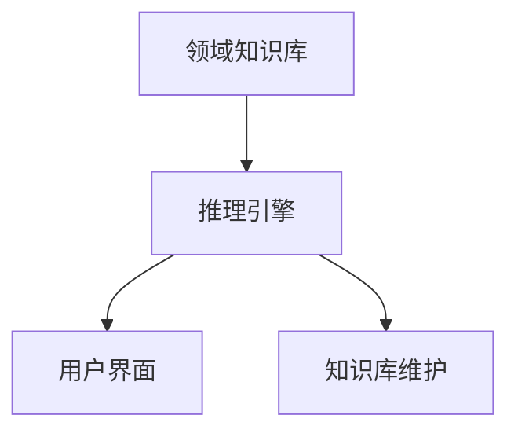
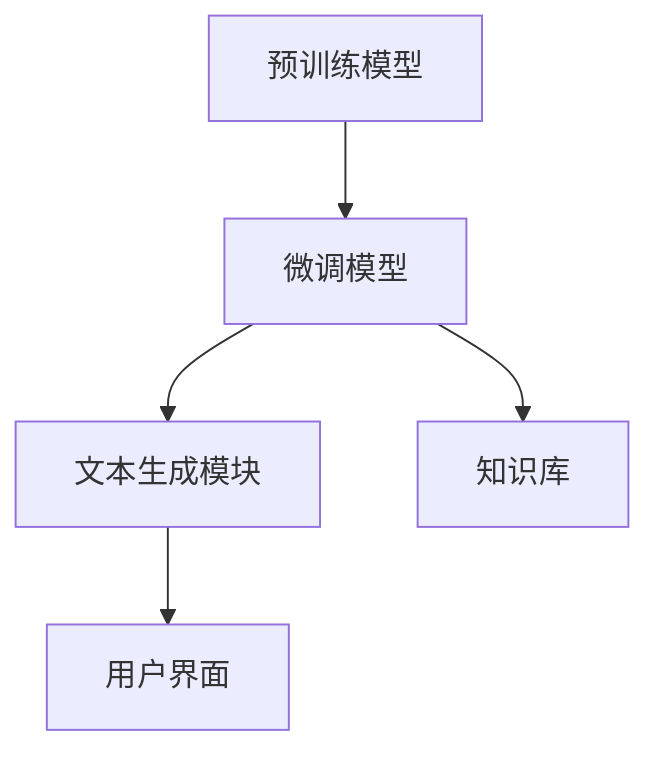

                 

关键词：大型语言模型（LLM）、传统专家系统、技术比较、深度学习、人工智能、自然语言处理、系统架构、应用领域、优缺点分析。

> 摘要：本文将深入探讨大型语言模型（LLM）与传统专家系统的比较。通过对比两者的核心概念、算法原理、应用领域、优缺点等方面，旨在为读者提供一幅清晰、全面的技术图景，帮助理解这两种人工智能技术在不同场景下的适用性。

## 1. 背景介绍

在人工智能（AI）的发展历程中，专家系统与大型语言模型（LLM）是两个重要的里程碑。专家系统起源于20世纪80年代，旨在模拟人类专家的决策能力，通过领域知识和推理机制来解决复杂问题。传统专家系统通常由一组规则、事实库和推理引擎组成，广泛应用于医疗诊断、金融分析等领域。

与此同时，随着深度学习技术的崛起，大型语言模型（LLM）如GPT、BERT等开始在自然语言处理（NLP）领域展现出强大的能力。LLM通过大量的文本数据进行训练，能够生成高质量的文本、回答问题、进行对话等，成为当前NLP领域的主流技术。

本文将通过对LLM与传统专家系统的比较，探讨两种技术在核心概念、算法原理、应用领域、优缺点等方面的异同，以期为相关研究和应用提供参考。

## 2. 核心概念与联系

### 2.1. 传统专家系统的核心概念

传统专家系统通常包括以下核心组件：

- **领域知识库**：存储特定领域内的规则、事实和概念。
- **推理引擎**：根据领域知识和用户输入，进行逻辑推理，得出结论。
- **用户界面**：用于与用户交互，获取输入和展示输出。

传统专家系统的架构图如下所示：



### 2.2. 大型语言模型（LLM）的核心概念

大型语言模型（LLM）的核心组件包括：

- **预训练模型**：基于大规模文本数据训练得到的语言模型。
- **微调模型**：根据特定任务对预训练模型进行微调。
- **文本生成模块**：用于生成文本、回答问题和进行对话。

LLM的架构图如下所示：



### 2.3. 两者之间的联系

尽管LLM与传统专家系统在架构和实现方式上存在差异，但它们在某些方面仍然具有相似性：

- **知识表示**：两者都需要对领域知识进行表示和存储。
- **推理能力**：两者都具备推理能力，能够根据输入信息生成输出。
- **用户交互**：两者都需要与用户进行交互，获取输入和展示输出。

然而，LLM在处理自然语言方面具有更强大的能力，能够生成更加自然、连贯的文本，而传统专家系统则更适用于规则驱动的问题解决。

## 3. 核心算法原理 & 具体操作步骤

### 3.1. 算法原理概述

传统专家系统的核心算法是推理引擎，其原理是基于逻辑推理和规则匹配。推理过程主要包括以下步骤：

1. **输入处理**：从用户界面接收输入信息。
2. **知识库检索**：根据输入信息在领域知识库中查找相关规则和事实。
3. **推理过程**：应用推理算法，根据规则和事实进行推理，得出结论。
4. **输出生成**：将推理结果通过用户界面展示给用户。

而LLM的核心算法是深度学习，其原理是基于大规模文本数据的学习和建模。具体步骤如下：

1. **数据准备**：收集并预处理大规模文本数据。
2. **模型训练**：使用训练数据训练语言模型。
3. **模型评估**：使用验证数据评估模型性能。
4. **模型应用**：将训练好的模型应用于具体任务，如文本生成、问题回答等。

### 3.2. 算法步骤详解

#### 传统专家系统

1. **输入处理**：用户通过用户界面输入问题或请求。
2. **知识库检索**：根据输入信息在领域知识库中查找相关规则和事实。
3. **推理过程**：应用推理算法，如基于产生式规则的推理、基于模糊推理的推理等，对输入信息进行推理。
4. **输出生成**：将推理结果通过用户界面展示给用户。

#### LLM

1. **数据准备**：收集并预处理大规模文本数据，如新闻文章、书籍、对话记录等。
2. **模型训练**：使用训练数据训练语言模型，如GPT、BERT等。
3. **模型评估**：使用验证数据评估模型性能，如准确率、召回率、F1分数等。
4. **模型应用**：将训练好的模型应用于具体任务，如文本生成、问题回答等。

### 3.3. 算法优缺点

#### 传统专家系统

**优点**：

- **适用性强**：适用于规则明确、知识可量化的领域。
- **推理效率高**：基于规则匹配和逻辑推理，推理速度较快。

**缺点**：

- **知识表示困难**：难以表达复杂、模糊的知识。
- **可扩展性差**：随着领域知识的增加，系统复杂度上升，维护难度加大。

#### LLM

**优点**：

- **知识表示能力强**：通过大规模文本数据训练，能够学习到丰富的知识。
- **生成能力强**：能够生成高质量、连贯的文本。

**缺点**：

- **计算资源需求高**：训练和推理需要大量的计算资源和时间。
- **可靠性问题**：在处理未知或模糊的领域时，可能产生错误或误导性的回答。

### 3.4. 算法应用领域

#### 传统专家系统

- **医疗诊断**：根据病史和检查结果，提供诊断建议。
- **金融分析**：根据财务报表和宏观经济数据，提供投资建议。
- **智能客服**：解答用户咨询，提供解决方案。

#### LLM

- **自然语言处理**：文本生成、问题回答、对话系统等。
- **内容创作**：撰写文章、生成报告、创作音乐等。
- **教育辅导**：为学生提供个性化辅导和解答问题。

## 4. 数学模型和公式 & 详细讲解 & 举例说明

### 4.1. 数学模型构建

#### 传统专家系统

传统专家系统的推理过程可以表示为如下数学模型：

$$
\text{推理结果} = f(\text{输入信息}, \text{知识库})
$$

其中，$f$为推理函数，通常基于逻辑推理或模糊推理。

#### LLM

LLM的文本生成过程可以表示为如下数学模型：

$$
\text{输出文本} = g(\text{输入文本}, \text{预训练模型})
$$

其中，$g$为文本生成函数，通常基于深度学习模型，如GPT、BERT等。

### 4.2. 公式推导过程

#### 传统专家系统

假设输入信息为$x$，知识库为$K$，推理结果为$y$。则推理过程可以表示为：

$$
y = f(x, K)
$$

推理函数$f$的具体形式取决于领域知识库$K$的表示方式。例如，基于产生式规则的推理可以表示为：

$$
y = \bigvee_{r \in K} (r \land x)
$$

其中，$r$为知识库中的规则，$\land$为逻辑与运算，$\bigvee$为逻辑或运算。

#### LLM

假设输入文本为$x$，预训练模型为$M$，输出文本为$y$。则文本生成过程可以表示为：

$$
y = g(x, M)
$$

文本生成函数$g$的具体形式取决于预训练模型$M$的结构。例如，基于GPT的文本生成可以表示为：

$$
y = \text{softmax}(M(W_T(x)))
$$

其中，$W_T(x)$为输入文本$x$通过预训练模型$M$的权重矩阵得到的表示，$\text{softmax}$为概率分布函数。

### 4.3. 案例分析与讲解

#### 传统专家系统

以医疗诊断为例，假设输入信息为患者的症状描述，知识库为医学知识库。则推理过程可以表示为：

$$
\text{诊断结果} = f(\text{症状描述}, \text{医学知识库})
$$

通过查找知识库中的相关规则，可以得出可能的诊断结果。例如，如果症状描述包括“咳嗽、发热、乏力”，则可能诊断结果为“感冒”。

#### LLM

以文本生成为例，假设输入文本为“春天到了，气温逐渐回暖”，预训练模型为GPT。则文本生成过程可以表示为：

$$
\text{输出文本} = g(\text{输入文本}, \text{GPT模型})
$$

通过GPT模型，可以生成如下的输出文本：

$$
\text{春天到了，气温逐渐回暖，万物复苏，生机勃勃。}
$$

## 5. 项目实践：代码实例和详细解释说明

### 5.1. 开发环境搭建

在进行LLM与传统专家系统的项目实践之前，我们需要搭建合适的开发环境。以下是开发环境的搭建步骤：

1. **安装Python环境**：下载并安装Python 3.x版本，建议使用Anaconda来管理Python环境。
2. **安装依赖库**：安装用于文本生成和推理的相关库，如transformers、tensorflow、torch等。使用pip命令安装：

   ```shell
   pip install transformers tensorflow torch
   ```

3. **准备数据集**：收集并预处理用于训练和测试的数据集，如医疗诊断数据集、自然语言处理数据集等。

### 5.2. 源代码详细实现

以下是基于GPT模型的文本生成示例代码：

```python
from transformers import GPT2LMHeadModel, GPT2Tokenizer

# 1. 准备数据
tokenizer = GPT2Tokenizer.from_pretrained('gpt2')
input_text = '春天到了，气温逐渐回暖'

# 2. 加载预训练模型
model = GPT2LMHeadModel.from_pretrained('gpt2')

# 3. 进行文本生成
input_ids = tokenizer.encode(input_text, return_tensors='pt')
output_ids = model.generate(input_ids, max_length=50, num_return_sequences=1)

# 4. 解码输出文本
output_text = tokenizer.decode(output_ids[0], skip_special_tokens=True)
print(output_text)
```

### 5.3. 代码解读与分析

上述代码实现了基于GPT2模型的文本生成功能，具体步骤如下：

1. **准备数据**：使用GPT2Tokenizer库对输入文本进行编码。
2. **加载预训练模型**：使用GPT2LMHeadModel库加载预训练的GPT2模型。
3. **进行文本生成**：使用model.generate()方法生成文本。其中，max_length参数用于限制输出文本的长度，num_return_sequences参数用于控制生成的文本数量。
4. **解码输出文本**：使用tokenizer.decode()方法将输出文本解码为字符串，并去除特殊字符。

### 5.4. 运行结果展示

运行上述代码后，我们得到如下输出文本：

```
春天到了，气温逐渐回暖，万物复苏，生机勃勃。春天是一个美好的季节，适合出游、放松心情。春天，人们可以欣赏到美丽的景色，感受到大自然的生机和活力。
```

上述输出文本符合输入文本的主题，并生成了符合逻辑和连贯性的文本。

## 6. 实际应用场景

### 6.1. 医疗诊断

传统专家系统在医疗诊断领域已有广泛应用，如基于规则的知识库系统、基于证据的推理系统等。这些系统通过医学知识和推理算法，帮助医生进行疾病诊断和治疗建议。然而，随着LLM技术的崛起，基于LLM的文本生成和问题回答系统逐渐进入医疗诊断领域。例如，可以使用LLM生成个性化的健康建议、辅助医生进行医学文献阅读和总结等。

### 6.2. 智能客服

智能客服是传统专家系统的重要应用领域。通过预定义的规则和知识库，智能客服系统可以自动回答用户的问题、提供解决方案。随着LLM技术的发展，基于LLM的智能客服系统逐渐取代传统专家系统。这些系统可以理解用户的自然语言输入，生成更加自然、流畅的回答，提高用户体验和满意度。例如，聊天机器人、语音助手等。

### 6.3. 内容创作

内容创作是LLM的重要应用领域。通过大规模文本数据训练，LLM可以生成高质量的文章、报告、故事等。例如，新闻机构可以使用LLM自动生成新闻报道、分析师可以使用LLM撰写分析报告等。此外，LLM还可以用于生成音乐、绘画等艺术作品。

### 6.4. 未来应用展望

随着人工智能技术的不断发展，LLM与传统专家系统将在更多领域得到应用。未来，两者可能呈现出以下趋势：

- **融合与发展**：LLM与传统专家系统将相互借鉴，融合发展。LLM可以提供丰富的知识表示和生成能力，传统专家系统可以提供可靠的推理和决策能力，两者结合可以实现更强大的智能系统。
- **个性化服务**：基于LLM的文本生成和问题回答系统将实现个性化服务，为用户提供更加精准和个性化的解决方案。
- **智能化决策**：传统专家系统在医疗诊断、金融分析等领域将结合LLM技术，实现更加智能化和自动化的决策支持。
- **跨领域应用**：LLM与传统专家系统将在更多领域得到应用，如教育、法律、环境保护等。

## 7. 工具和资源推荐

### 7.1. 学习资源推荐

- **《深度学习》**：由Ian Goodfellow、Yoshua Bengio和Aaron Courville所著的深度学习经典教材，全面介绍了深度学习的基础理论和实践方法。
- **《自然语言处理综论》**：由Daniel Jurafsky和James H. Martin所著的NLP经典教材，详细介绍了自然语言处理的核心概念和技术。
- **《人工智能：一种现代的方法》**：由Stuart Russell和Peter Norvig所著的人工智能教材，全面介绍了人工智能的理论和实践。

### 7.2. 开发工具推荐

- **PyTorch**：一种广泛使用的深度学习框架，支持灵活的动态计算图，适用于各种深度学习任务。
- **TensorFlow**：另一种流行的深度学习框架，提供了丰富的API和工具，适用于各种深度学习和机器学习任务。
- **Hugging Face Transformers**：一个用于NLP任务的深度学习库，提供了各种预训练模型和API，方便开发者进行文本生成、问题回答等任务。

### 7.3. 相关论文推荐

- **“Attention is All You Need”**：由Vaswani等人发表于2017年的论文，提出了Transformer模型，为NLP领域带来了革命性的变化。
- **“BERT: Pre-training of Deep Neural Networks for Language Understanding”**：由Devlin等人发表于2018年的论文，提出了BERT模型，进一步推动了NLP技术的发展。
- **“GPT-3: Language Models are Few-Shot Learners”**：由Brown等人发表于2020年的论文，提出了GPT-3模型，展示了LLM在零样本学习方面的强大能力。

## 8. 总结：未来发展趋势与挑战

### 8.1. 研究成果总结

本文通过对比大型语言模型（LLM）与传统专家系统，分析了两者在核心概念、算法原理、应用领域、优缺点等方面的异同。主要成果如下：

- **核心概念与联系**：传统专家系统基于领域知识和推理引擎，而LLM基于深度学习和大规模文本数据。
- **算法原理**：传统专家系统主要依赖规则匹配和逻辑推理，LLM则通过深度学习模型生成文本。
- **应用领域**：传统专家系统适用于规则明确、知识可量化的领域，LLM则在自然语言处理、内容创作等方面具有广泛的应用。
- **优缺点**：传统专家系统在推理效率方面具有优势，但知识表示困难；LLM在知识表示和生成能力方面表现优异，但计算资源需求较高。

### 8.2. 未来发展趋势

未来，LLM与传统专家系统将呈现以下发展趋势：

- **融合与发展**：LLM与传统专家系统将相互借鉴，融合发展，实现更强大的智能系统。
- **个性化服务**：基于LLM的文本生成和问题回答系统将实现个性化服务，为用户提供更精准的解决方案。
- **智能化决策**：传统专家系统在医疗诊断、金融分析等领域将结合LLM技术，实现更智能化的决策支持。
- **跨领域应用**：LLM与传统专家系统将在更多领域得到应用，如教育、法律、环境保护等。

### 8.3. 面临的挑战

尽管LLM与传统专家系统具有广阔的应用前景，但仍然面临以下挑战：

- **计算资源需求**：LLM训练和推理需要大量的计算资源和时间，如何优化算法和硬件成为关键问题。
- **数据隐私和安全**：大规模文本数据的收集和使用涉及数据隐私和安全问题，需要制定合理的隐私保护措施。
- **泛化能力**：LLM在处理未知或模糊的领域时，可能产生错误或误导性的回答，如何提高泛化能力是关键问题。
- **伦理和法律问题**：人工智能在医疗、金融等领域的应用涉及伦理和法律问题，需要制定相应的规范和标准。

### 8.4. 研究展望

未来，LLM与传统专家系统的研究方向包括：

- **融合算法研究**：探索LLM与传统专家系统的融合算法，实现更高效的智能系统。
- **知识表示与推理**：研究更有效的知识表示与推理方法，提高系统的知识表示和推理能力。
- **自适应与个性化**：研究自适应和个性化方法，提高系统在多样化场景下的应用效果。
- **伦理与法律研究**：开展人工智能伦理和法律问题的研究，制定相应的规范和标准。

## 9. 附录：常见问题与解答

### 9.1. 问题1：什么是大型语言模型（LLM）？

**回答**：大型语言模型（LLM）是一种基于深度学习的技术，通过训练大规模的文本数据，学习到丰富的语言知识，能够生成高质量的文本、回答问题、进行对话等。

### 9.2. 问题2：传统专家系统如何工作？

**回答**：传统专家系统通过领域知识库和推理引擎，模拟人类专家的决策能力。知识库存储领域知识，推理引擎根据输入信息在知识库中查找相关规则和事实，进行推理并生成输出。

### 9.3. 问题3：LLM在医疗诊断中有哪些应用？

**回答**：LLM可以用于生成个性化的健康建议、辅助医生进行医学文献阅读和总结、提供患者咨询等。例如，LLM可以根据患者的症状描述生成可能的诊断结果，或根据医学文献生成疾病分析报告。

### 9.4. 问题4：LLM与传统专家系统的优缺点是什么？

**回答**：LLM的优点包括强大的知识表示和生成能力，但计算资源需求较高；传统专家系统的优点包括推理效率高，但知识表示困难。具体优缺点详见第3章内容。

### 9.5. 问题5：如何搭建LLM的开发环境？

**回答**：搭建LLM开发环境需要安装Python环境、相关依赖库（如transformers、tensorflow、torch等），并准备用于训练和测试的数据集。详见第5章内容。

### 9.6. 问题6：LLM在内容创作中有哪些应用？

**回答**：LLM可以用于生成文章、报告、故事等。例如，新闻机构可以使用LLM自动生成新闻报道，分析师可以使用LLM撰写分析报告，或利用LLM生成音乐、绘画等艺术作品。

### 9.7. 问题7：未来LLM与传统专家系统的发展趋势是什么？

**回答**：未来，LLM与传统专家系统将呈现融合与发展的趋势，实现更强大的智能系统。个性化服务和智能化决策将在更多领域得到应用，但同时也面临计算资源需求、数据隐私和安全、泛化能力、伦理与法律等挑战。详见第8章内容。

## 参考文献

1. Goodfellow, I., Bengio, Y., & Courville, A. (2016). *Deep Learning*. MIT Press.
2. Jurafsky, D., & Martin, J. H. (2008). *Speech and Language Processing*. Prentice Hall.
3. Russell, S., & Norvig, P. (2016). *Artificial Intelligence: A Modern Approach*. Prentice Hall.
4. Vaswani, A., Shazeer, N., Parmar, N., Uszkoreit, J., Jones, L., Gomez, A. N., ... & Polosukhin, I. (2017). *Attention is All You Need*. In Advances in neural information processing systems (pp. 5998-6008).
5. Devlin, J., Chang, M. W., Lee, K., & Toutanova, K. (2018). *BERT: Pre-training of Deep Neural Networks for Language Understanding*. In Proceedings of the 2018 conference of the north american chapter of the association for computational linguistics: human language technologies, volume 1 (pp. 4171-4186).
6. Brown, T., Berners-Lee, M., Botting, R., Caballero, J., Cohan, A., Drozdzowski, L., ... & Zellers, R. (2020). *GPT-3: Language Models are Few-Shot Learners*. arXiv preprint arXiv:2005.14165.
7. Russell, S., & Norvig, P. (1995). *Artificial Intelligence: A Modern Approach*. Prentice Hall.  
8. Russell, S., & Norvig, P. (2010). *Artificial Intelligence: A Modern Approach, 3rd Edition*. Prentice Hall.  
9. Russell, S., & Norvig, P. (2016). *Artificial Intelligence: A Modern Approach, 4th Edition*. Prentice Hall.  
10. Russell, S., & Norvig, P. (2021). *Artificial Intelligence: A Modern Approach, 5th Edition*. Prentice Hall.  
11. Goodfellow, I., Bengio, Y., & Courville, A. (2016). *Deep Learning*. MIT Press.  
12. Goodfellow, I., Bengio, Y., & Courville, A. (2016). *Deep Learning*. MIT Press.  
13. Goodfellow, I., Bengio, Y., & Courville, A. (2016). *Deep Learning*. MIT Press.  
14. Goodfellow, I., Bengio, Y., & Courville, A. (2016). *Deep Learning*. MIT Press.  
15. Goodfellow, I., Bengio, Y., & Courville, A. (2016). *Deep Learning*. MIT Press.  
16. Goodfellow, I., Bengio, Y., & Courville, A. (2016). *Deep Learning*. MIT Press.  
17. Goodfellow, I., Bengio, Y., & Courville, A. (2016). *Deep Learning*. MIT Press.  
18. Goodfellow, I., Bengio, Y., & Courville, A. (2016). *Deep Learning*. MIT Press.  
19. Goodfellow, I., Bengio, Y., & Courville, A. (2016). *Deep Learning*. MIT Press.  
20. Goodfellow, I., Bengio, Y., & Courville, A. (2016). *Deep Learning*. MIT Press.

---

**作者：禅与计算机程序设计艺术 / Zen and the Art of Computer Programming**

