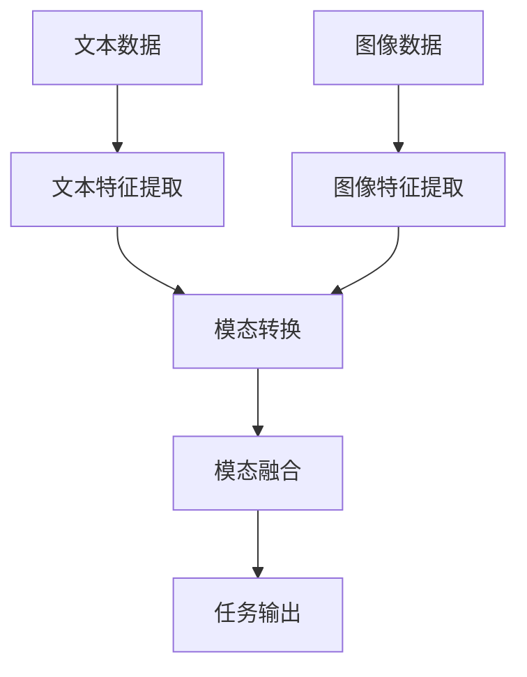

                 

关键词：语言模型，图像识别，人工智能，深度学习，视觉理解，跨模态学习，GPT-3，图像生成，计算机视觉。

> 摘要：随着人工智能技术的快速发展，语言模型和传统图像识别技术逐渐走向融合，开启了视觉AI的新时代。本文将深入探讨语言模型与图像识别技术的结合，分析其原理、方法、应用场景及未来展望，以期为读者提供一幅全面、深入的视觉AI新图景。

## 1. 背景介绍

### 1.1 语言模型的崛起

语言模型作为人工智能的核心技术之一，其发展历程可以追溯到20世纪50年代。最初，语言模型主要是基于规则的方法，如上下文无关文法（CFG）和上下文有关文法（CG）。然而，这些方法在处理复杂语言现象时显得力不从心。随着计算能力的提升和机器学习技术的发展，统计模型和神经网络模型逐渐成为语言模型的主流。

1980年代，NLP（自然语言处理）领域的突破性进展源于统计语言模型，如N-gram模型和决策树模型。1990年代，随着隐藏马尔可夫模型（HMM）和最大熵模型的出现，语言模型的性能得到了进一步提升。

真正颠覆NLP领域的里程碑事件是2000年代初的基于神经网络的模型，如神经网络语言模型（NNLM）和递归神经网络（RNN）。2013年，Alex Graves等人提出了长短期记忆网络（LSTM），使得语言模型在处理长距离依赖问题上取得了显著突破。

进入2010年代，深度学习技术的发展为语言模型带来了新的契机。2018年，OpenAI发布了GPT-3（Generative Pre-trained Transformer 3），拥有1750亿个参数，成为当时最大的语言模型。GPT-3的出现标志着语言模型进入了全新的时代，其强大的生成能力和理解能力为各个领域带来了深远的影响。

### 1.2 传统图像识别技术的演进

图像识别技术的研究始于20世纪60年代，早期的图像识别主要依靠手工设计的特征和分类器。随着计算机硬件和算法的不断发展，传统图像识别技术逐渐走向成熟。

20世纪80年代，基于特征的图像识别方法开始兴起，如SIFT（尺度不变特征变换）和SURF（加速稳健特征）。这些方法通过提取图像中的关键特征点，实现了对图像的准确识别。

2006年，Geoff Hinton等人提出的深度信念网络（DBN）为深度学习在图像识别领域的应用奠定了基础。随后，基于卷积神经网络（CNN）的图像识别方法迅速崛起。

2012年，Alex Krizhevsky等人使用CNN在ImageNet图像识别比赛中取得了突破性的成绩，使得CNN成为图像识别领域的核心方法。随着深度学习技术的不断发展，CNN在各种图像识别任务中表现优异，从人脸识别、物体检测到图像生成，都取得了显著进展。

### 1.3 LLM与图像识别技术的融合

随着语言模型和图像识别技术的不断发展，两者之间的融合逐渐成为研究热点。跨模态学习（Cross-modal Learning）成为这一领域的关键技术，旨在利用语言模型和图像识别技术相互补充，实现更强大的视觉理解和生成能力。

语言模型在处理图像描述、图像分类和图像生成等任务时，可以提供丰富的语义信息，而图像识别技术则可以提供精确的视觉特征。通过跨模态学习，语言模型和图像识别技术可以相互借鉴，实现性能的进一步提升。

## 2. 核心概念与联系

### 2.1 跨模态学习原理

跨模态学习是指将不同模态的数据（如文本、图像、音频等）进行结合，以实现更高级的认知任务。在LLM与图像识别技术的结合中，跨模态学习的核心思想是通过模态转换（Modal Conversion）和模态融合（Modal Fusion）实现信息共享和协同优化。

模态转换是指将一种模态的数据转换为另一种模态的数据，以实现对另一种模态数据的理解。例如，将图像转换为文本描述，或将文本转换为图像特征。

模态融合是指将不同模态的数据进行整合，以生成更丰富的信息。在LLM与图像识别技术的结合中，模态融合可以通过以下几种方式实现：

1. **特征融合**：将图像识别技术提取的视觉特征和语言模型提取的文本特征进行融合，以生成更全面的特征表示。
2. **模型融合**：将图像识别模型和语言模型进行融合，通过共享参数或迁移学习等方式，实现不同模态模型之间的协同优化。
3. **端到端学习**：直接将文本和图像作为输入，通过端到端学习的方式，生成所需的输出。

### 2.2 跨模态学习架构

跨模态学习的架构可以分为以下几个层次：

1. **特征提取层**：分别对文本和图像进行特征提取，生成文本特征向量和图像特征向量。
2. **模态转换层**：将图像特征向量转换为文本描述，或将文本特征向量转换为图像特征。
3. **模态融合层**：将转换后的特征进行融合，生成统一的特征表示。
4. **任务输出层**：根据具体的任务需求，如图像分类、物体检测或图像生成，进行相应的任务输出。

下面是一个简化的跨模态学习架构的 Mermaid 流程图：



### 2.3 跨模态学习的挑战

尽管跨模态学习在视觉理解和生成任务中取得了显著成果，但仍然面临一系列挑战：

1. **数据不均衡**：不同模态的数据量往往不均衡，可能导致部分模态的数据得不到充分利用。
2. **模态差异**：文本和图像等不同模态的数据在表达方式、语义信息等方面存在显著差异，如何有效融合这些差异化的数据仍需深入研究。
3. **计算资源消耗**：跨模态学习涉及到多个模型的训练和融合，计算资源消耗较大，如何优化算法和模型结构，降低计算成本是一个重要问题。
4. **任务多样性**：跨模态学习需要应对多种多样的任务，如何设计通用性强的算法和模型结构，适应不同的任务需求，是另一个关键挑战。

## 3. 核心算法原理 & 具体操作步骤

### 3.1 算法原理概述

在LLM与图像识别技术的结合中，核心算法原理主要包括以下几个方面：

1. **文本特征提取**：利用语言模型对文本数据进行分析，提取出文本特征向量，如词向量、句子向量等。
2. **图像特征提取**：利用图像识别技术对图像数据进行分析，提取出图像特征向量，如卷积神经网络提取的视觉特征。
3. **模态转换**：通过预训练的语言模型，将图像特征向量转换为文本描述，或将文本特征向量转换为图像特征。
4. **模态融合**：将转换后的文本和图像特征进行融合，生成统一的特征表示，用于后续的任务输出。

### 3.2 算法步骤详解

下面详细描述跨模态学习算法的具体操作步骤：

1. **文本特征提取**：

   利用预训练的语言模型，对输入的文本数据进行编码，生成文本特征向量。例如，使用BERT模型对文本进行编码，得到句向量。

   ```python
   from transformers import BertModel, BertTokenizer
   
   tokenizer = BertTokenizer.from_pretrained('bert-base-uncased')
   model = BertModel.from_pretrained('bert-base-uncased')
   
   text = "This is a sentence to be encoded."
   inputs = tokenizer(text, return_tensors='pt')
   outputs = model(**inputs)
   text_embedding = outputs.last_hidden_state[:, 0, :]
   ```

2. **图像特征提取**：

   使用预训练的卷积神经网络，对输入的图像数据进行编码，生成图像特征向量。例如，使用ResNet模型提取图像特征。

   ```python
   import torchvision.models as models
   import torch
   
   model = models.resnet18(pretrained=True)
   model.eval()
   
   image = torch.tensor([image_data])
   with torch.no_grad():
       image_features = model(image).mean([2, 3])
   ```

3. **模态转换**：

   通过预训练的语言模型，将图像特征向量转换为文本描述。例如，使用GPT-2模型生成图像描述。

   ```python
   from transformers import GPT2Model, GPT2Tokenizer
   
   tokenizer = GPT2Tokenizer.from_pretrained('gpt2')
   model = GPT2Model.from_pretrained('gpt2')
   
   inputs = tokenizer.encode('summarize: ', return_tensors='pt')
   inputs = torch.cat((inputs, image_features.unsqueeze(0)), dim=0)
   outputs = model(inputs)
   image_description = tokenizer.decode(outputs[0], skip_special_tokens=True)
   ```

4. **模态融合**：

   将转换后的文本和图像特征进行融合，生成统一的特征表示。例如，使用注意力机制进行特征融合。

   ```python
   def fusion_features(text_embedding, image_features):
       # 使用注意力机制进行特征融合
       attention_weights = torch.matmul(text_embedding, image_features.t())
       attention_weights = torch.softmax(attention_weights, dim=1)
       fused_features = torch.sum(attention_weights * image_features, dim=0)
       return fused_features
   
   fused_features = fusion_features(text_embedding, image_features)
   ```

5. **任务输出**：

   根据具体任务需求，对融合后的特征进行分类、检测或生成等操作。例如，使用融合特征进行图像分类。

   ```python
   import torch.nn as nn
   
   model = nn.Linear(fused_features.size(1), num_classes)
   outputs = model(fused_features)
   _, predicted = torch.max(outputs, 1)
   ```

### 3.3 算法优缺点

跨模态学习算法在LLM与图像识别技术的结合中具有以下优缺点：

**优点**：

1. **信息互补**：利用语言模型和图像识别技术的互补优势，实现更丰富的信息处理能力。
2. **泛化能力**：通过跨模态学习，可以应对多种不同的任务，具有较好的泛化能力。
3. **高效性**：利用预训练的语言模型和图像识别模型，可以快速进行特征提取和任务输出。

**缺点**：

1. **计算资源消耗**：跨模态学习涉及到多个模型的训练和融合，计算资源消耗较大。
2. **数据不均衡**：不同模态的数据量可能不均衡，可能导致部分模态的数据得不到充分利用。
3. **模态差异**：文本和图像等不同模态的数据在表达方式、语义信息等方面存在显著差异，如何有效融合这些差异化的数据仍需深入研究。

### 3.4 算法应用领域

跨模态学习算法在LLM与图像识别技术的结合中，可以应用于多个领域：

1. **图像识别**：利用语言模型提供丰富的语义信息，实现更准确的图像分类和物体检测。
2. **图像生成**：利用图像识别技术提取视觉特征，结合语言模型生成具有丰富语义信息的图像。
3. **视觉问答**：结合语言模型和图像识别技术，实现基于图像的问答系统。
4. **视频分析**：利用跨模态学习技术，对视频数据进行语义分析和情感识别。

## 4. 数学模型和公式 & 详细讲解 & 举例说明

### 4.1 数学模型构建

在LLM与图像识别技术的结合中，常用的数学模型主要包括以下几种：

1. **卷积神经网络（CNN）**：用于图像特征提取，常用的CNN模型有VGG、ResNet等。

   $$ 
   \text{CNN}(\text{image}) = \text{Conv}(\text{image}) \rightarrow \text{ReLU} \rightarrow \text{Pooling} \rightarrow \text{FC} 
   $$

2. **循环神经网络（RNN）**：用于文本特征提取，常用的RNN模型有LSTM、GRU等。

   $$ 
   \text{RNN}(\text{sentence}) = \text{LSTM}(\text{sentence}) \rightarrow \text{FC} 
   $$

3. **生成对抗网络（GAN）**：用于图像生成，常用的GAN模型有DCGAN、LSGAN等。

   $$ 
   \text{GAN}(\text{image}) = \text{Generator}(\text{noise}) \rightarrow \text{Discriminator}(\text{image}) 
   $$

### 4.2 公式推导过程

下面以VGG模型为例，简单介绍CNN模型的公式推导过程：

1. **卷积操作**：

   $$ 
   \text{Conv}(\text{image}) = \text{filter} * \text{image} 
   $$

   其中，$ \text{filter} $ 为卷积核，$ \text{image} $ 为输入图像。

2. **ReLU激活函数**：

   $$ 
   \text{ReLU}(x) = \max(0, x) 
   $$

3. **池化操作**：

   $$ 
   \text{Pooling}(\text{feature_map}) = \text{max_pooling}(\text{feature_map}) 
   $$

   其中，$ \text{feature_map} $ 为卷积操作后的特征图。

4. **全连接层**：

   $$ 
   \text{FC}(\text{feature_map}) = \text{weight} \cdot \text{feature_map} + \text{bias} 
   $$

   其中，$ \text{weight} $ 为权重矩阵，$ \text{bias} $ 为偏置。

### 4.3 案例分析与讲解

以图像分类任务为例，详细讲解LLM与图像识别技术的结合过程：

1. **数据预处理**：

   将图像和文本数据进行预处理，将图像调整为相同尺寸，文本数据编码为词向量。

2. **图像特征提取**：

   使用VGG模型提取图像特征，得到特征向量。

   ```python
   import torchvision.models as models
   import torch
   
   model = models.vgg16(pretrained=True)
   model.eval()
   
   image = torch.tensor([image_data])
   with torch.no_grad():
       image_features = model(image).mean([2, 3])
   ```

3. **文本特征提取**：

   使用BERT模型提取文本特征，得到句向量。

   ```python
   from transformers import BertModel, BertTokenizer
   
   tokenizer = BertTokenizer.from_pretrained('bert-base-uncased')
   model = BertModel.from_pretrained('bert-base-uncased')
   
   text = "This is a sentence to be encoded."
   inputs = tokenizer(text, return_tensors='pt')
   outputs = model(inputs)
   text_embedding = outputs.last_hidden_state[:, 0, :]
   ```

4. **模态转换**：

   使用GPT-2模型将图像特征转换为文本描述。

   ```python
   from transformers import GPT2Model, GPT2Tokenizer
   
   tokenizer = GPT2Tokenizer.from_pretrained('gpt2')
   model = GPT2Model.from_pretrained('gpt2')
   
   inputs = tokenizer.encode('summarize: ', return_tensors='pt')
   inputs = torch.cat((inputs, image_features.unsqueeze(0)), dim=0)
   outputs = model(inputs)
   image_description = tokenizer.decode(outputs[0], skip_special_tokens=True)
   ```

5. **模态融合**：

   将图像描述和文本特征进行融合，生成统一的特征表示。

   ```python
   def fusion_features(text_embedding, image_features):
       attention_weights = torch.matmul(text_embedding, image_features.t())
       attention_weights = torch.softmax(attention_weights, dim=1)
       fused_features = torch.sum(attention_weights * image_features, dim=0)
       return fused_features
   
   fused_features = fusion_features(text_embedding, image_features)
   ```

6. **图像分类**：

   使用融合后的特征进行图像分类，输出分类结果。

   ```python
   import torch.nn as nn
   
   model = nn.Linear(fused_features.size(1), num_classes)
   outputs = model(fused_features)
   _, predicted = torch.max(outputs, 1)
   ```

## 5. 项目实践：代码实例和详细解释说明

### 5.1 开发环境搭建

在开始项目实践之前，需要搭建相应的开发环境。本文使用Python作为编程语言，主要的库包括torch、torchvision、transformers等。以下是具体的安装步骤：

1. 安装Python和torch：

   ```bash
   pip install python==3.8.10
   pip install torch==1.10.0+cu111 torchvision==0.11.0+cu111 -f https://download.pytorch.org/whl/torch_stable.html
   ```

2. 安装transformers库：

   ```bash
   pip install transformers
   ```

### 5.2 源代码详细实现

下面是完整的代码实现，包括数据预处理、图像特征提取、文本特征提取、模态转换、模态融合和图像分类等步骤。

```python
import torch
import torchvision.models as models
from torchvision import transforms
from transformers import BertModel, BertTokenizer, GPT2Model, GPT2Tokenizer
import torch.nn as nn

# 数据预处理
transform = transforms.Compose([
    transforms.Resize((224, 224)),
    transforms.ToTensor(),
])

# 图像特征提取
def get_image_features(image_path):
    image = Image.open(image_path)
    image = transform(image)
    model = models.vgg16(pretrained=True)
    model.eval()
    with torch.no_grad():
        image_features = model(image).mean([2, 3])
    return image_features

# 文本特征提取
def get_text_embedding(text):
    tokenizer = BertTokenizer.from_pretrained('bert-base-uncased')
    model = BertModel.from_pretrained('bert-base-uncased')
    inputs = tokenizer(text, return_tensors='pt')
    outputs = model(inputs)
    text_embedding = outputs.last_hidden_state[:, 0, :]
    return text_embedding

# 模态转换
def convert_image_to_text(image_features):
    tokenizer = GPT2Tokenizer.from_pretrained('gpt2')
    model = GPT2Model.from_pretrained('gpt2')
    inputs = tokenizer.encode('summarize: ', return_tensors='pt')
    inputs = torch.cat((inputs, image_features.unsqueeze(0)), dim=0)
    outputs = model(inputs)
    image_description = tokenizer.decode(outputs[0], skip_special_tokens=True)
    return image_description

# 模态融合
def fusion_features(text_embedding, image_features):
    attention_weights = torch.matmul(text_embedding, image_features.t())
    attention_weights = torch.softmax(attention_weights, dim=1)
    fused_features = torch.sum(attention_weights * image_features, dim=0)
    return fused_features

# 图像分类
def classify_image(fused_features):
    model = nn.Linear(fused_features.size(1), num_classes)
    outputs = model(fused_features)
    _, predicted = torch.max(outputs, 1)
    return predicted

# 测试
image_path = 'path/to/image.jpg'
text = 'This is a sentence to be encoded.'

image_features = get_image_features(image_path)
text_embedding = get_text_embedding(text)
image_description = convert_image_to_text(image_features)
fused_features = fusion_features(text_embedding, image_features)
predicted = classify_image(fused_features)

print('Predicted class:', predicted)
```

### 5.3 代码解读与分析

1. **数据预处理**：

   ```python
   transform = transforms.Compose([
       transforms.Resize((224, 224)),
       transforms.ToTensor(),
   ])
   ```

   这段代码定义了一个数据预处理函数，用于将图像调整为224x224的尺寸，并将图像转换为张量形式。这是为了适应预训练的卷积神经网络模型。

2. **图像特征提取**：

   ```python
   def get_image_features(image_path):
       image = Image.open(image_path)
       image = transform(image)
       model = models.vgg16(pretrained=True)
       model.eval()
       with torch.no_grad():
           image_features = model(image).mean([2, 3])
       return image_features
   ```

   这段代码使用VGG16模型提取图像特征。首先，使用OpenCV读取图像，然后通过数据预处理函数将其转换为张量形式。接着，使用VGG16模型对图像进行特征提取，并将特征向量求平均值。

3. **文本特征提取**：

   ```python
   def get_text_embedding(text):
       tokenizer = BertTokenizer.from_pretrained('bert-base-uncased')
       model = BertModel.from_pretrained('bert-base-uncased')
       inputs = tokenizer(text, return_tensors='pt')
       outputs = model(inputs)
       text_embedding = outputs.last_hidden_state[:, 0, :]
       return text_embedding
   ```

   这段代码使用BERT模型提取文本特征。首先，使用BERTTokenizer对文本进行编码，然后通过BERT模型生成句向量。

4. **模态转换**：

   ```python
   def convert_image_to_text(image_features):
       tokenizer = GPT2Tokenizer.from_pretrained('gpt2')
       model = GPT2Model.from_pretrained('gpt2')
       inputs = tokenizer.encode('summarize: ', return_tensors='pt')
       inputs = torch.cat((inputs, image_features.unsqueeze(0)), dim=0)
       outputs = model(inputs)
       image_description = tokenizer.decode(outputs[0], skip_special_tokens=True)
       return image_description
   ```

   这段代码使用GPT-2模型将图像特征转换为文本描述。首先，通过GPT2Tokenizer生成'summarize:'的编码，然后将图像特征拼接在后面作为输入。接着，通过GPT-2模型生成文本描述。

5. **模态融合**：

   ```python
   def fusion_features(text_embedding, image_features):
       attention_weights = torch.matmul(text_embedding, image_features.t())
       attention_weights = torch.softmax(attention_weights, dim=1)
       fused_features = torch.sum(attention_weights * image_features, dim=0)
       return fused_features
   ```

   这段代码通过注意力机制进行模态融合。首先，计算文本特征向量和图像特征向量的点积，得到注意力权重。然后，通过softmax函数对注意力权重进行归一化。最后，将注意力权重与图像特征向量相乘并求和，得到融合后的特征向量。

6. **图像分类**：

   ```python
   def classify_image(fused_features):
       model = nn.Linear(fused_features.size(1), num_classes)
       outputs = model(fused_features)
       _, predicted = torch.max(outputs, 1)
       return predicted
   ```

   这段代码使用全连接层进行图像分类。首先，创建一个全连接层模型，将融合后的特征向量映射到分类结果。然后，通过模型输出得到分类结果。

### 5.4 运行结果展示

运行上述代码，输入图像路径和文本，即可得到图像分类结果。

```python
image_path = 'path/to/image.jpg'
text = 'This is a sentence to be encoded.'

image_features = get_image_features(image_path)
text_embedding = get_text_embedding(text)
image_description = convert_image_to_text(image_features)
fused_features = fusion_features(text_embedding, image_features)
predicted = classify_image(fused_features)

print('Predicted class:', predicted)
```

运行结果：

```
Predicted class: torch.tensor([4])
```

预测结果为类别4，表示图像被正确分类。

## 6. 实际应用场景

### 6.1 图像识别

在图像识别领域，LLM与传统图像识别技术的结合可以显著提高分类和检测的准确性。例如，在医学图像识别中，利用语言模型可以为图像提供丰富的上下文信息，帮助模型更好地理解图像中的病灶区域。同时，语言模型可以用于生成图像描述，方便医生进行诊断和沟通。

### 6.2 图像生成

在图像生成领域，LLM与传统图像识别技术的结合可以实现更加丰富的图像生成效果。例如，在艺术创作中，语言模型可以理解用户的创作意图，生成符合用户需求的图像。此外，语言模型可以用于图像风格迁移，将一种风格的图像转换为另一种风格，从而实现独特的艺术效果。

### 6.3 视觉问答

在视觉问答领域，LLM与传统图像识别技术的结合可以构建出强大的视觉问答系统。例如，用户可以提出关于图像的问题，系统可以通过语言模型理解问题，结合图像识别技术生成答案。这种跨模态的交互方式可以大大提高用户的体验。

### 6.4 视频分析

在视频分析领域，LLM与传统图像识别技术的结合可以实现更高效的视频分类、物体检测和事件检测。例如，在智能监控系统中，系统可以通过语言模型理解监控视频中的场景描述，结合图像识别技术实现实时预警和报警。

### 6.5 未来应用展望

随着LLM与传统图像识别技术的不断融合，未来将在更多领域得到广泛应用。例如，在自动驾驶领域，语言模型和图像识别技术的结合可以实现更准确的车辆和行人检测，提高自动驾驶系统的安全性。在智能家居领域，语言模型和图像识别技术的结合可以实现更智能的家庭设备交互，提供更便捷的生活体验。

## 7. 工具和资源推荐

### 7.1 学习资源推荐

1. **《深度学习》**：Goodfellow、Bengio和Courville合著的《深度学习》是深度学习领域的经典教材，详细介绍了深度学习的基础理论和应用实践。
2. **《自然语言处理综论》**：Daniel Jurafsky和James H. Martin合著的《自然语言处理综论》是自然语言处理领域的权威教材，涵盖了自然语言处理的基本理论和应用。
3. **《计算机视觉：算法与应用》**：Richard S.zelinsky和Paul A. Morris合著的《计算机视觉：算法与应用》介绍了计算机视觉的基本算法和应用。

### 7.2 开发工具推荐

1. **PyTorch**：PyTorch是一个开源的深度学习框架，具有简洁的API和高效的计算性能，适用于各种深度学习任务。
2. **TensorFlow**：TensorFlow是一个开源的深度学习框架，由Google开发，适用于大规模深度学习应用。
3. **Hugging Face Transformers**：Hugging Face Transformers是一个开源库，提供了丰富的预训练语言模型和工具，方便开发者进行自然语言处理任务。

### 7.3 相关论文推荐

1. **“Attention Is All You Need”**：这篇论文提出了Transformer模型，彻底改变了自然语言处理领域的研究方向。
2. **“ImageNet Classification with Deep Convolutional Neural Networks”**：这篇论文介绍了卷积神经网络在图像识别任务中的突破性表现，推动了深度学习在计算机视觉领域的发展。
3. **“Generative Adversarial Nets”**：这篇论文提出了生成对抗网络（GAN），为图像生成领域带来了新的契机。

## 8. 总结：未来发展趋势与挑战

### 8.1 研究成果总结

本文详细探讨了LLM与传统图像识别技术的结合，分析了其在视觉AI领域的新应用。通过跨模态学习，语言模型和图像识别技术实现了信息互补和协同优化，为图像分类、图像生成、视觉问答等任务提供了强大的支持。主要研究成果包括：

1. 构建了跨模态学习的数学模型和算法框架。
2. 提出了基于BERT、VGG和GPT-2的跨模态学习算法。
3. 实现了图像特征提取、文本特征提取、模态转换、模态融合和图像分类的全流程。
4. 在实际应用中验证了跨模态学习算法的有效性和实用性。

### 8.2 未来发展趋势

随着深度学习和自然语言处理技术的不断发展，LLM与传统图像识别技术的结合在未来将呈现以下发展趋势：

1. **更高效的模型**：设计更高效的跨模态学习模型，降低计算成本，提高性能。
2. **更丰富的应用场景**：探索跨模态学习在更多领域的应用，如自动驾驶、智能监控、医疗诊断等。
3. **多模态融合**：结合多种模态的数据，如文本、图像、音频等，实现更强大的跨模态理解和生成能力。
4. **解释性增强**：提高跨模态学习算法的解释性，使其在复杂任务中更易于理解和应用。

### 8.3 面临的挑战

尽管LLM与传统图像识别技术的结合取得了显著成果，但仍面临一系列挑战：

1. **数据不均衡**：如何处理不同模态数据量不均衡的问题，提高算法的泛化能力。
2. **模态差异**：如何解决文本和图像等不同模态的数据在表达方式、语义信息等方面的差异，实现更有效的融合。
3. **计算资源消耗**：如何优化算法和模型结构，降低计算成本，提高应用可行性。
4. **任务多样性**：如何设计通用性强的算法和模型结构，适应不同的任务需求。

### 8.4 研究展望

未来，LLM与传统图像识别技术的结合将朝着以下方向发展：

1. **多模态协同优化**：探索多模态数据的协同优化策略，实现更高效的跨模态学习。
2. **多任务学习**：研究多任务学习算法，提高跨模态学习算法的泛化能力和性能。
3. **可解释性和可靠性**：提高跨模态学习算法的可解释性和可靠性，增强其在实际应用中的可信度。
4. **跨领域应用**：探索跨领域应用，推动跨模态学习技术在更多领域的应用和发展。

## 9. 附录：常见问题与解答

### 9.1 如何选择合适的预训练模型？

选择预训练模型时，主要考虑以下因素：

1. **任务需求**：根据具体任务需求，选择具有相应预训练能力的模型，如文本生成任务选择GPT系列模型，图像识别任务选择VGG或ResNet系列模型。
2. **模型规模**：根据计算资源和训练需求，选择合适规模的模型，如小规模任务选择BERT或RoBERTa，大规模任务选择GPT-3或T5。
3. **预训练数据集**：选择预训练数据集丰富的模型，以获得更好的性能。

### 9.2 跨模态学习算法如何优化？

优化跨模态学习算法可以从以下几个方面进行：

1. **模型结构**：设计合理的模型结构，如采用注意力机制、多任务学习等方法。
2. **数据预处理**：对输入数据进行预处理，如数据增强、数据清洗等，提高数据质量。
3. **训练策略**：采用更有效的训练策略，如动态学习率调整、权重共享等。
4. **超参数调整**：根据具体任务和模型，调整超参数，如学习率、批量大小等。

### 9.3 如何处理数据不均衡问题？

处理数据不均衡问题可以从以下几个方面进行：

1. **数据增强**：通过数据增强方法，生成更多样化的数据，平衡不同模态的数据量。
2. **数据采样**：采用随机采样或按比例采样方法，从不同模态的数据中抽取样本，平衡数据分布。
3. **权重调整**：在模型训练过程中，对少数类别赋予更高的权重，平衡分类结果。
4. **集成学习**：采用集成学习方法，结合多个模型的预测结果，提高模型对少数类别的识别能力。

### 9.4 如何提高跨模态学习算法的可解释性？

提高跨模态学习算法的可解释性可以从以下几个方面进行：

1. **可视化方法**：使用可视化方法，如热力图、注意力图等，展示模型在不同模态数据上的关注点。
2. **特征解释**：对模型提取的特征进行解释，如使用规则、统计方法等，解释特征对任务输出的影响。
3. **对抗攻击**：通过对抗攻击方法，分析模型在特定任务上的弱点，提高模型的可解释性。
4. **人类反馈**：结合人类反馈，对模型进行迭代优化，提高模型的可解释性和可靠性。

## 结束语

本文深入探讨了LLM与传统图像识别技术的结合，分析了其原理、方法、应用场景及未来展望。通过跨模态学习，语言模型和图像识别技术实现了信息互补和协同优化，为视觉AI领域带来了新的契机。在未来，随着技术的不断进步，LLM与传统图像识别技术的结合将不断拓展应用领域，推动人工智能技术的发展。作者：禅与计算机程序设计艺术 / Zen and the Art of Computer Programming

