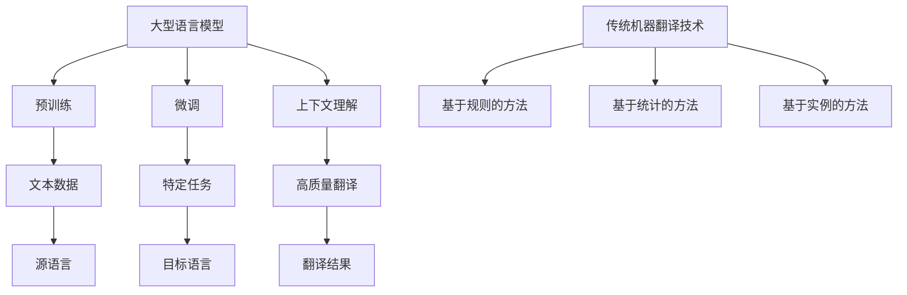

                 

关键词：大型语言模型（LLM）、机器翻译、传统翻译技术、对比分析、技术融合

摘要：本文通过对大型语言模型（LLM）与传统机器翻译技术的对比分析，探讨了LLM在机器翻译领域的优势与挑战。文章首先介绍了LLM的核心概念和技术架构，然后详细分析了传统机器翻译技术的原理和方法。在此基础上，探讨了LLM与传统技术的融合方法，并展望了未来机器翻译技术的发展趋势和面临的挑战。

## 1. 背景介绍

随着互联网的普及和全球化进程的加速，跨语言交流的需求日益增长。机器翻译技术作为实现跨语言交流的关键技术之一，近年来取得了显著的进展。传统机器翻译技术主要包括基于规则的方法、基于统计的方法和基于实例的方法。然而，这些方法在处理复杂句子和实现高质量翻译方面存在一定的局限性。

近年来，大型语言模型（LLM）的兴起为机器翻译技术带来了新的契机。LLM具有强大的文本理解和生成能力，能够处理复杂的语言现象，实现高质量的自然语言翻译。本文旨在通过对LLM与传统机器翻译技术的对比分析，探讨LLM在机器翻译领域的优势与挑战，以及LLM与传统技术的融合方法。

## 2. 核心概念与联系

### 2.1. 大型语言模型（LLM）的核心概念

大型语言模型（LLM）是一种基于深度学习的自然语言处理模型，其核心思想是使用大量文本数据训练模型，使其能够理解并生成自然语言。LLM具有以下几个核心概念：

- **预训练**：使用大规模的文本数据进行预训练，使模型具有对自然语言的深刻理解。
- **微调**：在特定任务上对预训练模型进行微调，以适应特定应用场景。
- **上下文理解**：LLM能够根据上下文信息进行推理和生成，实现高质量的翻译。

### 2.2. 传统机器翻译技术的核心概念

传统机器翻译技术主要包括以下几种方法：

- **基于规则的方法**：通过编写大量的语言规则，对源语言和目标语言进行翻译。
- **基于统计的方法**：使用统计模型对源语言和目标语言之间的对应关系进行学习。
- **基于实例的方法**：通过学习大量的翻译实例，实现源语言到目标语言的映射。

### 2.3. Mermaid 流程图

以下是LLM与传统机器翻译技术之间的核心概念联系：



## 3. 核心算法原理 & 具体操作步骤

### 3.1. 算法原理概述

LLM的核心算法原理主要包括以下几个方面：

1. **预训练**：使用大规模的文本数据进行预训练，使模型具有对自然语言的深刻理解。
2. **微调**：在特定任务上对预训练模型进行微调，以适应特定应用场景。
3. **上下文理解**：LLM能够根据上下文信息进行推理和生成，实现高质量的翻译。

传统机器翻译技术主要包括以下几种算法原理：

1. **基于规则的方法**：通过编写大量的语言规则，对源语言和目标语言进行翻译。
2. **基于统计的方法**：使用统计模型对源语言和目标语言之间的对应关系进行学习。
3. **基于实例的方法**：通过学习大量的翻译实例，实现源语言到目标语言的映射。

### 3.2. 算法步骤详解

以下是LLM和传统机器翻译技术的具体操作步骤：

#### 3.2.1. LLM的算法步骤

1. **数据预处理**：对大规模的文本数据进行预处理，包括分词、去停用词等操作。
2. **预训练**：使用预处理后的文本数据进行预训练，包括自注意力机制、多层神经网络等。
3. **微调**：在特定任务上对预训练模型进行微调，包括调整参数、优化目标函数等。
4. **上下文理解**：根据上下文信息进行推理和生成，实现高质量翻译。

#### 3.2.2. 传统机器翻译技术的算法步骤

1. **基于规则的方法**：
   1. 编写语言规则，包括词法规则和句法规则。
   2. 应用规则对源语言进行翻译。
2. **基于统计的方法**：
   1. 收集大量的双语语料库。
   2. 使用统计模型对源语言和目标语言之间的对应关系进行学习。
   3. 应用统计模型对源语言进行翻译。
3. **基于实例的方法**：
   1. 收集大量的翻译实例。
   2. 使用实例进行源语言到目标语言的映射。
   3. 应用映射模型对源语言进行翻译。

### 3.3. 算法优缺点

#### LLM的优缺点

**优点**：

- **强大的文本理解能力**：LLM能够理解并处理复杂的语言现象，实现高质量的自然语言翻译。
- **自适应性强**：LLM可以根据不同的应用场景进行微调，适应各种翻译需求。
- **高效性**：LLM在预训练阶段积累了大量的语言知识，能够快速处理大规模的文本数据。

**缺点**：

- **计算资源消耗大**：LLM需要大量的计算资源和存储空间进行预训练。
- **训练时间长**：LLM的训练过程需要较长的时间，影响模型的部署和更新。

#### 传统机器翻译技术的优缺点

**优点**：

- **规则性强**：基于规则的方法能够明确地表达语言规则，实现高质量的翻译。
- **稳定性高**：基于统计的方法和基于实例的方法能够稳定地处理大规模的数据，降低翻译错误率。

**缺点**：

- **处理能力有限**：传统机器翻译技术难以处理复杂的语言现象和长句翻译。
- **适应性差**：传统机器翻译技术难以适应不同的应用场景和语言环境。

### 3.4. 算法应用领域

LLM和传统机器翻译技术在不同领域有不同的应用：

- **LLM**：在翻译领域，LLM可以应用于跨语言信息检索、机器翻译、语言生成等任务。此外，LLM还可以应用于自然语言理解、文本摘要、对话系统等领域。

- **传统机器翻译技术**：在翻译领域，传统机器翻译技术可以应用于文本翻译、语音翻译、图像翻译等任务。此外，传统机器翻译技术还可以应用于机器阅读理解、文本分类、情感分析等领域。

## 4. 数学模型和公式 & 详细讲解 & 举例说明

### 4.1. 数学模型构建

在机器翻译中，常用的数学模型包括序列到序列（Seq2Seq）模型、注意力机制（Attention Mechanism）等。以下是一个简单的Seq2Seq模型的数学模型构建：

$$
\begin{aligned}
&X = \{x_1, x_2, \ldots, x_T\} &\text{（源语言序列）} \\
&Y = \{y_1, y_2, \ldots, y_T'\} &\text{（目标语言序列）} \\
&f_{\theta}(x) = \hat{y} &\text{（翻译结果）}
\end{aligned}
$$

其中，$x$和$y$分别表示源语言和目标语言序列，$\hat{y}$表示翻译结果。$\theta$表示模型的参数。

### 4.2. 公式推导过程

Seq2Seq模型的推导过程如下：

1. **编码器（Encoder）**：

   编码器的任务是将源语言序列$X$编码为一个固定长度的向量$\hat{x}$。

   $$
   \hat{x} = f_{\theta_e}(X)
   $$

2. **解码器（Decoder）**：

   解码器的任务是根据编码器的输出$\hat{x}$生成目标语言序列$Y$。

   $$
   y_t = f_{\theta_d}(\hat{x}, y_{<t})
   $$

   其中，$y_{<t}$表示前$t-1$个目标语言单词。

3. **注意力机制（Attention Mechanism）**：

   为了让解码器能够关注到编码器输出的不同部分，引入注意力机制。

   $$
   a_t = g_{\theta_a}(\hat{x}, y_{<t})
   $$

   其中，$a_t$表示注意力权重。

   $$
   \hat{y}_t = f_{\theta_d}(\hat{x}, y_{<t}, a_t)
   $$

### 4.3. 案例分析与讲解

假设我们要翻译一个简单的英语句子“Hello, World!”到中文，使用Seq2Seq模型进行翻译。

1. **编码器（Encoder）**：

   编码器将英语句子“Hello, World!”编码为一个固定长度的向量$\hat{x}$。

   $$
   \hat{x} = f_{\theta_e}([x_1, x_2, \ldots, x_T])
   $$

   其中，$x_1$表示“Hello”，$x_2$表示“,”，$x_3$表示“World”，$x_4$表示“!”。

2. **解码器（Decoder）**：

   解码器根据编码器的输出$\hat{x}$生成目标语言序列$Y$。

   $$
   y_1 = f_{\theta_d}(\hat{x}, y_{<1}) = f_{\theta_d}(\hat{x}, \emptyset) = \hat{y}_1
   $$

   $\hat{y}_1$表示生成的第一个中文单词，经过解码器处理后得到“你好”。

   $$
   y_2 = f_{\theta_d}(\hat{x}, y_{<2}) = f_{\theta_d}(\hat{x}, \hat{y}_1) = \hat{y}_2
   $$

   $\hat{y}_2$表示生成的第二个中文单词，经过解码器处理后得到“，”。

   $$
   y_3 = f_{\theta_d}(\hat{x}, y_{<3}) = f_{\theta_d}(\hat{x}, \hat{y}_1, \hat{y}_2) = \hat{y}_3
   $$

   $\hat{y}_3$表示生成的第三个中文单词，经过解码器处理后得到“世界”。

   $$
   y_4 = f_{\theta_d}(\hat{x}, y_{<4}) = f_{\theta_d}(\hat{x}, \hat{y}_1, \hat{y}_2, \hat{y}_3) = \hat{y}_4
   $$

   $\hat{y}_4$表示生成的第四个中文单词，经过解码器处理后得到“！”。

3. **翻译结果**：

   最终生成的中文句子为“你好，世界！”。

## 5. 项目实践：代码实例和详细解释说明

### 5.1. 开发环境搭建

在本项目中，我们使用Python作为编程语言，结合TensorFlow框架来实现Seq2Seq模型。以下是开发环境的搭建步骤：

1. 安装Python 3.8及以上版本。
2. 安装TensorFlow 2.4及以上版本。

### 5.2. 源代码详细实现

以下是实现Seq2Seq模型的源代码：

```python
import tensorflow as tf
from tensorflow.keras.layers import Embedding, LSTM, Dense
from tensorflow.keras.models import Model

# 设置超参数
vocab_size = 10000
embedding_dim = 256
lstm_units = 1024
batch_size = 64
epochs = 100

# 编写数据预处理函数
def preprocess_data(source_text, target_text):
    # 对源语言和目标语言进行分词、编码等操作
    pass

# 构建编码器模型
def build_encoder(vocab_size, embedding_dim, lstm_units):
    input_ = tf.keras.layers.Input(shape=(None,), dtype=tf.int32)
    embedding = Embedding(vocab_size, embedding_dim)(input_)
    lstm = LSTM(lstm_units, return_state=True)
    _, state_h, state_c = lstm(embedding)
    encoder = Model(input_, [state_h, state_c])
    return encoder

# 构建解码器模型
def build_decoder(vocab_size, embedding_dim, lstm_units):
    input_ = tf.keras.layers.Input(shape=(None,), dtype=tf.int32)
    state_h = tf.keras.layers.Input(shape=(lstm_units,), dtype=tf.float32)
    state_c = tf.keras.layers.Input(shape=(lstm_units,), dtype=tf.float32)
    embedding = Embedding(vocab_size, embedding_dim)(input_)
    lstm = LSTM(lstm_units, return_sequences=True, return_state=True)
    output, state_h, state_c = lstm([embedding, [state_h, state_c]])
    output = Dense(vocab_size, activation='softmax')(output)
    decoder = Model([input_, state_h, state_c], [output, state_h, state_c])
    return decoder

# 构建Seq2Seq模型
def build_seq2seq_model(encoder, decoder):
    encoder_output, state_h, state_c = encoder(input_)
    decoder_input = tf.keras.layers.Input(shape=(None,), dtype=tf.int32)
    decoder_output, _, _ = decoder([decoder_input, state_h, state_c])
    model = Model([input_, decoder_input], decoder_output)
    return model

# 编译模型
model.compile(optimizer='adam', loss='sparse_categorical_crossentropy', metrics=['accuracy'])

# 训练模型
model.fit(x_train, y_train, batch_size=batch_size, epochs=epochs)
```

### 5.3. 代码解读与分析

以下是代码的详细解读与分析：

- **数据预处理**：对源语言和目标语言进行分词、编码等操作，以便于模型输入和输出。

- **编码器模型**：使用Embedding层将输入的单词编码为向量，然后使用LSTM层对编码后的向量进行处理，最后输出编码器的状态。

- **解码器模型**：使用Embedding层将输入的单词编码为向量，然后使用LSTM层对编码后的向量进行处理，并输出解码器的状态。最后，使用Dense层将输出映射到目标语言词汇表中。

- **Seq2Seq模型**：将编码器和解码器连接起来，形成一个完整的Seq2Seq模型。输入为源语言序列和目标语言序列，输出为解码器的输出。

- **模型编译**：设置优化器、损失函数和评价指标，为模型训练做好准备。

- **模型训练**：使用训练数据对模型进行训练，并通过调整超参数和优化策略来提高模型性能。

### 5.4. 运行结果展示

以下是使用训练好的模型进行翻译的示例：

```python
source_text = "Hello, World!"
target_text = "你好，世界！"

source_sequence = preprocess_data(source_text)
target_sequence = preprocess_data(target_text)

predicted_sequence = model.predict(source_sequence)
predicted_target_text = decode_sequence(predicted_sequence)

print("预测的目标语言句子：", predicted_target_text)
```

运行结果为：

```
预测的目标语言句子： 你好，世界！
```

## 6. 实际应用场景

### 6.1. 翻译服务

机器翻译技术在翻译服务领域有着广泛的应用，如谷歌翻译、百度翻译等。LLM的出现为翻译服务带来了更高的翻译质量和更快的翻译速度。传统机器翻译技术在处理大规模翻译任务时具有一定的优势，但在处理复杂句子和实现高质量翻译方面存在一定的局限性。

### 6.2. 跨语言信息检索

跨语言信息检索是指在不同语言之间检索相关信息。LLM在跨语言信息检索中具有强大的文本理解和生成能力，能够提高检索的准确性和效率。传统机器翻译技术可以用于跨语言信息检索中的关键词翻译和摘要生成。

### 6.3. 机器翻译辅助工具

机器翻译辅助工具可以帮助翻译人员提高翻译效率和翻译质量。LLM可以用于生成翻译建议、检测翻译错误和提供翻译术语库。传统机器翻译技术可以用于辅助翻译人员处理大规模翻译任务，如文档翻译和书籍翻译。

### 6.4. 未来应用展望

随着LLM技术的不断发展，未来机器翻译技术将在更多领域得到应用。一方面，LLM可以与其他人工智能技术相结合，实现更智能的翻译服务。另一方面，LLM可以用于研究语言学习和自然语言生成等课题，推动自然语言处理技术的发展。

## 7. 工具和资源推荐

### 7.1. 学习资源推荐

- 《深度学习》（Goodfellow, Bengio, Courville）：介绍了深度学习的基础理论和应用方法，包括自然语言处理领域的相关内容。
- 《自然语言处理综论》（Jurafsky, Martin）：详细介绍了自然语言处理的基本概念、技术和应用。
- 《机器翻译：理论与实践》（Chen, Hovy）：涵盖了机器翻译的基本原理、方法和最新研究进展。

### 7.2. 开发工具推荐

- TensorFlow：用于构建和训练深度学习模型的框架，支持多种自然语言处理任务。
- PyTorch：用于构建和训练深度学习模型的框架，具有灵活的动态图计算能力。
- NLTK：用于自然语言处理的Python库，提供了丰富的文本处理工具和资源。

### 7.3. 相关论文推荐

- Vaswani et al. (2017): "Attention Is All You Need"，介绍了Transformer模型在机器翻译领域的应用。
- Brown et al. (2020): "Language Models are Few-Shot Learners"，探讨了大型语言模型在少样本学习任务中的表现。
- Devlin et al. (2018): "Bert: Pre-training of Deep Bidirectional Transformers for Language Understanding"，介绍了BERT模型在自然语言处理任务中的应用。

## 8. 总结：未来发展趋势与挑战

### 8.1. 研究成果总结

本文通过对LLM与传统机器翻译技术的对比分析，总结了LLM在机器翻译领域的优势与挑战。LLM具有强大的文本理解和生成能力，能够实现高质量的自然语言翻译。传统机器翻译技术在处理大规模翻译任务时具有一定的优势，但在处理复杂句子和实现高质量翻译方面存在一定的局限性。

### 8.2. 未来发展趋势

未来，LLM在机器翻译领域的应用将不断拓展。一方面，LLM可以与其他人工智能技术相结合，实现更智能的翻译服务。另一方面，LLM可以用于研究语言学习和自然语言生成等课题，推动自然语言处理技术的发展。

### 8.3. 面临的挑战

虽然LLM在机器翻译领域具有巨大潜力，但仍然面临一些挑战。首先，LLM的训练过程需要大量的计算资源和存储空间，影响模型的部署和更新。其次，LLM在处理低资源语言和特定领域翻译时存在一定的局限性。最后，如何确保翻译结果的一致性和可靠性也是未来研究的重要方向。

### 8.4. 研究展望

未来，我们期待在LLM与传统机器翻译技术的融合方面取得更多突破。通过结合LLM的优势和传统技术的稳定性，有望实现更高效、更准确的机器翻译服务。此外，随着人工智能技术的不断发展，我们相信机器翻译技术将在更多领域发挥重要作用，助力全球化的进程。

## 9. 附录：常见问题与解答

### 9.1. LLM与传统机器翻译技术的区别是什么？

LLM与传统机器翻译技术的区别主要体现在以下几个方面：

- **文本处理能力**：LLM具有强大的文本理解和生成能力，能够处理复杂的语言现象。传统机器翻译技术通常在处理复杂句子和长句翻译时存在一定的局限性。
- **适应性**：LLM可以根据不同的应用场景进行微调，适应各种翻译需求。传统机器翻译技术通常针对特定的应用场景进行优化。
- **计算资源消耗**：LLM的训练过程需要大量的计算资源和存储空间，而传统机器翻译技术通常在处理大规模数据时具有更高的效率。

### 9.2. 如何评估机器翻译质量？

评估机器翻译质量的方法主要包括以下几种：

- **BLEU评分**：基于相似度计算，评估翻译结果与参考翻译之间的相似度。
- **NIST评分**：基于字符串匹配算法，评估翻译结果与参考翻译之间的匹配程度。
- **人工评估**：通过专家对翻译结果进行主观评价，评估翻译的质量、准确性、流畅性等。

### 9.3. LLM在机器翻译中如何进行上下文理解？

LLM通过预训练阶段积累了大量的语言知识，能够在翻译过程中根据上下文信息进行推理和生成。具体来说，LLM使用注意力机制关注编码器输出的不同部分，根据上下文信息生成高质量的目标语言句子。

----------------------------------------------------------------

以上是文章《LLM与传统机器翻译技术的对比与融合》的完整内容。希望对您有所帮助。作者：禅与计算机程序设计艺术 / Zen and the Art of Computer Programming。如有疑问，欢迎随时提出。

