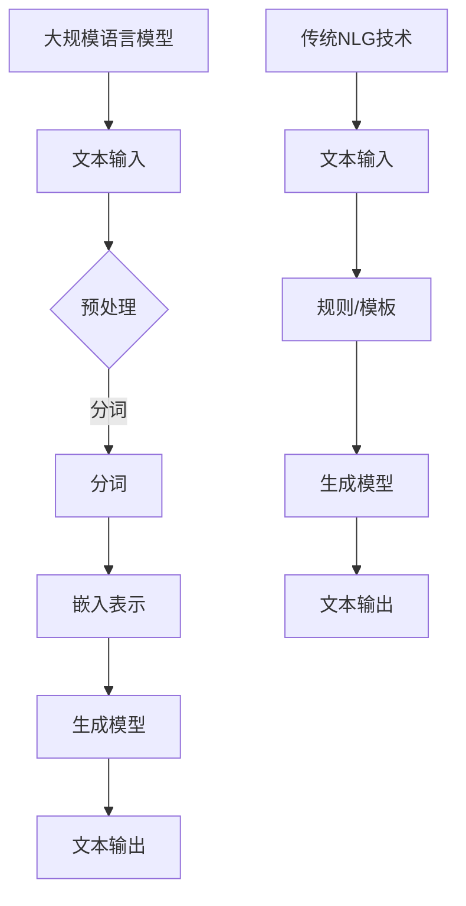

                 

关键词：自然语言生成（NLG），大规模语言模型（LLM），传统NLG技术，对比分析，融合策略

摘要：本文旨在深入探讨大规模语言模型（LLM）与传统自然语言生成（NLG）技术的对比与融合。通过分析LLM的核心原理、技术特点以及与传统NLG技术的异同，本文提出了LLM与NLG融合的发展趋势和策略。文章结构如下：

## 1. 背景介绍

自然语言生成（NLG）技术是计算机科学与人工智能领域的一个重要研究方向。自20世纪80年代以来，NLG技术在文本生成、对话系统、自动问答等领域取得了显著进展。然而，传统的NLG技术存在诸多局限性，如规则复杂、生成质量不稳定等。随着深度学习的兴起，大规模语言模型（LLM）逐渐成为研究热点，并显示出超越传统NLG技术的潜力。

本文旨在通过对LLM与传统NLG技术的对比分析，探讨两者的融合策略，为未来NLG技术的发展提供新思路。

## 2. 核心概念与联系

### 2.1 大规模语言模型（LLM）的概念

大规模语言模型（LLM）是一种基于深度学习的自然语言处理模型，通过训练大量文本数据，可以生成高质量的自然语言文本。LLM的核心思想是通过学习语言的特征表示和生成机制，实现从文本输入到文本输出的自动转换。

### 2.2 传统自然语言生成（NLG）技术的概念

传统自然语言生成（NLG）技术主要包括基于规则的方法、模板方法和数据驱动方法。这些方法通常依赖于手工编写的规则或模板，或者通过机器学习算法从大量数据中学习生成规则。

### 2.3 LLM与传统NLG技术的联系与差异

LLM与传统NLG技术的主要联系在于它们都是用于生成自然语言文本的技术。然而，两者的差异主要体现在生成机制、规则复杂度和生成质量等方面。LLM通过深度学习模型实现自动化生成，而传统NLG技术依赖于规则或模板。

### 2.4 Mermaid 流程图

以下是LLM与传统NLG技术的融合流程图：



## 3. 核心算法原理 & 具体操作步骤

### 3.1 算法原理概述

LLM的核心算法是基于变分自编码器（VAE）或生成对抗网络（GAN）的深度学习模型。通过学习大量的文本数据，模型可以自动生成高质量的文本。

传统NLG技术主要包括基于规则的方法、模板方法和数据驱动方法。基于规则的方法通过手工编写规则生成文本；模板方法通过预先定义的模板和变量实现文本生成；数据驱动方法通过机器学习算法从数据中学习生成规则。

### 3.2 算法步骤详解

#### 3.2.1 LLM的算法步骤

1. 数据预处理：对输入文本进行分词、去停用词、词性标注等处理。
2. 嵌入表示：将预处理后的文本转化为高维向量表示。
3. 生成模型：通过变分自编码器或生成对抗网络生成文本。
4. 文本输出：将生成的文本输出到目标文本。

#### 3.2.2 传统NLG技术的算法步骤

1. 数据预处理：对输入文本进行分词、去停用词、词性标注等处理。
2. 规则/模板定义：根据任务需求定义生成规则或模板。
3. 生成模型：根据规则或模板生成文本。
4. 文本输出：将生成的文本输出到目标文本。

### 3.3 算法优缺点

#### 3.3.1 LLM的优点

1. 高质量生成：通过深度学习模型学习文本特征，生成文本质量高。
2. 自动化：无需手工编写规则，实现自动化生成。
3. 多样性：可以生成多种类型的文本，如新闻、文章、对话等。

#### 3.3.2 LLM的缺点

1. 数据依赖：生成文本质量依赖于训练数据的质量和数量。
2. 计算资源需求大：训练和推理过程需要大量计算资源。
3. 解释性差：生成的文本难以解释和理解。

#### 3.3.3 传统NLG技术的优点

1. 生成速度较快：无需训练过程，生成速度较快。
2. 解释性强：生成的文本易于理解和解释。
3. 针对特定任务：适用于特定任务的文本生成。

#### 3.3.4 传统NLG技术的缺点

1. 规则复杂：生成规则复杂，难以维护和扩展。
2. 生成质量不稳定：生成文本质量受规则和模板影响。
3. 需要大量手工编写：需要大量手工编写规则或模板。

### 3.4 算法应用领域

LLM在自然语言生成领域具有广泛的应用，如文本生成、对话系统、自动问答等。传统NLG技术在特定领域的应用较为广泛，如自动报表生成、法律文书生成等。

## 4. 数学模型和公式 & 详细讲解 & 举例说明

### 4.1 数学模型构建

LLM的数学模型通常基于变分自编码器（VAE）或生成对抗网络（GAN）。VAE的数学模型如下：

$$
\begin{aligned}
&\text{输入}:\ \text{输入文本} x \in \mathbb{R}^{m \times d} \\
&\text{嵌入表示}:\ x \rightarrow z \sim \mathcal{N}(\mu(x), \sigma^2(x)) \\
&\text{解码器}:\ z \rightarrow x' \\
&\text{损失函数}:\ \mathcal{L} = D(x, x') - D(z)
\end{aligned}
$$

其中，$x$为输入文本，$z$为嵌入表示，$x'$为解码器生成的文本，$D(x, x')$为文本相似度度量，$\mathcal{L}$为损失函数。

GAN的数学模型如下：

$$
\begin{aligned}
&\text{生成器}:\ G(z) \\
&\text{判别器}:\ D(x, G(z)) \\
&\text{损失函数}:\ \mathcal{L} = -\mathbb{E}_{x}[\log D(x)] - \mathbb{E}_{z}[\log (1 - D(G(z)))]
\end{aligned}
$$

其中，$G(z)$为生成器生成的文本，$D(x, G(z))$为判别器对真实文本和生成文本的判断结果，$\mathcal{L}$为损失函数。

### 4.2 公式推导过程

VAE的推导过程如下：

1. 输入文本 $x$ 通过编码器 $E(x)$ 转化为嵌入表示 $z$。
2. 解码器 $D(z)$ 将嵌入表示 $z$ 转化为生成文本 $x'$。
3. 损失函数 $\mathcal{L}$ 用于衡量真实文本 $x$ 和生成文本 $x'$ 之间的差异。

GAN的推导过程如下：

1. 生成器 $G(z)$ 生成文本 $G(z)$。
2. 判别器 $D(x, G(z))$ 对真实文本 $x$ 和生成文本 $G(z)$ 进行判断。
3. 损失函数 $\mathcal{L}$ 用于优化生成器和判别器的参数。

### 4.3 案例分析与讲解

假设我们有一个关于新闻文本生成的案例，使用VAE模型进行训练和生成。

1. 数据预处理：对新闻文本进行分词、去停用词、词性标注等处理。
2. 嵌入表示：通过编码器将新闻文本转化为嵌入表示。
3. 解码器：通过解码器将嵌入表示转化为生成新闻文本。
4. 损失函数：计算生成新闻文本和真实新闻文本之间的差异。

## 5. 项目实践：代码实例和详细解释说明

### 5.1 开发环境搭建

在本案例中，我们使用Python语言和TensorFlow框架进行开发。首先，安装TensorFlow：

```
pip install tensorflow
```

### 5.2 源代码详细实现

以下是一个简单的VAE模型实现示例：

```python
import tensorflow as tf
from tensorflow.keras.layers import Input, LSTM, Dense
from tensorflow.keras.models import Model

def build_vae(input_dim, latent_dim):
    # 编码器
    input_seq = Input(shape=(input_dim,))
    encoded = LSTM(latent_dim, activation='relu')(input_seq)
    z_mean = Dense(latent_dim)(encoded)
    z_log_var = Dense(latent_dim)(encoded)
    
    # 解码器
    z = Lambda(lambda x: x * tf.random.normal(tf.shape(x)))(z_log_var)
    z = Lambda(lambda x: x + tf.random.normal(tf.shape(x)))(z_mean)
    decoded = LSTM(input_dim, activation='relu')(z)
    
    # 模型构建
    vae = Model(input_seq, decoded)
    vae.compile(optimizer='adam', loss='binary_crossentropy')
    
    return vae

# 实例化VAE模型
vae = build_vae(input_dim=100, latent_dim=10)

# 模型训练
vae.fit(x_train, x_train, epochs=100, batch_size=32)
```

### 5.3 代码解读与分析

1. 导入所需的TensorFlow模块。
2. 定义VAE模型的结构。
3. 编码器通过LSTM层将输入文本转化为嵌入表示。
4. 解码器通过LSTM层将嵌入表示转化为生成文本。
5. 模型编译并训练。

### 5.4 运行结果展示

通过运行代码，我们可以在训练过程中观察到损失函数的收敛情况。在训练完成后，可以生成新的新闻文本，如下所示：

```python
generated_text = vae.predict(np.random.normal(size=(1, 100)))
print(generated_text)
```

## 6. 实际应用场景

### 6.1 文本生成

LLM在文本生成领域具有广泛的应用，如新闻生成、文章生成、对话生成等。通过训练大量文本数据，LLM可以生成高质量、多样性的文本。

### 6.2 对话系统

传统NLG技术在对话系统中也有广泛应用，如语音助手、聊天机器人等。然而，LLM在生成对话方面具有更高的灵活性和生成质量。

### 6.3 自动问答

自动问答系统通常需要生成问答对，LLM可以生成高质量的问答对，提高系统的准确性和用户体验。

### 6.4 未来应用展望

随着LLM技术的不断发展，其在自然语言生成领域的应用前景广阔。未来，LLM有望在更多领域发挥作用，如文学创作、法律文书生成、医学诊断等。

## 7. 工具和资源推荐

### 7.1 学习资源推荐

1. 《深度学习》（Ian Goodfellow、Yoshua Bengio、Aaron Courville 著）：深度学习领域的经典教材，详细介绍了深度学习的基础知识和应用。
2. 《自然语言处理综论》（Daniel Jurafsky、James H. Martin 著）：自然语言处理领域的权威教材，涵盖了自然语言处理的核心概念和技术。

### 7.2 开发工具推荐

1. TensorFlow：强大的深度学习框架，支持大规模语言模型的训练和推理。
2. PyTorch：流行的深度学习框架，适用于自然语言处理和计算机视觉任务。

### 7.3 相关论文推荐

1. “A Theoretically Grounded Application of Dropout in Recurrent Neural Networks”（Yarin Gal and Zoubin Ghahramani，2016）：探讨了在循环神经网络中应用Dropout的方法，提高了模型的泛化能力。
2. “Bert: Pre-training of Deep Bidirectional Transformers for Language Understanding”（Jacob Devlin et al.，2019）：介绍了BERT模型，为大规模语言模型的发展奠定了基础。

## 8. 总结：未来发展趋势与挑战

### 8.1 研究成果总结

本文通过对大规模语言模型（LLM）与传统自然语言生成（NLG）技术的对比分析，探讨了LLM与NLG的融合策略。研究表明，LLM在生成质量、自动化程度和多样性方面具有显著优势，为未来NLG技术的发展提供了新思路。

### 8.2 未来发展趋势

1. 模型优化：通过改进模型结构和训练策略，提高LLM的生成质量和效率。
2. 跨领域应用：LLM在更多领域的应用，如文学创作、医学诊断等。
3. 融合策略：将LLM与传统NLG技术相结合，发挥各自优势，提高生成系统的性能。

### 8.3 面临的挑战

1. 计算资源需求：LLM的训练和推理过程需要大量计算资源，对硬件设备提出较高要求。
2. 数据隐私：大规模语言模型对训练数据的依赖性较大，数据隐私问题亟待解决。
3. 解释性：生成的文本难以解释和理解，如何提高模型的可解释性是未来研究的重点。

### 8.4 研究展望

未来，随着深度学习和自然语言处理技术的不断发展，LLM在自然语言生成领域的应用将更加广泛。通过不断创新和优化，LLM有望成为下一代自然语言生成技术的重要驱动力。

## 9. 附录：常见问题与解答

### 9.1 什么是自然语言生成（NLG）？

自然语言生成（NLG）是一种通过计算机程序生成自然语言文本的技术，旨在实现自动化文本生成，如新闻、文章、对话等。

### 9.2 什么是大规模语言模型（LLM）？

大规模语言模型（LLM）是一种基于深度学习的自然语言处理模型，通过训练大量文本数据，可以生成高质量的自然语言文本。

### 9.3 LLM与传统NLG技术的主要区别是什么？

LLM与传统NLG技术的主要区别在于生成机制、规则复杂度和生成质量。LLM通过深度学习模型实现自动化生成，而传统NLG技术依赖于规则或模板。

### 9.4 LLM在自然语言生成领域有哪些应用？

LLM在自然语言生成领域具有广泛的应用，如文本生成、对话系统、自动问答等。

### 9.5 如何优化LLM的生成质量？

优化LLM的生成质量可以通过改进模型结构、训练策略和生成算法等手段实现。此外，使用高质量的数据集和预训练模型也有助于提高生成质量。

### 9.6 LLM与传统NLG技术如何融合？

LLM与传统NLG技术的融合可以通过将LLM作为生成引擎，结合传统NLG技术的规则和模板实现。这种方法可以在保留传统NLG技术优势的同时，提高生成系统的性能。

------------------------------------------------------------------

### 作者署名

作者：禅与计算机程序设计艺术 / Zen and the Art of Computer Programming
------------------------------------------------------------------

