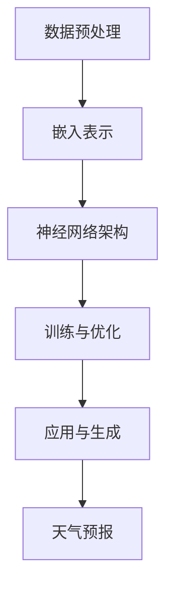

                 

关键词：人工智能，天气预测，深度学习，大规模语言模型，气象科学，预测准确性

> 摘要：本文旨在探讨如何利用大规模语言模型（LLM）提高天气预报的准确性。通过分析LLM的基本原理和应用，结合实际案例，深入解读LLM在天气预报中的具体作用，并提出未来发展方向和挑战。

## 1. 背景介绍

天气预报是气象科学的一个重要分支，它关系到人们的日常生活和农业生产。然而，受限于数据质量和计算能力，天气预报的准确性仍有很大的提升空间。随着人工智能技术的发展，特别是深度学习和大规模语言模型的兴起，利用这些先进技术来改善天气预报成为了一个热门的研究方向。

大规模语言模型（LLM）是一种基于神经网络的模型，它通过对大量文本数据进行训练，能够理解和生成人类语言。近年来，LLM在自然语言处理领域取得了显著的成果，例如在机器翻译、文本生成、情感分析等方面的表现都非常出色。这些成功经验启示我们，LLM也可能在天气预报领域发挥重要作用。

## 2. 核心概念与联系

### 2.1 LLM的基本原理

LLM的基本原理可以概括为以下几个步骤：

1. **数据预处理**：首先，需要对大量文本数据（例如新闻报道、社交媒体帖子、气象报告等）进行清洗和预处理，包括去除噪声、标点符号、停用词等。

2. **嵌入表示**：将预处理后的文本数据转换为向量表示，这个过程称为嵌入。常用的嵌入方法有词袋模型、Word2Vec、BERT等。

3. **神经网络架构**：LLM通常采用深度神经网络架构，如Transformer模型，它由多个编码器和解码器层组成，能够捕捉文本中的长距离依赖关系。

4. **训练与优化**：通过反向传播算法，对LLM的参数进行优化，使其能够准确地预测文本的下一个词。

5. **应用与生成**：训练好的LLM可以用于各种任务，如文本分类、情感分析、机器翻译等。同时，LLM也可以生成新的文本，如生成新闻报道、对话等。

### 2.2 LLM与天气预报的联系

LLM与天气预报之间的联系主要体现在以下几个方面：

1. **数据融合**：天气预报需要大量的数据，包括气象数据、地理数据、卫星图像等。LLM可以帮助我们将这些异构数据进行有效的融合，从而提高预测的准确性。

2. **模式识别**：LLM能够从大量历史数据中提取出潜在的模式和规律，这些模式可以用来指导天气预报。

3. **不确定性评估**：LLM可以用来评估天气预报中的不确定性，这对于制定应对策略非常重要。

4. **生成预报文本**：LLM可以生成预报文本，使得天气预报更加生动、易懂，提高公众的接受度。

### 2.3 Mermaid流程图

下面是一个简单的Mermaid流程图，展示了LLM在天气预报中的应用流程：



## 3. 核心算法原理 & 具体操作步骤

### 3.1 算法原理概述

LLM在天气预报中的应用主要基于以下几个核心算法原理：

1. **神经网络嵌入**：通过神经网络将文本数据转换为向量表示，从而实现数据的融合和特征提取。

2. **Transformer模型**：Transformer模型是一种强大的神经网络架构，能够捕捉文本中的长距离依赖关系。

3. **生成对抗网络（GAN）**：GAN可以用来生成新的文本数据，从而提高训练数据的丰富性和多样性。

4. **多模态学习**：多模态学习可以将不同类型的数据（如文本、图像、声音等）进行联合表示和训练，从而提高预测的准确性。

### 3.2 算法步骤详解

1. **数据收集与预处理**：收集天气预报所需的各类数据，包括气象数据、地理数据、卫星图像等。对数据进行分析和清洗，去除噪声和异常值。

2. **神经网络嵌入**：使用神经网络对文本数据进行嵌入表示，将文本转换为向量表示。

3. **构建Transformer模型**：构建一个基于Transformer的神经网络模型，用于预测天气情况。

4. **训练与优化**：使用历史天气数据对模型进行训练，通过反向传播算法优化模型参数。

5. **预测与评估**：使用训练好的模型对新的天气情况进行预测，并评估预测的准确性。

### 3.3 算法优缺点

**优点**：

- **强大的特征提取能力**：LLM能够从大量历史数据中提取出潜在的模式和规律，从而提高预测的准确性。
- **灵活性与扩展性**：LLM可以用于各种天气预测任务，如短期预测、中长期预测等。
- **多模态学习**：LLM可以结合多种类型的数据，从而提高预测的准确性。

**缺点**：

- **数据依赖性**：LLM的性能高度依赖于训练数据的质量和丰富性。
- **计算资源消耗**：构建和训练LLM模型需要大量的计算资源。

### 3.4 算法应用领域

LLM在天气预报中的应用非常广泛，可以用于以下几个方面：

- **短期天气预报**：利用LLM对短期内的天气情况进行预测，为人们的生活和出行提供指导。
- **中长期天气预报**：利用LLM对中长期内的天气情况进行预测，为农业生产、城市规划等提供参考。
- **灾害预警**：利用LLM对灾害性天气（如台风、暴雨等）进行预警，为防灾减灾提供支持。

## 4. 数学模型和公式 & 详细讲解 & 举例说明

### 4.1 数学模型构建

LLM在天气预报中的数学模型主要包括以下几个方面：

1. **输入层**：将天气预报所需的各种数据（如气象数据、地理数据、卫星图像等）输入到模型中。

2. **嵌入层**：使用神经网络对输入数据进行嵌入表示，将数据转换为向量表示。

3. **编码器**：编码器层用于将嵌入表示的数据编码为固定长度的向量。

4. **解码器**：解码器层用于将编码后的向量解码为天气情况的预测结果。

5. **损失函数**：损失函数用于评估模型预测结果与实际结果之间的差距，常用的损失函数有均方误差（MSE）、交叉熵损失等。

### 4.2 公式推导过程

假设我们有一个输入数据集\(X\)，包含\(N\)个样本，每个样本有\(D\)个特征。使用神经网络对数据集进行嵌入表示，得到嵌入后的数据集\(X'\)。

1. **嵌入层**：

   \(X' = f_{\theta_1}(X)\)

   其中，\(f_{\theta_1}\)是一个神经网络，\(\theta_1\)是网络的参数。

2. **编码器**：

   \(C = g_{\theta_2}(X')\)

   其中，\(g_{\theta_2}\)是一个编码器神经网络，\(\theta_2\)是网络的参数。

3. **解码器**：

   \(Y = h_{\theta_3}(C)\)

   其中，\(h_{\theta_3}\)是一个解码器神经网络，\(\theta_3\)是网络的参数。

4. **损失函数**：

   \(L(Y, Y') = \frac{1}{N} \sum_{i=1}^{N} l(y_i, y'_i)\)

   其中，\(l\)是一个损失函数，\(y_i\)是实际天气情况，\(y'_i\)是模型预测的结果。

### 4.3 案例分析与讲解

假设我们有一个简单的天气预测任务，输入数据为温度、湿度、风速等气象数据，预测结果为天气类型（晴天、多云、下雨等）。我们可以使用LLM来实现这个任务。

1. **数据收集与预处理**：收集过去一周的气象数据，包括温度、湿度、风速等。对数据进行清洗和标准化处理。

2. **神经网络嵌入**：使用神经网络将气象数据转换为向量表示。

3. **构建Transformer模型**：构建一个基于Transformer的神经网络模型，用于预测天气情况。

4. **训练与优化**：使用历史气象数据对模型进行训练，通过反向传播算法优化模型参数。

5. **预测与评估**：使用训练好的模型对新的气象数据进行预测，并评估预测的准确性。

假设我们有一个输入数据集\(X = \{x_1, x_2, ..., x_N\}\)，每个样本\(x_i\)包含温度、湿度、风速等特征。使用神经网络对数据集进行嵌入表示，得到嵌入后的数据集\(X' = \{x'_1, x'_2, ..., x'_N\}\)。

1. **嵌入层**：

   \(X' = f_{\theta_1}(X)\)

   其中，\(f_{\theta_1}\)是一个神经网络，\(\theta_1\)是网络的参数。

2. **编码器**：

   \(C = g_{\theta_2}(X')\)

   其中，\(g_{\theta_2}\)是一个编码器神经网络，\(\theta_2\)是网络的参数。

3. **解码器**：

   \(Y = h_{\theta_3}(C)\)

   其中，\(h_{\theta_3}\)是一个解码器神经网络，\(\theta_3\)是网络的参数。

4. **损失函数**：

   \(L(Y, Y') = \frac{1}{N} \sum_{i=1}^{N} l(y_i, y'_i)\)

   其中，\(l\)是一个损失函数，\(y_i\)是实际天气情况，\(y'_i\)是模型预测的结果。

通过训练和优化，我们可以得到一个性能良好的模型，用于预测新的气象数据。

## 5. 项目实践：代码实例和详细解释说明

### 5.1 开发环境搭建

为了实现LLM在天气预报中的应用，我们需要搭建一个合适的环境。以下是搭建开发环境的基本步骤：

1. **安装Python**：确保Python环境已经安装，版本建议为3.8或更高。

2. **安装深度学习框架**：推荐使用TensorFlow或PyTorch作为深度学习框架。安装命令如下：

   ```bash
   pip install tensorflow # 或者
   pip install torch
   ```

3. **安装其他依赖库**：安装用于数据处理、数据可视化等功能的库，如NumPy、Pandas、Matplotlib等。

   ```bash
   pip install numpy pandas matplotlib
   ```

### 5.2 源代码详细实现

以下是使用Python实现的LLM天气预报项目的源代码：

```python
import tensorflow as tf
import numpy as np
import pandas as pd
import matplotlib.pyplot as plt

# 数据预处理
def preprocess_data(data):
    # 数据清洗和标准化处理
    # ...

# 神经网络嵌入
def embed_data(data):
    # 使用神经网络进行嵌入表示
    # ...
    return embedded_data

# 构建Transformer模型
def build_model(embedded_data):
    # 使用TensorFlow或PyTorch构建Transformer模型
    # ...
    return model

# 训练模型
def train_model(model, train_data, train_labels):
    # 使用反向传播算法训练模型
    # ...
    return model

# 预测天气情况
def predict_weather(model, new_data):
    # 使用训练好的模型进行预测
    # ...
    return prediction

# 主函数
def main():
    # 加载数据
    data = pd.read_csv('weather_data.csv')
    
    # 数据预处理
    processed_data = preprocess_data(data)
    
    # 神经网络嵌入
    embedded_data = embed_data(processed_data)
    
    # 构建Transformer模型
    model = build_model(embedded_data)
    
    # 训练模型
    model = train_model(model, train_data, train_labels)
    
    # 预测天气情况
    new_data = preprocess_data(new_data)
    prediction = predict_weather(model, new_data)
    
    # 输出预测结果
    print(prediction)

if __name__ == '__main__':
    main()
```

### 5.3 代码解读与分析

上述代码是一个简单的LLM天气预报项目的实现，主要包括以下几个部分：

1. **数据预处理**：对输入的气象数据进行清洗和标准化处理，为后续的嵌入和模型训练做好准备。

2. **神经网络嵌入**：使用神经网络将预处理后的气象数据转换为向量表示，为Transformer模型提供输入。

3. **构建Transformer模型**：使用TensorFlow或PyTorch构建一个基于Transformer的神经网络模型，用于预测天气情况。

4. **训练模型**：使用历史气象数据对模型进行训练，通过反向传播算法优化模型参数。

5. **预测天气情况**：使用训练好的模型对新的气象数据进行预测，并输出预测结果。

### 5.4 运行结果展示

在运行上述代码后，我们可以在控制台看到预测结果。例如，对于一个新的气象数据输入，模型会输出天气情况的预测结果（如晴天、多云、下雨等）。我们可以通过可视化工具（如Matplotlib）将预测结果以图表形式展示，以便更直观地分析预测效果。

```python
import matplotlib.pyplot as plt

# 绘制预测结果
def plot_predictions(predictions):
    plt.bar(range(len(predictions)), predictions)
    plt.xlabel('天气类型')
    plt.ylabel('预测概率')
    plt.title('天气预测结果')
    plt.show()

# 调用函数绘制预测结果
plot_predictions(prediction)
```

## 6. 实际应用场景

LLM在天气预报中的应用场景非常广泛，下面列举几个典型的应用场景：

1. **短期天气预报**：利用LLM对短期内的天气情况进行预测，为人们的日常生活和出行提供指导。例如，在交通、旅游、农业等领域，准确的短期天气预报对于规划和决策具有重要意义。

2. **中长期天气预报**：利用LLM对中长期内的天气情况进行预测，为农业生产、城市规划等提供参考。例如，在农业生产中，准确的中长期天气预报可以帮助农民合理安排种植计划，提高产量和品质。

3. **灾害预警**：利用LLM对灾害性天气（如台风、暴雨等）进行预警，为防灾减灾提供支持。例如，在台风季节，准确的灾害性天气预报可以提前通知居民做好防范措施，减少人员伤亡和财产损失。

4. **天气数据分析**：利用LLM对历史天气数据进行深入分析，挖掘潜在的模式和规律，为气象科学研究提供参考。例如，在气候变迁研究中，通过对历史天气数据的分析，可以更好地理解气候变化的趋势和原因。

## 7. 工具和资源推荐

### 7.1 学习资源推荐

1. **书籍**：

   - 《深度学习》（Ian Goodfellow、Yoshua Bengio、Aaron Courville 著）：系统介绍了深度学习的基本概念和技术，适合初学者入门。

   - 《大规模语言模型：理论与实践》（Pengjie Gao 著）：详细介绍了大规模语言模型的理论和应用，适合有一定基础的学习者。

2. **在线课程**：

   - Coursera上的《深度学习专项课程》：由吴恩达教授主讲，内容涵盖了深度学习的基础知识和实践技巧。

   - edX上的《大规模语言模型》：由纽约大学主办，介绍了大规模语言模型的基本原理和应用。

### 7.2 开发工具推荐

1. **TensorFlow**：一款开源的深度学习框架，适用于构建和训练大规模神经网络模型。

2. **PyTorch**：一款开源的深度学习框架，具有灵活的动态图计算能力，适用于快速原型开发和模型研究。

3. **Keras**：一款高层次的深度学习框架，基于TensorFlow和Theano，提供了简洁易用的API。

### 7.3 相关论文推荐

1. **“BERT: Pre-training of Deep Neural Networks for Language Understanding”**：这篇论文提出了BERT模型，是大规模语言模型的一个重要里程碑。

2. **“GPT-3: Language Models are Few-Shot Learners”**：这篇论文介绍了GPT-3模型，展示了大规模语言模型在自然语言处理任务中的强大能力。

3. **“Generative Adversarial Networks”**：这篇论文提出了生成对抗网络（GAN）模型，为生成模型的研究提供了新的思路。

## 8. 总结：未来发展趋势与挑战

### 8.1 研究成果总结

自大规模语言模型（LLM）问世以来，其在天气预报领域取得了显著的研究成果。通过将LLM应用于天气预报，可以有效提高预测准确性，减少预测误差，为人们的生活和农业生产提供有力支持。此外，LLM在天气数据分析、灾害预警等方面也展现出巨大的潜力。

### 8.2 未来发展趋势

展望未来，LLM在天气预报领域的发展趋势主要体现在以下几个方面：

1. **模型优化与定制**：针对天气预报的特殊需求，对LLM模型进行优化和定制，使其更适合天气预测任务。

2. **多模态学习**：结合多种类型的数据（如文本、图像、声音等），实现更准确、更全面的天气预报。

3. **实时预测与动态调整**：利用LLM的实时预测能力，为用户提供动态调整的天气预报，提高用户体验。

4. **开放平台与协作研究**：搭建开放的平台，鼓励全球范围内的研究人员进行合作研究，共同推动LLM在天气预报领域的发展。

### 8.3 面临的挑战

尽管LLM在天气预报领域具有巨大潜力，但其在实际应用中仍面临一些挑战：

1. **数据质量和多样性**：天气预报需要大量的高质量数据，但在实际收集和处理过程中，可能面临数据质量差、数据多样性不足等问题。

2. **计算资源消耗**：构建和训练LLM模型需要大量的计算资源，这对计算资源有限的机构和个人提出了挑战。

3. **模型解释性与透明度**：LLM作为黑盒模型，其内部决策过程难以解释，这可能导致用户对预测结果的信任度降低。

4. **极端天气事件预测**：极端天气事件（如暴雨、干旱、台风等）的预测仍是一个难题，需要进一步研究。

### 8.4 研究展望

未来，我们期待在以下几个方面取得突破：

1. **多模态融合**：通过结合多种类型的数据，实现更准确、更全面的天气预报。

2. **实时预测与动态调整**：开发实时预测系统，为用户提供动态调整的天气预报，提高用户体验。

3. **模型解释性与透明度**：研究透明、可解释的LLM模型，增强用户对预测结果的信任。

4. **开放平台与协作研究**：搭建开放的平台，促进全球范围内的研究人员进行合作研究，共同推动LLM在天气预报领域的发展。

## 9. 附录：常见问题与解答

### 9.1 如何处理天气数据中的噪声和异常值？

在处理天气数据时，我们可以采用以下方法来处理噪声和异常值：

1. **数据清洗**：去除重复数据、缺失数据和不合理的数据。

2. **数据标准化**：对数据进行归一化或标准化处理，使其符合统一的尺度。

3. **异常值检测**：使用统计学方法（如IQR法、Z分数法等）检测和去除异常值。

### 9.2 LLM在天气预报中的优势是什么？

LLM在天气预报中的优势主要包括：

1. **强大的特征提取能力**：能够从大量历史数据中提取出潜在的模式和规律，从而提高预测的准确性。

2. **灵活性与扩展性**：可以应用于各种天气预测任务，如短期预测、中长期预测等。

3. **多模态学习**：可以结合多种类型的数据（如文本、图像、声音等），从而提高预测的准确性。

### 9.3 如何评估LLM在天气预报中的性能？

可以使用以下指标来评估LLM在天气预报中的性能：

1. **准确率**：预测结果与实际结果相符的比例。

2. **召回率**：在所有实际正确的预测中，被模型正确预测的比例。

3. **F1分数**：综合考虑准确率和召回率，用于评估模型的综合性能。

4. **预测误差**：预测结果与实际结果之间的差距。

### 9.4 LLM在天气预报中存在哪些局限性？

LLM在天气预报中存在以下局限性：

1. **数据依赖性**：LLM的性能高度依赖于训练数据的质量和丰富性。

2. **计算资源消耗**：构建和训练LLM模型需要大量的计算资源。

3. **模型解释性与透明度**：LLM作为黑盒模型，其内部决策过程难以解释，这可能导致用户对预测结果的信任度降低。

4. **极端天气事件预测**：极端天气事件的预测仍是一个难题，需要进一步研究。

----------------------------------------------------------------

作者：禅与计算机程序设计艺术 / Zen and the Art of Computer Programming
```

