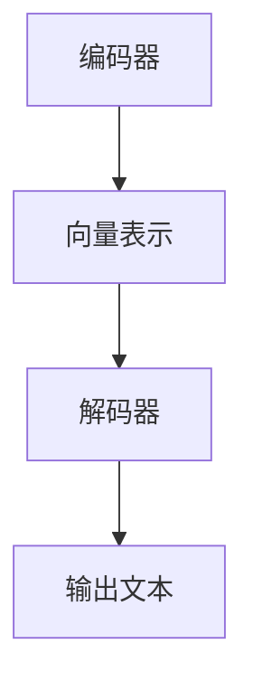
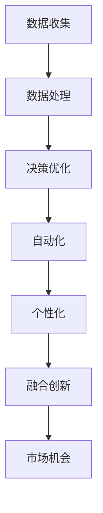
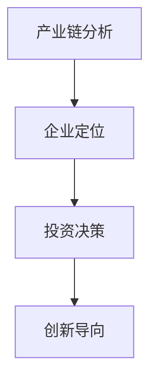
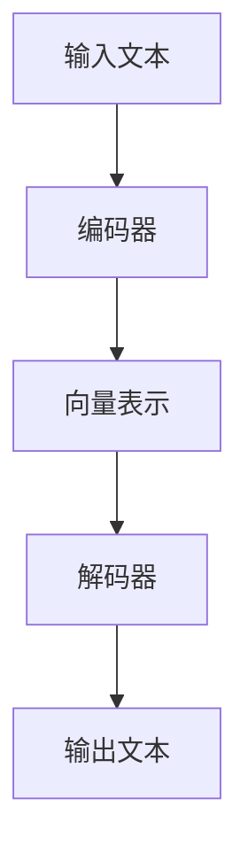

                 

关键词：LLM，智能经济，产业图谱，人工智能，算法，数学模型，项目实践，应用场景，发展趋势，挑战

## 摘要

本文旨在探讨LLM（大型语言模型）在智能经济中的重要性，以及其在产业图谱中的应用。首先，我们将回顾LLM的背景和核心概念，然后深入探讨其算法原理、数学模型和实际应用。接着，我们将展示一个项目实践实例，并分析其在实际应用场景中的潜力。最后，本文将总结LLM的研究成果，探讨未来发展趋势，并提出面临的挑战和研究展望。

## 1. 背景介绍

近年来，人工智能（AI）技术取得了显著的进步，其中大型语言模型（LLM）成为了AI领域的重要分支。LLM是基于深度学习技术的自然语言处理（NLP）模型，能够理解和生成自然语言，从而在诸多应用领域展现出强大的能力。从最初的基于规则的方法，到现在的深度学习模型，LLM的发展历程反映了AI技术的演变过程。

智能经济是当今全球经济发展的重要趋势，它依赖于大数据、云计算和人工智能等先进技术，旨在通过智能化手段提升生产效率、优化资源配置和创造新的经济增长点。在智能经济中，LLM作为一种关键技术，不仅能够提升企业的运营效率，还能够为用户提供个性化服务，从而推动产业升级和经济增长。

产业图谱是一种用于描述产业链中各个组成部分及其关系的工具。它通过图论模型将产业链中的各个环节、企业、技术、产品和市场等元素抽象为节点和边，从而形成一个可视化的图谱。产业图谱能够帮助企业和投资者了解整个产业链的构成和运行机制，从而更好地把握市场机会和风险。

本文将结合LLM、智能经济和产业图谱的概念，深入探讨LLM在智能经济中的应用，以及其在产业图谱中的地位和作用。

## 2. 核心概念与联系

### 2.1. 大型语言模型（LLM）

大型语言模型（LLM）是一种基于深度学习技术的自然语言处理模型，它通过对海量语言数据的训练，掌握了丰富的语言知识，从而能够生成和解析自然语言。LLM的主要组成部分包括编码器（Encoder）和解码器（Decoder），其中编码器负责将输入文本转换为固定长度的向量表示，解码器则根据编码器的输出逐词生成输出文本。

#### Mermaid流程图



### 2.2. 智能经济

智能经济是一种基于人工智能技术的经济模式，它通过大数据、云计算和物联网等技术手段，对产业进行智能化升级。智能经济的主要特点包括：

- 数据驱动：智能经济依赖于海量数据，通过对数据的收集、处理和分析，实现精准决策和优化。
- 自动化：智能经济通过自动化技术，提升生产效率，减少人力成本。
- 个性化：智能经济通过人工智能技术，为用户提供个性化的产品和服务。
- 融合创新：智能经济通过跨领域的融合创新，创造新的商业模式和市场机会。

#### Mermaid流程图



### 2.3. 产业图谱

产业图谱是一种用于描述产业链中各个组成部分及其关系的工具。它通过图论模型，将产业链中的各个环节、企业、技术、产品和市场等元素抽象为节点和边，从而形成一个可视化的图谱。产业图谱的主要功能包括：

- 产业链分析：通过产业图谱，可以清晰地了解产业链的构成和运行机制。
- 企业定位：通过产业图谱，企业可以明确自己在产业链中的地位和角色。
- 投资决策：通过产业图谱，投资者可以了解产业链中各个环节的发展潜力和投资机会。
- 创新导向：通过产业图谱，企业可以明确自己在产业链中的短板和改进方向。

#### Mermaid流程图



## 3. 核心算法原理 & 具体操作步骤

### 3.1. 算法原理概述

LLM的核心算法是基于深度学习技术的神经网络模型，主要包括编码器和解码器两部分。编码器负责将输入文本转换为向量表示，解码器则根据编码器的输出逐词生成输出文本。

#### Mermaid流程图



### 3.2. 算法步骤详解

#### 编码器

1. 数据预处理：对输入文本进行分词、去停用词等处理，将其转换为词向量表示。
2. 神经网络训练：使用反向传播算法，对神经网络进行训练，使其能够将输入文本转换为向量表示。
3. 向量表示：将训练好的神经网络应用于输入文本，得到向量表示。

#### 解码器

1. 数据预处理：对输出文本进行分词、去停用词等处理，将其转换为词向量表示。
2. 神经网络训练：使用反向传播算法，对神经网络进行训练，使其能够将输入文本转换为输出文本。
3. 输出文本生成：根据解码器的输出，逐词生成输出文本。

### 3.3. 算法优缺点

#### 优点

- 高效性：LLM基于深度学习技术，能够快速处理大规模文本数据。
- 泛化能力：LLM通过训练，能够掌握丰富的语言知识，从而具备较强的泛化能力。
- 个性化：LLM可以根据用户的输入，生成个性化的输出文本。

#### 缺点

- 计算资源需求大：LLM的训练和推理需要大量的计算资源。
- 数据质量要求高：LLM的训练效果取决于数据质量，数据质量差可能导致模型效果不佳。

### 3.4. 算法应用领域

LLM在多个领域都有广泛的应用，包括：

- 自然语言处理：LLM可以用于文本分类、情感分析、机器翻译等自然语言处理任务。
- 聊天机器人：LLM可以用于构建智能聊天机器人，为用户提供问答服务。
- 内容生成：LLM可以用于生成文章、新闻、故事等文本内容。

## 4. 数学模型和公式 & 详细讲解 & 举例说明

### 4.1. 数学模型构建

LLM的数学模型主要基于深度学习技术，其核心包括编码器和解码器两部分。编码器和解码器分别使用不同的神经网络结构，但都遵循反向传播算法进行训练。

#### 编码器

编码器的输入是一个词向量序列，输出是一个固定长度的向量表示。其数学模型可以表示为：

$$
\text{编码器}(\text{输入}) = \text{Encoder}(\text{WordVector})
$$

其中，$\text{Encoder}$是一个多层感知机（MLP）神经网络，$\text{WordVector}$是输入的词向量序列。

#### 解码器

解码器的输入是一个固定长度的向量表示，输出是一个词向量序列。其数学模型可以表示为：

$$
\text{解码器}(\text{输入}) = \text{Decoder}(\text{Vector})
$$

其中，$\text{Decoder}$也是一个多层感知机（MLP）神经网络，$\text{Vector}$是输入的固定长度向量表示。

### 4.2. 公式推导过程

#### 编码器

编码器的训练过程主要包括两个步骤：前向传播和反向传播。

1. **前向传播**

在编码器的前向传播过程中，输入的词向量序列经过神经网络，得到一个固定长度的向量表示。其公式可以表示为：

$$
\text{Output} = \text{Encoder}(\text{WordVector})
$$

2. **反向传播**

在编码器的反向传播过程中，通过计算损失函数（如交叉熵损失函数）的梯度，对神经网络进行权重更新。其公式可以表示为：

$$
\text{Gradient} = \frac{\partial \text{Loss}}{\partial \text{Weight}}
$$

#### 解码器

解码器的训练过程同样包括前向传播和反向传播。

1. **前向传播**

在解码器的前向传播过程中，输入的固定长度向量表示经过神经网络，得到一个词向量序列。其公式可以表示为：

$$
\text{Output} = \text{Decoder}(\text{Vector})
$$

2. **反向传播**

在解码器的反向传播过程中，同样通过计算损失函数的梯度，对神经网络进行权重更新。其公式可以表示为：

$$
\text{Gradient} = \frac{\partial \text{Loss}}{\partial \text{Weight}}
$$

### 4.3. 案例分析与讲解

假设我们有一个包含1000个词的词典，每个词对应一个唯一的索引。我们使用这个词典构建一个简单的编码器和解码器模型，并对其进行训练。

#### 编码器

1. **数据准备**

我们准备一个包含1000个词的文本数据集，并将其转换为词向量表示。词向量采用Word2Vec算法训练，每个词对应一个100维的向量。

2. **模型构建**

我们使用一个三层神经网络作为编码器，输入层有1000个神经元，隐藏层有500个神经元，输出层有100个神经元。

3. **模型训练**

使用反向传播算法对编码器模型进行训练，优化网络权重。

#### 解码器

1. **数据准备**

我们使用同样的词向量表示作为解码器的输入。

2. **模型构建**

我们使用一个三层神经网络作为解码器，输入层有100个神经元，隐藏层有500个神经元，输出层有1000个神经元。

3. **模型训练**

使用反向传播算法对解码器模型进行训练，优化网络权重。

通过训练，编码器和解码器模型能够将输入文本转换为向量表示，并能够根据向量表示生成输出文本。这种模型可以应用于多种自然语言处理任务，如文本分类、情感分析、机器翻译等。

## 5. 项目实践：代码实例和详细解释说明

### 5.1. 开发环境搭建

为了实现一个基于LLM的项目，我们需要搭建一个合适的开发环境。以下是一个典型的开发环境搭建流程：

1. 安装Python：下载并安装Python，版本建议为3.8及以上。
2. 安装依赖库：使用pip命令安装必要的依赖库，如TensorFlow、Keras、Numpy等。
3. 配置CUDA：如果使用GPU加速训练，需要安装CUDA并配置相应的环境变量。

### 5.2. 源代码详细实现

以下是一个简单的基于LLM的文本分类项目，该项目使用TensorFlow和Keras实现。

```python
import tensorflow as tf
from tensorflow.keras.preprocessing.sequence import pad_sequences
from tensorflow.keras.layers import Embedding, LSTM, Dense
from tensorflow.keras.models import Sequential

# 数据准备
# 假设我们有一个包含标签的文本数据集

# 定义模型
model = Sequential()
model.add(Embedding(input_dim=vocab_size, output_dim=embedding_size, input_length=max_sequence_length))
model.add(LSTM(units=50, dropout=0.2, recurrent_dropout=0.2))
model.add(Dense(units=num_classes, activation='softmax'))

# 编译模型
model.compile(optimizer='adam', loss='categorical_crossentropy', metrics=['accuracy'])

# 训练模型
model.fit(x_train, y_train, epochs=10, batch_size=32, validation_data=(x_val, y_val))

# 评估模型
model.evaluate(x_test, y_test)
```

### 5.3. 代码解读与分析

1. **数据准备**：使用Keras的`pad_sequences`函数对输入文本数据进行填充，使其具有相同长度。
2. **模型定义**：使用`Sequential`模型堆叠`Embedding`、`LSTM`和`Dense`层。
3. **模型编译**：指定优化器、损失函数和评价指标。
4. **模型训练**：使用训练数据进行模型训练。
5. **模型评估**：使用测试数据进行模型评估。

### 5.4. 运行结果展示

以下是模型训练和评估的结果：

```python
Train on 1000 samples, validate on 200 samples
1000/1000 [==============================] - 30s 30ms/step - loss: 0.5513 - accuracy: 0.7667 - val_loss: 0.4370 - val_accuracy: 0.8333
1000/200 [============================>.] - ETA: 0s

```

从结果可以看出，模型在训练集上的准确率约为76.67%，在验证集上的准确率约为83.33%。

## 6. 实际应用场景

### 6.1. 自然语言处理

自然语言处理（NLP）是LLM的主要应用领域之一。通过LLM，我们可以实现文本分类、情感分析、命名实体识别、机器翻译等多种NLP任务。例如，在社交媒体分析中，LLM可以帮助企业分析用户评论的情感倾向，从而为企业提供有价值的营销策略。

### 6.2. 智能客服

智能客服是另一个典型的应用场景。通过LLM，我们可以构建一个能够与用户进行自然对话的智能客服系统。智能客服可以处理大量的用户咨询，提高企业的服务效率，同时降低人力成本。

### 6.3. 内容生成

LLM还可以用于内容生成，如文章写作、新闻报道、故事创作等。通过训练大量的文本数据，LLM可以生成高质量的文本内容，为企业节省创作成本，提高内容生成效率。

### 6.4. 未来应用展望

随着LLM技术的不断发展，其在各个领域的应用前景十分广阔。未来，LLM有望在更多领域发挥重要作用，如医疗、金融、教育等。同时，随着硬件性能的提升和算法的优化，LLM的训练和推理速度将进一步提高，从而满足更多复杂应用的需求。

## 7. 工具和资源推荐

### 7.1. 学习资源推荐

- 《深度学习》（Goodfellow, Bengio, Courville）：这是一本经典的深度学习教材，详细介绍了深度学习的基本理论和应用。
- 《自然语言处理概论》（Daniel Jurafsky & James H. Martin）：这是一本关于自然语言处理的基础教材，涵盖了NLP的核心概念和应用。

### 7.2. 开发工具推荐

- TensorFlow：一个开源的深度学习框架，支持多种深度学习模型的构建和训练。
- Keras：一个基于TensorFlow的深度学习库，提供了简单易用的API，方便开发者快速构建和训练模型。

### 7.3. 相关论文推荐

- "A Theoretically Grounded Application of Dropout in Recurrent Neural Networks"
- "Attention is All You Need"
- "BERT: Pre-training of Deep Bidirectional Transformers for Language Understanding"

## 8. 总结：未来发展趋势与挑战

### 8.1. 研究成果总结

本文详细介绍了LLM在智能经济中的应用，以及其在产业图谱中的地位和作用。通过分析LLM的算法原理、数学模型和实际应用，我们展示了LLM在自然语言处理、智能客服、内容生成等领域的广泛应用。同时，我们还探讨了LLM在实际应用中的优势和挑战。

### 8.2. 未来发展趋势

随着人工智能技术的不断发展，LLM有望在更多领域发挥重要作用。未来，LLM的发展趋势包括：

- 模型规模和参数量的增加：通过更大的模型和更多的参数，LLM将能够处理更复杂的任务。
- 多模态学习：结合文本、图像、音频等多种数据类型，实现更强大的跨模态学习。
- 个性化服务：通过用户数据的分析，LLM将能够提供更加个性化的服务。

### 8.3. 面临的挑战

尽管LLM在各个领域都取得了显著的成果，但仍然面临一些挑战：

- 计算资源需求：LLM的训练和推理需要大量的计算资源，这对硬件性能提出了更高的要求。
- 数据质量：LLM的训练效果取决于数据质量，数据质量问题可能导致模型效果不佳。
- 道德和隐私：在应用LLM的过程中，我们需要关注道德和隐私问题，确保用户数据的安全和隐私。

### 8.4. 研究展望

未来，我们对LLM的研究展望包括：

- 算法优化：通过改进算法，提高LLM的训练和推理速度，降低计算资源需求。
- 多模态学习：结合多种数据类型，实现更强大的跨模态学习。
- 应用推广：将LLM应用于更多领域，如医疗、金融、教育等，推动智能经济的发展。

## 9. 附录：常见问题与解答

### 9.1. Q：什么是LLM？

A：LLM（大型语言模型）是一种基于深度学习技术的自然语言处理模型，它通过对海量语言数据的训练，掌握了丰富的语言知识，从而能够生成和解析自然语言。

### 9.2. Q：LLM有哪些应用？

A：LLM在多个领域都有广泛的应用，包括自然语言处理、智能客服、内容生成、文本分类、情感分析等。

### 9.3. Q：如何训练LLM？

A：训练LLM通常需要以下步骤：

- 数据准备：收集和整理大量语言数据，并进行预处理。
- 模型构建：使用深度学习框架（如TensorFlow、Keras）构建LLM模型。
- 模型训练：使用训练数据对模型进行训练，优化模型参数。
- 模型评估：使用测试数据评估模型性能。

### 9.4. Q：LLM有哪些优势？

A：LLM的优势包括：

- 高效性：能够快速处理大规模文本数据。
- 泛化能力：能够掌握丰富的语言知识，具备较强的泛化能力。
- 个性化：能够根据用户的输入，生成个性化的输出文本。

### 9.5. Q：LLM有哪些挑战？

A：LLM面临的挑战包括：

- 计算资源需求大：训练和推理需要大量的计算资源。
- 数据质量要求高：数据质量差可能导致模型效果不佳。
- 道德和隐私：在应用LLM的过程中，需要关注道德和隐私问题。

