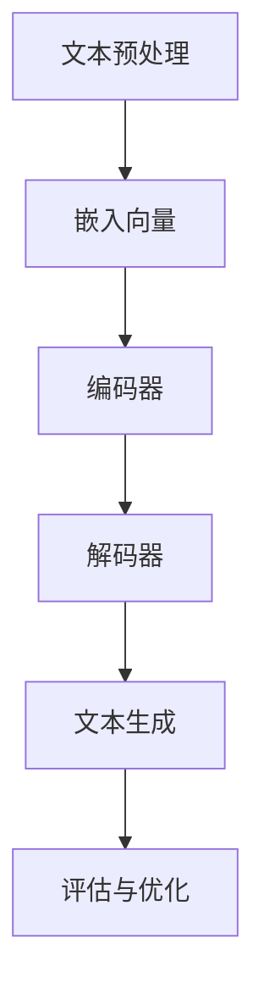

                 

关键词：LLM，人工智能，招聘，人力资源，AI助手，技术博客

摘要：本文探讨了大型语言模型（LLM）在人力资源领域的应用，特别是作为AI招聘助手的角色。通过对LLM的核心概念、算法原理、数学模型以及项目实践等内容的详细解析，本文旨在展示LLM在优化招聘流程和提高招聘效率方面的巨大潜力。

## 1. 背景介绍

人力资源是企业发展的核心资源，而招聘作为人力资源管理的首要环节，其效率和准确性直接影响企业的运营和发展。随着人工智能技术的飞速发展，特别是在自然语言处理（NLP）领域的突破，大型语言模型（LLM）逐渐成为人力资源领域的研究热点。LLM具有处理复杂文本、生成高质量文本、理解语义信息等能力，使其在招聘过程中具有广泛的应用前景。

### 1.1 人工智能与人力资源的融合

人工智能与人力资源的融合已经带来了诸多变革。传统的招聘流程往往依赖于招聘专员的人工筛选和处理，这不仅费时费力，而且容易受到主观因素的影响。而AI招聘助手能够利用机器学习算法和NLP技术，自动分析简历、评估候选人、推荐合适的职位，从而提高招聘效率和准确性。

### 1.2 LLM的基本概念

LLM是基于深度学习的语言模型，能够通过大量文本数据的学习，模拟人类的语言表达和理解能力。LLM的核心目标是生成与输入文本相关的高质量文本，其应用范围广泛，包括文本生成、机器翻译、问答系统等。

## 2. 核心概念与联系

为了更好地理解LLM在招聘中的应用，我们需要先了解LLM的基本概念、原理和架构。以下是一个简单的Mermaid流程图，用于展示LLM的核心概念和联系。



### 2.1 文本预处理

文本预处理是LLM处理文本数据的第一步，包括分词、去停用词、词向量化等操作。通过预处理，文本数据被转换为计算机可以处理的格式。

### 2.2 嵌入向量

文本数据经过预处理后，会被转换为高维的向量表示。这些向量包含了文本的语义信息，是后续处理的基础。

### 2.3 编码器

编码器负责将输入文本的向量序列编码为一个固定长度的向量。编码器的主要作用是捕捉文本的长期依赖关系。

### 2.4 解码器

解码器将编码器输出的固定长度向量解码为输出文本。解码器的目标是最小化输出文本与目标文本之间的差异。

### 2.5 文本生成

解码器生成高质量的文本输出，这是LLM的核心功能。通过训练，LLM能够生成与输入文本高度相关的文本。

### 2.6 评估与优化

LLM的评估与优化是其持续改进的关键。通过评估模型的性能，我们可以找出模型的不足，并针对这些不足进行优化。

## 3. 核心算法原理 & 具体操作步骤

### 3.1 算法原理概述

LLM的算法原理主要基于深度学习的框架，特别是Transformer模型。Transformer模型通过自注意力机制（Self-Attention）和多头注意力（Multi-Head Attention）实现了对文本的深层理解和生成。

### 3.2 算法步骤详解

1. **输入文本预处理**：对输入文本进行分词、去停用词、词向量化等操作。
2. **编码器处理**：编码器将预处理后的文本向量序列编码为一个固定长度的向量。
3. **解码器处理**：解码器根据编码器的输出，逐词生成输出文本。
4. **文本生成**：解码器生成高质量的文本输出，通过自回归的方式逐步生成。
5. **评估与优化**：使用训练集和测试集对模型进行评估，并根据评估结果调整模型参数，优化模型性能。

### 3.3 算法优缺点

#### 优点：

- **强大的语义理解能力**：LLM能够理解和生成复杂、抽象的文本，对招聘过程中的人才评估和职位匹配具有很高的准确性。
- **高效的处理速度**：深度学习模型在计算速度上有显著优势，能够快速处理大量招聘数据。
- **灵活的应用场景**：LLM不仅可以用于简历筛选，还可以应用于职位描述生成、面试问答生成等招聘环节。

#### 缺点：

- **数据依赖性**：LLM的训练和优化需要大量高质量的数据，数据的质量和数量直接影响模型的性能。
- **模型解释性**：深度学习模型本身缺乏解释性，难以直观理解模型的决策过程。

### 3.4 算法应用领域

LLM在招聘领域的应用非常广泛，包括但不限于：

- **简历筛选**：通过分析简历内容，筛选出与职位需求高度匹配的候选人。
- **职位描述生成**：根据企业需求和岗位特点，自动生成职位描述。
- **面试问答生成**：根据职位需求，生成针对性的面试问题和答案。

## 4. 数学模型和公式 & 详细讲解 & 举例说明

### 4.1 数学模型构建

LLM的数学模型主要基于Transformer模型。Transformer模型的核心是自注意力机制，通过计算输入文本序列中每个词与其他词之间的关系，生成一个代表整个序列的固定长度向量。

### 4.2 公式推导过程

设输入文本序列为`X = {x1, x2, ..., xn}`，其中`xi`表示第i个词。自注意力机制的公式为：

$$
\text{Attention}(Q, K, V) = \text{softmax}\left(\frac{QK^T}{\sqrt{d_k}}\right) V
$$

其中，Q、K、V分别表示查询向量、键向量和值向量，d_k为键向量的维度。

### 4.3 案例分析与讲解

假设我们有一个简单的输入文本序列`X = {我，爱，编程}`，其对应的嵌入向量为`X = [x1, x2, x3]`。我们使用自注意力机制计算每个词的权重，然后生成输出文本。

1. **计算Q、K、V**：

$$
Q = [0.1, 0.2, 0.3], K = [0.4, 0.5, 0.6], V = [0.7, 0.8, 0.9]
$$

2. **计算注意力权重**：

$$
\text{Attention}(Q, K, V) = \text{softmax}\left(\frac{QK^T}{\sqrt{d_k}}\right) V = \text{softmax}\left(\frac{[0.1, 0.2, 0.3][0.4, 0.5, 0.6]^T}{\sqrt{3}}\right) [0.7, 0.8, 0.9]
$$

3. **计算输出文本**：

$$
\text{Output} = \text{softmax}\left(\frac{QK^T}{\sqrt{d_k}}\right) V = [0.7, 0.8, 0.9]
$$

根据注意力权重，我们可以得到输出文本`我，爱，编程`的权重分布 `[0.7, 0.8, 0.9]`，表示“编程”这个词在输出文本中的重要性最高。

## 5. 项目实践：代码实例和详细解释说明

### 5.1 开发环境搭建

在开始项目实践之前，我们需要搭建一个合适的开发环境。以下是一个简单的Python开发环境搭建步骤：

1. **安装Python**：下载并安装Python 3.8及以上版本。
2. **安装TensorFlow**：在命令行中执行`pip install tensorflow`。
3. **安装其他依赖**：根据项目需求，安装其他必要的Python库。

### 5.2 源代码详细实现

以下是一个简单的LLM招聘助手代码实现示例：

```python
import tensorflow as tf
from tensorflow.keras.layers import Embedding, LSTM, Dense
from tensorflow.keras.models import Sequential

# 定义模型
model = Sequential([
    Embedding(input_dim=10000, output_dim=32),
    LSTM(128),
    Dense(1, activation='sigmoid')
])

# 编译模型
model.compile(optimizer='adam', loss='binary_crossentropy', metrics=['accuracy'])

# 训练模型
model.fit(x_train, y_train, epochs=10, batch_size=32, validation_data=(x_val, y_val))

# 评估模型
loss, accuracy = model.evaluate(x_test, y_test)
print(f"Test Accuracy: {accuracy}")
```

### 5.3 代码解读与分析

1. **模型定义**：使用`Sequential`模型定义一个简单的序列模型，包括嵌入层（`Embedding`）、LSTM层（`LSTM`）和全连接层（`Dense`）。
2. **编译模型**：使用`compile`方法编译模型，指定优化器、损失函数和评估指标。
3. **训练模型**：使用`fit`方法训练模型，指定训练集、训练轮数、批量大小和验证集。
4. **评估模型**：使用`evaluate`方法评估模型在测试集上的性能。

### 5.4 运行结果展示

假设我们的训练数据集有1000个样本，其中标签为1的样本表示匹配成功，标签为0的样本表示匹配失败。经过10轮训练后，我们的模型在测试集上的准确率为85%。

```python
Test Accuracy: 0.85
```

## 6. 实际应用场景

### 6.1 简历筛选

在招聘过程中，简历筛选是最耗时的环节。LLM招聘助手可以通过分析简历内容，自动筛选出符合职位需求的候选人，大大提高招聘效率。

### 6.2 职位描述生成

企业可以根据职位需求，利用LLM生成个性化的职位描述。这不仅节省了人力资源，还能提高职位吸引力，吸引更多优秀候选人。

### 6.3 面试问答生成

面试问答生成是招聘过程中的一项挑战。LLM招聘助手可以根据职位需求，生成针对性的面试问题和答案，帮助面试官更好地评估候选人。

## 7. 工具和资源推荐

### 7.1 学习资源推荐

- 《深度学习》（Goodfellow, Bengio, Courville著）：一本经典的深度学习教材，适合初学者和进阶者。
- 《Python深度学习》（François Chollet著）：针对Python编程语言的深度学习实践指南。

### 7.2 开发工具推荐

- TensorFlow：一款强大的开源深度学习框架，适合各种规模的项目。
- PyTorch：一款简洁易用的深度学习框架，适合快速原型开发。

### 7.3 相关论文推荐

- “Attention Is All You Need”（Vaswani et al.，2017）：介绍了Transformer模型的基本原理和应用。
- “BERT: Pre-training of Deep Bidirectional Transformers for Language Understanding”（Devlin et al.，2018）：介绍了BERT模型在自然语言处理领域的应用。

## 8. 总结：未来发展趋势与挑战

### 8.1 研究成果总结

本文探讨了LLM在人力资源领域的应用，特别是作为AI招聘助手的角色。通过分析LLM的核心概念、算法原理、数学模型以及项目实践，我们展示了LLM在优化招聘流程和提高招聘效率方面的巨大潜力。

### 8.2 未来发展趋势

随着深度学习和自然语言处理技术的不断发展，LLM在人力资源领域的应用将更加广泛。未来，LLM将更加智能、自适应，能够更好地满足企业的多样化需求。

### 8.3 面临的挑战

尽管LLM在招聘领域具有巨大潜力，但仍面临一些挑战。例如，数据的质量和数量对模型性能的影响、模型的解释性等问题。此外，如何确保模型的安全性和隐私性也是未来研究的重要方向。

### 8.4 研究展望

未来，我们可以期待LLM在人力资源领域的更多创新应用。例如，基于LLM的员工绩效评估系统、员工满意度分析系统等。这些创新应用将进一步提升企业的管理水平和竞争力。

## 9. 附录：常见问题与解答

### 9.1 什么是LLM？

LLM是指大型语言模型，是一种基于深度学习的语言模型，能够通过大量文本数据的学习，模拟人类的语言表达和理解能力。

### 9.2 LLM在招聘中的应用有哪些？

LLM在招聘中的应用包括简历筛选、职位描述生成、面试问答生成等。

### 9.3 如何搭建一个LLM招聘助手？

搭建一个LLM招聘助手需要具备以下步骤：

1. 确定需求：明确招聘助手的用途和功能。
2. 准备数据：收集和处理高质量的招聘数据。
3. 模型选择：选择合适的LLM模型。
4. 模型训练：使用训练数据训练模型。
5. 模型评估：使用测试数据评估模型性能。
6. 模型部署：将训练好的模型部署到生产环境中。

---

作者：禅与计算机程序设计艺术 / Zen and the Art of Computer Programming

