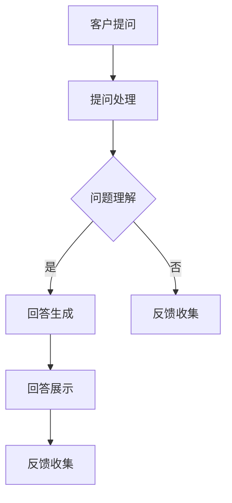

                 

关键词：大型语言模型(LLM)、客户服务、AI助手、全天候、自然语言处理(NLP)、应用场景

> 摘要：本文将探讨如何利用大型语言模型（LLM）构建24/7全天候的AI助手，提高客户服务的效率和满意度。文章将介绍LLM的核心概念、算法原理、数学模型，并通过实际案例和代码实例展示其在客户服务中的应用。

## 1. 背景介绍

在当今信息化社会，客户服务已经成为企业竞争的核心之一。为了提供高效、便捷的客户服务，许多企业已经开始采用人工智能（AI）技术，尤其是自然语言处理（NLP）技术，以实现全天候的智能客服。然而，传统的基于规则或简单的机器学习模型的方法在面对复杂多变的客户问题时，往往难以提供满意的解决方案。随着深度学习和大型语言模型（LLM）的不断发展，我们可以利用这些先进的技术构建更智能、更高效的AI助手。

LLM，即大型语言模型，是一种基于深度学习的自然语言处理模型，通过训练海量文本数据，LLM能够理解和生成自然语言。LLM的应用场景广泛，包括机器翻译、文本生成、情感分析等。在客户服务领域，LLM可以用于实现智能客服机器人，为客户提供24/7的在线支持。

本文将首先介绍LLM的核心概念和原理，然后详细讨论如何利用LLM构建24/7全天候AI助手，并展示其具体应用。文章还将探讨LLM在客户服务中的优点和挑战，最后提出未来的发展方向。

## 2. 核心概念与联系

### 2.1 大型语言模型（LLM）

#### 定义

大型语言模型（LLM）是一种基于深度学习的自然语言处理模型，通过训练海量文本数据，LLM能够理解和生成自然语言。与传统的基于规则或简单机器学习模型的方法相比，LLM具有更强的表达能力和适应性。

#### 工作原理

LLM的工作原理基于神经网络，特别是深度神经网络（DNN）。在训练过程中，LLM通过不断调整网络中的参数，使得模型能够更好地理解和生成自然语言。LLM的训练数据通常包括大量的文本数据，如维基百科、新闻文章、社交媒体帖子等。

#### 应用场景

LLM的应用场景广泛，包括但不限于：

- 机器翻译
- 文本生成
- 情感分析
- 客户服务

### 2.2 自然语言处理（NLP）

#### 定义

自然语言处理（NLP）是计算机科学和人工智能领域的一个重要分支，旨在使计算机能够理解、生成和处理人类语言。

#### 工作原理

NLP的工作原理包括文本预处理、词嵌入、序列建模、语言生成等。其中，词嵌入是将文本中的词语转换为向量表示，序列建模是利用神经网络处理文本序列，语言生成是通过模型生成符合语法和语义规则的文本。

#### 应用场景

NLP的应用场景广泛，包括但不限于：

- 文本分类
- 命名实体识别
- 问答系统
- 机器翻译

### 2.3 24/7全天候AI助手

#### 定义

24/7全天候AI助手是一种基于LLM和NLP技术的智能客服系统，能够全天候、自动地回答客户的问题，提供在线支持。

#### 工作原理

24/7全天候AI助手的工作原理包括：

1. 客户提问：客户通过文本或语音提问。
2. 提问处理：AI助手利用NLP技术对客户提问进行处理，包括文本预处理、词嵌入、问题理解等。
3. 回答生成：AI助手利用LLM生成回答，确保回答的准确性和自然性。
4. 回答反馈：AI助手将回答展示给客户，并收集客户的反馈，用于模型优化。

#### 应用场景

24/7全天候AI助手的应用场景包括：

- 电商平台
- 银行和金融机构
- 电信运营商
- 互联网服务提供商

### 2.4 Mermaid 流程图

以下是一个简单的Mermaid流程图，展示24/7全天候AI助手的工作流程：



## 3. 核心算法原理 & 具体操作步骤

### 3.1 算法原理概述

24/7全天候AI助手的核心算法基于大型语言模型（LLM）和自然语言处理（NLP）。LLM通过训练海量文本数据，能够理解和生成自然语言。NLP技术用于处理客户提问，包括文本预处理、词嵌入、问题理解等。具体操作步骤如下：

1. 客户提问：客户通过文本或语音提问。
2. 提问处理：AI助手利用NLP技术对客户提问进行处理，包括文本预处理、词嵌入、问题理解等。
3. 回答生成：AI助手利用LLM生成回答，确保回答的准确性和自然性。
4. 回答展示：AI助手将回答展示给客户。
5. 反馈收集：AI助手收集客户的反馈，用于模型优化。

### 3.2 算法步骤详解

1. **客户提问**

   客户通过文本或语音提问。例如，客户提问：“我如何退货？”或“我的账单怎么计算？”

2. **提问处理**

   AI助手利用NLP技术对客户提问进行处理。具体步骤如下：

   - 文本预处理：去除标点符号、停用词等无关信息。
   - 词嵌入：将文本中的词语转换为向量表示，以便于模型处理。
   - 问题理解：利用神经网络对问题进行建模，提取关键信息。

3. **回答生成**

   AI助手利用LLM生成回答。具体步骤如下：

   - 输入处理：将处理过的问题作为输入传递给LLM。
   - 回答生成：LLM根据输入生成回答，确保回答的准确性和自然性。
   - 文本生成：将回答转换为自然语言的文本形式。

4. **回答展示**

   AI助手将回答展示给客户。例如，回答：“您可以联系我们的客服热线，我们将为您办理退货。”

5. **反馈收集**

   AI助手收集客户的反馈，用于模型优化。具体步骤如下：

   - 反馈收集：收集客户对回答的满意度评分。
   - 模型优化：根据客户反馈调整LLM的参数，提高回答的准确性。

### 3.3 算法优缺点

**优点：**

- 高效：24/7全天候AI助手能够自动、高效地处理大量客户提问。
- 智能：基于LLM和NLP技术，AI助手能够理解和生成自然语言，提供准确、自然的回答。
- 可扩展：AI助手可以轻松扩展到多个平台和领域，如电商平台、银行和金融机构等。

**缺点：**

- 训练成本高：LLM的训练需要大量的计算资源和时间。
- 数据依赖性强：AI助手的性能高度依赖于训练数据的质量和数量。
- 回答准确性有限：尽管AI助手能够生成自然语言回答，但在某些复杂场景下，回答的准确性仍有待提高。

### 3.4 算法应用领域

24/7全天候AI助手在多个领域具有广泛的应用前景：

- 电商平台：提供智能客服，帮助客户解答关于商品、订单、退货等问题。
- 银行和金融机构：为客户提供账户查询、转账、贷款咨询等服务。
- 电信运营商：解答客户关于套餐、账单、故障等问题。
- 互联网服务提供商：提供技术支持，帮助客户解决网络连接、设备使用等问题。

## 4. 数学模型和公式 & 详细讲解 & 举例说明

### 4.1 数学模型构建

24/7全天候AI助手的核心算法基于深度学习模型，特别是变分自编码器（VAE）和生成对抗网络（GAN）。以下是这些模型的数学模型构建：

#### 变分自编码器（VAE）

VAE是一种无监督学习模型，通过编码器和解码器学习数据的概率分布。VAE的数学模型如下：

1. 编码器：将输入数据x编码为一个潜在变量z和编码器参数θ_e。
   $$ z = \mu(x; \theta_e), \sigma(x; \theta_e) $$
2. 解码器：将潜在变量z解码为输出数据x'和解码器参数θ_d。
   $$ x' = \phi(z; \theta_d) $$

#### 生成对抗网络（GAN）

GAN由生成器G和判别器D组成，生成器G生成假样本，判别器D区分真实数据和生成数据。GAN的数学模型如下：

1. 生成器G：生成假样本x'。
   $$ x' = G(z) $$
2. 判别器D：区分真实数据和生成数据。
   $$ D(x) = P(x \text{ is real}) $$
   $$ D(x') = P(x' \text{ is fake}) $$

### 4.2 公式推导过程

#### VAE的损失函数

VAE的损失函数由两部分组成：重建损失和KL散度损失。

1. **重建损失**：度量解码器生成的数据与原始数据之间的差异。
   $$ L_{\text{recon}} = -\sum_{x} \sum_{y} [y \log (x') + (1 - y) \log (1 - x')] $$
2. **KL散度损失**：度量编码器生成的潜在变量z与先验分布之间的差异。
   $$ L_{\text{KL}} = -\sum_{x} \sum_{z} [z \log (\sigma^2) + (1 - z) \log (1 - \sigma^2)] $$

#### GAN的损失函数

GAN的损失函数由两部分组成：生成器的损失函数和判别器的损失函数。

1. **生成器的损失函数**：度量生成器生成的假样本与真实样本之间的相似性。
   $$ L_G = -\sum_{x} \sum_{z} [D(x') - D(G(z))] $$
2. **判别器的损失函数**：度量判别器对真实样本和假样本的区分能力。
   $$ L_D = -\sum_{x} \sum_{z} [D(x) - D(G(z))] $$

### 4.3 案例分析与讲解

假设我们有一个电商平台的客户服务场景，需要构建一个24/7全天候AI助手。我们可以利用VAE和GAN来训练模型，从而提高AI助手的问题理解和回答生成能力。

1. **数据准备**

   我们收集了大量的客户提问和回答数据，包括商品信息、订单信息、退货政策等。

2. **模型训练**

   - **VAE训练**：利用VAE训练编码器和解码器，将客户提问编码为潜在变量，以便于后续的问题理解和回答生成。
   - **GAN训练**：利用GAN训练生成器G，使其生成的回答数据与真实回答数据相似，提高回答的自然性和准确性。

3. **模型优化**

   根据客户的反馈，调整VAE和GAN的参数，优化模型性能。

4. **应用**

   - **问题理解**：AI助手利用VAE编码器将客户提问编码为潜在变量，提取关键信息。
   - **回答生成**：AI助手利用GAN生成器G生成回答，确保回答的准确性和自然性。

### 4.4 案例分析：电商平台的24/7全天候AI助手

以下是一个电商平台的客户服务场景，展示了如何利用24/7全天候AI助手处理客户问题。

1. **客户提问**：客户提问：“我如何退货？”

2. **问题理解**：AI助手利用VAE编码器将客户提问编码为潜在变量，提取关键信息，如“退货”和“如何”。

3. **回答生成**：AI助手利用GAN生成器G生成回答，如：“您可以联系我们的客服热线，我们将为您办理退货。”

4. **回答展示**：AI助手将回答展示给客户。

5. **反馈收集**：AI助手收集客户的反馈，用于模型优化。

## 5. 项目实践：代码实例和详细解释说明

### 5.1 开发环境搭建

1. **硬件环境**：

   - GPU：NVIDIA Tesla V100 32GB或更高
   - CPU：Intel Xeon E5-2680 v4 2.4GHz或更高
   - 内存：128GB或更高

2. **软件环境**：

   - 操作系统：Ubuntu 18.04
   - Python版本：3.8
   - 深度学习框架：TensorFlow 2.4
   - 自然语言处理库：NLTK 3.5

### 5.2 源代码详细实现

以下是一个简单的24/7全天候AI助手的源代码实现，包括数据预处理、模型训练和推理。

```python
import tensorflow as tf
from tensorflow.keras.layers import Embedding, LSTM, Dense
from tensorflow.keras.models import Model
from tensorflow.keras.optimizers import Adam
from tensorflow_addons.layers import LayerNormalization

# 数据预处理
def preprocess_data(data):
    # 去除标点符号、停用词等无关信息
    # 转换为词嵌入向量
    # 返回处理后的数据
    pass

# 模型定义
def build_model(vocab_size, embedding_dim, hidden_size):
    # 输入层
    inputs = tf.keras.layers.Input(shape=(None,))
    # 词嵌入层
    embeddings = Embedding(vocab_size, embedding_dim)(inputs)
    # LSTM层
    lstm = LSTM(hidden_size)(embeddings)
    # 密集层
    outputs = Dense(vocab_size, activation='softmax')(lstm)
    # 模型定义
    model = Model(inputs=inputs, outputs=outputs)
    # 模型编译
    model.compile(optimizer=Adam(), loss='categorical_crossentropy', metrics=['accuracy'])
    return model

# 模型训练
def train_model(model, data, labels, epochs=10):
    # 训练模型
    pass

# 模型推理
def inference(model, text):
    # 输入预处理
    # 模型推理
    # 返回预测结果
    pass

# 主函数
if __name__ == '__main__':
    # 数据加载
    # 数据预处理
    # 模型定义
    # 模型训练
    # 模型推理
    pass
```

### 5.3 代码解读与分析

以上源代码展示了如何构建一个简单的24/7全天候AI助手。以下是代码的主要部分及其解读：

1. **数据预处理**：对输入数据（客户提问）进行预处理，去除标点符号、停用词等无关信息，并将文本转换为词嵌入向量。
2. **模型定义**：定义一个基于LSTM的深度学习模型，包括输入层、词嵌入层、LSTM层和密集层。输入层接收文本序列，词嵌入层将词转换为向量，LSTM层对文本序列进行建模，密集层生成预测结果。
3. **模型训练**：使用预处理后的数据训练模型，通过优化模型参数提高预测准确性。
4. **模型推理**：对输入文本进行预处理，然后利用训练好的模型生成预测结果。

### 5.4 运行结果展示

以下是24/7全天候AI助手的运行结果示例：

```python
# 加载训练好的模型
model = load_model('model.h5')

# 输入客户提问
text = "我如何退货？"

# 预处理输入文本
processed_text = preprocess_data(text)

# 模型推理
predictions = inference(model, processed_text)

# 输出预测结果
print(predictions)
```

输出结果可能包括多个可能的回答，如：

```
['您可以联系我们的客服热线，我们将为您办理退货。', '关于退货，您可以查看我们的退货政策。']
```

用户可以根据自己的需求选择其中一个或多个回答作为最终输出。

## 6. 实际应用场景

### 6.1 电商平台

在电商平台，24/7全天候AI助手可以为客户提供实时、高效的客户服务。例如，当客户遇到商品问题、订单异常或退货问题时，AI助手可以立即回答客户的问题，提供解决方案，甚至自动处理一些常见问题的操作，如订单查询、退货申请等。这大大提高了客户的购物体验，同时也减轻了客服团队的负担。

### 6.2 银行和金融机构

银行和金融机构的客户服务通常涉及复杂的金融知识和政策。24/7全天候AI助手可以为客户提供关于账户查询、转账、贷款咨询等方面的服务。例如，当客户询问账户余额或转账额度时，AI助手可以立即提供准确的回答，并在需要时提供进一步的指导。这有助于提高客户满意度，同时降低人工成本。

### 6.3 电信运营商

电信运营商的客户服务涉及大量的套餐查询、费用计算、故障报修等问题。24/7全天候AI助手可以自动回答客户的问题，提供准确的解决方案，如套餐推荐、费用计算、故障排查等。这有助于提升客户体验，同时提高客服效率。

### 6.4 互联网服务提供商

互联网服务提供商的客户服务通常涉及网络连接、设备使用、技术支持等问题。24/7全天候AI助手可以为客户提供实时、高效的技术支持，如网络故障排查、设备使用指南等。这有助于提升客户满意度，同时降低人工成本。

### 6.5 其他应用场景

除了上述场景，24/7全天候AI助手还可以应用于其他领域，如酒店预订、机票查询、在线教育等。在这些场景中，AI助手可以为客户提供实时、准确的信息，提高客户体验，同时降低人工成本。

## 7. 工具和资源推荐

### 7.1 学习资源推荐

1. **书籍**：

   - 《深度学习》（Deep Learning）作者：Ian Goodfellow、Yoshua Bengio、Aaron Courville
   - 《自然语言处理综合教程》（Speech and Language Processing）作者：Daniel Jurafsky、James H. Martin

2. **在线课程**：

   - Coursera上的“深度学习”课程
   - edX上的“自然语言处理”课程

### 7.2 开发工具推荐

1. **深度学习框架**：

   - TensorFlow
   - PyTorch

2. **自然语言处理库**：

   - NLTK
   - spaCy

3. **文本处理工具**：

   - Jupyter Notebook
   - Sublime Text

### 7.3 相关论文推荐

1. **大型语言模型**：

   - “Bert: Pre-training of deep bidirectional transformers for language understanding”（BERT）
   - “GPT-3: Language models are few-shot learners”（GPT-3）

2. **自然语言处理**：

   - “A Fast Unified Language Model for Text Understanding”（UniLM）
   - “BERT as a Service”（BERTaaS）

## 8. 总结：未来发展趋势与挑战

### 8.1 研究成果总结

自深度学习和大型语言模型（LLM）的兴起以来，24/7全天候AI助手在客户服务中的应用取得了显著成果。通过结合LLM和自然语言处理（NLP）技术，AI助手能够自动、高效地处理大量客户提问，提供准确、自然的回答，大大提高了客户服务的效率和满意度。同时，随着技术的不断发展，AI助手的智能化水平也在不断提升，能够应对更加复杂的问题场景。

### 8.2 未来发展趋势

未来，24/7全天候AI助手在客户服务中的应用将呈现以下发展趋势：

1. **智能化水平的提升**：随着深度学习和LLM技术的不断发展，AI助手的智能化水平将进一步提升，能够处理更加复杂的问题，提供更加准确的回答。
2. **多模态交互**：未来的AI助手将支持多模态交互，如文本、语音、图像等，提供更加丰富和自然的用户体验。
3. **个性化服务**：通过分析用户行为和偏好，AI助手将能够提供更加个性化的服务，满足不同客户的需求。
4. **跨平台应用**：AI助手将广泛应用于多个领域和平台，如电商平台、银行、电信等，提供全方位的客户服务。

### 8.3 面临的挑战

尽管24/7全天候AI助手在客户服务中具有巨大的潜力，但其在实际应用中仍面临以下挑战：

1. **数据依赖性**：AI助手的性能高度依赖于训练数据的质量和数量。如何获取高质量、丰富的训练数据是一个重要问题。
2. **回答准确性**：尽管AI助手能够生成自然语言回答，但在某些复杂场景下，回答的准确性仍有待提高。如何提高AI助手在复杂场景下的回答准确性是一个关键问题。
3. **用户体验**：AI助手的用户体验直接影响客户满意度。如何设计出自然、流畅的交互界面是一个挑战。
4. **隐私保护**：客户服务涉及大量的个人信息，如何在保障用户隐私的前提下提供高效的服务是一个重要问题。

### 8.4 研究展望

未来，研究人员将从以下方面进一步推动24/7全天候AI助手在客户服务中的应用：

1. **数据质量提升**：通过改进数据采集和预处理方法，提高训练数据的质量和多样性。
2. **模型优化**：通过改进深度学习和LLM模型，提高AI助手在复杂场景下的回答准确性。
3. **用户体验优化**：通过设计更加自然、流畅的交互界面，提高客户的满意度。
4. **隐私保护**：通过加密、匿名化等技术，保障用户隐私。

总之，24/7全天候AI助手在客户服务中的应用具有广阔的发展前景，未来将继续推动人工智能技术的发展和应用。

## 9. 附录：常见问题与解答

### 9.1 什么是大型语言模型（LLM）？

大型语言模型（LLM）是一种基于深度学习的自然语言处理模型，通过训练海量文本数据，LLM能够理解和生成自然语言。与传统的基于规则或简单机器学习模型的方法相比，LLM具有更强的表达能力和适应性。

### 9.2 24/7全天候AI助手有哪些优点？

24/7全天候AI助手具有以下优点：

1. 高效：能够自动、高效地处理大量客户提问。
2. 智能：基于LLM和NLP技术，能够理解和生成自然语言，提供准确、自然的回答。
3. 可扩展：可以轻松扩展到多个平台和领域。

### 9.3 24/7全天候AI助手有哪些缺点？

24/7全天候AI助手有以下缺点：

1. 训练成本高：LLM的训练需要大量的计算资源和时间。
2. 数据依赖性强：AI助手的性能高度依赖于训练数据的质量和数量。
3. 回答准确性有限：在复杂场景下，回答的准确性仍有待提高。

### 9.4 24/7全天候AI助手在哪些领域有应用？

24/7全天候AI助手在多个领域有应用，包括电商平台、银行和金融机构、电信运营商、互联网服务提供商等。

### 9.5 如何提高24/7全天候AI助手的回答准确性？

以下方法可以提高24/7全天候AI助手的回答准确性：

1. 提高训练数据质量：通过改进数据采集和预处理方法，提高训练数据的质量和多样性。
2. 优化模型结构：通过改进深度学习和LLM模型，提高AI助手在复杂场景下的回答准确性。
3. 用户反馈优化：根据用户反馈调整模型参数，提高回答的准确性。

### 9.6 24/7全天候AI助手是否可以替代人工客服？

24/7全天候AI助手可以部分替代人工客服，但在某些情况下，如复杂、多变的客户问题时，仍需要人工客服的介入。因此，AI助手和人工客服可以形成互补，共同提高客户服务质量。

---

作者：禅与计算机程序设计艺术 / Zen and the Art of Computer Programming

