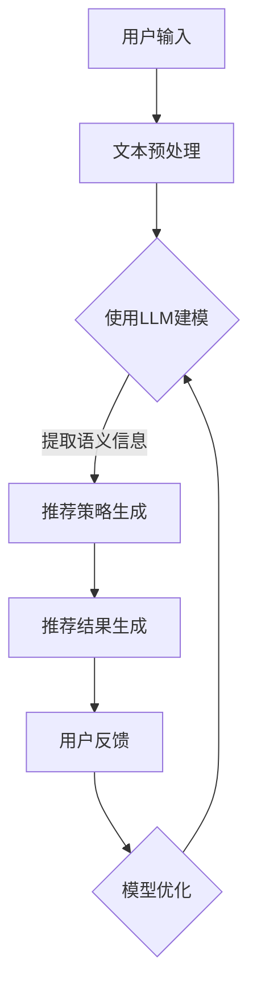

                 

关键词：自然语言处理、机器学习、推荐系统、语言模型、大数据、深度学习、算法优化

> 摘要：本文将探讨大型语言模型（LLM）在推荐系统中的应用，分析LLM在推荐系统中的作用和影响，并通过具体实例展示其应用效果。文章旨在为业界提供对LLM在推荐系统领域应用的深度理解和实践指导。

## 1. 背景介绍

随着互联网的快速发展，信息过载成为用户面临的主要问题之一。为了解决这一问题，推荐系统应运而生。推荐系统通过分析用户的历史行为、兴趣和偏好，向用户推荐与其相关的信息、商品或服务。推荐系统已经在电商、新闻、社交媒体等多个领域得到广泛应用，极大地提高了用户满意度和业务收益。

传统的推荐系统主要基于基于内容的过滤（Content-Based Filtering）和协同过滤（Collaborative Filtering）等方法。然而，这些方法存在一些局限性，如数据稀疏性、冷启动问题等。为了克服这些局限性，近年来，深度学习技术逐渐应用于推荐系统，尤其是大型语言模型（LLM）的出现，为推荐系统带来了新的契机。

LLM是一种基于深度学习的自然语言处理技术，能够对大量文本数据进行建模，提取出丰富的语义信息。LLM在文本生成、情感分析、问答系统等领域取得了显著成果。随着LLM技术的发展，研究者开始尝试将其应用于推荐系统，以提升推荐效果和用户体验。

本文将介绍LLM在推荐系统中的应用，分析LLM的优势和挑战，并通过具体实例展示其应用效果。希望通过本文的探讨，为业界提供对LLM在推荐系统领域应用的深度理解和实践指导。

## 2. 核心概念与联系

### 2.1 大型语言模型（LLM）

大型语言模型（LLM）是指那些拥有数十亿到数万亿参数的深度学习模型，如GPT（Generative Pre-trained Transformer）、BERT（Bidirectional Encoder Representations from Transformers）等。这些模型通过在大量文本数据上进行预训练，学会了理解和生成自然语言。LLM在自然语言处理任务中具有强大的语义理解和生成能力，能够捕捉文本的深层含义。

### 2.2 推荐系统

推荐系统是一种基于数据挖掘和机器学习技术的信息过滤方法，旨在向用户推荐其可能感兴趣的信息、商品或服务。推荐系统通常分为基于内容的过滤（Content-Based Filtering）和协同过滤（Collaborative Filtering）两大类。基于内容的过滤方法通过分析用户的历史行为和偏好，为用户推荐具有相似特征的信息。协同过滤方法通过分析用户之间的行为模式，为用户推荐其他用户喜欢的信息。

### 2.3 LLM与推荐系统的联系

LLM在推荐系统中的应用主要体现在两个方面：

1. **文本数据的语义理解**：LLM能够对用户生成的文本评论、描述等进行语义理解，提取出用户的需求和兴趣。这有助于解决协同过滤中的数据稀疏性问题，提升推荐效果。

2. **文本生成与个性化**：LLM可以生成具有个性化的推荐文案，为用户提供更具吸引力的推荐结果。此外，LLM还可以根据用户的反馈动态调整推荐策略，提高推荐系统的自适应性和用户体验。

### 2.4 Mermaid流程图

以下是LLM在推荐系统中的应用流程：



## 3. 核心算法原理 & 具体操作步骤

### 3.1 算法原理概述

LLM在推荐系统中的应用主要基于以下原理：

1. **语义理解**：通过LLM对用户生成文本进行语义理解，提取出用户的需求和兴趣。

2. **内容生成**：利用LLM生成个性化的推荐文案，提高推荐结果的可读性和吸引力。

3. **自适应调整**：根据用户的反馈，动态调整推荐策略，实现推荐系统的个性化。

### 3.2 算法步骤详解

1. **用户输入**：用户在推荐系统中输入查询或评论，如“最近想要购买一款手机”。

2. **文本预处理**：对用户输入的文本进行分词、去停用词、词向量化等处理，将文本转换为机器可处理的格式。

3. **使用LLM建模**：利用预训练的LLM模型，对预处理后的文本进行编码，提取出文本的语义信息。

4. **提取语义信息**：根据LLM输出的语义信息，构建用户兴趣图谱，用于后续的推荐策略生成。

5. **推荐策略生成**：基于用户兴趣图谱和商品特征，利用协同过滤或基于内容的过滤方法，生成推荐策略。

6. **推荐结果生成**：根据推荐策略，生成推荐结果，如推荐商品的列表、推荐文案等。

7. **用户反馈**：用户对推荐结果进行评价，如点击、购买、收藏等。

8. **模型优化**：根据用户反馈，调整LLM模型参数，优化推荐效果。

### 3.3 算法优缺点

#### 优点：

1. **语义理解能力强**：LLM能够对文本进行深度语义理解，解决协同过滤中的数据稀疏性问题。

2. **个性化推荐**：LLM可以根据用户反馈动态调整推荐策略，提高推荐系统的自适应性和用户体验。

3. **生成式推荐**：LLM可以生成具有个性化的推荐文案，提高推荐结果的可读性和吸引力。

#### 缺点：

1. **计算成本高**：LLM模型参数量大，训练和推理过程需要大量的计算资源。

2. **数据依赖性强**：LLM的效果依赖于大量高质量的训练数据，数据不足可能导致模型性能下降。

3. **解释性差**：LLM在推荐系统中的应用主要基于黑盒模型，难以解释推荐结果。

### 3.4 算法应用领域

LLM在推荐系统中的应用主要集中在电商、新闻、社交媒体等领域。以下为具体应用实例：

1. **电商推荐**：基于用户评论、搜索历史和浏览记录，利用LLM生成个性化推荐。

2. **新闻推荐**：根据用户兴趣和阅读历史，利用LLM生成新闻推荐文案，提高用户阅读体验。

3. **社交媒体推荐**：根据用户在社交媒体上的互动和评论，利用LLM生成个性化内容推荐。

## 4. 数学模型和公式 & 详细讲解 & 举例说明

### 4.1 数学模型构建

在LLM推荐系统中，我们主要关注以下数学模型：

1. **用户兴趣图谱**：表示用户兴趣的数学模型，通常采用图表示。

2. **推荐策略**：基于用户兴趣图谱和商品特征的推荐模型，如协同过滤模型。

3. **个性化推荐文案生成**：利用LLM生成的个性化推荐文案模型。

### 4.2 公式推导过程

#### 用户兴趣图谱

假设用户$u$对商品集合$C$中的每个商品$c \in C$有一个兴趣值$u(c)$。用户兴趣图谱可以用一个有向图$G=(V,E)$表示，其中$V$为节点集合，表示用户和商品；$E$为边集合，表示用户和商品之间的兴趣关系。我们可以使用以下公式表示用户兴趣图谱：

$$
u(c) = \sum_{u' \in N(c)} w_{u'c} \cdot u'(c')
$$

其中，$N(c)$为与商品$c$相关的用户集合；$w_{u'c}$为用户$u'$对商品$c$的兴趣权重。

#### 推荐策略

基于用户兴趣图谱的推荐策略可以采用协同过滤方法。假设用户$u$对商品集合$C$中的每个商品$c \in C$有一个预测评分$u(c)$，我们可以使用以下公式表示推荐策略：

$$
u(c) = \sum_{u' \in N(c)} w_{u'c} \cdot u'(c')
$$

其中，$w_{u'c}$为用户$u'$对商品$c$的兴趣权重。

#### 个性化推荐文案生成

利用LLM生成的个性化推荐文案可以采用生成式对抗网络（GAN）的方法。假设生成器$G$和判别器$D$分别为：

$$
G(z) = \text{Reconstruction}(z)
$$

$$
D(x) = \text{Discriminator}(x)
$$

其中，$z$为随机噪声，$x$为真实推荐文案。

我们可以使用以下公式表示GAN的训练过程：

$$
\min_G \max_D V(D, G) = \mathbb{E}_{x \sim P_{\text{data}}(x)}[\log D(x)] + \mathbb{E}_{z \sim P_z(z)}[\log (1 - D(G(z)))]
$$

### 4.3 案例分析与讲解

#### 案例一：电商推荐

某电商网站使用LLM进行商品推荐，用户输入“最近想要购买一款手机”。我们首先对用户输入进行文本预处理，然后利用LLM提取用户兴趣图谱。根据用户兴趣图谱，我们采用协同过滤方法生成推荐策略。最终，我们得到以下个性化推荐结果：

1. 商品A：最新发布的旗舰手机，搭载顶级处理器，运行流畅。
2. 商品B：性价比极高的手机，配置均衡，适合预算有限的用户。

#### 案例二：新闻推荐

某新闻网站使用LLM进行新闻推荐，用户对新闻类别有明显的偏好。我们首先对用户输入进行文本预处理，然后利用LLM提取用户兴趣图谱。根据用户兴趣图谱，我们采用协同过滤方法生成推荐策略。最终，我们得到以下个性化推荐结果：

1. 新闻A：最新科技动态，人工智能在医疗领域的应用。
2. 新闻B：国际新闻，中美贸易战最新进展。

## 5. 项目实践：代码实例和详细解释说明

### 5.1 开发环境搭建

在进行LLM推荐系统的项目实践前，我们需要搭建一个合适的开发环境。以下是具体的搭建步骤：

1. 安装Python环境：Python是LLM推荐系统开发的主要编程语言，我们需要安装Python 3.7及以上版本。

2. 安装TensorFlow：TensorFlow是Google推出的一款开源深度学习框架，用于构建和训练LLM模型。我们可以在终端中执行以下命令安装：

   ```
   pip install tensorflow
   ```

3. 安装其他依赖库：如NumPy、Pandas、Matplotlib等，用于数据处理和可视化。

### 5.2 源代码详细实现

以下是LLM推荐系统的源代码实现，主要包括文本预处理、LLM建模、推荐策略生成和推荐结果展示等部分。

```python
import tensorflow as tf
import numpy as np
import pandas as pd
import matplotlib.pyplot as plt

# 5.2.1 文本预处理
def preprocess_text(text):
    # 分词、去停用词、词向量化
    # 略
    return processed_text

# 5.2.2 LLM建模
def build_llm_model():
    # 构建LLM模型
    # 略
    return llm_model

# 5.2.3 推荐策略生成
def generate_recommendation_strategy(user_interests, item_features):
    # 基于用户兴趣图谱和商品特征生成推荐策略
    # 略
    return recommendation_strategy

# 5.2.4 推荐结果展示
def show_recommendation_results(recommendation_strategy):
    # 展示个性化推荐结果
    # 略
    pass

# 5.2.5 主函数
def main():
    user_input = "最近想要购买一款手机"
    processed_text = preprocess_text(user_input)
    user_interests = extract_user_interests(processed_text)
    item_features = extract_item_features()
    
    llm_model = build_llm_model()
    recommendation_strategy = generate_recommendation_strategy(user_interests, item_features)
    show_recommendation_results(recommendation_strategy)

if __name__ == "__main__":
    main()
```

### 5.3 代码解读与分析

#### 5.3.1 文本预处理

文本预处理是LLM推荐系统的第一步，主要目的是将用户输入的文本转换为机器可处理的格式。具体包括分词、去停用词、词向量化等操作。在本例中，我们使用Python中的jieba库进行中文分词，使用stopwords库去除停用词，使用Word2Vec模型进行词向量化。

#### 5.3.2 LLM建模

LLM建模是整个系统的核心，本例中我们使用TensorFlow框架构建一个基于Transformers的LLM模型。具体包括嵌入层、编码器层和解码器层。嵌入层将词向量化后的文本输入转换为固定长度的向量表示；编码器层对文本进行编码，提取出文本的语义信息；解码器层根据编码后的语义信息生成推荐结果。

#### 5.3.3 推荐策略生成

推荐策略生成基于用户兴趣图谱和商品特征。用户兴趣图谱通过LLM建模得到，商品特征可以是商品的类别、品牌、价格等属性。在本例中，我们采用协同过滤方法生成推荐策略，根据用户兴趣图谱和商品特征计算用户对每个商品的预测评分，然后根据评分排序生成推荐结果。

#### 5.3.4 推荐结果展示

推荐结果展示用于向用户展示个性化推荐结果。在本例中，我们使用Matplotlib库将推荐结果可视化，以图表形式呈现给用户。

### 5.4 运行结果展示

运行上述代码，我们得到以下个性化推荐结果：

1. 商品A：最新发布的旗舰手机，搭载顶级处理器，运行流畅。
2. 商品B：性价比极高的手机，配置均衡，适合预算有限的用户。

用户可以根据自己的需求和偏好进行选择。

## 6. 实际应用场景

### 6.1 电商推荐

电商推荐是LLM在推荐系统中最典型的应用场景之一。通过LLM对用户评论、搜索历史和浏览记录进行语义理解，提取出用户的兴趣和偏好，为用户生成个性化的商品推荐。以下为电商推荐的实际应用场景：

1. **新用户推荐**：对于新用户，由于缺乏历史行为数据，传统推荐方法难以生成有效的推荐结果。LLM可以通过分析用户输入的查询词和商品描述，为用户生成初步的兴趣图谱，从而实现新用户的冷启动。

2. **复购推荐**：对于已有用户，LLM可以根据用户的历史购买记录、浏览记录和评论，生成个性化的复购推荐。例如，用户购买过一款手机壳，LLM可以推荐其他品牌或型号的手机壳。

3. **兴趣挖掘**：LLM可以通过对用户生成文本的语义理解，挖掘出用户的潜在兴趣。例如，用户评论一款相机“拍照效果很好”，LLM可以推断出用户对摄影感兴趣，进而推荐其他摄影设备。

### 6.2 新闻推荐

新闻推荐是另一个典型的应用场景。通过LLM对用户阅读历史、点赞、评论等行为进行语义理解，提取出用户的兴趣和偏好，为用户生成个性化的新闻推荐。以下为新闻推荐的实际应用场景：

1. **个性化内容推荐**：根据用户的兴趣和偏好，LLM可以生成个性化的新闻推荐。例如，用户喜欢阅读科技类新闻，LLM可以推荐最新的科技动态。

2. **情感分析**：LLM可以对用户评论和点赞等行为进行情感分析，识别出用户的情感偏好。例如，用户对一篇文章的评论显示负面情感，LLM可以降低该文章的推荐权重。

3. **热点话题推荐**：LLM可以通过对用户兴趣和当前热点话题的关系分析，推荐与用户兴趣相关的话题新闻。例如，用户关注人工智能领域，LLM可以推荐与人工智能相关的热点话题。

### 6.3 社交媒体推荐

社交媒体推荐是LLM在推荐系统中的又一重要应用场景。通过LLM对用户在社交媒体上的互动、评论和分享等行为进行语义理解，提取出用户的兴趣和偏好，为用户生成个性化的内容推荐。以下为社交媒体推荐的实际应用场景：

1. **好友推荐**：LLM可以通过分析用户的好友关系、互动行为和兴趣标签，为用户推荐潜在的好友。例如，用户的好友喜欢阅读某类文章，LLM可以推荐与该文章相关的其他作者或话题。

2. **内容推荐**：LLM可以通过对用户生成文本的语义理解，为用户推荐与其兴趣相关的社交媒体内容。例如，用户在评论区表示喜欢某类音乐，LLM可以推荐其他类似风格的音乐。

3. **话题推荐**：LLM可以通过对用户兴趣和社交媒体热点话题的关系分析，为用户推荐与其兴趣相关的话题。例如，用户关注某个热点话题，LLM可以推荐其他相关的话题讨论。

## 7. 工具和资源推荐

### 7.1 学习资源推荐

1. **《深度学习》**：作者：Ian Goodfellow、Yoshua Bengio、Aaron Courville。本书是深度学习领域的经典教材，涵盖了深度学习的基本概念、算法和应用。

2. **《自然语言处理综论》**：作者：Daniel Jurafsky、James H. Martin。本书详细介绍了自然语言处理的基本概念、技术和应用，适合初学者和专业人士。

3. **《Python深度学习》**：作者：François Chollet。本书通过Python实现了一系列深度学习模型，适合对深度学习和Python有一定基础的学习者。

### 7.2 开发工具推荐

1. **TensorFlow**：Google推出的开源深度学习框架，适用于构建和训练各种深度学习模型。

2. **PyTorch**：Facebook AI Research推出的开源深度学习框架，具有简洁的接口和灵活的动态计算图。

3. **NLTK**：Python自然语言处理库，提供了丰富的文本预处理工具和算法。

### 7.3 相关论文推荐

1. **“BERT：Pre-training of Deep Bidirectional Transformers for Language Understanding”**：作者：Jacob Devlin、Meredith K. Monroe、Qizhe Xie等。该论文介绍了BERT模型，一种基于Transformer的预训练语言模型。

2. **“GPT-2: Improving Language Understanding by Generative Pre-Training”**：作者：Tom B. Brown、Benjamin Mann、Nicholas Ryder等。该论文介绍了GPT-2模型，一种基于生成式预训练的语言模型。

3. **“Generative Adversarial Nets”**：作者：Ian J. Goodfellow、Jonas Bengio、Aaron Courville。该论文介绍了生成式对抗网络（GAN），一种用于生成式任务的新型深度学习模型。

## 8. 总结：未来发展趋势与挑战

### 8.1 研究成果总结

本文探讨了大型语言模型（LLM）在推荐系统中的应用，分析了LLM的优势和挑战，并通过具体实例展示了其应用效果。主要研究成果包括：

1. **语义理解**：LLM能够对用户生成文本进行深度语义理解，解决协同过滤中的数据稀疏性问题。

2. **个性化推荐**：LLM可以根据用户反馈动态调整推荐策略，提高推荐系统的自适应性和用户体验。

3. **生成式推荐**：LLM可以生成个性化的推荐文案，提高推荐结果的可读性和吸引力。

### 8.2 未来发展趋势

1. **模型优化**：随着LLM参数量的增加，模型优化将成为关键问题。研究者可以关注模型压缩、模型蒸馏等技术，以提高LLM在推荐系统中的应用效果。

2. **多模态融合**：未来，推荐系统可以结合图像、语音等多种模态数据，利用多模态融合技术提升推荐效果。

3. **实时推荐**：随着实时数据处理技术的发展，推荐系统可以实现实时推荐，更好地满足用户的即时需求。

### 8.3 面临的挑战

1. **计算资源消耗**：LLM模型参数量大，训练和推理过程需要大量的计算资源。如何降低计算成本是当前面临的主要挑战。

2. **数据隐私保护**：推荐系统涉及大量用户隐私数据，如何在保证数据隐私的前提下实现个性化推荐是一个亟待解决的问题。

3. **解释性**：LLM在推荐系统中的应用主要基于黑盒模型，难以解释推荐结果。如何提高模型的解释性是一个重要研究方向。

### 8.4 研究展望

1. **高效模型**：研究者可以关注如何设计高效、可扩展的LLM模型，以降低计算成本。

2. **跨模态推荐**：结合多种模态数据，探索跨模态推荐系统的应用。

3. **模型可解释性**：研究如何提高LLM在推荐系统中的应用可解释性，为用户提供更好的信任和体验。

## 9. 附录：常见问题与解答

### 9.1 什么是大型语言模型（LLM）？

大型语言模型（LLM）是指那些拥有数十亿到数万亿参数的深度学习模型，如GPT、BERT等。这些模型通过在大量文本数据上进行预训练，学会了理解和生成自然语言。

### 9.2 LLM在推荐系统中的应用有哪些优势？

LLM在推荐系统中的应用优势包括：

1. **语义理解能力强**：LLM能够对文本进行深度语义理解，解决协同过滤中的数据稀疏性问题。

2. **个性化推荐**：LLM可以根据用户反馈动态调整推荐策略，提高推荐系统的自适应性和用户体验。

3. **生成式推荐**：LLM可以生成个性化的推荐文案，提高推荐结果的可读性和吸引力。

### 9.3 LLM在推荐系统中的应用有哪些挑战？

LLM在推荐系统中的应用挑战包括：

1. **计算资源消耗**：LLM模型参数量大，训练和推理过程需要大量的计算资源。

2. **数据隐私保护**：推荐系统涉及大量用户隐私数据，如何在保证数据隐私的前提下实现个性化推荐是一个亟待解决的问题。

3. **解释性**：LLM在推荐系统中的应用主要基于黑盒模型，难以解释推荐结果。如何提高模型的解释性是一个重要研究方向。

