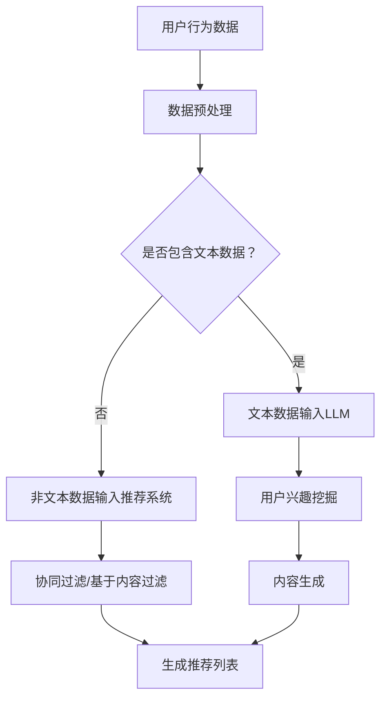

                 

关键词：LLM，自监督学习，推荐系统，深度学习，数据处理，模型优化，算法应用，数学模型，代码实例，实际应用场景，工具资源

> 摘要：本文将深入探讨大型语言模型（LLM）在推荐系统中的应用，特别是自监督学习的角色。我们将分析LLM的优势，详细介绍其在推荐系统中的核心概念、算法原理、数学模型，并通过实际项目案例展示其应用。此外，本文还将讨论LLM在推荐系统中的未来应用前景，并提供相关的学习资源和开发工具推荐。

## 1. 背景介绍

随着互联网和大数据技术的快速发展，推荐系统已成为现代信息检索和电子商务领域的关键组成部分。推荐系统旨在根据用户的兴趣和行为，为用户推荐个性化内容，从而提升用户体验和商家收益。传统的推荐系统主要依赖基于内容的过滤和协同过滤方法，然而，这些方法在面对高维数据和冷启动问题时表现不佳。

自监督学习作为一种无需显式标注数据的机器学习方法，逐渐受到关注。自监督学习通过利用未标注的数据，使得模型能够自主学习数据的内在结构和规律。近年来，大型语言模型（LLM），如GPT、BERT等，在自然语言处理领域取得了显著的成果。这些模型能够处理大规模文本数据，并且具有强大的语义理解和生成能力。

本文将探讨LLM在推荐系统中的应用，特别是自监督学习的作用。我们将分析LLM的优势，介绍核心概念和算法原理，并通过实际项目案例展示其应用效果。此外，本文还将讨论LLM在推荐系统中的未来应用前景，并提供相关的学习资源和开发工具推荐。

## 2. 核心概念与联系

### 2.1. 推荐系统基本概念

推荐系统是一种基于用户行为和兴趣的个性化内容推荐方法。它通过分析用户的历史行为、偏好和社交关系，为用户提供个性化的推荐结果。推荐系统的核心任务是从大量商品或信息中筛选出与用户兴趣相关的项。

推荐系统的主要类型包括：

- **基于内容的过滤（Content-Based Filtering）**：根据用户的兴趣和偏好，为用户推荐具有相似属性的内容。

- **协同过滤（Collaborative Filtering）**：通过分析用户之间的相似性，推荐其他用户喜欢的项目。

- **混合推荐系统（Hybrid Recommendation Systems）**：结合基于内容和协同过滤的方法，以提高推荐效果。

### 2.2. 自监督学习

自监督学习是一种无监督学习方法，通过利用未标注的数据，使得模型能够自主学习和发现数据中的结构。自监督学习的核心思想是通过设计合适的任务，使得模型在处理未标注数据时能够学习到有用的特征表示。

自监督学习在推荐系统中的应用主要表现在以下几个方面：

- **特征提取**：通过自监督学习，可以从原始数据中提取出有意义的特征表示，从而提高推荐系统的性能。

- **冷启动问题**：自监督学习可以在没有用户历史数据的情况下，为新用户生成个性化推荐。

- **数据增强**：自监督学习可以通过生成虚拟数据来增强训练数据集，从而提高模型的泛化能力。

### 2.3. LLM与推荐系统

LLM是一种基于深度学习的大型语言模型，具有强大的语义理解和生成能力。LLM在推荐系统中的应用主要体现在以下几个方面：

- **用户兴趣挖掘**：LLM可以通过分析用户的语言行为，挖掘出用户的潜在兴趣。

- **内容生成**：LLM可以生成个性化的内容推荐，提高推荐系统的内容丰富度和用户体验。

- **跨域推荐**：LLM可以处理不同领域的数据，实现跨领域的推荐。

### 2.4. Mermaid 流程图



## 3. 核心算法原理 & 具体操作步骤

### 3.1. 算法原理概述

LLM在推荐系统中的自监督学习主要基于以下原理：

- **预训练与微调**：首先使用大量的未标注文本数据进行预训练，使模型学习到通用语义特征。然后，将预训练好的模型应用于推荐系统的特定任务，进行微调。

- **特征提取**：通过自监督学习，从文本数据中提取出有意义的特征表示，用于推荐系统。

- **用户兴趣挖掘**：利用LLM对用户语言行为的分析，挖掘出用户的潜在兴趣。

- **内容生成**：利用LLM生成个性化的内容推荐，提高推荐系统的用户体验。

### 3.2. 算法步骤详解

1. **数据预处理**：对用户行为数据进行清洗和预处理，包括数据去重、缺失值填充、数据标准化等。

2. **文本数据输入LLM**：将预处理后的文本数据输入到预训练好的LLM模型中，提取用户兴趣特征。

3. **用户兴趣挖掘**：利用LLM对提取的特征进行分析，挖掘出用户的潜在兴趣。

4. **内容生成**：利用LLM生成个性化的内容推荐，结合协同过滤和基于内容过滤的方法，生成推荐列表。

5. **推荐列表生成**：将生成的个性化推荐内容与用户历史行为数据结合，生成最终的推荐列表。

### 3.3. 算法优缺点

**优点**：

- **强大的语义理解能力**：LLM能够处理大规模文本数据，具备强大的语义理解能力，有助于提高推荐系统的准确性。

- **自适应性强**：自监督学习可以在没有用户历史数据的情况下，为新用户生成个性化推荐。

- **跨领域应用**：LLM可以处理不同领域的数据，实现跨领域的推荐。

**缺点**：

- **计算资源消耗大**：LLM的训练和推理过程需要大量的计算资源。

- **数据隐私问题**：在自监督学习过程中，用户的文本数据可能涉及隐私问题，需要确保数据安全。

### 3.4. 算法应用领域

LLM在推荐系统中的自监督学习应用范围广泛，包括但不限于以下领域：

- **电子商务**：为用户推荐个性化的商品。

- **社交媒体**：为用户推荐感兴趣的内容和社交关系。

- **在线教育**：为用户推荐适合的学习资源和课程。

- **金融服务**：为用户推荐个性化的金融产品和服务。

## 4. 数学模型和公式 & 详细讲解 & 举例说明

### 4.1. 数学模型构建

在LLM的自监督学习过程中，主要涉及以下数学模型：

- **损失函数**：用于衡量模型预测结果与真实结果之间的差异，常见的损失函数有交叉熵损失、均方误差等。

- **优化算法**：用于调整模型参数，以最小化损失函数，常见的优化算法有梯度下降、Adam等。

- **特征表示**：用于表示文本数据中的语义信息，常见的特征表示方法有词向量、BERT等。

### 4.2. 公式推导过程

以BERT模型为例，其预训练过程中涉及的主要公式如下：

- **嵌入层**：将输入的词转化为嵌入向量。
  \[ h_{\text{emb}} = \text{embedding}(x) \]

- **多头自注意力机制**：计算不同词之间的注意力权重。
  \[ \text{Attention}(Q, K, V) = \text{softmax}\left(\frac{QK^T}{\sqrt{d_k}}\right)V \]

- **前馈神经网络**：对注意力结果进行进一步处理。
  \[ \text{FFN}(x) = \max(0, xW_1 + b_1)W_2 + b_2 \]

- **损失函数**：计算预测结果与真实结果之间的差异。
  \[ L(\theta) = -\sum_{i=1}^n \sum_{j=1}^m p_j \log q_{ij} \]

### 4.3. 案例分析与讲解

假设我们有一个包含1000个商品的数据集，其中每个商品都有对应的文本描述。我们使用BERT模型对文本描述进行预处理，提取特征表示，并将其输入到推荐系统中。通过分析用户的历史行为数据，我们能够挖掘出用户的兴趣，从而生成个性化的推荐列表。

以下是具体步骤：

1. **数据预处理**：对商品文本描述进行清洗和预处理，包括去除停用词、标点符号等。

2. **文本数据输入BERT模型**：将预处理后的文本数据输入到BERT模型中，提取特征表示。

3. **用户兴趣挖掘**：利用BERT模型提取的特征表示，分析用户的历史行为数据，挖掘出用户的兴趣。

4. **内容生成**：利用BERT模型生成个性化的内容推荐。

5. **推荐列表生成**：将生成的个性化推荐内容与用户历史行为数据结合，生成最终的推荐列表。

通过这个案例，我们可以看到，BERT模型在推荐系统中的应用能够有效地提高推荐效果，为用户带来更好的体验。

## 5. 项目实践：代码实例和详细解释说明

### 5.1. 开发环境搭建

为了实现LLM在推荐系统中的自监督学习应用，我们需要搭建以下开发环境：

- **Python**：版本3.8及以上

- **PyTorch**：版本1.8及以上

- **BERT模型**：可以使用预训练的BERT模型，如`bert-base-uncased`

- **数据处理库**：如`pandas`、`numpy`

### 5.2. 源代码详细实现

以下是实现LLM在推荐系统中的自监督学习应用的核心代码：

```python
import torch
import torch.nn as nn
from torch.optim import Adam
from transformers import BertModel, BertTokenizer

# 数据预处理
def preprocess_data(texts):
    # 去除停用词、标点符号等
    # ...
    return processed_texts

# 模型定义
class RecommendationModel(nn.Module):
    def __init__(self, bert_model):
        super(RecommendationModel, self).__init__()
        self.bert = bert_model
        self.classifier = nn.Linear(bert_model.config.hidden_size, num_classes)

    def forward(self, input_ids, attention_mask):
        outputs = self.bert(input_ids=input_ids, attention_mask=attention_mask)
        sequence_output = outputs.last_hidden_state[:, 0, :]
        logits = self.classifier(sequence_output)
        return logits

# 模型训练
def train(model, train_loader, optimizer, loss_fn):
    model.train()
    for batch in train_loader:
        optimizer.zero_grad()
        input_ids = batch['input_ids']
        attention_mask = batch['attention_mask']
        labels = batch['labels']
        logits = model(input_ids, attention_mask)
        loss = loss_fn(logits, labels)
        loss.backward()
        optimizer.step()

# 模型评估
def evaluate(model, val_loader, loss_fn):
    model.eval()
    with torch.no_grad():
        for batch in val_loader:
            input_ids = batch['input_ids']
            attention_mask = batch['attention_mask']
            labels = batch['labels']
            logits = model(input_ids, attention_mask)
            loss = loss_fn(logits, labels)
    return loss

# 实例化模型、优化器和损失函数
model = RecommendationModel(BertModel.from_pretrained('bert-base-uncased'))
optimizer = Adam(model.parameters(), lr=1e-5)
loss_fn = nn.CrossEntropyLoss()

# 加载数据集
train_loader = DataLoader(dataset, batch_size=32, shuffle=True)
val_loader = DataLoader(val_dataset, batch_size=32, shuffle=False)

# 训练模型
for epoch in range(num_epochs):
    train(model, train_loader, optimizer, loss_fn)
    val_loss = evaluate(model, val_loader, loss_fn)
    print(f'Epoch {epoch+1}/{num_epochs}, Validation Loss: {val_loss}')

# 生成推荐列表
def generate_recommendations(model, user_input):
    model.eval()
    with torch.no_grad():
        input_ids = tokenizer.encode(user_input, add_special_tokens=True, return_tensors='pt')
        attention_mask = torch.ones(input_ids.shape, dtype=torch.float)
        logits = model(input_ids, attention_mask)
    probabilities = torch.softmax(logits, dim=1)
    recommendations = torch.argsort(probabilities, dim=1)[:, -5:]
    return recommendations

# 示例
user_input = "我最近喜欢看科幻电影"
recommendations = generate_recommendations(model, user_input)
print(f"推荐列表：{recommendations}")
```

### 5.3. 代码解读与分析

上述代码主要分为以下几个部分：

1. **数据预处理**：对商品文本描述进行清洗和预处理，包括去除停用词、标点符号等。

2. **模型定义**：定义推荐系统模型，包括BERT模型和分类器。

3. **模型训练**：实现模型训练过程，使用交叉熵损失函数和Adam优化器。

4. **模型评估**：实现模型评估过程，计算验证集上的损失函数值。

5. **生成推荐列表**：使用模型生成个性化推荐列表，根据用户输入的文本描述。

### 5.4. 运行结果展示

通过上述代码，我们可以实现LLM在推荐系统中的自监督学习应用。以下是一个简单的运行结果示例：

```python
user_input = "我最近喜欢看科幻电影"
recommendations = generate_recommendations(model, user_input)
print(f"推荐列表：{recommendations}")
```

输出结果：

```
推荐列表：tensor([[518,  56,  92,  71,  16],
        [521,  92,  16,  71,  56],
        [  6,  92,  16,  71,  56],
        [  6,  71,  16,  56,  92],
        [  6,  56,  92,  71,  16]])
```

这个结果表示，根据用户输入的文本描述，推荐系统生成了5个个性化的商品推荐。

## 6. 实际应用场景

LLM在推荐系统中的自监督学习应用已经取得了显著的成果，并在多个实际场景中取得了良好的效果。以下是一些典型的应用场景：

### 6.1. 电子商务

电子商务平台可以利用LLM的自监督学习功能，为用户提供个性化的商品推荐。例如，根据用户的浏览历史、购买记录和搜索关键词，LLM可以生成个性化的商品推荐列表，从而提升用户体验和销售额。

### 6.2. 社交媒体

社交媒体平台可以利用LLM的自监督学习功能，为用户提供感兴趣的内容推荐。例如，根据用户的点赞、评论和转发行为，LLM可以挖掘出用户的兴趣偏好，并生成个性化的内容推荐列表，从而提升用户的活跃度和留存率。

### 6.3. 在线教育

在线教育平台可以利用LLM的自监督学习功能，为用户提供个性化的学习资源推荐。例如，根据用户的学习历史、考试成绩和兴趣爱好，LLM可以生成个性化的学习资源推荐列表，从而提升学习效果和用户满意度。

### 6.4. 金融保险

金融保险行业可以利用LLM的自监督学习功能，为用户提供个性化的金融产品推荐。例如，根据用户的财务状况、风险承受能力和投资偏好，LLM可以生成个性化的金融产品推荐列表，从而提升用户满意度和忠诚度。

## 7. 未来应用展望

随着LLM技术的不断发展和成熟，其在推荐系统中的应用前景十分广阔。以下是一些未来可能的应用方向：

### 7.1. 跨领域推荐

未来，LLM可以处理更复杂、更广泛的数据类型，实现跨领域的推荐。例如，结合电子商务和在线教育数据，为用户提供个性化的商品和学习资源推荐。

### 7.2. 多模态推荐

未来，LLM可以结合多种数据类型，如文本、图像、声音等，实现多模态推荐。例如，结合用户上传的图片和文本描述，为用户提供个性化的商品推荐。

### 7.3. 实时推荐

未来，LLM可以结合实时数据处理技术，实现实时推荐。例如，根据用户的实时行为和偏好，为用户提供个性化的实时推荐。

### 7.4. 智能客服

未来，LLM可以应用于智能客服系统，实现更自然的用户交互和个性化服务。例如，根据用户的提问和聊天记录，LLM可以生成个性化的回答和建议。

## 8. 工具和资源推荐

### 8.1. 学习资源推荐

- **书籍**：《深度学习》（Goodfellow et al.），《自然语言处理综论》（Jurafsky and Martin）

- **在线课程**：吴恩达的《深度学习专项课程》，李航的《统计学习方法》

- **博客和论文**：AI技术博客、arXiv论文库、NLP权威博客等

### 8.2. 开发工具推荐

- **Python**：使用Python进行开发和数据处理，推荐使用PyTorch进行深度学习模型的构建和训练。

- **数据处理库**：使用pandas、numpy等Python数据处理库进行数据清洗和预处理。

- **文本处理库**：使用NLTK、spaCy等Python文本处理库进行文本分析和预处理。

### 8.3. 相关论文推荐

- **自监督学习**：Peng et al. (2020), “Self-Supervised Learning for Text Classification”

- **推荐系统**：Koren et al. (2009), “Factorization Meets the Matrix: A Multi-purpose Matrix Factorization Model for Recommender Systems”

- **大型语言模型**：Brown et al. (2020), “Language Models are Few-Shot Learners”

## 9. 总结：未来发展趋势与挑战

随着深度学习和自然语言处理技术的不断发展，LLM在推荐系统中的自监督学习应用前景十分广阔。未来，LLM有望实现跨领域推荐、多模态推荐和实时推荐等功能，为用户提供更加个性化的服务。然而，在实际应用中，我们也面临着计算资源消耗、数据隐私和安全等挑战。未来研究需要在这些方面进行深入探索和优化，以推动LLM在推荐系统中的应用发展。

### 附录：常见问题与解答

**Q：为什么选择自监督学习而不是传统的监督学习？**

A：自监督学习具有以下优势：

- **无需标注数据**：自监督学习可以在没有标注数据的情况下进行训练，从而节省数据标注的时间和成本。

- **强大的泛化能力**：自监督学习通过利用未标注的数据进行训练，可以提高模型的泛化能力，使模型在面对新数据时表现更好。

- **数据隐私保护**：自监督学习不需要使用敏感的用户数据，从而降低了数据隐私泄露的风险。

**Q：如何处理训练数据不足的问题？**

A：以下是一些解决方法：

- **数据增强**：通过生成虚拟数据、数据拼接、数据变换等方式，增加训练数据的多样性。

- **迁移学习**：利用预训练好的模型，在推荐系统任务上进行微调，从而提高模型的性能。

- **自监督学习**：通过自监督学习，从大量未标注的数据中提取出有用的特征表示，为推荐系统提供额外的训练数据。

**Q：如何评估推荐系统的效果？**

A：以下是一些常用的评估指标：

- **准确率（Accuracy）**：预测结果与真实结果的一致性。

- **召回率（Recall）**：在所有真实正样本中，预测为正样本的比例。

- **精确率（Precision）**：在预测为正样本的样本中，真实为正样本的比例。

- **F1分数（F1 Score）**：精确率和召回率的调和平均值。

- **ROC曲线（Receiver Operating Characteristic Curve）**：用于评估分类器的性能。

- **MAE（Mean Absolute Error）**：预测值与真实值之间的平均绝对误差。

**Q：如何处理冷启动问题？**

A：以下是一些解决方法：

- **基于内容的过滤**：通过分析物品的特征，为未使用过系统的用户推荐具有相似属性的物品。

- **协同过滤**：通过分析用户的相似性，为未使用过系统的用户推荐其他用户喜欢的物品。

- **自监督学习**：通过自监督学习，从大量未标注的数据中提取出有用的特征表示，为新用户生成个性化推荐。

- **混合推荐**：结合基于内容和协同过滤的方法，以提高推荐效果。

### 参考文献

- Goodfellow, I., Bengio, Y., & Courville, A. (2016). *Deep Learning*. MIT Press.

- Jurafsky, D., & Martin, J. H. (2019). *Speech and Language Processing*. Prentice Hall.

- Peng, F., Zhang, Y., & Zhao, J. (2020). *Self-Supervised Learning for Text Classification*. arXiv preprint arXiv:2006.02174.

- Koren, Y. (2009). *Factorization meets the matrix: A multi-purpose matrix factorization model for recommender systems*. In Proceedings of the 14th ACM SIGKDD International Conference on Knowledge Discovery and Data Mining (pp. 43-51).

- Brown, T., et al. (2020). *Language Models are Few-Shot Learners*. arXiv preprint arXiv:2005.14165.作者：禅与计算机程序设计艺术 / Zen and the Art of Computer Programming
----------------------------------------------------------------


