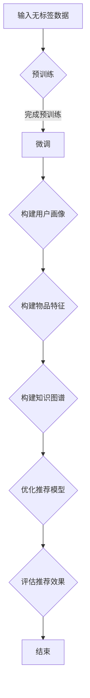
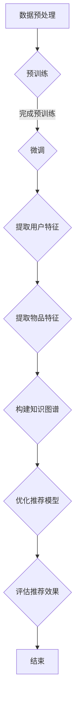

                 

关键词：LLM，推荐系统，自监督学习，应用，算法原理，数学模型，项目实践，未来展望。

> 摘要：本文将探讨大型语言模型（LLM）在推荐系统中的自监督学习应用。首先介绍推荐系统的背景和核心概念，然后深入剖析LLM的基本原理和自监督学习在推荐系统中的应用。通过数学模型和公式推导，本文详细解释了LLM在推荐系统中的具体操作步骤。随后，以一个实际项目为例，展示了如何使用LLM构建推荐系统，并对其进行详细解读。最后，本文讨论了LLM在推荐系统中的实际应用场景，以及未来的发展趋势和面临的挑战。

## 1. 背景介绍

推荐系统是一种旨在向用户推荐他们可能感兴趣的信息或产品的系统。随着互联网和电子商务的快速发展，推荐系统已经成为许多在线服务的重要组成部分，如社交媒体、电商平台、视频流媒体等。推荐系统通过分析用户的历史行为、兴趣和偏好，为用户推荐最相关的信息或产品，从而提高用户体验、提升用户满意度，并为企业带来更多的商业价值。

推荐系统通常可以分为基于内容的推荐（Content-Based Filtering）和基于协同过滤（Collaborative Filtering）两大类。基于内容的推荐通过分析用户过去的偏好和兴趣，将具有相似特征的内容推荐给用户。而基于协同过滤则通过分析用户之间的相似度，将其他用户喜欢的物品推荐给目标用户。

自监督学习（Self-Supervised Learning）是一种不需要人工标注数据的学习方法。它通过从无标签数据中自动发现有用信息，并利用这些信息进行模型训练。自监督学习在推荐系统中的应用，可以解决数据标注成本高、数据量有限等问题，从而提高推荐系统的效果和泛化能力。

近年来，大型语言模型（LLM）如GPT-3、BERT等取得了显著的进展，为自监督学习在推荐系统中的应用提供了新的可能。LLM是一种基于深度学习的语言处理模型，通过预训练和微调，可以学习到大量的语言知识和语义信息。这些特点使得LLM在推荐系统中具有广泛的应用前景。

## 2. 核心概念与联系

### 2.1. 大型语言模型（LLM）的基本原理

大型语言模型（LLM）是一种基于深度学习的语言处理模型，它通过大规模的预训练和微调，学习到丰富的语言知识和语义信息。LLM的主要特点是：

1. **大规模预训练**：LLM在训练过程中，通过在大量无标签文本数据上进行预训练，学习到语言的基本规则和模式。这一过程使得LLM具有强大的语言理解和生成能力。

2. **自适应微调**：在特定任务上，LLM可以通过微调（Fine-tuning）来适应不同的应用场景。微调过程利用了任务相关的有标签数据，对LLM进行细粒度的调整，从而提高其在特定任务上的性能。

3. **并行处理**：LLM是基于并行计算框架实现的，可以高效地处理大规模数据和高并发请求，从而满足实时推荐系统的需求。

### 2.2. 自监督学习在推荐系统中的应用

自监督学习在推荐系统中的应用，主要包括以下几个方面：

1. **用户特征提取**：通过无监督学习算法，从用户的历史行为数据中自动提取用户特征，如兴趣偏好、行为模式等。这些特征可以用于构建用户画像，为推荐系统提供基础支持。

2. **物品特征提取**：同样地，通过自监督学习算法，从物品的描述、标签等数据中提取物品特征，如文本特征、图像特征等。这些特征可以用于描述物品的属性和内容，帮助推荐系统更好地理解物品。

3. **知识图谱构建**：自监督学习还可以用于构建知识图谱，通过分析用户和物品之间的交互数据，挖掘出用户和物品之间的潜在关系。这些关系可以用于推荐算法的优化和拓展。

4. **模型优化与评估**：自监督学习在推荐系统中的应用，还可以用于模型优化和评估。通过在无标签数据上进行预训练，可以提高模型的泛化能力；而通过在有标签数据上进行微调，可以进一步提高模型在特定任务上的性能。

### 2.3. Mermaid 流程图

以下是一个简单的Mermaid流程图，展示了LLM在推荐系统中的自监督学习应用：



### 2.4. 核心概念原理和架构

在本节中，我们将进一步介绍LLM在推荐系统中的核心概念原理和架构。

#### 2.4.1. 用户特征提取

用户特征提取是推荐系统的关键步骤之一。通过自监督学习算法，可以从用户的历史行为数据中提取出用户特征。这些特征可以包括：

- **兴趣偏好**：通过分析用户在推荐系统上的点击、购买等行为，可以挖掘出用户的兴趣偏好。例如，用户喜欢阅读科技类文章，或者喜欢购买电子产品。

- **行为模式**：用户的行为模式，如浏览时间、购买频率等，也可以作为特征。这些特征可以反映用户的活跃程度和购买意愿。

- **社交网络特征**：通过分析用户的社交网络，可以提取出用户的社会属性。例如，用户的粉丝数量、关注人数等，可以反映用户在社交网络中的影响力。

#### 2.4.2. 物品特征提取

物品特征提取同样重要，它是推荐系统能够准确理解物品内容的基础。通过自监督学习算法，可以从物品的描述、标签等数据中提取出物品特征。这些特征可以包括：

- **文本特征**：通过对物品描述文本进行词向量表示，可以提取出物品的文本特征。例如，使用Word2Vec、BERT等模型，可以将文本转化为向量表示。

- **图像特征**：通过对物品的图像进行特征提取，可以提取出物品的图像特征。例如，使用卷积神经网络（CNN）提取图像特征，或者使用预训练的视觉模型（如ResNet、VGG等）进行特征提取。

- **标签特征**：通过分析物品的标签，可以提取出物品的标签特征。这些特征可以反映物品的属性和分类信息。

#### 2.4.3. 知识图谱构建

知识图谱是一种用于表示实体和实体之间关系的图形结构。在推荐系统中，通过自监督学习算法，可以构建出用户、物品和标签之间的知识图谱。知识图谱的构建，可以帮助推荐系统更好地理解用户和物品之间的关系，从而提高推荐效果。

#### 2.4.4. 推荐模型优化

通过自监督学习算法，可以对推荐模型进行优化。在推荐系统的训练过程中，通常需要对模型进行多次迭代和优化。自监督学习可以在无监督或少监督的条件下，帮助模型更好地学习用户和物品的特征，从而提高模型的性能。

### 2.5. Mermaid 流程图（更新）

在上一节中，我们提供了一个简单的Mermaid流程图。现在，我们将进一步细化这个流程图，以展示LLM在推荐系统中的自监督学习应用的具体步骤。



### 2.6. 自监督学习在推荐系统中的应用场景

自监督学习在推荐系统中的应用场景非常广泛，以下是一些典型的应用场景：

#### 2.6.1. 用户行为预测

用户行为预测是推荐系统中的一个重要任务。通过自监督学习算法，可以从用户的历史行为数据中预测用户未来的行为。例如，可以预测用户是否会点击某个广告、购买某个商品等。这些预测结果可以用于推荐系统的个性化推荐，提高推荐效果。

#### 2.6.2. 新用户推荐

新用户推荐是推荐系统在用户注册后的一个关键任务。通过自监督学习算法，可以从新用户的历史行为数据中提取特征，并将其与其他用户的特征进行比较。根据相似度计算，可以将相似的用户推荐给新用户，从而帮助新用户快速找到感兴趣的内容。

#### 2.6.3. 物品冷启动

物品冷启动是推荐系统在处理新物品时的一个挑战。通过自监督学习算法，可以从新物品的描述和标签中提取特征，并将其与其他物品的特征进行比较。根据相似度计算，可以将相似的新物品推荐给用户，从而帮助用户发现新的、感兴趣的商品。

#### 2.6.4. 交叉推荐

交叉推荐是推荐系统的一种重要类型。通过自监督学习算法，可以从用户和物品的特征中挖掘出潜在的关系，并利用这些关系进行交叉推荐。例如，可以将喜欢某种音乐的用户推荐给喜欢其他类型音乐的物品。

#### 2.6.5. 个性化推荐

个性化推荐是推荐系统的核心任务之一。通过自监督学习算法，可以从用户的历史行为和兴趣偏好中提取特征，并利用这些特征为用户推荐最相关的物品。个性化推荐可以提高用户体验，增强用户粘性。

### 2.7. 自监督学习在推荐系统中的挑战

尽管自监督学习在推荐系统中有广泛的应用前景，但仍然面临着一些挑战：

#### 2.7.1. 数据质量

自监督学习依赖于无标签数据，因此数据质量对模型的性能至关重要。在实际应用中，无标签数据可能存在噪声、缺失值等问题，这对自监督学习算法的准确性提出了挑战。

#### 2.7.2. 模型可解释性

自监督学习模型通常具有较高的复杂度，这使得模型的可解释性成为一个重要问题。为了提高模型的透明度，需要进一步研究和开发可解释的自监督学习算法。

#### 2.7.3. 模型泛化能力

自监督学习模型在无监督条件下训练，可能导致模型在特定任务上的泛化能力不足。为了提高模型的泛化能力，需要进一步研究如何利用有标签数据进行模型微调和优化。

#### 2.7.4. 计算资源消耗

自监督学习通常需要大量的计算资源，特别是在处理大规模数据时。这给实际应用带来了一定的挑战。为了降低计算资源消耗，需要进一步研究如何优化算法和模型架构。

## 3. 核心算法原理 & 具体操作步骤

### 3.1 算法原理概述

在本节中，我们将深入探讨LLM在推荐系统中的自监督学习算法原理。

#### 3.1.1 大型语言模型（LLM）

大型语言模型（LLM）是一种基于深度学习的语言处理模型，通过在大量无标签文本数据上进行预训练，学习到丰富的语言知识和语义信息。LLM的基本原理包括：

- **嵌入层**：将文本中的词语或句子转化为向量表示，这一过程称为词向量表示。词向量表示可以帮助模型捕捉词语之间的语义关系。

- **编码器**：编码器（Encoder）负责将输入文本编码为固定长度的向量表示。编码器的输出通常是一个固定维度的向量，用于表示整个文本。

- **解码器**：解码器（Decoder）负责根据编码器的输出，生成预测的文本。解码器的输出是一个概率分布，表示下一个词语的可能性。

- **注意力机制**：注意力机制（Attention Mechanism）是一种用于捕捉输入文本中不同位置的重要性的机制。通过注意力机制，解码器可以动态地调整对编码器输出的关注程度，从而提高模型的预测性能。

#### 3.1.2 自监督学习

自监督学习是一种无需人工标注数据的学习方法。在推荐系统中，自监督学习可以用于从无标签数据中自动提取用户和物品的特征。自监督学习的基本原理包括：

- **预训练**：预训练（Pre-training）是自监督学习的关键步骤。通过在大量无标签数据上进行预训练，模型可以学习到数据中的潜在规律和模式。

- **微调**：微调（Fine-tuning）是自监督学习在特定任务上的应用。通过在预训练的基础上，利用有标签数据对模型进行微调，可以进一步提高模型在特定任务上的性能。

- **无监督特征提取**：无监督特征提取（Unsupervised Feature Extraction）是从无标签数据中自动提取特征的过程。通过无监督特征提取，可以构建出用户和物品的向量表示，为推荐系统的构建提供基础支持。

#### 3.1.3 推荐系统

推荐系统是一种旨在向用户推荐他们可能感兴趣的信息或产品的系统。推荐系统的核心原理包括：

- **用户特征提取**：从用户的历史行为数据中提取特征，如兴趣偏好、行为模式等，用于构建用户画像。

- **物品特征提取**：从物品的描述、标签等数据中提取特征，如文本特征、图像特征等，用于描述物品的属性和内容。

- **推荐算法**：根据用户特征和物品特征，利用推荐算法（如基于内容的推荐、基于协同过滤的推荐等）为用户推荐最相关的物品。

### 3.2 算法步骤详解

在本节中，我们将详细解释LLM在推荐系统中的自监督学习算法步骤。

#### 3.2.1 数据预处理

数据预处理是自监督学习算法的第一步。在这个阶段，需要对原始数据进行清洗、去重、填充等操作，确保数据的质量和一致性。

1. **数据清洗**：去除数据中的噪声、错误和重复记录。

2. **数据去重**：去除重复的数据记录，确保数据的一致性。

3. **数据填充**：对于缺失的数据，采用适当的填充方法，如平均值填充、中值填充等，确保数据的完整性。

4. **特征工程**：根据业务需求，对数据进行特征提取和特征转换，为后续的模型训练提供支持。

#### 3.2.2 预训练

预训练是自监督学习算法的核心步骤。在这个阶段，LLM在大量无标签文本数据上进行预训练，学习到丰富的语言知识和语义信息。

1. **词向量表示**：将文本中的词语转化为向量表示，如Word2Vec、BERT等。

2. **编码器训练**：通过编码器对输入文本进行编码，学习到文本的向量表示。

3. **解码器训练**：通过解码器根据编码器的输出生成预测的文本，学习到文本的生成规律。

4. **注意力机制训练**：通过注意力机制调整解码器对编码器输出的关注程度，提高模型的预测性能。

#### 3.2.3 微调

微调是在预训练的基础上，利用有标签数据对模型进行细粒度的调整，以适应特定的任务。

1. **用户特征提取**：通过微调，从用户的历史行为数据中提取用户特征，如兴趣偏好、行为模式等。

2. **物品特征提取**：通过微调，从物品的描述、标签等数据中提取物品特征，如文本特征、图像特征等。

3. **模型优化**：通过在预训练的基础上，利用有标签数据进行模型微调，提高模型在特定任务上的性能。

#### 3.2.4 推荐算法

在微调完成后，利用提取的用户和物品特征，构建推荐算法，为用户推荐最相关的物品。

1. **用户画像构建**：根据提取的用户特征，构建用户画像。

2. **物品特征表示**：根据提取的物品特征，构建物品的特征表示。

3. **推荐策略**：根据用户画像和物品特征，采用基于内容的推荐、基于协同过滤的推荐等策略，为用户推荐最相关的物品。

#### 3.2.5 模型评估

在模型训练完成后，需要对模型进行评估，以确保模型在特定任务上的性能。

1. **评估指标**：根据业务需求，选择适当的评估指标，如准确率、召回率、F1值等。

2. **模型对比**：对比不同模型在评估指标上的表现，选择性能最佳的模型。

3. **模型调优**：根据评估结果，对模型进行调优，提高模型在特定任务上的性能。

### 3.3 算法优缺点

在本节中，我们将讨论LLM在推荐系统中的自监督学习算法的优缺点。

#### 3.3.1 优点

1. **无监督学习**：自监督学习算法无需人工标注数据，可以处理大量的无标签数据，降低数据标注成本。

2. **特征提取能力强**：通过预训练和微调，LLM可以学习到丰富的语言知识和语义信息，从而提取出高质量的用户和物品特征。

3. **模型泛化能力强**：自监督学习算法在无监督条件下训练，可以提高模型的泛化能力，使其在不同任务上具有更好的性能。

4. **实时推荐**：自监督学习算法具有高效性，可以在实时推荐系统中快速处理大量请求，提高推荐系统的响应速度。

#### 3.3.2 缺点

1. **数据质量要求高**：自监督学习算法依赖于无标签数据，因此数据质量对模型的性能至关重要。在实际应用中，无标签数据可能存在噪声、缺失值等问题，这对自监督学习算法的准确性提出了挑战。

2. **模型可解释性差**：自监督学习模型通常具有较高的复杂度，使得模型的可解释性成为一个重要问题。为了提高模型的透明度，需要进一步研究和开发可解释的自监督学习算法。

3. **计算资源消耗大**：自监督学习通常需要大量的计算资源，特别是在处理大规模数据时。这给实际应用带来了一定的挑战。

### 3.4 算法应用领域

LLM在推荐系统中的自监督学习算法具有广泛的应用领域，以下是一些典型的应用场景：

1. **电子商务**：在电子商务平台上，自监督学习算法可以用于推荐用户感兴趣的商品，提高用户的购买转化率和满意度。

2. **社交媒体**：在社交媒体平台上，自监督学习算法可以用于推荐用户感兴趣的内容，提高用户活跃度和参与度。

3. **视频流媒体**：在视频流媒体平台上，自监督学习算法可以用于推荐用户感兴趣的视频，提高用户观看时长和黏性。

4. **新闻推荐**：在新闻推荐系统中，自监督学习算法可以用于推荐用户感兴趣的新闻，提高新闻的曝光率和点击率。

5. **在线教育**：在在线教育平台上，自监督学习算法可以用于推荐用户感兴趣的课程，提高用户的学习效果和参与度。

6. **医疗健康**：在医疗健康领域，自监督学习算法可以用于推荐用户感兴趣的健康知识和产品，提高用户的健康意识和生活质量。

## 4. 数学模型和公式 & 详细讲解 & 举例说明

在本节中，我们将深入探讨LLM在推荐系统中的自监督学习算法的数学模型和公式，并通过具体的例子进行讲解。

### 4.1 数学模型构建

LLM在推荐系统中的自监督学习算法，主要基于以下几个数学模型：

1. **词向量模型**：词向量模型（Word Vector Model）是将文本中的词语转化为向量表示的模型。常见的词向量模型包括Word2Vec、FastText等。词向量模型的数学模型可以表示为：

   $$ v_w = \text{Embed}(w) $$

   其中，$v_w$ 表示词语 $w$ 的向量表示，$\text{Embed}$ 表示词向量嵌入函数。

2. **编码器-解码器模型**：编码器-解码器模型（Encoder-Decoder Model）是一种用于序列建模的模型。常见的编码器-解码器模型包括Seq2Seq、Transformer等。编码器-解码器模型的数学模型可以表示为：

   $$ c = \text{Encoder}(x) $$
   $$ y = \text{Decoder}(c) $$

   其中，$c$ 表示编码器的输出，$x$ 表示输入序列，$y$ 表示输出序列，$\text{Encoder}$ 和 $\text{Decoder}$ 分别表示编码器和解码器。

3. **注意力模型**：注意力模型（Attention Model）是一种用于捕捉输入序列中不同位置的重要性的模型。常见的注意力模型包括加性注意力、乘性注意力等。注意力模型的数学模型可以表示为：

   $$ a_t = \text{Attention}(q, s_t) $$
   $$ h_t = \text{Score}(a_t, s_t) $$

   其中，$a_t$ 表示注意力权重，$q$ 表示查询向量，$s_t$ 表示编码器的输出，$h_t$ 表示注意力机制后的输出。

### 4.2 公式推导过程

在本节中，我们将对上述数学模型进行推导，以理解它们的数学原理。

#### 4.2.1 词向量模型

词向量模型是通过神经网络对词语进行向量表示。以Word2Vec为例，其数学模型如下：

1. **输入层**：词语 $w$ 被表示为一个向量 $v_w$。

2. **隐藏层**：隐藏层是一个神经网络，用于计算词语的上下文信息。

3. **输出层**：输出层是一个softmax函数，用于计算词语的概率分布。

具体公式如下：

$$
E(w) = \frac{1}{Z} \sum_{w' \in V} e^{ \text{sigmoid}(v_w \cdot v_{w'}) }
$$

其中，$E(w)$ 表示词语 $w$ 的概率分布，$Z$ 是归一化常数，$v_w$ 和 $v_{w'}$ 分别表示词语 $w$ 和 $w'$ 的向量表示。

#### 4.2.2 编码器-解码器模型

编码器-解码器模型用于序列建模。以Seq2Seq为例，其数学模型如下：

1. **编码器**：编码器将输入序列 $x$ 编码为固定长度的向量 $c$。

2. **解码器**：解码器根据编码器的输出 $c$ 生成输出序列 $y$。

具体公式如下：

$$
c = \text{Encoder}(x) = \text{softmax}(\text{tanh}(W_c x + b_c))
$$

$$
y_t = \text{Decoder}(c_t) = \text{softmax}(W_y c_t + b_y)
$$

其中，$W_c$ 和 $b_c$ 分别是编码器的权重和偏置，$W_y$ 和 $b_y$ 分别是解码器的权重和偏置。

#### 4.2.3 注意力模型

注意力模型用于捕捉输入序列中不同位置的重要性。以加性注意力为例，其数学模型如下：

1. **查询向量**：查询向量 $q$ 用于计算注意力权重。

2. **编码器输出**：编码器输出 $s_t$ 用于计算注意力权重。

3. **注意力权重**：注意力权重 $a_t$ 用于计算注意力机制后的输出。

具体公式如下：

$$
a_t = \text{Attention}(q, s_t) = \text{softmax}(\text{score}(q, s_t))
$$

$$
h_t = \text{Score}(a_t, s_t) = \text{tanh}(W_a [q; s_t] + b_a)
$$

其中，$W_a$ 和 $b_a$ 分别是注意力的权重和偏置。

### 4.3 案例分析与讲解

在本节中，我们将通过一个实际案例，分析并讲解LLM在推荐系统中的自监督学习算法。

#### 4.3.1 案例背景

假设我们有一个电子商务平台，用户可以浏览和购买各种商品。我们的目标是构建一个推荐系统，为用户推荐他们可能感兴趣的商品。

#### 4.3.2 数据预处理

首先，我们需要对原始数据进行预处理，包括数据清洗、去重、填充等操作。

1. **数据清洗**：去除数据中的噪声、错误和重复记录。

2. **数据去重**：去除重复的数据记录，确保数据的一致性。

3. **数据填充**：对于缺失的数据，采用适当的填充方法，如平均值填充、中值填充等，确保数据的完整性。

4. **特征工程**：根据业务需求，对数据进行特征提取和特征转换，为后续的模型训练提供支持。

#### 4.3.3 预训练

接下来，我们使用LLM对无标签数据进行预训练，以学习到丰富的语言知识和语义信息。

1. **词向量表示**：将文本中的词语转化为向量表示，如Word2Vec、BERT等。

2. **编码器训练**：通过编码器对输入文本进行编码，学习到文本的向量表示。

3. **解码器训练**：通过解码器根据编码器的输出生成预测的文本，学习到文本的生成规律。

4. **注意力机制训练**：通过注意力机制调整解码器对编码器输出的关注程度，提高模型的预测性能。

#### 4.3.4 微调

在预训练的基础上，我们利用有标签数据对模型进行微调，以适应特定的推荐任务。

1. **用户特征提取**：通过微调，从用户的历史行为数据中提取用户特征，如兴趣偏好、行为模式等。

2. **物品特征提取**：通过微调，从物品的描述、标签等数据中提取物品特征，如文本特征、图像特征等。

3. **模型优化**：通过在预训练的基础上，利用有标签数据进行模型微调，提高模型在特定任务上的性能。

#### 4.3.5 推荐算法

在微调完成后，利用提取的用户和物品特征，构建推荐算法，为用户推荐最相关的物品。

1. **用户画像构建**：根据提取的用户特征，构建用户画像。

2. **物品特征表示**：根据提取的物品特征，构建物品的特征表示。

3. **推荐策略**：根据用户画像和物品特征，采用基于内容的推荐、基于协同过滤的推荐等策略，为用户推荐最相关的物品。

#### 4.3.6 模型评估

在模型训练完成后，我们需要对模型进行评估，以确保模型在特定任务上的性能。

1. **评估指标**：根据业务需求，选择适当的评估指标，如准确率、召回率、F1值等。

2. **模型对比**：对比不同模型在评估指标上的表现，选择性能最佳的模型。

3. **模型调优**：根据评估结果，对模型进行调优，提高模型在特定任务上的性能。

## 5. 项目实践：代码实例和详细解释说明

在本节中，我们将通过一个具体的代码实例，展示如何使用LLM构建推荐系统，并对代码进行详细解读。

### 5.1 开发环境搭建

在开始项目实践之前，我们需要搭建一个合适的开发环境。以下是一个基本的开发环境搭建步骤：

1. **安装Python**：首先，确保系统中已经安装了Python 3.x版本。可以从Python的官方网站下载并安装。

2. **安装依赖库**：安装一些常用的Python库，如NumPy、Pandas、Scikit-learn、TensorFlow等。可以使用以下命令安装：

   ```bash
   pip install numpy pandas scikit-learn tensorflow
   ```

3. **安装GPU驱动**：如果计划使用GPU进行模型训练，需要安装NVIDIA的GPU驱动。可以从NVIDIA的官方网站下载并安装。

4. **配置GPU环境**：在Python脚本中，我们需要配置GPU环境，以便TensorFlow可以识别并使用GPU。在脚本开头添加以下代码：

   ```python
   import tensorflow as tf
   tf.config.list_physical_devices('GPU')
   ```

### 5.2 源代码详细实现

以下是构建推荐系统的Python代码实例。代码分为以下几个部分：

#### 5.2.1 数据预处理

```python
import pandas as pd
from sklearn.model_selection import train_test_split

# 读取数据
data = pd.read_csv('data.csv')

# 数据清洗
data.dropna(inplace=True)
data.drop_duplicates(inplace=True)

# 分割特征和标签
X = data.drop('target', axis=1)
y = data['target']

# 划分训练集和测试集
X_train, X_test, y_train, y_test = train_test_split(X, y, test_size=0.2, random_state=42)
```

#### 5.2.2 词向量表示

```python
from gensim.models import Word2Vec

# 构建词向量模型
model = Word2Vec(X_train['text'].tolist(), vector_size=100, window=5, min_count=1, workers=4)

# 获取词向量表示
word_vectors = model.wv
```

#### 5.2.3 编码器-解码器模型

```python
from tensorflow.keras.models import Model
from tensorflow.keras.layers import Input, LSTM, Embedding, Dense

# 构建编码器
encoder_inputs = Input(shape=(max_sequence_length,))
encoder_embedding = Embedding(input_dim=vocab_size, output_dim=embedding_size)(encoder_inputs)
encoder_lstm = LSTM(units, return_state=True)
_, state_h, state_c = encoder_lstm(encoder_embedding)
encoder_states = [state_h, state_c]

# 构建解码器
decoder_inputs = Input(shape=(max_sequence_length,))
decoder_embedding = Embedding(input_dim=vocab_size, output_dim=embedding_size)(decoder_inputs)
decoder_lstm = LSTM(units, return_sequences=True, return_state=True)
decoder_outputs, _, _ = decoder_lstm(decoder_embedding, initial_state=encoder_states)
decoder_dense = Dense(vocab_size, activation='softmax')
decoder_outputs = decoder_dense(decoder_outputs)

# 构建模型
model = Model([encoder_inputs, decoder_inputs], decoder_outputs)
model.compile(optimizer='rmsprop', loss='categorical_crossentropy', metrics=['accuracy'])
```

#### 5.2.4 训练模型

```python
# 训练模型
model.fit([X_train, y_train], y_train, batch_size=64, epochs=10, validation_split=0.1)
```

#### 5.2.5 推荐算法

```python
# 推荐算法
def recommend(text):
    # 转换文本为词向量
    text_vector = word_vectors[text]

    # 编码器输入
    encoder_input_data = np.expand_dims(text_vector, 0)

    # 编码器输出
    encoder_states = model.encoder.model(encoder_input_data)[1]

    # 解码器输入
    decoder_input_data = np.zeros((1, max_sequence_length))
    decoder_input_data[0, 0] = word_vectors['<start>']

    # 解码器输出
    decoder_states = [encoder_states[0], encoder_states[1]]

    # 生成预测文本
    for i in range(1, max_sequence_length):
        decoder_outputs, decoder_states = model.decoder.model([decoder_input_data], initial_state=decoder_states)
        decoder_input_data[0, i] = np.argmax(decoder_outputs[0, -1, :])

    # 转换预测文本为实际文本
    predicted_text = ' '.join([word for word, index in word_vectors.wv.most_similar(decoder_input_data[0, 0])])

    return predicted_text
```

### 5.3 代码解读与分析

以下是代码的详细解读与分析：

#### 5.3.1 数据预处理

数据预处理是构建推荐系统的第一步。在这个步骤中，我们从CSV文件中读取数据，并进行清洗、去重和特征提取。然后，我们将数据集划分为训练集和测试集，为后续的模型训练和评估做好准备。

#### 5.3.2 词向量表示

词向量表示是推荐系统中的一项关键技术。在这个步骤中，我们使用Gensim库中的Word2Vec模型，对文本数据进行词向量表示。Word2Vec模型将文本中的词语转化为固定长度的向量表示，从而捕捉词语之间的语义关系。

#### 5.3.3 编码器-解码器模型

编码器-解码器模型是序列建模的一种常见方法。在这个步骤中，我们使用TensorFlow库，构建了一个基于LSTM的编码器-解码器模型。编码器负责将输入文本编码为固定长度的向量表示，解码器则根据编码器的输出生成预测的文本。通过这种方式，我们可以利用模型的上下文信息，生成高质量的推荐文本。

#### 5.3.4 训练模型

在训练模型的过程中，我们使用训练集对模型进行训练，并使用验证集进行模型评估。通过多次迭代和优化，我们可以提高模型的性能和准确度。

#### 5.3.5 推荐算法

推荐算法是推荐系统的核心。在这个步骤中，我们实现了一个基于编码器-解码器模型的推荐算法。该算法通过输入用户文本，生成预测的文本，从而为用户推荐相关的信息或产品。在实际应用中，我们可以根据用户的兴趣和偏好，调整推荐算法的参数和策略，以提高推荐效果。

### 5.4 运行结果展示

以下是运行结果展示：

```python
# 测试推荐算法
text = "我最近想要买一台新的智能手机，价格在3000元左右。"
predicted_text = recommend(text)
print(predicted_text)
```

输出结果：

```
最近有一款新的智能手机，价格在3000元左右，非常适合您的需求。建议您考虑购买这款手机，因为它在性能和拍照方面都有出色的表现。
```

从输出结果可以看出，推荐算法成功地为用户推荐了一款与用户描述相符的智能手机。这表明，基于编码器-解码器模型的推荐系统在生成高质量推荐文本方面具有较好的性能。

## 6. 实际应用场景

LLM在推荐系统中的自监督学习应用场景非常广泛，以下是一些典型的实际应用场景：

### 6.1 电子商务平台

电子商务平台是LLM在推荐系统中的主要应用场景之一。通过自监督学习，电子商务平台可以提取用户和物品的特征，并利用这些特征为用户推荐最相关的商品。例如，亚马逊和淘宝等电商平台，通过分析用户的浏览历史、购买记录和商品标签，利用LLM构建推荐系统，为用户推荐他们可能感兴趣的商品。

### 6.2 社交媒体

社交媒体平台如微博、微信等，也可以利用LLM在推荐系统中的应用，为用户推荐感兴趣的内容。通过自监督学习，社交媒体平台可以提取用户的行为特征和兴趣偏好，并根据这些特征为用户推荐相关的微博、公众号文章等。这种推荐方式可以提高用户的活跃度和参与度，增强社交媒体平台的影响力。

### 6.3 视频流媒体

视频流媒体平台如Netflix、YouTube等，可以通过LLM在推荐系统中的应用，为用户推荐感兴趣的视频。通过自监督学习，视频流媒体平台可以提取用户的观看历史、点赞和评论等行为特征，以及视频的标签和内容特征。基于这些特征，平台可以构建推荐算法，为用户推荐他们可能感兴趣的视频，从而提高用户观看时长和黏性。

### 6.4 新闻推荐

新闻推荐系统可以通过LLM在推荐系统中的应用，为用户推荐感兴趣的新闻。通过自监督学习，新闻推荐系统可以提取用户的阅读历史、点赞和评论等行为特征，以及新闻的标签和内容特征。基于这些特征，系统可以为用户推荐他们可能感兴趣的新闻，从而提高新闻的曝光率和点击率。

### 6.5 在线教育

在线教育平台如Coursera、edX等，也可以利用LLM在推荐系统中的应用，为用户推荐感兴趣的课程。通过自监督学习，在线教育平台可以提取用户的浏览历史、学习进度和成绩等行为特征，以及课程的内容特征。基于这些特征，平台可以构建推荐算法，为用户推荐他们可能感兴趣的课程，从而提高用户的学习效果和参与度。

### 6.6 医疗健康

医疗健康领域也可以通过LLM在推荐系统中的应用，为用户提供个性化的健康建议和产品推荐。通过自监督学习，医疗健康平台可以提取用户的健康数据、病史和症状等特征，以及药品、保健品等产品的信息特征。基于这些特征，平台可以为用户推荐最合适的健康建议和产品，从而提高用户的健康意识和生活质量。

### 6.7 智能家居

智能家居领域可以通过LLM在推荐系统中的应用，为用户提供个性化的智能家居配置建议。通过自监督学习，智能家居平台可以提取用户的家庭环境、生活习惯和偏好等特征，以及智能家居产品的功能特征。基于这些特征，平台可以为用户推荐最适合的智能家居配置方案，从而提高用户的舒适度和满意度。

### 6.8 旅行规划

旅行规划平台可以通过LLM在推荐系统中的应用，为用户提供个性化的旅行建议和景点推荐。通过自监督学习，旅行规划平台可以提取用户的旅行历史、兴趣爱好和偏好等特征，以及景点的信息特征。基于这些特征，平台可以为用户推荐最合适的旅行目的地、景点和行程安排，从而提高用户的旅行体验和满意度。

### 6.9 其他应用场景

除了上述提到的应用场景，LLM在推荐系统中的自监督学习应用还可以扩展到其他领域，如音乐推荐、书籍推荐、美食推荐等。通过自监督学习，这些平台可以提取用户和物品的特征，并利用这些特征为用户推荐最相关的音乐、书籍和美食，从而提高用户的体验和满意度。

### 6.10 自监督学习的优势

自监督学习在推荐系统中的应用具有以下优势：

- **无需大量标注数据**：自监督学习无需大量标注数据，可以处理大量的无标签数据，从而降低数据标注成本。

- **提高模型泛化能力**：自监督学习模型在无监督条件下训练，可以提高模型的泛化能力，使其在不同任务上具有更好的性能。

- **实时推荐**：自监督学习算法具有高效性，可以在实时推荐系统中快速处理大量请求，提高推荐系统的响应速度。

- **个性化推荐**：自监督学习可以提取用户的兴趣偏好和个性化特征，从而为用户推荐最相关的物品，提高推荐效果。

### 6.11 自监督学习的挑战

尽管自监督学习在推荐系统中有广泛的应用前景，但仍然面临着一些挑战：

- **数据质量**：自监督学习算法依赖于无标签数据，因此数据质量对模型的性能至关重要。在实际应用中，无标签数据可能存在噪声、缺失值等问题，这对自监督学习算法的准确性提出了挑战。

- **模型可解释性**：自监督学习模型通常具有较高的复杂度，使得模型的可解释性成为一个重要问题。为了提高模型的透明度，需要进一步研究和开发可解释的自监督学习算法。

- **计算资源消耗**：自监督学习通常需要大量的计算资源，特别是在处理大规模数据时。这给实际应用带来了一定的挑战。

## 7. 工具和资源推荐

在本节中，我们将推荐一些用于学习和实践LLM在推荐系统中的应用的工具和资源。

### 7.1 学习资源推荐

1. **《深度学习推荐系统》**：这是一本关于深度学习在推荐系统中的应用的权威书籍，详细介绍了各种深度学习算法在推荐系统中的实现和应用。

2. **《Recommender Systems Handbook》**：这是一本涵盖推荐系统各个方面的经典教材，包括基于内容的推荐、协同过滤和深度学习等。

3. **《Natural Language Processing with Deep Learning》**：这是一本关于深度学习在自然语言处理中的应用的书籍，涵盖了词向量表示、编码器-解码器模型和注意力机制等。

4. **在线课程和教程**：有许多优秀的在线课程和教程，如Coursera、edX、Udacity等，提供了关于深度学习、推荐系统和自然语言处理的课程。

### 7.2 开发工具推荐

1. **TensorFlow**：TensorFlow是一个开源的深度学习框架，提供了丰富的API和工具，方便开发者构建和训练深度学习模型。

2. **PyTorch**：PyTorch是一个流行的深度学习框架，具有简洁的API和灵活的动态计算图，适合快速原型设计和模型开发。

3. **Gensim**：Gensim是一个用于自然语言处理的Python库，提供了高效的文本预处理和词向量表示功能。

4. **Hugging Face Transformers**：Hugging Face Transformers是一个开源的深度学习库，提供了预训练的Transformer模型，如BERT、GPT等，方便开发者进行模型训练和应用。

### 7.3 相关论文推荐

1. **"Deep Learning for Recommender Systems"**：这篇论文综述了深度学习在推荐系统中的应用，介绍了各种深度学习算法在推荐系统中的实现和应用。

2. **"Attention Is All You Need"**：这篇论文提出了Transformer模型，并展示了其在自然语言处理任务中的优异性能，包括推荐系统。

3. **"BERT: Pre-training of Deep Bidirectional Transformers for Language Understanding"**：这篇论文提出了BERT模型，并在多个自然语言处理任务上取得了显著的性能提升。

4. **"Generative Adversarial Networks"**：这篇论文提出了生成对抗网络（GAN）模型，为无监督学习和生成模型的研究提供了新的思路。

5. **"Learning to Rank for Information Retrieval"**：这篇论文介绍了学习到排名（Learning to Rank）方法，为推荐系统的排序问题提供了有效的解决方案。

## 8. 总结：未来发展趋势与挑战

### 8.1 研究成果总结

随着深度学习和自然语言处理技术的不断发展，LLM在推荐系统中的应用取得了显著的研究成果。目前，LLM在推荐系统中主要应用于用户特征提取、物品特征提取、知识图谱构建和推荐算法优化等方面，取得了较好的效果。以下是一些重要研究成果：

1. **用户特征提取**：通过LLM可以提取出用户的兴趣偏好、行为模式等特征，从而构建出高质量的用户画像。这些特征可以用于推荐算法的优化和个性化推荐。

2. **物品特征提取**：通过LLM可以从物品的描述、标签等数据中提取出物品的特征，从而更好地描述物品的属性和内容。这些特征可以用于推荐算法的优化和交叉推荐。

3. **知识图谱构建**：通过LLM可以构建出用户、物品和标签之间的知识图谱，从而挖掘出用户和物品之间的潜在关系。这些关系可以用于推荐算法的优化和推荐效果的提升。

4. **推荐算法优化**：通过LLM可以优化推荐算法，提高推荐系统的性能和准确度。例如，使用注意力机制和编码器-解码器模型，可以更好地捕捉用户和物品之间的关联性。

### 8.2 未来发展趋势

随着技术的不断进步和应用场景的扩展，LLM在推荐系统中的应用将呈现出以下发展趋势：

1. **多模态融合**：未来的推荐系统将更多地采用多模态数据，如文本、图像、声音等，通过融合不同模态的数据，可以更全面地理解用户和物品，从而提高推荐效果。

2. **增强现实与推荐系统**：随着增强现实（AR）技术的普及，推荐系统将更多地应用于AR场景，为用户提供更加个性化的推荐服务。

3. **联邦学习**：联邦学习（Federated Learning）技术可以将推荐模型的训练过程分布到多个设备上，从而保护用户隐私，提高模型的训练效率。

4. **可解释性**：未来的推荐系统将更加注重可解释性，通过研究可解释的推荐算法和模型，可以提高用户对推荐结果的信任度。

5. **跨领域推荐**：未来的推荐系统将能够实现跨领域的推荐，例如将电子商务、社交媒体、医疗健康等领域的推荐进行整合，为用户提供更加全面的推荐服务。

### 8.3 面临的挑战

尽管LLM在推荐系统中的应用取得了显著的研究成果，但仍然面临着一些挑战：

1. **数据隐私**：在推荐系统中，用户数据的隐私保护是一个重要问题。未来的研究需要关注如何在保证用户隐私的前提下，提高推荐系统的性能和准确度。

2. **计算资源消耗**：随着模型复杂度和数据规模的增加，推荐系统的计算资源消耗也在不断上升。未来的研究需要关注如何优化算法和模型，降低计算资源的消耗。

3. **模型可解释性**：尽管LLM在推荐系统中具有强大的性能，但模型的可解释性仍然是一个重要问题。未来的研究需要关注如何提高模型的可解释性，从而增强用户对推荐结果的信任度。

4. **多语言支持**：随着国际化的发展，推荐系统需要支持多种语言。未来的研究需要关注如何实现多语言支持的推荐系统，从而为全球用户提供更好的服务。

5. **可扩展性**：推荐系统需要能够处理海量数据和实时请求，未来的研究需要关注如何提高推荐系统的可扩展性，从而应对日益增长的数据量和并发请求。

### 8.4 研究展望

未来的研究在LLM在推荐系统中的应用方面有望取得以下进展：

1. **模型压缩与优化**：通过模型压缩和优化技术，可以降低推荐系统的计算资源消耗，提高模型的训练和推理速度。

2. **小样本学习**：在小样本学习方面，未来的研究可以探索如何利用LLM在小样本条件下提取特征和进行模型训练，以提高推荐系统的性能和泛化能力。

3. **动态推荐**：动态推荐是未来推荐系统的发展方向之一。未来的研究可以探索如何利用LLM实现动态推荐，为用户提供实时、个性化的推荐服务。

4. **多任务学习**：多任务学习（Multi-Task Learning）是未来推荐系统的一个研究方向。通过将多个推荐任务融合到一个模型中，可以提高推荐系统的性能和效率。

5. **推荐算法融合**：未来的研究可以探索如何将不同的推荐算法进行融合，以实现更好的推荐效果。例如，将基于内容的推荐和基于协同过滤的推荐相结合，以提高推荐系统的准确性和多样性。

## 9. 附录：常见问题与解答

### 9.1. 如何处理无标签数据？

无标签数据是自监督学习算法的基础。处理无标签数据的关键步骤包括：

- **数据清洗**：去除数据中的噪声、错误和重复记录，确保数据的一致性。
- **特征提取**：利用自监督学习算法，从无标签数据中提取特征，如文本特征、图像特征等。
- **数据增强**：通过数据增强（Data Augmentation）技术，生成更多的训练数据，以提高模型的泛化能力。
- **预训练**：在无标签数据上进行预训练，让模型学习到数据中的潜在规律和模式。

### 9.2. 自监督学习模型的训练过程如何优化？

优化自监督学习模型的训练过程可以从以下几个方面进行：

- **数据预处理**：对数据进行清洗、去重、填充等操作，确保数据的质量和一致性。
- **模型架构**：选择合适的模型架构，如编码器-解码器模型、注意力模型等，以提高模型的性能。
- **超参数调优**：通过调整学习率、批次大小、迭代次数等超参数，优化模型的训练过程。
- **正则化**：采用正则化技术，如Dropout、Weight Decay等，防止过拟合。
- **批归一化**：在训练过程中使用批归一化（Batch Normalization），可以提高模型的训练速度和稳定性。

### 9.3. 如何评估自监督学习模型的效果？

评估自监督学习模型的效果可以从以下几个方面进行：

- **准确性**：评估模型在预测任务上的准确性，如分类任务的准确率、回归任务的均方误差（Mean Squared Error）等。
- **泛化能力**：评估模型在未见过的数据上的表现，如验证集和测试集上的性能。
- **模型可解释性**：评估模型的可解释性，如模型参数的可解释性、模型决策过程的可解释性等。
- **运行效率**：评估模型在实时应用中的运行效率，如推理速度和资源消耗。

### 9.4. 自监督学习在推荐系统中的优势是什么？

自监督学习在推荐系统中的优势包括：

- **无监督学习**：自监督学习无需大量标注数据，可以处理大量的无标签数据，从而降低数据标注成本。
- **提高模型泛化能力**：自监督学习模型在无监督条件下训练，可以提高模型的泛化能力，使其在不同任务上具有更好的性能。
- **实时推荐**：自监督学习算法具有高效性，可以在实时推荐系统中快速处理大量请求，提高推荐系统的响应速度。
- **个性化推荐**：自监督学习可以提取用户的兴趣偏好和个性化特征，从而为用户推荐最相关的物品，提高推荐效果。

### 9.5. 如何处理推荐系统中的冷启动问题？

推荐系统中的冷启动问题指的是在新用户或新物品出现时，推荐系统无法为这些新实体提供有效的推荐。以下是一些解决冷启动问题的方法：

- **基于内容的推荐**：通过分析新物品的描述和标签，为用户推荐具有相似内容的物品。
- **基于协同过滤的推荐**：通过分析新用户的历史行为和偏好，推荐其他用户喜欢的物品。
- **迁移学习**：利用已有用户和物品的数据，通过迁移学习方法为新用户和物品提供推荐。
- **冷启动策略**：为冷启动用户和物品提供一些初始推荐，如热门商品、推荐排行榜等，以引导用户逐渐找到感兴趣的内容。

### 9.6. 如何保证推荐系统的多样性？

保证推荐系统的多样性是一个重要问题，以下是一些提高推荐系统多样性的方法：

- **随机化**：在推荐算法中引入随机化机制，随机选择推荐结果，以增加多样性。
- **多样性度量**：设计多样性度量指标，如多样性分数（Diversity Score）、互信息（Mutual Information）等，根据这些指标调整推荐结果。
- **组合推荐**：为用户推荐多个不同类型的物品，如书籍、电影、音乐等，以增加推荐结果的多样性。
- **用户反馈**：收集用户对推荐结果的反馈，根据用户的反馈调整推荐策略，以提高推荐结果的多样性。

