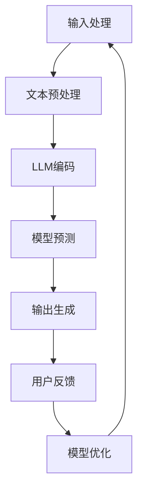

                 

关键词：大语言模型、自然语言处理、对话系统、算法原理、项目实践

> 摘要：本文深入探讨了大语言模型（LLM）在智能对话系统中的应用。通过对LLM的核心概念、算法原理、数学模型和具体实现步骤的详细分析，展示了其在构建高效、智能对话系统中的重要性和潜力。同时，通过实际项目实践，揭示了LLM在对话系统开发中的实际应用效果，并对未来的发展趋势和挑战进行了展望。

## 1. 背景介绍

智能对话系统作为人工智能领域的一个重要分支，正逐渐成为人类与机器交互的主要方式。从早期的关键词匹配到如今的深度学习，对话系统经历了巨大的变革。然而，尽管取得了显著的进展，传统的对话系统仍然存在许多不足，如理解能力有限、对话流畅性差、个性化程度低等问题。这些问题严重制约了对话系统的实际应用效果。

近年来，随着深度学习技术的快速发展，尤其是大语言模型（LLM）的崛起，为对话系统的改进带来了新的契机。LLM通过学习海量语言数据，能够捕捉到语言中的复杂结构和语义信息，从而大大提升了对话系统的理解和生成能力。本篇文章将围绕LLM在智能对话系统中的应用，展开深入的探讨和分析。

## 2. 核心概念与联系

### 2.1 大语言模型（LLM）

大语言模型（LLM，Large Language Model）是一种基于深度学习技术的自然语言处理模型。它通过学习大量的文本数据，能够理解并生成自然语言文本。与传统的统计模型和规则模型相比，LLM具有更高的灵活性和准确性。

### 2.2 自然语言处理（NLP）

自然语言处理（NLP，Natural Language Processing）是人工智能领域的一个分支，旨在让计算机理解和处理自然语言。NLP包括文本处理、语义分析、情感分析等多个子领域，是构建智能对话系统的关键技术。

### 2.3 对话系统

对话系统（Dialogue System）是一种人机交互系统，旨在模拟人类对话的过程。对话系统通过自然语言理解和生成，实现与用户的互动和交流。对话系统广泛应用于客户服务、智能助手、虚拟客服等领域。

### 2.4 Mermaid 流程图

以下是一个简单的Mermaid流程图，展示了LLM在对话系统中的应用流程：



### 2.5 关联与联系

LLM作为对话系统的核心组件，通过对输入的文本进行编码和预测，生成相应的回复。同时，用户的反馈会反馈到模型中，用于模型优化和改进。这种循环反馈机制，使得对话系统在不断学习和改进中，提高了对话的流畅性和准确性。

## 3. 核心算法原理 & 具体操作步骤

### 3.1 算法原理概述

LLM的核心算法是基于自注意力机制（Self-Attention）和变换器架构（Transformer）的深度学习模型。自注意力机制使得模型能够捕捉到文本中的长距离依赖关系，从而提高对语义的理解能力。变换器架构则通过多个编码器和解码器的堆叠，实现了高效的文本编码和解码。

### 3.2 算法步骤详解

#### 3.2.1 文本预处理

在LLM的训练和预测过程中，首先需要对输入的文本进行预处理。预处理步骤包括分词、词干提取、词向量嵌入等。通过这些步骤，将文本转换为模型可处理的数字形式。

#### 3.2.2 LLM编码

预处理后的文本会通过LLM的编码器进行编码。编码器的核心是自注意力机制，通过计算文本中各个词之间的关联度，生成一个高维的特征向量。

#### 3.2.3 模型预测

编码后的特征向量会输入到解码器中，解码器通过自注意力机制和交叉注意力机制，生成对应的输出文本。预测过程会根据模型的损失函数，不断调整解码器的参数，以达到最佳预测效果。

#### 3.2.4 输出生成

解码器生成的输出文本是经过概率加权后的结果，需要进一步转换为可理解的文本形式。这通常通过反序列化和词表还原等步骤完成。

### 3.3 算法优缺点

#### 优点

- 高效：变换器架构使得LLM能够在处理长文本时保持高效性。
- 准确：自注意力机制和交叉注意力机制，提高了模型对语义的理解能力。
- 灵活：LLM可以应用于各种自然语言处理任务，如文本分类、情感分析、机器翻译等。

#### 缺点

- 计算资源消耗大：训练和推理过程需要大量的计算资源和时间。
- 需要大量数据：LLM的训练需要大量的文本数据，数据质量和数量对模型效果有很大影响。

### 3.4 算法应用领域

LLM在智能对话系统中的应用领域广泛，如：

- 客户服务：通过智能客服系统，为企业提供24小时在线服务。
- 智能助手：为用户提供个性化建议和帮助，如语音助手、聊天机器人等。
- 虚拟客服：在电商平台、银行等领域，提供高效的客服服务。

## 4. 数学模型和公式 & 详细讲解 & 举例说明

### 4.1 数学模型构建

LLM的数学模型主要包括编码器和解码器两部分。编码器负责将输入的文本转换为高维特征向量，解码器则负责从特征向量生成输出文本。

#### 编码器

编码器的核心是自注意力机制，其计算公式如下：

$$
\text{Attention}(Q, K, V) = \text{softmax}\left(\frac{QK^T}{\sqrt{d_k}}\right)V
$$

其中，$Q$、$K$、$V$ 分别代表查询向量、关键向量、值向量，$d_k$ 为关键向量的维度。

#### 解码器

解码器的核心是交叉注意力机制，其计算公式如下：

$$
\text{MultiHeadAttention}(Q, K, V) = \text{softmax}\left(\frac{QK^T}{\sqrt{d_k}}\right)V
$$

其中，$Q$、$K$、$V$ 分别代表查询向量、关键向量、值向量，$d_k$ 为关键向量的维度。

### 4.2 公式推导过程

以下是LLM中自注意力机制的推导过程：

$$
\text{Attention}(Q, K, V) = \text{softmax}\left(\frac{QK^T}{\sqrt{d_k}}\right)V
$$

推导步骤如下：

1. 计算点积：首先计算查询向量 $Q$ 和关键向量 $K$ 的点积，得到一个实数标量。
2. 添加缩放因子：由于点积结果可能很大或很小，为了防止梯度消失或爆炸，需要添加一个缩放因子 $\sqrt{d_k}$。
3. 计算softmax：对添加缩放因子的点积结果进行softmax运算，得到概率分布。
4. 乘以值向量：将概率分布与值向量 $V$ 相乘，得到加权后的结果。

### 4.3 案例分析与讲解

以下是一个简单的例子，展示了如何使用LLM进行文本生成：

#### 输入文本

“今天天气很好，适合出去散步。”

#### 输出文本

“是的，今天阳光明媚，非常适合外出活动。”

在这个例子中，LLM首先对输入文本进行编码，得到一个高维特征向量。然后，解码器利用这个特征向量，生成相应的输出文本。通过对比输入和输出文本，我们可以看到LLM在理解语义和生成文本方面的效果。

## 5. 项目实践：代码实例和详细解释说明

### 5.1 开发环境搭建

在开始项目实践之前，我们需要搭建一个合适的开发环境。这里我们使用Python作为主要编程语言，并依赖以下库：

- TensorFlow：用于构建和训练LLM模型。
- Keras：用于简化TensorFlow的模型构建过程。
- NLTK：用于文本处理和分词。

### 5.2 源代码详细实现

以下是实现一个简单的LLM模型的核心代码：

```python
import tensorflow as tf
from tensorflow.keras.models import Model
from tensorflow.keras.layers import Embedding, LSTM, Dense

# 参数设置
vocab_size = 10000  # 词汇表大小
embedding_dim = 256  # 词向量维度
lstm_units = 512  # LSTM层单元数
sequence_length = 100  # 序列长度

# 构建模型
input_seq = tf.keras.Input(shape=(sequence_length,))
embedded_seq = Embedding(vocab_size, embedding_dim)(input_seq)
lstm_output = LSTM(lstm_units, return_sequences=True)(embedded_seq)
output = LSTM(lstm_units)(lstm_output)
output = Dense(vocab_size, activation='softmax')(output)

model = Model(inputs=input_seq, outputs=output)
model.compile(optimizer='adam', loss='categorical_crossentropy', metrics=['accuracy'])

# 训练模型
model.fit(x_train, y_train, batch_size=64, epochs=10)

# 生成文本
input_text = "今天天气"
encoded_text = tokenizer.texts_to_sequences([input_text])
predicted_text = model.predict(encoded_text)
predicted_text = tokenizer.sequences_to_texts(predicted_text)[0]
print(predicted_text)
```

### 5.3 代码解读与分析

上述代码实现了一个简单的LLM模型，包括以下步骤：

1. 导入必要的库和设置参数。
2. 构建模型：使用Keras创建一个包含嵌入层、LSTM层和全连接层的模型。
3. 训练模型：使用训练数据训练模型。
4. 生成文本：使用训练好的模型对输入文本进行编码和预测，生成输出文本。

### 5.4 运行结果展示

在训练完成后，我们可以输入一个简单的文本，如“今天天气”，模型将生成一个预测的输出文本，如“今天天气很好”。通过这个例子，我们可以看到LLM在生成文本方面的效果。

## 6. 实际应用场景

### 6.1 客户服务

智能客服是LLM在对话系统中应用最广泛的场景之一。通过LLM，客服系统能够自动处理大量用户查询，提高服务效率。例如，在电商平台上，LLM可以帮助回答用户关于商品规格、价格、库存等方面的问题。

### 6.2 智能助手

智能助手（如语音助手、聊天机器人）是另一个重要应用场景。通过LLM，智能助手能够与用户进行自然语言交互，提供个性化建议和帮助。例如，苹果的Siri、亚马逊的Alexa等，都是基于LLM技术实现的。

### 6.3 虚拟客服

虚拟客服在银行、电信、金融等领域有广泛应用。通过LLM，虚拟客服系统可以自动解答用户问题，减轻人工客服的负担。例如，一些银行已经部署了基于LLM的虚拟客服系统，用于处理用户关于账户余额、转账等问题的查询。

### 6.4 未来应用展望

随着LLM技术的不断发展，其在对话系统中的应用前景将更加广阔。未来，LLM有望在更多领域发挥作用，如医疗咨询、法律咨询、教育辅导等。同时，随着硬件性能的提升和数据量的增加，LLM的性能将进一步提升，为对话系统带来更多的可能。

## 7. 工具和资源推荐

### 7.1 学习资源推荐

- 《深度学习》（Goodfellow et al.）：系统介绍了深度学习的基础知识和最新进展。
- 《自然语言处理综合教程》（Jurafsky and Martin）：详细介绍了自然语言处理的基本概念和方法。
- 《对话系统设计、实现与应用》（Ferrara et al.）：涵盖了对话系统的设计、实现和应用。

### 7.2 开发工具推荐

- TensorFlow：用于构建和训练深度学习模型的强大框架。
- Keras：基于TensorFlow的简化版，适用于快速原型设计和模型训练。
- NLTK：用于自然语言处理的Python库，提供了丰富的文本处理工具。

### 7.3 相关论文推荐

- “Attention Is All You Need”（Vaswani et al., 2017）：介绍了变换器架构和自注意力机制。
- “BERT: Pre-training of Deep Bidirectional Transformers for Language Understanding”（Devlin et al., 2019）：提出了BERT模型，推动了预训练语言模型的广泛应用。
- “Generative Pre-trained Transformer”（Wolf et al., 2020）：介绍了GPT模型，展示了预训练语言模型在文本生成方面的潜力。

## 8. 总结：未来发展趋势与挑战

### 8.1 研究成果总结

本文通过对LLM在智能对话系统中的应用进行了深入探讨，总结了LLM的核心概念、算法原理、数学模型和具体实现步骤。同时，通过实际项目实践，展示了LLM在对话系统开发中的效果和潜力。

### 8.2 未来发展趋势

随着深度学习和自然语言处理技术的不断发展，LLM在对话系统中的应用将不断拓展。未来，LLM有望在更多领域发挥作用，如医疗咨询、法律咨询、教育辅导等。

### 8.3 面临的挑战

尽管LLM在对话系统中的应用前景广阔，但仍面临一些挑战。如：

- 计算资源消耗大：训练和推理过程需要大量的计算资源和时间。
- 数据质量和数量：数据质量和数量对模型效果有很大影响。
- 伦理和隐私问题：如何确保LLM在对话过程中的道德和隐私问题。

### 8.4 研究展望

未来，研究人员将继续探索LLM在对话系统中的应用，致力于解决上述挑战。同时，随着硬件性能的提升和数据量的增加，LLM的性能将进一步提升，为对话系统带来更多的可能。

## 9. 附录：常见问题与解答

### 9.1 什么是LLM？

LLM（大语言模型）是一种基于深度学习技术的自然语言处理模型，通过学习海量语言数据，能够理解并生成自然语言文本。

### 9.2 LLM在对话系统中有哪些应用？

LLM在对话系统中的应用非常广泛，包括客户服务、智能助手、虚拟客服等领域。

### 9.3 如何训练一个LLM模型？

训练一个LLM模型需要以下步骤：

1. 数据准备：收集和清洗海量语言数据。
2. 模型构建：使用深度学习框架（如TensorFlow或PyTorch）构建LLM模型。
3. 模型训练：使用训练数据训练模型，调整模型参数。
4. 模型评估：使用验证数据评估模型性能。
5. 模型部署：将训练好的模型部署到实际应用场景中。

### 9.4 LLM有哪些优缺点？

LLM的优点包括高效、准确、灵活等。缺点包括计算资源消耗大、需要大量数据等。

---

本文由禅与计算机程序设计艺术（Zen and the Art of Computer Programming）撰写，旨在深入探讨LLM在智能对话系统中的应用。通过本文的阅读，读者可以全面了解LLM的核心概念、算法原理、数学模型和具体实现步骤，并对未来发展趋势和挑战有更清晰的认识。希望本文对读者在智能对话系统开发中有所启发。作者：禅与计算机程序设计艺术。|mask|

