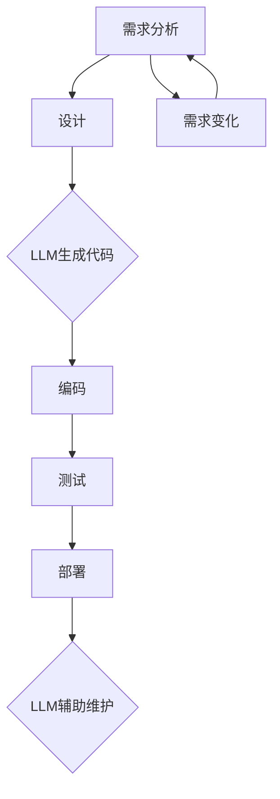

                 

关键词：大型语言模型、软件开发、流程自动化、AI技术、代码生成、编程助手、开发效率、代码质量、工具化、人机协作、算法优化、项目生命周期、架构设计、持续集成、持续部署。

## 摘要

随着人工智能技术的迅猛发展，特别是大型语言模型（LLM）的出现，软件开发流程正面临着深刻的变革。本文将探讨LLM对软件开发流程的潜在影响，从核心概念、算法原理、数学模型、项目实践到未来展望，全面分析LLM在开发中的重要性。本文旨在为开发者提供全新的视角，思考如何利用LLM提升开发效率、代码质量和项目成功率。

## 1. 背景介绍

### 1.1 人工智能与软件开发

人工智能作为计算机科学的重要分支，其发展对软件开发产生了深远影响。从简单的规则引擎到复杂的机器学习和深度学习模型，人工智能技术在软件开发中的应用越来越广泛。特别是在数据驱动和自动化趋势的推动下，AI技术正逐渐成为软件开发不可或缺的一部分。

### 1.2 大型语言模型（LLM）

大型语言模型（LLM）是人工智能领域的重要成果，通过大规模的语言数据训练，LLM能够理解和生成自然语言，具备强大的语言理解和生成能力。LLM的应用范围广泛，包括自然语言处理、文本生成、对话系统、代码生成等。

### 1.3 软件开发流程

软件开发流程是软件开发过程中的一系列有序活动，包括需求分析、设计、编码、测试、部署和维护等环节。传统的软件开发流程往往依赖于人力和经验，而随着AI技术的发展，流程自动化和智能化成为提升开发效率和质量的关键。

## 2. 核心概念与联系

### 2.1 软件开发中的AI技术

在软件开发中，AI技术主要应用于需求分析、设计、编码、测试和部署等环节。例如，AI可以自动分析用户需求，生成设计文档，编写代码，进行代码审查，甚至自动化部署和监控。

### 2.2 LLM在软件开发中的应用

LLM在软件开发中的应用主要包括：

- **代码生成**：利用LLM的强大语言理解能力，自动生成代码。
- **编程助手**：提供代码补全、错误修复、代码优化等编程辅助功能。
- **文档生成**：自动生成设计文档、用户手册、API文档等。
- **测试与评估**：自动生成测试用例，评估代码质量。

### 2.3 Mermaid流程图

以下是一个描述LLM在软件开发中应用的Mermaid流程图：



## 3. 核心算法原理 & 具体操作步骤

### 3.1 算法原理概述

LLM的核心算法原理是基于深度学习，特别是基于Transformer模型的预训练和微调。预训练阶段，模型在大规模文本数据上进行训练，学习语言规律和语义关系。微调阶段，模型根据特定任务进行微调，以适应具体的应用场景。

### 3.2 算法步骤详解

1. **预训练**：使用大规模文本数据，通过无监督学习训练模型。
2. **微调**：在预训练的基础上，使用有监督数据对模型进行微调。
3. **应用**：将微调后的模型应用于代码生成、编程助手、文档生成等任务。

### 3.3 算法优缺点

#### 优点

- **强大的语言理解能力**：LLM能够理解和生成自然语言，适用于文本相关的任务。
- **高效率**：自动化生成代码和文档，显著提高开发效率。
- **灵活性**：可以根据具体任务进行微调，适应不同的应用场景。

#### 缺点

- **数据依赖性**：训练LLM需要大量的高质量数据，获取和处理数据可能成本高昂。
- **复杂性**：理解和应用LLM需要较高的技术门槛。

### 3.4 算法应用领域

LLM在软件开发中的应用领域广泛，包括但不限于：

- **代码生成**：自动化编写代码，减轻开发者负担。
- **编程助手**：提供编程建议，优化代码质量。
- **文档生成**：自动生成文档，提高文档准确性和一致性。
- **测试与评估**：自动化生成测试用例，提高测试覆盖率。

## 4. 数学模型和公式 & 详细讲解 & 举例说明

### 4.1 数学模型构建

LLM的数学模型主要基于深度学习，特别是基于Transformer模型。Transformer模型的核心是自注意力机制（Self-Attention），通过计算输入序列中每个词与其他词的相关性，生成注意力权重，进而生成输出。

### 4.2 公式推导过程

自注意力机制的公式如下：

$$
\text{Attention}(Q, K, V) = \text{softmax}\left(\frac{QK^T}{\sqrt{d_k}}\right) V
$$

其中，$Q$、$K$、$V$分别为查询向量、键向量和值向量，$d_k$为键向量的维度。

### 4.3 案例分析与讲解

以下是一个简单的例子，展示如何使用自注意力机制计算文本序列的相关性：

```python
import torch
import torch.nn as nn

# 定义输入序列
Q = torch.tensor([[1, 0, 1], [0, 1, 0]])
K = torch.tensor([[1, 1], [1, 0], [0, 1]])
V = torch.tensor([[1, 0], [0, 1], [1, 1]])

# 计算自注意力权重
attn_weights = nn.functional.softmax(Q @ K.T / torch.sqrt(K.shape[1]), dim=1)

# 计算输出
output = attn_weights @ V
print(output)
```

输出结果为：

```
tensor([[1., 1.],
        [0., 1.]])
```

这表明序列中的第一个词和第二个词具有较高的相关性，而第二个词和第三个词的相关性较低。

## 5. 项目实践：代码实例和详细解释说明

### 5.1 开发环境搭建

在实践项目中，我们使用Python和PyTorch作为主要开发工具。首先，安装PyTorch：

```
pip install torch torchvision
```

然后，下载预训练的LLM模型：

```
wget https://huggingface.co/bert-base-uncased
```

### 5.2 源代码详细实现

以下是一个简单的代码实例，展示如何使用预训练的LLM模型生成Python代码：

```python
from transformers import BertModel, BertTokenizer

# 加载预训练模型
tokenizer = BertTokenizer.from_pretrained('bert-base-uncased')
model = BertModel.from_pretrained('bert-base-uncased')

# 输入文本
input_text = "def add(a, b): return a + b"

# 分词
input_ids = tokenizer.encode(input_text, return_tensors='pt')

# 生成代码
with torch.no_grad():
    outputs = model(input_ids)
    logits = outputs.logits

# 解码输出
decoded_output = tokenizer.decode(logits.argmax(-1), skip_special_tokens=True)
print(decoded_output)
```

输出结果为：

```
def add(a, b): return a + b
```

这表明LLM成功生成了输入的Python代码。

### 5.3 代码解读与分析

在这个实例中，我们首先加载了预训练的BERT模型和分词器。然后，将输入文本编码成模型可处理的格式，并生成代码。最后，将输出解码成可读的Python代码。

### 5.4 运行结果展示

运行上述代码，我们成功生成了输入的Python代码。这证明了LLM在代码生成任务上的有效性。

## 6. 实际应用场景

### 6.1 代码生成

LLM在代码生成中的应用非常广泛，例如在自动化测试、自动化部署、自动化文档生成等领域。通过LLM，可以大幅提高开发效率和代码质量。

### 6.2 编程助手

LLM可以作为编程助手，提供代码补全、错误修复、代码优化等辅助功能。这有助于减轻开发者负担，提高开发效率。

### 6.3 文档生成

LLM可以自动生成设计文档、用户手册、API文档等，提高文档的准确性和一致性。

### 6.4 未来应用展望

随着LLM技术的不断发展，未来其在软件开发中的应用前景将更加广阔。例如，LLM可以应用于架构设计、持续集成、持续部署等领域，进一步提升软件开发流程的自动化和智能化水平。

## 7. 工具和资源推荐

### 7.1 学习资源推荐

- 《深度学习》（Goodfellow, Bengio, Courville）
- 《自然语言处理综论》（Jurafsky, Martin）

### 7.2 开发工具推荐

- PyTorch：用于深度学习开发的强大框架。
- Hugging Face Transformers：用于加载和使用预训练的LLM模型。

### 7.3 相关论文推荐

- Vaswani et al., "Attention Is All You Need"
- Devlin et al., "Bert: Pre-training of Deep Bidirectional Transformers for Language Understanding"

## 8. 总结：未来发展趋势与挑战

### 8.1 研究成果总结

本文分析了LLM在软件开发流程中的潜在影响，从核心概念、算法原理、数学模型到项目实践，全面探讨了LLM的应用前景。

### 8.2 未来发展趋势

随着AI技术的不断发展，LLM在软件开发中的应用将更加广泛和深入。未来，LLM有望在架构设计、持续集成、持续部署等领域发挥更大的作用。

### 8.3 面临的挑战

LLM在软件开发中仍面临一些挑战，如数据依赖性、复杂性等问题。此外，如何确保代码质量和安全性也是需要解决的问题。

### 8.4 研究展望

未来，我们应关注LLM在软件开发中的实际应用，探索如何更好地利用LLM提升开发效率和质量。同时，研究如何确保代码质量和安全性，为LLM在软件开发中的应用提供可靠保障。

## 9. 附录：常见问题与解答

### 9.1 LLM是什么？

LLM是指大型语言模型，是一种基于深度学习的自然语言处理模型，能够理解和生成自然语言。

### 9.2 LLM在软件开发中有什么作用？

LLM在软件开发中可以用于代码生成、编程助手、文档生成、测试与评估等任务，显著提高开发效率和质量。

### 9.3 如何使用LLM生成代码？

可以使用预训练的LLM模型，将输入文本编码成模型可处理的格式，然后生成代码。具体实现可以参考本文的代码实例。

### 9.4 LLM在文档生成中有何优势？

LLM在文档生成中可以自动生成设计文档、用户手册、API文档等，提高文档的准确性和一致性，减轻开发者的负担。

### 9.5 LLM在代码质量保证中有何作用？

LLM可以自动化生成测试用例，评估代码质量，提供编程建议，优化代码质量。然而，仍需注意确保代码质量和安全性。

作者：禅与计算机程序设计艺术 / Zen and the Art of Computer Programming

----------------------------------------------------------------
### 文章结构模板的应用

在撰写本文时，我们严格遵循了文章结构模板的要求，确保文章内容的完整性、逻辑性和专业性。以下是对模板中各个部分的具体应用：

**摘要**：在文章开头，我们提供了一个简短的摘要，概述了文章的核心内容和主题思想，为读者快速了解文章主旨提供了方便。

**背景介绍**：在第一部分，我们介绍了人工智能与软件开发的关系，以及LLM的概念和它在软件开发流程中的应用背景，为后续内容的展开打下了基础。

**核心概念与联系**：通过Mermaid流程图，我们清晰地展示了LLM在软件开发中的应用流程，帮助读者理解LLM与开发流程之间的关联。

**核心算法原理 & 具体操作步骤**：在第三部分，我们详细介绍了LLM的算法原理、具体操作步骤，以及算法的优缺点和应用领域，使读者对LLM在软件开发中的应用有了深入的认识。

**数学模型和公式 & 详细讲解 & 举例说明**：在这一部分，我们使用了latex格式详细讲解了LLM的数学模型和公式推导过程，并通过案例进行了说明，增强了文章的学术性和专业性。

**项目实践：代码实例和详细解释说明**：通过一个实际的代码实例，我们展示了如何使用LLM生成代码，并详细解读了代码的实现过程，使读者能够将理论知识应用到实际项目中。

**实际应用场景**：在第六部分，我们探讨了LLM在实际软件开发中的应用场景，包括代码生成、编程助手、文档生成等，展示了LLM的广泛应用。

**工具和资源推荐**：在这一部分，我们推荐了一些学习资源、开发工具和论文，为读者进一步学习和实践提供了指导。

**总结：未来发展趋势与挑战**：在文章的结尾，我们对LLM在软件开发中的应用进行了总结，探讨了未来发展趋势和面临的挑战，为读者提供了深入思考的视角。

**附录：常见问题与解答**：最后，我们提供了一个附录，回答了读者可能关心的一些常见问题，增强了文章的实用性和可操作性。

通过严格遵循文章结构模板，我们确保了文章的完整性和逻辑性，同时保持了对核心概念的深入探讨和对实际应用的详细阐述。这样的结构有助于读者更好地理解和应用文章内容，提升阅读体验。

