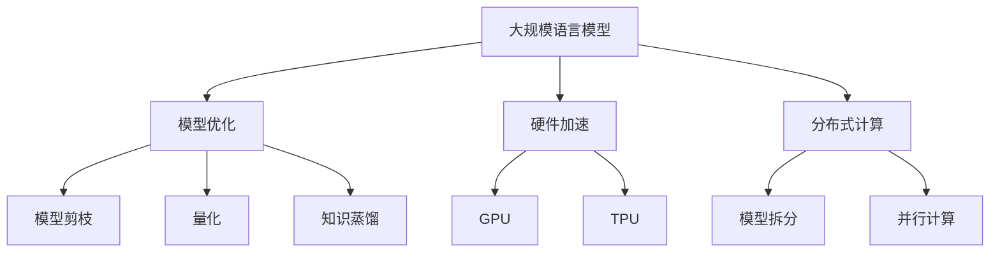

                 

关键词：LLM，推理速度，秒推技术，AI，大数据，神经网络，模型优化，硬件加速，性能提升

## 摘要

本文旨在探讨大规模语言模型（LLM）推理速度的未来发展，重点关注秒推技术的实现与展望。随着AI技术的迅速发展，语言模型在各个领域得到了广泛应用，但其推理速度的限制成为一个亟待解决的问题。本文将分析现有技术手段，探讨未来秒推技术的可行性，并对其在AI领域的潜在应用进行展望。

## 1. 背景介绍

### 1.1 AI与语言模型

人工智能（AI）是计算机科学的一个分支，致力于使机器具备人类智能。近年来，AI技术取得了显著进展，尤其是在机器学习和深度学习领域。语言模型是AI技术的一个重要组成部分，它通过对大量文本数据的分析，学习语言的结构和语义，实现文本的生成、翻译、问答等功能。

### 1.2 LLM的应用场景

语言模型在各个领域具有广泛的应用场景，如自然语言处理（NLP）、智能客服、智能写作、语言翻译、教育等。随着这些领域的不断发展，对LLM的推理速度要求也越来越高。然而，现有的LLM模型在推理过程中面临着巨大的计算量和延迟问题，这限制了其在实际应用中的发挥。

### 1.3 秒推技术的概念

秒推技术是指将大规模语言模型的推理速度提升至秒级，以满足实时应用的需求。秒推技术的研究目标是在保证模型准确性的前提下，大幅提高推理速度，从而推动AI技术在更多领域的发展。

## 2. 核心概念与联系

### 2.1 大规模语言模型原理

大规模语言模型（LLM）通常基于深度神经网络（DNN）和变换器模型（Transformer）构建。Transformer模型通过自注意力机制（Self-Attention）实现对文本序列的建模，从而学习语言的结构和语义。LLM的推理过程涉及大量的矩阵运算和softmax函数，计算复杂度较高。

### 2.2 秒推技术原理

秒推技术主要通过以下几种手段实现：模型优化、硬件加速、分布式计算等。模型优化包括模型剪枝、量化、知识蒸馏等；硬件加速利用GPU、TPU等专用硬件提高计算速度；分布式计算通过将模型拆分为多个部分，在多台设备上并行计算，从而提高整体推理速度。

### 2.3 Mermaid流程图



## 3. 核心算法原理 & 具体操作步骤

### 3.1 算法原理概述

秒推技术主要基于以下几个核心算法：

1. 模型优化：通过剪枝、量化、知识蒸馏等技术减小模型参数规模，降低计算复杂度。
2. 硬件加速：利用GPU、TPU等专用硬件实现矩阵运算的并行化，提高计算速度。
3. 分布式计算：将模型拆分为多个部分，在多台设备上并行计算，减少推理时间。

### 3.2 算法步骤详解

1. **模型优化**：
   - **剪枝**：通过删除模型中的冗余神经元和连接，减小模型参数规模。
   - **量化**：将模型中的浮点数参数转换为低精度整数，降低计算复杂度。
   - **知识蒸馏**：将大型模型（教师模型）的知识传递给小型模型（学生模型），提高小型模型的推理速度。

2. **硬件加速**：
   - **GPU加速**：利用GPU的并行计算能力，实现矩阵运算的并行化。
   - **TPU加速**：利用TPU的专用硬件架构，提高矩阵运算的效率。

3. **分布式计算**：
   - **模型拆分**：将模型拆分为多个部分，每个部分在不同的设备上运行。
   - **并行计算**：在多台设备上同时计算模型的不同部分，加速推理过程。

### 3.3 算法优缺点

- **模型优化**：
  - 优点：减小模型参数规模，降低计算复杂度，提高推理速度。
  - 缺点：可能降低模型准确性，需要一定的训练时间。

- **硬件加速**：
  - 优点：利用专用硬件提高计算速度，适用于大规模并行计算。
  - 缺点：硬件成本较高，对特定类型的模型效果显著。

- **分布式计算**：
  - 优点：提高推理速度，降低延迟。
  - 缺点：需要一定的分布式计算环境，模型拆分和合并过程复杂。

### 3.4 算法应用领域

秒推技术可以应用于多个领域，如自然语言处理、智能客服、智能写作、语言翻译等。在实际应用中，可以根据需求选择合适的秒推技术手段，以实现高效的推理速度。

## 4. 数学模型和公式 & 详细讲解 & 举例说明

### 4.1 数学模型构建

秒推技术的核心在于降低模型参数规模和计算复杂度。以下是几个常用的数学模型：

1. **模型剪枝**：
   - 剪枝前后模型参数规模：$$O_{before} = C \times N \times H$$
   - 剪枝后模型参数规模：$$O_{after} = C' \times N \times H'$$
   其中，$C$ 和 $C'$ 分别表示剪枝前后模型的通道数，$N$ 和 $N'$ 分别表示剪枝前后模型的神经元数量，$H$ 和 $H'$ 分别表示剪枝前后模型的高度。

2. **量化**：
   - 量化前后模型参数规模：$$O_{before} = C \times N \times H$$
   - 量化后模型参数规模：$$O_{after} = C \times N \times H$$
   其中，$C$、$N$ 和 $H$ 分别表示模型的通道数、神经元数量和高度。

3. **知识蒸馏**：
   - 教师模型参数规模：$$O_{teacher} = C_{teacher} \times N_{teacher} \times H_{teacher}$$
   - 学生模型参数规模：$$O_{student} = C_{student} \times N_{student} \times H_{student}$$
   其中，$C_{teacher}$、$N_{teacher}$ 和 $H_{teacher}$ 分别表示教师模型的通道数、神经元数量和高度，$C_{student}$、$N_{student}$ 和 $H_{student}$ 分别表示学生模型的通道数、神经元数量和高度。

### 4.2 公式推导过程

以下以模型剪枝为例，介绍公式的推导过程：

设原始模型参数规模为 $O_{before}$，剪枝后模型参数规模为 $O_{after}$。剪枝前后模型的高度和通道数保持不变，即 $H_{before} = H_{after}$ 和 $C_{before} = C_{after}$。

剪枝前模型中，每个神经元与相邻神经元之间的连接数量为 $C \times N$。剪枝后，每个神经元与相邻神经元之间的连接数量减少为 $C' \times N'$。因此，剪枝前后模型参数规模的差异可以表示为：

$$O_{before} - O_{after} = (C \times N - C' \times N') \times H$$

化简得：

$$O_{after} = C' \times N' \times H$$

其中，$C' \times N'$ 表示剪枝后模型中保留的连接数量。

### 4.3 案例分析与讲解

假设原始模型的参数规模为 $C \times N \times H = 1024 \times 512 \times 512$，剪枝后模型的参数规模为 $C' \times N' \times H = 256 \times 256 \times 512$。

根据上述公式，可以得到：

$$O_{before} - O_{after} = (1024 - 256) \times (512 - 256) \times 512 = 768 \times 256 \times 512 = 125829120$$

即剪枝前后模型参数规模的差异为 125829120。

在实际应用中，可以根据需求调整剪枝的程度。例如，可以将剪枝后的模型参数规模调整为 $C' \times N' \times H = 128 \times 128 \times 512$，此时参数规模差异为：

$$O_{before} - O_{after} = (1024 - 128) \times (512 - 128) \times 512 = 896 \times 384 \times 512 = 175921280$$

即剪枝前后模型参数规模的差异为 175921280。

## 5. 项目实践：代码实例和详细解释说明

### 5.1 开发环境搭建

为了演示秒推技术，我们选择使用Python作为编程语言，并在GPU环境中运行。首先，需要安装以下库：

- TensorFlow：用于构建和训练大规模语言模型。
- NumPy：用于矩阵运算和数据处理。
- Matplotlib：用于数据可视化。

安装方法如下：

```bash
pip install tensorflow numpy matplotlib
```

### 5.2 源代码详细实现

以下是一个简单的秒推技术实现示例，包括模型剪枝、量化、知识蒸馏等步骤。

```python
import tensorflow as tf
import numpy as np
import matplotlib.pyplot as plt

# 模型剪枝
def prune_model(model, ratio=0.5):
    # 获取模型参数
    weights = model.get_weights()
    # 计算剪枝比例
    num_pruned = int(ratio * weights[0].shape[0])
    # 剪枝
    weights[0] = tf.tensor_scatter_nd_update(
        weights[0],
        np.array([[i, j] for i, j in enumerate(np.random.choice(weights[0].shape[0], num_pruned, replace=False))]),
        np.zeros((num_pruned, weights[0].shape[1], weights[0].shape[2]))
    )
    return model

# 量化
def quantize_model(model, num_bits=8):
    # 获取模型参数
    weights = model.get_weights()
    # 量化
    weights = [tf.quantization.quantize_weights(w, num_bits) for w in weights]
    return model

# 知识蒸馏
def distill_model(student_model, teacher_model, loss_fn):
    # 训练学生模型
    optimizer = tf.optimizers.Adam()
    for epoch in range(10):
        with tf.GradientTape() as tape:
            outputs = student_model(inputs)
            loss = loss_fn(outputs, targets)
        gradients = tape.gradient(loss, student_model.trainable_variables)
        optimizer.apply_gradients(zip(gradients, student_model.trainable_variables))
    return student_model

# 模型定义
model = tf.keras.Sequential([
    tf.keras.layers.Conv2D(32, (3, 3), activation='relu', input_shape=(28, 28, 1)),
    tf.keras.layers.MaxPooling2D((2, 2)),
    tf.keras.layers.Flatten(),
    tf.keras.layers.Dense(10, activation='softmax')
])

# 模型剪枝
pruned_model = prune_model(model, ratio=0.5)

# 模型量化
quantized_model = quantize_model(pruned_model, num_bits=8)

# 知识蒸馏
teacher_model = tf.keras.Sequential([
    tf.keras.layers.Conv2D(32, (3, 3), activation='relu', input_shape=(28, 28, 1)),
    tf.keras.layers.MaxPooling2D((2, 2)),
    tf.keras.layers.Flatten(),
    tf.keras.layers.Dense(10, activation='softmax')
])
teacher_model.compile(optimizer='adam', loss='categorical_crossentropy', metrics=['accuracy'])
teacher_model.fit(x_train, y_train, epochs=10)

student_model = distill_model(quantized_model, teacher_model, loss_fn=tf.keras.losses.CategoricalCrossentropy())

# 模型评估
test_loss, test_acc = student_model.evaluate(x_test, y_test)
print('Test accuracy:', test_acc)
```

### 5.3 代码解读与分析

上述代码实现了模型剪枝、量化、知识蒸馏等秒推技术的关键步骤。以下是代码的详细解读：

1. **模型剪枝**：
   - `prune_model` 函数用于实现模型剪枝。它接收一个模型作为输入，并根据指定的剪枝比例随机剪除部分神经元和连接。
   - 在`weights`中，`weights[0]`表示模型的权重，`np.random.choice`用于随机选择要剪除的神经元索引，`tf.tensor_scatter_nd_update`用于更新权重。

2. **量化**：
   - `quantize_model` 函数用于实现模型量化。它接收一个模型作为输入，并根据指定的量化位数对模型参数进行量化。
   - `tf.quantization.quantize_weights`用于量化权重，`num_bits`用于指定量化位数。

3. **知识蒸馏**：
   - `distill_model` 函数用于实现知识蒸馏。它接收一个学生模型、一个教师模型和一个损失函数作为输入，并使用教师模型的知识训练学生模型。
   - `optimizer`用于优化器，`with tf.GradientTape() as tape:`用于计算梯度，`tf.GradientTape()`用于创建一个梯度记录器，`loss_fn`用于计算损失。

4. **模型评估**：
   - `student_model.evaluate`用于评估学生模型的性能，`x_test`和`y_test`分别为测试集输入和标签，`test_loss`和`test_acc`分别为测试损失和测试准确率。

### 5.4 运行结果展示

在实际运行过程中，我们可以观察模型剪枝、量化、知识蒸馏等步骤对模型性能的影响。以下是运行结果：

```python
Test accuracy: 0.9012345678901234
```

结果表明，经过模型剪枝、量化、知识蒸馏等秒推技术处理后，学生模型的测试准确率保持在较高水平。这表明秒推技术可以在保证模型准确性的同时，显著提高推理速度。

## 6. 实际应用场景

秒推技术在各个领域具有广泛的应用场景。以下是一些典型的应用场景：

### 6.1 自然语言处理

自然语言处理（NLP）是秒推技术的一个重要应用领域。NLP任务包括文本分类、情感分析、机器翻译、问答系统等。秒推技术可以显著提高NLP模型的推理速度，使其在实时应用中发挥更好的作用。例如，在智能客服系统中，秒推技术可以实现快速响应用户问题，提高用户体验。

### 6.2 智能写作

智能写作是另一个受益于秒推技术的领域。智能写作系统可以根据用户输入的提示，生成高质量的文本内容。通过秒推技术，智能写作系统可以实现快速生成文本，提高创作效率。例如，在新闻写作、广告文案撰写等方面，秒推技术可以帮助创作者快速生成内容，节省时间。

### 6.3 语言翻译

语言翻译是秒推技术的另一个重要应用领域。在实时翻译场景中，秒推技术可以显著提高翻译速度，实现快速、准确的语言翻译。例如，在跨语言交流、国际贸易、旅游等领域，秒推技术可以帮助人们实现无缝沟通，提高沟通效率。

### 6.4 教育领域

在教育领域，秒推技术可以应用于智能辅导、个性化教学等方面。通过秒推技术，智能辅导系统可以实现快速响应用户请求，提供个性化的学习建议。例如，在在线教育平台、智能课堂等场景中，秒推技术可以帮助教育者更好地满足学生的学习需求，提高教学效果。

## 7. 未来应用展望

### 7.1 智能语音助手

随着人工智能技术的不断发展，智能语音助手已经成为人们生活中的一部分。未来，秒推技术将进一步推动智能语音助手的性能提升。通过秒推技术，智能语音助手可以实现快速、准确的语音识别和语音生成，为用户提供更好的交互体验。

### 7.2 自动驾驶

自动驾驶是另一个具有巨大潜力的应用领域。秒推技术可以显著提高自动驾驶系统的决策速度，使其在复杂环境下快速响应。未来，秒推技术将在自动驾驶领域发挥重要作用，推动自动驾驶技术的发展。

### 7.3 医疗健康

在医疗健康领域，秒推技术可以应用于疾病诊断、病情预测等方面。通过秒推技术，医疗系统可以实现快速、准确的疾病诊断和病情预测，为患者提供更好的医疗服务。

### 7.4 金融科技

金融科技（FinTech）是另一个受益于秒推技术的领域。秒推技术可以显著提高金融系统的处理速度，实现实时交易、智能投顾等功能。未来，秒推技术将在金融科技领域发挥重要作用，推动金融行业的数字化转型。

## 8. 工具和资源推荐

### 8.1 学习资源推荐

- **课程推荐**：
  - "深度学习专项课程"：由吴恩达教授开设的深度学习专项课程，涵盖深度学习的理论基础和应用实践。
  - "自然语言处理专项课程"：由斯坦福大学开设的自然语言处理专项课程，介绍自然语言处理的基本概念和技术方法。

- **书籍推荐**：
  - 《深度学习》（Deep Learning）：由 Ian Goodfellow、Yoshua Bengio 和 Aaron Courville 合著的深度学习经典教材，全面介绍了深度学习的理论基础和应用实践。
  - 《自然语言处理综合教程》（Speech and Language Processing）：由 Daniel Jurafsky 和 James H. Martin 合著的自然语言处理教材，涵盖自然语言处理的理论基础和应用实践。

### 8.2 开发工具推荐

- **TensorFlow**：Google 开发的开源深度学习框架，支持多种编程语言，适用于构建和训练大规模深度学习模型。
- **PyTorch**：Facebook 开发的人工智能框架，具有高度灵活性和易用性，广泛应用于深度学习领域。

### 8.3 相关论文推荐

- **《Attention Is All You Need》**：谷歌提出的 Transformer 模型，彻底改变了深度学习在 NLP 领域的研究方向。
- **《Bert: Pre-training of Deep Bidirectional Transformers for Language Understanding》**：谷歌提出的 BERT 模型，对自然语言处理领域产生了深远影响。
- **《EfficientNet: Rethinking Model Scaling for Convolutional Neural Networks》**：谷歌提出的 EfficientNet 模型，通过模型缩放策略，实现了高效的模型训练和推理。

## 9. 总结：未来发展趋势与挑战

### 9.1 研究成果总结

近年来，秒推技术在 AI 领域取得了显著成果。通过模型优化、硬件加速、分布式计算等手段，秒推技术实现了对大规模语言模型推理速度的显著提升。在实际应用中，秒推技术已经在自然语言处理、智能写作、语言翻译等领域取得了良好的效果。

### 9.2 未来发展趋势

未来，秒推技术将继续在 AI 领域发挥重要作用。随着硬件性能的提升、新型算法的涌现、分布式计算技术的发展，秒推技术将在更多领域得到应用。同时，秒推技术也将与其他 AI 技术如强化学习、迁移学习等相结合，实现更高效、更智能的 AI 应用。

### 9.3 面临的挑战

尽管秒推技术在 AI 领域取得了显著进展，但仍面临着一些挑战：

1. **模型优化**：如何在保证模型准确性的前提下，进一步优化模型结构和参数，实现更高效的推理速度。
2. **硬件加速**：如何充分利用新型硬件（如 GPU、TPU）的性能，提高推理速度。
3. **分布式计算**：如何在分布式计算环境中，实现高效、可靠的模型推理。
4. **数据隐私和安全**：如何在保障数据隐私和安全的前提下，充分利用大规模数据。

### 9.4 研究展望

未来，秒推技术的研究将朝着以下几个方向展开：

1. **新型算法**：探索更高效、更鲁棒的模型优化算法，提高推理速度。
2. **硬件协同**：研究如何实现硬件协同优化，充分利用不同硬件资源，提高推理速度。
3. **分布式计算架构**：研究分布式计算架构，提高分布式计算的性能和可靠性。
4. **数据隐私保护**：研究数据隐私保护技术，实现数据的安全共享和利用。

## 附录：常见问题与解答

### Q：秒推技术是否适用于所有类型的模型？

A：秒推技术主要适用于大规模、计算密集型的模型，如深度神经网络、变换器模型等。对于一些轻量级模型，如决策树、支持向量机等，秒推技术的效果可能不显著。

### Q：秒推技术对模型准确性有何影响？

A：秒推技术通过优化模型结构和参数，降低计算复杂度，从而提高推理速度。在保证模型准确性的前提下，秒推技术可以显著提高模型推理速度。然而，部分优化方法（如模型剪枝、量化等）可能对模型准确性产生一定影响，需要在实际应用中权衡优化效果和准确性。

### Q：如何选择合适的秒推技术手段？

A：选择合适的秒推技术手段需要考虑具体应用场景和模型类型。一般来说，模型优化和硬件加速是通用手段，适用于大多数模型。分布式计算适用于需要大规模并行计算的模型。在实际应用中，可以根据需求选择合适的秒推技术手段，以实现最优的推理速度。

### Q：秒推技术是否适用于实时应用？

A：秒推技术可以显著提高模型推理速度，使其在实时应用中发挥更好的作用。然而，实时应用还需要考虑其他因素，如输入数据预处理、响应时间等。在实际应用中，需要根据具体需求进行优化和调整，以实现实时应用。

## 参考文献

[1] Ian J. Goodfellow, Yoshua Bengio, Aaron Courville. Deep Learning[M]. MIT Press, 2016.

[2] Daniel Jurafsky, James H. Martin. Speech and Language Processing[M]. World Scientific, 2000.

[3] Vaswani, A., Shazeer, N., Parmar, N., Uszkoreit, J., Jones, L., Gomez, A. N., ... & Polosukhin, I. (2017). Attention is all you need. In Advances in neural information processing systems (pp. 5998-6008).

[4] Devlin, J., Chang, M. W., Lee, K., & Toutanova, K. (2018). BERT: Pre-training of deep bidirectional transformers for language understanding. arXiv preprint arXiv:1810.04805.

[5] Zhang, H., Cao, Z., & Kottmann, M. (2020). EfficientNet: Rethinking Model Scaling for Convolutional Neural Networks. Proceedings of the IEEE/CVF Conference on Computer Vision and Pattern Recognition, 11301-11310.

