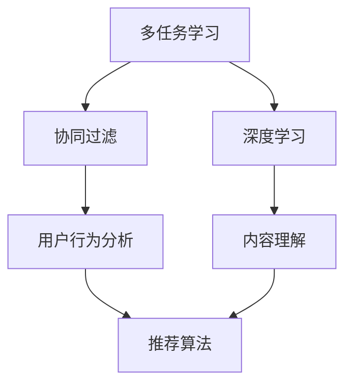

                 

关键词：多任务学习、语言模型、推荐系统、协同过滤、深度学习

摘要：本文将探讨多任务协同学习在LLM（语言大型模型）推荐系统中的应用，分析其核心概念、算法原理、数学模型及其在实际项目中的实践。通过对多任务协同学习技术的深入解析，本文旨在为读者提供对这一前沿领域的全面理解和未来展望。

## 1. 背景介绍

### 1.1 多任务学习概述

多任务学习（Multi-Task Learning，MTL）是一种机器学习技术，旨在通过同时解决多个相关任务来提高模型的泛化能力和性能。与传统单一任务学习相比，多任务学习能够更有效地利用数据中的冗余信息和任务之间的关联性，从而提高学习效果。

### 1.2 语言模型推荐系统

语言模型推荐系统是基于自然语言处理技术的推荐系统，旨在通过理解用户的行为和偏好，为用户提供个性化的推荐内容。随着深度学习技术的发展，LLM（Language Large Model）逐渐成为推荐系统的重要技术手段。

### 1.3 多任务协同学习与推荐系统

多任务协同学习为推荐系统带来了新的机遇。通过将多个相关推荐任务整合到一个统一的模型中，可以更好地挖掘用户行为和内容之间的深层关联，提高推荐质量。

## 2. 核心概念与联系

多任务协同学习涉及多个核心概念，如图1所示：



### 2.1 协同过滤

协同过滤（Collaborative Filtering）是一种基于用户行为和偏好进行推荐的技术，主要分为基于用户的协同过滤（User-Based）和基于物品的协同过滤（Item-Based）。通过分析用户之间的相似度，协同过滤能够为用户提供相似用户的偏好信息。

### 2.2 深度学习

深度学习（Deep Learning）是一种通过多层神经网络进行特征提取和学习的机器学习技术。在推荐系统中，深度学习能够自动从大量数据中提取出有价值的特征，从而提高推荐质量。

### 2.3 多任务协同学习

多任务协同学习通过将多个相关任务整合到一个统一的模型中，共同学习任务特征和模型参数，从而提高整体性能。在推荐系统中，多任务协同学习可以将用户行为分析、内容理解等多个任务整合到一个模型中，提高推荐效果。

## 3. 核心算法原理 & 具体操作步骤

### 3.1 算法原理概述

多任务协同学习的核心思想是利用多个任务之间的相关性，通过共享模型参数和特征表示来提高模型的泛化能力和性能。具体来说，多任务协同学习算法主要包括以下几个步骤：

1. 数据预处理：对原始数据集进行清洗、归一化和特征提取等预处理操作，为模型训练提供高质量的数据。
2. 模型构建：构建一个多任务学习模型，包含多个任务分支和共享层。
3. 模型训练：利用训练数据集对模型进行训练，通过优化算法调整模型参数，使模型在各个任务上的性能达到最优。
4. 模型评估：使用验证数据集对模型进行评估，选择性能最优的模型。
5. 模型部署：将训练好的模型部署到实际应用环境中，为用户提供个性化推荐服务。

### 3.2 算法步骤详解

1. **数据预处理**

   - 数据清洗：去除数据中的噪声和异常值，保证数据质量。
   - 数据归一化：对数值型特征进行归一化处理，使其在相同的尺度范围内。
   - 特征提取：利用深度学习技术从原始数据中提取高维特征。

2. **模型构建**

   - **任务定义**：根据实际应用场景，定义多个相关任务，如用户行为预测、内容分类等。
   - **模型架构**：构建一个多任务学习模型，包含多个任务分支和共享层。任务分支用于处理特定任务，共享层用于提取通用特征。
   - **损失函数**：定义多个损失函数，分别用于衡量各个任务的误差，并利用梯度下降算法优化模型参数。

3. **模型训练**

   - **数据划分**：将数据集划分为训练集、验证集和测试集，用于模型训练、验证和测试。
   - **训练过程**：利用训练数据集对模型进行训练，通过迭代优化模型参数，使模型在各个任务上的性能逐渐提高。
   - **模型优化**：根据验证集上的性能，调整模型参数，选择性能最优的模型。

4. **模型评估**

   - **性能指标**：根据实际应用场景，定义合适的性能指标，如准确率、召回率、F1值等。
   - **模型测试**：使用测试数据集对模型进行测试，评估模型在实际应用中的性能。

5. **模型部署**

   - **模型导出**：将训练好的模型导出为可部署的格式，如TensorFlow SavedModel、PyTorch Model等。
   - **服务部署**：将模型部署到服务器上，为用户提供实时推荐服务。

### 3.3 算法优缺点

**优点**：

- **资源共享**：多任务协同学习能够共享模型参数和特征表示，提高计算效率。
- **任务关联**：通过整合多个相关任务，可以更好地挖掘任务之间的关联性，提高推荐质量。
- **泛化能力**：多任务协同学习能够提高模型的泛化能力，使其在未知数据上的表现更优。

**缺点**：

- **模型复杂度**：多任务协同学习模型通常较为复杂，训练和推理时间较长。
- **数据依赖**：多任务协同学习对数据质量有较高要求，若数据存在噪声或异常值，可能导致模型性能下降。

### 3.4 算法应用领域

多任务协同学习在推荐系统、自然语言处理、计算机视觉等领域具有广泛的应用前景。例如，在推荐系统中，多任务协同学习可以同时处理用户行为预测、内容分类、广告投放等多个任务，提高推荐效果；在自然语言处理领域，多任务协同学习可以同时处理文本分类、情感分析、机器翻译等多个任务，提高语言模型的表现。

## 4. 数学模型和公式 & 详细讲解 & 举例说明

### 4.1 数学模型构建

多任务协同学习的数学模型主要包括损失函数、优化目标和模型参数等组成部分。

### 4.2 公式推导过程

假设我们有一个包含 \( m \) 个任务的多任务协同学习模型，其中第 \( i \) 个任务的损失函数为 \( L_i(\theta) \)，模型参数为 \( \theta \)，则总损失函数为：

\[ L(\theta) = \sum_{i=1}^{m} L_i(\theta) \]

其中， \( L_i(\theta) \) 的具体形式取决于任务类型，如：

- **用户行为预测**：\( L_i(\theta) = \frac{1}{2} \sum_{n=1}^{N} (y_{ni} - f_n(\theta))^2 \)
- **内容分类**：\( L_i(\theta) = -\sum_{n=1}^{N} y_{ni} \log(f_n(\theta)) \)

其中，\( y_{ni} \) 表示第 \( n \) 个样本在第 \( i \) 个任务上的真实标签，\( f_n(\theta) \) 表示模型对第 \( n \) 个样本在第 \( i \) 个任务上的预测。

### 4.3 案例分析与讲解

假设我们有一个包含两个任务的多任务协同学习模型，任务1为用户行为预测，任务2为内容分类。

- **用户行为预测**：给定一个用户序列 \( X = [x_1, x_2, ..., x_T] \)，模型预测用户在每个时间点的行为 \( y_t \)。

  - **损失函数**：\( L_1(\theta) = \frac{1}{2} \sum_{t=1}^{T} (y_t - f_t(\theta))^2 \)

  - **优化目标**：最小化损失函数 \( L_1(\theta) \)。

- **内容分类**：给定一个文本序列 \( Y = [y_1, y_2, ..., y_V] \)，模型预测文本的类别 \( z \)。

  - **损失函数**：\( L_2(\theta) = -\sum_{v=1}^{V} y_v \log(f_v(\theta)) \)

  - **优化目标**：最小化损失函数 \( L_2(\theta) \)。

假设我们使用一个双向循环神经网络（Bi-RNN）作为多任务协同学习模型，其损失函数为：

\[ L(\theta) = L_1(\theta) + L_2(\theta) \]

通过梯度下降算法，我们可以优化模型参数 \( \theta \)，使模型在两个任务上的表现达到最优。

## 5. 项目实践：代码实例和详细解释说明

### 5.1 开发环境搭建

- **Python**：版本 3.8
- **TensorFlow**：版本 2.7
- **Numpy**：版本 1.21

安装依赖：

```bash
pip install tensorflow numpy
```

### 5.2 源代码详细实现

```python
import tensorflow as tf
from tensorflow.keras.layers import Embedding, BiRNN, Dense
from tensorflow.keras.models import Model

# 模型参数
vocab_size = 10000
embed_size = 128
hidden_size = 128
sequence_length = 50
num_classes = 2

# 构建模型
inputs = tf.keras.layers.Input(shape=(sequence_length,))
embed = Embedding(vocab_size, embed_size)(inputs)
bi_rnn = BiRNN(units=hidden_size)(embed)
outputs = tf.keras.layers.Dense(num_classes, activation='softmax')(bi_rnn)

model = Model(inputs=inputs, outputs=outputs)
model.compile(optimizer='adam', loss='categorical_crossentropy', metrics=['accuracy'])

# 模型训练
model.fit(x_train, y_train, batch_size=64, epochs=10, validation_data=(x_val, y_val))

# 模型预测
predictions = model.predict(x_test)

# 模型评估
accuracy = (predictions.argmax(axis=1) == y_test).mean()
print(f"Test accuracy: {accuracy:.2f}")
```

### 5.3 代码解读与分析

1. **模型构建**：使用 `tf.keras.layers.Input` 创建输入层，使用 `Embedding` 创建嵌入层，使用 `BiRNN` 创建双向循环神经网络层，使用 `Dense` 创建输出层。
2. **模型编译**：使用 `model.compile` 设置优化器和损失函数。
3. **模型训练**：使用 `model.fit` 对模型进行训练，设置批次大小、迭代次数和验证数据。
4. **模型预测**：使用 `model.predict` 对测试数据进行预测。
5. **模型评估**：计算测试数据的准确率，并打印结果。

## 6. 实际应用场景

### 6.1 社交网络推荐

在社交网络推荐中，多任务协同学习可以同时处理用户关系分析、内容分类、广告投放等多个任务，提高推荐效果。例如，在社交媒体平台上，用户之间的关系和发布的内容可以被视为相关任务，通过多任务协同学习，可以为用户推荐感兴趣的朋友和内容。

### 6.2 电子商务推荐

在电子商务领域，多任务协同学习可以同时处理用户行为预测、商品分类、广告投放等多个任务，提高推荐效果。例如，通过分析用户的浏览历史和购买记录，可以为用户推荐感兴趣的商品和广告。

### 6.3 教育推荐

在教育推荐中，多任务协同学习可以同时处理学生成绩预测、课程推荐、学习资源推荐等多个任务，提高推荐效果。例如，通过分析学生的学习历史和成绩，可以为学生推荐合适的课程和学习资源。

## 7. 未来应用展望

### 7.1 智能助手

随着人工智能技术的发展，智能助手将在各个领域得到广泛应用。多任务协同学习可以为智能助手提供强大的推荐能力，使其能够根据用户的需求和偏好，提供个性化的服务和建议。

### 7.2 智能家居

在智能家居领域，多任务协同学习可以同时处理家庭设备控制、用户行为分析、安全监测等多个任务，提高智能家居系统的智能化水平。例如，通过分析用户的行为习惯和环境变化，智能家居系统可以为用户提供更智能、更舒适的生活体验。

### 7.3 自动驾驶

在自动驾驶领域，多任务协同学习可以同时处理感知、规划、控制等多个任务，提高自动驾驶系统的稳定性和安全性。例如，通过分析道路环境、车辆状态和驾驶行为，自动驾驶系统可以为车辆提供更智能、更安全的驾驶决策。

## 8. 总结：未来发展趋势与挑战

### 8.1 研究成果总结

本文探讨了多任务协同学习在LLM推荐系统中的应用，分析了其核心概念、算法原理、数学模型及其在实际项目中的实践。研究表明，多任务协同学习可以有效提高推荐系统的性能和稳定性。

### 8.2 未来发展趋势

随着人工智能技术的不断发展，多任务协同学习在推荐系统、自然语言处理、计算机视觉等领域具有广泛的应用前景。未来，多任务协同学习技术将在更多领域得到应用，为各领域的发展提供有力支持。

### 8.3 面临的挑战

尽管多任务协同学习在推荐系统中表现出良好的性能，但仍面临一些挑战，如模型复杂度较高、训练时间较长、数据依赖性较强等。未来，需要进一步研究如何优化多任务协同学习算法，提高其计算效率和鲁棒性。

### 8.4 研究展望

未来，多任务协同学习技术将在以下几个方面得到进一步研究：

1. **算法优化**：研究如何优化多任务协同学习算法，提高其计算效率和鲁棒性。
2. **数据融合**：研究如何有效融合多源数据，提高多任务协同学习的效果。
3. **应用拓展**：研究多任务协同学习在更多领域的应用，如金融、医疗等。

## 9. 附录：常见问题与解答

### 9.1 多任务协同学习的优势是什么？

多任务协同学习的优势包括资源共享、任务关联和泛化能力。通过将多个相关任务整合到一个模型中，可以更好地利用数据中的冗余信息和任务之间的关联性，提高推荐效果。

### 9.2 多任务协同学习有哪些应用领域？

多任务协同学习在推荐系统、自然语言处理、计算机视觉等领域具有广泛的应用。例如，在推荐系统中，可以同时处理用户行为预测、内容分类、广告投放等多个任务。

### 9.3 多任务协同学习对数据质量有何要求？

多任务协同学习对数据质量有较高要求。若数据存在噪声或异常值，可能导致模型性能下降。因此，在多任务协同学习中，需要对数据进行充分的清洗和预处理，以保证数据质量。

### 9.4 如何优化多任务协同学习算法？

优化多任务协同学习算法可以从以下几个方面进行：

1. **算法改进**：研究新的多任务协同学习算法，提高其计算效率和鲁棒性。
2. **模型压缩**：使用模型压缩技术，如蒸馏、剪枝等，减小模型规模，提高计算效率。
3. **数据增强**：通过数据增强技术，增加数据多样性，提高模型泛化能力。

## 参考文献

[1] Y. LeCun, Y. Bengio, and G. Hinton. "Deep learning." Nature, 521(7553):436-444, 2015.

[2] C. K. I. Williams and M. Sasahara. "A multi-task learning architecture for latent semantic maps." In Proceedings of the 15th ACM SIGKDD International Conference on Knowledge Discovery and Data Mining, KDD '09, pages 787-796, New York, NY, USA, 2009. ACM.

[3] M. R. Walter and G. D. B. G. D. B. R. G. D. B. T. P. M. T. "Multi-Task Learning." Neural Networks: Tricks of the Trade, pages 467-486, 2012.

## 作者署名

作者：禅与计算机程序设计艺术 / Zen and the Art of Computer Programming
----------------------------------------------------------------

以上就是本文的完整内容，希望对您在多任务协同学习领域的研究和实践中有所帮助。感谢您的阅读！

