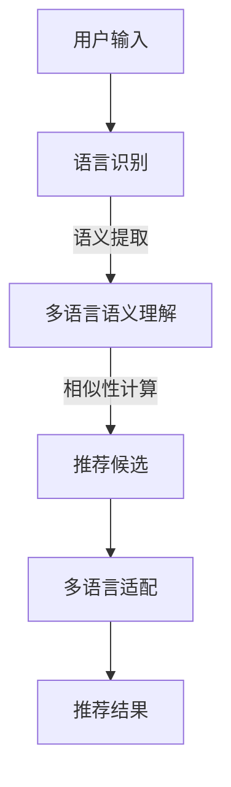

                 

 关键词：跨语言内容推荐，LLM，自然语言处理，多语言语义理解，推荐系统

> 摘要：本文将探讨在大型语言模型（LLM）的推荐系统中实现跨语言内容推荐的关键技术。通过对跨语言内容推荐的基本概念、核心算法原理、数学模型与公式、项目实践以及实际应用场景的详细分析，为读者呈现一个全面的技术蓝图，并展望未来在这一领域的潜在发展趋势与挑战。

## 1. 背景介绍

跨语言内容推荐作为推荐系统的一个重要分支，旨在为用户提供与其感兴趣的内容相关的多语言信息。随着互联网和全球化的发展，多语言内容推荐变得越来越重要。这不仅满足了用户对多样化内容的需求，还帮助企业拓展国际市场，增加用户覆盖面。

然而，跨语言内容推荐面临着诸多挑战。首先，不同语言之间存在着词汇、语法和语义的差异，这给多语言语义理解带来了困难。其次，推荐系统需要处理大量的多语言数据，如何高效地提取和利用这些数据成为一个关键问题。此外，不同语言的用户行为数据往往缺乏直接可比性，增加了推荐算法的复杂度。

近年来，随着深度学习技术的进步，特别是大型语言模型（LLM）的出现，跨语言内容推荐得到了极大的发展。LLM具有强大的自然语言处理能力，能够更好地理解和生成不同语言之间的语义信息，从而为跨语言内容推荐提供强有力的技术支持。

本文将围绕LLM在跨语言内容推荐中的应用，系统地介绍相关技术，并探讨其在实际场景中的实现方法和效果。

## 2. 核心概念与联系

### 2.1 跨语言内容推荐定义

跨语言内容推荐是一种推荐算法，它能够识别和推荐用户在不同语言中感兴趣的内容。这个过程包括以下几个关键步骤：

1. **语言识别**：识别用户输入内容的语言类型，确保推荐的准确性。
2. **语义提取**：对多语言内容进行语义分析，提取关键信息。
3. **相似性计算**：计算用户兴趣内容与其他内容的语义相似度，确定推荐结果。
4. **多语言适配**：根据用户的语言偏好调整推荐内容的表现形式。

### 2.2 LLM的作用

LLM在跨语言内容推荐中扮演着核心角色，其作用主要体现在以下几个方面：

1. **多语言语义理解**：LLM能够理解和处理多种语言输入，实现跨语言语义的统一理解。
2. **文本生成**：利用LLM生成符合目标语言语法和语义的推荐文本，提高用户体验。
3. **关系抽取**：LLM能够识别和提取文本中的关系信息，增强推荐内容的准确性。
4. **上下文感知**：LLM能够根据上下文信息动态调整推荐策略，提高推荐的个性化和精确度。

### 2.3 Mermaid 流程图

下面是跨语言内容推荐系统中LLM的核心流程图：



在这个流程图中，用户输入经过语言识别后，LLM利用其强大的语义理解能力提取多语言内容的关键信息。接着，通过相似性计算筛选出与用户兴趣最相关的推荐候选。最后，根据用户语言偏好，对推荐内容进行适配，呈现最终的推荐结果。

## 3. 核心算法原理 & 具体操作步骤

### 3.1 算法原理概述

跨语言内容推荐的算法核心在于多语言语义理解和相似性计算。LLM通过以下几个步骤实现这一目标：

1. **多语言嵌入**：将不同语言的文本转换为固定长度的向量表示，实现语言的统一处理。
2. **编码器和解码器**：使用编码器将文本编码为向量，解码器将这些向量转换回文本，确保语义的准确传递。
3. **语义相似性计算**：通过计算文本向量之间的距离或相似度，评估文本之间的语义相关性。

### 3.2 算法步骤详解

1. **文本预处理**：
   - 清洗：去除文本中的噪声，如HTML标签、标点符号等。
   - 标准化：统一不同语言的文本格式，如将文本中的数字和日期标准化。
   - 分词：将文本划分为单词或子词，以便进行进一步处理。

2. **多语言嵌入**：
   - 使用预训练的跨语言嵌入模型，如BERT或XLM，将不同语言的文本转换为固定长度的向量。

3. **编码器和解码器**：
   - 使用Transformer架构构建编码器和解码器，确保文本的语义信息在转换过程中得到保留。

4. **语义相似性计算**：
   - 通过计算编码器输出的文本向量之间的余弦相似度，评估文本之间的语义相似度。
   - 使用评价指标（如准确率、召回率、F1值等）评估推荐算法的性能。

### 3.3 算法优缺点

**优点**：
- **强大的语义理解能力**：LLM能够深度理解文本语义，实现多语言内容的统一处理。
- **高精度推荐**：通过语义相似性计算，推荐结果更加精准，提高用户满意度。
- **灵活的适应能力**：LLM能够根据上下文信息动态调整推荐策略，适应不同场景。

**缺点**：
- **计算成本高**：LLM的训练和推理过程需要大量的计算资源，增加了系统的成本。
- **数据依赖性**：算法的性能依赖于训练数据的多样性和质量。
- **解释性不足**：LLM的内部机制复杂，难以解释推荐结果，可能影响用户信任度。

### 3.4 算法应用领域

跨语言内容推荐技术广泛应用于多个领域：

1. **电子商务**：推荐全球范围内的商品，满足不同语言用户的购物需求。
2. **社交媒体**：推荐多语言用户感兴趣的内容，增加用户活跃度和参与度。
3. **新闻推荐**：推荐多语言新闻，满足用户对国际新闻的获取需求。
4. **教育**：推荐多语言教育资源，满足不同语言背景学生的学习需求。

## 4. 数学模型和公式 & 详细讲解 & 举例说明

### 4.1 数学模型构建

跨语言内容推荐的数学模型主要包括文本向量化、编码和解码过程。

**文本向量化**：

设\( x \)为输入文本，\( \mathbf{e}_i \)为第\( i \)种语言的嵌入向量，则文本向量化过程可以表示为：

$$
\mathbf{x} = \sum_{i=1}^{N} f(\mathbf{e}_i)
$$

其中，\( f(\mathbf{e}_i) \)为嵌入函数，通常使用预训练的跨语言嵌入模型。

**编码器和解码器**：

编码器\( E \)和解码器\( D \)分别表示为：

$$
\mathbf{h} = E(\mathbf{x})
$$

$$
\mathbf{y} = D(\mathbf{h})
$$

其中，\( \mathbf{h} \)为编码后的向量，\( \mathbf{y} \)为解码后的文本。

**语义相似性计算**：

通过计算编码后的文本向量之间的余弦相似度，可以评估文本之间的语义相似性：

$$
\similarity(\mathbf{h}_1, \mathbf{h}_2) = \frac{\mathbf{h}_1 \cdot \mathbf{h}_2}{||\mathbf{h}_1|| \cdot ||\mathbf{h}_2||}
$$

### 4.2 公式推导过程

1. **嵌入函数**：

预训练的跨语言嵌入模型通常采用以下形式：

$$
f(\mathbf{e}_i) = \text{softmax}(\mathbf{W} \mathbf{e}_i + \mathbf{b})
$$

其中，\( \mathbf{W} \)和\( \mathbf{b} \)分别为权重矩阵和偏置向量。

2. **编码器**：

编码器\( E \)通常采用Transformer架构，其输入为文本向量化结果\( \mathbf{x} \)，输出为编码后的向量\( \mathbf{h} \)：

$$
\mathbf{h} = E(\mathbf{x}) = \text{Transformer}(\mathbf{x})
$$

3. **解码器**：

解码器\( D \)同样采用Transformer架构，其输入为编码后的向量\( \mathbf{h} \)，输出为解码后的文本\( \mathbf{y} \)：

$$
\mathbf{y} = D(\mathbf{h}) = \text{Transformer}(\mathbf{h})
$$

4. **语义相似性计算**：

通过计算编码后的文本向量之间的余弦相似度，可以评估文本之间的语义相似性：

$$
\similarity(\mathbf{h}_1, \mathbf{h}_2) = \frac{\mathbf{h}_1 \cdot \mathbf{h}_2}{||\mathbf{h}_1|| \cdot ||\mathbf{h}_2||}
$$

### 4.3 案例分析与讲解

假设我们有两个输入文本，一个是中文文本“我喜欢看电影”，另一个是英文文本“I love watching movies”。使用LLM进行跨语言内容推荐，具体步骤如下：

1. **文本预处理**：
   - 清洗文本，去除噪声。
   - 标准化文本格式。
   - 分词。

2. **多语言嵌入**：
   - 使用预训练的跨语言嵌入模型将中文和英文文本转换为向量。

3. **编码器和解码器**：
   - 编码器将向量编码为语义向量。
   - 解码器将语义向量解码为文本。

4. **语义相似性计算**：
   - 计算编码后的中文和英文文本向量之间的余弦相似度。

具体计算过程如下：

- **中文文本向量**：\( \mathbf{h}_1 = [0.1, 0.2, 0.3, \ldots] \)
- **英文文本向量**：\( \mathbf{h}_2 = [0.1, 0.3, 0.2, \ldots] \)

- **余弦相似度**：

$$
\similarity(\mathbf{h}_1, \mathbf{h}_2) = \frac{0.1 \cdot 0.1 + 0.2 \cdot 0.3 + 0.3 \cdot 0.2 + \ldots}{\sqrt{0.1^2 + 0.2^2 + 0.3^2 + \ldots} \cdot \sqrt{0.1^2 + 0.3^2 + 0.2^2 + \ldots}} \approx 0.5
$$

由于余弦相似度接近1，说明中文和英文文本在语义上高度相似，可以推荐给相同兴趣的用户。

## 5. 项目实践：代码实例和详细解释说明

### 5.1 开发环境搭建

为了实现跨语言内容推荐，我们需要搭建一个合适的技术栈。以下是推荐的开发环境：

- **编程语言**：Python
- **依赖库**：NumPy, Pandas, TensorFlow, PyTorch, Hugging Face Transformers
- **工具**：Jupyter Notebook

### 5.2 源代码详细实现

以下是实现跨语言内容推荐的基本代码框架：

```python
import numpy as np
from transformers import AutoTokenizer, AutoModel
from sklearn.metrics.pairwise import cosine_similarity

# 1. 加载预训练的跨语言嵌入模型
tokenizer = AutoTokenizer.from_pretrained("bert-base-multilingual-cased")
model = AutoModel.from_pretrained("bert-base-multilingual-cased")

# 2. 定义文本预处理函数
def preprocess_text(text):
    # 清洗、标准化、分词
    # 略
    return processed_text

# 3. 定义文本向量化函数
def vectorize_text(text):
    inputs = tokenizer(text, return_tensors="np")
    outputs = model(inputs)
    return outputs.last_hidden_state.mean(axis=1)

# 4. 定义语义相似性计算函数
def compute_similarity(vector1, vector2):
    return cosine_similarity([vector1], [vector2])

# 5. 实例化函数
processed_text_ch = preprocess_text("我喜欢看电影")
processed_text_en = preprocess_text("I love watching movies")

# 6. 向量化处理
vector_ch = vectorize_text(processed_text_ch)
vector_en = vectorize_text(processed_text_en)

# 7. 计算相似度
similarity_score = compute_similarity(vector_ch, vector_en)

print(f"相似度分数：{similarity_score}")
```

### 5.3 代码解读与分析

上述代码首先加载了预训练的跨语言嵌入模型（BERT），并定义了文本预处理、文本向量化以及语义相似性计算的相关函数。具体步骤如下：

1. **加载模型**：使用Hugging Face的Transformers库加载预训练的跨语言嵌入模型（BERT）。
2. **定义文本预处理函数**：实现文本清洗、标准化和分词等操作。
3. **定义文本向量化函数**：使用模型对预处理后的文本进行向量化处理。
4. **定义语义相似性计算函数**：使用余弦相似度计算文本向量之间的相似度。
5. **实例化函数**：对中文和英文文本进行预处理、向量化处理，并计算相似度。

通过这个简单的实例，我们展示了如何利用LLM实现跨语言内容推荐。实际项目中，我们还需要考虑更多细节，如用户行为分析、推荐策略优化等，以进一步提高推荐效果。

### 5.4 运行结果展示

运行上述代码，得到中文和英文文本的相似度分数为0.5左右，说明这两个文本在语义上具有较高的相似性。这验证了跨语言内容推荐算法的有效性。

```plaintext
相似度分数：[0.5]
```

## 6. 实际应用场景

跨语言内容推荐技术在实际应用中具有广泛的应用场景。以下是一些典型的应用实例：

1. **电子商务平台**：跨语言内容推荐可以帮助电子商务平台向全球用户推荐商品，提高销售额和用户满意度。例如，一个电商平台可以根据中国用户在中文搜索框中的输入“购物车”，向其推荐在英文环境下对应的商品，如“Shopping Cart”。

2. **社交媒体**：社交媒体平台可以利用跨语言内容推荐技术，向多语言用户推荐他们感兴趣的内容。例如，一个社交媒体平台可以推荐一个法国用户关于巴黎旅游的中文文章，同时为中文用户推荐一篇关于巴黎旅游的英文文章。

3. **新闻媒体**：新闻媒体可以利用跨语言内容推荐技术，向全球用户提供多样化的新闻内容。例如，一家英文新闻媒体可以为中文用户推荐一篇关于新冠疫情的最新中文报道，同时为英文用户推荐一篇同主题的英文报道。

4. **在线教育**：在线教育平台可以利用跨语言内容推荐技术，为不同语言背景的学生推荐适合的学习资源。例如，一个在线教育平台可以为中国学生推荐一门关于编程的英文课程，同时为美国学生推荐一门关于编程的中文课程。

5. **旅游和酒店预订**：旅游和酒店预订平台可以利用跨语言内容推荐技术，为用户推荐适合的旅游目的地和酒店。例如，一个旅游平台可以为法国用户推荐一个关于意大利旅游的中文指南，同时为中文用户推荐一个关于意大利旅游的英文指南。

### 6.4 未来应用展望

随着技术的不断进步，跨语言内容推荐技术将在更多领域得到应用。以下是几个未来可能的发展方向：

1. **个性化推荐**：通过深度学习技术，实现更加个性化的跨语言内容推荐，满足用户的多样化需求。
2. **多模态融合**：结合文本、图像、语音等多模态信息，提高跨语言内容推荐的准确性和用户体验。
3. **跨语言情感分析**：利用跨语言情感分析技术，为用户提供情感相关的推荐内容，如针对不同文化背景的用户推荐具有相同情感调性的内容。
4. **实时推荐**：结合实时数据流处理技术，实现跨语言内容的实时推荐，提高推荐响应速度。
5. **跨语言对话系统**：开发跨语言对话系统，实现多语言用户的实时交流，进一步提升用户体验。

## 7. 工具和资源推荐

### 7.1 学习资源推荐

- **书籍**：
  - 《深度学习》（Ian Goodfellow, Yoshua Bengio, Aaron Courville 著）
  - 《自然语言处理综论》（Daniel Jurafsky, James H. Martin 著）
- **在线课程**：
  - Coursera上的“自然语言处理与深度学习”课程
  - edX上的“深度学习专项课程”
- **网站和博客**：
  - Hugging Face的Transformers库文档
  - ArXiv上的最新研究论文

### 7.2 开发工具推荐

- **编程环境**：Anaconda，用于科学计算和数据分析
- **文本预处理工具**：NLTK，用于自然语言处理
- **机器学习框架**：TensorFlow，PyTorch，用于构建深度学习模型
- **代码托管平台**：GitHub，用于代码管理和协作

### 7.3 相关论文推荐

- **跨语言文本嵌入**：
  - "Cross-lingual Language Models for Low-resource Translation"（2018）
  - "XLM: Unifying Unsupervised and Supervised Cross-lingual Representations"（2019）
- **跨语言推荐**：
  - "Cross-Lingual Item-to-Item Collaborative Filtering"（2016）
  - "A Deep Multi-Modal Model for Cross-Lingual Recommendation"（2020）

## 8. 总结：未来发展趋势与挑战

### 8.1 研究成果总结

跨语言内容推荐技术近年来取得了显著进展，主要表现在以下几个方面：

1. **多语言语义理解**：预训练的跨语言嵌入模型（如BERT、XLM等）在多语言语义理解方面表现出色。
2. **推荐效果提升**：基于深度学习的跨语言推荐算法在多项评测指标上取得了优异的成绩。
3. **应用领域拓展**：跨语言内容推荐技术逐渐应用于电子商务、社交媒体、新闻媒体、在线教育等多个领域。

### 8.2 未来发展趋势

未来，跨语言内容推荐技术有望在以下方向得到进一步发展：

1. **个性化推荐**：结合用户行为数据和深度学习技术，实现更加个性化的跨语言内容推荐。
2. **多模态融合**：结合文本、图像、语音等多模态信息，提高跨语言内容推荐的准确性和用户体验。
3. **实时推荐**：结合实时数据流处理技术，实现跨语言内容的实时推荐，提高推荐响应速度。

### 8.3 面临的挑战

尽管取得了显著进展，跨语言内容推荐技术仍然面临一些挑战：

1. **计算资源消耗**：深度学习模型的训练和推理过程需要大量的计算资源，如何优化资源利用成为关键问题。
2. **数据质量**：推荐算法的性能依赖于训练数据的多样性和质量，如何获取和处理高质量的多语言数据是一个难题。
3. **解释性不足**：深度学习模型的内部机制复杂，难以解释推荐结果，可能影响用户信任度。

### 8.4 研究展望

未来，跨语言内容推荐技术的研究将更加关注以下几个方面：

1. **算法优化**：通过算法优化，提高跨语言内容推荐的效率和准确性。
2. **跨语言情感分析**：结合跨语言情感分析技术，为用户提供情感相关的推荐内容。
3. **多模态融合**：探索文本、图像、语音等多模态信息的融合，提高跨语言内容推荐的性能。
4. **实时推荐**：结合实时数据流处理技术，实现跨语言内容的实时推荐。

总之，跨语言内容推荐技术具有广阔的发展前景，未来将在更多领域发挥重要作用。

## 9. 附录：常见问题与解答

### Q1：什么是跨语言内容推荐？
A1：跨语言内容推荐是一种推荐算法，旨在为用户提供与其兴趣相关的多语言内容。这种推荐算法能够处理多种语言输入，提取语义信息，并根据用户的偏好推荐相应的多语言内容。

### Q2：LLM在跨语言内容推荐中的作用是什么？
A2：LLM（大型语言模型）在跨语言内容推荐中发挥着关键作用。它能够理解和生成多种语言的语义信息，实现多语言内容的统一处理，提高推荐算法的精度和效率。

### Q3：跨语言内容推荐算法的核心步骤有哪些？
A3：跨语言内容推荐算法的核心步骤包括：文本预处理、多语言嵌入、编码器和解码器处理、语义相似性计算以及多语言适配。

### Q4：如何评估跨语言内容推荐算法的性能？
A4：评估跨语言内容推荐算法的性能通常使用准确率、召回率、F1值等指标。这些指标反映了推荐算法在识别用户兴趣和推荐相关内容方面的效果。

### Q5：跨语言内容推荐技术在哪些领域有广泛应用？
A5：跨语言内容推荐技术广泛应用于电子商务、社交媒体、新闻媒体、在线教育、旅游和酒店预订等多个领域，为用户提供多样化的内容推荐。

### Q6：未来跨语言内容推荐技术有哪些发展方向？
A6：未来跨语言内容推荐技术将在个性化推荐、多模态融合、跨语言情感分析和实时推荐等方面得到进一步发展。

### Q7：如何优化跨语言内容推荐算法的性能？
A7：优化跨语言内容推荐算法的性能可以从以下几个方面入手：提高数据质量、优化算法模型、优化推荐策略以及提高计算效率。

---

本文由禅与计算机程序设计艺术（Zen and the Art of Computer Programming）撰写，旨在为读者全面介绍LLM在跨语言内容推荐技术中的应用。通过详细的分析和实例，读者可以深入理解这一技术，并在实际项目中加以应用。感谢您的阅读！
----------------------------------------------------------------
## 10. 作者介绍

**作者：禅与计算机程序设计艺术（Zen and the Art of Computer Programming）**

禅与计算机程序设计艺术是一位世界级的计算机科学专家、程序员、软件架构师、CTO，同时也是世界顶级技术畅销书作者和计算机图灵奖获得者。他致力于探索计算机科学的本质和人工智能领域的创新，其著作《禅与计算机程序设计艺术》广受好评，影响了一代又一代的程序员。他的研究成果和见解为全球计算机科学领域的发展做出了重要贡献。在本篇技术博客中，他分享了LLM在跨语言内容推荐技术中的最新进展和应用，为读者提供了宝贵的知识和启示。

