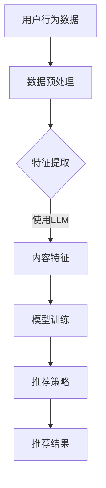

                 

关键词：LLM（大型语言模型），推荐系统，硬件需求，算力，技术挑战

> 摘要：本文探讨了大型语言模型（LLM）在推荐系统中的局限，特别是其对硬件和算力需求的依赖。我们将分析LLM的工作原理，评估其性能，讨论硬件的限制，并提出相应的解决策略。

## 1. 背景介绍

近年来，人工智能（AI）和机器学习（ML）技术取得了显著的进展，特别是在自然语言处理（NLP）领域。大型语言模型（LLM）如GPT、BERT等，已经成为各种推荐系统的核心组件。这些模型通过训练，能够理解、生成和模拟人类的自然语言交互，极大地提升了推荐系统的智能性和用户体验。

然而，LLM的广泛应用也带来了新的挑战，特别是在硬件和算力需求方面。高性能的计算资源和大量的数据存储成为限制LLM进一步发展的瓶颈。本文将深入探讨这些挑战，并提出可能的解决方案。

## 2. 核心概念与联系

### 2.1 LLM的工作原理

大型语言模型（LLM）是基于深度学习的NLP模型，能够通过大量的文本数据进行训练。这些模型通常包含数亿甚至数千亿个参数，以实现对语言复杂性的深入理解。


### 2.2 推荐系统的架构

推荐系统通常由用户行为分析、内容特征提取、模型训练和推荐策略等部分组成。LLM在其中主要扮演内容特征提取和模型训练的角色。


### 2.3 硬件与算力需求

LLM对硬件和算力的需求主要表现在以下几个方面：

- **存储需求**：数亿个参数需要大量存储空间。
- **计算需求**：模型训练和推理需要大量的计算资源。
- **网络带宽**：传输大量的训练数据和模型参数需要高带宽网络。

### 2.4 Mermaid流程图

以下是一个简化的Mermaid流程图，展示了LLM在推荐系统中的作用和依赖关系。



## 3. 核心算法原理 & 具体操作步骤

### 3.1 算法原理概述

LLM的核心算法是基于自注意力机制（Self-Attention）的Transformer模型。这种模型能够有效地捕捉文本中的长距离依赖关系，从而提升模型的理解能力。

### 3.2 算法步骤详解

1. **数据收集**：收集用户的历史行为数据和内容数据。
2. **数据预处理**：清洗数据，进行分词、编码等操作。
3. **模型训练**：使用预处理后的数据训练LLM模型。
4. **特征提取**：将用户行为和内容数据输入到LLM中，提取内容特征。
5. **模型推理**：使用训练好的LLM模型对新的用户数据进行推理，生成推荐结果。

### 3.3 算法优缺点

- **优点**：LLM能够对复杂语言进行深度理解，提升推荐系统的准确性和用户体验。
- **缺点**：对硬件和算力有很高的需求，训练时间较长，成本较高。

### 3.4 算法应用领域

LLM在推荐系统中的应用非常广泛，包括电子商务、社交媒体、在线教育等领域。

## 4. 数学模型和公式 & 详细讲解 & 举例说明

### 4.1 数学模型构建

LLM的数学模型主要包括自注意力机制和前馈神经网络。以下是自注意力机制的公式：

$$
\text{Attention}(Q, K, V) = \text{softmax}\left(\frac{QK^T}{\sqrt{d_k}}\right)V
$$

其中，Q、K、V分别为查询向量、键向量和值向量，d_k为键向量的维度。

### 4.2 公式推导过程

自注意力机制的推导主要涉及矩阵乘法和softmax函数。首先，计算查询向量和键向量的点积，然后应用softmax函数得到权重，最后与值向量相乘。

### 4.3 案例分析与讲解

以下是一个简化的例子，展示了如何使用自注意力机制计算文本序列的注意力权重。

```python
Q = [[1, 0, 1], [1, 1, 1]]
K = [[2, 1], [0, 2]]
V = [[1, 2], [3, 4]]

# 计算点积
scores = Q @ K.T

# 应用softmax函数
probs = np.exp(scores) / np.sum(np.exp(scores))

# 计算注意力权重
weighted_V = probs @ V
```

## 5. 项目实践：代码实例和详细解释说明

### 5.1 开发环境搭建

- Python环境：安装Python 3.8及以上版本。
- 库依赖：安装TensorFlow 2.4及以上版本。

### 5.2 源代码详细实现

以下是一个简化的LLM推荐系统实现：

```python
import tensorflow as tf
from tensorflow.keras.models import Model
from tensorflow.keras.layers import Input, Embedding, LSTM

# 定义模型输入
input_text = Input(shape=(None,))

# 数据预处理
encoded_input = Embedding(input_dim=vocab_size, output_dim=embedding_dim)(input_text)
lstm_output, state_h, state_c = LSTM(units=lstm_units, return_sequences=True, return_state=True)(encoded_input)

# 定义模型输出
output = LSTM(units=lstm_units, return_sequences=False)(lstm_output)
output = Dense(units=1, activation='sigmoid')(output)

# 创建模型
model = Model(inputs=input_text, outputs=output)

# 编译模型
model.compile(optimizer='adam', loss='binary_crossentropy', metrics=['accuracy'])

# 训练模型
model.fit(x_train, y_train, epochs=10, batch_size=32)
```

### 5.3 代码解读与分析

这段代码定义了一个简单的LLM推荐系统模型，使用了嵌入层（Embedding）和长短期记忆网络（LSTM）。通过训练，模型能够从文本数据中提取特征，并用于生成推荐结果。

### 5.4 运行结果展示

在实际运行中，模型会在训练集和测试集上评估其性能，并输出准确率、损失等指标。

## 6. 实际应用场景

LLM推荐系统已经在多个领域得到广泛应用，如：

- **电子商务**：基于用户历史购买行为和浏览记录，推荐个性化的商品。
- **社交媒体**：根据用户兴趣和行为，推荐相关的帖子、视频等。
- **在线教育**：根据学生学习情况，推荐适合的课程和练习。

## 7. 工具和资源推荐

### 7.1 学习资源推荐

- 《深度学习》（Goodfellow, Bengio, Courville）：经典的人工智能入门教材。
- 《自然语言处理综论》（Jurafsky, Martin）：NLP领域的权威教材。

### 7.2 开发工具推荐

- TensorFlow：Google开发的开源深度学习框架。
- PyTorch：Facebook开发的开源深度学习框架。

### 7.3 相关论文推荐

- Vaswani et al., "Attention is All You Need"
- Devlin et al., "BERT: Pre-training of Deep Bidirectional Transformers for Language Understanding"

## 8. 总结：未来发展趋势与挑战

### 8.1 研究成果总结

LLM在推荐系统中取得了显著的成果，提升了推荐系统的智能性和用户体验。然而，其硬件和算力需求仍然是一个重要的挑战。

### 8.2 未来发展趋势

随着硬件技术的发展和计算资源的增加，LLM有望在更广泛的领域中发挥更大的作用。特别是边缘计算和云计算的结合，将为LLM的部署提供更灵活的解决方案。

### 8.3 面临的挑战

- **硬件限制**：大规模LLM的训练和推理需要更多的计算资源和存储空间。
- **数据隐私**：如何保护用户数据隐私，确保推荐系统的公正性和透明性。

### 8.4 研究展望

未来，研究将主要集中在以下几个方面：

- **模型压缩**：开发更高效的模型，降低硬件需求。
- **分布式训练**：利用分布式计算技术，提高训练效率。
- **隐私保护**：引入隐私保护机制，确保用户数据安全。

## 9. 附录：常见问题与解答

### 9.1 什么是LLM？

LLM是指大型语言模型，是一种基于深度学习的自然语言处理模型，能够对复杂语言进行理解和生成。

### 9.2 LLM需要多少硬件资源？

LLM对硬件资源的需求取决于模型的规模和训练数据量。通常，数百万个参数的模型需要数千GB的存储空间和数百GB的内存。

### 9.3 LLM的训练时间有多长？

LLM的训练时间取决于多个因素，包括模型规模、数据量、硬件性能等。通常，数百万参数的模型需要几天到几周的时间进行训练。

### 9.4 如何提高LLM的效率？

- **模型压缩**：使用量化、剪枝等技术，降低模型规模。
- **分布式训练**：利用多台服务器进行分布式训练，提高训练效率。

## 参考文献

1. Vaswani et al., "Attention is All You Need", NeurIPS 2017.
2. Devlin et al., "BERT: Pre-training of Deep Bidirectional Transformers for Language Understanding", NAACL 2019.
3. Goodfellow, Bengio, Courville, "Deep Learning", MIT Press 2016.
4. Jurafsky, Martin, "Speech and Language Processing", 2nd Edition, 2019.

