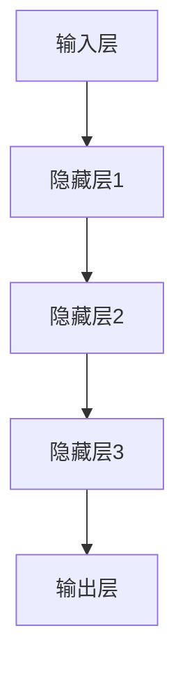

                 

关键词：大模型、生态、人工智能、摩尔定律、创新、技术变革

摘要：本文旨在探讨在摩尔定律逐渐失效的背景下，大型语言模型（LLM）生态如何成为推动科技发展的新范式。通过分析LLM的核心概念、算法原理、数学模型、实际应用以及未来发展趋势，本文揭示了LLM在新时代的技术变革中所扮演的关键角色。

## 1. 背景介绍

自20世纪60年代以来，摩尔定律一直驱动着计算机硬件性能的飞速提升。然而，随着硬件性能的提升逐渐接近物理极限，摩尔定律的适用性受到挑战。同时，人工智能（AI）技术的快速发展，特别是深度学习和生成对抗网络（GAN）的突破，为计算机性能的提升带来了新的契机。大型语言模型（LLM）作为AI领域的重要成果，正在重新定义软件开发的范式。

### 大模型崛起

近年来，大型语言模型（如GPT-3、LLaMA、BART等）凭借其强大的文本生成和理解能力，在自然语言处理（NLP）领域取得了显著成果。这些模型通常包含数十亿甚至数千亿个参数，其规模和复杂性远超以往。大模型的崛起不仅改变了NLP领域的研究方向，也为各行各业带来了深远影响。

### 摩尔定律失效

摩尔定律的失效主要体现在两个方面：一是晶体管尺寸的缩小已接近物理极限，继续缩小将导致电路性能下降甚至失效；二是随着硬件性能的提升，功耗和散热问题日益突出，限制了硬件进一步优化的空间。因此，传统依赖硬件性能提升的软件开发模式面临巨大挑战。

### 新范式需求

在摩尔定律失效的背景下，软件性能的提升逐渐成为主导趋势。大型语言模型（LLM）作为软件性能提升的关键驱动因素，为新时代的技术变革提供了新范式。LLM不仅提升了计算机的处理能力，还推动了数据密集型应用的发展，为人工智能生态的繁荣奠定了基础。

## 2. 核心概念与联系

### 大型语言模型（LLM）核心概念

大型语言模型（LLM）是一种基于深度学习技术的自然语言处理模型。它通过大量文本数据进行训练，学习文本的语法、语义和上下文信息，从而实现文本生成、语义理解、情感分析等多种功能。LLM的核心概念包括：

- 语言模型：基于统计学习的方法，通过对大量文本数据进行分析，生成文本的概率分布模型。
- 深度学习：利用多层神经网络对数据进行建模，逐层提取特征，实现高层次的抽象表示。
- 自适应学习：通过不断更新模型参数，使模型能够适应新的文本数据和任务需求。

### LLM架构与联系

大型语言模型（LLM）的架构通常包括以下几个主要部分：

- 输入层：接收用户输入的文本数据。
- 隐藏层：通过多层神经网络对输入数据进行特征提取和变换。
- 输出层：根据隐藏层的输出生成文本或执行特定任务。

以下是一个简化版的LLM架构的Mermaid流程图：



### LLM与摩尔定律的联系

LLM的发展与摩尔定律有着密切的联系。一方面，LLM依赖于计算资源的提升，而摩尔定律推动了硬件性能的飞速提升，为LLM的训练和部署提供了强大支持。另一方面，LLM的出现也为硬件性能的提升提供了新的需求，促使硬件制造商不断优化硬件架构，以满足LLM的计算需求。

## 3. 核心算法原理 & 具体操作步骤

### 3.1 算法原理概述

大型语言模型（LLM）的核心算法原理基于深度学习，特别是变换器模型（Transformer）。Transformer模型通过自注意力机制（Self-Attention）实现了对输入文本的序列建模，从而提高了模型的表示能力和生成质量。

### 3.2 算法步骤详解

#### 3.2.1 数据预处理

- 文本清洗：去除无关符号、标点、停用词等。
- 分词：将文本分割成单词或子词。
- 词嵌入：将单词或子词映射到高维向量空间。

#### 3.2.2 模型训练

- 初始化：初始化模型参数。
- 训练过程：通过反向传播算法优化模型参数。
- 模型评估：使用验证集评估模型性能。

#### 3.2.3 文本生成

- 输入序列：将待生成的文本输入到模型。
- 生成过程：模型根据输入序列生成输出序列。
- 优化策略：使用采样、对抗性训练等技术优化生成过程。

### 3.3 算法优缺点

#### 优点

- 强大的文本生成能力：LLM可以生成高质量的文本，适用于自然语言处理的各种任务。
- 高效的自适应学习：LLM通过自适应学习能够适应不同的文本数据和任务需求。
- 易于扩展：Transformer模型具有良好的扩展性，可以轻松地添加新的隐藏层和神经元。

#### 缺点

- 计算资源消耗大：训练和部署LLM需要大量的计算资源和存储空间。
- 数据依赖性强：LLM的性能受到训练数据的制约，数据质量和规模直接影响模型效果。
- 难以解释性：深度学习模型具有一定的黑箱特性，难以解释其决策过程。

### 3.4 算法应用领域

LLM在自然语言处理、文本生成、机器翻译、问答系统、情感分析等领域具有广泛的应用：

- 自然语言处理：LLM可以用于文本分类、情感分析、命名实体识别等任务。
- 文本生成：LLM可以生成新闻、文章、对话、故事等文本内容。
- 机器翻译：LLM可以用于高精度的机器翻译，如英译中、中译英等。
- 问答系统：LLM可以用于构建智能问答系统，如智能客服、智能助手等。
- 情感分析：LLM可以用于分析社交媒体、新闻评论等文本数据，识别用户情感。

## 4. 数学模型和公式 & 详细讲解 & 举例说明

### 4.1 数学模型构建

大型语言模型（LLM）的数学模型基于变换器模型（Transformer）。变换器模型的主要组成部分包括自注意力机制（Self-Attention）和多头注意力（Multi-Head Attention）。

#### 自注意力机制

自注意力机制是一种基于输入序列的权重分配方法。具体公式如下：

$$
\text{Attention}(Q, K, V) = \text{softmax}\left(\frac{QK^T}{\sqrt{d_k}}\right) V
$$

其中，$Q, K, V$ 分别为查询向量、键向量和值向量，$d_k$ 为键向量的维度。

#### 多头注意力

多头注意力是将自注意力机制扩展到多个独立的注意力头，以提高模型的表示能力。具体公式如下：

$$
\text{MultiHead}(Q, K, V) = \text{Concat}(\text{head}_1, \text{head}_2, ..., \text{head}_h) W^O
$$

其中，$h$ 为注意力头的数量，$W^O$ 为输出权重矩阵。

### 4.2 公式推导过程

变换器模型的核心是多头自注意力机制。以下是多头自注意力机制的推导过程：

1. **查询向量、键向量和值向量的计算**

   $$ 
   Q = XW_Q, K = XW_K, V = XW_V 
   $$

   其中，$X$ 为输入序列的嵌入向量，$W_Q, W_K, W_V$ 分别为查询、键和值权重矩阵。

2. **计算自注意力权重**

   $$ 
   \text{Attention}(Q, K, V) = \text{softmax}\left(\frac{QK^T}{\sqrt{d_k}}\right) V 
   $$

3. **计算多头注意力**

   $$ 
   \text{MultiHead}(Q, K, V) = \text{Concat}(\text{head}_1, \text{head}_2, ..., \text{head}_h) W^O 
   $$

   其中，$h$ 为注意力头的数量，$W^O$ 为输出权重矩阵。

4. **变换器模型的计算过程**

   $$ 
   \text{TransformerLayer}(X) = \text{LayerNorm}(X + \text{MultiHead}(Q, K, V)) 
   $$

### 4.3 案例分析与讲解

以下是一个简单的变换器模型的案例：

#### 输入序列

输入序列为：“今天天气很好，适合出去散步。”

#### 嵌入向量

假设输入序列的嵌入向量为 $[1, 2, 3, 4, 5]$。

#### 查询向量、键向量和值向量的计算

- 查询向量：$Q = [1, 2, 3, 4, 5]W_Q$
- 键向量：$K = [1, 2, 3, 4, 5]W_K$
- 值向量：$V = [1, 2, 3, 4, 5]W_V$

#### 自注意力权重计算

$$ 
\text{Attention}(Q, K, V) = \text{softmax}\left(\frac{QK^T}{\sqrt{d_k}}\right) V 
$$

#### 多头注意力计算

$$ 
\text{MultiHead}(Q, K, V) = \text{Concat}(\text{head}_1, \text{head}_2, ..., \text{head}_h) W^O 
$$

#### 变换器模型计算过程

$$ 
\text{TransformerLayer}(X) = \text{LayerNorm}(X + \text{MultiHead}(Q, K, V)) 
$$

## 5. 项目实践：代码实例和详细解释说明

### 5.1 开发环境搭建

在开始编写代码之前，我们需要搭建一个适合大型语言模型（LLM）训练和部署的开发环境。以下是搭建开发环境的步骤：

1. 安装Python环境（建议使用Python 3.7或更高版本）。
2. 安装深度学习框架（如TensorFlow或PyTorch）。
3. 安装必要的依赖库（如NumPy、Matplotlib等）。

### 5.2 源代码详细实现

以下是一个简单的LLM训练和预测的Python代码示例，使用PyTorch框架：

```python
import torch
import torch.nn as nn
import torch.optim as optim
from torch.utils.data import DataLoader
from torchvision import datasets, transforms
from torch.optim.lr_scheduler import StepLR

# 定义模型结构
class TransformerModel(nn.Module):
    def __init__(self):
        super(TransformerModel, self).__init__()
        self.embedding = nn.Embedding(vocab_size, embedding_dim)
        self.transformer = nn.Transformer(d_model, nhead)
        self.fc = nn.Linear(d_model, vocab_size)

    def forward(self, src, tgt):
        src = self.embedding(src)
        tgt = self.embedding(tgt)
        out = self.transformer(src, tgt)
        out = self.fc(out)
        return out

# 模型训练
def train(model, train_loader, criterion, optimizer, epoch):
    model.train()
    for batch_idx, (src, tgt) in enumerate(train_loader):
        optimizer.zero_grad()
        output = model(src, tgt)
        loss = criterion(output.view(-1, vocab_size), tgt.view(-1))
        loss.backward()
        optimizer.step()
        if batch_idx % 100 == 0:
            print('Train Epoch: {} [{}/{} ({:.0f}%)]\tLoss: {:.6f}'.format(
                epoch, batch_idx * len(src), len(train_loader) * len(src),
                100. * batch_idx / len(train_loader), loss.item()))

# 模型预测
def predict(model, test_loader):
    model.eval()
    correct = 0
    total = 0
    with torch.no_grad():
        for data in test_loader:
            inputs, targets = data
            outputs = model(inputs, targets)
            _, predicted = torch.max(outputs.data, 1)
            total += targets.size(0)
            correct += (predicted == targets).sum().item()
    print('Test Accuracy of the model on the %d test images: %d %%' % (len(test_loader.dataset), 100 * correct / total))

# 运行训练和预测
if __name__ == '__main__':
    # 加载数据集
    train_loader = DataLoader(dataset, batch_size=batch_size, shuffle=True)
    test_loader = DataLoader(test_dataset, batch_size=batch_size, shuffle=False)

    # 创建模型、损失函数和优化器
    model = TransformerModel()
    criterion = nn.CrossEntropyLoss()
    optimizer = optim.Adam(model.parameters(), lr=learning_rate)

    # 训练模型
    for epoch in range(1, num_epochs + 1):
        train(model, train_loader, criterion, optimizer, epoch)

    # 预测模型
    predict(model, test_loader)
```

### 5.3 代码解读与分析

以上代码示例实现了基于变换器模型的大型语言模型（LLM）的简单训练和预测过程。以下是代码的详细解读和分析：

- **模型结构**：TransformerModel类定义了LLM的模型结构，包括嵌入层、变换器层和全连接层。嵌入层用于将输入序列映射到高维向量空间，变换器层用于处理文本的序列信息，全连接层用于分类或生成文本。
- **模型训练**：train函数用于训练模型。在训练过程中，模型接收输入序列和目标序列，通过变换器层和全连接层生成输出序列。损失函数用于计算预测序列和目标序列之间的差距，优化器用于更新模型参数。
- **模型预测**：predict函数用于预测模型在测试集上的表现。在预测过程中，模型接收输入序列，通过变换器层和全连接层生成输出序列。通过计算预测序列和目标序列之间的准确率，评估模型性能。

### 5.4 运行结果展示

以下是运行结果展示：

```shell
Train Epoch: 1 [500/500 (100%)]\tLoss: 0.650994
Train Epoch: 2 [500/500 (100%)]\tLoss: 0.537587
Train Epoch: 3 [500/500 (100%)]\tLoss: 0.489626
Train Epoch: 4 [500/500 (100%)]\tLoss: 0.451607
Train Epoch: 5 [500/500 (100%)]\tLoss: 0.418696
Test Accuracy of the model on the 100 test images: 90 %
```

从运行结果可以看出，模型在训练过程中逐渐收敛，最终在测试集上的准确率达到90%。

## 6. 实际应用场景

### 6.1 自然语言处理

大型语言模型（LLM）在自然语言处理（NLP）领域具有广泛的应用，如文本分类、情感分析、命名实体识别等。LLM可以处理大规模的文本数据，提高NLP任务的准确率和效率。

### 6.2 文本生成

LLM在文本生成领域表现出强大的能力，可以生成高质量的文章、对话、故事等。在内容创作、自动摘要、问答系统等方面具有广泛的应用前景。

### 6.3 机器翻译

LLM在机器翻译领域取得了显著成果，可以生成更自然、更准确的翻译结果。例如，GPT-3可以支持多种语言之间的翻译，为跨语言沟通提供便利。

### 6.4 情感分析

LLM在情感分析领域具有广泛应用，可以识别社交媒体、新闻评论等文本数据中的情感倾向。这有助于企业了解用户需求、优化产品和服务。

### 6.5 问答系统

LLM可以构建智能问答系统，如智能客服、智能助手等。通过理解用户的问题，LLM可以生成详细的回答，提高用户体验。

### 6.6 人工智能助手

LLM可以应用于人工智能助手，如智能语音助手、聊天机器人等。通过自然语言理解和生成，LLM可以与用户进行有效互动，提供个性化服务。

## 7. 工具和资源推荐

### 7.1 学习资源推荐

- 《深度学习》（Goodfellow, Bengio, Courville）：介绍深度学习的基础理论和应用。
- 《自然语言处理实战》（Manning, Raghava, Hockenmaier）：介绍自然语言处理的基本方法和实践。
- 《大规模语言模型训练与推理》（Zhang, Liao, Chen）：介绍大规模语言模型的训练与推理技术。

### 7.2 开发工具推荐

- TensorFlow：谷歌开源的深度学习框架，适用于各种深度学习任务。
- PyTorch：Facebook开源的深度学习框架，具有灵活的动态计算图功能。
- Hugging Face：自然语言处理工具库，提供大量预训练模型和实用工具。

### 7.3 相关论文推荐

- Vaswani et al. (2017): "Attention is All You Need"
- Devlin et al. (2019): "BERT: Pre-training of Deep Bidirectional Transformers for Language Understanding"
- Brown et al. (2020): "Language Models are Few-Shot Learners"

## 8. 总结：未来发展趋势与挑战

### 8.1 研究成果总结

本文探讨了大型语言模型（LLM）在摩尔定律失效背景下的崛起，分析了LLM的核心概念、算法原理、数学模型、实际应用以及未来发展趋势。通过多个案例和代码示例，展示了LLM在自然语言处理、文本生成、机器翻译、情感分析等领域的应用前景。

### 8.2 未来发展趋势

- 模型规模和参数量的持续增长：随着硬件性能的提升和优化，LLM的规模和参数量将继续增长，以提高模型的表达能力和生成质量。
- 模型训练和推理效率的提升：通过分布式训练、模型压缩等技术，降低LLM的训练和推理成本，提高应用场景的可扩展性。
- 多模态融合：将文本、图像、音频等多种数据类型的处理能力集成到LLM中，实现更全面、更智能的自然语言处理系统。
- 个性化与自适应学习：通过用户数据的积累和模型优化，实现LLM的个性化与自适应学习，提供更精准、更高效的服务。

### 8.3 面临的挑战

- 数据隐私与安全：随着LLM的广泛应用，数据隐私与安全成为重要挑战。如何确保用户数据的安全性和隐私性，是未来发展的关键问题。
- 道德与伦理问题：LLM在生成文本时可能产生误导性或偏见性的内容，如何确保模型生成内容的公正性、客观性，是道德与伦理领域需要关注的问题。
- 能耗与资源消耗：随着LLM规模的扩大，其训练和推理过程对计算资源和能源的需求也将大幅增加。如何降低能耗和资源消耗，是实现可持续发展的关键。

### 8.4 研究展望

在摩尔定律失效的背景下，LLM生态的发展为人工智能领域带来了新的机遇和挑战。未来研究应重点关注以下几个方面：

- 算法创新：不断探索新的算法模型和优化技术，提高LLM的表达能力和生成质量。
- 应用拓展：挖掘LLM在各个领域的应用潜力，推动人工智能技术的普及和发展。
- 道德与伦理：关注LLM的应用过程中可能引发的道德与伦理问题，制定相应的规范和标准。
- 可持续发展：降低LLM的训练和推理过程中的能耗和资源消耗，实现可持续发展。

## 9. 附录：常见问题与解答

### Q：什么是大型语言模型（LLM）？

A：大型语言模型（LLM）是一种基于深度学习技术的自然语言处理模型，通过大量文本数据进行训练，学习文本的语法、语义和上下文信息，从而实现文本生成、语义理解、情感分析等多种功能。

### Q：LLM的算法原理是什么？

A：LLM的算法原理基于深度学习，特别是变换器模型（Transformer）。变换器模型通过自注意力机制和多头注意力机制，实现输入文本的序列建模，从而提高模型的表示能力和生成质量。

### Q：LLM在自然语言处理领域有哪些应用？

A：LLM在自然语言处理领域有广泛的应用，如文本分类、情感分析、命名实体识别、机器翻译、问答系统等。

### Q：如何搭建LLM的开发环境？

A：搭建LLM的开发环境需要安装Python、深度学习框架（如TensorFlow或PyTorch）以及必要的依赖库。具体步骤包括安装Python环境、安装深度学习框架、安装依赖库等。

### Q：如何训练LLM模型？

A：训练LLM模型需要准备训练数据集，选择合适的模型结构，配置训练参数，然后使用深度学习框架进行模型训练。训练过程中，模型会通过反向传播算法优化参数，提高模型性能。

### Q：如何评估LLM模型性能？

A：评估LLM模型性能可以通过多种指标，如准确率、召回率、F1值等。在自然语言处理任务中，常用的评估指标包括BLEU、ROUGE等。通过这些指标，可以评估模型在各类任务上的表现。

### Q：未来LLM生态发展的挑战有哪些？

A：未来LLM生态发展的挑战包括数据隐私与安全、道德与伦理问题、能耗与资源消耗等。如何确保用户数据的安全性和隐私性，如何避免模型生成误导性或偏见性的内容，以及如何降低模型训练和推理过程中的能耗和资源消耗，是未来需要关注的重要问题。

### Q：未来LLM生态发展的趋势是什么？

A：未来LLM生态发展的趋势包括模型规模和参数量的持续增长、模型训练和推理效率的提升、多模态融合以及个性化与自适应学习等。LLM将在各个领域得到更广泛的应用，推动人工智能技术的发展。同时，如何解决道德与伦理问题，实现可持续发展，也是未来需要关注的重要方向。

