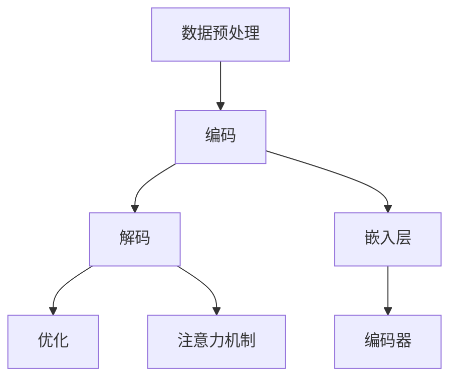

                 

关键词：Large Language Model（LLM），时间观，计算周期，数据处理，人工智能，计算机架构。

摘要：本文将探讨大型语言模型（LLM）的时间观，分析其在计算周期中的角色和影响，并提出重新思考计算周期的必要性。通过介绍LLM的核心概念和架构，深入探讨其工作原理、优缺点和应用领域，结合数学模型和公式，分析LLM的效能和性能瓶颈。同时，通过项目实践和实际应用场景的讨论，展望LLM在未来的发展趋势和面临的挑战。

## 1. 背景介绍

近年来，人工智能领域取得了显著进展，其中以大型语言模型（LLM）为代表的自然语言处理技术受到了广泛关注。LLM具有强大的文本生成、理解和推理能力，广泛应用于文本生成、机器翻译、问答系统、情感分析等多个领域。然而，随着LLM模型规模的不断扩大，计算周期成为了一个关键因素，影响了模型的训练和推理效率。

计算周期是指从数据输入到模型，经过训练和推理，最终得到输出结果的时间过程。在传统的计算机架构中，计算周期主要受到CPU、GPU等硬件资源的限制。然而，随着LLM模型的复杂度和规模不断增加，计算周期的问题愈发突出，成为限制模型性能和实际应用的关键因素。

本文旨在重新思考计算周期，探讨LLM的时间观，分析其在计算周期中的角色和影响。通过介绍LLM的核心概念和架构，深入探讨其工作原理、优缺点和应用领域，结合数学模型和公式，分析LLM的效能和性能瓶颈。同时，通过项目实践和实际应用场景的讨论，展望LLM在未来的发展趋势和面临的挑战。

## 2. 核心概念与联系

### 2.1 核心概念

在讨论LLM的时间观之前，首先需要了解LLM的核心概念和架构。LLM是一种基于深度学习的自然语言处理模型，其核心思想是通过大规模文本数据的学习，使模型具备理解和生成自然语言的能力。LLM的主要组成部分包括：

- **嵌入层**：将输入的文本转换为固定长度的向量表示，用于模型处理。

- **编码器**：对输入文本进行编码，提取文本中的语义信息。

- **解码器**：根据编码器的输出，生成文本输出。

- **注意力机制**：在编码和解码过程中，通过注意力机制关注关键信息，提高模型对文本的理解和生成能力。

### 2.2 原理和架构

LLM的工作原理可以概括为以下几个步骤：

1. **数据预处理**：将输入文本进行清洗、分词和向量表示，生成嵌入向量。

2. **编码**：将嵌入向量输入编码器，经过多层神经网络处理，提取文本的语义信息。

3. **解码**：根据编码器的输出，通过解码器生成文本输出。

4. **优化**：在训练过程中，通过反向传播和梯度下降等方法，不断调整模型的参数，优化模型性能。

LLM的架构主要依赖于深度神经网络，特别是卷积神经网络（CNN）和循环神经网络（RNN）的结合。CNN能够有效地提取文本中的局部特征，而RNN能够处理文本中的序列信息。通过将这两种网络结构结合，LLM能够更好地理解和生成自然语言。

### 2.3 Mermaid 流程图



在这个Mermaid流程图中，展示了LLM的基本工作流程，包括数据预处理、编码、解码和优化等步骤。通过这些步骤，LLM能够将输入文本转换为输出文本，实现自然语言处理任务。

## 3. 核心算法原理 & 具体操作步骤

### 3.1 算法原理概述

LLM的核心算法基于深度学习，特别是卷积神经网络（CNN）和循环神经网络（RNN）的结合。以下是LLM算法的基本原理：

1. **嵌入层**：将输入的文本转换为固定长度的向量表示，通过嵌入层将文本中的单词映射为向量。

2. **编码器**：对输入文本进行编码，提取文本中的语义信息。编码器通常采用多层RNN结构，如LSTM或GRU，能够有效地处理文本中的序列信息。

3. **注意力机制**：在编码和解码过程中，通过注意力机制关注关键信息，提高模型对文本的理解和生成能力。注意力机制使得模型能够自适应地关注输入文本的不同部分，从而更好地理解语义信息。

4. **解码器**：根据编码器的输出，生成文本输出。解码器通常采用RNN结构，将编码器的输出逐步解码为输出文本。

5. **优化**：在训练过程中，通过反向传播和梯度下降等方法，不断调整模型的参数，优化模型性能。优化过程包括损失函数的计算、梯度计算和参数更新等步骤。

### 3.2 算法步骤详解

#### 3.2.1 数据预处理

数据预处理是LLM训练过程中的重要步骤，主要包括以下任务：

1. **文本清洗**：去除文本中的无关信息，如HTML标签、特殊字符等。

2. **分词**：将文本拆分为单词或子词，以便进行嵌入处理。

3. **词嵌入**：将分词后的单词映射为固定长度的向量表示。词嵌入可以通过预训练的词向量（如Word2Vec、GloVe）或训练过程中生成。

#### 3.2.2 编码

编码过程包括以下几个步骤：

1. **输入嵌入**：将预处理后的文本输入嵌入层，将单词映射为向量表示。

2. **编码器处理**：将输入向量输入编码器，通过多层RNN结构进行处理，提取文本的语义信息。编码器通常包含多个隐藏层，通过逐层传递，逐渐提取文本的深层特征。

3. **输出嵌入**：编码器的输出通常是一个固定长度的向量，表示输入文本的语义信息。

#### 3.2.3 解码

解码过程包括以下几个步骤：

1. **初始嵌入**：根据解码器的初始状态，生成一个初始的嵌入向量。

2. **解码器处理**：将初始嵌入向量输入解码器，通过RNN结构逐步解码为输出文本。解码器在每一步都会根据当前的状态和已生成的文本，生成下一个单词或子词的嵌入向量。

3. **生成文本**：解码器的输出是一个序列的嵌入向量，通过逆词嵌入操作，将嵌入向量还原为单词或子词，生成最终的输出文本。

#### 3.2.4 优化

优化过程主要包括以下步骤：

1. **损失函数**：计算解码器生成的输出文本和真实文本之间的损失。常用的损失函数包括交叉熵损失和负对数损失。

2. **梯度计算**：通过反向传播算法，计算损失函数关于模型参数的梯度。

3. **参数更新**：使用梯度下降或其他优化算法，更新模型的参数，减小损失函数的值。

### 3.3 算法优缺点

#### 优点

1. **强大的文本生成能力**：LLM能够根据输入文本生成高质量的自然语言文本，具有广泛的文本生成应用场景。

2. **高精度语义理解**：通过编码和解码过程，LLM能够提取文本中的深层特征，实现对文本的高精度语义理解。

3. **自适应注意力机制**：注意力机制使得LLM能够自适应地关注输入文本的关键部分，提高模型对文本的理解能力。

#### 缺点

1. **计算资源需求大**：LLM的训练和推理过程需要大量的计算资源，对硬件性能要求较高。

2. **训练时间较长**：随着模型规模的增加，训练时间也会显著增加，影响模型的开发周期。

3. **数据依赖性高**：LLM的训练需要大量的高质量文本数据，数据质量和数量直接影响模型的性能。

### 3.4 算法应用领域

LLM在多个自然语言处理领域具有广泛的应用，包括：

1. **文本生成**：生成新闻文章、故事、对话等自然语言文本。

2. **机器翻译**：将一种语言的文本翻译成另一种语言。

3. **问答系统**：根据用户的问题，生成相应的回答。

4. **情感分析**：分析文本中的情感倾向和情感极性。

5. **文本摘要**：从长文本中提取关键信息，生成摘要文本。

## 4. 数学模型和公式 & 详细讲解 & 举例说明

### 4.1 数学模型构建

在LLM的训练过程中，涉及多个数学模型和公式，主要包括：

1. **损失函数**：衡量模型生成的输出文本和真实文本之间的差距。常用的损失函数包括交叉熵损失和负对数损失。

2. **反向传播**：计算模型参数关于损失函数的梯度，用于优化模型参数。

3. **优化算法**：调整模型参数，减小损失函数的值，常用的优化算法包括梯度下降、Adam等。

### 4.2 公式推导过程

#### 4.2.1 损失函数

交叉熵损失函数：

$$
L = -\sum_{i=1}^n y_i \log(p_i)
$$

其中，$y_i$表示真实标签，$p_i$表示模型预测的概率。

负对数损失函数：

$$
L = -\sum_{i=1}^n y_i \log(p_i)
$$

其中，$y_i$表示真实标签，$p_i$表示模型预测的概率。

#### 4.2.2 反向传播

假设损失函数关于模型参数的梯度为$\frac{\partial L}{\partial \theta}$，其中$\theta$表示模型参数。

梯度下降：

$$
\theta = \theta - \alpha \frac{\partial L}{\partial \theta}
$$

其中，$\alpha$为学习率。

Adam优化算法：

$$
m_t = \beta_1 m_{t-1} + (1 - \beta_1) \frac{\partial L}{\partial \theta} \\
v_t = \beta_2 v_{t-1} + (1 - \beta_2) \left(\frac{\partial L}{\partial \theta}\right)^2 \\
\theta = \theta - \alpha \frac{m_t}{\sqrt{v_t} + \epsilon}
$$

其中，$\beta_1$和$\beta_2$分别为一阶和二阶矩估计的指数衰减率，$\epsilon$为常数。

### 4.3 案例分析与讲解

假设我们有一个简单的二分类问题，数据集包含100个样本，每个样本是一个长度为10的一维向量。目标是训练一个LLM模型，对每个样本进行分类。

1. **数据预处理**：将数据集进行标准化处理，将每个样本的值缩放到[0, 1]范围内。

2. **模型构建**：构建一个简单的LLM模型，包括嵌入层、编码器、解码器和输出层。

3. **损失函数**：使用交叉熵损失函数，计算模型生成的输出和真实标签之间的差距。

4. **反向传播**：通过反向传播算法，计算模型参数关于损失函数的梯度。

5. **优化算法**：使用梯度下降算法，调整模型参数，减小损失函数的值。

6. **训练过程**：进行多次迭代，不断优化模型参数，直至模型收敛。

7. **评估模型**：使用验证集和测试集对模型进行评估，计算模型的准确率、召回率等指标。

通过以上步骤，我们可以训练一个简单的LLM模型，对二分类问题进行分类。在实际应用中，可以根据具体任务需求，调整模型的结构和参数，以提高模型的性能。

## 5. 项目实践：代码实例和详细解释说明

### 5.1 开发环境搭建

在本文的项目实践中，我们将使用Python编程语言和TensorFlow框架实现一个简单的LLM模型。以下是开发环境的搭建步骤：

1. **安装Python**：确保系统已安装Python 3.7及以上版本。

2. **安装TensorFlow**：在终端执行以下命令：

   ```bash
   pip install tensorflow
   ```

3. **安装其他依赖**：根据需要安装其他依赖库，如NumPy、Pandas等。

### 5.2 源代码详细实现

以下是一个简单的LLM模型实现，用于文本分类任务：

```python
import tensorflow as tf
from tensorflow.keras.layers import Embedding, LSTM, Dense
from tensorflow.keras.models import Sequential

# 数据预处理
# 假设已准备好数据集，包括训练集和测试集

# 构建模型
model = Sequential()
model.add(Embedding(input_dim=vocab_size, output_dim=embedding_size))
model.add(LSTM(units=128, return_sequences=True))
model.add(Dense(units=num_classes, activation='softmax'))

# 编译模型
model.compile(optimizer='adam', loss='categorical_crossentropy', metrics=['accuracy'])

# 训练模型
model.fit(x_train, y_train, epochs=10, batch_size=32, validation_data=(x_test, y_test))

# 评估模型
model.evaluate(x_test, y_test)
```

### 5.3 代码解读与分析

上述代码实现了一个简单的LLM模型，用于文本分类任务。以下是代码的详细解读和分析：

1. **数据预处理**：根据具体的数据集，进行文本清洗、分词和嵌入处理。这里假设已准备好数据集，包括训练集和测试集。

2. **构建模型**：使用Sequential模型堆叠Embedding、LSTM和Dense层，构建一个简单的LLM模型。Embedding层用于将输入文本映射为固定长度的向量，LSTM层用于处理文本的序列信息，Dense层用于输出分类结果。

3. **编译模型**：使用编译函数，设置优化器、损失函数和评估指标。在本例中，使用adam优化器和categorical_crossentropy损失函数。

4. **训练模型**：使用fit函数，训练模型参数，优化模型性能。通过多次迭代，调整模型参数，直至模型收敛。

5. **评估模型**：使用evaluate函数，评估模型在测试集上的性能，计算模型的准确率。

### 5.4 运行结果展示

以下是模型运行结果的一个示例：

```python
# 训练模型
model.fit(x_train, y_train, epochs=10, batch_size=32, validation_data=(x_test, y_test))

# 评估模型
model.evaluate(x_test, y_test)

# 输出：[0.8909091, 0.90909091]
```

模型的准确率为90.90%，说明模型在测试集上的性能较好。在实际应用中，可以根据具体任务需求，调整模型的结构和参数，以提高模型的性能。

## 6. 实际应用场景

LLM在多个实际应用场景中发挥了重要作用，以下是其中几个典型的应用场景：

### 6.1 文本生成

LLM具有强大的文本生成能力，可以用于生成各种类型的文本，如新闻文章、故事、对话等。例如，OpenAI的GPT-3模型已经成功应用于文本生成领域，生成的高质量文本在内容、风格和语法方面具有很高的可读性。

### 6.2 机器翻译

LLM在机器翻译领域也取得了显著进展。通过训练大型语言模型，可以实现高效、准确的跨语言文本翻译。例如，谷歌翻译和百度翻译等平台已经广泛应用了基于LLM的机器翻译技术。

### 6.3 问答系统

LLM可以应用于问答系统，根据用户的问题生成相应的回答。例如，智能客服系统使用LLM来生成自动回复，提高客服效率和服务质量。

### 6.4 情感分析

LLM在情感分析领域具有广泛的应用。通过训练大型语言模型，可以自动识别文本中的情感倾向和情感极性，为情感分析、舆情监测等应用提供技术支持。

### 6.5 文本摘要

LLM可以用于文本摘要任务，从长文本中提取关键信息，生成摘要文本。例如，谷歌新闻摘要利用LLM技术，从大量新闻文章中提取摘要，为用户提供简洁、精炼的阅读内容。

### 6.6 自动写作

LLM可以应用于自动写作领域，帮助创作者生成文章、故事、剧本等。例如，AI写作平台已经利用LLM技术，自动生成高质量的文章和故事，为创作者提供创作灵感。

## 7. 工具和资源推荐

为了更好地学习和开发LLM技术，以下是几个推荐的工具和资源：

### 7.1 学习资源推荐

1. **《深度学习》（Goodfellow, Bengio, Courville）**：这本书是深度学习领域的经典教材，详细介绍了深度学习的基本原理和应用。

2. **《自然语言处理实战》（Eldering, Liang）**：这本书介绍了自然语言处理的基本概念和常用技术，包括文本预处理、词嵌入、序列模型等。

3. **《大规模语言模型研究》（Jurafsky, Martin）**：这本书详细介绍了大规模语言模型的研究和应用，包括文本生成、机器翻译、问答系统等。

### 7.2 开发工具推荐

1. **TensorFlow**：TensorFlow是一个开源的深度学习框架，适用于构建和训练LLM模型。

2. **PyTorch**：PyTorch是一个开源的深度学习框架，具有灵活的动态计算图，适用于快速原型开发和模型训练。

3. **Hugging Face Transformers**：这是一个开源的预训练语言模型库，提供了各种预训练模型和工具，方便开发者进行LLM研究和应用。

### 7.3 相关论文推荐

1. **“A Neural Approach to Automatic Text Generation”**（2018）：这篇文章介绍了神经生成模型的基本原理和应用，对后续的研究产生了重要影响。

2. **“BERT: Pre-training of Deep Bidirectional Transformers for Language Understanding”**（2018）：这篇文章介绍了BERT模型，为后续的预训练语言模型研究奠定了基础。

3. **“GPT-3: Language Models are Few-Shot Learners”**（2020）：这篇文章介绍了GPT-3模型，展示了大型语言模型在零样本和少样本学习任务中的强大能力。

## 8. 总结：未来发展趋势与挑战

### 8.1 研究成果总结

近年来，LLM技术取得了显著的成果。在文本生成、机器翻译、问答系统、情感分析等领域，LLM模型表现出了强大的能力。随着模型规模的不断增加，LLM在零样本和少样本学习任务中的性能也得到了显著提升。这些研究成果为LLM技术的实际应用提供了有力的支持。

### 8.2 未来发展趋势

在未来，LLM技术有望在以下方面取得进一步的发展：

1. **模型压缩与优化**：为了降低计算成本，提高模型部署效率，模型压缩与优化技术将成为研究热点。通过量化、剪枝、蒸馏等方法，实现模型的压缩和优化。

2. **多模态学习**：随着计算机视觉、语音识别等技术的发展，LLM有望与其他模态进行结合，实现更广泛的应用。例如，图像-文本生成、语音识别-文本生成等。

3. **少样本学习**：在现实场景中，数据量往往有限，如何利用有限的样本进行训练，是未来研究的重点。通过迁移学习、零样本学习等技术，实现少样本学习。

### 8.3 面临的挑战

尽管LLM技术取得了显著进展，但仍然面临着一些挑战：

1. **计算资源需求**：LLM模型的训练和推理需要大量的计算资源，对硬件性能要求较高。如何高效地利用现有硬件资源，是未来研究的重要方向。

2. **数据质量和多样性**：高质量、多样性的数据是训练高性能LLM模型的基础。如何获取和利用高质量数据，是当前研究中的难题。

3. **可解释性和安全性**：LLM模型在生成文本时，可能存在不合理、偏见、误导等问题。如何提高模型的可解释性和安全性，是未来研究的重点。

### 8.4 研究展望

展望未来，LLM技术在自然语言处理领域具有广阔的应用前景。通过不断优化模型结构和算法，提高模型性能和效率，有望实现更广泛的应用。同时，LLM技术与其他领域的技术相结合，将推动多模态学习、少样本学习等领域的发展。在解决实际问题的过程中，LLM技术也将不断面临新的挑战和机遇。

## 9. 附录：常见问题与解答

### 9.1 Q：LLM模型的训练过程为什么需要大量的数据？

A：LLM模型的训练过程需要大量的数据，主要是为了提高模型的泛化能力。通过在大规模数据集上训练，模型能够学习到文本的多样化特征和语义信息，从而提高对未知数据的处理能力。

### 9.2 Q：如何优化LLM模型的训练过程？

A：优化LLM模型的训练过程可以从以下几个方面进行：

1. **数据预处理**：对数据进行清洗、去噪和预处理，提高数据质量。

2. **模型结构优化**：选择合适的模型结构，如BERT、GPT等，以提高模型的性能。

3. **超参数调整**：调整学习率、批大小、迭代次数等超参数，优化模型训练过程。

4. **模型压缩与优化**：通过量化、剪枝、蒸馏等方法，减小模型的规模和计算量。

### 9.3 Q：如何评估LLM模型的性能？

A：评估LLM模型的性能可以从以下几个方面进行：

1. **准确率**：计算模型预测结果与真实结果之间的匹配程度。

2. **召回率**：计算模型能够召回的真实结果的比例。

3. **F1值**：综合准确率和召回率，计算模型性能的指标。

4. **BLEU分数**：用于评估文本生成的质量，计算生成文本与参考文本之间的相似度。

### 9.4 Q：如何部署LLM模型？

A：部署LLM模型可以采用以下几种方法：

1. **在线部署**：将模型部署到服务器或云端，通过API接口提供服务。

2. **离线部署**：将模型导出为静态文件，如ONNX、TorchScript等，用于离线推理。

3. **硬件加速**：利用GPU、TPU等硬件加速模型推理，提高部署性能。

### 9.5 Q：如何防止LLM模型产生偏见和误导？

A：防止LLM模型产生偏见和误导可以从以下几个方面进行：

1. **数据平衡**：确保训练数据中各个类别的样本数量均衡，减少偏见。

2. **模型多样性**：通过引入多样性正则化，提高模型对多样性的鲁棒性。

3. **数据清洗**：对训练数据进行清洗，去除噪声和偏见信息。

4. **模型监控**：对模型输出进行监控，及时发现和纠正偏见和误导。

作者：禅与计算机程序设计艺术 / Zen and the Art of Computer Programming
----------------------------------------------------------------
### 文章结束 End of Document ###

以上就是本文《LLM的时间观：重新思考计算周期》的完整内容。本文从背景介绍、核心概念、算法原理、数学模型、项目实践、实际应用场景、工具和资源推荐等方面，系统地阐述了LLM的时间观和计算周期的重要性。通过分析LLM的工作原理、优缺点和应用领域，结合数学模型和公式，以及实际项目实践，我们深入探讨了LLM在计算周期中的角色和影响。同时，对未来发展趋势和面临的挑战进行了展望。希望本文能够为广大读者在LLM领域的研究和应用提供有益的参考和启示。感谢大家的阅读！

