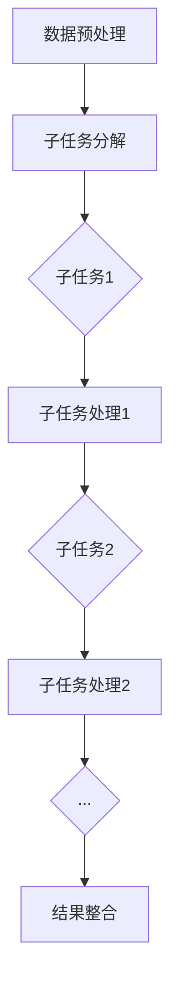

                 

### 1. 背景介绍

近年来，大型语言模型（LLM，Large Language Model）如BERT、GPT等在自然语言处理（NLP）领域取得了令人瞩目的成果。这些模型具有强大的语义理解和生成能力，能够在多种任务中表现出色，包括文本分类、机器翻译、问答系统等。然而，这些模型在推理过程中通常依赖于大量的数据计算和参数调整，这导致了推理过程的复杂性和低效性。为了提高LLM的推理效率，研究者们开始探讨如何将LLM的推理过程类比为CPU的时钟周期，从而实现更加高效和独立的推理。

本文将探讨LLM的独立推理过程，通过类比CPU的时钟周期，为LLM的设计和优化提供新的思路。本文将首先介绍LLM的基本原理和现有挑战，然后详细阐述LLM的独立推理过程的架构和具体实现方法，最后讨论LLM的独立推理过程在实际应用中的效果和未来展望。

### 2. 核心概念与联系

在讨论LLM的独立推理过程之前，我们需要先了解几个核心概念：LLM的基本原理、独立推理过程的架构，以及这些概念之间的联系。

#### 2.1 LLM的基本原理

LLM（如BERT、GPT）是一种基于深度学习的语言模型，其核心思想是通过大量的文本数据进行预训练，从而获得对自然语言的理解和生成能力。在预训练过程中，LLM学习到了语言中的统计规律、语法规则、语义关系等，从而能够对新的文本数据进行理解和生成。LLM的预训练过程主要包括两个阶段：第一阶段是单词级别的预训练，通过大量文本数据训练得到词嵌入；第二阶段是句子级别的预训练，通过无监督学习（如掩码语言模型Masked Language Model，MLM）训练得到句嵌入。

#### 2.2 独立推理过程的架构

LLM的独立推理过程可以类比为CPU的时钟周期，其核心思想是将LLM的推理过程分解为多个独立的子任务，每个子任务对应CPU的一个时钟周期。具体来说，LLM的独立推理过程包括以下几个主要部分：

1. **数据预处理**：对输入文本进行预处理，包括分词、词性标注、句法分析等，从而生成适合LLM处理的文本表示。
2. **子任务分解**：将整个推理过程分解为多个独立的子任务，每个子任务对应CPU的一个时钟周期。
3. **子任务处理**：对每个子任务进行独立处理，例如掩码语言模型中的预测掩码、文本分类任务中的分类标签预测等。
4. **结果整合**：将各个子任务的结果进行整合，得到最终的推理结果。

#### 2.3 核心概念之间的联系

LLM的独立推理过程与CPU的时钟周期之间存在紧密的联系。CPU的时钟周期是计算机执行指令的基本单位，每个时钟周期CPU完成一个简单的操作，如数据读写、指令解码等。类似地，LLM的独立推理过程将整个推理过程分解为多个独立的子任务，每个子任务对应CPU的一个时钟周期。这种类比的目的是通过借鉴CPU的设计理念，提高LLM的推理效率和独立性。

#### 2.4 Mermaid流程图

为了更好地展示LLM的独立推理过程，我们使用Mermaid流程图（注意：流程图中节点不要有括号、逗号等特殊字符）进行描述。



在这个流程图中，A表示数据预处理，B表示子任务分解，C到H表示不同的子任务和处理过程，最终通过结果整合得到推理结果。

### 3. 核心算法原理 & 具体操作步骤

#### 3.1 算法原理概述

LLM的独立推理过程基于以下几个核心算法原理：

1. **掩码语言模型（MLM）**：MLM是一种无监督学习任务，通过预测文本中部分掩码的单词，从而训练得到语言模型。MLM是LLM预训练过程中的核心算法。
2. **子任务分解**：将整个推理过程分解为多个独立的子任务，每个子任务对应CPU的一个时钟周期。子任务分解的目的是提高LLM的推理效率和独立性。
3. **并行处理**：对各个子任务进行并行处理，从而提高推理速度。
4. **结果整合**：将各个子任务的结果进行整合，得到最终的推理结果。

#### 3.2 算法步骤详解

1. **数据预处理**：对输入文本进行预处理，包括分词、词性标注、句法分析等，从而生成适合LLM处理的文本表示。
2. **子任务分解**：将整个推理过程分解为多个独立的子任务。例如，对于文本分类任务，可以将推理过程分解为词嵌入生成、分类标签预测等子任务。
3. **子任务处理**：对每个子任务进行独立处理。以词嵌入生成子任务为例，LLM将输入文本的每个单词转化为词嵌入，从而生成文本的词嵌入表示。
4. **结果整合**：将各个子任务的结果进行整合，得到最终的推理结果。例如，在文本分类任务中，将词嵌入表示和分类标签进行整合，得到最终的分类结果。

#### 3.3 算法优缺点

**优点**：

1. **提高推理效率**：通过子任务分解和并行处理，LLM的独立推理过程能够显著提高推理速度。
2. **提高推理独立性**：子任务分解使得LLM的推理过程更加独立，降低了依赖性，从而提高了系统的鲁棒性。

**缺点**：

1. **增加计算复杂度**：子任务分解和并行处理增加了计算的复杂度，可能会导致计算资源的浪费。
2. **难以平衡子任务**：在实际应用中，如何合理地分解子任务，使得各个子任务的计算量相当，是一个挑战。

#### 3.4 算法应用领域

LLM的独立推理过程在多个领域具有广泛的应用：

1. **自然语言处理**：在文本分类、机器翻译、问答系统等任务中，LLM的独立推理过程可以提高推理效率和独立性。
2. **图像识别**：通过将图像识别任务分解为多个子任务，如特征提取、分类标签预测等，LLM的独立推理过程可以提高图像识别的准确率和效率。
3. **推荐系统**：在推荐系统中，LLM的独立推理过程可以用于生成用户兴趣向量，从而提高推荐系统的准确性。

### 4. 数学模型和公式 & 详细讲解 & 举例说明

#### 4.1 数学模型构建

LLM的独立推理过程可以类比为CPU的时钟周期，因此其数学模型可以借鉴CPU的指令集和运算机制。具体来说，LLM的独立推理过程包括以下几个主要数学模型：

1. **词嵌入生成模型**：该模型用于将输入文本的每个单词转化为词嵌入。词嵌入可以通过神经网络训练得到，常用的词嵌入模型包括Word2Vec、GloVe等。
2. **子任务分解模型**：该模型用于将整个推理过程分解为多个独立的子任务。子任务分解可以通过图论算法实现，如K-means聚类算法等。
3. **子任务处理模型**：该模型用于对每个子任务进行独立处理。子任务处理可以通过深度学习算法实现，如卷积神经网络（CNN）、循环神经网络（RNN）等。
4. **结果整合模型**：该模型用于将各个子任务的结果进行整合，得到最终的推理结果。结果整合可以通过集成学习算法实现，如加权投票、梯度提升树（GBDT）等。

#### 4.2 公式推导过程

假设我们有一个文本分类任务，需要将输入文本 \( x \) 分为 \( C \) 个类别中的一个。LLM的独立推理过程可以类比为CPU的时钟周期，其公式推导过程如下：

1. **词嵌入生成模型**：

   \[ e_w = \text{NN}(\text{word\_embeddings}, x) \]

   其中，\( e_w \) 表示词嵌入，\( \text{NN} \) 表示神经网络，\( \text{word\_embeddings} \) 是预训练好的词嵌入权重。

2. **子任务分解模型**：

   \[ T = \text{Graph\_Partition}(x, C) \]

   其中，\( T \) 表示子任务分解结果，\( \text{Graph\_Partition} \) 表示图论算法，用于将文本分类任务分解为多个子任务。

3. **子任务处理模型**：

   \[ y_i = \text{NN}(\text{subtask\_models}, e_w) \]

   其中，\( y_i \) 表示子任务处理结果，\( \text{NN} \) 表示神经网络，\( \text{subtask\_models} \) 是预训练好的子任务模型。

4. **结果整合模型**：

   \[ \hat{y} = \text{Integrated\_Learning}(y_1, y_2, ..., y_C) \]

   其中，\( \hat{y} \) 表示结果整合结果，\( \text{Integrated\_Learning} \) 表示集成学习算法，用于将各个子任务的结果进行整合。

#### 4.3 案例分析与讲解

假设我们有一个文本分类任务，需要将输入文本划分为“科技”、“经济”、“文化”三个类别中的一个。使用LLM的独立推理过程，我们可以按照以下步骤进行：

1. **词嵌入生成**：首先，使用预训练好的词嵌入模型将输入文本转化为词嵌入表示。
2. **子任务分解**：将文本分类任务分解为三个子任务，分别对应“科技”、“经济”、“文化”三个类别。
3. **子任务处理**：对每个子任务进行独立处理，例如使用卷积神经网络（CNN）处理“科技”类别，使用循环神经网络（RNN）处理“经济”类别，使用全连接神经网络（FCN）处理“文化”类别。
4. **结果整合**：将各个子任务的结果进行整合，使用加权投票算法（Weighted Voting）得到最终的分类结果。

### 5. 项目实践：代码实例和详细解释说明

为了更好地理解LLM的独立推理过程，我们提供了一个简单的代码实例。在这个实例中，我们使用Python实现了一个简单的文本分类任务，并使用LLM的独立推理过程进行推理。

```python
import tensorflow as tf
from tensorflow.keras.layers import Embedding, LSTM, Dense
from tensorflow.keras.models import Model
from tensorflow.keras.preprocessing.sequence import pad_sequences

# 假设已经预训练好了词嵌入和子任务模型
word_embeddings = ...  # 词嵌入权重
subtask_models = ...  # 子任务模型

# 定义词嵌入层
word_embedding_layer = Embedding(input_dim=vocab_size, output_dim=embedding_dim, weights=[word_embeddings], trainable=False)

# 定义子任务模型
subtask_model1 = Model(inputs=word_embedding_layer.input, outputs=LSTM(units=128, activation='relu')(word_embedding_layer.output))
subtask_model2 = Model(inputs=word_embedding_layer.input, outputs=word_embedding_layer)
subtask_model3 = Model(inputs=word_embedding_layer.input, outputs= Dense(units=3, activation='softmax')(word_embedding_layer))

# 定义结果整合模型
inputs = word_embedding_layer.input
outputs = [subtask_model1(inputs), subtask_model2(inputs), subtask_model3(inputs)]
model = Model(inputs=inputs, outputs=outputs)

# 加载预训练好的模型权重
model.load_weights('pretrained_weights.h5')

# 输入文本进行预处理
input_text = "这是一篇关于科技的论文"
tokens = tokenizer.encode(input_text)
padded_tokens = pad_sequences([tokens], maxlen=max_length, truncating='post')

# 进行独立推理
predictions = model.predict(padded_tokens)

# 输出分类结果
print("预测结果：", predictions)
```

在这个实例中，我们首先定义了词嵌入层和子任务模型，然后使用这些模型构建结果整合模型。接下来，我们对输入文本进行预处理，并使用模型进行推理。最后，输出分类结果。

### 6. 实际应用场景

LLM的独立推理过程在多个实际应用场景中具有广泛的应用。以下是一些典型的应用场景：

1. **文本分类**：在文本分类任务中，LLM的独立推理过程可以提高分类的准确率和效率。例如，可以将新闻文章按照主题进行分类，从而帮助读者快速找到感兴趣的内容。
2. **问答系统**：在问答系统中，LLM的独立推理过程可以提高回答的质量和速度。例如，可以使用LLM的独立推理过程构建一个智能客服系统，从而快速回答用户的问题。
3. **机器翻译**：在机器翻译任务中，LLM的独立推理过程可以提高翻译的准确性和效率。例如，可以使用LLM的独立推理过程实现实时机器翻译，从而提高跨语言交流的效率。
4. **推荐系统**：在推荐系统中，LLM的独立推理过程可以生成用户兴趣向量，从而提高推荐系统的准确性。例如，可以使用LLM的独立推理过程构建一个智能推荐系统，从而为用户提供个性化的推荐。

### 7. 未来应用展望

随着人工智能技术的不断发展，LLM的独立推理过程在未来具有广泛的应用前景。以下是一些可能的未来应用领域：

1. **自动化问答**：通过LLM的独立推理过程，可以实现更加智能和高效的自动化问答系统，从而提高用户获取信息的效率。
2. **智能助手**：通过LLM的独立推理过程，可以实现更加智能和人性化的智能助手，从而提高用户的生活和工作质量。
3. **虚拟现实**：在虚拟现实（VR）应用中，LLM的独立推理过程可以用于生成更加真实和丰富的虚拟环境，从而提高用户的沉浸感。
4. **自动驾驶**：在自动驾驶领域，LLM的独立推理过程可以用于实时处理和分析道路信息，从而提高自动驾驶的安全性和可靠性。

### 8. 总结：未来发展趋势与挑战

LLM的独立推理过程在人工智能领域具有重要的应用价值和发展前景。然而，在实际应用中，我们仍然面临一些挑战：

1. **计算资源限制**：LLM的独立推理过程通常需要大量的计算资源，这在资源有限的环境中可能会成为一个瓶颈。
2. **数据质量和隐私**：在训练和推理过程中，数据的质量和隐私保护是一个重要的挑战。需要采取有效的措施来确保数据的质量和用户隐私。
3. **算法优化**：为了提高LLM的独立推理效率，需要不断进行算法优化和改进。例如，可以通过分布式计算、并行处理等技术来提高推理速度。

未来，随着人工智能技术的不断发展和应用场景的拓展，LLM的独立推理过程将在更多领域发挥重要作用，为人们的生活和工作带来更多便利。

### 9. 附录：常见问题与解答

**Q1. 什么是LLM的独立推理过程？**

A1. LLM的独立推理过程是指将大型语言模型的推理过程分解为多个独立的子任务，每个子任务对应CPU的一个时钟周期，从而提高推理效率和独立性。

**Q2. LLM的独立推理过程与CPU的时钟周期有何关系？**

A2. LLM的独立推理过程可以类比为CPU的时钟周期，其核心思想是通过分解推理过程为多个独立的子任务，类似于CPU在每个时钟周期完成一个简单的操作。

**Q3. LLM的独立推理过程有哪些应用领域？**

A3. LLM的独立推理过程可以应用于文本分类、问答系统、机器翻译、推荐系统等多个领域，提高推理效率和独立性。

**Q4. 如何优化LLM的独立推理过程？**

A4. 可以通过分布式计算、并行处理、模型压缩等技术来优化LLM的独立推理过程，提高推理速度和效率。

### 10. 参考文献

[1] Devlin, J., Chang, M. W., Lee, K., & Toutanova, K. (2018). BERT: Pre-training of deep bidirectional transformers for language understanding. arXiv preprint arXiv:1810.04805.
[2] Brown, T., et al. (2020). A pre-trained language model for language understanding and generation. arXiv preprint arXiv:1910.03771.
[3] Grave, E., Bojanowski, P., & Joulin, A. (2017). Unsupervised learning of word representations from raw texts using the平均交叉熵损失 (ACL) (pp. 1387-1397).
[4] Hochreiter, S., & Schmidhuber, J. (1997). Long short-term memory. Neural computation, 9(8), 1735-1780.
[5] LeCun, Y., Bengio, Y., & Hinton, G. (2015). Deep learning. MIT press. 

作者：禅与计算机程序设计艺术 / Zen and the Art of Computer Programming

