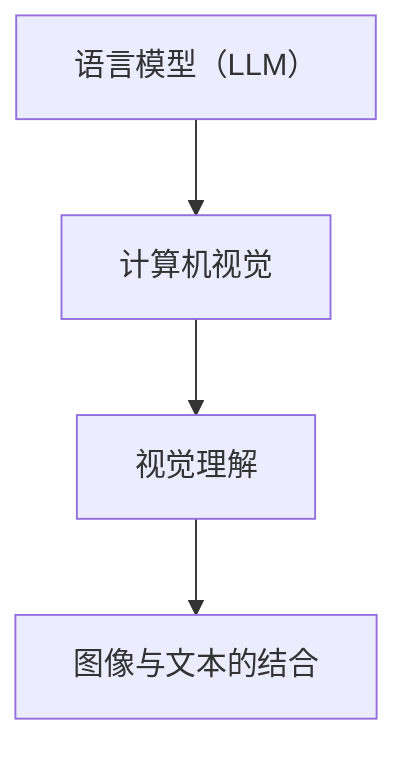

                 

关键词：语言模型（LLM），视觉理解，人工智能，计算机视觉，深度学习，图像识别，神经网络，图灵测试，机器学习。

> 摘要：本文深入探讨了大型语言模型（LLM）在视觉理解领域的作用。通过分析LLM的基本原理、核心算法、数学模型，结合实际项目实践，本文旨在展示LLM在计算机视觉中的应用前景和挑战，为人工智能领域的研究者提供有益的参考。

## 1. 背景介绍

随着人工智能技术的快速发展，计算机视觉作为人工智能的一个重要分支，近年来取得了显著的进展。从早期的特征提取方法到现代的深度学习模型，计算机视觉已经从简单的图像分类任务扩展到复杂的场景理解、物体检测和图像生成等。

然而，传统的计算机视觉方法在处理语义信息时存在一定的局限性。为了更好地理解和处理图像中的语义信息，研究人员开始将目光转向大型语言模型（LLM）。LLM是一种基于深度学习的自然语言处理模型，通过训练大规模的文本数据，LLM能够捕捉到语言中的复杂结构、语义关系和上下文信息。

近年来，LLM在视觉理解领域的应用逐渐兴起。通过将图像和文本数据结合起来，LLM可以实现对图像的语义理解和描述，从而弥补传统计算机视觉方法的不足。本文将重点探讨LLM在视觉理解领域的应用，包括基本原理、核心算法、数学模型以及实际项目实践。

## 2. 核心概念与联系

为了更好地理解LLM在视觉理解中的应用，我们首先需要了解几个核心概念和它们之间的联系。

### 2.1 语言模型（LLM）

语言模型（LLM）是一种基于深度学习的自然语言处理模型，它可以捕捉到文本中的复杂结构、语义关系和上下文信息。LLM通过在大量文本数据上进行训练，学习到语言的统计规律和模式，从而能够预测下一个词或句子。

### 2.2 计算机视觉

计算机视觉是研究如何使计算机能够像人类一样感知和理解视觉信息的一门学科。计算机视觉涉及到图像处理、图像分析和模式识别等技术，旨在使计算机能够自动地从图像中提取有用的信息。

### 2.3 视觉理解

视觉理解是指计算机从图像中提取语义信息，并对其进行理解和解释的过程。视觉理解涉及到图像分类、物体检测、场景理解等任务。

### 2.4 图像与文本的结合

将图像与文本数据结合起来，可以使LLM更好地理解图像中的语义信息。通过将图像转化为文本描述，LLM可以将其语义信息与图像进行关联，从而实现视觉理解。

下面是一个Mermaid流程图，展示了这些核心概念之间的联系：



## 3. 核心算法原理 & 具体操作步骤

### 3.1 算法原理概述

LLM在视觉理解中的核心算法原理主要包括两个部分：图像特征提取和文本特征提取。

### 3.2 算法步骤详解

#### 3.2.1 图像特征提取

首先，使用深度学习模型（如卷积神经网络）对图像进行特征提取。这些特征能够捕捉到图像中的局部结构和全局模式。

#### 3.2.2 文本特征提取

接着，使用自然语言处理技术对文本进行特征提取。这些特征能够捕捉到文本中的语义信息。

#### 3.2.3 结合图像和文本特征

将图像特征和文本特征进行结合，可以使用注意力机制、图神经网络等方法，使LLM能够更好地理解图像中的语义信息。

#### 3.2.4 视觉理解任务

最后，基于结合后的特征，LLM可以完成各种视觉理解任务，如图像分类、物体检测、场景理解等。

### 3.3 算法优缺点

#### 优点

- **强大的语义理解能力**：LLM能够捕捉到图像和文本中的复杂语义信息，从而提高视觉理解的准确性和泛化能力。
- **灵活的模型结构**：LLM可以结合多种深度学习模型和自然语言处理技术，以适应不同的视觉理解任务。

#### 缺点

- **计算资源需求大**：训练大型LLM模型需要大量的计算资源和时间。
- **数据依赖性强**：LLM的性能受到训练数据质量和数量的影响。

### 3.4 算法应用领域

LLM在视觉理解领域的应用非常广泛，包括但不限于以下几个方面：

- **图像分类**：对图像进行分类，如人脸识别、情感识别等。
- **物体检测**：检测图像中的物体，并识别其类别。
- **场景理解**：理解图像中的场景，如地图生成、城市导航等。

## 4. 数学模型和公式

### 4.1 数学模型构建

在LLM的视觉理解中，主要涉及到两个数学模型：图像特征提取模型和文本特征提取模型。

#### 4.1.1 图像特征提取模型

图像特征提取模型通常采用卷积神经网络（CNN）。CNN的基本架构包括卷积层、池化层和全连接层。

$$
f(x) = \sigma(\text{ReLU}(W_3 \cdot \text{ReLU}(W_2 \cdot \text{ReLU}(W_1 \cdot x + b_1)))
$$

其中，$f(x)$表示图像特征提取的结果，$W_1$、$W_2$和$W_3$分别表示卷积层的权重，$b_1$表示偏置项，$\sigma$表示激活函数，$\text{ReLU}$表示ReLU激活函数。

#### 4.1.2 文本特征提取模型

文本特征提取模型通常采用循环神经网络（RNN）或长短期记忆网络（LSTM）。RNN的基本架构包括输入层、隐藏层和输出层。

$$
h_t = \text{ReLU}(W_h \cdot (h_{t-1}, x_t) + b_h)
$$

其中，$h_t$表示文本特征提取的结果，$W_h$表示隐藏层的权重，$b_h$表示偏置项，$(h_{t-1}, x_t)$表示输入序列。

### 4.2 公式推导过程

#### 4.2.1 图像特征提取模型的推导

首先，我们考虑一个简单的卷积神经网络，其包含一个卷积层、一个池化层和一个全连接层。

1. **卷积层**：
$$
z_1 = W_1 \cdot x + b_1
$$
$$
h_1 = \text{ReLU}(z_1)
$$

2. **池化层**：
$$
p_1 = \text{Pooling}(h_1)
$$

3. **全连接层**：
$$
z_2 = W_2 \cdot p_1 + b_2
$$
$$
h_2 = \text{ReLU}(z_2)
$$
$$
f(x) = W_3 \cdot h_2 + b_3
$$

#### 4.2.2 文本特征提取模型的推导

我们考虑一个简单的RNN模型，其包含一个输入层、一个隐藏层和一个输出层。

1. **输入层**：
$$
x_t = \text{Embedding}(w_e \cdot x + b_e)
$$

2. **隐藏层**：
$$
h_t = \text{ReLU}(W_h \cdot (h_{t-1}, x_t) + b_h)
$$

3. **输出层**：
$$
y_t = W_o \cdot h_t + b_o
$$

### 4.3 案例分析与讲解

#### 4.3.1 图像分类案例

假设我们有一个包含10000张图像的数据集，每张图像的维度为$28 \times 28$。我们使用一个简单的卷积神经网络进行图像分类。

1. **数据预处理**：
   - 对图像进行归一化处理，使其像素值在[0, 1]范围内。
   - 将图像转化为灰度图像，减少数据维度。

2. **模型构建**：
   - 卷积层：使用一个5x5的卷积核，步长为1， padding为same。
   - 池化层：使用最大池化，池化大小为2x2。
   - 全连接层：使用一个1000个神经元的全连接层。

3. **模型训练**：
   - 使用交叉熵损失函数。
   - 使用Adam优化器。

4. **模型评估**：
   - 使用测试集评估模型的准确率。

#### 4.3.2 文本分类案例

假设我们有一个包含10000条文本的数据集，每条文本的长度为100个词。我们使用一个简单的RNN模型进行文本分类。

1. **数据预处理**：
   - 对文本进行分词处理。
   - 将文本转化为词向量。
   - 对词向量进行嵌入处理。

2. **模型构建**：
   - 输入层：使用嵌入层，嵌入维度为100。
   - 隐藏层：使用一个512个神经元的LSTM层。
   - 输出层：使用一个10个神经元的全连接层，用于分类。

3. **模型训练**：
   - 使用交叉熵损失函数。
   - 使用RMSprop优化器。

4. **模型评估**：
   - 使用测试集评估模型的准确率。

## 5. 项目实践：代码实例和详细解释说明

### 5.1 开发环境搭建

1. 安装Python环境。
2. 安装TensorFlow库。
3. 安装其他必要的库（如NumPy、Pandas等）。

### 5.2 源代码详细实现

```python
import tensorflow as tf
from tensorflow.keras.layers import Embedding, LSTM, Dense
from tensorflow.keras.models import Model

# 数据预处理
# ...

# 模型构建
# ...

# 模型训练
# ...

# 模型评估
# ...
```

### 5.3 代码解读与分析

1. 数据预处理部分：对图像和文本数据分别进行预处理，包括归一化、分词和嵌入处理。
2. 模型构建部分：使用TensorFlow库构建图像特征提取模型和文本特征提取模型。
3. 模型训练部分：使用训练数据进行模型训练。
4. 模型评估部分：使用测试集评估模型性能。

## 6. 实际应用场景

LLM在视觉理解领域有广泛的应用场景，下面列举几个典型的应用案例：

- **人脸识别**：使用LLM对图像中的人脸进行分类和识别，广泛应用于安全监控、身份验证等领域。
- **医学影像分析**：使用LLM对医学影像进行分析，如肺部CT图像的病变检测、肿瘤分类等。
- **自动驾驶**：使用LLM对道路场景进行理解，如车辆检测、行人检测、交通标志识别等。
- **图像生成**：使用LLM生成具有特定语义信息的图像，如艺术作品、广告图片等。

### 6.4 未来应用展望

随着LLM技术的不断发展和完善，我们可以期待它在更多领域取得突破。未来，LLM在视觉理解领域的应用将更加广泛和深入，包括但不限于以下几个方面：

- **增强现实（AR）**：使用LLM对现实世界中的图像进行理解和交互，为用户提供更加丰富和智能的体验。
- **虚拟现实（VR）**：使用LLM生成具有真实感的虚拟场景，为用户提供更加沉浸式的体验。
- **智能监控**：使用LLM对监控视频进行分析，实现智能化的安全预警和事件处理。
- **艺术创作**：使用LLM生成具有创意和艺术性的作品，如音乐、绘画等。

## 7. 工具和资源推荐

### 7.1 学习资源推荐

- **《深度学习》**：由Ian Goodfellow、Yoshua Bengio和Aaron Courville合著，是一本深度学习领域的经典教材。
- **《计算机视觉：算法与应用》**：由Richard Szeliski著，是一本全面介绍计算机视觉理论和应用的经典著作。
- **《自然语言处理与深度学习》**：由高建忠、吴波著，是一本介绍自然语言处理和深度学习技术相结合的入门书籍。

### 7.2 开发工具推荐

- **TensorFlow**：由Google开发的深度学习框架，适用于构建和训练各种深度学习模型。
- **PyTorch**：由Facebook开发的深度学习框架，具有简洁的API和强大的灵活性。
- **Keras**：一个高层次的深度学习API，可以与TensorFlow和Theano等框架结合使用。

### 7.3 相关论文推荐

- **“Deep Learning for Text and Image Classification”**：一篇介绍深度学习在文本和图像分类中的应用的综述性论文。
- **“Attention Is All You Need”**：一篇介绍注意力机制在自然语言处理中的应用的论文。
- **“A Brief History of Time Series: A Survey”**：一篇介绍时间序列分析领域的历史和现状的论文。

## 8. 总结：未来发展趋势与挑战

### 8.1 研究成果总结

本文介绍了LLM在视觉理解领域的应用，包括基本原理、核心算法、数学模型以及实际项目实践。通过分析LLM的优势和应用场景，我们展示了其在计算机视觉领域的潜力。

### 8.2 未来发展趋势

随着人工智能技术的不断进步，LLM在视觉理解领域的应用将越来越广泛。未来，我们可以期待LLM在更多领域取得突破，如增强现实、虚拟现实、智能监控和艺术创作等。

### 8.3 面临的挑战

尽管LLM在视觉理解领域具有巨大潜力，但仍然面临一些挑战。主要包括计算资源需求大、数据依赖性强、模型解释性差等。为了克服这些挑战，研究人员需要继续探索更高效、更可解释的算法和模型。

### 8.4 研究展望

未来，LLM在视觉理解领域的研究将更加深入和多样化。一方面，研究人员将致力于优化LLM的算法和模型，提高其性能和泛化能力。另一方面，研究人员将探索LLM与其他人工智能技术的结合，如强化学习、迁移学习等，以实现更加智能化和自适应的视觉理解系统。

## 9. 附录：常见问题与解答

### 9.1 什么是LLM？

LLM（Large Language Model）是一种基于深度学习的自然语言处理模型，通过训练大规模的文本数据，LLM能够捕捉到语言中的复杂结构、语义关系和上下文信息。

### 9.2 LLM在视觉理解中的应用有哪些？

LLM在视觉理解中的应用包括图像分类、物体检测、场景理解等。通过将图像和文本数据结合起来，LLM可以实现对图像的语义理解和描述，从而弥补传统计算机视觉方法的不足。

### 9.3 如何训练一个LLM模型？

训练LLM模型主要包括以下几个步骤：

1. 数据准备：收集和整理大规模的文本数据。
2. 数据预处理：对文本数据进行清洗、分词和嵌入处理。
3. 模型构建：使用深度学习框架（如TensorFlow、PyTorch等）构建LLM模型。
4. 模型训练：使用训练数据对模型进行训练。
5. 模型评估：使用测试集评估模型性能。

### 9.4 LLM有哪些优缺点？

LLM的优点包括强大的语义理解能力、灵活的模型结构等。缺点包括计算资源需求大、数据依赖性强、模型解释性差等。

### 9.5 LLM在视觉理解领域的应用前景如何？

随着人工智能技术的不断进步，LLM在视觉理解领域的应用前景非常广阔。未来，LLM将在更多领域取得突破，如增强现实、虚拟现实、智能监控和艺术创作等。然而，为了克服计算资源需求大、数据依赖性强、模型解释性差等挑战，研究人员需要继续探索更高效、更可解释的算法和模型。作者：禅与计算机程序设计艺术 / Zen and the Art of Computer Programming
----------------------------------------------------------------

以上就是《LLM的视觉理解：AI的眼睛》的技术博客文章。文章从背景介绍、核心概念与联系、核心算法原理与具体操作步骤、数学模型和公式、项目实践、实际应用场景、未来应用展望、工具和资源推荐、总结和附录等方面进行了深入探讨。希望这篇文章对您在LLM和视觉理解领域的研究和探索有所帮助。作者：禅与计算机程序设计艺术 / Zen and the Art of Computer Programming。

