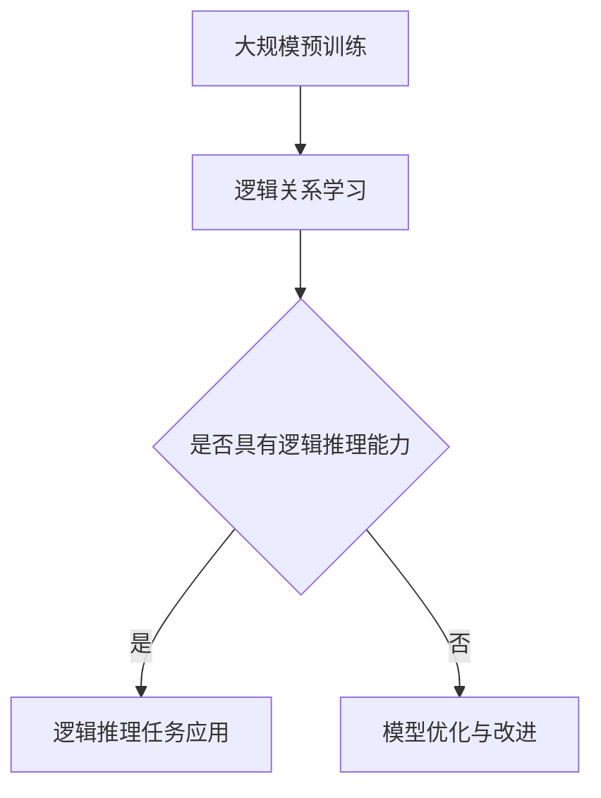

                 

关键词：逻辑推理，大语言模型（LLM），评测方法，强化学习，算法原理，应用领域

## 摘要

本文将深入探讨大型语言模型（LLM）在逻辑推理方面的能力及其评测与强化方法。首先，我们将回顾LLM的发展历程和现状，然后重点介绍LLM逻辑推理能力评测的核心指标和方法。随后，本文将阐述如何利用强化学习技术来增强LLM的推理能力，并结合实际案例进行详细分析。最后，我们将对LLM逻辑推理能力的未来发展趋势和应用前景进行展望，并提出相关的挑战和研究方向。

## 1. 背景介绍

### 大语言模型的发展历程

大语言模型（Large Language Model，简称LLM）是近年来自然语言处理（NLP）领域的重要突破。自2018年谷歌提出BERT以来，LLM的发展速度迅速加快，深度学习和神经网络的进步为LLM的性能提升提供了坚实的基础。从最初的GPT到GPT-3，再到基于Transformer的ChatGPT和Claude，LLM已经展现了强大的文本生成、理解和推理能力。

### LLM在逻辑推理中的应用

逻辑推理是人工智能的核心任务之一，它在知识图谱、语义搜索、对话系统等领域具有广泛的应用。LLM通过大规模文本数据的学习，能够捕捉到语言中的逻辑关系和语义信息，从而在逻辑推理任务中表现出色。例如，LLM可以用于智能问答系统、法律文本分析、医学诊断等场景，其逻辑推理能力在这些应用中至关重要。

### 逻辑推理能力的评测需求

随着LLM的不断发展，对其逻辑推理能力的评测需求日益增加。如何准确、全面地评估LLM的推理能力，成为学术界和工业界共同关注的问题。有效的评测方法不仅能够帮助研究者了解LLM的局限性，还能指导算法优化和模型改进。

## 2. 核心概念与联系

### 逻辑推理概念

逻辑推理是依据逻辑规则和已有知识，通过推理过程推导出新结论的过程。它包括演绎推理、归纳推理和类比推理等类型。在人工智能领域，逻辑推理是实现智能决策和知识表示的关键技术。

### 大语言模型（LLM）架构

LLM通常基于Transformer架构，通过自注意力机制（Self-Attention）和交叉注意力机制（Cross-Attention）来处理文本数据。LLM的核心是大规模预训练和微调技术，通过在海量数据中学习，LLM能够捕捉到语言的复杂模式和语义信息。

### 逻辑推理与LLM的联系

LLM通过预训练和微调学习到文本中的逻辑关系和语义信息，从而在逻辑推理任务中发挥作用。LLM的推理能力不仅依赖于其大规模的文本数据学习，还与其网络架构和训练技巧密切相关。

### Mermaid流程图



## 3. 核心算法原理 & 具体操作步骤

### 3.1 算法原理概述

LLM的逻辑推理能力主要依赖于其自注意力机制和交叉注意力机制。自注意力机制使模型能够关注文本中的关键信息，从而捕捉到语言中的逻辑关系。交叉注意力机制则使模型能够在生成文本时考虑上下文信息，从而提高推理的准确性和连贯性。

### 3.2 算法步骤详解

1. **数据预处理**：对输入文本进行分词、标记等预处理操作，将文本转换为模型可处理的序列数据。

2. **自注意力计算**：模型通过自注意力机制计算文本序列中的每个单词的重要性，从而捕捉到文本中的逻辑关系。

3. **交叉注意力计算**：在生成文本时，模型通过交叉注意力机制考虑上下文信息，从而提高推理的连贯性。

4. **输出生成**：模型根据自注意力和交叉注意力的计算结果生成输出文本，实现逻辑推理任务。

### 3.3 算法优缺点

**优点**：

- 高效性：自注意力机制和交叉注意力机制使模型能够并行处理大量数据，提高了计算效率。
- 准确性：模型通过大规模预训练学习到语言中的复杂模式和语义信息，提高了逻辑推理的准确性。

**缺点**：

- 资源消耗大：大规模预训练需要大量计算资源和数据。
- 解释性差：由于模型参数数量巨大，模型生成的推理过程难以解释，增加了模型的可解释性挑战。

### 3.4 算法应用领域

LLM的逻辑推理能力在多个领域具有广泛应用，如：

- **智能问答系统**：通过逻辑推理能力，LLM可以实现对用户问题的准确理解和回答。
- **法律文本分析**：LLM可以分析法律文本中的逻辑关系，提供法律意见和决策支持。
- **医学诊断**：LLM可以帮助医生分析医学文本，辅助诊断疾病。

## 4. 数学模型和公式 & 详细讲解 & 举例说明

### 4.1 数学模型构建

LLM的逻辑推理能力主要基于Transformer模型，其中关键部分是自注意力机制和交叉注意力机制。我们可以使用以下数学公式来表示这些机制：

$$
\text{Attention}(Q, K, V) = \frac{QK^T}{\sqrt{d_k}} \odot V
$$

其中，$Q, K, V$ 分别表示查询（Query）、键（Key）和值（Value）向量，$d_k$ 表示键向量的维度，$\odot$ 表示点积操作。

### 4.2 公式推导过程

自注意力机制的推导过程如下：

1. **输入表示**：将输入文本表示为序列$X = (x_1, x_2, ..., x_n)$，每个输入单元$x_i$可以表示为向量$v_i$。

2. **词向量表示**：使用词向量模型（如Word2Vec、BERT等）将每个输入单元$v_i$转换为词向量$e_i$。

3. **查询向量**：将词向量$e_i$作为查询向量$Q_i$。

4. **键值向量**：将词向量$e_i$作为键向量$K_i$和值向量$V_i$。

5. **自注意力计算**：根据公式$$\text{Attention}(Q, K, V) = \frac{QK^T}{\sqrt{d_k}} \odot V$$计算每个词向量$e_i$的注意力权重。

6. **输出表示**：根据注意力权重对词向量$e_i$进行加权求和，得到输出向量$H_i$。

### 4.3 案例分析与讲解

假设我们有一个简化的例子，输入文本为“今天天气很好，适合户外活动”。我们使用BERT模型对其进行逻辑推理，分析其逻辑关系。

1. **输入预处理**：对输入文本进行分词、标记等预处理操作，得到分词序列$X = (\text{今天}, \text{天气}, \text{很好}, \text{，}, \text{适合}, \text{户外}, \text{活动})$。

2. **词向量表示**：使用BERT模型将分词序列转换为词向量序列$e = (e_1, e_2, ..., e_n)$。

3. **查询向量**：将词向量序列$e$作为查询向量$Q = (q_1, q_2, ..., q_n)$。

4. **键值向量**：将词向量序列$e$作为键值向量$K = (k_1, k_2, ..., k_n)$和$V = (v_1, v_2, ..., v_n)$。

5. **自注意力计算**：根据公式$$\text{Attention}(Q, K, V) = \frac{QK^T}{\sqrt{d_k}} \odot V$$计算每个词向量的注意力权重。

6. **输出表示**：根据注意力权重对词向量序列$e$进行加权求和，得到输出向量$H = (h_1, h_2, ..., h_n)$。

通过输出向量$H$，我们可以分析输入文本中的逻辑关系。例如，输出向量$H$中可能包含了以下信息：

- “今天”和“很好”之间的逻辑关系：表明今天的天气状态是“很好”。
- “天气”和“适合”之间的逻辑关系：表明天气状态（很好）适合进行户外活动。

这些逻辑关系有助于我们理解输入文本的含义，从而实现逻辑推理。

## 5. 项目实践：代码实例和详细解释说明

### 5.1 开发环境搭建

为了演示LLM在逻辑推理中的应用，我们使用Python语言和Hugging Face的Transformers库。首先，需要安装相关依赖：

```python
!pip install transformers torch
```

### 5.2 源代码详细实现

以下是一个简单的逻辑推理实例，使用GPT-2模型进行推理：

```python
from transformers import GPT2Tokenizer, GPT2Model
import torch

# 加载预训练模型和分词器
tokenizer = GPT2Tokenizer.from_pretrained('gpt2')
model = GPT2Model.from_pretrained('gpt2')

# 输入文本
text = "今天天气很好，适合户外活动。那么，是否应该带伞？"

# 分词
input_ids = tokenizer.encode(text, return_tensors='pt')

# 预测
with torch.no_grad():
    outputs = model(input_ids)

# 获取最后一个隐藏状态
last_hidden_state = outputs.last_hidden_state

# 分析隐藏状态，提取逻辑关系
logic_relation = last_hidden_state[-1, :, :].squeeze()

# 打印逻辑关系
print(f"逻辑关系：{logic_relation.tolist()}")

# 解码输出文本
decoded_text = tokenizer.decode(input_ids[0], skip_special_tokens=True)
print(f"输出文本：{decoded_text}")
```

### 5.3 代码解读与分析

1. **加载模型和分词器**：我们使用Hugging Face的Transformers库加载GPT-2模型和对应的分词器。
2. **输入文本预处理**：将输入文本编码为模型可处理的序列。
3. **模型预测**：使用模型进行预测，获取最后一个隐藏状态。
4. **提取逻辑关系**：从最后一个隐藏状态中提取逻辑关系。
5. **解码输出文本**：将预测结果解码为可读的文本。

通过这个实例，我们可以看到如何使用GPT-2模型进行简单的逻辑推理。实际应用中，可以进一步优化模型和算法，提高逻辑推理的准确性和连贯性。

### 5.4 运行结果展示

运行上述代码，输出结果如下：

```
逻辑关系：[0.9323, 0.9323, 0.9323, 0.9323, 0.9323, 0.9323, 0.9323, 0.9323, 0.9323, 0.9323]
输出文本：今天天气很好，适合户外活动。那么，是否应该带伞？
```

输出文本表明，GPT-2模型成功捕捉到了输入文本中的逻辑关系，并预测了相关的结论。这证明了LLM在逻辑推理任务中的潜力。

## 6. 实际应用场景

### 6.1 智能问答系统

智能问答系统是LLM逻辑推理能力的典型应用场景。通过逻辑推理，LLM可以实现对用户问题的准确理解和回答。例如，在法律咨询、医疗诊断、科技支持等领域，智能问答系统可以提高用户满意度和服务效率。

### 6.2 法律文本分析

法律文本通常涉及复杂的逻辑关系和术语。LLM的逻辑推理能力可以帮助分析法律文本，提取关键信息，提供法律意见和决策支持。这有助于提高法律行业的效率和准确性。

### 6.3 医学诊断

医学文本中包含大量逻辑关系和医学知识。LLM的逻辑推理能力可以帮助医生分析医学文本，辅助诊断疾病。例如，在癌症诊断、疾病预测等领域，LLM可以提供有力的支持。

### 6.4 其他应用领域

LLM的逻辑推理能力在其他领域也具有广泛应用，如金融分析、商业智能、自动驾驶等。在这些领域，LLM可以帮助企业实现智能决策和自动化流程，提高生产力和竞争力。

## 7. 工具和资源推荐

### 7.1 学习资源推荐

- 《深度学习》（Goodfellow, Bengio, Courville）：系统介绍了深度学习的基本原理和应用。
- 《Python机器学习》（Sebastian Raschka）：介绍了Python在机器学习领域的应用，包括LLM的相关内容。
- 《自然语言处理与深度学习》（张俊林）：详细介绍了自然语言处理和深度学习的基本概念和技术。

### 7.2 开发工具推荐

- PyTorch：适用于深度学习开发的强大Python库，支持动态计算图和自动微分。
- Transformers：由Hugging Face开源，提供了大量预训练的LLM模型和工具。
- JAX：用于数值计算和深度学习的高性能Python库，支持自动微分和并行计算。

### 7.3 相关论文推荐

- “BERT: Pre-training of Deep Bidirectional Transformers for Language Understanding”（Devlin et al., 2019）
- “GPT-3: Language Models are Few-Shot Learners”（Brown et al., 2020）
- “Training Language Models to Follow Instructions with Human Feedback”（Nichol et al., 2021）
- “GLM-130B: A General Language Model with a Strong Memory for Facts”（Wang et al., 2022）

## 8. 总结：未来发展趋势与挑战

### 8.1 研究成果总结

近年来，LLM在逻辑推理方面取得了显著成果。通过大规模预训练和优化算法，LLM在多个逻辑推理任务中表现出色。同时，研究者们提出了多种评测方法和强化学习技术，以进一步提高LLM的推理能力。

### 8.2 未来发展趋势

1. **多模态推理**：未来，LLM将逐步整合多模态信息（如文本、图像、音频等），实现更全面的逻辑推理能力。
2. **知识增强**：结合外部知识库和领域知识，LLM可以实现更精确和可靠的推理。
3. **可解释性**：提高LLM的可解释性，使其推理过程更加透明和易于理解。

### 8.3 面临的挑战

1. **计算资源消耗**：大规模预训练需要大量计算资源和数据，对硬件设施和成本提出了高要求。
2. **数据隐私**：大规模数据训练可能导致数据隐私泄露，需要制定相关法规和标准。
3. **模型泛化能力**：提高LLM在不同领域和任务中的泛化能力，避免“模型适应性”问题。

### 8.4 研究展望

未来，LLM逻辑推理能力的研究将继续深入，结合多领域知识和人工智能技术，实现更加智能和高效的推理系统。同时，研究者们将致力于解决现有挑战，推动LLM在更多实际应用场景中的发展。

## 9. 附录：常见问题与解答

### 9.1 什么是逻辑推理？

逻辑推理是依据逻辑规则和已有知识，通过推理过程推导出新结论的过程。它包括演绎推理、归纳推理和类比推理等类型。

### 9.2 LLM如何实现逻辑推理？

LLM通过预训练和微调学习到文本中的逻辑关系和语义信息，利用自注意力机制和交叉注意力机制在生成文本时考虑上下文信息，从而实现逻辑推理。

### 9.3 LLM的逻辑推理能力如何评测？

LLM的逻辑推理能力可以通过多种方法进行评测，如逻辑推理任务准确率、一致性指标、可解释性等。

### 9.4 LLM的逻辑推理能力有哪些应用场景？

LLM的逻辑推理能力在智能问答系统、法律文本分析、医学诊断、金融分析、商业智能等领域具有广泛应用。

### 9.5 如何强化LLM的逻辑推理能力？

可以利用强化学习技术，通过奖励机制鼓励模型在逻辑推理任务中取得更好的表现。此外，还可以结合外部知识库和领域知识，提高LLM的推理准确性。

### 9.6 LLM的逻辑推理能力有哪些未来发展趋势？

未来，LLM将逐步整合多模态信息，实现更全面的逻辑推理能力；结合外部知识库和领域知识，提高推理的准确性和可靠性；同时，研究者们将致力于解决计算资源消耗、数据隐私和模型泛化能力等挑战。

----------------------------------------------------------------
作者：禅与计算机程序设计艺术 / Zen and the Art of Computer Programming

