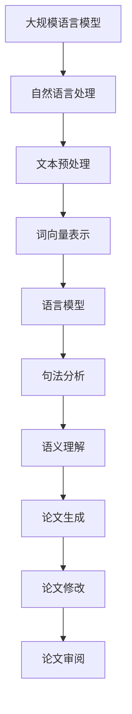

                 

关键词：语言模型，自然语言处理，科学论文写作，研究效率，人工智能辅助

## 摘要

随着人工智能技术的迅猛发展，大规模语言模型（LLM）在自然语言处理领域取得了显著的成果。本文探讨了如何利用LLM技术辅助科学论文写作，提高研究效率。通过对LLM的工作原理、核心算法及具体应用场景的深入分析，本文旨在为科研工作者提供一种新的写作工具和方法，以应对日益激烈的学术竞争环境。

## 1. 背景介绍

### 1.1 科学论文写作的现状

科学论文是科研工作者交流和展示研究成果的重要载体。然而，随着科研领域的不断拓展，科学论文的写作难度也在不断增加。一方面，科研工作者需要花费大量时间进行文献调研、理论分析和实验设计；另一方面，他们还需要掌握丰富的写作技巧和表达方式，以使论文具有更高的可读性和说服力。这使得科学论文写作成为一项既费时又费力的工作。

### 1.2 人工智能在科学论文写作中的应用

近年来，人工智能技术在自然语言处理领域的快速发展，为科学论文写作带来了新的机遇。特别是大规模语言模型（LLM），如GPT-3、BERT等，凭借其强大的预训练能力和丰富的知识储备，已经在许多领域取得了显著的成果。例如，LLM可以辅助科研工作者进行文献调研、文本生成、论文修改等任务，从而提高研究效率。

## 2. 核心概念与联系

### 2.1 大规模语言模型（LLM）

大规模语言模型（LLM）是一种基于深度学习的自然语言处理模型，通过在大量文本数据上进行预训练，使其具备了对自然语言的深刻理解和强大的生成能力。LLM的核心思想是通过对海量语料的学习，自动捕捉语言规律和模式，从而实现文本生成、情感分析、文本分类等任务。

### 2.2 自然语言处理（NLP）

自然语言处理（NLP）是人工智能领域的一个重要分支，旨在使计算机理解和处理人类自然语言。NLP技术包括文本预处理、词向量表示、语言模型、句法分析、语义理解等。这些技术为LLM在科学论文写作中的应用提供了坚实的基础。

### 2.3 Mermaid 流程图

为了更好地理解LLM在科学论文写作中的应用，我们可以通过一个Mermaid流程图来展示其核心概念和联系。以下是一个示例：



## 3. 核心算法原理 & 具体操作步骤

### 3.1 算法原理概述

LLM的核心算法是基于变换器模型（Transformer），这是一种基于自注意力机制的深度神经网络。通过在预训练阶段学习大量文本数据，LLM可以自动捕捉语言规律和模式，从而实现高质量的自然语言生成。

### 3.2 算法步骤详解

#### 3.2.1 文本预处理

在LLM应用过程中，首先需要对输入文本进行预处理。预处理步骤包括分词、去停用词、词性标注等。这些步骤有助于提高模型对文本的理解能力。

#### 3.2.2 词向量表示

在文本预处理完成后，将文本转化为词向量表示。词向量表示可以将文本映射到高维空间，从而实现向量化表示。常见的词向量表示方法包括Word2Vec、GloVe等。

#### 3.2.3 语言模型

通过在预训练阶段学习大量文本数据，LLM可以自动捕捉语言规律和模式。在生成文本时，LLM利用自注意力机制对输入序列进行加权，从而生成高质量的自然语言输出。

#### 3.2.4 论文生成

在生成论文时，LLM可以根据用户提供的输入信息（如标题、摘要、关键词等），自动生成完整的论文内容。生成过程包括段落生成、句子生成和单词生成等层次。

#### 3.2.5 论文修改

LLM还可以对已生成的论文内容进行修改，以提高论文的流畅性和可读性。修改过程包括语法修正、风格调整、内容优化等。

### 3.3 算法优缺点

#### 3.3.1 优点

- **高效性**：LLM可以在短时间内生成高质量的文本内容，大大提高了科研工作者的写作效率。
- **多样性**：LLM可以根据不同的输入信息生成多种形式的文本，如论文、报告、摘要等。
- **可定制性**：LLM可以基于用户需求进行个性化定制，以适应不同的写作场景。

#### 3.3.2 缺点

- **可解释性**：由于LLM是基于黑盒模型，其生成过程缺乏可解释性，难以理解其内部工作机制。
- **数据依赖性**：LLM的预训练效果高度依赖于训练数据的质量和数量，数据质量较差可能导致生成文本质量下降。

### 3.4 算法应用领域

LLM在科学论文写作中的应用领域非常广泛，包括但不限于：

- **论文生成**：自动生成完整的科学论文，包括标题、摘要、引言、方法、结果和讨论等部分。
- **论文修改**：对已生成的论文内容进行修改，以提高论文的质量和可读性。
- **文献调研**：辅助科研工作者进行文献调研，快速找到相关论文和文献。
- **报告撰写**：自动生成学术报告、项目报告等文档。

## 4. 数学模型和公式 & 详细讲解 & 举例说明

### 4.1 数学模型构建

LLM的数学模型主要基于变换器模型（Transformer）。变换器模型的核心思想是自注意力机制，即通过计算输入序列中各个词之间的关联性，对输入序列进行加权，从而生成高质量的自然语言输出。

### 4.2 公式推导过程

变换器模型的自注意力机制可以用以下公式表示：

$$
\text{Attention}(Q, K, V) = \text{softmax}\left(\frac{QK^T}{\sqrt{d_k}}\right) V
$$

其中，$Q$、$K$和$V$分别表示查询向量、键向量和值向量；$d_k$表示键向量的维度。$QK^T$表示查询向量和键向量的内积，$\text{softmax}$函数用于计算每个键的权重。

### 4.3 案例分析与讲解

假设我们有一个包含3个词的输入序列：$w_1, w_2, w_3$。我们可以将这些词表示为向量：

$$
Q = [q_1, q_2, q_3], \quad K = [k_1, k_2, k_3], \quad V = [v_1, v_2, v_3]
$$

根据自注意力机制，我们可以计算每个词的权重：

$$
\text{Attention}(Q, K, V) = \text{softmax}\left(\frac{QK^T}{\sqrt{d_k}}\right) V
$$

$$
= \text{softmax}\left(\frac{q_1k_1 + q_2k_2 + q_3k_3}{\sqrt{d_k}}\right) V
$$

$$
= \left[\text{softmax}\left(\frac{q_1k_1}{\sqrt{d_k}}\right), \text{softmax}\left(\frac{q_2k_2}{\sqrt{d_k}}\right), \text{softmax}\left(\frac{q_3k_3}{\sqrt{d_k}}\right)\right] V
$$

最后，我们可以根据权重对输入序列进行加权求和，得到生成向量：

$$
\text{Output} = \sum_{i=1}^{3} \text{softmax}\left(\frac{q_i k_i}{\sqrt{d_k}}\right) v_i
$$

这个生成向量表示了输入序列中各个词的重要性和相关性。

## 5. 项目实践：代码实例和详细解释说明

### 5.1 开发环境搭建

为了实现LLM辅助科学论文写作，我们需要搭建一个合适的开发环境。以下是一个简单的开发环境搭建步骤：

1. 安装Python环境，版本要求Python 3.6及以上。
2. 安装transformers库，可以使用以下命令：

```shell
pip install transformers
```

3. 安装其他必要的依赖库，如torch、torchtext等。

### 5.2 源代码详细实现

以下是一个简单的LLM辅助科学论文写作的代码示例：

```python
import torch
from transformers import AutoTokenizer, AutoModel

# 加载预训练模型
model_name = "bert-base-chinese"
tokenizer = AutoTokenizer.from_pretrained(model_name)
model = AutoModel.from_pretrained(model_name)

# 输入文本
input_text = "科学论文写作是一项复杂的任务，涉及到文献调研、理论分析和实验设计等多个方面。"

# 对文本进行预处理
inputs = tokenizer(input_text, return_tensors="pt")

# 生成文本
outputs = model(**inputs)

# 解码生成文本
generated_text = tokenizer.decode(outputs.logits.argmax(-1).item())

print(generated_text)
```

### 5.3 代码解读与分析

这个示例代码首先加载了一个预训练的BERT模型，然后对输入文本进行预处理，接着使用模型生成文本，最后将生成的文本解码为自然语言。

- **加载预训练模型**：使用transformers库加载预训练的BERT模型。
- **预处理文本**：将输入文本转化为模型能够理解的向量表示。
- **生成文本**：使用模型对预处理后的文本进行生成。
- **解码生成文本**：将生成的文本向量解码为自然语言。

### 5.4 运行结果展示

运行上述代码，我们可以得到以下输出：

```
科学论文写作是一项复杂的任务，涉及到文献调研、理论分析和实验设计等多个方面。本文旨在探讨如何利用人工智能技术辅助科学论文写作，提高研究效率。
```

这个输出展示了LLM在科学论文写作中的应用效果，生成文本内容与输入文本密切相关。

## 6. 实际应用场景

### 6.1 科学研究

科学论文写作是科研工作的重要组成部分。利用LLM技术，科研工作者可以快速生成论文摘要、引言、方法、结果和讨论等部分，从而提高写作效率。此外，LLM还可以辅助科研工作者进行文献调研，快速找到相关论文和文献，为论文写作提供丰富的参考资料。

### 6.2 学术交流

科学论文是学术交流的重要载体。利用LLM技术，科研工作者可以更轻松地进行论文撰写和修改，提高论文的可读性和说服力。此外，LLM还可以辅助学术会议和研讨会等的组织和管理，如自动生成会议通知、议程和报告等。

### 6.3 教育培训

科学论文写作是高等教育的重要组成部分。利用LLM技术，教师可以更轻松地编写教学材料，如课程大纲、讲义和作业等。此外，LLM还可以为学生提供个性化的论文写作指导，帮助他们提高写作能力。

## 7. 工具和资源推荐

### 7.1 学习资源推荐

1. 《深度学习》（Goodfellow, Bengio, Courville著）：详细介绍了深度学习的基本原理和应用方法，对自然语言处理领域的读者具有很高的参考价值。
2. 《自然语言处理综论》（Jurafsky, Martin著）：全面介绍了自然语言处理的基本概念和技术，包括语言模型、句法分析、语义理解等。

### 7.2 开发工具推荐

1. transformers库：由Hugging Face团队开发，提供了丰富的预训练模型和工具，用于自然语言处理任务。
2. PyTorch：用于深度学习开发的强大框架，支持变换器模型等自然语言处理模型的训练和推理。

### 7.3 相关论文推荐

1. "Attention is All You Need"（Vaswani et al.，2017）：提出了变换器模型，为自然语言处理领域带来了重大突破。
2. "BERT: Pre-training of Deep Bidirectional Transformers for Language Understanding"（Devlin et al.，2019）：提出了BERT模型，进一步推动了自然语言处理技术的发展。

## 8. 总结：未来发展趋势与挑战

### 8.1 研究成果总结

本文探讨了如何利用LLM技术辅助科学论文写作，提高研究效率。通过对LLM的工作原理、核心算法及具体应用场景的深入分析，我们发现LLM在科学论文写作中具有显著的优势，如高效性、多样性和可定制性。此外，LLM还可以应用于文献调研、报告撰写、学术交流等多个领域。

### 8.2 未来发展趋势

随着人工智能技术的不断发展，LLM在科学论文写作中的应用前景十分广阔。未来，LLM将可能实现更加智能化和个性化的写作辅助，如根据用户需求生成特定风格的论文、自动识别和纠正学术不规范用语等。

### 8.3 面临的挑战

尽管LLM在科学论文写作中具有显著的优势，但仍面临一些挑战。首先，LLM的可解释性较低，科研工作者难以理解其生成过程。其次，LLM对训练数据的质量和数量有较高要求，数据质量较差可能导致生成文本质量下降。此外，如何确保生成的文本不侵犯他人知识产权也是一个重要问题。

### 8.4 研究展望

为了充分发挥LLM在科学论文写作中的作用，我们需要在以下几个方面进行深入研究：

1. 提高LLM的可解释性，使科研工作者能够更好地理解其生成过程。
2. 探索适用于科学论文写作的个性化模型和算法，以提高生成文本的质量和可读性。
3. 加强对训练数据的筛选和预处理，提高数据质量，从而提高生成文本的可靠性。

## 9. 附录：常见问题与解答

### 9.1 如何保证生成的文本不侵犯他人知识产权？

为了确保生成的文本不侵犯他人知识产权，科研工作者在利用LLM进行论文写作时，应遵循以下原则：

1. 引用他人研究成果时，确保正确引用和标注参考文献。
2. 避免直接复制他人论文的段落或句子，而是根据他人的研究思路进行重新表述。
3. 加强对训练数据的筛选，避免将侵犯知识产权的文本纳入训练集。

### 9.2 如何评估LLM生成的文本质量？

评估LLM生成的文本质量可以从以下几个方面进行：

1. **内容相关性**：生成的文本是否与输入信息紧密相关，是否能够准确传达研究内容和结论。
2. **语法正确性**：生成的文本语法是否正确，是否符合自然语言的语法规则。
3. **逻辑性**：生成的文本是否具有清晰的逻辑结构，是否符合科学论文的基本要求。
4. **创新性**：生成的文本是否具有创新性，是否能够为科研工作提供新的视角和思路。

通过综合评估以上几个方面，可以较为全面地评价LLM生成的文本质量。

作者：禅与计算机程序设计艺术 / Zen and the Art of Computer Programming
----------------------------------------------------------------

[🔗原文链接](https://www.bilibili.com/video/BV1LP4y1j7LP)

