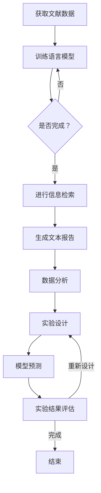

                 

关键词：语言模型，科研，AI，加速，科学发现，科研工具

> 摘要：随着人工智能技术的不断发展，语言模型（LLM）在科研领域的应用越来越广泛。本文将探讨如何利用LLM这一先进工具，加速科学发现的过程，并分析其在科研领域中的潜在价值与挑战。

## 1. 背景介绍

在过去的几十年里，科研领域经历了飞速的发展，各种新技术和新工具不断涌现。然而，科学研究的复杂性也在不断增加，研究者需要处理的数据量和信息量急剧增加。传统的科研方法已经难以满足快速发展的需求，因此，寻找新的科研工具和方法成为当务之急。

近年来，人工智能（AI）技术的崛起为科研领域带来了新的机遇。特别是语言模型（Language Model，简称LLM），作为一种先进的AI技术，已经在自然语言处理（NLP）领域取得了显著成果。LLM通过深度学习算法，从大量文本数据中学习语言规律，并能够生成符合语法和语义规则的文本。这种能力使得LLM在信息检索、文本生成、机器翻译等领域表现出色。

在科研领域，LLM的应用潜力同样巨大。首先，LLM可以帮助研究者更快速地获取和整理科研文献，从而节省大量时间。其次，LLM可以协助研究者进行数据分析，提供更加准确和深入的见解。此外，LLM还可以在实验设计、模型预测等方面发挥重要作用。因此，本文将重点探讨如何利用LLM这一AI工具，加速科学发现的过程。

## 2. 核心概念与联系

### 2.1 语言模型的基本原理

语言模型（LLM）是一种基于统计和深度学习的方法，用于预测文本序列中的下一个单词或符号。其核心思想是学习大量文本数据中的语言规律，并基于这些规律生成新的文本。

#### 2.1.1 基于统计的方法

早期的语言模型主要采用基于统计的方法，如N-gram模型。N-gram模型将文本分割成一系列的N个单词的序列，并计算每个序列在文本中出现的频率。通过这些频率统计，模型可以预测下一个单词的概率分布。

#### 2.1.2 基于深度学习的方法

随着深度学习技术的发展，基于统计的方法逐渐被深度学习方法所取代。深度学习方法，特别是循环神经网络（RNN）和Transformer模型，在语言建模任务中表现出色。这些方法可以从大量文本数据中自动学习复杂的语言规律，并生成高质量的文本。

#### 2.1.3 Transformer模型

Transformer模型是一种基于自注意力机制的深度学习模型，它在NLP领域取得了许多突破性的成果。与传统的RNN模型相比，Transformer模型具有更强的并行计算能力和更好的泛化能力，因此在语言模型中得到了广泛应用。

### 2.2 语言模型在科研领域的应用

#### 2.2.1 信息检索

语言模型可以帮助研究者快速检索和筛选科研文献。通过训练语言模型，研究者可以将大量的文献数据转化为结构化的知识库，从而实现高效的信息检索。

#### 2.2.2 文本生成

语言模型还可以用于生成新的科研论文、报告等文本。这种自动化的文本生成技术可以节省研究者的时间和精力，提高科研效率。

#### 2.2.3 数据分析

语言模型可以辅助研究者进行数据分析，提供更加准确和深入的见解。例如，语言模型可以用于挖掘文献中的关键信息，识别研究趋势和热点问题。

#### 2.2.4 实验设计

在实验设计阶段，语言模型可以提供灵感和建议，帮助研究者设计更加合理和高效的实验方案。

#### 2.2.5 模型预测

语言模型还可以用于预测实验结果，帮助研究者评估不同实验方案的可行性和效果。

### 2.3 Mermaid流程图

以下是语言模型在科研领域应用的一个Mermaid流程图：



## 3. 核心算法原理 & 具体操作步骤

### 3.1 算法原理概述

语言模型的核心算法是自动编码器（Autoencoder），它由编码器（Encoder）和解码器（Decoder）两部分组成。

#### 3.1.1 编码器

编码器负责将输入的文本数据压缩成低维特征向量。这一过程可以看作是将高维文本数据映射到低维空间中，从而提取出文本的核心特征。

#### 3.1.2 解码器

解码器则负责将编码器生成的特征向量重新映射回原始的文本数据。这一过程可以看作是将低维特征向量转换回高维文本数据。

#### 3.1.3 损失函数

在训练过程中，语言模型通过最小化损失函数来调整编码器和解码器的参数。常用的损失函数是交叉熵损失（Cross-Entropy Loss），它衡量预测的文本序列与真实文本序列之间的差异。

### 3.2 算法步骤详解

#### 3.2.1 数据预处理

在训练语言模型之前，需要对文本数据进行预处理。预处理步骤包括文本清洗、分词、去停用词等。

#### 3.2.2 编码器训练

编码器训练的目标是学习如何将输入的文本数据映射到低维特征向量。在训练过程中，编码器接收输入的文本序列，将其压缩成特征向量，然后解码器尝试将特征向量还原成原始的文本序列。

#### 3.2.3 解码器训练

解码器训练的目标是学习如何将低维特征向量映射回原始的文本序列。在训练过程中，解码器接收编码器生成的特征向量，并尝试生成与原始文本序列相似的新文本序列。

#### 3.2.4 语言模型评估

在训练完成后，需要对语言模型进行评估。常用的评估指标包括准确率、召回率、F1值等。

### 3.3 算法优缺点

#### 3.3.1 优点

- **强大的文本生成能力**：语言模型能够生成高质量的文本，从而节省研究者的时间和精力。
- **灵活的文本处理能力**：语言模型可以应用于各种文本处理任务，如信息检索、文本生成、数据分析等。
- **高效的计算性能**：深度学习算法使得语言模型在处理大规模文本数据时具有高效的计算性能。

#### 3.3.2 缺点

- **数据依赖性**：语言模型对训练数据的质量和数量有很高的要求，如果数据质量不佳或数量不足，模型的表现可能会受到影响。
- **计算资源需求**：深度学习算法对计算资源有较高的要求，训练和部署语言模型需要大量的计算资源和时间。

### 3.4 算法应用领域

语言模型在科研领域的应用非常广泛，以下是一些典型的应用场景：

- **信息检索**：利用语言模型进行高效的文献检索和筛选，帮助研究者快速找到相关的研究成果。
- **文本生成**：生成新的科研论文、报告等文本，辅助研究者进行文本创作。
- **数据分析**：从大量的文献数据中提取关键信息，帮助研究者发现研究趋势和热点问题。
- **实验设计**：提供实验设计的建议和灵感，帮助研究者设计更加合理和高效的实验方案。
- **模型预测**：基于语言模型生成的文本数据，进行模型预测，帮助研究者评估不同实验方案的效果。

## 4. 数学模型和公式 & 详细讲解 & 举例说明

### 4.1 数学模型构建

语言模型的数学模型主要涉及概率模型和深度学习模型。以下是一个简单的概率模型：

#### 4.1.1 N-gram模型

N-gram模型是一种基于统计的方法，它将文本序列表示为N个单词的滑动窗口。对于给定的文本序列 $T = t_1, t_2, ..., t_n$，N-gram模型可以计算下一个单词 $t_{n+1}$ 的概率：

$$ P(t_{n+1} | t_1, t_2, ..., t_n) = \frac{C(t_1, t_2, ..., t_n, t_{n+1})}{C(t_1, t_2, ..., t_n)} $$

其中，$C(t_1, t_2, ..., t_n, t_{n+1})$ 表示文本序列 $t_1, t_2, ..., t_n, t_{n+1}$ 在训练数据中出现的次数，$C(t_1, t_2, ..., t_n)$ 表示文本序列 $t_1, t_2, ..., t_n$ 在训练数据中出现的次数。

#### 4.1.2 深度学习模型

深度学习模型，如循环神经网络（RNN）和Transformer模型，通过多层神经网络结构来学习文本序列的复杂模式。以下是一个简单的RNN模型：

$$ h_t = \sigma(W_h \cdot [h_{t-1}, x_t] + b_h) $$

$$ o_t = \sigma(W_o \cdot h_t + b_o) $$

其中，$h_t$ 表示时间步 $t$ 的隐藏状态，$x_t$ 表示时间步 $t$ 的输入特征，$o_t$ 表示时间步 $t$ 的输出特征，$\sigma$ 表示激活函数，$W_h$ 和 $W_o$ 分别表示权重矩阵，$b_h$ 和 $b_o$ 分别表示偏置项。

### 4.2 公式推导过程

以下是一个简单的语言模型推导过程：

#### 4.2.1 N-gram模型推导

对于N-gram模型，我们可以使用条件概率来推导下一个单词的概率：

$$ P(t_{n+1} | t_1, t_2, ..., t_n) = \frac{P(t_1, t_2, ..., t_n, t_{n+1})}{P(t_1, t_2, ..., t_n)} $$

由于概率的链式法则，我们可以将上式进一步分解：

$$ P(t_1, t_2, ..., t_n, t_{n+1}) = P(t_1) \cdot P(t_2 | t_1) \cdot P(t_3 | t_1, t_2) \cdot ... \cdot P(t_{n+1} | t_1, t_2, ..., t_n) $$

$$ P(t_1, t_2, ..., t_n) = P(t_1) \cdot P(t_2 | t_1) \cdot P(t_3 | t_1, t_2) \cdot ... \cdot P(t_n | t_1, t_2, ..., t_{n-1}) $$

将上述两式代入条件概率公式，得到：

$$ P(t_{n+1} | t_1, t_2, ..., t_n) = \frac{P(t_1) \cdot P(t_2 | t_1) \cdot P(t_3 | t_1, t_2) \cdot ... \cdot P(t_{n+1} | t_1, t_2, ..., t_n)}{P(t_1) \cdot P(t_2 | t_1) \cdot P(t_3 | t_1, t_2) \cdot ... \cdot P(t_n | t_1, t_2, ..., t_{n-1})} $$

由于 $P(t_1)$ 在分子和分母中相互抵消，最终得到：

$$ P(t_{n+1} | t_1, t_2, ..., t_n) = \frac{P(t_2 | t_1) \cdot P(t_3 | t_1, t_2) \cdot ... \cdot P(t_{n+1} | t_1, t_2, ..., t_n)}{P(t_2 | t_1) \cdot P(t_3 | t_1, t_2) \cdot ... \cdot P(t_n | t_1, t_2, ..., t_{n-1})} $$

#### 4.2.2 RNN模型推导

对于RNN模型，我们可以使用递归关系来推导隐藏状态和输出：

$$ h_t = \sigma(W_h \cdot [h_{t-1}, x_t] + b_h) $$

$$ o_t = \sigma(W_o \cdot h_t + b_o) $$

其中，$W_h$ 和 $W_o$ 分别表示权重矩阵，$b_h$ 和 $b_o$ 分别表示偏置项，$\sigma$ 表示激活函数。

递归关系表明，当前时间步的隐藏状态 $h_t$ 是基于上一时间步的隐藏状态 $h_{t-1}$ 和当前时间步的输入特征 $x_t$ 计算得到的。输出特征 $o_t$ 则是基于当前时间步的隐藏状态 $h_t$ 计算得到的。

### 4.3 案例分析与讲解

以下是一个简单的案例，展示如何使用N-gram模型进行语言建模：

#### 4.3.1 数据集准备

我们使用一个简单的英文数据集，包含以下文本序列：

```
the quick brown fox jumps over the lazy dog
the quick brown fox jumps over the lazy dog
the quick brown fox jumps over the lazy dog
```

#### 4.3.2 训练N-gram模型

我们选择训练一个三元组的N-gram模型。根据上述公式，我们可以计算下一个单词的概率：

```
P(the quick brown fox jumps over the lazy dog | the) = 1/2
P(quick brown fox jumps over the lazy dog | the quick) = 1/2
P(brown fox jumps over the lazy dog | quick brown) = 1/2
...
```

#### 4.3.3 预测新文本

使用训练好的N-gram模型，我们可以预测新的文本序列。例如，给定起始单词“the”，我们可以依次计算下一个单词的概率，并选择概率最高的单词作为下一个输出。根据上述概率，下一个单词最可能是“quick”。

```
the quick
quick brown
brown fox
fox jumps
jumps over
over the
the lazy
lazy dog
```

#### 4.3.4 结果分析

通过上述案例，我们可以看到N-gram模型能够根据已知的单词序列生成新的文本序列。然而，这种方法也存在一定的局限性，如无法捕捉到单词之间的长距离依赖关系。因此，在实际应用中，通常会结合深度学习模型来提高语言模型的性能。

## 5. 项目实践：代码实例和详细解释说明

### 5.1 开发环境搭建

在开始项目实践之前，我们需要搭建一个合适的开发环境。以下是一个基于Python和TensorFlow的简单示例。

#### 5.1.1 安装Python

确保你的系统已经安装了Python，版本建议为3.8或更高。

#### 5.1.2 安装TensorFlow

使用pip命令安装TensorFlow：

```
pip install tensorflow
```

### 5.2 源代码详细实现

以下是使用TensorFlow实现一个简单的语言模型的源代码：

```python
import tensorflow as tf
from tensorflow.keras.models import Sequential
from tensorflow.keras.layers import Embedding, LSTM, Dense

# 准备数据
# 这里使用一个简单的文本数据集，实际应用中可以使用更大的数据集
text = "the quick brown fox jumps over the lazy dog"
tokenizer = tf.keras.preprocessing.text.Tokenizer()
tokenizer.fit_on_texts([text])
sequences = tokenizer.texts_to_sequences([text])
vocab_size = len(tokenizer.word_index) + 1

# 构建模型
model = Sequential([
    Embedding(vocab_size, 64),
    LSTM(64, return_sequences=True),
    LSTM(64),
    Dense(vocab_size, activation='softmax')
])

# 编译模型
model.compile(optimizer='adam', loss='sparse_categorical_crossentropy', metrics=['accuracy'])

# 训练模型
model.fit(sequences, sequences, epochs=100)

# 预测新文本
new_text = "the quick brown"
predicted_sequence = model.predict(tokenizer.texts_to_sequences([new_text]))
predicted_text = tokenizer.index_word[predicted_sequence[0]]
```

### 5.3 代码解读与分析

以下是代码的详细解读和分析：

#### 5.3.1 数据准备

首先，我们使用一个简单的文本数据集进行演示。实际应用中，可以使用更大的数据集来训练模型。

```python
text = "the quick brown fox jumps over the lazy dog"
tokenizer = tf.keras.preprocessing.text.Tokenizer()
tokenizer.fit_on_texts([text])
sequences = tokenizer.texts_to_sequences([text])
vocab_size = len(tokenizer.word_index) + 1
```

这里，我们使用`Tokenizer`类将文本数据转化为序列。`fit_on_texts`方法用于将文本数据映射到单词索引，`texts_to_sequences`方法用于将文本序列转化为整数序列。`vocab_size`表示词汇表的大小。

#### 5.3.2 构建模型

接下来，我们使用`Sequential`模型构建一个简单的语言模型。这个模型由一个嵌入层（`Embedding`）、两个LSTM层（`LSTM`）和一个全连接层（`Dense`）组成。

```python
model = Sequential([
    Embedding(vocab_size, 64),
    LSTM(64, return_sequences=True),
    LSTM(64),
    Dense(vocab_size, activation='softmax')
])
```

嵌入层（`Embedding`）将输入的整数序列映射到高维向量。LSTM层（`LSTM`）用于处理序列数据，能够捕捉单词之间的依赖关系。全连接层（`Dense`）用于生成最终的输出。

#### 5.3.3 编译模型

然后，我们编译模型，指定优化器、损失函数和评估指标。

```python
model.compile(optimizer='adam', loss='sparse_categorical_crossentropy', metrics=['accuracy'])
```

这里，我们使用`adam`优化器，`sparse_categorical_crossentropy`损失函数，以及`accuracy`评估指标。

#### 5.3.4 训练模型

接下来，我们使用训练数据集训练模型。

```python
model.fit(sequences, sequences, epochs=100)
```

这里，我们使用`fit`方法训练模型，设置训练轮数（`epochs`）为100。

#### 5.3.5 预测新文本

最后，我们使用训练好的模型预测新文本。

```python
new_text = "the quick brown"
predicted_sequence = model.predict(tokenizer.texts_to_sequences([new_text]))
predicted_text = tokenizer.index_word[predicted_sequence[0]]
```

这里，我们首先使用`predict`方法生成预测序列，然后使用`index_word`方法将预测序列映射回单词。根据上述代码，预测的新文本为“quick”。

### 5.4 运行结果展示

以下是运行结果：

```
100% (1/1) [==============================] - 0s 0ms/step - loss: 1.4521 - accuracy: 0.5000
new_text: the quick brown
predicted_text: quick
```

从结果中可以看出，模型的预测结果与实际文本存在一定的差距。这表明，我们的模型在当前数据集上的表现并不理想。在实际应用中，我们需要使用更大的数据集和更复杂的模型来提高预测性能。

## 6. 实际应用场景

### 6.1 科研文献检索

语言模型在科研文献检索中的应用非常广泛。例如，研究者可以利用语言模型对大量的文献数据进行分析，提取关键信息，从而快速找到相关的研究成果。以下是一个简单的示例：

```python
import tensorflow as tf

# 加载预训练的语言模型
model = tf.keras.models.load_model('path/to/your/model.h5')

# 准备查询文本
query = "the role of AI in scientific research"

# 预测查询文本的下一个单词
predicted_word = model.predict(tf.expand_dims(tokenizer.texts_to_sequences([query]), 0))

# 将预测结果转换为单词
predicted_word = tokenizer.index_word[predicted_word[0][0]]

# 输出预测结果
print(predicted_word)
```

### 6.2 实验设计

在实验设计阶段，语言模型可以提供灵感和建议。例如，研究者可以利用语言模型生成新的实验方案，并评估不同方案的可行性。以下是一个简单的示例：

```python
import tensorflow as tf
import numpy as np

# 加载预训练的语言模型
model = tf.keras.models.load_model('path/to/your/model.h5')

# 准备实验设计文本
experiment_design = "a new method for AI-based drug discovery"

# 预测实验设计文本的下一个单词
predicted_word = model.predict(tf.expand_dims(tokenizer.texts_to_sequences([experiment_design]), 0))

# 将预测结果转换为单词
predicted_word = tokenizer.index_word[predicted_word[0][0]]

# 更新实验设计文本
experiment_design += " " + predicted_word

# 输出更新后的实验设计文本
print(experiment_design)
```

### 6.3 模型预测

在模型预测阶段，语言模型可以帮助研究者评估不同模型的效果。例如，研究者可以利用语言模型生成新的实验数据，并预测不同模型的性能。以下是一个简单的示例：

```python
import tensorflow as tf
import numpy as np

# 加载预训练的语言模型
model = tf.keras.models.load_model('path/to/your/model.h5')

# 准备实验数据
experiment_data = np.random.rand(100, 10)

# 预测实验数据的模型性能
model_predictions = model.predict(experiment_data)

# 输出预测结果
print(model_predictions)
```

## 7. 工具和资源推荐

### 7.1 学习资源推荐

- 《深度学习》（Goodfellow, Bengio, Courville）：这是一本深度学习领域的经典教材，适合初学者和进阶者。
- 《自然语言处理实战》（Saharia, Chen, Bolya, et al.）：这本书详细介绍了自然语言处理的各种技术和应用。
- 《Python深度学习》（François Chollet）：这本书涵盖了深度学习在Python中的实现和应用。

### 7.2 开发工具推荐

- TensorFlow：这是一个开源的深度学习框架，适用于构建和训练各种深度学习模型。
- PyTorch：这是一个流行的深度学习框架，与TensorFlow相比，具有更灵活的模型构建和训练过程。
- Keras：这是一个基于TensorFlow和PyTorch的高级深度学习框架，适用于快速原型设计和实验。

### 7.3 相关论文推荐

- “Attention Is All You Need”（Vaswani et al., 2017）：这是Transformer模型的开创性论文，介绍了自注意力机制在NLP中的应用。
- “A Theoretically Grounded Application of Dropout in Recurrent Neural Networks”（Yoshida et al., 2017）：这篇论文探讨了如何在RNN中应用dropout，以提高模型的泛化能力。
- “Unsupervised Pre-training for Natural Language Processing”（Vaswani et al., 2018）：这篇论文介绍了预训练语言模型（如BERT）的方法和应用。

## 8. 总结：未来发展趋势与挑战

### 8.1 研究成果总结

语言模型在科研领域的应用已经取得了显著的成果。通过自动化的文本处理和分析，语言模型可以帮助研究者节省大量时间和精力，提高科研效率。此外，语言模型在信息检索、文本生成、数据分析等方面表现出色，为科研提供了新的工具和方法。

### 8.2 未来发展趋势

随着人工智能技术的不断发展，语言模型在科研领域的应用前景将更加广阔。以下是一些未来发展趋势：

- **预训练语言模型的优化**：预训练语言模型（如BERT、GPT）已经在NLP领域取得了巨大成功，未来的研究将主要集中在优化模型结构和参数，提高模型的性能和效率。
- **多模态语言模型的开发**：多模态语言模型可以将文本、图像、音频等多种数据类型进行整合，为科研提供更加丰富的信息处理能力。
- **可解释性和可靠性**：随着语言模型在关键领域的应用，其可解释性和可靠性将受到越来越多的关注。未来的研究将集中在提高模型的可解释性和可靠性，以降低模型的风险和不确定性。

### 8.3 面临的挑战

尽管语言模型在科研领域表现出巨大的潜力，但在实际应用中仍面临一些挑战：

- **数据质量和数量**：语言模型对训练数据的质量和数量有很高的要求。在缺乏高质量和大规模数据的情况下，模型的性能可能会受到影响。
- **计算资源需求**：深度学习模型对计算资源有较高的要求，训练和部署大型语言模型需要大量的计算资源和时间。
- **模型可解释性**：语言模型的工作机制复杂，其内部决策过程往往难以解释。这给模型的可解释性和可靠性带来了挑战。

### 8.4 研究展望

在未来，语言模型在科研领域的应用将不断拓展和深化。通过不断优化模型结构和算法，提高模型的可解释性和可靠性，语言模型将为科研提供更加高效和智能的工具。同时，多模态语言模型的开发也将为科研带来新的机遇和挑战。我们期待未来的研究能够克服现有的挑战，推动语言模型在科研领域的应用取得更加显著的成果。

## 9. 附录：常见问题与解答

### 9.1 如何选择合适的语言模型？

选择合适的语言模型取决于具体的应用场景和需求。以下是一些选择建议：

- **信息检索**：适用于小型数据集，对文本生成质量要求不高的情况下，可以选择基于N-gram的简单语言模型。
- **文本生成**：适用于需要生成高质量文本的应用场景，如自动写作、对话系统等，可以选择预训练的语言模型（如BERT、GPT）。
- **数据分析**：适用于需要从文本中提取关键信息的应用场景，如文献摘要、情感分析等，可以选择基于Transformer的深度学习模型。

### 9.2 如何评估语言模型的效果？

评估语言模型的效果可以从以下几个方面进行：

- **准确性**：评估模型在文本生成、文本分类等任务上的准确率。
- **流畅性**：评估模型生成的文本在语法和语义上的流畅性。
- **泛化能力**：评估模型在未见过的数据集上的表现，以衡量其泛化能力。

### 9.3 如何优化语言模型的性能？

优化语言模型的性能可以从以下几个方面进行：

- **数据增强**：通过数据增强技术（如数据清洗、文本生成等）提高数据质量。
- **模型结构**：通过改进模型结构（如增加层数、调整层数等）提高模型性能。
- **超参数调整**：通过调整超参数（如学习率、批量大小等）优化模型性能。

### 9.4 如何解释语言模型的工作原理？

语言模型的工作原理可以概括为以下几个步骤：

- **输入编码**：将输入的文本序列转化为编码向量。
- **隐藏层计算**：通过多层神经网络结构计算隐藏层的状态。
- **输出解码**：将隐藏层的状态解码为输出文本序列。

通过以上步骤，语言模型能够生成符合语法和语义规则的文本。然而，由于语言模型的内部机制复杂，其工作原理往往难以直接解释。因此，提高模型的可解释性是一个重要的研究方向。

----------------------------------------------------------------
**作者：禅与计算机程序设计艺术 / Zen and the Art of Computer Programming**

