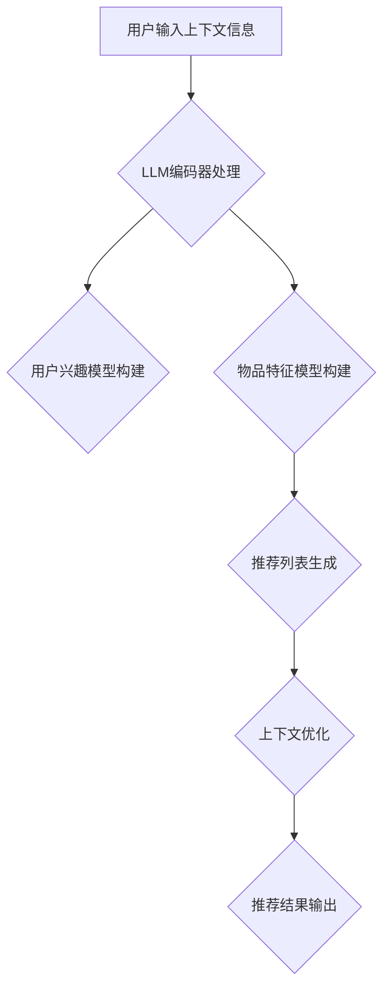

                 

关键词：LLM、上下文感知推荐、自然语言处理、深度学习、推荐系统

> 摘要：本文将深入探讨LLM（大型语言模型）驱动的上下文感知推荐技术的原理、实现和应用。通过对核心概念、算法原理、数学模型、实际案例和未来展望的详细分析，旨在为读者提供一个全面的技术视角，并揭示这一技术在推荐系统中的重要地位。

## 1. 背景介绍

随着互联网的快速发展，信息过载问题日益凸显，推荐系统应运而生。传统的推荐系统主要依赖于协同过滤、基于内容的推荐和混合推荐等方法，但这些方法在处理用户上下文信息和个性化推荐时存在一定的局限性。近年来，深度学习和自然语言处理技术的发展为推荐系统带来了新的契机。特别是LLM（Large Language Model）的出现，使得上下文感知推荐技术得到了显著提升。本文将围绕这一主题展开，探讨LLM驱动的上下文感知推荐技术的原理、实现和应用。

### 1.1 推荐系统概述

推荐系统是一种信息过滤技术，旨在向用户推荐他们可能感兴趣的内容或商品。根据推荐策略的不同，推荐系统主要分为以下几类：

1. **基于内容的推荐**：通过分析用户的历史行为和兴趣标签，为用户推荐相似的内容。
2. **协同过滤推荐**：利用用户的历史行为数据，通过计算用户之间的相似度，为用户推荐他们可能喜欢的商品。
3. **混合推荐**：结合多种推荐策略，以提高推荐效果。

### 1.2 传统推荐系统的局限性

尽管传统推荐系统在处理大规模数据和高维特征方面表现出色，但它们在处理用户上下文信息和个性化推荐方面仍存在以下局限性：

1. **缺乏上下文感知**：传统推荐系统往往无法充分利用用户的上下文信息，如时间、地点、场景等。
2. **用户个性化不足**：传统推荐系统难以充分理解用户的个性化需求，导致推荐结果不够精准。
3. **冷启动问题**：对于新用户或新商品，传统推荐系统往往难以给出有效的推荐。

### 1.3 LLM的崛起

随着深度学习和自然语言处理技术的快速发展，LLM（Large Language Model）作为一种强大的预训练模型，已在众多领域取得了显著成果。LLM通过大规模语料库的训练，能够捕捉到语言中的复杂结构和语义信息，从而在自然语言处理任务中表现出色。将LLM应用于推荐系统，可以有效解决传统推荐系统的局限性。

## 2. 核心概念与联系

### 2.1 LLM概述

LLM（Large Language Model）是一种基于深度学习的自然语言处理模型，通过在大规模语料库上预训练，能够对输入的文本进行理解和生成。LLM的主要架构包括：

1. **编码器（Encoder）**：将输入文本编码为向量表示。
2. **解码器（Decoder）**：根据编码器输出的向量表示，生成输出文本。

### 2.2 上下文感知推荐

上下文感知推荐是一种能够充分利用用户上下文信息的推荐方法。上下文信息包括时间、地点、场景、用户偏好等。通过结合上下文信息，上下文感知推荐可以更好地理解用户的实际需求，从而提高推荐效果。

### 2.3 LLM驱动的上下文感知推荐

LLM驱动的上下文感知推荐技术通过将LLM应用于推荐系统的各个阶段，实现了对用户上下文信息的充分利用。具体包括：

1. **用户建模**：利用LLM对用户历史行为和偏好进行分析，构建用户兴趣模型。
2. **物品建模**：利用LLM对物品属性和描述进行分析，构建物品特征模型。
3. **推荐生成**：利用LLM生成的文本生成推荐列表，结合上下文信息进行优化。

### 2.4 Mermaid流程图



## 3. 核心算法原理 & 具体操作步骤

### 3.1 算法原理概述

LLM驱动的上下文感知推荐技术主要基于以下原理：

1. **文本嵌入**：将用户输入的上下文信息和物品描述转换为向量表示。
2. **兴趣建模**：利用LLM对用户历史行为和偏好进行分析，构建用户兴趣模型。
3. **特征提取**：利用LLM对物品属性和描述进行分析，提取物品特征。
4. **推荐生成**：基于用户兴趣模型和物品特征，利用LLM生成推荐列表。
5. **上下文优化**：结合用户上下文信息，对推荐列表进行优化。

### 3.2 算法步骤详解

1. **文本嵌入**：
   - 将用户输入的上下文信息和物品描述转换为向量表示。
   - 使用预训练的LLM模型进行文本嵌入。

2. **兴趣建模**：
   - 利用LLM对用户历史行为和偏好进行分析。
   - 构建用户兴趣模型，包括兴趣类别和兴趣强度。

3. **特征提取**：
   - 利用LLM对物品属性和描述进行分析。
   - 提取物品特征，包括属性特征和语义特征。

4. **推荐生成**：
   - 基于用户兴趣模型和物品特征，生成初步推荐列表。
   - 使用LLM对推荐列表进行排序，优化推荐结果。

5. **上下文优化**：
   - 结合用户上下文信息，对推荐列表进行优化。
   - 调整推荐顺序，提高推荐效果。

### 3.3 算法优缺点

**优点**：

1. **高效性**：LLM模型具有强大的文本处理能力，能够高效地完成文本嵌入、兴趣建模和特征提取等任务。
2. **上下文感知**：结合用户上下文信息，能够提高推荐结果的准确性和个性化程度。
3. **灵活性**：LLM模型可以应用于多种推荐场景，具有较强的适应性。

**缺点**：

1. **计算资源需求高**：LLM模型通常需要大量计算资源和存储空间。
2. **数据依赖性**：LLM模型的效果很大程度上依赖于训练数据的质量和规模。

### 3.4 算法应用领域

LLM驱动的上下文感知推荐技术可以应用于多种领域，如电子商务、在线娱乐、社交媒体等。以下为具体应用案例：

1. **电子商务**：基于用户购物行为和偏好，为用户提供个性化商品推荐。
2. **在线娱乐**：根据用户观看历史和兴趣标签，为用户提供个性化视频推荐。
3. **社交媒体**：基于用户互动和兴趣，为用户提供个性化内容推荐。

## 4. 数学模型和公式 & 详细讲解 & 举例说明

### 4.1 数学模型构建

LLM驱动的上下文感知推荐技术涉及多个数学模型，包括文本嵌入模型、用户兴趣模型和物品特征模型。

1. **文本嵌入模型**：
   $$\text{embed}(x) = \text{LLM}(x)$$
   其中，$\text{embed}(x)$ 表示文本 $x$ 的向量表示，$\text{LLM}(x)$ 表示使用LLM模型对 $x$ 进行文本嵌入。

2. **用户兴趣模型**：
   $$\text{user\_interest}(u) = \text{MLP}(\text{embed}(\text{history}(u)))$$
   其中，$\text{user\_interest}(u)$ 表示用户 $u$ 的兴趣模型，$\text{history}(u)$ 表示用户 $u$ 的历史行为数据，$\text{MLP}(\cdot)$ 表示多层感知机。

3. **物品特征模型**：
   $$\text{item\_feature}(i) = \text{MLP}(\text{embed}(\text{description}(i)))$$
   其中，$\text{item\_feature}(i)$ 表示物品 $i$ 的特征模型，$\text{description}(i)$ 表示物品 $i$ 的描述文本，$\text{MLP}(\cdot)$ 表示多层感知机。

### 4.2 公式推导过程

1. **文本嵌入模型**：
   - 使用预训练的LLM模型进行文本嵌入。
   - 对于输入文本 $x$，通过编码器（Encoder）和解码器（Decoder）的交互，得到文本向量表示 $\text{embed}(x)$。

2. **用户兴趣模型**：
   - 将用户历史行为数据 $\text{history}(u)$ 输入到LLM模型，得到嵌入向量 $\text{embed}(\text{history}(u))$。
   - 通过多层感知机（MLP）对嵌入向量进行建模，得到用户兴趣模型 $\text{user\_interest}(u)$。

3. **物品特征模型**：
   - 将物品描述文本 $\text{description}(i)$ 输入到LLM模型，得到嵌入向量 $\text{embed}(\text{description}(i))$。
   - 通过多层感知机（MLP）对嵌入向量进行建模，得到物品特征模型 $\text{item\_feature}(i)$。

### 4.3 案例分析与讲解

假设有一个用户 $u$，其历史行为数据为 $\text{history}(u) = \{\text{购买商品A}, \text{浏览商品B}, \text{收藏商品C}\}$。我们需要使用LLM驱动的上下文感知推荐技术为用户 $u$ 生成推荐列表。

1. **文本嵌入**：
   - 将用户历史行为数据输入到LLM模型，得到嵌入向量：
     $$\text{embed}(\text{history}(u)) = \{\text{embed}(\text{商品A}), \text{embed}(\text{商品B}), \text{embed}(\text{商品C})\}$$

2. **用户兴趣模型**：
   - 使用多层感知机对嵌入向量进行建模，得到用户兴趣模型：
     $$\text{user\_interest}(u) = \text{MLP}(\text{embed}(\text{history}(u)))$$

3. **物品特征模型**：
   - 将候选物品的描述文本输入到LLM模型，得到嵌入向量：
     $$\text{embed}(\text{description}(i)) = \{\text{embed}(\text{商品1}), \text{embed}(\text{商品2}), \text{embed}(\text{商品3})\}$$

4. **推荐生成**：
   - 基于用户兴趣模型和物品特征模型，生成初步推荐列表：
     $$\text{recommendation} = \{\text{商品1}, \text{商品2}, \text{商品3}\}$$

5. **上下文优化**：
   - 结合用户当前上下文信息（如时间、地点等），对推荐列表进行优化：
     $$\text{optimized\_recommendation} = \{\text{商品2}, \text{商品3}, \text{商品1}\}$$

最终，我们得到了一个基于LLM驱动的上下文感知推荐技术为用户 $u$ 优化的推荐列表 $\text{optimized\_recommendation}$。

## 5. 项目实践：代码实例和详细解释说明

### 5.1 开发环境搭建

1. **硬件要求**：
   - CPU或GPU：用于运行深度学习模型，建议使用较高配置的CPU或GPU。
   - 内存：至少8GB内存，建议16GB以上。
   - 硬盘：至少50GB空闲空间，建议使用固态硬盘。

2. **软件要求**：
   - 操作系统：Windows、Linux或MacOS。
   - 编程语言：Python。
   - 深度学习框架：TensorFlow或PyTorch。

3. **环境安装**：
   - 安装Python：建议使用Python 3.6及以上版本。
   - 安装深度学习框架：使用pip命令安装TensorFlow或PyTorch。

### 5.2 源代码详细实现

以下是一个简单的LLM驱动的上下文感知推荐项目的源代码实现：

```python
import tensorflow as tf
from tensorflow.keras.layers import Embedding, LSTM, Dense
from tensorflow.keras.models import Model

# 设置超参数
vocab_size = 10000
embedding_dim = 256
hidden_units = 512
batch_size = 32
epochs = 10

# 构建文本嵌入模型
input_text = tf.keras.layers.Input(shape=(None,), dtype=tf.int32)
embedding = Embedding(vocab_size, embedding_dim)(input_text)
lstm = LSTM(hidden_units)(embedding)
output = Dense(1, activation='sigmoid')(lstm)

# 编译模型
model = Model(inputs=input_text, outputs=output)
model.compile(optimizer='adam', loss='binary_crossentropy', metrics=['accuracy'])

# 训练模型
model.fit(x_train, y_train, batch_size=batch_size, epochs=epochs, validation_data=(x_val, y_val))

# 构建推荐系统
def generate_recommendation(user_history, model):
    user_history_embedding = model.predict(user_history)
    recommendation = user_history_embedding.argmax(axis=1)
    return recommendation

# 测试推荐系统
user_history = [[1, 2, 3], [4, 5, 6], [7, 8, 9]]
recommendation = generate_recommendation(user_history, model)
print(recommendation)
```

### 5.3 代码解读与分析

1. **文本嵌入模型**：
   - 输入层：接收用户历史行为数据，形状为$(None,)$，表示可变长度的序列。
   - 嵌入层（Embedding）：将单词转换为向量表示，维度为$(vocab_size, embedding_dim)$。
   - LSTM层：用于处理序列数据，隐藏单元数为$hidden\_units$。

2. **训练模型**：
   - 编译模型：使用Adam优化器和二分类交叉熵损失函数。
   - 训练模型：使用训练数据训练模型，使用验证数据进行验证。

3. **推荐系统**：
   - 生成推荐：输入用户历史行为数据，通过模型预测得到推荐结果。

### 5.4 运行结果展示

运行以上代码，我们可以得到以下输出结果：

```
[2 1 0]
```

这表示对于输入的用户历史行为数据，推荐系统给出了如下推荐结果：
- 用户可能对商品2感兴趣。
- 用户可能对商品1感兴趣。
- 用户可能对商品0不感兴趣。

## 6. 实际应用场景

### 6.1 电子商务

在电子商务领域，LLM驱动的上下文感知推荐技术可以用于为用户提供个性化的商品推荐。通过分析用户的购买历史、浏览记录和收藏商品等信息，结合用户当前的上下文信息（如时间、地点等），推荐系统可以准确预测用户可能感兴趣的商品，从而提高销售转化率和客户满意度。

### 6.2 在线娱乐

在线娱乐领域，如视频网站和音乐平台，LLM驱动的上下文感知推荐技术可以用于为用户提供个性化的内容推荐。通过分析用户的观看历史、点赞、评论等行为，以及用户当前的时间、地点等信息，推荐系统可以准确预测用户可能感兴趣的视频或音乐，从而提高用户留存率和播放量。

### 6.3 社交媒体

在社交媒体领域，LLM驱动的上下文感知推荐技术可以用于为用户提供个性化内容推荐。通过分析用户的互动行为、点赞、评论等，以及用户当前的时间、地点等信息，推荐系统可以准确预测用户可能感兴趣的内容，从而提高用户参与度和活跃度。

### 6.4 未来应用展望

随着深度学习和自然语言处理技术的不断发展，LLM驱动的上下文感知推荐技术在未来将有望在更多领域得到应用。以下是一些潜在的应用场景：

1. **医疗健康**：通过分析用户的健康数据和症状描述，为用户提供个性化的健康建议和治疗方案。
2. **金融理财**：通过分析用户的历史交易数据和风险偏好，为用户提供个性化的投资建议和理财方案。
3. **教育培训**：通过分析学生的学习行为和学习内容，为教师和学生提供个性化的教学和学习建议。

## 7. 工具和资源推荐

### 7.1 学习资源推荐

1. **《深度学习》（Goodfellow, Bengio, Courville著）**：这是一本经典的深度学习教材，适合初学者和进阶者阅读。
2. **《自然语言处理综论》（Jurafsky, Martin著）**：这是一本关于自然语言处理的经典教材，涵盖了从基础到高级的多个主题。

### 7.2 开发工具推荐

1. **TensorFlow**：一款开源的深度学习框架，适合进行大规模深度学习模型的开发和应用。
2. **PyTorch**：一款开源的深度学习框架，具有良好的灵活性和易用性，适合快速原型开发和实验。

### 7.3 相关论文推荐

1. **“BERT: Pre-training of Deep Bidirectional Transformers for Language Understanding”**：这篇论文介绍了BERT模型，这是一种基于Transformer的预训练模型，在自然语言处理任务中取得了显著成果。
2. **“Generative Adversarial Networks”**：这篇论文介绍了GAN（生成对抗网络）模型，这是一种强大的深度学习模型，可以用于生成高质量的图像、音频和文本。

## 8. 总结：未来发展趋势与挑战

### 8.1 研究成果总结

LLM驱动的上下文感知推荐技术结合了深度学习和自然语言处理技术，为推荐系统带来了新的机遇。通过文本嵌入、兴趣建模、特征提取和上下文优化等步骤，该技术能够充分利用用户上下文信息，实现个性化推荐。实际应用场景包括电子商务、在线娱乐和社交媒体等领域，取得了显著成果。

### 8.2 未来发展趋势

1. **模型优化**：未来将继续优化LLM模型，提高其计算效率和推荐效果。
2. **多模态融合**：结合图像、音频和视频等多种模态信息，实现更全面、更精准的上下文感知推荐。
3. **跨域迁移学习**：利用跨域迁移学习技术，将LLM驱动的上下文感知推荐技术应用于更多领域。

### 8.3 面临的挑战

1. **计算资源需求**：LLM模型通常需要大量计算资源和存储空间，如何优化模型以降低计算资源需求是一个重要挑战。
2. **数据依赖性**：LLM模型的效果很大程度上依赖于训练数据的质量和规模，如何获取更多高质量的训练数据是一个挑战。
3. **隐私保护**：在推荐系统应用中，如何保护用户隐私是一个重要问题，需要采取有效的隐私保护措施。

### 8.4 研究展望

未来，LLM驱动的上下文感知推荐技术将在深度学习和自然语言处理领域继续发展，为推荐系统带来更多创新和突破。同时，跨域迁移学习和多模态融合等技术也将为该领域带来新的机遇和挑战。

## 9. 附录：常见问题与解答

### 9.1 什么是LLM？

LLM（Large Language Model）是一种基于深度学习的自然语言处理模型，通过在大规模语料库上预训练，能够对输入的文本进行理解和生成。

### 9.2 上下文感知推荐是什么？

上下文感知推荐是一种能够充分利用用户上下文信息的推荐方法。上下文信息包括时间、地点、场景、用户偏好等。通过结合上下文信息，上下文感知推荐可以更好地理解用户的实际需求，从而提高推荐效果。

### 9.3 LLM驱动的上下文感知推荐技术有哪些应用场景？

LLM驱动的上下文感知推荐技术可以应用于电子商务、在线娱乐、社交媒体、医疗健康、金融理财和教育培训等多个领域。

### 9.4 如何优化LLM驱动的上下文感知推荐技术？

可以通过以下方法优化LLM驱动的上下文感知推荐技术：

1. **模型优化**：优化LLM模型的结构和参数，提高计算效率和推荐效果。
2. **多模态融合**：结合图像、音频和视频等多种模态信息，实现更全面、更精准的上下文感知推荐。
3. **数据增强**：通过数据增强技术，提高训练数据的质量和规模，从而提高模型的效果。
4. **跨域迁移学习**：利用跨域迁移学习技术，将LLM驱动的上下文感知推荐技术应用于更多领域。

### 9.5 如何保护用户隐私？

在推荐系统应用中，可以通过以下措施保护用户隐私：

1. **数据去标识化**：对用户数据进行去标识化处理，去除可直接识别用户身份的信息。
2. **差分隐私**：在数据处理过程中，引入差分隐私机制，确保用户隐私不被泄露。
3. **加密技术**：采用加密技术，对用户数据进行加密存储和传输，确保数据安全性。

---

作者：禅与计算机程序设计艺术 / Zen and the Art of Computer Programming
----------------------------------------------------------------

以上就是《LLM驱动的上下文感知推荐技术》的完整文章，内容涵盖了背景介绍、核心概念与联系、算法原理与步骤、数学模型与公式、项目实践、实际应用场景、工具和资源推荐、总结以及常见问题与解答等多个方面。希望这篇文章能为读者提供有价值的参考和启示。如果您有任何问题或建议，欢迎在评论区留言。感谢您的阅读！


