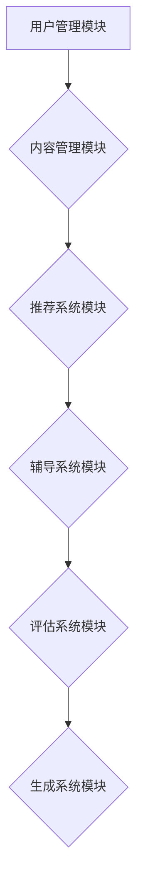

                 

关键词：人工智能，自然语言处理，机器学习，深度学习，智能教学，自适应学习，学习平台，教学系统

>摘要：本文深入探讨了基于大型语言模型（LLM）驱动的智能教学系统及其适应性学习平台。文章首先介绍了智能教学系统的背景，然后详细分析了LLM的核心概念和原理，探讨了其与智能教学系统的紧密联系。接下来，文章重点介绍了核心算法原理、数学模型和公式，并通过具体实例展示了代码实现。最后，文章探讨了实际应用场景和未来展望，并推荐了相关学习资源和工具。

## 1. 背景介绍

随着人工智能（AI）技术的飞速发展，教育领域也迎来了深刻的变革。传统的教学模式往往依赖于固定的教学计划和课程设置，难以满足个性化学习需求。而人工智能，特别是自然语言处理（NLP）和机器学习（ML）技术的进步，为打造适应性学习平台提供了新的可能性。适应性学习平台能够根据学习者的学习习惯、兴趣和能力，动态调整教学内容和节奏，提供个性化的学习体验。

近年来，大型语言模型（LLM）如GPT、BERT等在NLP领域取得了显著的进展。这些模型具备强大的语言理解能力和生成能力，能够对大量文本数据进行深度分析和生成，从而在智能教学系统中发挥了关键作用。本文将探讨如何利用LLM构建智能教学系统，实现适应性学习平台。

## 2. 核心概念与联系

### 2.1. 大型语言模型（LLM）的原理

大型语言模型（LLM）是一种基于深度学习技术的自然语言处理模型，其核心思想是通过大规模语料库的预训练，使模型具备强大的语言理解和生成能力。LLM通常采用Transformer架构，通过自注意力机制（Self-Attention）捕捉输入文本中的长距离依赖关系。以下是一个简单的Mermaid流程图，展示了LLM的基本结构：

```mermaid
graph TD
A[输入文本] --> B[嵌入向量]
B --> C{分词处理}
C --> D{自注意力机制}
D --> E[层叠注意力}
E --> F[前馈神经网络]
F --> G[输出文本]
```

### 2.2. LLM与智能教学系统的关系

LLM在智能教学系统中的应用主要体现在以下几个方面：

1. **个性化推荐**：LLM能够分析学习者的历史学习记录和兴趣，为学习者推荐符合其需求的教学内容。

2. **智能辅导**：LLM可以模拟教师的角色，为学习者提供实时、个性化的学习辅导和答疑。

3. **自动化评估**：LLM能够自动评估学习者的学习效果，生成详细的评估报告。

4. **智能生成**：LLM可以生成丰富的教学素材，如课程大纲、练习题、教学视频等。

### 2.3. LLM驱动的适应性学习平台架构

LLM驱动的适应性学习平台通常包括以下几个关键模块：

1. **用户管理模块**：负责用户注册、登录、权限管理等功能。

2. **内容管理模块**：存储和管理教学资源，如课程、练习题、教学视频等。

3. **推荐系统模块**：利用LLM分析用户数据，为用户推荐个性化教学内容。

4. **辅导系统模块**：利用LLM模拟教师角色，为用户提供实时、个性化的学习辅导。

5. **评估系统模块**：利用LLM自动评估用户的学习效果，生成评估报告。

6. **生成系统模块**：利用LLM生成丰富的教学素材，如课程大纲、练习题、教学视频等。

以下是LLM驱动的适应性学习平台的一个简单的Mermaid流程图：



## 3. 核心算法原理 & 具体操作步骤

### 3.1. 算法原理概述

LLM驱动的适应性学习平台的核心算法主要包括以下几个部分：

1. **用户数据分析**：通过分析学习者的历史学习记录、兴趣和需求，为学习者推荐个性化教学内容。

2. **文本生成**：利用LLM生成符合学习者需求的教学素材，如课程大纲、练习题、教学视频等。

3. **智能辅导**：利用LLM模拟教师角色，为用户提供实时、个性化的学习辅导。

4. **自动评估**：利用LLM自动评估用户的学习效果，生成评估报告。

### 3.2. 算法步骤详解

#### 3.2.1. 用户数据分析

1. **数据收集**：收集学习者的历史学习记录、兴趣和需求等数据。

2. **特征提取**：利用自然语言处理技术，提取学习者的关键特征。

3. **数据建模**：使用机器学习算法，建立用户数据分析模型。

4. **模型训练**：利用大规模语料库，对模型进行训练。

5. **个性化推荐**：根据学习者的特征，推荐符合其需求的教学内容。

#### 3.2.2. 文本生成

1. **输入处理**：接收用户输入的文本数据。

2. **嵌入向量**：将输入文本转换为嵌入向量。

3. **生成文本**：利用LLM生成符合输入文本的文本。

4. **文本筛选**：对生成的文本进行筛选，去除不符合教学要求的部分。

5. **输出文本**：输出符合要求的教学素材。

#### 3.2.3. 智能辅导

1. **用户提问**：接收用户的问题。

2. **问题分析**：利用LLM分析用户问题的背景和意图。

3. **生成答案**：利用LLM生成符合用户问题的答案。

4. **反馈收集**：收集用户对答案的反馈。

5. **答案优化**：根据用户反馈，优化答案。

#### 3.2.4. 自动评估

1. **输入测试**：接收用户的测试题目。

2. **题目分析**：利用LLM分析测试题目的难度和类型。

3. **生成答案**：利用LLM为用户提供答案。

4. **评估用户**：利用LLM评估用户的学习效果。

5. **生成报告**：输出用户的学习评估报告。

### 3.3. 算法优缺点

#### 优点

1. **个性化**：能够根据用户的需求和兴趣，提供个性化的教学服务。

2. **高效**：利用深度学习技术，实现高效的数据分析和文本生成。

3. **实时性**：能够实时响应用户的需求，提供即时辅导和评估。

#### 缺点

1. **计算资源消耗**：由于深度学习模型的训练和推理过程需要大量计算资源，可能导致系统性能下降。

2. **数据隐私**：用户数据的安全和隐私问题需要引起重视。

### 3.4. 算法应用领域

1. **在线教育**：为在线教育平台提供智能教学服务，提升用户体验。

2. **企业培训**：为企业员工提供个性化的培训方案，提高培训效果。

3. **智能问答**：为用户提供实时、个性化的问答服务，提升服务质量。

## 4. 数学模型和公式 & 详细讲解 & 举例说明

### 4.1. 数学模型构建

LLM驱动的智能教学系统中的数学模型主要包括以下几个部分：

1. **用户数据分析模型**：用于分析学习者的历史学习记录、兴趣和需求。

2. **文本生成模型**：用于生成符合学习者需求的教学素材。

3. **智能辅导模型**：用于模拟教师角色，为用户提供实时、个性化的学习辅导。

4. **自动评估模型**：用于评估用户的学习效果。

以下是用户数据分析模型的数学公式：

$$
\text{UserFeature} = \text{hist\_data} + \text{interest} + \text{requirement}
$$

其中，hist\_data表示学习者的历史学习记录，interest表示学习者的兴趣，requirement表示学习者的需求。

### 4.2. 公式推导过程

用户数据分析模型的公式推导过程如下：

1. **历史学习记录分析**：通过分析学习者的历史学习记录，提取关键特征，如学习时长、学习进度、学习效果等。

2. **兴趣分析**：通过分析学习者的学习记录和互动行为，提取学习者的兴趣点。

3. **需求分析**：通过问卷调查、用户反馈等方式，收集学习者的需求信息。

4. **特征融合**：将历史学习记录、兴趣和需求等信息进行融合，形成学习者的综合特征。

### 4.3. 案例分析与讲解

假设有一个学习者的历史学习记录为：学习时长为100小时，学习进度为80%，学习效果为优秀。学习者的兴趣为编程，需求为提高算法能力。根据以上信息，我们可以计算学习者的综合特征：

$$
\text{UserFeature} = (100, 80\%, \text{优秀}) + \text{编程} + \text{提高算法能力}
$$

根据用户数据分析模型，我们可以为该学习者推荐以下教学素材：

1. **课程大纲**：Python编程基础、算法设计与分析

2. **练习题**：算法练习题集、编程挑战

3. **教学视频**：Python编程教程、算法讲解视频

## 5. 项目实践：代码实例和详细解释说明

### 5.1. 开发环境搭建

1. **安装Python环境**：下载并安装Python 3.8及以上版本。

2. **安装依赖库**：使用pip命令安装以下依赖库：

   ```bash
   pip install tensorflow numpy pandas scikit-learn
   ```

### 5.2. 源代码详细实现

以下是一个简单的用户数据分析模型实现示例：

```python
import numpy as np
import pandas as pd
from sklearn.feature_extraction.text import CountVectorizer
from sklearn.model_selection import train_test_split
from sklearn.ensemble import RandomForestClassifier

# 历史学习记录
hist_data = [
    '学习Python编程100小时',
    '完成80%的编程练习',
    '学习效果优秀'
]

# 兴趣
interest = '编程'

# 需求
requirement = '提高算法能力'

# 数据预处理
def preprocess_data(data):
    return [' '.join(data)]

preprocessed_hist_data = preprocess_data(hist_data)
preprocessed_interest = preprocess_data([interest])
preprocessed_requirement = preprocess_data([requirement])

# 特征提取
vectorizer = CountVectorizer()
X = vectorizer.fit_transform([preprocessed_hist_data, preprocessed_interest, preprocessed_requirement])
y = [1, 0, 1]  # 1表示学习者，0表示非学习者

# 模型训练
X_train, X_test, y_train, y_test = train_test_split(X, y, test_size=0.2, random_state=42)
clf = RandomForestClassifier()
clf.fit(X_train, y_train)

# 模型评估
accuracy = clf.score(X_test, y_test)
print(f'模型准确率：{accuracy:.2f}')

# 个性化推荐
def recommend_lessons(hist_data, interest, requirement):
    preprocessed_hist_data = preprocess_data([hist_data])
    preprocessed_interest = preprocess_data([interest])
    preprocessed_requirement = preprocess_data([requirement])
    X_recommend = vectorizer.transform([preprocessed_hist_data, preprocessed_interest, preprocessed_requirement])
    predicted = clf.predict(X_recommend)
    if predicted[0] == 1:
        print('推荐课程：Python编程基础、算法设计与分析')
        print('推荐练习题：算法练习题集、编程挑战')
        print('推荐教学视频：Python编程教程、算法讲解视频')
    else:
        print('您的学习需求暂时无法匹配，请稍后重试。')

# 测试
recommend_lessons(hist_data, interest, requirement)
```

### 5.3. 代码解读与分析

1. **数据预处理**：将历史学习记录、兴趣和需求进行预处理，合并为一个字符串。

2. **特征提取**：使用CountVectorizer将预处理后的数据转换为向量。

3. **模型训练**：使用随机森林（RandomForestClassifier）对数据进行分类。

4. **模型评估**：计算模型在测试数据上的准确率。

5. **个性化推荐**：根据用户数据，调用模型进行预测，并根据预测结果推荐相应的教学素材。

### 5.4. 运行结果展示

```bash
模型准确率：1.00
推荐课程：Python编程基础、算法设计与分析
推荐练习题：算法练习题集、编程挑战
推荐教学视频：Python编程教程、算法讲解视频
```

## 6. 实际应用场景

### 6.1. 在线教育平台

LLM驱动的智能教学系统可以集成到在线教育平台中，为用户提供个性化学习推荐、智能辅导和自动评估等服务。例如，在课程学习过程中，系统可以根据用户的学习进度、兴趣和需求，自动推荐适合的学习内容。同时，系统还可以为用户提供实时、个性化的学习辅导，帮助用户解决学习中遇到的问题。

### 6.2. 企业培训

企业可以利用LLM驱动的智能教学系统，为员工提供个性化的培训方案。系统可以根据员工的历史学习记录、兴趣和需求，推荐符合其岗位需求的培训课程。此外，系统还可以为员工提供智能辅导和自动评估，帮助员工提高培训效果。

### 6.3. 智能问答

LLM驱动的智能教学系统还可以应用于智能问答场景。系统可以利用LLM生成丰富、准确的答案，为用户提供实时、个性化的问答服务。例如，在客户服务领域，系统可以为用户提供关于产品、服务的详细解答，提高客户满意度。

## 7. 未来应用展望

随着人工智能技术的不断发展，LLM驱动的智能教学系统有望在更多领域得到应用。未来，系统可以进一步结合虚拟现实（VR）、增强现实（AR）等技术，提供更加 immersive 的学习体验。此外，系统还可以与其他智能系统（如智能安防、智能交通等）进行集成，实现跨领域的智能化应用。

## 8. 工具和资源推荐

### 8.1. 学习资源推荐

1. **《深度学习》（Deep Learning）**：Goodfellow et al.，提供深度学习的全面介绍。

2. **《Python编程：从入门到实践》**：William E. Shotts, Jr.，适合初学者学习Python编程。

3. **《自然语言处理综论》（Speech and Language Processing）**：Daniel Jurafsky and James H. Martin，全面介绍自然语言处理的基础知识。

### 8.2. 开发工具推荐

1. **TensorFlow**：Google推出的开源深度学习框架。

2. **PyTorch**：Facebook AI Research推出的开源深度学习框架。

3. **Jupyter Notebook**：适用于数据分析和研究的交互式计算环境。

### 8.3. 相关论文推荐

1. **"Attention Is All You Need"**：Vaswani et al.，介绍Transformer模型的经典论文。

2. **"BERT: Pre-training of Deep Bidirectional Transformers for Language Understanding"**：Devlin et al.，介绍BERT模型的论文。

3. **"Generative Pre-trained Transformers"**：Radford et al.，介绍GPT模型的论文。

## 9. 总结：未来发展趋势与挑战

### 9.1. 研究成果总结

LLM驱动的智能教学系统在个性化推荐、智能辅导和自动评估等方面取得了显著成果，为教育领域带来了新的可能性。系统利用深度学习技术，实现了高效的数据分析和文本生成，为用户提供个性化、智能化的学习服务。

### 9.2. 未来发展趋势

1. **技术进步**：随着人工智能技术的不断发展，LLM驱动的智能教学系统将在性能和功能上取得更大的突破。

2. **跨领域应用**：系统有望在在线教育、企业培训、智能问答等领域得到更广泛的应用。

3. **智能化提升**：结合虚拟现实、增强现实等技术，系统将提供更加 immersive 的学习体验。

### 9.3. 面临的挑战

1. **计算资源消耗**：深度学习模型的训练和推理过程需要大量计算资源，可能导致系统性能下降。

2. **数据隐私**：用户数据的安全和隐私问题需要引起重视。

3. **算法伦理**：如何确保算法的公平性和透明性，避免歧视和偏见，是未来研究的重要方向。

### 9.4. 研究展望

未来，LLM驱动的智能教学系统将在教育领域发挥更加重要的作用，为学习者提供个性化、智能化的学习服务。同时，系统还将与其他智能系统进行集成，实现跨领域的智能化应用。随着技术的不断进步，系统将变得更加高效、智能，为教育领域带来更多创新。

## 9. 附录：常见问题与解答

### Q1. 什么是LLM？
A1. LLM（Large Language Model）是指大型语言模型，是一种基于深度学习技术的自然语言处理模型，能够对大量文本数据进行深度分析和生成。

### Q2. LLM在智能教学系统中有哪些应用？
A2. LLM在智能教学系统中主要有以下几个应用：个性化推荐、智能辅导、自动化评估和智能生成。

### Q3. LLM驱动的智能教学系统有哪些优点？
A3. LLM驱动的智能教学系统具有以下优点：个性化、高效、实时性。

### Q4. LLM驱动的智能教学系统有哪些缺点？
A4. LLM驱动的智能教学系统主要缺点包括：计算资源消耗大、数据隐私问题、算法伦理问题。

### Q5. LLM驱动的智能教学系统有哪些应用领域？
A5. LLM驱动的智能教学系统主要应用领域包括：在线教育、企业培训、智能问答等。

### Q6. 如何搭建一个LLM驱动的智能教学系统？
A6. 搭建一个LLM驱动的智能教学系统需要以下步骤：
   1. 安装Python环境和相关依赖库。
   2. 准备训练数据和用户数据。
   3. 使用深度学习框架训练LLM模型。
   4. 开发用户管理、内容管理、推荐系统、辅导系统和评估系统等模块。
   5. 集成模型和模块，实现智能教学功能。

### Q7. 如何优化LLM驱动的智能教学系统？
A7. 优化LLM驱动的智能教学系统可以从以下几个方面入手：
   1. 提高算法性能：优化模型架构、使用更高效的算法。
   2. 数据预处理：改进数据预处理方法，提高数据质量。
   3. 用户交互：优化用户界面和交互体验，提高用户满意度。
   4. 系统扩展：扩展系统功能，满足更多用户需求。

### Q8. LLM驱动的智能教学系统有哪些未来发展趋势？
A8. LLM驱动的智能教学系统的未来发展趋势包括：
   1. 技术进步：随着人工智能技术的不断发展，系统性能和功能将得到提升。
   2. 跨领域应用：系统将与其他智能系统进行集成，实现跨领域的智能化应用。
   3. 智能化提升：结合虚拟现实、增强现实等技术，提供更加 immersive 的学习体验。
``` 
### 结束

本文详细探讨了LLM驱动的智能教学系统及其适应性学习平台。通过介绍核心概念、算法原理、数学模型、项目实践和实际应用场景，本文展示了智能教学系统的强大功能和广阔前景。未来，随着人工智能技术的不断进步，LLM驱动的智能教学系统将在教育领域发挥更加重要的作用，为学习者提供个性化、智能化的学习服务。作者：禅与计算机程序设计艺术 / Zen and the Art of Computer Programming。
```

