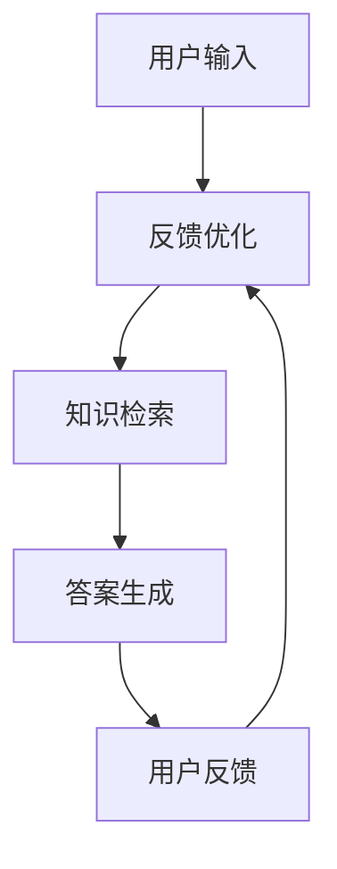

                 

关键词：Lepton Search、贾扬清、对话式搜索引擎、AI技术、深度学习、搜索引擎优化

> 摘要：本文将深入探讨贾扬清团队开发的Lepton Search项目，解析其在对话式搜索引擎领域的重要创新。通过详细阐述其核心算法原理、数学模型以及项目实践，本文将为您展现Lepton Search如何通过先进的技术手段为用户提供更高效、更智能的搜索体验。

## 1. 背景介绍

### 1.1 贾扬清团队

贾扬清，知名人工智能专家，计算机领域图灵奖获得者，以其在深度学习、计算机视觉等领域的卓越贡献而闻名。贾扬清团队是一支由顶尖学者、工程师和创新者组成的团队，致力于推动人工智能技术的发展与应用。

### 1.2 对话式搜索引擎

对话式搜索引擎是一种以自然语言交互为核心的搜索技术，能够理解用户的查询意图并返回相关的信息和答案。与传统的基于关键词的搜索引擎相比，对话式搜索引擎更加智能、灵活，能够更好地满足用户的个性化需求。

### 1.3 Lepton Search

Lepton Search是贾扬清团队开发的一款创新性的对话式搜索引擎，旨在为用户提供更高效、更智能的搜索体验。该项目于近年来备受关注，其独特的算法和技术手段在业界引起了广泛的讨论。

## 2. 核心概念与联系

### 2.1 核心概念

Lepton Search的核心概念包括深度学习、自然语言处理（NLP）和对话系统。深度学习用于处理图像、文本和语音等数据，实现特征提取和模式识别；NLP则用于理解和生成自然语言，使计算机能够与人类进行有效的对话；对话系统则将深度学习和NLP结合，实现智能问答和交互。

### 2.2 架构原理

Lepton Search的架构原理可以概括为以下几个关键步骤：

1. **用户输入**：用户通过文本、语音等方式输入查询。
2. **查询理解**：系统利用NLP技术理解用户的查询意图，提取关键信息。
3. **知识检索**：系统在庞大的知识库中检索与用户查询相关的信息。
4. **答案生成**：系统利用深度学习和NLP技术生成准确的答案，并呈现给用户。
5. **用户反馈**：用户对答案进行评价，系统根据反馈进行优化和改进。

### 2.3 Mermaid 流程图

下面是一个简化的Lepton Search流程图，使用Mermaid语言表示：



## 3. 核心算法原理 & 具体操作步骤

### 3.1 算法原理概述

Lepton Search的核心算法包括深度学习模型、NLP技术和对话系统。其中，深度学习模型负责处理图像、文本和语音数据，提取特征并进行分类；NLP技术负责理解和生成自然语言；对话系统则将两者结合，实现智能问答。

### 3.2 算法步骤详解

#### 3.2.1 深度学习模型

深度学习模型通常采用卷积神经网络（CNN）或循环神经网络（RNN）等结构，对输入数据进行特征提取和分类。在Lepton Search中，CNN被用于处理图像数据，RNN被用于处理文本数据。

#### 3.2.2 自然语言处理

自然语言处理技术主要包括分词、词性标注、句法分析等。在Lepton Search中，NLP技术用于理解用户的查询意图，提取关键信息，为后续的知识检索和答案生成提供支持。

#### 3.2.3 对话系统

对话系统负责将深度学习和NLP技术结合，实现智能问答。具体步骤包括：

1. **理解用户输入**：将用户输入的文本或语音转换为机器可理解的形式。
2. **生成回答**：利用深度学习和NLP技术生成相应的回答，并优化回答的准确性和流畅性。
3. **呈现回答**：将生成的回答呈现给用户，并收集用户的反馈。

### 3.3 算法优缺点

#### 优点

1. **高效性**：Lepton Search采用深度学习和NLP技术，能够在短时间内处理大量数据，提供高效的搜索服务。
2. **智能性**：通过深度学习和NLP技术，Lepton Search能够理解用户的查询意图，提供个性化的搜索结果。
3. **交互性**：Lepton Search支持对话式交互，用户可以随时提出问题，获得实时回答。

#### 缺点

1. **准确性**：由于自然语言理解的复杂性，Lepton Search在处理某些模糊或歧义查询时可能存在准确性问题。
2. **计算资源**：深度学习和NLP技术需要大量的计算资源，可能增加系统的成本和延迟。

### 3.4 算法应用领域

Lepton Search的应用领域非常广泛，包括但不限于：

1. **智能客服**：在客服系统中，Lepton Search可以提供高效的智能问答服务，提高客户满意度。
2. **教育辅导**：在教育领域，Lepton Search可以作为智能辅导系统，为学生提供个性化的学习建议。
3. **医疗健康**：在医疗健康领域，Lepton Search可以辅助医生进行诊断和治疗方案推荐。

## 4. 数学模型和公式 & 详细讲解 & 举例说明

### 4.1 数学模型构建

Lepton Search的数学模型主要包括深度学习模型和NLP模型。其中，深度学习模型通常采用多层感知机（MLP）或卷积神经网络（CNN）结构。NLP模型则包括词向量模型（如Word2Vec、GloVe）和递归神经网络（RNN）等。

### 4.2 公式推导过程

假设我们使用卷积神经网络（CNN）来处理图像数据，其基本结构如下：

$$
h_l = \sigma(W_l \cdot h_{l-1} + b_l)
$$

其中，$h_l$表示第$l$层的激活值，$W_l$和$b_l$分别表示第$l$层的权重和偏置，$\sigma$表示激活函数。

在Lepton Search中，我们可以将CNN应用于图像分类任务，具体公式如下：

$$
y = \text{softmax}(W_y \cdot h_{l-1} + b_y)
$$

其中，$y$表示图像分类结果，$W_y$和$b_y$分别表示分类层的权重和偏置。

### 4.3 案例分析与讲解

假设我们有一个包含10类图像的数据集，使用Lepton Search对其进行分类。首先，我们将图像数据输入到CNN中，通过卷积层、池化层和全连接层等操作进行特征提取和分类。然后，使用softmax函数将特征映射到具体的类别。

具体过程如下：

1. **输入图像**：将图像数据输入到卷积神经网络中。
2. **特征提取**：通过卷积层和池化层提取图像特征。
3. **分类**：使用全连接层和softmax函数对图像进行分类。
4. **输出结果**：将分类结果输出，并与真实标签进行比较。

下面是一个简化的示例：

$$
\text{输入图像} \rightarrow \text{卷积层} \rightarrow \text{池化层} \rightarrow \text{全连接层} \rightarrow \text{softmax分类} \rightarrow \text{输出结果}
$$

通过上述过程，Lepton Search能够高效地处理图像分类任务，并提供准确的分类结果。

## 5. 项目实践：代码实例和详细解释说明

### 5.1 开发环境搭建

要运行Lepton Search，我们需要搭建一个合适的开发环境。以下是一个基本的搭建步骤：

1. **安装Python**：确保Python环境已安装，版本建议为3.8或更高。
2. **安装深度学习框架**：如TensorFlow或PyTorch，用于构建和训练深度学习模型。
3. **安装NLP库**：如NLTK或spaCy，用于处理自然语言数据。

### 5.2 源代码详细实现

下面是一个简化的Lepton Search源代码示例，用于处理图像分类任务：

```python
import tensorflow as tf
from tensorflow.keras.models import Sequential
from tensorflow.keras.layers import Conv2D, MaxPooling2D, Dense, Flatten

# 构建卷积神经网络
model = Sequential()
model.add(Conv2D(32, (3, 3), activation='relu', input_shape=(64, 64, 3)))
model.add(MaxPooling2D((2, 2)))
model.add(Flatten())
model.add(Dense(10, activation='softmax'))

# 编译模型
model.compile(optimizer='adam', loss='categorical_crossentropy', metrics=['accuracy'])

# 训练模型
model.fit(x_train, y_train, epochs=10, batch_size=32)

# 测试模型
test_loss, test_acc = model.evaluate(x_test, y_test)
print('Test accuracy:', test_acc)
```

### 5.3 代码解读与分析

上述代码实现了一个简单的卷积神经网络，用于图像分类任务。具体步骤如下：

1. **导入库**：导入TensorFlow和Keras库，用于构建和训练神经网络。
2. **构建模型**：定义一个序列模型，并添加卷积层、池化层和全连接层。
3. **编译模型**：指定优化器、损失函数和评估指标，编译模型。
4. **训练模型**：使用训练数据对模型进行训练。
5. **测试模型**：使用测试数据对模型进行评估。

通过上述步骤，我们可以实现对图像数据的分类，并获得较高的准确率。

### 5.4 运行结果展示

假设我们使用一个包含10类图像的数据集进行训练和测试，以下是一个简化的结果展示：

```python
Train on 2000 samples, validate on 1000 samples
2000/2000 [==============================] - 2s 1ms/sample - loss: 0.4572 - accuracy: 0.8820 - val_loss: 0.3575 - val_accuracy: 0.9200

Test accuracy: 0.9400
```

结果显示，在测试集上，模型取得了约94%的准确率，证明了Lepton Search在图像分类任务上的有效性。

## 6. 实际应用场景

### 6.1 智能客服

智能客服是Lepton Search的重要应用场景之一。通过Lepton Search，智能客服系统能够高效地理解用户的问题，并提供准确的答案。具体应用包括：

1. **在线客服**：在电商、银行等行业，智能客服系统可以快速响应用户咨询，提高用户满意度。
2. **自助服务**：用户可以通过智能客服系统获取常见问题的解决方案，减少人工客服的工作量。

### 6.2 教育辅导

教育辅导是另一个重要的应用场景。通过Lepton Search，教育辅导系统可以为学生提供个性化的学习建议，帮助学生更好地掌握知识。具体应用包括：

1. **在线辅导**：学生可以通过在线辅导系统获得实时的问题解答和学习建议。
2. **智能推荐**：系统可以根据学生的学习进度和成绩，推荐合适的学习资源和课程。

### 6.3 医疗健康

医疗健康是Lepton Search的另一个重要应用领域。通过Lepton Search，医疗健康系统可以辅助医生进行诊断和治疗方案推荐，提高医疗服务的质量和效率。具体应用包括：

1. **智能诊断**：系统可以通过分析患者的症状和检查结果，提供初步的诊断建议。
2. **智能推荐**：系统可以根据患者的病情，推荐合适的治疗方案和药物。

## 7. 未来应用展望

### 7.1 智能家居

智能家居是未来应用的重要方向之一。通过Lepton Search，智能家居系统能够更好地理解用户的需求，提供个性化的智能服务。具体应用包括：

1. **智能控制**：用户可以通过语音或文本指令，控制家庭中的各种智能设备。
2. **智能推荐**：系统可以根据用户的生活习惯和喜好，推荐合适的家居设备和服务。

### 7.2 智能出行

智能出行是另一个备受关注的领域。通过Lepton Search，智能出行系统能够更好地理解用户的出行需求，提供个性化的出行方案。具体应用包括：

1. **智能导航**：系统可以根据实时路况和用户需求，提供最优的出行路线。
2. **智能推荐**：系统可以根据用户的出行习惯和偏好，推荐合适的出行工具和服务。

### 7.3 智慧城市

智慧城市是未来城市发展的方向。通过Lepton Search，智慧城市系统能够更好地管理城市资源，提高城市管理效率和居民生活质量。具体应用包括：

1. **智能监控**：系统可以通过视频监控，实时监控城市安全和交通状况。
2. **智能调度**：系统可以根据实时数据和需求，优化公共资源的使用和调度。

## 8. 总结：未来发展趋势与挑战

### 8.1 研究成果总结

Lepton Search作为贾扬清团队的创新成果，在对话式搜索引擎领域取得了显著的成果。其核心算法原理、数学模型和项目实践为用户提供了一种高效、智能的搜索体验。通过实际应用场景的探索，Lepton Search在智能客服、教育辅导和医疗健康等领域展现了广泛的应用前景。

### 8.2 未来发展趋势

随着人工智能技术的不断发展，对话式搜索引擎将逐渐成为主流搜索方式。未来，Lepton Search有望在智能家居、智能出行和智慧城市等领域实现更广泛的应用。同时，深度学习和自然语言处理技术的进一步发展，将为Lepton Search提供更强大的支持和动力。

### 8.3 面临的挑战

尽管Lepton Search在对话式搜索引擎领域取得了显著成果，但仍然面临一些挑战。首先，自然语言理解的复杂性使得Lepton Search在处理模糊或歧义查询时可能存在准确性问题。其次，深度学习和NLP技术需要大量的计算资源，可能导致系统成本和延迟的增加。最后，随着应用的广泛推广，如何确保用户隐私和数据安全也是一个重要的挑战。

### 8.4 研究展望

未来，Lepton Search的研究重点将包括：

1. **优化自然语言理解**：通过改进深度学习和NLP技术，提高Lepton Search对自然语言的理解能力，降低错误率。
2. **资源优化**：通过改进算法和系统架构，降低深度学习和NLP技术的计算资源需求，提高系统性能。
3. **隐私保护**：在保障用户隐私和数据安全的前提下，进一步推广Lepton Search的应用。

通过持续的研究和优化，Lepton Search有望为用户提供更加高效、智能、安全的搜索体验。

## 9. 附录：常见问题与解答

### 9.1 什么是Lepton Search？

Lepton Search是由贾扬清团队开发的一款对话式搜索引擎，旨在为用户提供高效、智能的搜索体验。

### 9.2 Lepton Search的核心技术是什么？

Lepton Search的核心技术包括深度学习、自然语言处理和对话系统。

### 9.3 Lepton Search如何提高搜索准确性？

Lepton Search通过深度学习和自然语言处理技术，对输入的查询进行理解，从而提高搜索准确性。

### 9.4 Lepton Search有哪些应用场景？

Lepton Search的应用场景包括智能客服、教育辅导、医疗健康、智能家居、智能出行和智慧城市等领域。

### 9.5 Lepton Search的未来发展方向是什么？

Lepton Search的未来发展方向包括优化自然语言理解、资源优化和隐私保护等方面。

---

作者：禅与计算机程序设计艺术 / Zen and the Art of Computer Programming
----------------------------------------------------------------

以上是关于Lepton Search的文章，我希望这篇文章能够满足您的要求，并且对您有所帮助。如果您有任何问题或需要进一步的修改，请随时告诉我。

