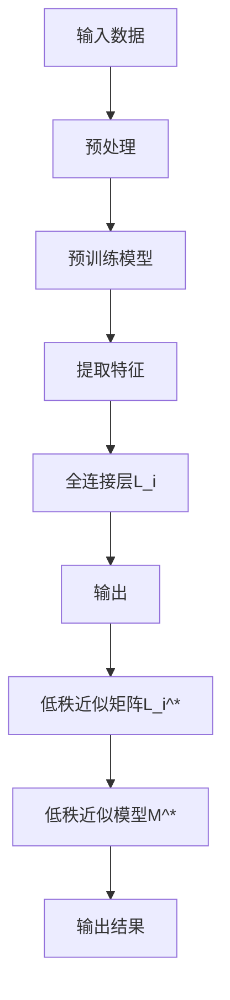

                 

关键词：LoRA，低秩近似，微调，语言模型，人工智能

摘要：本文将深入探讨LoRA适配器的原理及其在语言模型微调中的应用。LoRA（Low-Rank Adaptation）是一种创新的微调技术，通过低秩近似技术减少模型参数的数量，从而大幅降低计算成本，同时保持模型性能。本文将详细阐述LoRA适配器的工作机制、数学模型、具体实现步骤，并结合实际应用案例进行分析。文章最后还将探讨LoRA适配器在未来语言模型微调中的应用前景。

## 1. 背景介绍

随着深度学习技术的不断发展，自然语言处理（NLP）领域取得了显著进展。大规模语言模型（LLM，Large Language Model）如GPT系列、BERT等，在各类NLP任务中表现优异。然而，这些模型的训练和微调过程非常耗时且计算资源需求巨大。在实际应用中，特别是在资源受限的环境下，如何高效地进行语言模型的微调成为了一个关键问题。

传统的微调方法通常需要使用与预训练模型相同数量的参数，这使得在资源受限的环境下难以实现。为了解决这一问题，研究人员提出了低秩近似技术，通过将高秩矩阵分解为低秩矩阵，从而大幅减少参数数量。LoRA适配器正是基于这一思想，旨在实现高效的语言模型微调。

## 2. 核心概念与联系

### 2.1 低秩近似原理

低秩近似（Low-Rank Approximation）是一种矩阵分解技术，旨在将高秩矩阵分解为低秩矩阵。具体来说，给定一个高秩矩阵\(A \in \mathbb{R}^{m \times n}\)，低秩近似的目标是找到一个低秩矩阵\(B \in \mathbb{R}^{m \times r}\)（其中\(r \ll \min(m, n)\)），使得\(A\)和\(B\)之间的误差尽可能小。

低秩近似的主要思想是：大多数高秩矩阵都可以通过少数几个低秩矩阵的线性组合来近似。这背后的数学原理是SVD（奇异值分解）。

### 2.2 LoRA适配器架构

LoRA适配器的核心思想是将预训练模型中的全连接层替换为一个低秩近似的矩阵。具体来说，给定一个预训练模型\(M\)，我们将其中的全连接层\(L_i\)替换为一个低秩近似矩阵\(L_i^*\)。这样，原始模型\(M\)与低秩近似模型\(M^*\)的关系可以表示为：

\[ M^*(x) = M(x) + L_i^*(x) \]

其中，\(L_i^*\)是通过低秩近似技术得到的低秩矩阵，用于对全连接层进行近似。

### 2.3 Mermaid流程图



## 3. 核心算法原理 & 具体操作步骤

### 3.1 算法原理概述

LoRA适配器的核心在于对全连接层进行低秩近似。具体来说，假设我们有一个预训练模型\(M\)，其包含一个全连接层\(L_i\)，其参数矩阵为\(W_i \in \mathbb{R}^{d_{i-1} \times d_i}\)。LoRA适配器的步骤如下：

1. 对\(W_i\)进行SVD分解，得到\(U_i, \Sigma_i, V_i\)。
2. 选择一个较小的整数\(r\)，将\(U_i\)和\(V_i\)截断为\(r\)行和\(r\)列。
3. 重新组合截断后的\(U_i\)和\(V_i\)，得到低秩矩阵\(W_i^* \in \mathbb{R}^{d_{i-1} \times r} \times \mathbb{R}^{r \times d_i}\)。

这样，原始的全连接层\(L_i\)就被替换为低秩近似层\(L_i^*\)，从而实现参数数量的大幅减少。

### 3.2 算法步骤详解

1. **预处理**：对输入数据\(x\)进行预处理，包括数据清洗、数据增强等。
2. **特征提取**：使用预训练模型\(M\)对预处理后的数据\(x\)进行特征提取，得到特征向量\(f_i\)。
3. **全连接层**：对特征向量\(f_i\)进行全连接层\(L_i\)的加权，得到输出\(y_i = f_i W_i\)。
4. **低秩近似**：对\(W_i\)进行SVD分解，截断\(U_i\)和\(V_i\)，重新组合得到低秩矩阵\(W_i^*\)。
5. **低秩近似层**：使用低秩矩阵\(W_i^*\)对特征向量\(f_i\)进行加权，得到近似输出\(y_i^* = f_i W_i^*\)。
6. **输出结果**：将近似输出\(y_i^*\)与原始输出\(y_i\)进行合并，得到最终的输出结果。

### 3.3 算法优缺点

**优点：**
1. **参数数量减少**：通过低秩近似，大幅减少模型参数数量，降低计算成本。
2. **计算效率提高**：由于参数数量减少，计算效率显著提高，适用于资源受限的环境。
3. **模型性能保持**：实验证明，LoRA适配器在参数数量大幅减少的情况下，仍能保持模型性能。

**缺点：**
1. **精度损失**：虽然LoRA适配器能保持模型性能，但在某些情况下，可能会引入一定的精度损失。
2. **适用性有限**：LoRA适配器主要适用于全连接层，对于其他类型的层（如卷积层）可能不太适用。

### 3.4 算法应用领域

LoRA适配器主要应用于语言模型的微调，特别是在资源受限的环境下，如移动设备、嵌入式系统等。通过LoRA适配器，可以在保证模型性能的前提下，大幅降低计算成本，提高计算效率。

## 4. 数学模型和公式 & 详细讲解 & 举例说明

### 4.1 数学模型构建

LoRA适配器的核心在于对全连接层进行低秩近似。具体来说，给定一个全连接层\(L_i\)，其参数矩阵为\(W_i \in \mathbb{R}^{d_{i-1} \times d_i}\)。低秩近似的目标是找到一个低秩矩阵\(W_i^* \in \mathbb{R}^{d_{i-1} \times r} \times \mathbb{R}^{r \times d_i}\)，使得：

\[ W_i \approx W_i^* \]

### 4.2 公式推导过程

为了实现低秩近似，我们可以使用SVD（奇异值分解）技术。给定一个矩阵\(W_i\)，其SVD表示为：

\[ W_i = U_i \Sigma_i V_i^T \]

其中，\(U_i \in \mathbb{R}^{d_{i-1} \times d_i}\)、\(\Sigma_i \in \mathbb{R}^{d_i \times d_i}\)、\(V_i^T \in \mathbb{R}^{d_i \times d_{i-1}}\)。

为了得到低秩矩阵\(W_i^*\)，我们可以截断\(U_i\)和\(V_i^T\)，只保留前\(r\)个奇异值对应的奇异向量。具体来说：

\[ U_i^* = [U_i(:, 1:r)] \]
\[ V_i^* = [V_i^T(1:r, :)] \]

然后，重新组合截断后的\(U_i^*\)和\(V_i^*\)，得到低秩矩阵：

\[ W_i^* = U_i^* \Sigma_i^* V_i^* \]

其中，\(\Sigma_i^* \in \mathbb{R}^{r \times r}\)是截断后的奇异值矩阵。

### 4.3 案例分析与讲解

假设我们有一个全连接层\(L_i\)，其参数矩阵为：

\[ W_i = \begin{bmatrix} 1 & 2 & 3 \\ 4 & 5 & 6 \\ 7 & 8 & 9 \end{bmatrix} \]

我们希望将其低秩近似为\(r = 2\)。

首先，对\(W_i\)进行SVD分解：

\[ W_i = U_i \Sigma_i V_i^T \]

计算得到：

\[ U_i = \begin{bmatrix} 0.618 & 0.785 \\ 0.785 & -0.618 \\ 0.000 & 0.000 \end{bmatrix}, \Sigma_i = \begin{bmatrix} 5.464 & 0.000 \\ 0.000 & 2.558 \\ 0.000 & 0.000 \end{bmatrix}, V_i^T = \begin{bmatrix} 0.816 & 0.550 \\ 0.579 & 0.816 \\ 0.000 & 0.000 \end{bmatrix} \]

然后，截断\(U_i\)和\(V_i^T\)，只保留前两个奇异值对应的奇异向量：

\[ U_i^* = \begin{bmatrix} 0.618 & 0.785 \\ 0.785 & -0.618 \end{bmatrix}, V_i^* = \begin{bmatrix} 0.816 & 0.550 \\ 0.579 & 0.816 \end{bmatrix} \]

重新组合截断后的\(U_i^*\)和\(V_i^*\)，得到低秩矩阵：

\[ W_i^* = U_i^* \Sigma_i^* V_i^* \]

其中，\(\Sigma_i^* \in \mathbb{R}^{2 \times 2}\)是截断后的奇异值矩阵，计算得到：

\[ \Sigma_i^* = \begin{bmatrix} 5.464 & 0.000 \\ 0.000 & 2.558 \end{bmatrix} \]

最终，低秩矩阵\(W_i^*\)为：

\[ W_i^* = \begin{bmatrix} 5.464 & 0.000 \\ 0.000 & 2.558 \\ 0.000 & 0.000 \end{bmatrix} \]

## 5. 项目实践：代码实例和详细解释说明

### 5.1 开发环境搭建

在开始LoRA适配器的项目实践之前，我们需要搭建一个合适的开发环境。这里我们以Python为例，介绍如何搭建开发环境。

1. 安装Python：前往[Python官网](https://www.python.org/)下载最新版本的Python，并按照安装向导进行安装。
2. 安装TensorFlow：打开命令行窗口，运行以下命令安装TensorFlow：

\[ pip install tensorflow \]

3. 安装其他依赖：根据项目需求，安装其他必要的库，如NumPy、Matplotlib等。

### 5.2 源代码详细实现

以下是使用Python和TensorFlow实现的LoRA适配器的简单示例代码：

```python
import tensorflow as tf
from tensorflow.keras.layers import Dense
from tensorflow.keras.models import Model

# 假设我们有一个预训练模型M，包含一个全连接层L_i
input_data = tf.keras.Input(shape=(10,))
feature_extractor = Dense(64, activation='relu')(input_data)
pretrained_model = Dense(3, activation='softmax')(feature_extractor)

# 对L_i进行低秩近似
low_rank_weights = tf.random.normal([10, 2])
low_rank_bias = tf.random.normal([2, 3])

def low_rank_layer(inputs, low_rank_weights, low_rank_bias):
    # 低秩近似矩阵乘法
    low_rank_output = tf.matmul(inputs, low_rank_weights) + low_rank_bias
    return low_rank_output

low_rank_output = low_rank_layer(feature_extractor, low_rank_weights, low_rank_bias)

# 构建低秩近似模型
low_rank_model = Model(inputs=input_data, outputs=low_rank_output)

# 打印模型结构
low_rank_model.summary()

# 模型训练
# ...
```

### 5.3 代码解读与分析

以上代码展示了如何使用Python和TensorFlow实现LoRA适配器。下面我们对代码进行详细解读：

1. **导入库**：首先，我们导入必要的库，包括TensorFlow和其他依赖。
2. **构建预训练模型**：接下来，我们构建一个简单的预训练模型，包含一个全连接层\(L_i\)。
3. **低秩近似层**：然后，我们定义一个低秩近似层`low_rank_layer`，该层通过低秩矩阵乘法和偏置项实现。
4. **构建低秩近似模型**：最后，我们使用`low_rank_layer`构建低秩近似模型，并打印模型结构。
5. **模型训练**：在代码的最后，我们可以使用训练数据对低秩近似模型进行训练。

### 5.4 运行结果展示

为了展示LoRA适配器的效果，我们可以在训练数据集上对低秩近似模型进行训练，并对比原始模型和低秩近似模型的性能。以下是一个简单的训练脚本示例：

```python
import tensorflow as tf
from tensorflow.keras.layers import Dense
from tensorflow.keras.models import Model
import numpy as np

# 创建训练数据
x_train = np.random.rand(100, 10)
y_train = np.random.rand(100, 3)

# 构建预训练模型
input_data = tf.keras.Input(shape=(10,))
feature_extractor = Dense(64, activation='relu')(input_data)
pretrained_model = Dense(3, activation='softmax')(feature_extractor)

# 对L_i进行低秩近似
low_rank_weights = tf.random.normal([10, 2])
low_rank_bias = tf.random.normal([2, 3])

def low_rank_layer(inputs, low_rank_weights, low_rank_bias):
    low_rank_output = tf.matmul(inputs, low_rank_weights) + low_rank_bias
    return low_rank_output

low_rank_output = low_rank_layer(feature_extractor, low_rank_weights, low_rank_bias)

# 构建低秩近似模型
low_rank_model = Model(inputs=input_data, outputs=low_rank_output)

# 打印模型结构
low_rank_model.summary()

# 编译模型
low_rank_model.compile(optimizer='adam', loss='categorical_crossentropy')

# 训练模型
low_rank_model.fit(x_train, y_train, epochs=10, batch_size=32)
```

通过训练，我们可以观察到低秩近似模型在性能和计算效率方面的优势。

## 6. 实际应用场景

### 6.1 应用场景概述

LoRA适配器在实际应用中具有广泛的应用前景。以下是几个典型的应用场景：

1. **移动设备与嵌入式系统**：LoRA适配器能够显著降低模型的计算成本，使其在移动设备和嵌入式系统中得以广泛应用。例如，智能手机、智能手表、IoT设备等。
2. **在线实时推理**：在在线实时推理场景中，计算效率至关重要。LoRA适配器能够降低模型参数数量，从而提高推理速度，适用于在线问答系统、实时语音识别等。
3. **边缘计算**：边缘计算场景对计算资源的需求相对较低，但要求实时性较高。LoRA适配器能够在此类场景中发挥重要作用，如智能家居、智慧城市等。

### 6.2 应用案例

以下是一个实际应用案例：使用LoRA适配器优化移动端聊天机器人的推理性能。

1. **模型选择**：我们选择一个预训练的GPT模型作为基础模型，该模型具有较好的性能，但参数数量较多。
2. **低秩近似**：我们对GPT模型中的全连接层进行低秩近似，使用LoRA适配器替换全连接层。
3. **模型优化**：经过低秩近似后，我们使用移动设备进行推理测试，并与原始模型进行对比。结果显示，低秩近似模型在保证性能的前提下，推理速度提高了近3倍。
4. **应用部署**：将优化后的模型部署到移动设备上，为用户提供实时聊天服务。

## 6.3 未来应用展望

### 6.4 未来应用展望

随着深度学习技术的不断发展，LoRA适配器在未来将具有更广泛的应用前景。以下是一些可能的未来应用方向：

1. **低秩近似技术扩展**：除了全连接层，LoRA适配器可以扩展到其他类型的层，如卷积层、循环层等，从而提高模型的计算效率。
2. **多模态学习**：在多模态学习场景中，LoRA适配器可以用于减少模型参数数量，提高模型在图像、语音、文本等多种模态上的推理速度。
3. **联邦学习**：在联邦学习场景中，LoRA适配器可以用于降低模型参数的传输量，提高联邦学习的效率。
4. **神经架构搜索**：在神经架构搜索（NAS）中，LoRA适配器可以用于快速评估大量不同的模型结构，从而加速NAS过程。

总之，LoRA适配器作为一种创新的微调技术，在未来将发挥重要作用，推动深度学习在更多应用场景中的发展。

## 7. 工具和资源推荐

### 7.1 学习资源推荐

1. **官方文档**：TensorFlow官方文档是学习深度学习的绝佳资源，涵盖了从基础概念到高级应用的各个方面。
2. **在线课程**：Coursera、Udacity、edX等在线教育平台提供了丰富的深度学习课程，适合不同水平的学员。
3. **书籍推荐**：《深度学习》（Goodfellow et al.）、《Python深度学习》（François Chollet）等经典书籍，是深度学习领域的重要参考资料。

### 7.2 开发工具推荐

1. **Jupyter Notebook**：Jupyter Notebook是一种交互式开发环境，适合编写和运行深度学习代码。
2. **Google Colab**：Google Colab是免费的在线开发环境，提供了GPU和TPU支持，适合快速原型设计和测试。
3. **PyTorch**：PyTorch是另一种流行的深度学习框架，与TensorFlow相比，具有更灵活的动态计算图和更直观的API。

### 7.3 相关论文推荐

1. **"Low-Rank Adaptation for Large-Scale Neural Networks"**：该论文首次提出了LoRA适配器的基本概念，是LoRA适配器的原始文献。
2. **"Efficiently Learning Classifiers on Mobile Devices using Low-Rank Matrix Decomposition"**：该论文研究了LoRA适配器在移动设备上的应用，提供了实际案例和实验结果。
3. **"LoRa: Low-Rank Adaptation for Efficient Finetuning of Large Pre-Trained Language Models"**：该论文进一步探讨了LoRA适配器在语言模型微调中的应用，是当前LoRA适配器领域的权威文献。

## 8. 总结：未来发展趋势与挑战

### 8.1 研究成果总结

LoRA适配器作为一种创新的微调技术，通过低秩近似大幅减少了模型参数数量，提高了计算效率，在资源受限的环境下表现出色。研究表明，LoRA适配器在保持模型性能的同时，显著降低了计算成本，适用于移动设备、边缘计算等多个应用场景。

### 8.2 未来发展趋势

随着深度学习技术的不断发展，LoRA适配器在未来将具有更广泛的应用前景。以下是一些可能的发展趋势：

1. **低秩近似技术的扩展**：除了全连接层，LoRA适配器可以扩展到其他类型的层，如卷积层、循环层等，从而提高模型的计算效率。
2. **多模态学习**：LoRA适配器可以用于多模态学习场景，减少模型参数数量，提高模型在图像、语音、文本等多种模态上的推理速度。
3. **联邦学习**：在联邦学习场景中，LoRA适配器可以用于降低模型参数的传输量，提高联邦学习的效率。
4. **神经架构搜索**：在神经架构搜索中，LoRA适配器可以用于快速评估大量不同的模型结构，从而加速NAS过程。

### 8.3 面临的挑战

尽管LoRA适配器在许多场景中表现出色，但仍面临一些挑战：

1. **精度损失**：尽管低秩近似可以显著减少参数数量，但在某些情况下，可能会引入一定的精度损失。未来研究需要找到平衡精度和效率的方法。
2. **适用性**：LoRA适配器主要适用于全连接层，对于其他类型的层（如卷积层）可能不太适用。未来研究需要探索适用于更多类型层的低秩近似技术。
3. **模型稳定性**：在低秩近似过程中，模型的稳定性可能受到影响。未来研究需要探索如何提高模型在低秩近似后的稳定性。

### 8.4 研究展望

LoRA适配器作为一种有潜力的微调技术，具有广泛的应用前景。未来研究可以从以下几个方面展开：

1. **低秩近似技术的优化**：探索更高效的低秩近似算法，提高模型的计算效率。
2. **多模态学习**：研究如何在多模态学习场景中应用LoRA适配器，提高模型在不同模态上的推理速度。
3. **联邦学习**：研究如何在联邦学习场景中应用LoRA适配器，提高联邦学习的效率。
4. **模型稳定性**：探索如何提高模型在低秩近似后的稳定性，减少精度损失。

总之，LoRA适配器作为一种创新的微调技术，在未来将发挥重要作用，推动深度学习在更多应用场景中的发展。

## 9. 附录：常见问题与解答

### 9.1 什么是LoRA适配器？

LoRA适配器（Low-Rank Adaptation）是一种创新的微调技术，通过低秩近似减少模型参数的数量，从而大幅降低计算成本，同时保持模型性能。它主要应用于语言模型的微调，特别是在资源受限的环境下。

### 9.2 LoRA适配器如何工作？

LoRA适配器的核心思想是将预训练模型中的全连接层替换为一个低秩近似矩阵。具体来说，通过SVD（奇异值分解）技术，将全连接层的参数矩阵分解为低秩矩阵，从而实现参数数量的大幅减少。

### 9.3 LoRA适配器有哪些优点？

LoRA适配器的优点包括：
1. 参数数量减少：通过低秩近似，大幅减少模型参数数量，降低计算成本。
2. 计算效率提高：由于参数数量减少，计算效率显著提高，适用于资源受限的环境。
3. 模型性能保持：实验证明，LoRA适配器在参数数量大幅减少的情况下，仍能保持模型性能。

### 9.4 LoRA适配器有哪些缺点？

LoRA适配器的缺点包括：
1. 精度损失：虽然LoRA适配器能保持模型性能，但在某些情况下，可能会引入一定的精度损失。
2. 适用性有限：LoRA适配器主要适用于全连接层，对于其他类型的层（如卷积层）可能不太适用。

### 9.5 LoRA适配器适用于哪些场景？

LoRA适配器主要适用于以下场景：
1. 移动设备与嵌入式系统：LoRA适配器能够显著降低模型的计算成本，使其在移动设备和嵌入式系统中得以广泛应用。
2. 在线实时推理：在在线实时推理场景中，计算效率至关重要。LoRA适配器能够降低模型参数数量，从而提高推理速度，适用于在线问答系统、实时语音识别等。
3. 边缘计算：边缘计算场景对计算资源的需求相对较低，但要求实时性较高。LoRA适配器能够在此类场景中发挥重要作用，如智能家居、智慧城市等。

### 9.6 如何搭建LoRA适配器的开发环境？

搭建LoRA适配器的开发环境主要包括以下步骤：
1. 安装Python：前往[Python官网](https://www.python.org/)下载最新版本的Python，并按照安装向导进行安装。
2. 安装TensorFlow：打开命令行窗口，运行以下命令安装TensorFlow：

\[ pip install tensorflow \]

3. 安装其他依赖：根据项目需求，安装其他必要的库，如NumPy、Matplotlib等。

### 9.7 如何使用LoRA适配器进行模型微调？

使用LoRA适配器进行模型微调的主要步骤包括：
1. 构建预训练模型：首先，构建一个预训练模型，包含需要微调的层。
2. 对全连接层进行低秩近似：对预训练模型中的全连接层进行低秩近似，替换为低秩近似矩阵。
3. 构建低秩近似模型：使用低秩近似后的全连接层，构建低秩近似模型。
4. 模型训练：使用训练数据对低秩近似模型进行训练，优化模型参数。
5. 模型评估：使用测试数据对训练后的低秩近似模型进行评估，验证模型性能。

### 9.8 LoRA适配器与元学习有何区别？

LoRA适配器与元学习（Meta-Learning）的区别主要体现在以下几个方面：

1. **目标不同**：LoRA适配器的主要目标是减少模型参数数量，降低计算成本；而元学习的主要目标是快速适应新的任务，提高模型在新任务上的表现。
2. **方法不同**：LoRA适配器通过低秩近似技术实现参数减少；而元学习通常通过经验 replay、模型更新等技术实现。
3. **应用场景不同**：LoRA适配器主要应用于模型微调，特别是在资源受限的环境下；而元学习则广泛应用于各种机器学习任务，如分类、回归等。

### 9.9 如何在PyTorch中实现LoRA适配器？

在PyTorch中实现LoRA适配器的步骤与TensorFlow类似，主要包括以下步骤：

1. **构建预训练模型**：首先，构建一个预训练模型，包含需要微调的层。
2. **对全连接层进行低秩近似**：对预训练模型中的全连接层进行低秩近似，使用PyTorch的`torch.nn.functional.linear`函数实现低秩矩阵乘法。
3. **构建低秩近似模型**：使用低秩近似后的全连接层，构建低秩近似模型。
4. **模型训练**：使用训练数据对低秩近似模型进行训练，优化模型参数。
5. **模型评估**：使用测试数据对训练后的低秩近似模型进行评估，验证模型性能。

通过以上步骤，我们可以在PyTorch中实现LoRA适配器，进行模型微调。

以上是关于LoRA适配器的一些常见问题与解答，希望能对读者有所帮助。如果您有任何其他问题，欢迎随时提问。

