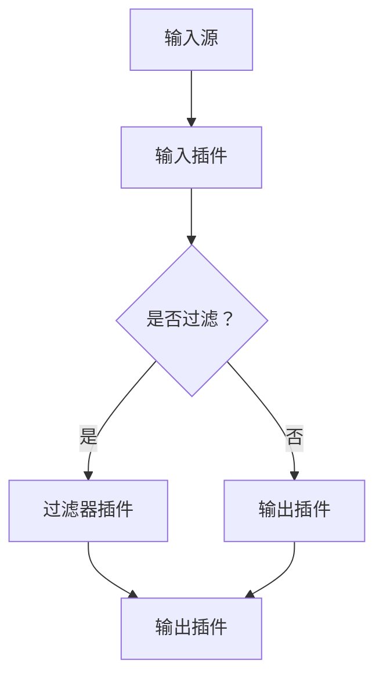

                 

关键词：ELK Stack、数据处理、日志收集、事件追踪、配置文件、插件架构、数据管道

> 摘要：本文将深入探讨Logstash的工作原理，包括其核心概念、架构设计、算法原理以及具体的代码实例。通过本文的阅读，读者将对Logstash有更全面的理解，并能够独立进行配置和使用，以构建高效的日志处理和事件追踪系统。

## 1. 背景介绍

在现代IT环境中，日志管理变得尤为重要。企业需要收集、存储和分析来自不同系统和应用程序的日志数据，以实现故障排查、安全监控、性能分析和合规性要求。ELK Stack（Elasticsearch、Logstash、Kibana）是这一领域的一个流行解决方案。其中，Logstash作为数据收集和传输的核心组件，扮演了至关重要的角色。

### 1.1 ELK Stack简介

ELK Stack是由三个开源工具组成的生态系统：
- **Elasticsearch**：一个分布式、RESTful搜索和分析引擎，用于存储和检索大量数据。
- **Logstash**：一个事件处理器，用于收集、处理和路由各种数据源的数据。
- **Kibana**：一个可视化工具，用于对Elasticsearch中的数据进行可视化展示。

ELK Stack的目标是提供一套完整的数据处理和展示解决方案，使得企业能够轻松地收集、存储、分析和可视化日志数据。

### 1.2 Logstash的重要性

Logstash的主要职责是处理和路由数据流，它可以从各种数据源（如Web服务器、数据库、消息队列等）收集数据，然后将其转换和路由到目标存储（如Elasticsearch或文件系统）。这使得Logstash成为日志管理中不可或缺的一部分，其重要性体现在以下几个方面：

- **数据集成**：Logstash能够从多个数据源收集数据，并将其统一到一个存储系统中。
- **数据转换**：Logstash提供丰富的插件和配置选项，可以转换和清洗数据，使其适合进一步处理。
- **可扩展性**：Logstash设计为分布式系统，可以水平扩展以处理大量数据。
- **安全性和合规性**：Logstash支持SSL/TLS加密和身份验证，确保数据在传输过程中的安全性。

## 2. 核心概念与联系

### 2.1 数据管道（Data Pipeline）

Logstash的核心概念是数据管道（Data Pipeline）。一个数据管道由以下几个主要阶段组成：

1. **输入（Input）**：数据管道的起点，用于从各种数据源（如文件、网络流、数据库等）接收数据。
2. **过滤器（Filter）**：在数据传输过程中对数据进行转换和清洗，以适应目标存储的要求。
3. **输出（Output）**：将处理后的数据发送到目标存储或应用程序。

### 2.2 配置文件（Configuration File）

Logstash通过配置文件（通常为`conf`文件）定义数据管道。配置文件使用Ruby语法，描述了输入、过滤器和输出的具体细节。

下面是一个简单的Logstash配置文件示例：

```ruby
input {
  file {
    type => "log_type"
    path => "/var/log/your_app/*.log"
    startpos => 0
  }
}

filter {
  if ["log_type"] == "your_app" {
    grok {
      match => { "message" => "%{TIMESTAMP:timestamp}\t%{DATA:source}\t%{INT:pid}\t%{DATA:app_name}\t%{DATA:log_level}\t%{DATA:message}" }
    }
  }
}

output {
  elasticsearch {
    hosts => ["localhost:9200"]
    index => "your_app-%{+YYYY.MM.dd}"
  }
}
```

### 2.3 插件架构（Plugin Architecture）

Logstash的强大之处在于其插件架构。插件提供了丰富的功能，如数据输入、输出、过滤和编码转换。Logstash自带的插件非常丰富，同时还可以通过社区贡献的插件扩展其功能。

插件的主要类型包括：

- **输入插件（Input Plugins）**：用于从各种数据源读取数据。
- **输出插件（Output Plugins）**：用于将数据发送到各种目标存储。
- **过滤器插件（Filter Plugins）**：用于在数据传输过程中转换和清洗数据。
- **编码插件（Codec Plugins）**：用于解析和编码数据。

### 2.4 Mermaid 流程图

下面是一个Mermaid流程图，展示了Logstash的数据管道：



## 3. 核心算法原理 & 具体操作步骤

### 3.1 算法原理概述

Logstash的核心算法原理是数据管道的概念。数据管道由输入、过滤和输出三个主要阶段组成。每个阶段都使用插件来实现特定功能。Logstash通过事件驱动架构，以流式方式处理数据，确保高效的数据传输和处理。

### 3.2 算法步骤详解

1. **输入阶段**：
   - 从数据源读取数据。
   - 使用输入插件解析和格式化数据。
   - 将数据转换为内部格式（如JSON）。

2. **过滤阶段**：
   - 根据配置文件中的过滤器插件，对数据进行转换和清洗。
   - 处理数据中的字段、格式、类型等。

3. **输出阶段**：
   - 将处理后的数据发送到目标存储或应用程序。
   - 使用输出插件将数据转换为适合目标存储的格式。

### 3.3 算法优缺点

**优点**：
- **灵活性**：通过插件架构，可以轻松地扩展和定制功能。
- **高性能**：事件驱动架构，适合处理大量数据。
- **易用性**：配置文件使用Ruby语法，易于理解和修改。

**缺点**：
- **复杂性**：配置文件较为复杂，需要一定的学习成本。
- **依赖性**：需要其他ELK Stack组件（如Elasticsearch和Kibana）的配合。

### 3.4 算法应用领域

- **日志收集**：从各种系统和应用程序中收集日志数据。
- **事件追踪**：实时监控和跟踪应用程序中的事件。
- **数据聚合**：聚合和汇总来自多个数据源的数据。

## 4. 数学模型和公式 & 详细讲解 & 举例说明

### 4.1 数学模型构建

在Logstash中，数据管道的处理过程可以抽象为一个数学模型。设\(D\)为输入数据集，\(F\)为过滤器集合，\(O\)为输出集合。则数据管道的处理过程可以表示为：

\[ D' = F(D) \]

其中，\(D'\)为过滤后的数据集。

### 4.2 公式推导过程

1. **输入阶段**：

   设输入数据集为\(D = \{d_1, d_2, ..., d_n\}\)，其中每个数据点\(d_i\)为一个元组，包含多个属性。则输入阶段可以表示为：

   \[ D' = \{f(d_i) | d_i \in D\} \]

   其中，\(f\)为输入插件的函数。

2. **过滤阶段**：

   设过滤器集合为\(F = \{f_1, f_2, ..., f_m\}\)，其中每个过滤器\(f_j\)为一个函数。则过滤阶段可以表示为：

   \[ D'' = \{f_j(d_i) | d_i \in D', f_j \in F\} \]

   其中，\(D''\)为过滤后的数据集。

3. **输出阶段**：

   设输出集合为\(O = \{o_1, o_2, ..., o_p\}\)，其中每个输出\(o_k\)为一个函数。则输出阶段可以表示为：

   \[ O(D'') = \{o_k(f_j(d_i)) | d_i \in D'', f_j \in F, o_k \in O\} \]

   其中，\(O(D'')\)为输出后的数据集。

### 4.3 案例分析与讲解

假设我们有一个简单的数据集\(D\)，包含三个属性：时间戳、源地址和消息。我们希望将这些数据进行过滤，然后输出到Elasticsearch中。

1. **输入阶段**：

   输入插件将读取数据文件，并将每行数据解析为JSON格式。例如：

   ```json
   {
     "timestamp": "2022-01-01 10:00:00",
     "source": "192.168.1.1",
     "message": "This is a log message."
   }
   ```

2. **过滤阶段**：

   我们可以使用Grok过滤器提取时间戳和源地址。例如：

   ```ruby
   grok {
     match => { "message" => "%{TIMESTAMP:timestamp}\t%{IP:source}\t%{DATA:message}" }
   }
   ```

   过滤后的数据如下：

   ```json
   {
     "timestamp": "2022-01-01 10:00:00",
     "source": "192.168.1.1",
     "message": "This is a log message."
   }
   ```

3. **输出阶段**：

   输出插件将数据发送到Elasticsearch。例如：

   ```ruby
   elasticsearch {
     hosts => ["localhost:9200"]
     index => "logs-%{+YYYY.MM.dd}"
   }
   ```

   数据将被存储到Elasticsearch的索引中。

## 5. 项目实践：代码实例和详细解释说明

### 5.1 开发环境搭建

在开始使用Logstash之前，需要搭建一个ELK Stack开发环境。以下是一个简单的步骤：

1. **安装Elasticsearch**：
   - 从Elasticsearch官方网站下载并安装Elasticsearch。
   - 启动Elasticsearch服务。

2. **安装Kibana**：
   - 从Kibana官方网站下载并安装Kibana。
   - 启动Kibana服务。

3. **安装Logstash**：
   - 从Logstash官方网站下载并安装Logstash。
   - 安装必要的插件。

4. **配置文件**：
   - 创建一个简单的Logstash配置文件，如`logstash.conf`。

### 5.2 源代码详细实现

以下是一个简单的Logstash配置文件示例，用于从文件中读取日志数据，然后将其输出到Elasticsearch：

```ruby
input {
  file {
    type => "log_type"
    path => "/var/log/your_app/*.log"
    startpos => 0
  }
}

filter {
  if ["log_type"] == "your_app" {
    grok {
      match => { "message" => "%{TIMESTAMP:timestamp}\t%{DATA:source}\t%{INT:pid}\t%{DATA:app_name}\t%{DATA:log_level}\t%{DATA:message}" }
    }
  }
}

output {
  elasticsearch {
    hosts => ["localhost:9200"]
    index => "your_app-%{+YYYY.MM.dd}"
  }
}
```

### 5.3 代码解读与分析

1. **输入插件**：

   输入插件使用`file`类型，从文件中读取日志数据。配置项`path`指定了日志文件的路径，`startpos`指定了读取文件的起始位置。

2. **过滤器插件**：

   过滤器插件使用`grok`类型，根据正则表达式对日志数据进行解析。`match`配置项定义了日志数据的格式。

3. **输出插件**：

   输出插件使用`elasticsearch`类型，将处理后的数据发送到Elasticsearch。配置项`hosts`指定了Elasticsearch服务器的地址，`index`指定了数据的索引名称。

### 5.4 运行结果展示

运行Logstash后，日志数据将被读取、解析和输出到Elasticsearch。您可以在Kibana中查看数据，并进行进一步的分析和可视化。

## 6. 实际应用场景

### 6.1 日志收集

Logstash广泛应用于各种日志收集场景，如Web服务器日志、应用程序日志、系统日志等。通过配置合适的输入、过滤和输出插件，Logstash可以轻松地收集并处理各种日志数据。

### 6.2 事件追踪

在实时监控和事件追踪领域，Logstash可以与Elasticsearch和Kibana配合使用，构建强大的事件追踪系统。通过Logstash收集的事件数据，可以实时地在Kibana中进行展示和分析。

### 6.3 安全监控

Logstash还可以用于安全监控，如收集和分析安全日志、网络流量日志等。通过配置相应的输入和过滤器插件，可以实现对潜在威胁的实时检测和响应。

## 7. 工具和资源推荐

### 7.1 学习资源推荐

- **官方文档**：[Logstash官方文档](https://www.elastic.co/guide/en/logstash/current/index.html)
- **在线教程**：[Logstash教程](https://www.tutorialspoint.com/logstash/logstash_introduction.htm)
- **博客文章**：[Logstash实战](https://www.elastic.co/guide/en/logstash/current/running_first_logstash_pipeline.html)

### 7.2 开发工具推荐

- **Visual Studio Code**：一个强大的代码编辑器，适用于编写Logstash配置文件。
- **Logstash-JSON-Editor**：一个在线工具，用于生成和编辑Logstash JSON配置文件。

### 7.3 相关论文推荐

- **"Elasticsearch: The Definitive Guide"**：详细介绍了ELK Stack的使用和配置。
- **"Logstash: Processing and Routing Data"**：深入探讨了Logstash的原理和架构。

## 8. 总结：未来发展趋势与挑战

### 8.1 研究成果总结

本文详细介绍了Logstash的工作原理、核心概念、算法原理以及具体应用场景。通过本文的阅读，读者能够全面了解Logstash，并能够将其应用于实际项目中。

### 8.2 未来发展趋势

随着大数据和实时分析的需求不断增长，Logstash将继续在日志管理和数据管道领域发挥重要作用。未来，Logstash将更加注重性能优化、易用性和安全性。

### 8.3 面临的挑战

- **复杂性**：配置文件较为复杂，需要一定的学习和实践经验。
- **安全性**：随着数据安全需求的增加，Logstash需要提供更加完善的安全机制。

### 8.4 研究展望

未来的研究可以重点关注以下几个方面：

- **自动化配置**：通过机器学习等技术，自动生成和优化Logstash配置。
- **多源数据集成**：扩展Logstash的输入和输出插件，支持更多的数据源和目标存储。

## 9. 附录：常见问题与解答

### 9.1 如何配置Logstash输入插件？

Logstash输入插件的配置取决于数据源的类型。以下是一些常见的数据源和相应的输入插件配置：

- **文件**：使用`file`输入插件，如`input { file { path => "/var/log/your_app/*.log" } }`
- **网络流**：使用`tcp`或`udp`输入插件，如`input { tcp { port => 5044 } }`
- **数据库**：使用数据库特定的输入插件，如`input { mysql { host => "localhost" database => "your_db" user => "your_user" password => "your_password" } }`

### 9.2 如何配置Logstash输出插件？

Logstash输出插件的配置也取决于目标存储的类型。以下是一些常见的目标存储和相应的输出插件配置：

- **Elasticsearch**：使用`elasticsearch`输出插件，如`output { elasticsearch { hosts => ["localhost:9200"] index => "your_index" } }`
- **文件系统**：使用`file`输出插件，如`output { file { path => "/var/log/output.log" } }`
- **消息队列**：使用`kafka`输出插件，如`output { kafka { topic_id => "your_topic" bootstrap_servers => ["localhost:9092"] } }`

### 9.3 如何优化Logstash性能？

优化Logstash性能可以从以下几个方面进行：

- **垂直扩展**：增加Logstash节点的数量，以提高处理能力。
- **水平扩展**：使用集群模式，将数据分布到多个节点。
- **插件优化**：选择适合数据源和目标存储的插件，避免不必要的转换和传输。
- **缓存和压缩**：使用缓存和压缩技术，减少数据传输和处理时间。

----------------------------------------------------------------

作者：禅与计算机程序设计艺术 / Zen and the Art of Computer Programming

