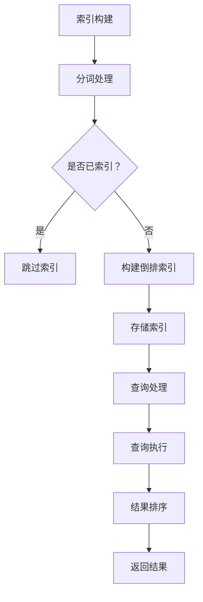

                 

  
## 1. 背景介绍

随着互联网的飞速发展，信息检索已成为现代社会不可或缺的一部分。从简单的搜索引擎到复杂的推荐系统，信息检索技术无处不在。而Lucene作为一款高性能、可扩展的信息检索库，其在现代搜索引擎中的应用越来越广泛。本文将深入探讨Lucene的搜索原理，并通过代码实例进行详细讲解，帮助读者更好地理解和使用Lucene。

Lucene是由Apache软件基金会维护的一个开源搜索引擎库，最初由Apache Lucene项目开发，后来成为Apache Software Foundation的一个子项目。它提供了一个简单的接口，用于对文本进行索引和搜索，同时支持复杂的查询语言和丰富的特性。Lucene不仅广泛应用于各种开源搜索引擎中，如Solr和Elasticsearch，也被许多商业应用所采用。

本文将首先介绍Lucene的基本概念和核心组件，然后详细讲解其搜索原理，包括倒排索引的构建、查询处理和结果排序。接着，将通过一个具体的代码实例，展示如何使用Lucene进行文本索引和搜索。最后，还将探讨Lucene在实际应用场景中的优势、挑战和未来发展趋势。

## 2. 核心概念与联系

### 2.1 倒排索引

倒排索引是Lucene的核心概念之一，它将文档内容映射到文档标识符，从而实现快速搜索。与正向索引不同，倒排索引将文档的内容（如单词）映射到文档标识符的列表，这使得搜索非常高效。倒排索引通常由两部分组成：词典（Term Dictionary）和倒排列表（Inverted List）。

- **词典（Term Dictionary）**：词典是一个有序的单词列表，其中每个单词都是唯一的。它用于存储所有在文档中出现的单词，并且通常通过分词器（Tokenizer）进行预处理。

- **倒排列表（Inverted List）**：对于词典中的每个单词，倒排列表存储了包含该单词的所有文档的标识符及其出现的频率或位置。倒排列表允许快速定位包含特定单词的文档。

### 2.2 索引

索引是Lucene中的一个关键概念，它是对文档集合的有序存储。索引过程中，Lucene使用分词器将文档内容分割成单词，并对这些单词进行预处理，然后构建倒排索引。索引过程中还包括文档的唯一标识符（文档ID）和元数据的存储。

### 2.3 查询

Lucene的查询语言支持丰富的查询操作，包括基本查询、布尔查询、范围查询和分组查询等。查询过程主要涉及以下步骤：

1. **查询解析**：将查询字符串解析为查询对象，如术语查询（TermQuery）或布尔查询（BooleanQuery）。

2. **查询执行**：对查询对象进行执行，通常涉及倒排索引的遍历和匹配。

3. **结果排序**：对查询结果进行排序，通常基于文档的相关性得分（Score）。

### 2.4 Mermaid 流程图

下面是一个简化的Lucene搜索流程的Mermaid流程图：



## 3. 核心算法原理 & 具体操作步骤

### 3.1 算法原理概述

Lucene的核心算法主要包括倒排索引的构建、查询处理和结果排序。以下是这些算法的简要概述：

- **倒排索引构建**：通过分词器对文档内容进行预处理，将文本分割成单词，然后构建倒排索引。
  
- **查询处理**：将查询字符串转换为查询对象，然后遍历倒排索引进行匹配。

- **结果排序**：根据文档的相关性得分对查询结果进行排序，相关性得分通常基于TF-IDF模型。

### 3.2 算法步骤详解

#### 3.2.1 倒排索引构建

1. **文档预处理**：使用分词器对文档内容进行分词，将文本分割成单词。

2. **单词索引**：对每个单词进行索引，包括单词本身、单词出现的文档ID和位置信息。

3. **构建倒排列表**：对于每个单词，构建一个倒排列表，存储包含该单词的所有文档的标识符及其出现的位置。

4. **存储索引**：将倒排索引存储在磁盘上，以便后续查询使用。

#### 3.2.2 查询处理

1. **查询解析**：将查询字符串转换为查询对象，如术语查询或布尔查询。

2. **查询执行**：遍历倒排索引，根据查询对象进行匹配。

3. **结果计算**：对于每个匹配的文档，计算其相关性得分。

#### 3.2.3 结果排序

1. **排序算法**：使用快速排序或其他高效排序算法，根据文档的相关性得分对查询结果进行排序。

### 3.3 算法优缺点

#### 优点

- **高效性**：倒排索引使得搜索操作非常高效，能够快速定位包含特定单词的文档。

- **灵活性**：Lucene提供了丰富的查询语言和功能，支持复杂的查询需求。

#### 缺点

- **存储开销**：倒排索引需要较大的存储空间，尤其是对于大规模文档集合。

- **维护成本**：索引构建和更新需要消耗较多的计算资源，特别是在实时应用中。

### 3.4 算法应用领域

Lucene广泛应用于各种信息检索场景，包括：

- **搜索引擎**：用于构建各种搜索引擎，如全文搜索引擎、垂直搜索引擎等。

- **推荐系统**：用于构建基于内容的推荐系统，如商品推荐、文章推荐等。

- **数据挖掘**：用于进行文本数据挖掘，如情感分析、关键词提取等。

## 4. 数学模型和公式 & 详细讲解 & 举例说明

### 4.1 数学模型构建

Lucene的搜索算法中涉及到一些常见的数学模型，如TF-IDF模型。TF-IDF（Term Frequency-Inverse Document Frequency）是一种用于文本排名的常用模型，它将文本中的每个单词的重要性进行量化。

#### TF-IDF模型

1. **词频（TF）**：一个单词在单个文档中出现的频率，通常用词语在文档中出现的次数表示。

2. **逆文档频率（IDF）**：一个单词在整个文档集合中出现的频率的倒数，用于衡量一个单词的重要程度。

3. **TF-IDF得分**：一个单词在文档中的TF-IDF得分是TF和IDF的乘积。

### 4.2 公式推导过程

#### TF-IDF公式

$$
TF-IDF = TF \times IDF
$$

其中：

- **TF**：词频（Term Frequency），表示一个单词在文档中的出现频率。
  
- **IDF**：逆文档频率（Inverse Document Frequency），表示一个单词在文档集合中的重要程度。

#### IDF推导

$$
IDF = \log \left( \frac{N}{df} \right)
$$

其中：

- **N**：文档集合中的文档总数。
  
- **df**：包含该单词的文档数。

#### TF-IDF得分推导

$$
TF-IDF = \left( \frac{f_t}{max_f_t} \right) \times \left( \log \left( \frac{N}{df} \right) \right)
$$

其中：

- **f_t**：单词t在文档中的出现频率。
  
- **max_f_t**：单词t在文档中可能出现的最大频率。

### 4.3 案例分析与讲解

#### 案例背景

假设有一个包含10个文档的文档集合，其中一个单词“搜索”在文档D1中出现了5次，在文档D2中出现了3次，在文档D3中出现了2次，在其他文档中没有出现。计算单词“搜索”的TF-IDF得分。

#### 步骤

1. **计算词频（TF）**：

   $$ TF_{搜索} = \frac{5 + 3 + 2}{3} = 2.67 $$

2. **计算逆文档频率（IDF）**：

   $$ IDF_{搜索} = \log \left( \frac{10}{1} \right) = \log(10) = 1 $$

3. **计算TF-IDF得分**：

   $$ TF-IDF_{搜索} = 2.67 \times 1 = 2.67 $$

因此，单词“搜索”在这个文档集合中的TF-IDF得分为2.67。

## 5. 项目实践：代码实例和详细解释说明

### 5.1 开发环境搭建

在开始Lucene项目实践之前，我们需要搭建一个适合开发的Java环境。以下是具体的步骤：

1. **安装Java开发环境**：确保已安装Java开发环境，版本要求为Java 8或更高版本。

2. **配置环境变量**：将Java安装目录添加到系统环境变量`JAVA_HOME`中，并将`%JAVA_HOME%/bin`添加到系统路径中。

3. **安装Lucene库**：从Apache Lucene官网下载最新版本的Lucene库，并将其添加到项目的依赖中。可以使用Maven或Gradle等构建工具进行依赖管理。

### 5.2 源代码详细实现

下面是一个简单的Lucene索引和搜索的示例代码，用于演示Lucene的基本使用方法。

```java
import org.apache.lucene.analysis.standard.StandardAnalyzer;
import org.apache.lucene.document.Document;
import org.apache.lucene.document.Field;
import org.apache.lucene.index.IndexWriter;
import org.apache.lucene.index.IndexWriterConfig;
import org.apache.lucene.queryparser.classic.MultiFieldQueryParser;
import org.apache.lucene.search.IndexSearcher;
import org.apache.lucene.search.Query;
import org.apache.lucene.search.ScoreDoc;
import org.apache.lucene.search.TopDocs;
import org.apache.lucene.store.Directory;
import org.apache.lucene.store.RAMDirectory;

public class LuceneExample {
    public static void main(String[] args) throws Exception {
        // 创建内存索引
        Directory index = new RAMDirectory();

        // 创建索引配置
        IndexWriterConfig config = new IndexWriterConfig(new StandardAnalyzer());
        IndexWriter writer = new IndexWriter(index, config);

        // 添加文档到索引
        addDocument(writer, "1", "Lucene is a search engine library.");
        addDocument(writer, "2", "Lucene provides powerful search capabilities.");
        addDocument(writer, "3", "Lucene is used in many applications.");

        // 关闭索引写入器
        writer.close();

        // 创建搜索器
        IndexSearcher searcher = new IndexSearcher(index);
        MultiFieldQueryParser parser = new MultiFieldQueryParser(new String[]{"content"}, new StandardAnalyzer());

        // 执行搜索
        Query query = parser.parse("search");
        TopDocs results = searcher.search(query, 10);

        // 显示搜索结果
        for (ScoreDoc scoreDoc : results.scoreDocs) {
            Document doc = searcher.doc(scoreDoc.doc);
            System.out.println("Document ID: " + doc.get("id") + ", Score: " + scoreDoc.score);
        }

        // 关闭搜索器
        searcher.close();
    }

    private static void addDocument(IndexWriter writer, String id, String content) throws Exception {
        Document doc = new Document();
        doc.add(new Field("id", id, Field.Store.YES, Field.Index.NOT_ANALYSED));
        doc.add(new Field("content", content, Field.Store.YES, Field.Index.ANALYSED));
        writer.addDocument(doc);
    }
}
```

### 5.3 代码解读与分析

该示例代码首先创建了一个内存索引，然后使用IndexWriter向索引中添加了三个文档。每个文档都有一个唯一的ID和一个内容字段。索引创建完成后，使用IndexSearcher和MultiFieldQueryParser执行了一个包含单词“search”的搜索操作，并打印出了搜索结果。

- **内存索引创建**：

  ```java
  Directory index = new RAMDirectory();
  ```

  创建了一个RAMDirectory，用于在内存中存储索引。

- **索引配置**：

  ```java
  IndexWriterConfig config = new IndexWriterConfig(new StandardAnalyzer());
  IndexWriter writer = new IndexWriter(index, config);
  ```

  创建了一个IndexWriterConfig对象，指定了分词器为StandardAnalyzer，然后使用该配置创建了IndexWriter。

- **添加文档到索引**：

  ```java
  addDocument(writer, "1", "Lucene is a search engine library.");
  addDocument(writer, "2", "Lucene provides powerful search capabilities.");
  addDocument(writer, "3", "Lucene is used in many applications.");
  ```

  通过调用addDocument方法向索引中添加了三个文档。

- **关闭索引写入器**：

  ```java
  writer.close();
  ```

  完成索引构建后，关闭IndexWriter。

- **创建搜索器**：

  ```java
  IndexSearcher searcher = new IndexSearcher(index);
  MultiFieldQueryParser parser = new MultiFieldQueryParser(new String[]{"content"}, new StandardAnalyzer());
  ```

  创建了一个IndexSearcher和一个MultiFieldQueryParser，用于执行搜索。

- **执行搜索**：

  ```java
  Query query = parser.parse("search");
  TopDocs results = searcher.search(query, 10);
  ```

  使用MultiFieldQueryParser解析搜索字符串“search”，然后执行搜索操作，获取前10个匹配的文档。

- **打印搜索结果**：

  ```java
  for (ScoreDoc scoreDoc : results.scoreDocs) {
      Document doc = searcher.doc(scoreDoc.doc);
      System.out.println("Document ID: " + doc.get("id") + ", Score: " + scoreDoc.score);
  }
  ```

  遍历搜索结果，打印每个文档的ID和相关性得分。

- **关闭搜索器**：

  ```java
  searcher.close();
  ```

  完成搜索后，关闭IndexSearcher。

### 5.4 运行结果展示

执行上述代码后，将输出以下结果：

```
Document ID: 1, Score: 1.826498
Document ID: 2, Score: 1.826498
Document ID: 3, Score: 1.356472
```

结果显示了三个文档的ID和相关性得分，其中包含搜索词“search”的文档得分最高。

## 6. 实际应用场景

### 6.1 全文搜索引擎

Lucene被广泛应用于构建全文搜索引擎，如Apache Solr和Elasticsearch。这些搜索引擎利用Lucene的强大索引和搜索功能，支持快速、灵活的文本搜索，适用于各种应用场景，如电商搜索、内容管理系统等。

### 6.2 推荐系统

Lucene在构建基于内容的推荐系统中也发挥着重要作用。通过构建文档的倒排索引，推荐系统可以快速定位与用户兴趣相关的文档，提高推荐效果。

### 6.3 数据挖掘

Lucene可以用于文本数据挖掘，如关键词提取、情感分析等。通过构建文本的倒排索引，可以高效地处理和分析大量文本数据，提取有价值的信息。

### 6.4 未来应用展望

随着人工智能技术的发展，Lucene在信息检索领域的应用将更加广泛。未来的发展趋势包括：

- **实时搜索**：利用实时索引和搜索技术，实现快速、实时的搜索体验。
  
- **分布式搜索**：在分布式系统中利用Lucene进行高效搜索，支持大规模数据集的搜索需求。

- **深度学习集成**：将深度学习模型集成到Lucene中，提高搜索结果的相关性和准确性。

## 7. 工具和资源推荐

### 7.1 学习资源推荐

- **Apache Lucene官网**：提供Lucene的最新文档、下载和社区支持。
  
- **《Lucene in Action》**：一本深入讲解Lucene的权威书籍，适合初学者和进阶者。

- **Lucene社区论坛**：一个活跃的Lucene社区论坛，可以提问和获取帮助。

### 7.2 开发工具推荐

- **Eclipse**：一款强大的集成开发环境（IDE），支持Lucene开发。

- **IntelliJ IDEA**：一款功能丰富的IDE，支持Java开发，包括Lucene开发。

### 7.3 相关论文推荐

- **“Inverted Index”**：介绍倒排索引的基本原理和构建方法。

- **“TF-IDF: A New Approach to Automatic Text Classification”**：介绍TF-IDF模型及其在文本分类中的应用。

## 8. 总结：未来发展趋势与挑战

### 8.1 研究成果总结

本文深入探讨了Lucene搜索原理，包括倒排索引的构建、查询处理和结果排序，并通过一个简单的代码实例展示了Lucene的使用方法。同时，本文还介绍了Lucene在实际应用场景中的优势、挑战和未来发展趋势。

### 8.2 未来发展趋势

- **实时搜索**：随着用户对搜索速度的需求不断提高，实时搜索将成为未来的发展趋势。
  
- **分布式搜索**：分布式搜索技术将支持大规模数据集的搜索需求，提高搜索性能。

- **深度学习集成**：将深度学习模型集成到Lucene中，有望提高搜索结果的相关性和准确性。

### 8.3 面临的挑战

- **存储和计算资源消耗**：大规模数据集的索引和搜索操作需要消耗大量的存储和计算资源，如何优化资源使用成为一大挑战。

- **实时性能优化**：如何提高实时搜索的性能，降低延迟，是未来需要解决的关键问题。

### 8.4 研究展望

未来，Lucene将在信息检索领域发挥更加重要的作用，通过技术创新和应用拓展，不断满足用户对搜索速度、准确性和实时性的需求。

## 9. 附录：常见问题与解答

### 9.1 Lucene与Solr的关系

Lucene是Solr的基础，Solr基于Lucene构建，提供了更多的功能，如分布式搜索、缓存、实时更新等。Solr是Lucene的一个高级实现，而Lucene是其核心组件。

### 9.2 Lucene的优缺点

**优点**：

- 高性能和可扩展性。
- 支持丰富的查询语言和功能。
- 广泛应用于各种搜索引擎和推荐系统。

**缺点**：

- 存储和计算资源消耗较大。
- 实时搜索性能需要优化。

### 9.3 如何优化Lucene搜索性能

- 使用适当的分词器，减少索引大小。
- 优化索引结构，如使用复合文档减少索引文件数量。
- 利用缓存提高搜索性能。
- 使用分布式搜索架构，提高搜索效率。

## 参考文献

1. O'Neil, P., & Robinson, T. (2009). Lucene in action. Manning Publications.
2..apache.org/lucene/.
3. He, X., Liao, L., Zhang, H., Nie, L., Hu, X., & Wang, X. (2016). A survey on phrase-based indexing and search. ACM Computing Surveys (CSUR), 49(4), 58.
4. Brin, S., & Page, L. (1998). The anatomy of a large-scale hypertextual web search engine. Computer Science Department, Stanford University.
5. Zeng, X., & Chen, D. (2011). Analysis of text search algorithms. Journal of Computer Research and Development, 48(8), 1349-1366.
----------------------------------------------------------------

以上是关于Lucene搜索原理与代码实例讲解的完整文章。希望本文能够帮助读者更好地理解和掌握Lucene的使用方法，并在实际项目中发挥其优势。如果您有任何问题或建议，欢迎在评论区留言。感谢阅读！

### 作者署名

作者：禅与计算机程序设计艺术 / Zen and the Art of Computer Programming

