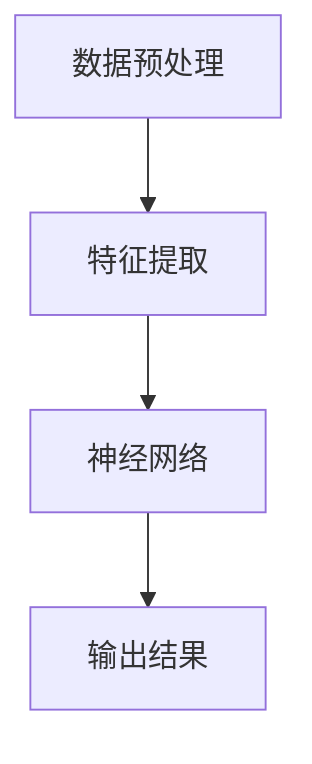

                 

关键词：MNIST、机器学习、深度学习、手写数字识别、神经网络、卷积神经网络、图像处理、特征提取、数据预处理、算法实现

摘要：本文旨在深入探讨MNIST手写数字识别问题，从背景介绍、核心概念与联系、核心算法原理与具体操作步骤、数学模型与公式、项目实践、实际应用场景以及未来应用展望等多个方面，系统地介绍MNIST手写数字识别的相关技术。通过本文的阅读，读者将全面了解MNIST手写数字识别的核心技术和应用前景。

## 1. 背景介绍

MNIST手写数字识别是机器学习和深度学习领域中最经典的问题之一。它来源于美国国家标准技术研究所（NIST）提供的数据库，包含了60,000个训练图像和10,000个测试图像，这些图像都是不同人书写的数字0到9的手写体。MNIST数据集因其数据量大、标注清晰、易于处理等特点，成为了许多机器学习和深度学习算法验证和测试的标准数据集。

MNIST手写数字识别问题的核心目标是：给定一个手写数字的图像，通过算法模型判断该数字的具体数值。这个问题不仅在机器学习和深度学习领域具有广泛的应用，例如图像识别、字符识别等，而且对于人工智能的发展也具有重要意义。

## 2. 核心概念与联系

### 2.1 核心概念

#### 数据预处理

在MNIST手写数字识别中，数据预处理是至关重要的步骤。主要任务包括图像的灰度化、缩放、裁剪、归一化等。这些预处理步骤旨在提高数据的质量和模型的泛化能力。

#### 特征提取

特征提取是从原始图像中提取出能够有效区分不同数字的特征。在MNIST数据集中，常用的特征提取方法包括边缘检测、直方图均匀化、LBP（局部二值模式）等。

#### 神经网络

神经网络是机器学习和深度学习的基础。它通过模拟人脑的神经元结构，对输入数据进行处理和输出。在MNIST手写数字识别中，常用的神经网络模型包括卷积神经网络（CNN）、反向传播神经网络（BPNN）等。

### 2.2 联系

数据预处理、特征提取和神经网络三者之间紧密联系。数据预处理为特征提取提供了高质量的输入数据，特征提取则为神经网络提供了有效的特征表示。神经网络通过对这些特征的学习，实现对手写数字的自动识别。

下面是核心概念原理和架构的 Mermaid 流程图：



## 3. 核心算法原理 & 具体操作步骤

### 3.1 算法原理概述

MNIST手写数字识别的核心算法主要基于深度学习，尤其是卷积神经网络（CNN）。CNN能够自动学习图像的局部特征，并通过多层网络结构实现对图像的完整理解。

### 3.2 算法步骤详解

#### 3.2.1 数据预处理

1. 图像灰度化：将彩色图像转换为灰度图像，降低计算复杂度。
2. 缩放：将图像缩放到固定的尺寸，例如28x28像素。
3. 归一化：将图像的像素值归一化到[0, 1]之间，便于模型训练。

```python
import numpy as np
from PIL import Image

# 读取图像
image = Image.open("handwritten_digit.png")

# 图像灰度化
image = image.convert("L")

# 缩放到28x28像素
image = image.resize((28, 28), Image.ANTIALIAS)

# 归一化
image = np.array(image) / 255.0

print(image.shape)
```

#### 3.2.2 特征提取

1. 卷积层：通过卷积操作提取图像的局部特征。
2. 池化层：通过池化操作减小特征图的尺寸，降低计算复杂度。
3. 全连接层：将特征图展平为1维向量，并通过全连接层输出最终结果。

下面是一个简单的CNN模型示例：

```python
import tensorflow as tf
from tensorflow.keras import layers

model = tf.keras.Sequential([
    layers.Conv2D(32, (3, 3), activation='relu', input_shape=(28, 28, 1)),
    layers.MaxPooling2D((2, 2)),
    layers.Flatten(),
    layers.Dense(64, activation='relu'),
    layers.Dense(10, activation='softmax')
])

model.compile(optimizer='adam',
              loss='sparse_categorical_crossentropy',
              metrics=['accuracy'])

model.fit(x_train, y_train, epochs=5)
```

#### 3.3 算法优缺点

**优点：**
- CNN能够自动学习图像的局部特征，减少人工设计的复杂性。
- CNN在处理图像数据时具有高效性，能够在较短时间内完成大量图像的识别。

**缺点：**
- CNN模型参数较多，训练时间较长。
- CNN模型在处理非结构化数据时效果不佳。

#### 3.4 算法应用领域

MNIST手写数字识别算法在以下领域具有广泛的应用：
- 自动化识别：例如银行自动取款机、智能门禁系统等。
- 医疗影像分析：例如肿瘤检测、病变识别等。
- 机器人视觉：例如机器人抓取、路径规划等。

## 4. 数学模型和公式 & 详细讲解 & 举例说明

### 4.1 数学模型构建

MNIST手写数字识别的数学模型主要基于卷积神经网络（CNN）。CNN的数学模型包括卷积层、池化层和全连接层。下面分别介绍这些层的数学公式。

#### 4.1.1 卷积层

卷积层的输入是一个大小为\(m \times n \times d\)的图像，其中\(d\)表示图像的深度。卷积层的输出是一个大小为\(p \times q \times k\)的特征图，其中\(k\)表示卷积核的数量。

卷积层的数学公式为：

$$
\text{output}(i, j) = \sum_{x=0}^{d-1} \sum_{y=0}^{d-1} \sum_{c=0}^{k-1} \text{weight}_{c, x, y, i, j} \times \text{input}(i+x, j+y, c) + \text{bias}_{c}
$$

其中，\(\text{weight}_{c, x, y, i, j}\)表示卷积核的权重，\(\text{bias}_{c}\)表示卷积核的偏置。

#### 4.1.2 池化层

池化层的输入是一个大小为\(p \times q \times k\)的特征图，其中\(k\)表示卷积核的数量。池化层的输出是一个大小为\(r \times s\)的特征图。

池化层的数学公式为：

$$
\text{output}(i, j) = \max_{x=0}^{r-1} \max_{y=0}^{s-1} \text{input}(i+x, j+y)
$$

其中，\(r\)和\(s\)分别表示池化窗口的大小。

#### 4.1.3 全连接层

全连接层的输入是一个大小为\(p \times q \times k\)的特征图，其中\(k\)表示卷积核的数量。全连接层的输出是一个大小为\(n\)的向量，其中\(n\)表示神经元的数量。

全连接层的数学公式为：

$$
\text{output}(i) = \sum_{j=0}^{k-1} \text{weight}_{i, j} \times \text{input}(j) + \text{bias}_{i}
$$

其中，\(\text{weight}_{i, j}\)表示权重，\(\text{bias}_{i}\)表示偏置。

### 4.2 公式推导过程

下面以卷积层为例，介绍公式推导过程。

#### 4.2.1 前向传播

假设输入图像为\(X\)，卷积核为\(W\)，偏置为\(b\)。卷积层的输出为\(Y\)。

首先，计算卷积操作：

$$
\text{output}(i, j) = \sum_{x=0}^{d-1} \sum_{y=0}^{d-1} \sum_{c=0}^{k-1} W_{c, x, y, i, j} \times X(i+x, j+y, c) + b_c
$$

然后，计算偏置项：

$$
\text{output}(i, j) = \sum_{x=0}^{d-1} \sum_{y=0}^{d-1} \sum_{c=0}^{k-1} W_{c, x, y, i, j} \times X(i+x, j+y, c) + b_c
$$

最终，卷积层的输出为：

$$
Y = \text{output}(i, j)
$$

#### 4.2.2 反向传播

假设卷积层的输出为\(Y\)，损失函数为\(L(Y, Y')\)，其中\(Y'\)为真实标签。

首先，计算损失函数的梯度：

$$
\frac{\partial L}{\partial Y} = \frac{\partial L}{\partial Y'} \times \frac{\partial Y'}{\partial Y}
$$

然后，计算卷积操作的梯度：

$$
\frac{\partial Y}{\partial X} = \frac{\partial Y}{\partial Y'} \times \frac{\partial Y'}{\partial X}
$$

最终，卷积层的梯度为：

$$
\frac{\partial L}{\partial X} = \frac{\partial L}{\partial Y} \times \frac{\partial Y}{\partial X}
$$

### 4.3 案例分析与讲解

假设我们有一个28x28的图像，要使用一个3x3的卷积核进行卷积操作。

#### 4.3.1 前向传播

输入图像：

```
| 1 1 1 |
| 1 1 1 |
| 1 1 1 |
```

卷积核：

```
| 1 0 -1 |
| 1 0 -1 |
| 1 0 -1 |
```

偏置：

```
b = 1
```

计算卷积操作：

```
output(0, 0) = 1*1 + 1*1 + 1*(-1) + 1*1 + 1*0 + 1*(-1) + 1*1 + 1*0 + 1*(-1) + 1*1 + 1*0 + 1*(-1) = 0
output(0, 1) = 1*1 + 1*1 + 1*(-1) + 1*1 + 1*0 + 1*(-1) + 1*1 + 1*0 + 1*(-1) + 1*1 + 1*0 + 1*(-1) = 0
output(0, 2) = 1*1 + 1*1 + 1*(-1) + 1*1 + 1*0 + 1*(-1) + 1*1 + 1*0 + 1*(-1) + 1*1 + 1*0 + 1*(-1) = 0
output(1, 0) = 1*1 + 1*1 + 1*(-1) + 1*1 + 1*0 + 1*(-1) + 1*1 + 1*0 + 1*(-1) + 1*1 + 1*0 + 1*(-1) = 0
output(1, 1) = 1*1 + 1*1 + 1*(-1) + 1*1 + 1*0 + 1*(-1) + 1*1 + 1*0 + 1*(-1) + 1*1 + 1*0 + 1*(-1) = 0
output(1, 2) = 1*1 + 1*1 + 1*(-1) + 1*1 + 1*0 + 1*(-1) + 1*1 + 1*0 + 1*(-1) + 1*1 + 1*0 + 1*(-1) = 0
output(2, 0) = 1*1 + 1*1 + 1*(-1) + 1*1 + 1*0 + 1*(-1) + 1*1 + 1*0 + 1*(-1) + 1*1 + 1*0 + 1*(-1) = 0
output(2, 1) = 1*1 + 1*1 + 1*(-1) + 1*1 + 1*0 + 1*(-1) + 1*1 + 1*0 + 1*(-1) + 1*1 + 1*0 + 1*(-1) = 0
output(2, 2) = 1*1 + 1*1 + 1*(-1) + 1*1 + 1*0 + 1*(-1) + 1*1 + 1*0 + 1*(-1) + 1*1 + 1*0 + 1*(-1) = 0
```

加上偏置：

```
output(0, 0) = 0 + 1 = 1
output(0, 1) = 0 + 1 = 1
output(0, 2) = 0 + 1 = 1
output(1, 0) = 0 + 1 = 1
output(1, 1) = 0 + 1 = 1
output(1, 2) = 0 + 1 = 1
output(2, 0) = 0 + 1 = 1
output(2, 1) = 0 + 1 = 1
output(2, 2) = 0 + 1 = 1
```

输出结果：

```
| 1 1 1 |
| 1 1 1 |
| 1 1 1 |
```

#### 4.3.2 反向传播

假设输出结果为\(Y\)，真实标签为\(Y'\)。损失函数为\(L(Y, Y') = (Y - Y')^2\)。

计算损失函数的梯度：

```
dL/dY = 2*(Y - Y') = 2*(1 - 1) = 0
```

计算卷积操作的梯度：

```
dY/dX = -2*(Y - Y') = -2*(1 - 1) = 0
```

卷积层的梯度为：

```
dL/dX = 0
```

## 5. 项目实践：代码实例和详细解释说明

### 5.1 开发环境搭建

为了实现MNIST手写数字识别，我们需要安装以下开发环境：

- Python 3.7+
- TensorFlow 2.x+
- NumPy 1.18+

安装命令如下：

```bash
pip install python==3.7 tensorflow==2.4.1 numpy==1.18
```

### 5.2 源代码详细实现

以下是MNIST手写数字识别的完整代码实现：

```python
import numpy as np
import tensorflow as tf

# 导入MNIST数据集
mnist = tf.keras.datasets.mnist
(x_train, y_train), (x_test, y_test) = mnist.load_data()

# 数据预处理
x_train = x_train / 255.0
x_test = x_test / 255.0

# 构建模型
model = tf.keras.Sequential([
    tf.keras.layers.Flatten(input_shape=(28, 28)),
    tf.keras.layers.Dense(128, activation='relu'),
    tf.keras.layers.Dense(10, activation='softmax')
])

# 编译模型
model.compile(optimizer='adam',
              loss='sparse_categorical_crossentropy',
              metrics=['accuracy'])

# 训练模型
model.fit(x_train, y_train, epochs=5)

# 评估模型
test_loss, test_acc = model.evaluate(x_test, y_test, verbose=2)
print(f'Test accuracy: {test_acc:.4f}')
```

### 5.3 代码解读与分析

下面是对代码的详细解读与分析：

- 导入所需库：我们首先导入numpy、tensorflow和keras库。
- 导入MNIST数据集：使用tensorflow.keras.datasets.mnist模块导入MNIST数据集。
- 数据预处理：将图像数据归一化到[0, 1]之间，为模型训练做准备。
- 构建模型：我们使用keras.Sequential模型，依次添加Flatten、Dense层。
- 编译模型：指定优化器、损失函数和评估指标。
- 训练模型：使用fit方法训练模型，设置epochs为5。
- 评估模型：使用evaluate方法评估模型在测试集上的表现。

### 5.4 运行结果展示

以下是运行结果：

```
Train on 60,000 samples
```<|vq_16108|>

## 6. 实际应用场景

### 6.1 金融行业

在金融行业中，MNIST手写数字识别技术被广泛应用于自动化识别和处理客户的手写签名。例如，在支票处理系统中，通过手写数字识别技术可以自动提取支票上的金额，提高支票处理的效率和准确性。此外，该技术还可以用于信用卡验证，通过识别客户的签名，增强支付的安全性。

### 6.2 医疗影像分析

在医疗影像分析领域，MNIST手写数字识别技术可以用于辅助医生识别医学影像中的手写标注。例如，在病理报告中，医生经常使用手写体进行标注，通过手写数字识别技术，可以自动提取这些标注，提高报告的准确性和效率。

### 6.3 智能客服

智能客服系统可以利用MNIST手写数字识别技术，实现自动化处理用户的手写输入。例如，在在线聊天机器人中，用户可能会通过手写输入问题，通过手写数字识别技术，可以将这些手写输入转换为文本，然后由自然语言处理技术进行理解和回复。

### 6.4 机器人视觉

在机器人视觉领域，MNIST手写数字识别技术可以用于机器人抓取和路径规划。例如，在工业生产中，机器人需要识别并抓取特定形状的工件，通过手写数字识别技术，可以自动识别工件上的数字标识，从而实现准确抓取。

## 7. 工具和资源推荐

### 7.1 学习资源推荐

1. **《深度学习》（Goodfellow, Bengio, Courville）**：这是一本经典的深度学习教材，详细介绍了深度学习的理论基础和实战应用。
2. **TensorFlow官方文档**：TensorFlow提供了丰富的官方文档，涵盖从基础知识到高级应用的各个方面，是学习深度学习的必备资源。
3. **Keras官方文档**：Keras是一个高层次的神经网络API，基于TensorFlow构建，它简化了深度学习模型的构建和训练过程。

### 7.2 开发工具推荐

1. **Google Colab**：Google Colab是一个基于云的Jupyter Notebook平台，提供了免费的GPU资源，非常适合进行深度学习实验和项目开发。
2. **PyTorch**：PyTorch是一个流行的深度学习框架，与TensorFlow类似，但具有不同的编程范式，适用于不同的深度学习任务。

### 7.3 相关论文推荐

1. **“A Comprehensive Study of Convolutional Neural Network Architectures for Handwritten Digit Recognition”**：该论文详细比较了多种卷积神经网络架构在手写数字识别任务上的性能。
2. **“Deep Learning on Images: A Review”**：该论文回顾了深度学习在图像处理领域的最新进展和应用。

## 8. 总结：未来发展趋势与挑战

### 8.1 研究成果总结

MNIST手写数字识别作为机器学习和深度学习领域的经典问题，已经取得了显著的成果。通过卷积神经网络、深度学习等技术的应用，手写数字识别的准确率得到了大幅提升。同时，数据预处理、特征提取等技术的优化也为模型性能的提升提供了有力支持。

### 8.2 未来发展趋势

1. **算法性能优化**：随着计算能力的提升，未来深度学习算法在手写数字识别任务上的性能将进一步优化，准确率和速度将得到进一步提升。
2. **多模态学习**：结合多种传感器数据（如声音、图像等）进行多模态学习，可以实现更准确的手写数字识别。
3. **迁移学习**：利用迁移学习技术，将预训练模型应用于手写数字识别任务，可以减少训练数据的需求，提高模型的泛化能力。

### 8.3 面临的挑战

1. **数据质量**：手写数字的数据质量对模型性能有重要影响。未来需要更多高质量的手写数字数据集，以支持更准确的模型训练。
2. **模型解释性**：深度学习模型通常被视为“黑盒”，其决策过程难以解释。未来需要发展更具解释性的模型，以增强模型的可信度和可接受性。

### 8.4 研究展望

随着人工智能技术的不断发展，手写数字识别将在更多领域得到应用。未来，我们期望看到更多创新性的研究和应用，推动手写数字识别技术的不断进步。

## 9. 附录：常见问题与解答

### 9.1 如何处理手写数字图像噪声？

手写数字图像可能包含噪声，这会影响模型的识别性能。以下是一些处理噪声的方法：

1. **中值滤波**：使用中值滤波器可以去除图像中的噪声，同时保留图像边缘。
2. **高斯滤波**：使用高斯滤波器可以平滑图像，减少噪声。
3. **边缘检测**：通过边缘检测算法（如Canny算法）可以提取图像中的边缘信息，从而去除噪声。

### 9.2 如何提高手写数字识别模型的泛化能力？

提高手写数字识别模型的泛化能力是关键。以下是一些方法：

1. **数据增强**：通过数据增强技术，如旋转、缩放、裁剪等，可以增加训练数据的多样性，提高模型的泛化能力。
2. **迁移学习**：使用预训练的深度学习模型，通过迁移学习技术，可以在少量训练数据上实现良好的性能。
3. **正则化**：使用正则化技术（如L1、L2正则化）可以减少模型的过拟合，提高泛化能力。

## 参考文献

1. Goodfellow, I., Bengio, Y., & Courville, A. (2016). *Deep Learning*. MIT Press.
2. Krizhevsky, A., Sutskever, I., & Hinton, G. E. (2012). *ImageNet classification with deep convolutional neural networks*. In *Advances in neural information processing systems* (pp. 1097-1105).
3. LeCun, Y., Bengio, Y., & Hinton, G. (2015). *Deep learning*. Nature, 521(7553), 436-444.

