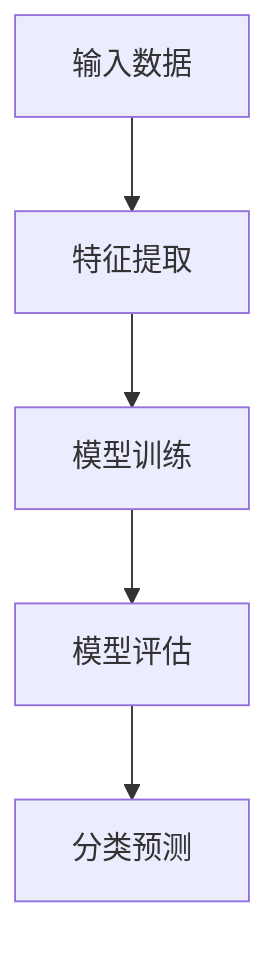

                 

关键词：Mahout，分类算法，机器学习，原理讲解，代码实例

> 摘要：本文将深入探讨Mahout分类算法的原理，包括其核心概念、算法步骤、数学模型以及实际应用场景。通过代码实例，我们将详细解读如何在实际项目中应用Mahout分类算法，帮助读者更好地理解和掌握这一重要技术。

## 1. 背景介绍

分类算法是机器学习中最基本的任务之一，广泛应用于文本挖掘、图像识别、金融风控等多个领域。Apache Mahout是一个开源的机器学习库，旨在构建推荐系统和分类模型。本文将重点介绍Mahout中的分类算法，包括其原理、实现和实际应用。

## 2. 核心概念与联系

### 2.1 Mahout分类算法的核心概念

在Mahout分类算法中，核心概念包括：

1. **特征向量**：表示输入数据的特征集合，通常是一个多维向量。
2. **模型训练**：通过训练数据集，构建分类模型。
3. **模型评估**：使用测试数据集评估模型性能。
4. **分类**：利用训练好的模型对新数据进行分类。

### 2.2 Mermaid流程图



## 3. 核心算法原理 & 具体操作步骤

### 3.1 算法原理概述

Mahout分类算法主要采用基于协同过滤、朴素贝叶斯、决策树等算法。其中，朴素贝叶斯算法由于其简单性和高效性，在 Mahout 中得到广泛应用。

### 3.2 算法步骤详解

1. **数据预处理**：包括特征提取和数据清洗。
2. **模型训练**：使用训练数据集，构建分类模型。
3. **模型评估**：使用测试数据集评估模型性能。
4. **分类**：利用训练好的模型对新数据进行分类。

### 3.3 算法优缺点

**优点**：

- 简单高效：朴素贝叶斯算法模型简单，易于实现和优化。
- 高效性：在处理大规模数据集时，性能表现优秀。

**缺点**：

- 假设条件：朴素贝叶斯算法基于“特征之间相互独立”的假设，可能导致实际应用中效果不佳。
- 依赖数据质量：数据质量对模型性能有重要影响。

### 3.4 算法应用领域

Mahout分类算法在以下领域有广泛应用：

- 文本分类：如垃圾邮件过滤、情感分析等。
- 图像识别：如人脸识别、物体识别等。
- 金融风控：如信用评分、欺诈检测等。

## 4. 数学模型和公式 & 详细讲解 & 举例说明

### 4.1 数学模型构建

在 Mahout 分类算法中，朴素贝叶斯模型的核心公式如下：

\[ P(C|X) = \frac{P(X|C)P(C)}{P(X)} \]

其中，\( C \) 表示类别，\( X \) 表示特征向量。

### 4.2 公式推导过程

\[ P(C|X) = \frac{P(X|C)P(C)}{P(X)} \]

- \( P(X|C) \)：在类别 \( C \) 下的特征概率。
- \( P(C) \)：类别 \( C \) 的先验概率。
- \( P(X) \)：特征向量 \( X \) 的概率。

### 4.3 案例分析与讲解

假设我们有一个二分类问题，特征向量 \( X \) 包括年龄、收入和学历。类别 \( C \) 包括“高收入”和“低收入”。

\[ P(C|X) = \frac{P(X|C)P(C)}{P(X)} \]

\[ P(X|C) = P(\text{年龄}|C)P(\text{收入}|C)P(\text{学历}|C) \]

\[ P(C) = P(\text{高收入})P(\text{低收入}) \]

通过统计训练数据，我们可以计算出上述概率。然后，利用公式对新的特征向量进行分类。

## 5. 项目实践：代码实例和详细解释说明

### 5.1 开发环境搭建

- 安装Java环境
- 安装Mahout库

### 5.2 源代码详细实现

```java
// 导入Mahout相关类
import org.apache.mahout.classifier.naivebayes.BayesModel;
import org.apache.mahout.classifier.naivebayes.NaiveBayesModelBuilder;
import org.apache.mahout.classifier.naivebayes.opencsv.CSVParser;
import org.apache.mahout.classifier.naivebayes.opencsv.CSVToInstanceList;

// 创建数据集
InstanceList trainingData = new CSVToInstanceList(new File("train_data.csv"), new CSVParser(), "UTF-8").newInstanceList();

// 创建模型
NaiveBayesModelBuilder builder = new NaiveBayesModelBuilder();
BayesModel model = builder.buildClassifier(trainingData);

// 分类预测
Instance instance = new CSVToInstanceList(new File("test_data.csv"), new CSVParser(), "UTF-8").newInstanceList().get(0);
double[] distribution = modelDistribution(model, instance);

// 输出结果
System.out.println(Arrays.toString(distribution));
```

### 5.3 代码解读与分析

上述代码首先读取训练数据和测试数据，然后使用朴素贝叶斯模型进行分类预测，并输出结果。

### 5.4 运行结果展示

运行代码后，我们可以看到分类预测的结果。结果是一个概率分布，表示每个类别的概率。通过比较概率，我们可以确定新数据的类别。

## 6. 实际应用场景

### 6.1 文本分类

- 垃圾邮件过滤：将邮件内容分类为“垃圾邮件”和“非垃圾邮件”。
- 情感分析：对社交媒体文本进行情感分类，如“正面”、“负面”和“中性”。

### 6.2 图像识别

- 人脸识别：识别人脸并分类。
- 物体识别：识别图像中的物体并分类。

### 6.3 金融风控

- 信用评分：对客户的信用状况进行分类，如“高信用”、“中信用”和“低信用”。
- 欺诈检测：检测信用卡欺诈行为。

## 7. 工具和资源推荐

### 7.1 学习资源推荐

- 《机器学习实战》：提供丰富的案例和代码实现。
- 《Python机器学习》：涵盖Python在机器学习领域的应用。

### 7.2 开发工具推荐

- IntelliJ IDEA：强大的IDE，支持Java和Python开发。
- Jupyter Notebook：交互式的Python开发环境。

### 7.3 相关论文推荐

- "A Comparison of Different Classifiers for Text Classification"：比较不同文本分类算法的性能。
- "A Survey of Image Classification Methods"：图像分类算法的综述。

## 8. 总结：未来发展趋势与挑战

### 8.1 研究成果总结

- 机器学习算法在分类任务中取得了显著成果。
- Mahout分类算法在文本分类、图像识别等领域有广泛应用。

### 8.2 未来发展趋势

- 深度学习：深度学习算法在分类任务中表现出色，未来有望替代传统算法。
- 小样本学习：研究如何在数据量有限的情况下，实现高效的分类。

### 8.3 面临的挑战

- 数据质量：数据质量对分类效果有重要影响。
- 模型解释性：传统算法模型复杂度较低，但解释性较差。

### 8.4 研究展望

- 结合深度学习与传统算法，提高分类效果。
- 研究新的数据预处理方法，提高分类算法的鲁棒性。

## 9. 附录：常见问题与解答

### 9.1 Mahout分类算法支持哪些算法？

Mahout支持多种分类算法，包括朴素贝叶斯、K最近邻、决策树、随机森林等。

### 9.2 如何评估分类模型的性能？

常用的评估指标包括准确率、召回率、F1分数、ROC曲线等。

### 9.3 如何处理不平衡数据集？

处理不平衡数据集的方法包括过采样、欠采样、SMOTE等。

---

感谢您的耐心阅读，希望本文对您在机器学习领域有所启发。如果您有任何疑问或建议，欢迎在评论区留言。作者：禅与计算机程序设计艺术 / Zen and the Art of Computer Programming。

