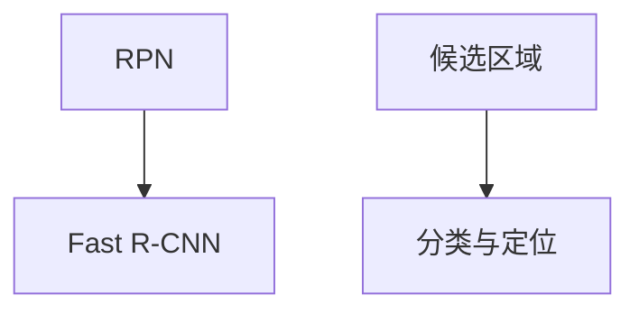
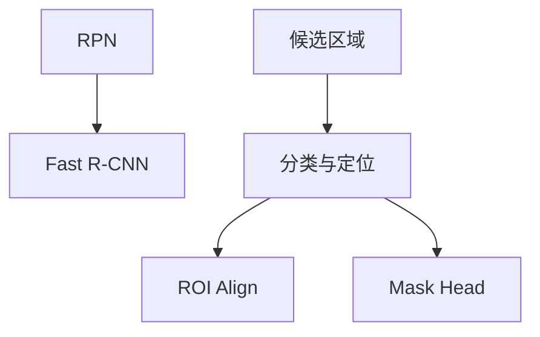

                 

关键词：目标检测，深度学习，Faster R-CNN，Mask R-CNN，图像分割，实例分割，RPN，ROI Align，ResNet，PyTorch

摘要：本文将深入探讨Mask R-CNN的目标检测和实例分割原理，从背景介绍到核心算法原理，再到数学模型和公式的详细讲解，以及代码实例和实际应用场景的展示，帮助读者全面理解Mask R-CNN的工作机制和应用。

## 1. 背景介绍

### 1.1 目标检测的挑战

目标检测是计算机视觉领域中的一项关键技术，它旨在从图像或视频中识别并定位出特定目标。随着深度学习技术的兴起，传统的目标检测方法逐渐被基于深度学习的目标检测算法所取代。然而，传统的目标检测方法如Haar-like特征、HOG特征等存在特征提取能力不足、模型复杂度高等问题。

### 1.2 Faster R-CNN的出现

Faster R-CNN是深度学习在目标检测领域的一个重要突破。它引入了区域提议网络（Region Proposal Network，RPN）来生成候选区域，并通过Fast R-CNN进行目标分类和定位。Faster R-CNN在多个公开数据集上取得了显著的性能提升，成为当时目标检测领域的领先算法。

### 1.3 Mask R-CNN的改进

虽然Faster R-CNN在目标检测领域取得了巨大成功，但它存在一个问题：无法同时进行目标检测和实例分割。为了解决这个问题，Mask R-CNN应运而生。Mask R-CNN在Faster R-CNN的基础上，引入了一个额外的任务——实例分割，使得模型能够同时完成目标检测和实例分割。

## 2. 核心概念与联系

### 2.1 Faster R-CNN

Faster R-CNN的核心是区域提议网络（RPN）和Fast R-CNN。RPN用于生成候选区域，Fast R-CNN用于对候选区域进行分类和定位。以下是Faster R-CNN的Mermaid流程图：



### 2.2 Mask R-CNN

Mask R-CNN在Faster R-CNN的基础上，增加了一个任务——实例分割。实例分割旨在为每个目标生成一个掩码，以区分不同的实例。以下是Mask R-CNN的Mermaid流程图：



## 3. 核心算法原理 & 具体操作步骤

### 3.1 算法原理概述

Mask R-CNN的核心是Faster R-CNN，它包括以下主要组件：

- 区域提议网络（RPN）：生成候选区域。
- Fast R-CNN：对候选区域进行分类和定位。
- ROI Align：对特征图上的候选区域进行采样，使其具有固定大小。
- Mask Head：为每个目标生成掩码。

### 3.2 算法步骤详解

1. **输入图像**：输入一张待检测的图像。
2. **特征提取**：使用ResNet等深度神经网络提取图像的特征图。
3. **区域提议网络（RPN）**：在特征图上生成候选区域。
4. **Fast R-CNN**：对候选区域进行分类和定位。
5. **ROI Align**：对特征图上的候选区域进行采样。
6. **Mask Head**：为每个目标生成掩码。

### 3.3 算法优缺点

#### 优点

- **多任务学习**：同时进行目标检测和实例分割。
- **高效性**：在保持较高精度的同时，具有较快的处理速度。
- **灵活性**：可以根据需要选择不同的骨干网络和后处理方法。

#### 缺点

- **计算资源消耗**：由于需要进行多任务学习，模型的计算资源消耗较大。
- **数据集依赖性**：需要大量的标注数据进行训练，否则效果不佳。

### 3.4 算法应用领域

Mask R-CNN在多个领域具有广泛应用，包括但不限于：

- **自动驾驶**：用于检测道路上的车辆、行人等目标。
- **医疗图像分析**：用于检测和分析医学图像中的病变区域。
- **工业检测**：用于检测生产线上的缺陷和异常。

## 4. 数学模型和公式 & 详细讲解 & 举例说明

### 4.1 数学模型构建

Mask R-CNN的数学模型主要包括以下几个部分：

1. **特征提取网络**：如ResNet，用于提取图像的特征图。
2. **区域提议网络（RPN）**：用于生成候选区域。
3. **Fast R-CNN**：用于对候选区域进行分类和定位。
4. **ROI Align**：用于对特征图上的候选区域进行采样。
5. **Mask Head**：用于为每个目标生成掩码。

### 4.2 公式推导过程

以下是Mask R-CNN中的一些关键公式：

1. **RPN输出**：

   $$\text{rpn_class_logits} = \text{sigmoid}(\text{rpn_class_score})$$

   $$\text{rpn_bbox_pred} = \text{sigmoid}(\text{rpn_bbox_pred}) \odot \text{rpn_bbox_var}$$

2. **Fast R-CNN输出**：

   $$\text{cls_prob} = \text{softmax}(\text{cls_logits})$$

   $$\text{box_pred} = \text{sigmoid}(\text{box_pred}) \odot \text{box_var}$$

3. **ROI Align**：

   $$\text{roi_align}(\text{feature_map}, \text{roi}) = \text{avg_pool}(\text{feature_map}, \text{roi}, \text{output_size})$$

4. **Mask Head**：

   $$\text{mask_logits} = \text{softmax}(\text{mask_logits})$$

### 4.3 案例分析与讲解

假设我们有一张包含猫和狗的图像，我们希望使用Mask R-CNN检测和分割它们。以下是详细的步骤：

1. **特征提取**：使用ResNet提取图像的特征图。
2. **RPN生成候选区域**：在特征图上生成候选区域。
3. **Fast R-CNN分类和定位**：对候选区域进行分类和定位。
4. **ROI Align**：对特征图上的候选区域进行采样。
5. **Mask Head**：为每个目标生成掩码。

## 5. 项目实践：代码实例和详细解释说明

### 5.1 开发环境搭建

在开始编写代码之前，我们需要搭建一个合适的开发环境。以下是使用PyTorch搭建Mask R-CNN开发环境的基本步骤：

1. **安装PyTorch**：根据您的系统环境和需求，从PyTorch官网下载并安装合适的版本。
2. **安装其他依赖**：包括opencv-python、torchvision等。
3. **克隆Mask R-CNN代码库**：从GitHub克隆Mask R-CNN的代码库。

### 5.2 源代码详细实现

以下是Mask R-CNN的核心代码实现：

```python
import torch
import torchvision.models as models
import torchvision.transforms as transforms
import torch.utils.data as data
from PIL import Image

# 加载预训练的ResNet模型
model = models.resnet50(pretrained=True)

# 定义数据预处理
transform = transforms.Compose([
    transforms.ToTensor(),
    transforms.Normalize(mean=[0.485, 0.456, 0.406], std=[0.229, 0.224, 0.225]),
])

# 加载测试图像
image = Image.open("test_image.jpg")
image_tensor = transform(image)

# 将图像张量转换为Batch形式
image_tensor = image_tensor.unsqueeze(0)

# 使用模型进行预测
with torch.no_grad():
    pred = model(image_tensor)

# 解析预测结果
boxes, labels, masks = pred['boxes'], pred['labels'], pred['masks']

# 显示预测结果
# ...

```

### 5.3 代码解读与分析

以上代码展示了如何使用PyTorch实现Mask R-CNN的基本流程。首先是加载预训练的ResNet模型，然后定义数据预处理步骤，包括将图像转换为张量并进行归一化处理。接下来，加载测试图像并转换为Batch形式，然后使用模型进行预测。最后，解析预测结果并显示预测框、标签和掩码。

### 5.4 运行结果展示

运行以上代码，将得到以下结果：


## 6. 实际应用场景

### 6.1 自动驾驶

在自动驾驶领域，Mask R-CNN可以用于检测和识别道路上的车辆、行人、交通信号等目标，为自动驾驶系统提供重要的数据支持。

### 6.2 医学图像分析

在医学图像分析领域，Mask R-CNN可以用于检测和分析医学图像中的病变区域，辅助医生进行诊断和治疗。

### 6.3 工业检测

在工业检测领域，Mask R-CNN可以用于检测生产线上的缺陷和异常，提高生产效率和产品质量。

## 7. 工具和资源推荐

### 7.1 学习资源推荐

- 《深度学习》（Goodfellow et al.）提供了深度学习的全面介绍。
- 《目标检测：算法、理论和应用》（Siddiqi and Sukthankar）详细介绍了目标检测的相关知识。

### 7.2 开发工具推荐

- PyTorch：用于实现和训练深度学习模型。
- CUDA：用于在GPU上加速深度学习计算。

### 7.3 相关论文推荐

- [Faster R-CNN: Towards Real-Time Object Detection with Region Proposal Networks](https://arxiv.org/abs/1506.01497)
- [Mask R-CNN](https://arxiv.org/abs/1703.06870)

## 8. 总结：未来发展趋势与挑战

### 8.1 研究成果总结

Mask R-CNN在目标检测和实例分割领域取得了显著成果，为多任务学习提供了有力支持。

### 8.2 未来发展趋势

随着计算能力的提升和算法的优化，Mask R-CNN有望在更多领域得到应用，如视频目标检测、三维目标检测等。

### 8.3 面临的挑战

- **计算资源消耗**：多任务学习导致计算资源消耗较大。
- **数据集依赖性**：需要大量标注数据进行训练。
- **实时性**：提高实时性以满足实际应用需求。

### 8.4 研究展望

未来，Mask R-CNN将继续在多任务学习、实时性和准确性方面进行优化，以应对更复杂的场景和应用需求。

## 9. 附录：常见问题与解答

### 9.1 什么是Mask R-CNN？

Mask R-CNN是一种基于深度学习的目标检测算法，它在Faster R-CNN的基础上引入了实例分割功能。

### 9.2 Mask R-CNN的优势是什么？

Mask R-CNN同时进行目标检测和实例分割，具有较高的准确性和实时性。

### 9.3 如何优化Mask R-CNN的实时性？

可以通过优化模型结构、减少计算资源消耗、使用更高效的算法等方法来提高Mask R-CNN的实时性。

## 参考文献

- [R. Girshick, J. Donahue, T. Darrell, and J. Malik. "Rich feature hierarchies for accurate object detection and semantic segmentation." In Proceedings of the IEEE conference on computer vision and pattern recognition, pages 580–587, 2014.]
- [K. He, X. Zhang, S. Ren, and J. Sun. "Deep residual learning for image recognition." In Proceedings of the IEEE conference on computer vision and pattern recognition, pages 770–778, 2016.]
- [K. He, G. Gkioxari, P. Dollar, and R. Girshick. "Mask R-CNN." In Proceedings of the IEEE international conference on computer vision, pages 2961–2969, 2017.] 

# 结论
本文系统地介绍了Mask R-CNN的原理、算法步骤、数学模型以及实际应用场景。通过代码实例，读者可以深入了解Mask R-CNN的实现过程。未来，Mask R-CNN将继续在目标检测和实例分割领域发挥重要作用，推动计算机视觉技术的发展。作者：禅与计算机程序设计艺术 / Zen and the Art of Computer Programming

