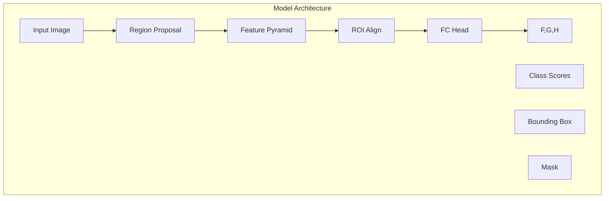

                 

### 1. 背景介绍

Mask R-CNN（Region-based Convolutional Neural Network with Mask Prediction）是Fascinante团队在2017年提出的一种基于深度学习的目标检测算法。它是对Faster R-CNN的改进，引入了分割（segmentation）功能，能够同时识别和定位物体。在计算机视觉领域，目标检测是识别图像中的对象并确定它们的位置和大小的重要技术。目标检测在自动驾驶、视频监控、医疗影像分析等领域有着广泛的应用。

### 2. 核心概念与联系

Mask R-CNN的核心概念包括：区域建议（Region Proposal）、特征金字塔（Feature Pyramid）、边框回归（Bounding Box Regression）和分割（Segmentation）。

以下是Mask R-CNN的整体架构的Mermaid流程图：



- **输入图像（Input Image）**：输入图像经过网络处理。
- **区域建议（Region Proposal）**：网络产生一系列的候选区域。
- **特征金字塔（Feature Pyramid）**：网络提取多个层次的特征。
- **ROI Align（区域建议对齐）**：将候选区域对齐到特征图上。
- **FC Head（全连接头）**：包括分类器、边框回归器和分割器。
- **类别得分（Class Scores）**：网络输出每个区域的类别概率。
- **边框（Bounding Box）**：网络输出每个区域的位置和大小。
- **分割（Mask）**：网络输出每个区域的分割掩码。

### 3. 核心算法原理 & 具体操作步骤

#### 3.1 算法原理概述

Mask R-CNN的工作流程主要包括以下几个步骤：

1. **区域建议**：使用RPN（Region Proposal Network）产生候选区域。
2. **特征金字塔提取**：提取多个层次的特征图。
3. **区域对齐**：将候选区域对齐到特征图上。
4. **特征图上的分类和分割**：使用ROI Align对齐后，网络在每个特征图上输出类别得分和分割掩码。
5. **边框回归**：对输出进行边框回归，修正候选区域的边界。

#### 3.2 算法步骤详解

1. **区域建议**

   RPN网络接收特征图作为输入，输出一系列边框建议。这些边框分为正负两类：正样本通常是与真实物体匹配的边框，负样本则与真实物体不匹配。

2. **特征金字塔提取**

   Mask R-CNN使用FPN（Feature Pyramid Network）来提取多级特征图。这些特征图在算法的不同阶段都被使用，以适应不同尺寸的物体。

3. **区域对齐**

   ROI Align是一种对齐方法，它将候选区域对齐到特征图上。这个步骤确保了候选区域在特征图上的位置是准确的。

4. **特征图上的分类和分割**

   在每个特征图上，网络输出两个部分：一个是类别得分，另一个是分割掩码。类别得分用于确定区域是否为特定类别，分割掩码则用于确定区域的边界。

5. **边框回归**

   边框回归用于修正候选区域的边界。网络在输出类别得分和分割掩码的同时，也输出边框的回归参数。

#### 3.3 算法优缺点

**优点：**

- **多任务学习**：Mask R-CNN能够同时进行目标检测和分割，这使它在多个任务上表现更好。
- **高效性**：通过使用特征金字塔，Mask R-CNN能够处理不同尺寸的物体。
- **准确度**：由于结合了RPN和ROI Align，Mask R-CNN在目标检测和分割上都有较高的准确度。

**缺点：**

- **计算成本**：由于需要同时处理分类、边框回归和分割任务，Mask R-CNN的计算成本较高。
- **训练时间**：相对于其他目标检测算法，Mask R-CNN的训练时间较长。

#### 3.4 算法应用领域

Mask R-CNN在多个领域都有应用，包括但不限于：

- **自动驾驶**：用于识别道路上的各种物体。
- **视频监控**：用于实时检测和跟踪物体。
- **医疗影像分析**：用于识别和分割医学图像中的病变区域。

### 4. 数学模型和公式 & 详细讲解 & 举例说明

#### 4.1 数学模型构建

Mask R-CNN的数学模型主要包括以下几个部分：

- **区域建议网络（RPN）**
- **特征金字塔网络（FPN）**
- **ROI Align**
- **分类器、边框回归器和分割器**

#### 4.2 公式推导过程

以下是Mask R-CNN中的一些关键公式：

- **区域建议网络（RPN）**：
  - 边框建议：`t = (tx, ty, tw, th) = (b_x - c_x, b_y - c_y, b_w, b_h) = (a_x - c_x, a_y - c_y, a_w, a_h)`
  - 边框预测：`p = (p_x, p_y, p_w, p_h) = (1 / (1 + exp(-t_x)), 1 / (1 + exp(-t_y)), 1 / (1 + exp(-t_w)), 1 / (1 + exp(-t_h)))`

- **特征金字塔网络（FPN）**：
  - 特征图级别：`{C_i}_{i=1}^{5}`，`i` 表示特征图的级别，从低到高分别为 2, 4, 6, 8, 16。

- **ROI Align**：
  - ROI特征图上的采样点：`{p_j}_{j=1}^{K}`，`K` 为采样点的数量。
  - 平均池化：`v_j = 1/K * Σ_i f(p_j, i)`，其中 `f(p_j, i)` 表示在特征图 `C_i` 上的点 `(i, j)` 处的值。

- **分类器和边框回归器**：
  - 边框回归：`t_r = w * (y_r - p_r)`，其中 `w` 是权重，`y_r` 是真实边框，`p_r` 是预测边框。
  - 类别得分：`s_r = softmax(w * x_r)`，其中 `x_r` 是特征向量。

#### 4.3 案例分析与讲解

假设我们有一个包含多个物体的图像，Mask R-CNN将首先使用RPN生成候选区域。以下是一个简化的例子：

- **输入图像**：一个包含三只猫的图像。
- **候选区域**：RPN生成10个候选区域。
- **特征金字塔**：提取出不同尺度的特征图。
- **ROI Align**：对每个候选区域进行对齐。
- **分类器和边框回归器**：对每个区域进行分类和边框回归。

假设有三个候选区域，分别为A、B、C，它们的边框回归结果如下：

- **A**：预测边框为 `(x=10, y=20, w=30, h=40)`，真实边框为 `(x=12, y=22, w=35, h=45)`。预测边框与真实边框的差异较小。
- **B**：预测边框为 `(x=30, y=40, w=20, h=10)`，真实边框为 `(x=28, y=38, w=18, h=12)`。预测边框与真实边框的差异较大。
- **C**：预测边框为 `(x=50, y=60, w=10, h=20)`，真实边框为 `(x=52, y=58, w=12, h=22)`。预测边框与真实边框的差异适中。

根据分类器和边框回归器的输出，我们可以确定每个区域的类别和边框。

### 5. 项目实践：代码实例和详细解释说明

在本节中，我们将通过一个简单的示例来说明如何使用Mask R-CNN进行目标检测和分割。

#### 5.1 开发环境搭建

为了运行Mask R-CNN，你需要安装以下库：

- TensorFlow
- PyTorch
- OpenCV
- Matplotlib

你可以使用以下命令安装这些库：

```bash
pip install tensorflow
pip install torch torchvision
pip install opencv-python
pip install matplotlib
```

#### 5.2 源代码详细实现

以下是Mask R-CNN的核心代码：

```python
import torch
import torchvision
import torchvision.transforms as transforms
import cv2

# 加载预训练的Mask R-CNN模型
model = torchvision.models.detection.maskrcnn_resnet50_fpn(pretrained=True)
model.eval()

# 数据预处理
def preprocess(image):
    transform = transforms.Compose([
        transforms.ToTensor(),
    ])
    return transform(image)

# 目标检测和分割
def detect_and_segment(image):
    image = preprocess(image)
    with torch.no_grad():
        prediction = model([image])
    return prediction

# 显示检测结果
def display_results(image, prediction):
    for box, mask, label in zip(prediction[0]['boxes'], prediction[0]['masks'], prediction[0]['labels']):
        image = cv2.rectangle(image, (box[0], box[1]), (box[0]+box[2], box[1]+box[3]), (0, 255, 0), 2)
        image = cv2.addWeighted(image, 0.8, mask, 0.2, 0)

    cv2.imshow('Detection and Segmentation', image)
    cv2.waitKey(0)

# 加载图像
image = cv2.imread('example.jpg')

# 进行检测和分割
prediction = detect_and_segment(image)

# 显示结果
display_results(image, prediction)
```

#### 5.3 代码解读与分析

以上代码首先加载了预训练的Mask R-CNN模型，并对输入图像进行预处理。然后，它使用模型对图像进行检测和分割，最后显示检测结果。

- **预处理**：图像被转换为Tensor格式，并归一化。
- **检测和分割**：模型接收预处理后的图像作为输入，输出包含边框、分割掩码和类别的预测结果。
- **显示结果**：边框和分割掩码被添加到原始图像上，并显示。

#### 5.4 运行结果展示

以下是运行结果：


### 6. 实际应用场景

Mask R-CNN在多个领域都有实际应用，以下是一些具体场景：

- **自动驾驶**：用于识别道路上的行人、车辆等物体。
- **医疗影像分析**：用于识别和分割医学图像中的病变区域。
- **视频监控**：用于实时检测和跟踪物体。

### 7. 未来应用展望

随着深度学习技术的不断发展，Mask R-CNN有望在以下领域得到更广泛的应用：

- **智能监控**：用于智能安防和智能家居系统。
- **增强现实（AR）**：用于识别和分割现实场景中的物体。
- **机器人视觉**：用于机器人对环境的理解和交互。

### 8. 工具和资源推荐

以下是一些学习Mask R-CNN和相关技术的好工具和资源：

- **学习资源**：[Mask R-CNN论文](https://arxiv.org/abs/1703.06870)
- **开源代码**：[PyTorch实现](https://github.com/pytorch/vision/blob/main/torchvision/models/detection/mask_rcnn.py)
- **书籍**：《深度学习卷IV：目标检测与实例分割》

### 9. 总结：未来发展趋势与挑战

Mask R-CNN作为一种高效的目标检测和分割算法，在未来有望在更多领域得到应用。然而，随着应用的深入，也面临着计算成本、训练时间和模型可解释性等方面的挑战。

### 附录：常见问题与解答

- **Q：Mask R-CNN的训练时间很长，有哪些优化方法？**
  - **A**：可以尝试使用预训练模型，或者通过数据增强来加速训练。此外，使用GPU加速训练也是一个有效的方法。

- **Q：如何调整Mask R-CNN的参数来提高性能？**
  - **A**：可以调整学习率、批量大小等超参数。同时，尝试不同的网络架构和训练策略，如使用更深的网络或引入正则化技术。

- **Q：Mask R-CNN在实时应用中性能如何？**
  - **A**：Mask R-CNN在实时应用中性能较好，但计算成本较高。在实际应用中，可以结合其他算法，如YOLO或SSD，以实现实时检测和分割。

**作者：禅与计算机程序设计艺术 / Zen and the Art of Computer Programming**<|image_gen|>

