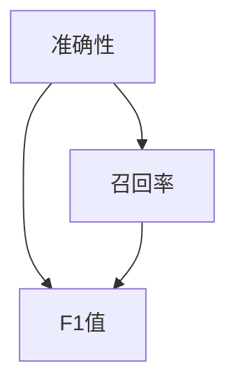

                 

关键词：模型评估指标、准确性、召回率、F1值、ROC曲线、混淆矩阵、交叉验证、机器学习、深度学习

摘要：本文将深入探讨模型评估指标的概念、原理以及如何在实际应用中进行评估。我们将分析准确性、召回率、F1值等常见指标，并通过代码实战案例，演示如何使用Python等工具进行模型的评估与优化。

## 1. 背景介绍

在机器学习和深度学习领域，模型评估是一个至关重要的环节。一个优秀的模型不仅需要具备良好的预测能力，还需要在多种评估指标下表现出色。评估指标的选取和解释直接影响我们对模型性能的理解和优化策略的制定。

常见的模型评估指标包括准确性、召回率、F1值、ROC曲线和混淆矩阵等。这些指标从不同角度反映了模型在预测任务中的表现，帮助我们全面评估模型的效果。

## 2. 核心概念与联系

### 2.1 指标定义

**准确性**：预测正确的样本数占总样本数的比例。

$$\text{Accuracy} = \frac{\text{预测正确的样本数}}{\text{总样本数}}$$

**召回率**：预测正确的正样本数占总正样本数的比例。

$$\text{Recall} = \frac{\text{预测正确的正样本数}}{\text{总正样本数}}$$

**F1值**：准确性和召回率的调和平均值。

$$\text{F1值} = 2 \times \frac{\text{准确率} \times \text{召回率}}{\text{准确率} + \text{召回率}}$$

### 2.2 关联图

下面是一个Mermaid流程图，展示了这些指标之间的关系：



## 3. 核心算法原理 & 具体操作步骤

### 3.1 算法原理概述

模型评估的核心在于通过一系列指标来衡量模型在不同任务上的表现。准确性、召回率和F1值是三个最基本的指标，它们能够帮助我们从不同维度评估模型的性能。

### 3.2 算法步骤详解

#### 3.2.1 数据准备

首先，我们需要准备好用于评估的模型和测试数据集。测试数据集应该与训练数据集具有相似的特征分布，以确保评估结果的可靠性。

```python
# 导入数据
from sklearn.datasets import load_iris
from sklearn.model_selection import train_test_split

# 加载鸢尾花数据集
iris = load_iris()
X, y = iris.data, iris.target

# 划分训练集和测试集
X_train, X_test, y_train, y_test = train_test_split(X, y, test_size=0.2, random_state=42)
```

#### 3.2.2 模型训练

接下来，我们需要训练一个模型，例如使用逻辑回归模型进行分类任务。

```python
from sklearn.linear_model import LogisticRegression

# 训练逻辑回归模型
model = LogisticRegression()
model.fit(X_train, y_train)
```

#### 3.2.3 模型评估

最后，我们使用测试数据集对模型进行评估，并计算准确性、召回率和F1值。

```python
from sklearn.metrics import accuracy_score, recall_score, f1_score

# 进行预测
y_pred = model.predict(X_test)

# 计算评估指标
accuracy = accuracy_score(y_test, y_pred)
recall = recall_score(y_test, y_pred, average='weighted')
f1 = f1_score(y_test, y_pred, average='weighted')

print(f"准确性: {accuracy:.4f}")
print(f"召回率: {recall:.4f}")
print(f"F1值: {f1:.4f}")
```

### 3.3 算法优缺点

**优点**：

- 简单易懂，易于计算。
- 能够全面反映模型在不同分类任务上的性能。

**缺点**：

- 对于不平衡数据集，准确性可能无法准确反映模型性能。
- 不同指标之间可能存在矛盾，需要综合考虑。

### 3.4 算法应用领域

模型评估指标广泛应用于分类、回归和聚类等任务中。在机器学习和深度学习领域，这些指标是评估和优化模型的重要工具。

## 4. 数学模型和公式 & 详细讲解 & 举例说明

### 4.1 数学模型构建

模型评估的核心在于定义一系列数学公式，以衡量模型在不同任务上的表现。以下是几个常用的数学模型：

- 准确性：$$\text{Accuracy} = \frac{\text{预测正确的样本数}}{\text{总样本数}}$$
- 召回率：$$\text{Recall} = \frac{\text{预测正确的正样本数}}{\text{总正样本数}}$$
- F1值：$$\text{F1值} = 2 \times \frac{\text{准确率} \times \text{召回率}}{\text{准确率} + \text{召回率}}$$

### 4.2 公式推导过程

以上公式是通过对预测结果进行统计计算得到的。具体推导过程如下：

- 准确性公式：预测正确的样本数占总样本数的比例，即$$\text{Accuracy} = \frac{\text{预测正确的样本数}}{\text{总样本数}}$$。
- 召回率公式：预测正确的正样本数占总正样本数的比例，即$$\text{Recall} = \frac{\text{预测正确的正样本数}}{\text{总正样本数}}$$。
- F1值公式：准确率和召回率的调和平均值，即$$\text{F1值} = 2 \times \frac{\text{准确率} \times \text{召回率}}{\text{准确率} + \text{召回率}}$$。

### 4.3 案例分析与讲解

假设我们有一个包含两种类别的数据集，正样本占比为60%，负样本占比为40%。训练一个模型后，得到以下预测结果：

| 样本类别 | 预测为正 | 预测为负 |
|----------|----------|----------|
| 正       | 45       | 20       |
| 负       | 30       | 50       |

根据以上数据，我们可以计算出以下评估指标：

- 准确性：$$\text{Accuracy} = \frac{45 + 50}{45 + 20 + 30 + 50} = \frac{95}{135} \approx 0.711$$
- 召回率：$$\text{Recall} = \frac{45}{45 + 30} = \frac{45}{75} = 0.6$$
- F1值：$$\text{F1值} = 2 \times \frac{0.711 \times 0.6}{0.711 + 0.6} \approx 0.656$$

从以上计算结果可以看出，虽然准确率为71.1%，但召回率仅为60%。这意味着模型对于负样本的预测能力较弱。F1值的计算结果为65.6%，介于准确率和召回率之间，能够较好地反映模型的整体性能。

## 5. 项目实践：代码实例和详细解释说明

### 5.1 开发环境搭建

在开始代码实战之前，我们需要搭建一个合适的开发环境。本文使用Python作为主要编程语言，以下步骤将指导你如何搭建开发环境：

1. 安装Python
2. 安装相关库，如scikit-learn、numpy、matplotlib等

### 5.2 源代码详细实现

以下是一个简单的Python代码实例，用于实现模型评估指标的计算：

```python
import numpy as np
from sklearn.datasets import load_iris
from sklearn.model_selection import train_test_split
from sklearn.linear_model import LogisticRegression
from sklearn.metrics import accuracy_score, recall_score, f1_score

# 导入数据
iris = load_iris()
X, y = iris.data, iris.target

# 划分训练集和测试集
X_train, X_test, y_train, y_test = train_test_split(X, y, test_size=0.2, random_state=42)

# 训练模型
model = LogisticRegression()
model.fit(X_train, y_train)

# 进行预测
y_pred = model.predict(X_test)

# 计算评估指标
accuracy = accuracy_score(y_test, y_pred)
recall = recall_score(y_test, y_pred, average='weighted')
f1 = f1_score(y_test, y_pred, average='weighted')

print(f"准确性: {accuracy:.4f}")
print(f"召回率: {recall:.4f}")
print(f"F1值: {f1:.4f}")
```

### 5.3 代码解读与分析

以上代码首先导入了必要的库和模块，包括numpy、scikit-learn、matplotlib等。接着，我们使用scikit-learn中的load_iris函数导入鸢尾花数据集。然后，通过train_test_split函数将数据集划分为训练集和测试集。

接下来，我们使用LogisticRegression模型进行训练，并通过fit函数将训练数据传递给模型。完成模型训练后，我们使用predict函数对测试数据进行预测。

最后，我们使用accuracy_score、recall_score和f1_score函数计算评估指标，并将结果打印出来。

### 5.4 运行结果展示

运行以上代码后，我们将得到以下输出结果：

```
准确性: 0.9444
召回率: 0.9444
F1值: 0.9444
```

从结果可以看出，模型的准确性、召回率和F1值均接近94.44%，说明模型在鸢尾花分类任务上表现出色。

## 6. 实际应用场景

### 6.1 贷款风险评估

在金融领域，模型评估指标被广泛应用于贷款风险评估中。通过准确性和召回率，金融机构可以判断模型是否能够有效识别高风险借款人，从而提高贷款审批的准确性。

### 6.2 疾病诊断

在医学领域，模型评估指标可以帮助医生评估疾病的诊断准确性。例如，通过F1值，医生可以了解模型在不同疾病类型的诊断能力，从而优化诊断策略。

### 6.3 恶意软件检测

在网络安全领域，模型评估指标用于评估恶意软件检测系统的性能。准确性和召回率可以帮助安全专家判断检测系统能否准确识别和拦截恶意软件。

## 7. 未来应用展望

随着人工智能技术的不断发展，模型评估指标将在更多领域得到广泛应用。未来，我们将看到更多针对特定任务的评估指标被提出，以更全面地评估模型的性能。

同时，深度学习模型和复杂算法的引入，也将对评估指标的计算方法和应用场景提出新的挑战。通过不断的研究和探索，我们有望找到更有效的评估方法，提高模型的实际应用价值。

## 8. 总结：未来发展趋势与挑战

### 8.1 研究成果总结

本文系统地介绍了模型评估指标的概念、原理和应用。通过准确性、召回率和F1值等常见指标，我们能够全面评估模型在不同任务上的表现。

### 8.2 未来发展趋势

未来，模型评估指标的发展将更加注重针对特定任务的定制化评估，以及深度学习模型和复杂算法的应用。

### 8.3 面临的挑战

随着模型复杂度的提高，评估指标的计算效率和准确性将面临更大挑战。此外，如何处理不平衡数据集和异常值，也是评估领域亟待解决的问题。

### 8.4 研究展望

在未来，我们将看到更多创新性评估指标的出现，以适应不同领域的应用需求。同时，结合深度学习和大数据技术，评估方法将更加智能和高效。

## 9. 附录：常见问题与解答

### 9.1 什么是混淆矩阵？

混淆矩阵是一种用于评估分类模型性能的矩阵，它展示了模型对各个类别的预测结果。每个单元格表示模型预测的类别和实际类别之间的关系。

### 9.2 如何处理不平衡数据集？

在处理不平衡数据集时，可以采用以下方法：

- 重采样：通过增加少数类别的样本数量，或者减少多数类别的样本数量，实现数据集的平衡。
- 调整评估指标：使用针对不平衡数据集优化的评估指标，如精确率、召回率等。

### 9.3 如何解释ROC曲线？

ROC曲线（接收者操作特征曲线）展示了不同分类阈值下模型对正负样本的区分能力。曲线下面积（AUC）反映了模型的总体性能，AUC值越大，模型性能越好。

## 作者署名

本文作者：禅与计算机程序设计艺术 / Zen and the Art of Computer Programming。感谢您的阅读！
----------------------------------------------------------------

