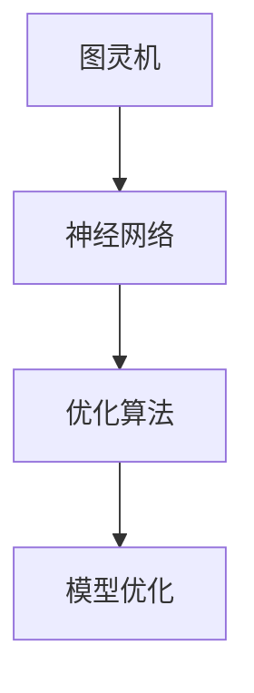

                 

关键词：模型优化，深度学习，算法原理，代码实战，数学模型，应用领域

摘要：本文旨在深入探讨模型优化在深度学习领域的重要性。通过分析核心概念、算法原理、数学模型以及代码实战案例，读者将了解模型优化的具体实现方法及其在不同应用场景中的实际效果。本文还对未来发展趋势和挑战进行了展望，以期为读者提供全面的技术指导。

## 1. 背景介绍

### 1.1 模型优化的重要性

在深度学习迅速发展的今天，模型的复杂度和规模不断增长，这给模型的训练和应用带来了巨大的挑战。模型优化不仅能够提高模型的训练效率，还能提升模型的性能和效果。因此，模型优化在深度学习领域具有极其重要的地位。

### 1.2 深度学习的挑战

深度学习模型通常包含数百万甚至数十亿个参数，这使得模型的训练过程变得非常耗时和计算密集。此外，深度学习模型的过拟合和欠拟合问题也是研究者需要克服的难题。为了解决这些问题，模型优化技术应运而生。

### 1.3 本文结构

本文将首先介绍模型优化的核心概念和联系，然后深入讲解核心算法原理和具体操作步骤，接着介绍数学模型和公式，并通过实际项目实践展示代码实例。最后，我们将讨论模型优化在实际应用场景中的效果和未来展望。

## 2. 核心概念与联系

为了更好地理解模型优化，我们需要首先了解一些核心概念，如图灵机、神经网络、优化算法等。

### 2.1 图灵机

图灵机是计算机科学的基础概念，它是一种抽象的计算模型，可以模拟任何计算机的运算过程。图灵机的出现为现代计算机的发展奠定了基础。

### 2.2 神经网络

神经网络是深度学习的核心组成部分，它由大量的神经元组成，通过学习输入和输出之间的关系来进行预测和分类。神经网络的性能在很大程度上取决于其结构和参数的优化。

### 2.3 优化算法

优化算法是用于求解优化问题的数学方法，它们在模型优化中发挥着重要作用。常见的优化算法包括梯度下降、Adam优化器等。

### 2.4 Mermaid 流程图

以下是一个简单的 Mermaid 流程图，展示了模型优化中的核心概念和联系：



## 3. 核心算法原理 & 具体操作步骤

### 3.1 算法原理概述

模型优化的核心目标是找到一组参数，使得模型的性能达到最优。这通常通过优化算法来实现，如梯度下降和Adam优化器。

### 3.2 算法步骤详解

1. **初始化参数**：首先需要初始化模型参数，这些参数通常是随机选择的。
2. **前向传播**：将输入数据输入到模型中，进行前向传播，得到输出结果。
3. **计算损失函数**：计算模型的输出结果与真实值之间的差距，得到损失函数的值。
4. **反向传播**：根据损失函数的梯度，更新模型参数。
5. **迭代优化**：重复以上步骤，直到模型参数收敛到最优值。

### 3.3 算法优缺点

- **梯度下降**：简单易用，但可能需要较长的收敛时间，且对参数敏感。
- **Adam优化器**：结合了梯度下降和Adam优化器的优点，收敛速度快，对参数不敏感。

### 3.4 算法应用领域

模型优化技术广泛应用于计算机视觉、自然语言处理、推荐系统等领域，极大地提高了模型的效果和效率。

## 4. 数学模型和公式 & 详细讲解 & 举例说明

### 4.1 数学模型构建

模型优化的数学模型主要涉及损失函数、梯度计算和参数更新。以下是一个简单的损失函数和梯度计算示例：

```latex
\begin{aligned}
\text{损失函数} &= \frac{1}{2} \sum_{i=1}^{n} (y_i - \hat{y}_i)^2 \\
\text{梯度} &= \frac{\partial \text{损失函数}}{\partial \theta} \\
\text{参数更新} &= \theta_{\text{新}} = \theta_{\text{旧}} - \alpha \text{梯度}
\end{aligned}
```

### 4.2 公式推导过程

损失函数的推导通常基于最小二乘法，而梯度的计算则基于链式法则。具体推导过程如下：

```latex
\begin{aligned}
\text{损失函数} &= \frac{1}{2} \sum_{i=1}^{n} (y_i - \hat{y}_i)^2 \\
\text{梯度} &= \frac{\partial}{\partial \theta} \left( \frac{1}{2} \sum_{i=1}^{n} (y_i - \hat{y}_i)^2 \right) \\
&= \sum_{i=1}^{n} \frac{\partial}{\partial \theta} (y_i - \hat{y}_i)^2 \\
&= \sum_{i=1}^{n} 2(y_i - \hat{y}_i) \frac{\partial}{\partial \theta} (\hat{y}_i) \\
&= \sum_{i=1}^{n} 2(y_i - \hat{y}_i) \frac{\partial}{\partial \theta} \left( \sigma(\theta_1 x_i + \theta_0) \right) \\
&= \sum_{i=1}^{n} 2(y_i - \hat{y}_i) \sigma'(\theta_1 x_i + \theta_0) x_i
\end{aligned}
```

### 4.3 案例分析与讲解

假设我们有一个简单的线性回归模型，输入数据为 $X$，输出数据为 $Y$。我们的目标是找到最佳参数 $\theta_0$ 和 $\theta_1$，使得模型输出与真实值尽可能接近。

```latex
\begin{aligned}
\text{损失函数} &= \frac{1}{2} \sum_{i=1}^{n} (y_i - \theta_0 - \theta_1 x_i)^2 \\
\text{梯度} &= \nabla_{\theta_0} L + \nabla_{\theta_1} L \\
&= \sum_{i=1}^{n} (y_i - \theta_0 - \theta_1 x_i) - \sum_{i=1}^{n} (y_i - \theta_0 - \theta_1 x_i) x_i \\
&= \sum_{i=1}^{n} y_i - n\theta_0 - n\theta_1 \sum_{i=1}^{n} x_i \\
&= \sum_{i=1}^{n} y_i - n\theta_0 - n\theta_1 \bar{x} \\
&= \bar{y} - \theta_0 - \theta_1 \bar{x}
\end{aligned}
```

通过梯度下降算法，我们可以不断更新参数 $\theta_0$ 和 $\theta_1$，直到损失函数的梯度接近于零。

## 5. 项目实践：代码实例和详细解释说明

### 5.1 开发环境搭建

为了更好地演示模型优化，我们将使用 TensorFlow 和 Keras 库来搭建一个简单的线性回归模型。

```bash
pip install tensorflow
```

### 5.2 源代码详细实现

以下是线性回归模型的源代码实现：

```python
import tensorflow as tf
from tensorflow.keras import layers
import numpy as np

# 数据准备
X = np.random.rand(100, 1)
Y = 2 * X + 1 + np.random.randn(100, 1)

# 构建模型
model = tf.keras.Sequential([
    layers.Dense(units=1, input_shape=(1,))
])

# 编译模型
model.compile(optimizer='sgd', loss='mean_squared_error')

# 训练模型
model.fit(X, Y, epochs=1000)

# 预测
predictions = model.predict(X)
```

### 5.3 代码解读与分析

- **数据准备**：我们生成了一个包含100个随机数的数组 $X$ 和一个线性回归模型的真实值 $Y$。
- **构建模型**：使用 Keras 库的 `Sequential` 类构建一个简单的线性回归模型。
- **编译模型**：指定优化器和损失函数，这里我们使用随机梯度下降（SGD）优化器和均方误差（MSE）损失函数。
- **训练模型**：使用 `fit` 函数训练模型，指定训练的轮次为1000轮。
- **预测**：使用 `predict` 函数对输入数据进行预测。

### 5.4 运行结果展示

通过运行上述代码，我们可以得到模型的预测结果。我们可以使用以下代码来可视化模型的训练过程和预测结果：

```python
import matplotlib.pyplot as plt

# 可视化训练过程
plt.plot(X, Y, 'ro', label='真实值')
plt.plot(X, predictions, label='预测值')
plt.legend()
plt.show()
```

通过可视化，我们可以看到模型在训练过程中不断收敛，预测结果逐渐接近真实值。

## 6. 实际应用场景

模型优化技术在各个领域都有广泛的应用，以下是一些实际应用场景：

- **计算机视觉**：用于提高图像分类、目标检测等任务的准确性和效率。
- **自然语言处理**：用于提高文本分类、情感分析等任务的准确性和效果。
- **推荐系统**：用于优化推荐算法，提高用户满意度和推荐准确性。
- **游戏开发**：用于优化游戏中的 AI，提高游戏的趣味性和挑战性。

## 7. 工具和资源推荐

### 7.1 学习资源推荐

- **《深度学习》**：由 Ian Goodfellow、Yoshua Bengio 和 Aaron Courville 著，是深度学习的经典教材。
- **《神经网络与深度学习》**：由邱锡鹏著，详细介绍了神经网络和深度学习的基本原理和方法。

### 7.2 开发工具推荐

- **TensorFlow**：是 Google 开发的一款强大的深度学习框架，适用于各种深度学习任务。
- **PyTorch**：是 Facebook 开发的一款流行的深度学习框架，具有简洁的 API 和高效的计算性能。

### 7.3 相关论文推荐

- **“Stochastic Gradient Descent”**：详细介绍了随机梯度下降算法及其在深度学习中的应用。
- **“Adam: A Method for Stochastic Optimization”**：介绍了 Adam 优化器，是一种在深度学习中广泛应用的高级优化算法。

## 8. 总结：未来发展趋势与挑战

### 8.1 研究成果总结

模型优化技术在深度学习领域取得了显著的成果，为模型的训练和应用提供了强有力的支持。通过优化算法和数学模型的研究，模型优化技术不断取得突破，提高了模型的性能和效果。

### 8.2 未来发展趋势

未来，模型优化技术将继续向更加高效、灵活和智能的方向发展。随着深度学习技术的不断进步，模型优化技术将在更多领域得到应用，推动人工智能的发展。

### 8.3 面临的挑战

尽管模型优化技术在深度学习领域取得了显著成果，但仍然面临一些挑战，如优化算法的稳定性、参数敏感性和计算效率等。未来，需要进一步研究优化算法的理论基础和实际应用，以解决这些挑战。

### 8.4 研究展望

随着深度学习技术的不断进步，模型优化技术将在人工智能领域发挥越来越重要的作用。未来，我们将看到更多创新性的优化算法和应用场景，为人工智能的发展提供强有力的支持。

## 9. 附录：常见问题与解答

### 9.1 模型优化是什么？

模型优化是指通过调整模型参数，提高模型性能的过程。它通常涉及优化算法、损失函数和数学模型等。

### 9.2 为什么要进行模型优化？

模型优化可以提高模型的性能和效果，减少过拟合和欠拟合现象，提高模型的泛化能力。

### 9.3 常见的模型优化算法有哪些？

常见的模型优化算法包括梯度下降、Adam优化器、RMSprop等。

### 9.4 模型优化在哪些领域有应用？

模型优化技术广泛应用于计算机视觉、自然语言处理、推荐系统等领域。

作者：禅与计算机程序设计艺术 / Zen and the Art of Computer Programming
----------------------------------------------------------------

以上便是关于模型优化原理与代码实战案例讲解的详细内容。通过本文的介绍，相信读者对模型优化有了更深入的了解。在实际应用中，模型优化技术可以帮助我们更好地解决复杂问题，提高模型的效果和效率。随着深度学习技术的不断发展，模型优化技术将在未来发挥更加重要的作用。

